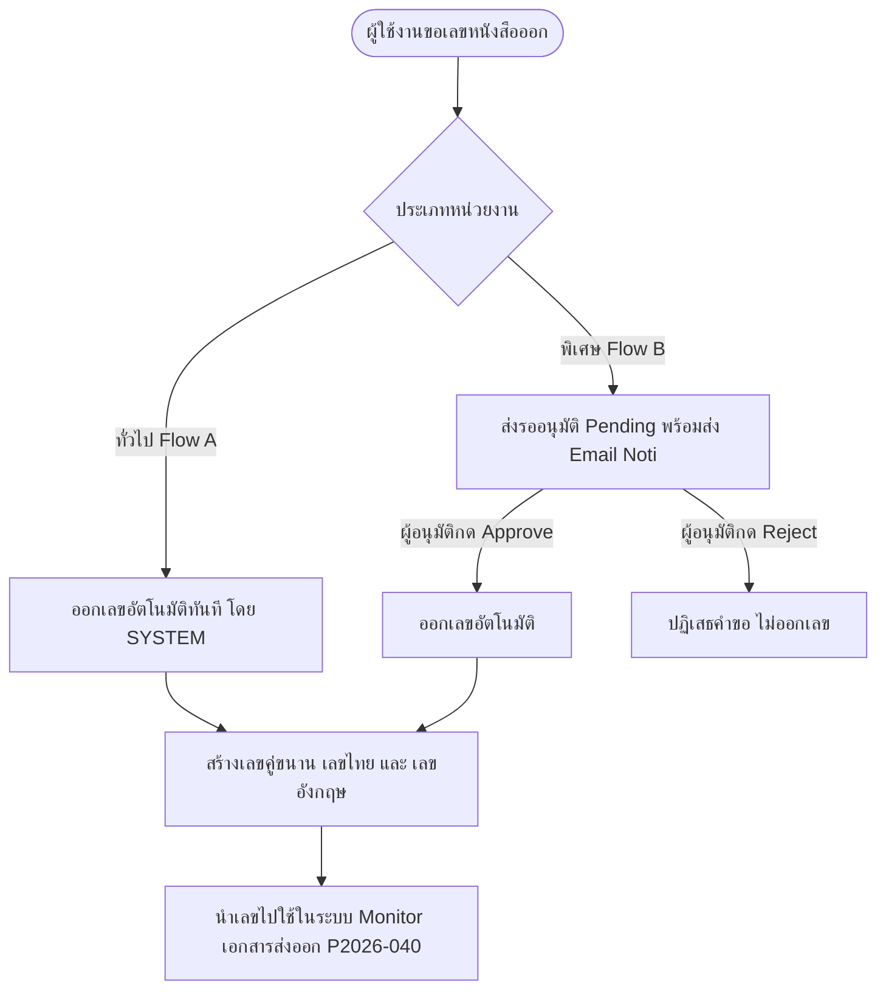
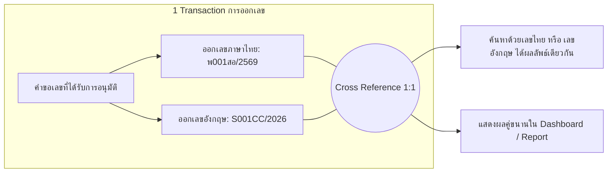
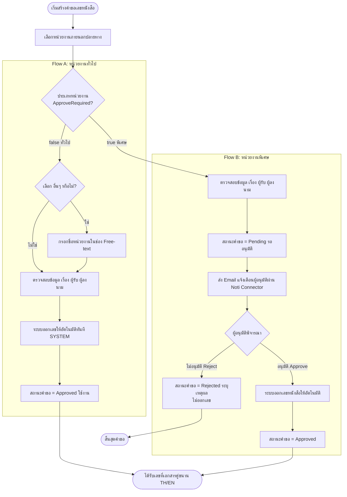
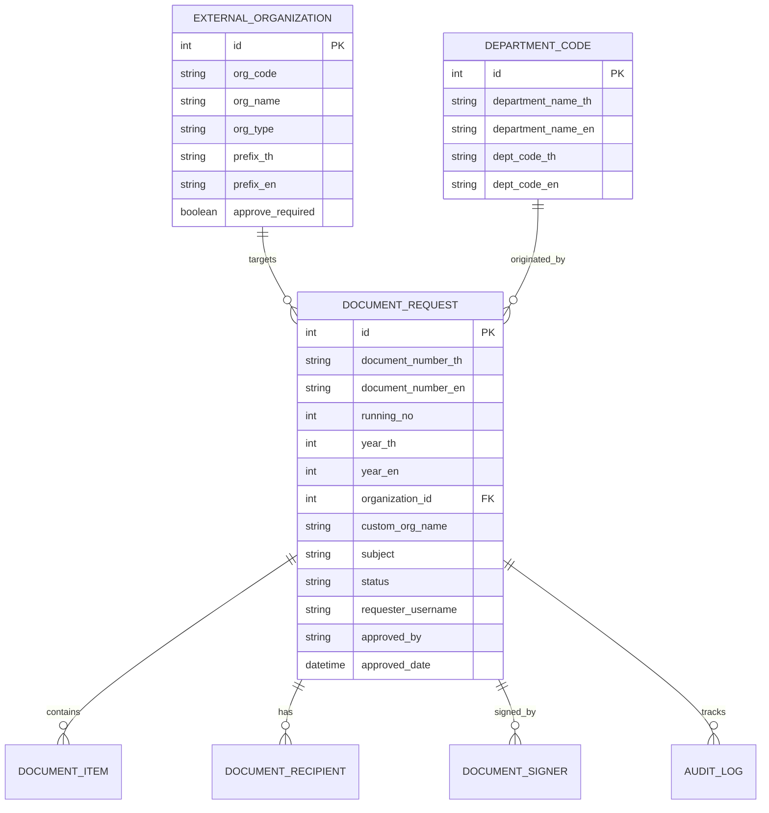
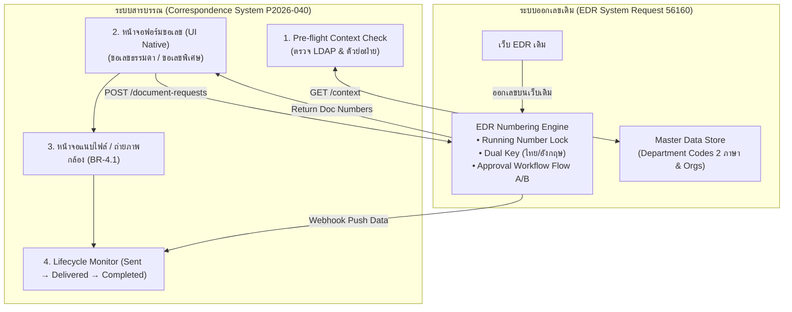
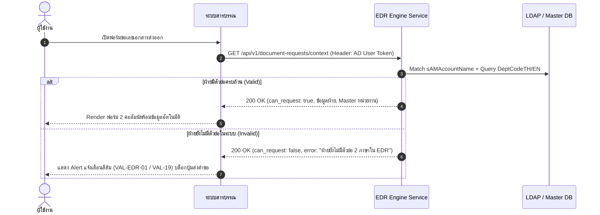
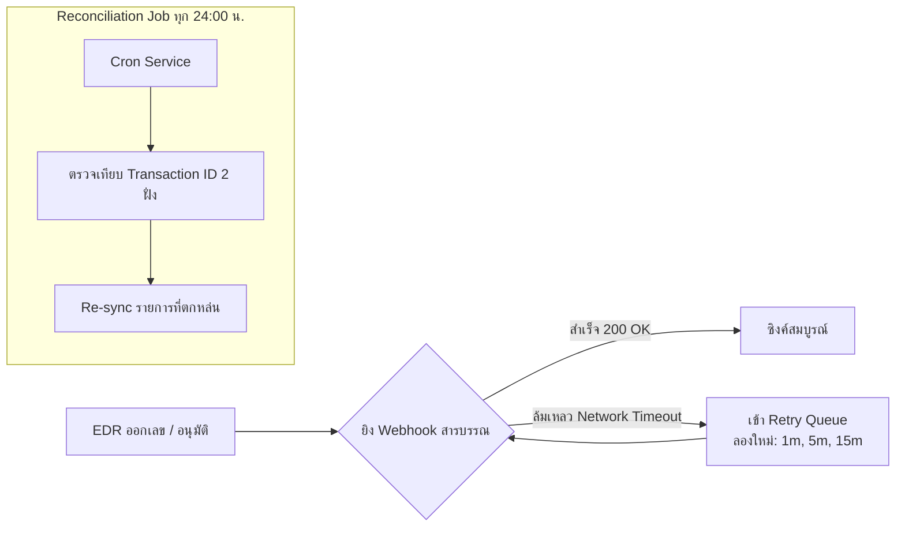
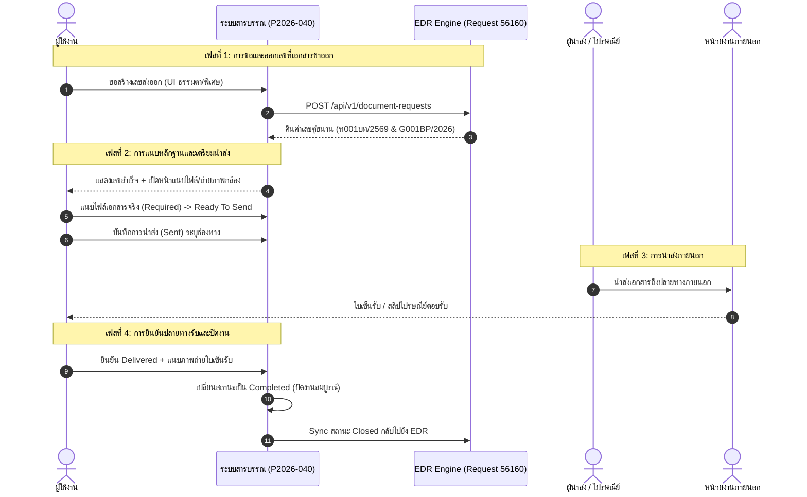

# เอกสารวิเคราะห์ระบบออกเลขที่เอกสารขาออก (EDR System — Request 56160)

**Document Type:** Software Requirement Specification — Analysis (SRS Analysis)  
**Project:** Request 56160 ระบบออกเลขที่เอกสาร ของ บริษัท เทเวศประกันภัย จำกัด (มหาชน)  
**Form Code:** F-BP-009 (F-BP-009-R56160)  
**Source Document:** `E:\DVS\Project\DVS_Correspondence_system\EDR_system\F-BP-009-R56160.docx`  
**Related System:** Correspondence Monitoring System (ระบบ Monitor สถานะเอกสารรับเข้า–ส่งออก P2026-040)  
**Focus Area:** **พิมพ์เขียวสถาปัตยกรรมการออกเลขที่เอกสารขาออก และการทำงานร่วมกันระหว่าง 2 ระบบ (Dual-System Interoperability & Data Parity Blueprint)**  
**Version:** 1.2.0  
**Prepared by:** Business Process Development Department / BA Sub-Agent  
**Analysis Date:** 21 สิงหาคม 2026  

---

## สารบัญ

1. [ภาพรวมและวัตถุประสงค์ของการออกเลขเอกสารขาออก](#1-ภาพรวมและวัตถุประสงค์ของการออกเลขเอกสารขาออก)
2. [โครงสร้างและรูปแบบเลขที่เอกสาร (Outgoing Numbering Format)](#2-โครงสร้างและรูปแบบเลขที่เอกสาร-outgoing-numbering-format)
3. [กลไกการออกเลขคู่ขนาน 2 ภาษา (Dual Numbering: ไทย & อังกฤษ)](#3-กลไกการออกเลขคู่ขนาน-2-ภาษา-dual-numbering-ไทย--อังกฤษ)
4. [กระบวนการออกเลขเอกสาร 2 รูปแบบ และข้อกำหนดหน้าจอคำขอ](#4-กระบวนการออกเลขเอกสาร-2-รูปแบบ-และข้อกำหนดหน้าจอคำขอ)
   - 4.1 [Flow A: สำหรับหน่วยงานทั่วไป (General Organization — Auto Generate)](#41-flow-a-สำหรับหน่วยงานทั่วไป-general-organization--auto-generate)
   - 4.2 [Flow B: สำหรับหน่วยงานพิเศษ (Special Organization — Approval Required)](#42-flow-b-สำหรับหน่วยงานพิเศษ-special-organization--approval-required)
   - 4.3 [ข้อกำหนดหน้าจอสร้างคำขอ — พิเศษ (Special Request UI Specification)](#43-ข้อกำหนดหน้าจอสร้างคำขอ--พิเศษ-special-request-ui-specification)
   - 4.4 [ข้อกำหนดหน้าจอสร้างคำขอ — ธรรมดา / ทั่วไป (General Request UI Specification)](#44-ข้อกำหนดหน้าจอสร้างคำขอ--ธรรมดา--ทั่วไป-general-request-ui-specification)
5. [การจัดการข้อมูลหลักสำหรับการออกเลข (Master Data Configuration)](#5-การจัดการข้อมูลหลักสำหรับการออกเลข-master-data-configuration)
6. [กฎการแก้ไขและการยกเลิกเลขที่เอกสาร (Modification & Cancellation Rules)](#6-กฎการแก้ไขและการยกเลิกเลขที่เอกสาร-modification--cancellation-rules)
7. [Business Rules Catalog (การออกเลขเอกสารขาออก)](#7-business-rules-catalog-การออกเลขเอกสารขาออก)
8. [Validation Rules (กฎการตรวจสอบข้อมูล)](#8-validation-rules-กฎการตรวจสอบข้อมูล)
9. [Data Model & Data Dictionary ที่เกี่ยวข้องกับเลขที่เอกสาร](#9-data-model--data-dictionary-ที่เกี่ยวข้องกับเลขที่เอกสาร)
10. [สถาปัตยกรรมการทำงานร่วมกันแบบสมบูรณ์ (Complete 2-Way Interoperability Architecture)](#10-สถาปัตยกรรมการทำงานร่วมกันแบบสมบูรณ์-complete-2-way-interoperability-architecture)
    - 10.1 [Pre-flight Context Check API (การตรวจสิทธิ์และฝ่ายก่อนเปิดฟอร์ม)](#101-pre-flight-context-check-api-การตรวจสิทธิ์และฝ่ายก่อนเปิดฟอร์ม)
    - 10.2 [Data Parity & Shared Entity Mapping Matrix](#102-data-parity--shared-entity-mapping-matrix)
    - 10.3 [API Contract Specifications (ชุด API ทั้ง 5 เส้น)](#103-api-contract-specifications-ชุด-api-ทั้ง-5-เส้น)
    - 10.4 [กลไกความปลอดภัย Fail-safe, Retry Queue และ Daily Reconciliation](#104-กลไกความปลอดภัย-fail-safe-retry-queue-และ-daily-reconciliation)
11. [จุดเชื่อมต่อกับระบบติดตามสถานะเอกสารส่งออก (Integration with P2026-040)](#11-จุดเชื่อมต่อกับระบบติดตามสถานะเอกสารส่งออก-integration-with-p2026-040)

---

## 1. ภาพรวมและวัตถุประสงค์ของการออกเลขเอกสารขาออก

### 1.1 ที่มาและปัญหาเดิม (As-Is Problem)
1. **การขอเลขด้วยมือผ่านหลายช่องทาง:** แต่ละฝ่ายที่มีความประสงค์ออกหนังสือภายนอก (เช่น หนังสือถึงหน่วยงานราชการ สมาคม หรือคู่ค้า) ต้องติดต่อขอเลขจากฝ่ายสื่อสารองค์กรผ่าน Email หรือโทรศัพท์
2. **การบันทึกข้อมูลใน Excel:** เจ้าหน้าที่ต้องเปิดไฟล์ Excel เพื่อค้นหาเลขล่าสุดและกรอกเลขด้วยมือ (Manual Running Number)
3. **ปัญหาเลขซ้ำซ้อนและขาดการรวมศูนย์:** ไม่มีระบบตรวจสอบเลขซ้ำอัตโนมัติ เกิดความเสี่ยงเรื่องเลขชนกัน ข้อมูลไม่เป็นปัจจุบัน และไม่สามารถติดตาม Transaction ย้อนหลังได้
4. **ไม่มีระบบอนุมัติที่ชัดเจน:** หนังสือบางประเภทที่มีความสำคัญสูง (หน่วยงานพิเศษ) ไม่มี Workflow การตรวจสอบและอนุมัติจากผู้มีอำนาจก่อนการออกเลข

### 1.2 ระบบใหม่ (To-Be EDR System — Request 56160)
ระบบ EDR (Electronic Document Registration) ถูกพัฒนาเป็น **Web Application รวมศูนย์การออกเลขที่เอกสารส่งออกภายนอกของทั้งองค์กร** โดยมีจุดเด่นคือ:
- **Centralized Running Number Engine:** ออกเลขที่เอกสารอัตโนมัติ ไม่ซ้ำซ้อน แยกหมวดหมู่และปี พ.ศ./ค.ศ.
- **2-Tier Flow Generation:** รองรับทั้งการออกเลขอัตโนมัติทันที (หน่วยงานทั่วไป) และการออกเลขหลังผ่านการอนุมัติ (หน่วยงานพิเศษ)
- **Dual Language Primary Key:** สร้างเลขที่เอกสารทั้งภาษาไทยและภาษาอังกฤษคู่ขนานกันใน Transaction เดียวกัน
- **Audit Trail & Governance:** บันทึกประวัติการขอเลข การแก้ไข และการยกเลิกลงใน Audit Log พร้อมการแจ้งเตือนผ่าน Noti Connector



---

## 2. โครงสร้างและรูปแบบเลขที่เอกสาร (Outgoing Numbering Format)

### 2.1 ไวยากรณ์โครงสร้างเลขที่เอกสาร (Numbering Syntax)
เลขที่เอกสารส่งออกในระบบถูกกำหนดขึ้นตามโครงสร้างมาตรฐานดังนี้:

$$\text{Document Number} = \text{\{CategoryPrefix\}} + \text{\{Running: 3 หลัก\}} + \text{\{DeptCode\}} + \text{/} + \text{\{Year\}}$$

| องค์ประกอบ | คำอธิบาย | ตัวอย่างภาษาไทย | ตัวอย่างภาษาอังกฤษ |
|---|---|---|---|
| **CategoryPrefix** | ตัวอักษรนำหน้าหมวดหมู่/ประเภทหน่วยงาน (ดึงจาก Master Data Category) | `พ` (พิเศษ), `ท` (ทั่วไป) | `S` (Special), `G` (General) |
| **Running Number** | เลขลำดับความยาว **3 หลัก** (Zero-padded `001` - `999`) | `001`, `002`, `015` | `001`, `002`, `015` |
| **DeptCode** | รหัสตัวย่อฝ่ายของผู้ขอ (ดึงจาก Master Data DepartmentCode) | `สอ`, `กส`, `พศ`, `บท` | `CC`, `LA`, `IT`, `BP` |
| **Delimiter** | เครื่องหมายคั่นระหว่างฝ่ายและปี | `/` | `/` |
| **Year** | ปีที่ทำการออกเลขเอกสาร | `2569` (ปี พ.ศ. 4 หลัก) | `2026` (ปี ค.ศ. 4 หลัก) |

### 2.2 ตัวอย่างเลขที่เอกสารที่สมบูรณ์

```
┌────────────────────────────────────────────────────────┐
│ รูปแบบภาษาไทย:  พ 0 0 1 ส อ / 2 5 6 9                 │
│                 │   │    │      │                      │
│                 │   │    │      └─ ปี พ.ศ. 4 หลัก        │
│                 │   │    └──────── ตัวย่อฝ่ายภาษาไทย     │
│                 │   └───────────── Running Number 3 หลัก│
│                 └───────────────── ตัวย่อประเภทหน่วยงาน   │
└────────────────────────────────────────────────────────┘

┌────────────────────────────────────────────────────────┐
│ รูปแบบภาษาอังกฤษ: S 0 0 1 C C / 2 0 2 6                 │
│                   │   │    │      │                    │
│                   │   │    │      └─ ปี ค.ศ. 4 หลัก      │
│                   │   │    └──────── ตัวย่อฝ่ายภาษาอังกฤษ │
│                   │   └───────────── Running Number 3 หลัก│
│                   └───────────────── ตัวย่อประเภทภาษาอังกฤษ │
└────────────────────────────────────────────────────────┘
```

### 2.3 กฎขอบเขตและการนับ Running Number (Scope & Reset Rules)
1. **แยก Running Number ตามประเภทหน่วยงาน (Separated by OrgType / Category):**
   - เลขลำดับของหน่วยงานทั่วไป (General) และหน่วยงานพิเศษ (Special) จะแยกตัวนับ (Counter) อิสระจากกัน
   - ตัวอย่าง: ในปีเดียวกัน สามารถมี `ท001สอ/2569` และ `พ001สอ/2569` เกิดขึ้นพร้อมกันได้
2. **การรีเซ็ตเลขตามรอบปี (Yearly Reset):**
   - เมื่อขึ้นปีปฏิทินใหม่ (1 มกราคม ของทุกปี) ตัวนับ Running Number ของทุกหมวดหมู่จะถูก Reset กลับไปเริ่มต้นที่ `001` ใหม่เสมอ
3. **Atomic Sequence Lock:**
   - การ Generate เลขต้องทำผ่าน Database Transaction ที่มี Concurrency Control เพื่อรับประกันว่าไม่มีเลขซ้ำซ้อนแม้มีการกดขอเลขพร้อมกันในเสี้ยววินาที

---

## 3. กลไกการออกเลขคู่ขนาน 2 ภาษา (Dual Numbering: ไทย & อังกฤษ)

ตามข้อกำหนดส่วนต่อขยาย (Change Request — CR) ของระบบ EDR:

### 3.1 ความจำเป็นของการออกเลข 2 ภาษา
เนื่องจากบริษัท เทเวศประกันภัย จำกัด (มหาชน) มีการติดต่อกับหน่วยงานทั้งในประเทศและต่างประเทศ รวมถึงเอกสารสัญญาที่ต้องใช้รหัสภาษาอังกฤษ ระบบจึงต้องสร้างเลขที่เอกสารทั้ง 2 ภาษาออกมาพร้อมกันเสมอ

### 3.2 Dual Primary Key & Cross Reference Architecture
- ทุก Transaction การออกเลข 1 ครั้ง จะสร้าง **รหัสเอกสาร 2 ชุดควบคู่กัน**:
  - `DocumentNumberTH` (เช่น `พ001สอ/2569`)
  - `DocumentNumberEN` (เช่น `S001CC/2026`)
- ทั้งสองค่าจะถูกจัดเก็บในฐานข้อมูลเป็น Primary Key / Alternate Unique Key ที่เชื่อมโยงถึงกันแบบ 1:1 เสมอ
- **การค้นหา (Cross Search):** ผู้ใช้งานสามารถพิมพ์ค้นหาด้วยเลขไทยหรือเลขอังกฤษก็ได้ ระบบจะดึงข้อมูลเอกสารฉบับเดียวกันขึ้นมาแสดง
- **การแสดงผล:** หน้าจอ Dashboard, รายการเอกสาร, หน้ารายละเอียด และรายงาน Excel จะแสดงทั้งเลขภาษาไทยและภาษาอังกฤษคู่กันเสมอ



---

## 4. กระบวนการออกเลขเอกสาร 2 รูปแบบ และข้อกำหนดหน้าจอคำขอ

ระบบแบ่งกระบวนการออกเลขออกเป็น 2 รูปแบบหลัก (Flow A และ Flow B) โดยจำแนกตามคุณสมบัติ `ApproveRequired` ของหน่วยงานภายนอกปลายทาง:



---

### 4.1 Flow A: สำหรับหน่วยงานทั่วไป (General Organization — Auto Generate)
1. **Trigger:** ผู้ใช้เลือกหน่วยงานภายนอกที่มี `ApproveRequired = false`
2. **Free-text Support (CR):** หากไม่มีชื่อหน่วยงานในระบบ ผู้ใช้สามารถเลือกตัวเลือก `"อื่นๆ"` และพิมพ์ชื่อหน่วยงานในช่อง Free-text ได้ (ช่องนี้เป็น Mandatory)
3. **Validation Check:**
   - ฝ่ายของผู้ขอต้องมีตัวย่อภาษาไทยและอังกฤษ (`DepartmentCode`) ในระบบ
   - ระบุชื่อเรื่อง (`Subject`)
   - ระบุผู้รับเอกสาร (`DocumentRecipient`) อย่างน้อย 1 คน
   - ระบุผู้ลงนาม (`DocumentSigner`) อย่างน้อย 1 คน
4. **Execution:**
   - ระบบดำเนินการ Generate Running Number และสร้างเลขที่เอกสาร (ไทย + อังกฤษ) ทันที
   - กำหนดสถานะเป็น `Approved` (ใช้งาน)
   - ระบุผู้ดำเนินการ (Actor) เป็น `SYSTEM`
   - บันทึก Audit Log: `Action = "ขอเลข"`, `Status = "ใช้งาน"`

---

### 4.2 Flow B: สำหรับหน่วยงานพิเศษ (Special Organization — Approval Required)
1. **Trigger:** ผู้ใช้เลือกหน่วยงานภายนอกที่มี `ApproveRequired = true` (เช่น หน่วยงานกำกับดูแล องค์กรภาครัฐพิเศษ หรือสมาคมประกันภัย)
2. **Pending State:**
   - ระบบบันทึกคำขอโดยยัง **ไม่ออกเลขหนังสือ** (Running Number ยังไม่ถูกจองหรือตัดจ่าย)
   - สถานะคำขอตั้งเป็น `Pending` (รออนุมัติ)
   - บันทึก Audit Log: `Action = "ขอเลข"`, `Status = "รออนุมัติ"`
3. **Notification Integration:**
   - ระบบส่ง Email แจ้งเตือนไปยังผู้อนุมัติผ่าน **Noti Connector API** (Bearer Token, Template: `EDR`)
   - หากหน่วยงานทั่วไปต้องผ่านฝ่าย: ส่งถึง `DepartmentApprover` ของฝ่ายนั้น
   - หากเป็นหน่วยงานพิเศษ: ส่งถึง `SpecialApprover` ทุกคนพร้อมกัน
   - เนื้อหา Email มีรายละเอียดผู้ขอ เรื่อง หน่วยงาน และ Link เข้าระบบโดยตรง
   - มีระบบ Fail-safe: หากส่ง Email ล้มเหลว คำขอยังคงถูกบันทึกได้ตามปกติ
4. **Approval & Number Issuance:**
   - **กรณี Approve:** ผู้อนุมัติกดอนุมัติ -> ระบบคำนวณและ Generate เลขที่เอกสาร (ไทย + อังกฤษ) ให้ทันที -> สถานะเปลี่ยนเป็น `Approved` -> บันทึก Audit Log: `Action = "อนุมัติ"`
   - **กรณี Reject:** ผู้อนุมัติกดปฏิเสธพร้อมระบุเหตุผลบังคับ -> สถานะเปลี่ยนเป็น `Rejected` -> **ไม่มีการออกเลขที่เอกสาร** -> บันทึก Audit Log: `Action = "ไม่อนุมัติ"`

---

### 4.3 ข้อกำหนดหน้าจอสร้างคำขอ — พิเศษ (Special Request UI Specification)

หน้าจอนี้ใช้สำหรับผู้ใช้งานที่ต้องการสร้างคำขอออกเลขหนังสือภายนอกสำหรับหน่วยงานพิเศษ (Flow B) ซึ่งต้องผ่านกระบวนการอนุมัติก่อนออกเลข

```
┌────────────────────────────────────────────────────────────────────────────────────────────────────────┐
│ หน้าหลัก > ขอสร้างเลขพิเศษ > สร้างคำขอ                                                (M) Mr. Teerapat  │
│                                                                                                        │
│ สร้างคำขอ — พิเศษ [พิเศษ] (Badge สีชมพู)                                                                │
├─────────────────────────────────────────────────────────┬──────────────────────────────────────────────┤
│ [ข้อมูลที่ต้องกรอก]                                      │ [ข้อมูลอัตโนมัติ]                             │
│                                                         │                                              │
│ หน่วยงานภายนอก *                                         │ ผู้สร้าง:                                      │
│ [ เลือก... (Dropdown แสดงเฉพาะหน่วยงานพิเศษ)        ▼ ]  │ Mr. Teerapat Tiangkool                       │
│                                                         │                                              │
│ ชื่อเรื่อง *                                             │ ฝ่าย:                                         │
│ [ กรอกชื่อเรื่องของหนังสือ...                         ] │ ฝ่ายพัฒนากระบวนการทางธุรกิจ                    │
│                                                         │                                              │
│ หมายเหตุ                                                │ วันที่:                                       │
│ [ กรอกหมายเหตุเพิ่มเติม...                           ] │ 21/08/2026                                   │
│                                                         │                                              │
│ รายการเอกสาร                         [+ เพิ่มรายการ]     │ ประเภท:                                      │
│ ┌─────────────────────────────────────────────────────┐ │ [ พิเศษ ] (Badge)                            │
│ │ (ตารางรายการเอกสาร หรือ ข้อความ "กดปุ่ม + เพิ่มรายการ")│ └──────────────────────────────────────────────┘
│ └─────────────────────────────────────────────────────┘                                                │
│                                                                                                        │
│ ผู้รับเอกสาร *                       [+ เพิ่มผู้รับ]                                                   │
│ ┌─────────────────────────────────────────────────────┐                                                │
│ │ (ตารางผู้รับ หรือ ข้อความ "กดปุ่ม + เพิ่มผู้รับ")    │                                                │
│ └─────────────────────────────────────────────────────┘                                                │
│                                                                                                        │
│ ผู้ลงนาม *                           [+ เพิ่มผู้ลงนาม]                                                 │
│ ┌─────────────────────────────────────────────────────┐                                                │
│ │ (ตารางผู้ลงนาม หรือ ข้อความ "กดปุ่ม + เพิ่มผู้ลงนาม")│                                                │
│ └─────────────────────────────────────────────────────┘                                                │
│                                                                                                        │
├────────────────────────────────────────────────────────────────────────────────────────────────────────┤
│                                                            [  ยกเลิก  ]   [ ✈ ส่งคำขอ (สีกรมท่า) ]     │
└────────────────────────────────────────────────────────────────────────────────────────────────────────┘
```

#### รายละเอียดฟิลด์และองค์ประกอบหน้าจอ (Field Specifications):
1. **ส่วนหัวและ Breadcrumb:**
   - Breadcrumb: `หน้าหลัก > ขอสร้างเลขพิเศษ > สร้างคำขอ`
   - Title: `สร้างคำขอ — พิเศษ` พร้อม Badge สีชมพู/แดงระบุ `พิเศษ`
2. **คอลัมน์ซ้าย: ข้อมูลที่ต้องกรอก (Input Form):**
   - `หน่วยงานภายนอก *` (Mandatory Dropdown): กรองแสดงเฉพาะหน่วยงานที่มี `IsSpecial = true` / `ApproveRequired = true`
   - `ชื่อเรื่อง *` (Mandatory Single-line Input): ระบุชื่อเรื่องของหนังสือ
   - `หมายเหตุ` (Optional Multi-line Textarea): บันทึกรายละเอียดบริบทของเอกสาร
   - `รายการเอกสาร` (Document Items Table): ปุ่มสีทอง `+ เพิ่มรายการ` สำหรับเพิ่มเอกสารแนบ/เอกสารย่อย (รายละเอียด, ผู้รับ, หมายเหตุ, ลำดับ)
   - `ผู้รับเอกสาร *` (Mandatory Recipients Table): ปุ่มสีทอง `+ เพิ่มผู้รับ` (บังคับอย่างน้อย 1 คน: ระบุชื่อ-นามสกุล, ตำแหน่ง, ฝ่าย, ลำดับ)
   - `ผู้ลงนาม *` (Mandatory Signers Table): ปุ่มสีทอง `+ เพิ่มผู้ลงนาม` (บังคับอย่างน้อย 1 คน: ระบุชื่อ-นามสกุล, ตำแหน่ง, ลำดับ)
3. **คอลัมน์ขวา: ข้อมูลอัตโนมัติ (Read-only System Info Card):**
   - `ผู้สร้าง`: ดึงจาก Active Directory User เช่น `Mr. Teerapat Tiangkool`
   - `ฝ่าย`: ดึงฝ่ายที่สังกัด เช่น `ฝ่ายพัฒนากระบวนการทางธุรกิจ`
   - `วันที่`: วันที่ปัจจุบันที่สร้างคำขอ (`DD/MM/YYYY`)
   - `ประเภท`: Badge แสดง `พิเศษ`
4. **ปุ่มการทำงานด้านล่าง (Action Controls):**
   - ปุ่ม `ยกเลิก` (Secondary Button): ล้างค่าและกลับสู่หน้ารายการ
   - ปุ่ม `ส่งคำขอ` (Primary Button สีกรมท่า `#012169` ไอคอนเครื่องบินกระดาษ): ตรวจสอบ Validation และส่งคำขอเข้าสู่สถานะ `Pending` พร้อมยิง Email Noti

---

### 4.4 ข้อกำหนดหน้าจอสร้างคำขอ — ธรรมดา / ทั่วไป (General Request UI Specification)

หน้าจอนี้ใช้สำหรับผู้ใช้งานที่ต้องการสร้างคำขอออกเลขหนังสือภายนอกสำหรับหน่วยงานทั่วไป (Flow A) ซึ่งระบบจะออกเลขให้ทันทีโดยอัตโนมัติ

```
┌────────────────────────────────────────────────────────────────────────────────────────────────────────┐
│ หน้าหลัก > ขอสร้างเลขธรรมดา > สร้างคำขอ                                               (M) Mr. Teerapat  │
│                                                                                                        │
│ สร้างคำขอ — ธรรมดา [ธรรมดา] (Badge สีฟ้า)                                                              │
├─────────────────────────────────────────────────────────┬──────────────────────────────────────────────┤
│ [ข้อมูลที่ต้องกรอก]                                      │ [ข้อมูลอัตโนมัติ]                             │
│                                                         │                                              │
│ หน่วยงานภายนอก *                                         │ ผู้สร้าง:                                      │
│ [ เลือก... (Dropdown ทั่วไป + มีตัวเลือก "อื่นๆ")   ▼ ]  │ Mr. Teerapat Tiangkool                       │
│                                                         │                                              │
│ *กรณีเลือก "อื่นๆ" จะแสดงช่อง Free-text:                 │ ฝ่าย:                                         │
│ [ ระบุชื่อหน่วยงานภายนอก (Mandatory Free-text)        ] │ ฝ่ายพัฒนากระบวนการทางธุรกิจ                    │
│                                                         │                                              │
│ ชื่อเรื่อง *                                             │ วันที่:                                       │
│ [ กรอกชื่อเรื่องของหนังสือ...                         ] │ 21/08/2026                                   │
│                                                         │                                              │
│ หมายเหตุ                                                │ ประเภท:                                      │
│ [ กรอกหมายเหตุเพิ่มเติม...                           ] │ [ ธรรมดา ] (Badge)                           │
│                                                         │ └──────────────────────────────────────────────┘
│ รายการเอกสาร                         [+ เพิ่มรายการ]     │                                              │
│ ┌─────────────────────────────────────────────────────┐ │                                              │
│ │ (ตารางรายการเอกสาร หรือ ข้อความ "กดปุ่ม + เพิ่มรายการ")│ │                                              │
│ └─────────────────────────────────────────────────────┘ │                                              │
│                                                         │                                              │
│ ผู้รับเอกสาร *                       [+ เพิ่มผู้รับ]     │                                              │
│ ┌─────────────────────────────────────────────────────┐ │                                              │
│ │ (ตารางผู้รับ หรือ ข้อความ "กดปุ่ม + เพิ่มผู้รับ")    │ │                                              │
│ └─────────────────────────────────────────────────────┘ │                                              │
│                                                         │                                              │
│ ผู้ลงนาม *                           [+ เพิ่มผู้ลงนาม]   │                                              │
│ ┌─────────────────────────────────────────────────────┐ │                                              │
│ │ (ตารางผู้ลงนาม หรือ ข้อความ "กดปุ่ม + เพิ่มผู้ลงนาม")│ │                                              │
│ └─────────────────────────────────────────────────────┘ │                                              │
│                                                         │                                              │
├─────────────────────────────────────────────────────────┴──────────────────────────────────────────────┤
│                                                            [  ยกเลิก  ]   [ ✈ ส่งคำขอ (สีกรมท่า) ]     │
└────────────────────────────────────────────────────────────────────────────────────────────────────────┘
```

#### รายละเอียดฟิลด์และองค์ประกอบหน้าจอ (Field Specifications):
1. **ส่วนหัวและ Breadcrumb:**
   - Breadcrumb: `หน้าหลัก > ขอสร้างเลขธรรมดา > สร้างคำขอ`
   - Title: `สร้างคำขอ — ธรรมดา` พร้อม Badge สีฟ้าอ่อนระบุ `ธรรมดา`
2. **คอลัมน์ซ้าย: ข้อมูลที่ต้องกรอก (Input Form):**
   - `หน่วยงานภายนอก *` (Mandatory Dropdown): กรองแสดงหน่วยงานทั่วไป และมีตัวเลือก `"อื่นๆ"`
   - `ระบุชื่อหน่วยงาน (Free-text)`: แสดงขึ้นมาเมื่อเลือก "อื่นๆ" เป็นฟิลด์ Mandatory ป้องกันข้อมูลว่าง
   - `ชื่อเรื่อง *`, `หมายเหตุ`, `รายการเอกสาร`, `ผู้รับเอกสาร *`, `ผู้ลงนาม *`: ฟิลด์และปุ่มการทำงานแบบเดียวกันกับหน้าขอเลขพิเศษ
3. **คอลัมน์ขวา: ข้อมูลอัตโนมัติ (Read-only System Info Card):**
   - `ผู้สร้าง`, `ฝ่าย`, `วันที่`, และ Badge แสดง `ธรรมดา`
4. **พฤติกรรมเมื่อกดปุ่ม "ส่งคำขอ":**
   - ตรวจสอบ Validation ครบถ้วน -> ระบบ **ออกเลขที่เอกสาร (ไทย + อังกฤษ) ให้ทันที** -> สถานะเปลี่ยนเป็น `Approved` ทันที -> แสดงหน้าต่างสำเร็จพร้อมเลขที่เอกสารที่ได้รับ

---

## 5. การจัดการข้อมูลหลักสำหรับการออกเลข (Master Data Configuration)

เพื่อให้ระบบออกเลขที่เอกสารทำงานได้อย่างถูกต้อง Admin จะต้องตั้งค่า Master Data 4 ส่วนหลัก:

### 5.1 การจัดการตัวย่อฝ่าย (Department Code Management — 2 ภาษา)
- ฝ่ายทุกฝ่ายในระบบต้องมีตัวย่อทั้งภาษาไทยและภาษาอังกฤษครบถ้วน
- หากฝ่ายใดยังไม่มีการตั้งค่าตัวย่อครบ 2 ภาษา ผู้ใช้งานในฝ่ายนั้น **จะไม่สามารถขอเลขเอกสารได้** (ระบบจะบล็อกด้วย Validation)
- ตัวอย่างข้อมูล Master:
  | ชื่อฝ่าย (ไทย) | Department Name (EN) | ตัวย่อไทย (`DeptCodeTH`) | ตัวย่ออังกฤษ (`DeptCodeEN`) |
  |---|---|:---:|:---:|
  | สำนักบริหารงานกรรมการสื่อสารองค์กรและลูกค้าสัมพันธ์ | Corporate Communication | `สอ` | `CC` |
  | สำนักนิติกรรมประกันภัย / ฝ่ายกฎหมาย | Legal Affairs | `กส` | `LA` |
  | ฝ่ายพัฒนาระบบสารสนเทศ | Information Technology System Dev | `พศ` | `IT` |
  | ฝ่ายพัฒนากระบวนการทางธุรกิจ | Business Process Development | `บท` | `BP` |
  | ฝ่ายเทคโนโลยี | Information Technology Infrastructure | `ทน` | `TI` |

### 5.2 การจัดการประเภทหน่วยงานและหมวดหมู่ (Category & Organization Type)
- **Category (หมวดหมู่):** กำหนด Prefix และรูปแบบเลข เช่น
  - หมวดทั่วไป: Prefix ไทย = `ท`, Prefix อังกฤษ = `G`, `IsSpecial = false`
  - หมวดพิเศษ: Prefix ไทย = `พ`, Prefix อังกฤษ = `S`, `IsSpecial = true`
- **External Organization (หน่วยงานภายนอก):**
  - กำหนดรหัสหน่วยงาน, ชื่อหน่วยงาน, หมวดหมู่
  - กำหนดค่า `ApproveRequired` (true / false) ซึ่งเป็นตัวชี้ขาดว่าจะวิ่ง Flow A หรือ Flow B

### 5.3 การจัดการผู้อนุมัติ (Approver Configuration)
- **DepartmentApprover (ผู้อนุมัติรายฝ่าย):** ผูกกับฝ่ายของผู้ขอ ใช้สำหรับอนุมัติงานภายในฝ่าย
- **SpecialApprover (ผู้อนุมัติพิเศษ):** กลุ่มผู้มีอำนาจอนุมัติเอกสารส่งออกหน่วยงานพิเศษ ซึ่งสามารถอนุมัติคำขอข้ามฝ่ายได้

---

## 6. กฎการแก้ไขและการยกเลิกเลขที่เอกสาร (Modification & Cancellation Rules)

### 6.1 กฎการแก้ไขคำขอเลขหนังสือ (Modification Rules)
- **สถานะที่อนุญาตให้แก้ไข:** แก้ไขได้เฉพาะคำขอที่อยู่ในสถานะ `Pending` (รออนุมัติ) หรือ `Approved` (อนุมัติแล้ว) เท่านั้น
- **การแก้ไขข้อมูลสาระสำคัญ:**
  - หากแก้ไขชื่อเรื่อง, ผู้รับ, ผู้ลงนาม หรือหมายเหตุ -> **เลขที่เอกสารเดิมยังคงเดิม** ไม่มีการออกเลขใหม่
  - **บังคับระบุเหตุผล:** ผู้ใช้ต้องกรอกเหตุผลในการแก้ไขทุกครั้ง (Mandatory Reason)
  - **Audit Trail:** ระบบจัดเก็บค่าเดิมและค่าใหม่ (`Before Value` / `After Value`) ใน Audit Log เพื่อการตรวจสอบย้อนหลัง

### 6.2 กฎการยกเลิกคำขอเลขหนังสือ (Cancellation Rules)
- **สถานะที่อนุญาตให้ยกเลิก:** ยกเลิกได้เฉพาะคำขอที่อยู่ในสถานะ `Pending` หรือ `Approved`
- **ผลกระทบต่อ Running Number:**
  - เมื่อยกเลิกเอกสารที่ `Approved` แล้ว (ออกเลขไปแล้ว) -> สถานะเปลี่ยนเป็น `Cancelled`
  - **เลขที่เอกสารที่ถูกยกเลิกแล้ว จะไม่ถูกนำกลับมาใช้ซ้ำ (No Number Recycling)** เพื่อป้องกันความสับสนทางกฎหมายและเอกสารสารบรรณ
  - บันทึกเหตุผลการยกเลิกลงใน Audit Log: `Action = "ยกเลิก"`

---

## 7. Business Rules Catalog (การออกเลขเอกสารขาออก)

| รหัส BR | ชื่อกฎทางธุรกิจ | เงื่อนไข (Condition) | ผลลัพธ์และพฤติกรรมของระบบ (System Behavior) |
|---|---|---|---|
| **BR-EDR-01** | Dual Number Generation | เมื่อคำขอได้รับการอนุมัติ (Flow A ทันที หรือ Flow B เมื่อผู้อนุมัติกด Approve) | ระบบสร้างเลขที่เอกสารทั้งภาษาไทย (`DocumentNumberTH`) และภาษาอังกฤษ (`DocumentNumberEN`) พร้อมกัน และผูกเป็น Transaction เดียวกัน |
| **BR-EDR-02** | Running Number Sequence by Category | มีการออกเลขที่เอกสารใหม่ | Running Number (3 หลัก) นับแยกหมวดหมู่ตาม `OrgType` ไม่นับปะปนกัน |
| **BR-EDR-03** | Yearly Sequence Reset | วันที่ทำรายการขึ้นปีใหม่ (1 มกราคม) | Running Number รีเซ็ตเริ่มต้นที่ `001` ใหม่สำหรับทุกประเภทหน่วยงาน |
| **BR-EDR-04** | Auto-Approval for General Org (Flow A) | คำขอเลือกหน่วยงานทั่วไป (`ApproveRequired = false`) | ระบบเปลี่ยนสถานะเป็น `Approved` และออกเลขให้ทันทีโดย `Actor = SYSTEM` โดยไม่ต้องรอการอนุมัติ |
| **BR-EDR-05** | Approval Gate for Special Org (Flow B) | คำขอเลือกหน่วยงานพิเศษ (`ApproveRequired = true`) | ระบบเปลี่ยนสถานะเป็น `Pending` ส่ง Email Noti ไปยังผู้อนุมัติ และไม่ออกเลขจนกว่าผู้อนุมัติจะกดยืนยัน |
| **BR-EDR-06** | Department Code Pre-requisite | ผู้ใช้สร้างคำขอเลขหนังสือ | ฝ่ายของผู้ใช้ต้องมี `DeptCodeTH` และ `DeptCodeEN` ครบถ้วนในระบบ มิฉะนั้นระบบบล็อกการสร้างคำขอ |
| **BR-EDR-07** | Custom Other Organization (CR) | เลือกหน่วยงาน "อื่นๆ" ใน Flow A | ระบบแสดงช่อง Free-text บังคับระบุชื่อหน่วยงานภายนอกด้วยมือ |
| **BR-EDR-08** | No Running Number Recycling | มีการยกเลิกคำขอที่ออกเลขแล้ว (`Cancelled`) | เลขที่เอกสารเดิมคงอยู่ในประวัติและถูกระบุเป็นยกเลิก ไม่นำเลขดังกล่าวมาออกซ้ำให้กับเอกสารอื่น |
| **BR-EDR-09** | Mandatory Modification Reason | มีการแก้ไขคำขอในสถานะ `Pending` หรือ `Approved` | บังคับกรอกเหตุผลการแก้ไข และบันทึก Before/After Value ลงใน Audit Log |
| **BR-EDR-10** | Cross-Language Search Support | ผู้ใช้ค้นหาเอกสารด้วยเลขที่ | รองรับการค้นหาด้วยเลขไทย (เช่น `พ001สอ/2569`) หรือเลขอังกฤษ (เช่น `S001CC/2026`) และแสดงผลลัพธ์ทั้ง 2 รูปแบบ |
| **BR-EDR-11** | Pre-flight Context Check Requirement | ผู้ใช้เปิดหน้าต่างสร้างคำขอขอเลขในระบบสารบรรณ | ระบบยิง API ตรวจสอบ LDAP profile และสถานะตัวย่อฝ่ายทันที หากฝ่ายไม่มีตัวย่อ บล็อกพร้อมแสดง Error แจ้งเตือน |
| **BR-EDR-12** | Bi-directional Data Parity Rule | มีการสร้างหรือแก้ไขคำขอจากระบบ EDR หรือระบบสารบรรณ (Correspondence) | ข้อมูลทุกฟิลด์ต้องซิงค์หากันแบบ Real-time และมีโครงสร้างเท่ากัน 100% |

---

## 8. Validation Rules (กฎการตรวจสอบข้อมูล)

| รหัส Validation | เหตุการณ์ / หน้าจอ | เงื่อนไขที่ตรวจสอบ | ข้อความแจ้งเตือน (Error Message) | ระดับความรุนแรง |
|---|---|---|---|:---:|
| **VAL-EDR-01** | เปิดหน้าจอ / ส่งคำขอ | ฝ่ายของผู้ขอไม่มีตัวย่อภาษาไทยหรือภาษาอังกฤษในระบบออกเลขที่เอกสาร | "ฝ่ายของท่านยังไม่ได้รับการกำหนดรหัสตัวย่อฝ่ายในระบบออกเลขที่เอกสาร กรุณาติดต่อผู้ดูแลระบบเพื่อไปตั้งค่ารหัสตัวย่อฝ่ายที่ระบบออกเลขที่เอกสารก่อนดำเนินการ" | High (บล็อก) |
| **VAL-EDR-02** | สร้างคำขอเลข | ไม่ได้เลือกหน่วยงานภายนอกปลายทาง | "กรุณาเลือกหน่วยงานภายนอกที่ต้องการส่งหนังสือถึง" | High (บล็อก) |
| **VAL-EDR-03** | สร้างคำขอเลข (เลือก "อื่นๆ") | เลือกหน่วยงานเป็น "อื่นๆ" แต่ไม่กรอกชื่อในช่อง Free-text | "กรุณาระบุชื่อหน่วยงานภายนอก" | High (บล็อก) |
| **VAL-EDR-04** | สร้างคำขอเลข | ไม่ระบุเรื่องของหนังสือ (`Subject` ว่าง) | "กรุณาระบุเรื่องของหนังสือ" | High (บล็อก) |
| **VAL-EDR-05** | สร้างคำขอเลข | ไม่มีรายการผู้รับเอกสาร (`DocumentRecipient` < 1) | "กรุณาระบุผู้รับเอกสารอย่างน้อย 1 คน" | High (บล็อก) |
| **VAL-EDR-06** | สร้างคำขอเลข | ไม่มีรายการผู้ลงนาม (`DocumentSigner` < 1) | "กรุณาระบุผู้ลงนามอย่างน้อย 1 คน" | High (บล็อก) |
| **VAL-EDR-07** | แก้ไขคำขอ | แก้ไขคำขอโดยไม่ระบุเหตุผลการแก้ไข | "กรุณาระบุเหตุผลในการแก้ไขข้อมูล" | High (บล็อก) |
| **VAL-EDR-08** | ปฏิเสธคำขอ (Flow B) | ผู้อนุมัติกดไม่อนุมัติโดยไม่ใส่เหตุผล | "กรุณาระบุเหตุผลในการปฏิเสธคำขอ" | High (บล็อก) |

---

## 9. Data Model & Data Dictionary ที่เกี่ยวข้องกับเลขที่เอกสาร

### 9.1 โครงสร้างตารางคำขอเลขที่เอกสาร (`DocumentRequest`)



### 9.2 Data Dictionary ตาราง `DocumentRequest`

| Field Name | Data Type | Nullable | Description / Constraint |
|---|---|:---:|---|
| `id` | Integer (PK) | No | รหัสลำดับคำขอ (Auto Increment) |
| `document_number_th` | Varchar(50) | Yes (No when Approved) | เลขที่เอกสารรูปแบบภาษาไทย (Unique Key) เช่น `พ001สอ/2569` |
| `document_number_en` | Varchar(50) | Yes (No when Approved) | เลขที่เอกสารรูปแบบภาษาอังกฤษ (Unique Key) เช่น `S001CC/2026` |
| `running_no` | Integer | Yes (No when Approved) | ลำดับ Running Number (1-999) |
| `year_th` | Integer | No | ปี พ.ศ. (เช่น 2569) |
| `year_en` | Integer | No | ปี ค.ศ. (เช่น 2026) |
| `organization_id` | Integer (FK) | No | อ้างอิง ID ของหน่วยงานภายนอก |
| `custom_org_name` | Varchar(255) | Yes | ชื่อหน่วยงานกรณีผู้ใช้เลือก "อื่นๆ" (CR) |
| `subject` | Varchar(500) | No | เรื่องของหนังสือ |
| `status` | Varchar(20) | No | สถานะคำขอ: `Pending`, `Approved`, `Rejected`, `Cancelled` |
| `requester_username` | Varchar(100) | No | รหัสผู้ขอ (AD SAMAccountName) |
| `approved_by` | Varchar(100) | Yes | ผู้ดำเนินการอนุมัติ (`SYSTEM` สำหรับ Flow A หรือ AD Username ผู้อนุมัติสำหรับ Flow B) |
| `approved_date` | DateTime | Yes | วันเวลาที่ระบบทำการออกเลขและอนุมัติ |

---

## 10. สถาปัตยกรรมการทำงานร่วมกันแบบสมบูรณ์ (Complete 2-Way Interoperability Architecture)

เพื่อให้ทั้งสองระบบทำงานสอดประสานกันอย่างไร้รอยต่อ มีการแบ่งบทบาทอย่างชัดเจน:
- **EDR Service:** ทำหน้าที่เป็น **Single Source of Truth สำหรับ Numbering Engine, Master Data และ Approval Authority**
- **Correspondence System (P2026-040):** ทำหน้าที่เป็น **Delivery Lifecycle & Chain of Custody Monitor**



---

### 10.1 Pre-flight Context Check API (การตรวจสิทธิ์และฝ่ายก่อนเปิดฟอร์ม)

เมื่อผู้ใช้กดปุ่มสร้างคำขอในระบบสารบรรณ ระบบจะยิง API ตรวจสอบข้อมูลก่อนแสดงฟอร์ม:



---

### 10.2 Data Parity & Shared Entity Mapping Matrix

| Entity | ฟิลด์ข้อมูลใน EDR (F-BP-009) | ฟิลด์ข้อมูลในสารบรรณ (P2026-040) | ชนิดข้อมูล | กฎความเท่าเทียม (Parity Rule) |
|---|---|---|---|---|
| **Request Header** | `id` | `edr_request_id` | Integer | อ้างอิง ID เดียวกันจาก EDR |
| | `document_number_th` | `doc_number_th` | Varchar(50) | เลขที่ภาษาไทย (`พ001สอ/2569`) ตรงกัน 1:1 |
| | `document_number_en` | `doc_number_en` | Varchar(50) | เลขที่ภาษาอังกฤษ (`S001CC/2026`) ตรงกัน 1:1 |
| | `org_type` | `category_type` | Enum (`general`/`special`) | กำหนด Flow A หรือ Flow B ตรงกัน |
| | `organization_id` | `recipient_org_id` | Integer | รหัสหน่วยงานจาก Master เดียวกัน |
| | `custom_org_name` | `recipient_custom_name` | Varchar(255) | กรณีเลือก "อื่นๆ" เก็บข้อความเดียวกัน |
| | `subject` | `subject` | Varchar(500) | เรื่องหนังสือตรงกัน 100% |
| | `remark` | `remark` | Text | หมายเหตุคำขอตรงกัน |
| | `requester_username` | `sender_ref` | Varchar(100) | AD Username เดียวกัน |
| | `status` | `edr_status` | Enum | `Pending`, `Approved`, `Rejected`, `Cancelled` |
| **Recipients** | `DocumentRecipient[]` | `OutgoingRecipient[]` | Array of Objects | ชื่อ, ตำแหน่ง, ฝ่าย, ลำดับ ตรงกัน $\ge 1$ ราย |
| **Signers** | `DocumentSigner[]` | `OutgoingSigner[]` | Array of Objects | ชื่อ, ตำแหน่ง, ลำดับ ตรงกัน $\ge 1$ ราย |
| **Items** | `DocumentRequestItem[]` | `OutgoingDocItem[]` | Array of Objects | รายการเอกสารย่อยตรงกัน |

---

### 10.3 API Contract Specifications (ชุด API ทั้ง 5 เส้น)

#### 1) `GET /api/v1/document-requests/context` (Pre-flight Context & Master Data Check)
* **Caller:** ระบบสารบรรณ $\rightarrow$ **Provider:** EDR
* **Request Header:** `Authorization: Bearer <token>`, `X-Requester-Username: teerapat.ti`
* **Response Body (200 OK):**
```json
{
  "can_request_number": true,
  "requester": {
    "username": "teerapat.ti",
    "full_name_th": "นายธีรภัทร์ เที่ยงกุล",
    "full_name_en": "Mr. Teerapat Tiangkool",
    "department_name_th": "ฝ่ายพัฒนากระบวนการทางธุรกิจ",
    "department_name_en": "Business Process Development",
    "dept_code_th": "บท",
    "dept_code_en": "BP",
    "is_dept_code_configured": true
  },
  "master_data": {
    "current_year_th": 2569,
    "current_year_en": 2026,
    "special_organizations": [
      { "id": 1, "name": "สำนักงาน คปภ.", "prefix_th": "พ", "prefix_en": "S" },
      { "id": 2, "name": "สมาคมประกันวินาศภัยไทย", "prefix_th": "พ", "prefix_en": "S" }
    ],
    "general_organizations": [
      { "id": 10, "name": "กรมพัฒนาธุรกิจการค้า", "prefix_th": "ท", "prefix_en": "G" },
      { "id": 99, "name": "อื่นๆ", "allow_custom_text": true }
    ]
  },
  "validation_error": null
}
```

#### 2) `POST /api/v1/document-requests` (สร้างคำขอออกเลขจากสารบรรณ)
* **Caller:** ระบบสารบรรณ $\rightarrow$ **Provider:** EDR
* **Request Body:**
```json
{
  "org_type": "general",
  "organization_id": 10,
  "custom_org_name": null,
  "subject": "ขอส่งรายงานสรุปผลการดำเนินงานประจำปี 2568",
  "remark": "ส่งตามกำหนดเวลาของกรมพัฒนาธุรกิจการค้า",
  "items": [
    { "description": "รายงานงบการเงินฉบับสมบูรณ์", "recipient_name": "ผู้อำนวยการกองทะเบียนธุรกิจ" }
  ],
  "recipients": [
    { "name": "นายเกียรติศักดิ์ วงศ์สวรรค์", "position": "ผู้อำนวยการกอง", "department": "กรมพัฒนาธุรกิจการค้า" }
  ],
  "signers": [
    { "name": "นายธีรภัทร์ เที่ยงกุล", "position": "ผู้ช่วยกรรมการผู้จัดการ" }
  ],
  "requester_username": "teerapat.ti"
}
```
* **Response (Flow A — 200 OK):**
```json
{
  "status": "Approved",
  "edr_request_id": 561601,
  "document_number_th": "ท001บท/2569",
  "document_number_en": "G001BP/2026",
  "running_no": 1,
  "year_th": 2569,
  "approved_date": "2026-08-21T14:20:00Z",
  "approved_by": "SYSTEM"
}
```

#### 3) `POST /api/v1/integration/edr/sync-document` (Reverse Webhook Push จาก EDR $\rightarrow$ สารบรรณ)
* **Caller:** EDR $\rightarrow$ **Receiver:** ระบบสารบรรณ
* **Trigger:** เมื่อผู้ใช้ขอเลขบนเว็บ EDR เดิม หรือเมื่อมีการแก้ไข/อนุมัติเลขใน EDR
* **Request Body:** ชุดข้อมูลเดียวกับข้อ 2) พร้อม `edr_request_id`, `document_number_th`, `document_number_en`, และ `status`
* **Response:** `200 OK { "success": true, "correspondence_id": "out-9921", "action": "upserted" }`

#### 4) `POST /api/v1/integration/edr/approval-callback` (แจ้งผลการอนุมัติ Flow B)
* **Caller:** EDR $\rightarrow$ **Receiver:** ระบบสารบรรณ
* **Payload:** `{ "edr_request_id": 561602, "action": "Approved", "document_number_th": "พ001บท/2569", "document_number_en": "S001BP/2026", "approver": "somchai.ap", "approved_at": "2026-08-21T14:30:00Z" }`

#### 5) `GET /api/v1/integration/edr/reconciliation` (Midnight Daily Parity Check)
* **Trigger:** Cron Job ทุกเที่ยงคืน
* **Behavior:** ตรวจเทียบรายการ Transaction IDs ทั้งหมดที่เกิดขึ้นในวันนั้น หากพบเอกสารที่ตกหล่น จะทำการ Re-sync ให้อัตโนมัติ

---

### 10.4 กลไกความปลอดภัย Fail-safe, Retry Queue และ Daily Reconciliation



1. **Idempotent Upsert:** ใช้ `edr_request_id` เป็น Unique Constraint ป้องกันการสร้างข้อมูลซ้ำแม้มีการยิง Retry หลายครั้ง
2. **Exponential Backoff Retry Queue:** ลองส่งซ้ำอัตโนมัติ 3-5 ครั้งเมื่อ Network ขัดข้อง
3. **Data Parity Guarantee 100%:** ระบบรับประกันว่าเอกสารส่งออกทุกฉบับในองค์กรจะปรากฏในระบบสารบรรณเพื่อทำการ Monitor การนำส่งได้อย่างครบถ้วน

---

## 11. จุดเชื่อมต่อกับระบบติดตามสถานะเอกสารส่งออก (Integration with P2026-040)


