# เอกสารวิเคราะห์ความต้องการระบบ (SRS Analysis) — P2026-DVS-CORR

> สรุปและวิเคราะห์จาก **Software Requirement Specification: F-BP-004 / F-BP-005**  
> โครงการพัฒนาระบบสารบรรณอิเล็กทรอนิกส์และระบบออกเลขที่เอกสาร — บริษัท เทเวศประกันภัย จำกัด (มหาชน)  
>
> เอกสารนี้จัดทำขึ้นเพื่อใช้ **อธิบายภาพรวมระบบ / แยกแยะเนื้อหาและบทบาทสิทธิ์ของแต่ละระบบอย่างชัดเจนเด็ดขาด / ใช้ในการพัฒนา / และใช้เป็นฐานในการวิเคราะห์และออกแบบการทดสอบ (SIT/UAT)**  
> เวอร์ชัน SRS อ้างอิง: 3.2.0 (05 กันยายน 2569)

---

### ข้อมูลเอกสาร (Document Information)

| รายการ | รายละเอียด |
|---|---|
| **Document Type** | Software Requirement Specification — Consolidated Analysis (F-BP-004 / F-BP-005) |
| **Project Code** | **P2026-DVS-CORR** |
| **Project Name** | โครงการบูรณาการระบบสารบรรณอิเล็กทรอนิกส์และระบบออกเลขที่เอกสาร (Correspondence & EDR System) |
| **System Components** | **ระบบที่ 1:** ระบบขอเลขที่เอกสารบันทึกภายใน (EDR Internal Memo System)<br/>**ระบบที่ 2:** ระบบบริหารและติดตามเอกสารรับเข้า-ส่งออก (Correspondence In/Out Tracking System)<br/>**Shared Platform:** บริการยืนยันตัวตน LDAP, Top Secret OTP, Audit Trail 10 ปี, และ Master Data |
| **Version** | **3.2.0 (แยกบทบาท สิทธิ์ และเนื้อหารายระบบขาดจากกันอย่างชัดเจนตามมาตรฐาน BA Deves)** |
| **Prepared by** | Business Analyst (BA) ประจำโครงการ — บริษัท เทเวศประกันภัย จำกัด (มหาชน) |
| **Created Date** | 31 สิงหาคม 2569 (ปรับปรุงล่าสุด: 05 กันยายน 2569) |
| **Environment (UAT)** | EDR Memo: `https://iwebsvuat.deves.co.th/EDR` / Correspondence: `https://iwebsvuat.deves.co.th/Correspondence` |
| **Status** | **Approved for SIT / UAT Baseline** |

---

### บันทึกการเปลี่ยนแปลงของเอกสาร (Document Change Log)

| Version | วันที่ | รายละเอียดการเปลี่ยนแปลง | โดย |
|---|---|---|---|
| Draft 1.0.0 | 20 ก.พ. 2569 | เอกสารวิเคราะห์ระบบงานสารบรรณฉบับแรก (ยึด Flow 1.4.0) | BA |
| Draft 1.8.8 | 28 ส.ค. 2569 | ปรับปรุงระบบงานสารบรรณสมบูรณ์: User Provisioning LDAP, Message Catalog (NT-01..17), ธีม Deves `#012169`/`#FFCD00`, กล้องถ่ายภาพ WebRTC Flip/Rotate, Direct Upload/Drag-and-Drop, OTP Gate สำหรับเอกสารลับมาก (Email only), Monitor Watcher Multi-Scope, Master-Driven Entry, Onward Delegation, Nested Delegation SubTree, Stateful Chain of Custody, Repeat Reminders | BA |
| V2.0.0 | 26 ส.ค. 2569 | เอกสารวิเคราะห์ระบบขอเลขที่เอกสารบันทึกภายใน (EDR Internal Memo) ฉบับสมบูรณ์: No Approval Flow, Hierarchy 3 ระดับ (สายงาน/ฝ่าย/หน่วยงาน), Quick Add ประเภทเอกสาร, SharePoint URL, ภาพหน้าจอจริง UAT | BA |
| V3.0.0 | 31 ส.ค. 2569 | Consolidated Unified Release (หลอมรวมโครงการเป็นระบบเดียว เชื่อมต่อ 2 ฝั่งด้วย REST API และ Webhook Sync 2 ทาง พร้อมภาพหน้าจอจริง 36 ภาพ) | BA |
| V3.1.0 | 05 ก.ย. 2569 | ปรับโครงสร้างเอกสารตามมาตรฐาน BA Deves (`ba-requirement-analysis.md` & `SRS_Analysis_P2026-030.md`), เพิ่มตารางเปรียบเทียบความต่างของลำดับการดำเนินงาน 10 มิติ, และเพิ่มคอลัมน์ระบุระบบในทุกตาราง BR | BA |
| **V3.2.0** | **05 ก.ย. 2569** | **แยกบทบาทผู้ใช้ สิทธิ์การใช้งาน และเนื้อหารายหมวดออกจากกันอย่างเด็ดขาด (Decoupled by System):**<br/>1) **หมวดที่ 3 (Roles & Permissions):** แยกอธิบายบทบาทและสิทธิ์ของ "ระบบที่ 1 (EDR Memo)" 3 บทบาท และ "ระบบที่ 2 (Correspondence System)" 7 บทบาท ออกเป็นหัวข้ออิสระ พร้อมตาราง Permission Matrix และ Data Scope เฉพาะของแต่ละระบบ ไม่นำมารวมกันให้สับสน<br/>2) **ทุกหมวดเนื้อหา (Scope, Use Cases, State Machines, Data Model, BR Catalog, Validation, Test Scenarios):** แบ่งแยกหัวข้อย่อยระหว่าง ระบบที่ 1 และ ระบบที่ 2 ชัดเจน เสมือนอธิบายคู่ขนาน 2 ระบบในเล่มเดียวกัน<br/>3) ยืนยันการเชื่อมโยงภาพหน้าจอจริงความละเอียดสูง Retina (2x) ทั้ง 36 ภาพ (19 ภาพ EDR Memo + 17 ภาพ Correspondence) | BA |

---

## สารบัญ (Table of Contents)

1. [ภาพรวมและวัตถุประสงค์ (Overview & Objectives)](#1-ภาพรวมและวัตถุประสงค์-overview--objectives)
2. [ขอบเขตงานและ Business Requirements แยกตามระบบ (Scope of Work by System)](#2-ขอบเขตงานและ-business-requirements-แยกตามระบบ-scope-of-work-by-system)
   - 2.1 [ขอบเขตงานของระบบที่ 1: ระบบขอเลขบันทึกภายใน (EDR Internal Memo)](#21-ขอบเขตงานของระบบที่-1-ระบบขอเลขบันทึกภายใน-edr-internal-memo)
   - 2.2 [ขอบเขตงานของระบบที่ 2: ระบบบริหารเอกสารรับเข้า-ส่งออก (Correspondence System)](#22-ขอบเขตงานของระบบที่-2-ระบบบริหารเอกสารรับเข้า-ส่งออก-correspondence-system)
   - 2.3 [ขอบเขตงานบริการส่วนกลาง (Shared Platform Services)](#23-ขอบเขตงานบริการส่วนกลาง-shared-platform-services)
   - 2.4 [นอกขอบเขตงาน (Out of Scope)](#24-นอกขอบเขตงาน-out-of-scope)
3. [บทบาทผู้ใช้และสิทธิ์การใช้งาน (Roles & Permissions) — แยกตามระบบโดยเด็ดขาด](#3-บทบาทผู้ใช้และสิทธิ์การใช้งาน-roles--permissions--แยกตามระบบโดยเด็ดขาด)
   - 3.1 [ระบบที่ 1: ระบบขอเลขบันทึกภายใน (EDR Internal Memo System)](#31-ระบบที่-1-ระบบขอเลขบันทึกภายใน-edr-internal-memo-system)
   - 3.2 [ระบบที่ 2: ระบบบริหารและติดตามเอกสารรับเข้า-ส่งออก (Correspondence In/Out Tracking System)](#32-ระบบที่-2-ระบบบริหารและติดตามเอกสารรับเข้า-ส่งออก-correspondence-inout-tracking-system)
   - 3.3 [สรุปการเปรียบเทียบความแตกต่างด้านบทบาทและสิทธิ์ระหว่าง 2 ระบบ (Cross-System Role & Permission Comparison)](#33-สรุปการเปรียบเทียบความแตกต่างด้านบทบาทและสิทธิ์ระหว่าง-2-ระบบ-cross-system-role--permission-comparison)
4. [Use Case ภาพรวมแยกตามระบบ (System Use Cases by System)](#4-use-case-ภาพรวมแยกตามระบบ-system-use-cases-by-system)
   - 4.1 [Use Cases ของระบบที่ 1: ระบบขอเลขบันทึกภายใน (EDR Memo)](#41-use-cases-ของระบบที่-1-ระบบขอเลขบันทึกภายใน-edr-memo)
   - 4.2 [Use Cases ของระบบที่ 2: ระบบสารบรรณ รับเข้า-ส่งออก (Correspondence)](#42-use-cases-ของระบบที่-2-ระบบสารบรรณ-รับเข้า-ส่งออก-correspondence)
5. [กระบวนการหลัก End-to-End และความต่างของเรียกลำดับการดำเนินงาน (End-to-End Sequence & Operational Differences)](#5-กระบวนการหลัก-end-to-end-และความต่างของเรียกลำดับการดำเนินงาน-end-to-end-sequence--operational-differences)
6. [สถานะเอกสารแยกตามระบบ (State Machines by System)](#6-สถานะเอกสารแยกตามระบบ-state-machines-by-system)
   - 6.1 [สถานะของระบบที่ 1: คำขอเลขบันทึกภายใน (EDR Memo State Machine)](#61-สถานะของระบบที่-1-คำขอเลขบันทึกภายใน-edr-memo-state-machine)
   - 6.2 [สถานะของระบบที่ 2 (ขารับเข้า): เอกสารรับเข้าและงานย่อย (Correspondence Incoming State Machines)](#62-สถานะของระบบที่-2-ขารับเข้า-เอกสารรับเข้าและงานย่อย-correspondence-incoming-state-machines)
   - 6.3 [สถานะของระบบที่ 2 (ขาส่งออก): เอกสารส่งออก (Correspondence Outgoing State Machine)](#63-สถานะของระบบที่-2-ขาส่งออก-เอกสารส่งออก-correspondence-outgoing-state-machine)
7. [กลไกเฉพาะของระบบสารบรรณ: การคำนวณ Progress และ Chain of Custody (Correspondence Specific Engines)](#7-กลไกเฉพาะของระบบสารบรรณ-การคำนวณ-progress-และ-chain-of-custody-correspondence-specific-engines)
8. [รายละเอียดฟังก์ชันรายหน้าจอแยกตามระบบ (Screen Specifications by System)](#8-รายละเอียดฟังก์ชันรายหน้าจอแยกตามระบบ-screen-specifications-by-system)
   - 8.1 [หน้าจอระบบที่ 1: CR ระบบขอเลขบันทึกภายใน EDR Memo (19 หน้าจอพร้อมภาพจริง)](#81-หน้าจอระบบที่-1-cr-ระบบขอเลขบันทึกภายใน-edr-memo-19-หน้าจอพร้อมภาพจริง)
   - 8.2 [หน้าจอระบบที่ 2: ระบบสารบรรณ รับเข้า-ส่งออก Correspondence (17 หน้าจอพร้อมภาพจริง)](#82-หน้าจอระบบที่-2-ระบบสารบรรณ-รับเข้า-ส่งออก-correspondence-17-หน้าจอพร้อมภาพจริง)
9. [โครงสร้างลำดับชั้นองค์กร & Shared Master Data Model (Line $\rightarrow$ Dept $\rightarrow$ Unit)](#9-โครงสร้างลำดับชั้นองค์กร--shared-master-data-model-line--dept--unit)
10. [Data Model รวม (Unified ER Diagram & Entity Dictionary แยกตามระบบ)](#10-data-model-รวม-unified-er-diagram--entity-dictionary-แยกตามระบบ)
11. [Business Rules Catalog แยกตามระบบ (Unified BR Catalog by System)](#11-business-rules-catalog-แยกตามระบบ-unified-br-catalog-by-system)
    - 11.1 [กฎของระบบที่ 1: ระบบขอเลขบันทึกภายใน (EDR Internal Memo)](#111-กฎของระบบที่-1-ระบบขอเลขบันทึกภายใน-edr-internal-memo)
    - 11.2 [กฎของระบบที่ 2: ระบบสารบรรณ รับเข้า (Correspondence Incoming)](#112-กฎของระบบที่-2-ระบบสารบรรณ-รับเข้า-correspondence-incoming)
    - 11.3 [กฎของระบบที่ 2: ระบบสารบรรณ ส่งออก (Correspondence Outgoing)](#113-กฎของระบบที่-2-ระบบสารบรรณ-ส่งออก-correspondence-outgoing)
    - 11.4 [กฎบริการส่วนกลาง Shared Platform Services (Auth, OTP, Monitor, Audit)](#114-กฎบริการส่วนกลาง-shared-platform-services-auth-otp-monitor-audit)
12. [Validation Rules Catalog แยกตามระบบ (ตารางตรวจสอบความถูกต้องของข้อมูล)](#12-validation-rules-catalog-แยกตามระบบ-ตารางตรวจสอบความถูกต้องของข้อมูล)
13. [Non-Functional Requirements (Unified NFR)](#13-non-functional-requirements-unified-nfr)
14. [PDPA & Data Protection Considerations (การคุ้มครองข้อมูลส่วนบุคคล)](#14-pdpa--data-protection-considerations-การคุ้มครองข้อมูลส่วนบุคคล)
15. [Risk Management Plan (แผนบริหารความเสี่ยงแยกตามระบบ)](#15-risk-management-plan-แผนบริหารความเสี่ยงแยกตามระบบ)
16. [Open Issues / ประเด็นที่ต้องติดตามยืนยัน (ประเด็นรอ Confirm แยกตามระบบ)](#16-open-issues--ประเด็นที่ต้องติดตามยืนยัน-ประเด็นรอ-confirm-แยกตามระบบ)
17. [แนวทางการทดสอบฉบับรวมสมบูรณ์ (Comprehensive Test Strategy & Test Scenarios แยกตามระบบ)](#17-แนวทางการทดสอบฉบับรวมสมบูรณ์-comprehensive-test-strategy--test-scenarios-แยกตามระบบ)
18. [Notification Engine & Message Catalog (NT-01..17 แยกตามระบบ)](#18-notification-engine--message-catalog-nt-0117-แยกตามระบบ)
19. [Appendix (ภาคผนวก: REST API Endpoints & Error Codes แยกตามระบบ)](#19-appendix-ภาคผนวก-rest-api-endpoints--error-codes-แยกตามระบบ)

---

## 1. ภาพรวมและวัตถุประสงค์ (Overview & Objectives)

เดิม บริษัท เทเวศประกันภัย จำกัด (มหาชน) มีกระบวนการด้านเอกสารสารบรรณและการออกเลขที่หนังสือที่แยกส่วนกันอย่างสิ้นเชิง:
1. **งานขอเลขบันทึกข้อความภายใน (Internal Memo):** เดิมระบบ EDR (Electronic Document Request) เน้นการออกเลขเอกสารภายนอก (เลขพิเศษ `พศ...` และเลขธรรมดา `ทด...`) ซึ่งต้องวิ่งผ่านสายการบังคับบัญชาและการอนุมัติหลายระดับ (Approval Workflow) แต่ในทางปฏิบัติ พนักงานมีความจำเป็นต้องออกเลข **"บันทึกข้อความภายใน"** สำหรับเวียนเรื่องหรือส่งงานระหว่างฝ่ายอย่างเร่งด่วน การบังคับให้ผ่านสายอนุมัติทำให้เกิดความล่าช้า และขาดโครงสร้างการกำหนด Running Format ตามสายงาน/ฝ่าย/ทีม
2. **งานสารบรรณรับเข้า-ส่งออก (Correspondence In/Out):** การบริหารจัดการหนังสือรับเข้าจากภายนอกบริษัท และการออกหนังสือส่งออกไปยังคู่ค้า/หน่วยงานกำกับดูแล ขาดระบบติดตามสถานะ (Lifecycle Tracking) ไม่มีกลไกยืนยันว่าผู้รับงานปลายทางได้รับเอกสารจริงหรือไม่ ใครเป็นผู้ถือครองเอกสารฉบับจริง (Physical Document) ในปัจจุบัน ทำให้เกิดปัญหาเอกสารตกหล่น ไม่ทราบผู้รับผิดชอบ และการคำนวณความคืบหน้ารวมของเอกสารที่มีหลายฝ่ายรับผิดชอบทำไม่ได้

โครงการ **P2026-DVS-CORR** จึงถูกจัดตั้งขึ้นเพื่อหลอมรวมทั้ง 2 โครงสร้างเข้าด้วยกันเป็น **Single Consolidated Digital Workplace Platform** โดยยึดหลักการความโปร่งใส ตรวจสอบย้อนหลังได้ 100% และแบ่งแยกขอบเขตการทำงานของแต่ละระบบออกจากกันอย่างชัดเจน

### 1.1 วัตถุประสงค์หลักของระบบรวม

| # | วัตถุประสงค์หลัก | ระบบที่รับผิดชอบ | ความหมายและการบรรลุผลเชิงระบบ |
|---|---|---|---|
| **OBJ-01** | **ออกเลขบันทึกภายในทันที (Instant Memo Generation)** | ระบบที่ 1 (EDR Memo) | ผู้ขอสามารถขอเลขบันทึกภายในและได้รับเลขทันที **โดยไม่มีสายการอนุมัติ (No Approval Flow)** พร้อม Real-time Preview เลขที่จะได้รับตามโครงสร้างหน่วยงาน |
| **OBJ-02** | **รองรับโครงสร้างองค์กร 3 ระดับ (3-Tier Hierarchy)** | ระบบที่ 1 (EDR Memo) | บริหารจัดการ สายงาน (Line) $\rightarrow$ ฝ่าย (Department) $\rightarrow$ หน่วยงานภายใน (Unit/Team) พร้อมกำหนด Running Scope ตามสายงาน ฝ่าย หรือทีม |
| **OBJ-03** | **ติดตามสถานะเอกสารรับเข้า-ส่งออก End-to-End** | ระบบที่ 2 (Correspondence) | บันทึกวงจรชีวิต (Lifecycle) ตั้งแต่ Register จนปิดงานสมบูรณ์ (Completed) พร้อม Story Line, Timestamp และ Duration ต่อ Stage |
| **OBJ-04** | **รับประกันการรับจริงและ Chain of Custody** | ระบบที่ 2 (Correspondence In) | ผู้รับงานต้องกด Accept เพื่อยืนยันการรับงาน สำหรับเอกสารฉบับจริง (Physical) ระบบจะบันทึกสถานะผู้ถือครองเอกสารตัวจริงล่าสุดแบบ Stateful |
| **OBJ-05** | **กระจายงานหลายฝ่ายและคำนวณ Progress แม่นยำ** | ระบบที่ 2 (Correspondence In) | รองรับการ Assign หลายฝ่าย/บุคคล (Multiple Select), การมอบหมายต่อภายในฝ่าย (Onward Delegation), และคำนวณ Progress % แบบ Equal Weight |
| **OBJ-06** | **ออกเลขส่งออกและซิงค์ข้อมูล 2 ทาง (Data Parity 100%)** | ระบบที่ 2 (Correspondence Out) | ขอเลขส่งออกผ่านหน้าจอสารบรรณเชื่อมต่อ EDR REST API หรือรับ Webhook Sync จากระบบเดิม โดยได้เลขคู่ขนาน 2 ภาษา (ไทย/อังกฤษ) |
| **OBJ-07** | **ยกระดับความปลอดภัยเอกสารลับมากด้วย OTP** | Shared Platform Services | เอกสาร "ลับมาก" (Top Secret) ล็อกไฟล์แนบทั้งหมด อนุญาตเฉพาะ Assignee โดยตรง และต้องยืนยันตัวตนด้วย OTP 6 หลัก (Email only) พร้อม Dynamic Watermark |
| **OBJ-08** | **ระบบแจ้งเตือนและติดตามงานค้างอัตโนมัติ** | Shared Platform Services | แจ้งเตือน 3 ช่องทาง (Email, In-app, Task Inbox) พร้อมระบบ Reminder ซ้ำตามความเร่งด่วน และปุ่ม Follow up |
| **OBJ-09** | **เฝ้าติดตามภาพรวมด้วย Configurable Monitor Watcher** | Shared Platform Services | กำหนดบุคคล (เช่น เลขานุการ, ผู้ช่วย) ให้เฝ้าติดตามงานทั้ง Scope (ฝ่าย/สายงาน/ทุกฝ่าย) เพื่อดูงานค้างและ Follow up โดยไม่ผูกกับผู้รับงาน |
| **OBJ-10** | **ตรวจสอบย้อนหลังและปฏิบัติตามกฎหมาย (Audit & PDPA)** | Shared Platform Services | บันทึก Audit Log ทุก Action สำคัญ จัดเก็บย้อนหลัง 10 ปีตาม พ.ร.บ. ประกันวินาศภัย และปฏิบัติตามมาตรฐาน PDPA อย่างเคร่งครัด |

---

## 2. ขอบเขตงานและ Business Requirements แยกตามระบบ (Scope of Work by System)

เพื่อให้เห็นขอบเขตงานที่ชัดเจนและไม่ปะปนกัน ข้อกำหนดทางธุรกิจถูกแยกออกเป็น 3 หมวดอิสระ:

### 2.1 ขอบเขตงานของระบบที่ 1: ระบบขอเลขบันทึกภายใน (EDR Internal Memo)

| BR ID | ระบบ | Business Requirement (ข้อกำหนดทางธุรกิจระบบขอเลขบันทึกภายใน) | Priority |
|---|---|---|---|
| **BR-EDR-001** | **EDR Memo** | ผู้ใช้สามารถเลือกโครงสร้างหน่วยงาน 3 ระดับ (สายงาน $\rightarrow$ ฝ่าย $\rightarrow$ หน่วยงาน/ทีม) และระบบแสดง Real-time Preview เลขที่เอกสารก่อนออกเลขจริง | High |
| **BR-EDR-002** | **EDR Memo** | ระบบออกเลขบันทึกภายในได้ทันทีแบบ Atomic Lock เมื่อกดยืนยัน **โดยไม่ต้องผ่านสายการอนุมัติ (No Approval Flow)** และเปลี่ยนสถานะเป็น `Created` ทันที | High |
| **BR-EDR-003** | **EDR Memo** | ระบบรองรับการเลือกประเภทเอกสารบันทึกภายในจาก Master และมีฟังก์ชัน **Quick Add** ให้ผู้ใช้ขอเพิ่มประเภทเอกสารใหม่แบบด่วนจากหน้าฟอร์มได้ | High |
| **BR-EDR-004** | **EDR Memo** | ระบบรองรับการระบุ SharePoint URL สำหรับอ้างอิงเอกสารต้นฉบับ พร้อมปุ่มกดทดสอบลิงก์ และบันทึกประวัติการแก้ไข URL | Medium |
| **BR-EDR-005** | **EDR Memo** | ผู้ขอหรือหัวหน้าฝ่ายสามารถกด "ปิดเลขเอกสาร (Close Document)" พร้อมระบุเหตุผลเพื่อเปลี่ยนสถานะเป็น `Closed` เมื่อใช้งานเสร็จสิ้น | High |
| **BR-EDR-006** | **EDR Memo** | ผู้ดูแลระบบสามารถตั้งค่า Master สายงาน, ฝ่าย, หน่วยงานย่อย, ตัวย่อฝ่าย และรูปแบบการออกเลข Running Code แยกตาม Scope ได้ | High |

---

### 2.2 ขอบเขตงานของระบบที่ 2: ระบบบริหารเอกสารรับเข้า-ส่งออก (Correspondence System)

#### A. ส่วนงานเอกสารรับเข้า (Correspondence Incoming)

| BR ID | ระบบ | Business Requirement (ข้อกำหนดทางธุรกิจเอกสารรับเข้า) | Priority |
|---|---|---|---|
| **BR-CORR-IN-001** | **Correspondence (In)** | ระบบรองรับการลงทะเบียนหนังสือรับเข้า (อีเมล / ฉบับจริง) พร้อมสแกน/ถ่ายภาพผ่านกล้อง WebRTC (Flip/Rotate) และกำหนดความเร่งด่วน/Deadline | High |
| **BR-CORR-IN-002** | **Correspondence (In)** | ระบบรองรับการมอบหมายงาน (Assign) กระจายงานได้หลายฝ่าย/บุคคลพร้อมกัน (Multiple Select) และต้นทางสามารถดึงงานกลับ (Recall) ได้ก่อนมีการ Accept | High |
| **BR-CORR-IN-003** | **Correspondence (In)** | ระบบมี **Acceptance Gate** บังคับให้ผู้รับงานต้องกด Accept ยืนยันการรับงานจริงก่อน จึงจะสามารถ Forward, Delegate หรือปิดงานได้ | High |
| **BR-CORR-IN-004** | **Correspondence (In)** | สำหรับเอกสารฉบับจริง (Physical Document) ระบบต้องบันทึกประวัติผู้ถือครองเอกสารตัวจริงล่าสุดแบบ **Stateful Chain of Custody** ทุกครั้งที่มีการเปลี่ยนมือ | High |
| **BR-CORR-IN-005** | **Correspondence (In)** | กรณีผู้รับงานปฏิเสธงาน (Reject) เอกสารฉบับจริงต้องเข้าสู่สถานะ `Awaiting Physical Return` จนกว่าต้นทางจะกดยืนยันรับตัวจริงคืน | High |
| **BR-CORR-IN-006** | **Correspondence (In)** | ระบบรองรับการมอบหมายต่อภายในฝ่าย (Onward Delegation) โดยหัวหน้าฝ่ายมอบหมายให้ลูกทีมเป็นลำดับชั้นย่อย (Nested Delegation SubTree) | High |
| **BR-CORR-IN-007** | **Correspondence (In)** | ระบบคำนวณ Progress % แบบเฉลี่ยน้ำหนักเท่ากัน (Equal Weight) ตามฝ่ายที่ได้รับมอบหมาย โดยตัดงานที่ Cancelled ออก และไม่เพิ่มตัวหารเมื่อ Forward | High |

#### B. ส่วนงานเอกสารส่งออก (Correspondence Outgoing)

| BR ID | ระบบ | Business Requirement (ข้อกำหนดทางธุรกิจเอกสารส่งออก) | Priority |
|---|---|---|---|
| **BR-CORR-OUT-001** | **Correspondence (Out)** | ระบบรองรับการสร้างคำขอออกเลขเอกสารส่งออกผ่าน EDR REST API ทั้ง Flow A (ออกเลขทันที) และ Flow B (รออนุมัติจากผู้บริหาร) | High |
| **BR-CORR-OUT-002** | **Correspondence (Out)** | ระบบสร้างเลขส่งออกคู่ขนาน **Dual Running Numbers** (เลขภาษาไทย เช่น `ทว.xxx/2569` และเลขภาษาอังกฤษ เช่น `DVS.xxx/2026`) | High |
| **BR-CORR-OUT-003** | **Correspondence (Out)** | ระบบบังคับแนบไฟล์หลักฐานเอกสารที่ลงนามแล้ว หรือถ่ายภาพผ่านกล้องก่อนบันทึกการส่งออกภายนอก (Sent) | High |
| **BR-CORR-OUT-004** | **Correspondence (Out)** | ระบบรองรับการบันทึกสถานะการได้รับเอกสารปลายทาง (Delivered) พร้อมแนบหลักฐานใบตอบรับ/สลิปไปรษณีย์ ก่อนปิดงานสมบูรณ์ | High |
| **BR-CORR-OUT-005** | **Correspondence (Out)** | ระบบรองรับการซิงค์ข้อมูล 2 ทาง (Reverse Webhook Sync) ระหว่างระบบสารบรรณและระบบ EDR เดิมแบบ Real-time (Data Parity 100%) | High |

---

### 2.3 ขอบเขตงานบริการส่วนกลาง (Shared Platform Services)

| BR ID | ระบบ | Business Requirement (ข้อกำหนดบริการส่วนกลาง) | Priority |
|---|---|---|---|
| **BR-PLAT-001** | **Shared Platform** | ระบบบริหารจัดการผู้ใช้งานด้วย **Admin User Provisioning ผูกกับ Active Directory / LDAP** (เฉพาะผู้ใช้ที่ Admin เพิ่มเข้าระบบจึงจะ Login ได้) | High |
| **BR-PLAT-002** | **Shared Platform** | เอกสารชั้นความลับ "ลับมาก" (Top Secret) ต้องล็อกไฟล์แนบทั้งหมด อนุญาตเฉพาะ Assignee และต้องยืนยันตัวตนด้วย **OTP 6 หลัก (Email only)** | High |
| **BR-PLAT-003** | **Shared Platform** | ระบบแจ้งเตือน 3 ช่องทาง (Email, In-app Notification, Personal Task Inbox) พร้อมระบบ Reminder ซ้ำอัตโนมัติตามรอบความเร่งด่วน | High |
| **BR-PLAT-004** | **Shared Platform** | ระบบรองรับการตั้งค่าผู้เฝ้าติดตาม **(Monitor Watcher)** ตาม Scope (ฝ่าย/สายงาน/ทุกฝ่าย) ให้สามารถดูภาพรวมและกด Follow up ได้โดยไม่มีสิทธิ์แก้ข้อมูล | High |
| **BR-PLAT-005** | **Shared Platform** | ระบบรองรับการออกรายงานสารบรรณและ EDR (RPT-01 ถึง RPT-06) พร้อม Export Excel / CSV และเก็บ Audit Trail ย้อนหลัง 10 ปี | High |

---

### 2.4 นอกขอบเขตงาน (Out of Scope)

| รายการ | ระบบที่เกี่ยวข้อง | เหตุผลเชิงระบบและแนวทางปฏิบัติ |
|---|---|---|
| **การแก้ไข Flow เลขเอกสารภายนอกเดิมของ EDR** | ระบบ EDR เดิม | ระบบเดิมมี Flow เลขภายนอก (`พศ/ทด`) สมบูรณ์อยู่แล้ว จะไม่แก้ไข Core Logic เดิม แต่เชื่อมโยงผ่าน Interoperability API |
| **การเก็บไฟล์บันทึกข้อความบนฐานข้อมูล EDR** | ระบบที่ 1 (EDR Memo) | EDR เก็บเฉพาะ SharePoint URL เท่านั้น ไฟล์ต้นฉบับจัดเก็บบนคลาวด์ SharePoint Online ของผู้ขอ |
| **ระบบคลังจัดเก็บเอกสารกายภาพถาวร (Archive)** | ระบบที่ 2 (Correspondence) | ติดตาม Chain of Custody ในขณะเดินงานเท่านั้น ไม่ครอบคลุมคลังเก็บเอกสารกระดาษถาวรหลังปิดงาน |
| **ระบบลงนามดิจิทัล (e-Signature Engine)** | ทั้ง 2 ระบบ | ปัจจุบันใช้วิธีแนบไฟล์ PDF หรือถ่ายภาพเอกสารที่มีการลงนามด้วยมือจริง ยังไม่มี e-Sign Certificate |
| **ระบบ OCR อ่านข้อความจากภาพถ่ายอัตโนมัติ** | ทั้ง 2 ระบบ | ให้ผู้ใช้ตรวจสอบและบันทึกข้อมูลตาม Master Data ที่กำหนด |

---

## 3. บทบาทผู้ใช้และสิทธิ์การใช้งาน (Roles & Permissions) — แยกตามระบบโดยเด็ดขาด

> [!IMPORTANT]
> **หลักการแบ่งแยกสิทธิ์และบทบาทขาดจากกัน (Complete System Decoupling Principle):**  
> เพื่อป้องกันความสับสนและไม่ให้เกิดการปะปนกันของโมเดลการทำงาน ระบบทั้งสองถูกออกแบบบน **สถาปัตยกรรมสิทธิ์และบทบาทที่แตกต่างกันโดยสิ้นเชิง**:  
> 1. **ระบบที่ 1 (EDR Internal Memo System):** ออกแบบตามรูปแบบ **"Direct Self-Service Number Issuing"** เพื่อความรวดเร็วในการออกเลขบันทึกภายใน พนักงานทำรายการด้วยตนเองและได้รับเลขทันที **ไม่มีสายการอนุมัติ (No Approval Flow)**, **ไม่มีการมอบหมายงาน (No Task Assignment)**, และ **ไม่มีการติดตามแฟ้มเอกสารกระดาษ (No Physical Custody)**  
> 2. **ระบบที่ 2 (Correspondence System - รับเข้า-ส่งออก):** ออกแบบตามรูปแบบ **"Multi-Party Operational Workflow & Custody Tracking"** มีการแบ่งแยกหน้าที่อย่างรัดกุม (Segregation of Duties) ครอบคลุมการลงทะเบียน, การสแกน/ถ่ายภาพ, การมอบหมายงานหลายฝ่าย (Multiple Assignment), เกตการรับงานจริง (**Acceptance Gate**), การส่งต่องานในฝ่าย (Forward/Delegation), การติดตามผู้ถือครองเอกสารฉบับจริง (**Chain of Custody**), เกตความปลอดภัยเอกสารลับมาก (**Top Secret OTP Gate**), และการนำส่งเอกสารออกภายนอก  
> 
> ดังนั้น เนื้อหาในหมวดนี้จึง **แยกอธิบายขาดจากกันเป็น 2 ระบบอิสระ เสมือนคู่มือคนละระบบ** เพื่อให้ผู้วิเคราะห์ นักพัฒนา และผู้ทดสอบ (SIT/UAT) เข้าใจบริบทของแต่ละระบบได้อย่างถูกต้อง 100%

---

### 3.1 ระบบที่ 1: ระบบขอเลขบันทึกภายใน (EDR Internal Memo System)

#### 3.1.1 ปรัชญาและบริบทการออกแบบสิทธิ์ของระบบ EDR Memo
ระบบขอเลขบันทึกภายในเน้นการบริการตนเอง (Self-Service) โดยพนักงานทุกคนมีสิทธิ์ขอเลขที่เอกสารบันทึกข้อความเพื่อนำไปใช้งานทันที โดยไม่มีขั้นตอนการรอหัวหน้าฝ่ายกดอนุมัติ และไม่มีการมอบหมายงานต่อให้เพื่อนร่วมงาน โครงสร้างสิทธิ์จึงผูกอยู่กับ **โครงสร้างสังกัดหน่วยงาน 3 ระดับ (สายงาน $\rightarrow$ ฝ่าย $\rightarrow$ หน่วยงานย่อย)** เป็นหลัก

#### 3.1.2 คำอธิบายบทบาทผู้ใช้อย่างละเอียดของระบบ EDR Memo (EDR Role Catalog)

ระบบ EDR Memo มีบทบาทผู้ใช้งานเพียง **3 บทบาทหลัก** ดังนี้:

##### 1. EDR-R01: ผู้ขอเลขบันทึกภายใน (Memo Requester)
- **กลุ่มผู้ใช้งาน:** พนักงานประจำและพนักงานสัญญาจ้างทุกคนในองค์กรที่ต้องการออกเลขบันทึกข้อความภายใน
- **ขอบเขตข้อมูล (Data Scope):** ระดับบุคคล — เข้าถึงได้เฉพาะคำขอเลขที่ตนเองเป็นผู้สร้างเท่านั้น (`WHERE CreatedBy = CurrentUser.Username`)
- **หน้าที่และสิทธิ์ที่ทำได้ (Detailed Capabilities & Allowed Actions):**
  1. เข้าสู่เมนู "ขอสร้างเลขเอกสารบันทึกภายใน" (Create Memo Request)
  2. เลือกโครงสร้างสังกัด 3 ระดับ (สายงาน Line $\rightarrow$ ฝ่าย Department $\rightarrow$ หน่วยงานย่อย Unit/Team) และดู Real-time Preview รูปแบบเลขที่จะได้รับตาม Master
  3. เลือกประเภทเอกสารบันทึกภายใน หรือกดปุ่ม **"เพิ่มประเภทเอกสารด่วน (Quick Add)"** เพื่อขอเพิ่มหมวดประเภทเอกสารใหม่ทันทีจากหน้าฟอร์ม
  4. กรอกชื่อเรื่อง และระบุ SharePoint Online URL ลิงก์เอกสารต้นฉบับ พร้อมกดปุ่มทดสอบเปิดลิงก์เพื่อตรวจสอบความถูกต้อง
  5. ตรวจสอบความถูกต้องในหน้าต่างยืนยัน (Confirmation Modal) และกดยืนยันเพื่อ **ออกเลขทันที (Instant Atomic Generation)** โดยไม่ต้องรอการอนุมัติใดๆ
  6. ดูรายละเอียดคำขอเลขที่ได้รับ (Document Detail Screen) ของตนเอง
  7. แก้ไข SharePoint URL อ้างอิงของคำขอตนเองได้ตลอดเวลา
  8. กด **"ปิดเลขเอกสาร (Close Document)"** พร้อมระบุเหตุผลบังคับ เมื่อพิมพ์หนังสือและนำเลขไปใช้งานเสร็จสิ้นแล้ว
  9. ค้นหาประวัติคำขอเลขบันทึกภายในของตนเองในหน้าค้นหา (Search Screen)
- **สิ่งที่ระบบ EDR Memo ไม่มี และบทบาทนี้ทำไม่ได้ (Explicit System Boundaries & Limitations):**
  - ❌ **ไม่มีปุ่ม Approve / Reject:** ไม่ต้องรอใครอนุมัติ และตนเองไม่มีหน้าที่อนุมัติใคร
  - ❌ **ไม่มีการ Assign หรือ Forward งาน:** คำขอเลขผูกกับผู้ขอคนเดียว ไม่สามารถโอนงานให้ผู้อื่นในระบบได้
  - ❌ **ไม่มีการอัปโหลดไฟล์เก็บใน Database EDR:** ระบบเก็บเฉพาะ URL ลิงก์ไปยัง SharePoint ของผู้ขอเท่านั้น
  - ❌ **ไม่สามารถดูหรือแก้ไขคำขอของเพื่อนร่วมงานได้:** ถูกจำกัดสิทธิ์เฉพาะคำขอของตนเอง

##### 2. EDR-R02: หัวหน้าฝ่าย / ผู้กำกับดูแล (Department Supervisor)
- **กลุ่มผู้ใช้งาน:** ผู้จัดการฝ่าย (Department Manager) หรือผู้ช่วยผู้จัดการฝ่าย
- **ขอบเขตข้อมูล (Data Scope):** ระดับฝ่าย — เข้าถึงคำขอเลขบันทึกภายในของพนักงานทุกคนในฝ่ายที่ตนสังกัด (`WHERE DeptCode = CurrentUser.DepartmentCode`)
- **หน้าที่และสิทธิ์ที่ทำได้ (Detailed Capabilities & Allowed Actions):**
  1. เข้าดู Dashboard และรายการคำขอเลขบันทึกภายในของทุกคนในฝ่ายตนเอง
  2. ค้นหาคำขอเลขบันทึกภายในขั้นสูงของทุกคนในฝ่าย
  3. มีสิทธิ์กด **"ปิดเลขเอกสาร (Close Document)"** แทนพนักงานในฝ่าย พร้อมระบุเหตุผลบังคับ (เช่น กรณีพนักงานลาออก หรือลืมปิดเลข)
  4. แก้ไข SharePoint URL ของคำขอภายในฝ่าย
  5. เข้าดูและพิมพ์รายงานสถิติการออกเลขประจำเดือนและประจำปีของฝ่ายตนเอง (Report Screen)
  6. ขอสร้างเลขบันทึกภายในสำหรับงานของตนเองได้เช่นเดียวกับ EDR-R01
- **สิ่งที่ระบบ EDR Memo ไม่มี และบทบาทนี้ทำไม่ได้ (Explicit System Boundaries & Limitations):**
  - ❌ **ไม่มีหน้าที่กดอนุมัติเลข (No Approval Role):** หัวหน้าฝ่ายไม่มีสิทธิ์กักหรือกด Reject เลขบันทึกภายใน เนื่องจากระบบเน้นความคล่องตัวในการปฏิบัติงาน
  - ❌ **ไม่สามารถเข้าถึงคำขอของฝ่ายอื่นได้:** ถูกจำกัดสิทธิ์เฉพาะฝ่ายที่ตนสังกัดเท่านั้น
  - ❌ **ไม่สามารถจัดการ Master โครงสร้างองค์กรหรือรูปแบบเลขได้:** เป็นหน้าที่ของผู้ดูแลระบบ EDR เท่านั้น

##### 3. EDR-R03: ผู้ดูแลระบบเลขบันทึกภายใน (EDR System Administrator)
- **กลุ่มผู้ใช้งาน:** เจ้าหน้าที่ธุรการส่วนกลาง / ผู้ดูแลระบบสารสนเทศส่วนงาน EDR
- **ขอบเขตข้อมูล (Data Scope):** ทั้งระบบทั่วทั้งองค์กร (`System-wide Scope / All Departments`)
- **หน้าที่และสิทธิ์ที่ทำได้ (Detailed Capabilities & Allowed Actions):**
  1. บริหารจัดการ Master โครงสร้างองค์กร 3 ระดับ: สายงาน (`Line Master`), ฝ่าย (`Department Master`), และหน่วยงานย่อย (`Unit Master`)
  2. กำหนดและจัดการรหัสตัวย่อฝ่ายภาษาไทยและภาษาอังกฤษ (`Department Short Codes`) เช่น `ฝสบ.` / `CAD`
  3. จัดการรูปแบบเลขและการนับลำดับ (`Internal Number Formats & Running Scope` ระดับ Line, Dept, หรือ Unit)
  4. บริหาร Master ประเภทเอกสารบันทึกภายใน (`Internal Doc Types`) และทำหน้าที่ Review / อนุมัติรายการที่ผู้ใช้ส่งคำขอเพิ่มผ่าน Quick Add เข้ามา
  5. ดู Audit Log ประวัติการขอเลข การแก้ไข URL และการปิดเลขทั้งหมดของทุกฝ่ายในระบบ
  6. ดูรายงานสถิติภาพรวมการออกเลขบันทึกภายในของทุกฝ่ายทั่วทั้งบริษัท
  7. กดปิดเลขเอกสาร หรือแก้ไข SharePoint URL ได้ทุกคำขอในระบบ (กรณีเกิดข้อผิดพลาดฉุกเฉิน)
- **สิ่งที่ระบบ EDR Memo ไม่มี และบทบาทนี้ทำไม่ได้ (Explicit System Boundaries & Limitations):**
  - ❌ **ดูแลเฉพาะระบบ EDR Memo:** ไม่ได้ทำหน้าที่บริหารจัดการระบบงานสารบรรณรับเข้า-ส่งออก

---

#### 3.1.3 ตารางสรุปสิทธิ์การใช้งานเฉพาะระบบ EDR Memo (EDR Memo Permission Matrix)

| ฟังก์ชันงานของระบบ EDR Memo | ผู้ขอเลข (EDR-R01) | หัวหน้าฝ่าย (EDR-R02) | ผู้ดูแลระบบ EDR (EDR-R03) |
|---|:---:|:---:|:---:|
| **เข้าดู Dashboard รายการคำขอเลขบันทึกภายใน** | ✅ (เฉพาะคำขอตนเอง) | ✅ (ทุกคนในฝ่าย) | ✅ (ทุกฝ่ายทั้งบริษัท) |
| **ขอสร้างเลขบันทึกภายในใหม่ (Create Request)** | ✅ | ✅ | ✅ |
| **ดู Real-time Preview เลขที่เอกสารก่อนยืนยัน** | ✅ | ✅ | ✅ |
| **ใช้งานปุ่ม Quick Add เพิ่มประเภทเอกสารด่วน** | ✅ | ✅ | ✅ |
| **ออกเลขทันทีแบบ Atomic Lock (No Approval)** | ✅ | ✅ | ✅ |
| **ดูรายละเอียดคำขอเลขที่ได้รับ (Detail Screen)** | ✅ (เฉพาะคำขอตนเอง) | ✅ (ทุกคนในฝ่าย) | ✅ (ทุกฝ่ายทั้งบริษัท) |
| **แก้ไข SharePoint URL อ้างอิงเอกสารต้นฉบับ** | ✅ (เฉพาะคำขอตนเอง) | ✅ (คำขอในฝ่าย) | ✅ (ทุกคำขอ) |
| **กดปิดเลขเอกสารพร้อมระบุเหตุผล (Close Doc)** | ✅ (เฉพาะคำขอตนเอง) | ✅ (คำขอในฝ่าย) | ✅ (ทุกคำขอ) |
| **ค้นหาเลขบันทึกภายในขั้นสูง (Search Screen)** | ✅ (เฉพาะคำขอตนเอง) | ✅ (ทุกคนในฝ่าย) | ✅ (ทุกฝ่ายทั้งบริษัท) |
| **ออกรายงานสถิติการออกเลข (Report Screen)** | ❌ | ✅ (เฉพาะฝ่ายตนเอง) | ✅ (ทุกฝ่ายทั้งบริษัท) |
| **จัดการ Master สายงาน, ฝ่าย, หน่วยงานย่อย** | ❌ | ❌ | ✅ |
| **จัดการ Master รหัสย่อฝ่าย และ Running Format** | ❌ | ❌ | ✅ |
| **Review และอนุมัติประเภทเอกสารจาก Quick Add** | ❌ | ❌ | ✅ |
| **ตรวจสอบ Audit Log ประวัติการขอและปิดเลข** | ❌ | ❌ | ✅ |

---

#### 3.1.4 กฎการควบคุมสิทธิ์การเข้าถึงข้อมูลของระบบ EDR Memo (Data Access Control Logic)
- **ระดับบุคคล (Personal Scope - EDR-R01):**  
  ระบบกรองข้อมูลคำขอด้วยเงื่อนไข SQL: `WHERE CreatedBy = CurrentUser.Username`
- **ระดับฝ่าย (Department Scope - EDR-R02):**  
  ระบบกรองข้อมูลคำขอด้วยเงื่อนไข SQL: `WHERE DeptCode = CurrentUser.DepartmentCode`
- **ระดับองค์กร (System-wide Scope - EDR-R03):**  
  ไม่มีเงื่อนไขกรองฝ่าย สามารถเรียกดู ค้นหา และตรวจสอบข้อมูลคำขอได้ทั้งหมด 100%

#### 3.1.5 สิทธิ์การดำเนินงานตามสถานะเอกสารของระบบ EDR Memo (Lifecycle State Permissions)
- **สถานะ `Draft` (ก่อนกด Confirm):** ผู้ขอสามารถแก้ไขข้อมูล สังกัด ประเภทเอกสาร และชื่อเรื่องได้อิสระ
- **สถานะ `Created` (ออกเลขสำเร็จแล้ว):**  
  - ห้ามแก้ไขสังกัด, ประเภทเอกสาร, วันที่ออกเลข และเลขที่เอกสารเด็ดขาด (Read-only)
  - อนุญาตให้แก้ไขได้เฉพาะฟิลด์ `SharePoint URL` เท่านั้น (ผู้ขอ, หัวหน้าฝ่าย, Admin)
  - อนุญาตให้ทำ Action `Close Document` ได้ (ผู้ขอ, หัวหน้าฝ่าย, Admin)
- **สถานะ `Closed` (ปิดเลขแล้ว):**  
  - ล็อกข้อมูลทุกฟิลด์เป็น Read-only 100% ไม่สามารถแก้ไข SharePoint URL หรือเปิดกลับมาใช้งานใหม่ได้

---

### 3.2 ระบบที่ 2: ระบบบริหารและติดตามเอกสารรับเข้า-ส่งออก (Correspondence In/Out Tracking System)

#### 3.2.1 ปรัชญาและบริบทการออกแบบสิทธิ์ของระบบงานสารบรรณ
ระบบงานสารบรรณเป็นระบบที่มีการแบ่งแยกหน้าที่และความรับผิดชอบ (Segregation of Duties) อย่างรัดกุม เนื่องจากเกี่ยวข้องกับเอกสารทางการจากภายนอก กฎหมาย การกำกับดูแล และความลับของบริษัท โครงสร้างสิทธิ์จึงแบ่งตาม **บทบาทหน้าที่ในวงจรชีวิตเอกสาร (Lifecycle Roles)** ครอบคลุม 2 ขาการทำงานหลัก:
1. **งานเอกสารรับเข้า (Incoming):** ทะเบียนรับเข้า $\rightarrow$ มอบหมายงานหลายฝ่าย $\rightarrow$ ผู้รับงานกดยอมรับ (**Acceptance Gate**) $\rightarrow$ ถือครองเอกสารตัวจริง (**Chain of Custody**) $\rightarrow$ มอบหมายต่อ (**Onward Delegation**) $\rightarrow$ ปฏิบัติงานและปิดงาน
2. **งานเอกสารส่งออก (Outgoing):** ขอออกเลขส่งออก (Flow A/B) $\rightarrow$ ได้รับเลขคู่ขนานไทย/อังกฤษ $\rightarrow$ แนบไฟล์ลงนาม $\rightarrow$ บันทึกการส่ง Sent $\rightarrow$ บันทึกการส่งมอบ Delivered

#### 3.2.2 คำอธิบายบทบาทผู้ใช้อย่างละเอียดของระบบงานสารบรรณ (Correspondence Role Catalog)

ระบบงานสารบรรณมีบทบาทผู้ใช้งาน **7 บทบาทหลัก** ดังนี้:

##### 1. CORR-R01: เจ้าหน้าที่สารบรรณ / ผู้ลงทะเบียนรับเข้า (Central Registrar)
- **กลุ่มผู้ใช้งาน:** เจ้าหน้าที่ธุรการส่วนกลาง / แผนกสารบรรณกลางของบริษัท
- **ขอบเขตข้อมูล (Data Scope):** เอกสารที่ตนลงทะเบียน + ภาพรวมทะเบียนรับเข้าทั้งหมดของบริษัท
- **หน้าที่และสิทธิ์ที่ทำได้ (Detailed Capabilities & Allowed Actions):**
  1. ลงทะเบียนเอกสารรับเข้าใหม่ (Register Incoming) ทั้งที่มาทางอีเมล และเอกสารฉบับจริง (Physical Paper)
  2. สแกนเอกสาร หรือถ่ายภาพผ่านกล้อง WebRTC Camera พร้อมฟังก์ชัน Flip (กลับด้าน) และ Rotate (หมุนภาพ 90 องศา)
  3. กำหนดระดับชั้นความลับของเอกสาร (ปกติ, ลับ, ลับมาก)
  4. กำหนดระดับความเร่งด่วน (ปกติ, ด่วน, ด่วนมาก, ด่วนที่สุด) และระบุวันครบกำหนด (Deadline)
  5. มอบหมายงาน (Assign) ไปยังฝ่ายหรือบุคคลที่เกี่ยวข้อง โดยรองรับการเลือกหลายฝ่ายพร้อมกัน (**Multiple Select Assignments**)
  6. ดึงงานกลับ (**Recall Action**) ในกรณีมอบหมายผิดฝ่าย ตราบใดที่ฝ่ายปลายทางยังไม่ได้กด Accept รับงาน
  7. เป็นผู้ถือครองเอกสารฉบับจริงคนแรกในประวัติ (**Initial Custody Holder**) เมื่อลงทะเบียนเอกสารฉบับจริง
  8. กดยืนยันการรับเอกสารฉบับจริงคืน (**Confirm Physical Return**) เมื่อฝ่ายปลายทางปฏิเสธงาน (Reject) และนำกระดาษมาคืน
  9. ตรวจสอบภาพรวมงานรับเข้าผ่าน Dashboard สารบรรณ และพิมพ์รายงานทะเบียนรับเข้า
- **สิ่งที่ระบบงานสารบรรณไม่อนุญาตให้บทบาทนี้ทำ (Explicit Limitations):**
  - ❌ ไม่สามารถกด Accept หรือ Complete ปิดงานย่อยแทนฝ่ายปลายทางได้ (เพื่อคงหลัก Segregation of Duties)
  - ❌ ไม่สามารถเปิดดูไฟล์แนบของเอกสาร "ลับมาก" ได้ หากตนเองไม่ได้เป็น Assignee ของงานนั้น

##### 2. CORR-R02: ผู้รับมอบหมาย / เจ้าของงานปลายทาง (Assignee / Action Owner)
- **กลุ่มผู้ใช้งาน:** พนักงานทุกคนในองค์กรที่ได้รับมอบหมายหนังสือรับเข้าเพื่อปฏิบัติงาน
- **ขอบเขตข้อมูล (Data Scope):** เฉพาะงานที่ตนเองได้รับมอบหมายโดยตรง (`Assigned Tasks Only`)
- **หน้าที่และสิทธิ์ที่ทำได้ (Detailed Capabilities & Allowed Actions):**
  1. รับแจ้งเตือนงานใหม่ผ่าน 3 ช่องทางพร้อมกัน (Email Notification, In-app Bell, และ Personal Task Inbox)
  2. ดำเนินการกด **"Accept (รับงาน)"** ซึ่งเป็น **Acceptance Gate** ยืนยันการรับผิดชอบงานจริง และเปลี่ยนสถานะงานย่อยเป็น `In Progress`
  3. สำหรับเอกสารฉบับจริง (Physical Document) เมื่อกด Accept ผู้ใช้จะถูกบันทึกเป็น **ผู้ถือครองเอกสารตัวจริงคนปัจจุบัน** ในประวัติ `Chain of Custody` ทันที
  4. ดำเนินการกด **"Reject (ปฏิเสธงาน)"** พร้อมระบุเหตุผลบังคับ เพื่อส่งงานคืนต้นทางกรณีไม่ใช่ผู้รับผิดชอบที่ถูกต้อง
  5. ดำเนินการกด **"Forward (ส่งต่องาน)"** ให้เพื่อนร่วมงานในฝ่ายเดียวกันรับผิดชอบแทน
  6. แนบไฟล์เอกสารผลการปฏิบัติงานเพิ่มเติม
  7. ปฏิบัติงานจนแล้วเสร็จ และกด **"Complete (ปิดงานย่อย)"** ซึ่งจะทำให้ Progress Engine คำนวณความคืบหน้ารวมของเอกสาร
  8. สำหรับเอกสารชั้น **"ลับมาก" (Top Secret):** มีสิทธิ์กดขอรหัส **OTP 6 หลักทางอีเมล** เพื่อปลดล็อกดูไฟล์แนบได้ 15 นาที พร้อมประทับ Dynamic Watermark
- **สิ่งที่ระบบงานสารบรรณไม่อนุญาตให้บทบาทนี้ทำ (Explicit Limitations):**
  - ❌ ไม่สามารถเห็นหรือเข้าถึงงานที่ตนเองไม่ได้รับมอบหมายได้
  - ❌ ไม่สามารถส่งต่องานข้ามไปยังฝ่ายอื่นได้โดยตรง (ต้องให้หัวหน้าฝ่ายหรือสารบรรณเป็นผู้ส่งต่อ)

##### 3. CORR-R03: หัวหน้าฝ่ายปลายทาง (Department Supervisor)
- **กลุ่มผู้ใช้งาน:** ผู้จัดการฝ่าย หรือหัวหน้าส่วนงานที่ได้รับมอบหมายเอกสารในนามฝ่าย
- **ขอบเขตข้อมูล (Data Scope):** งานสารบรรณทั้งหมดของพนักงานทุกคนในฝ่ายที่ตนสังกัด (`Department Scope`)
- **หน้าที่และสิทธิ์ที่ทำได้ (Detailed Capabilities & Allowed Actions):**
  1. เข้าดู Department Dashboard ติดตามงานสารบรรณทั้งหมดของฝ่ายตนเอง
  2. กด Accept รับงานในนามฝ่าย และรับถือครองเอกสารฉบับจริง
  3. ดำเนินการ **"Onward Delegation (มอบหมายงานต่อ)"** ให้ลูกทีมในฝ่ายรับผิดชอบเป็นลำดับชั้นย่อย (**Nested Delegation SubTree**)
  4. ติดตามสถานะงานค้าง, งานใกล้ถึงกำหนด (Due Soon), และงานเกินกำหนด (Overdue) ของพนักงานในฝ่าย
  5. กดปุ่ม **"Follow up"** เพื่อส่งแจ้งเตือนเร่งรัดติดตามงานไปยังลูกทีมในฝ่าย
  6. ตั้งค่าผู้เฝ้าติดตาม (**Monitor Watcher**) เฉพาะภายในฝ่ายของตนเอง
  7. กดปิดงานย่อย (Complete) ในกรณีที่ตนเองเป็นผู้รับผิดชอบงานนั้นโดยตรง
- **สิ่งที่ระบบงานสารบรรณไม่อนุญาตให้บทบาทนี้ทำ (Explicit Limitations):**
  - ❌ ไม่สามารถดูหรือก้าวก่ายงานสารบรรณของฝ่ายอื่นได้
  - ❌ ไม่สามารถกดยืนยันรับคืนเอกสารฉบับจริงแทนสารบรรณกลางได้ (เว้นแต่เป็นเอกสารที่เดินงานภายในฝ่ายตนเอง)

##### 4. CORR-R04: ผู้สร้างและนำส่งเอกสารออก (Outgoing Sender / Dispatcher)
- **กลุ่มผู้ใช้งาน:** เจ้าหน้าที่ผู้รับผิดชอบการทำหนังสือส่งออกไปยังภายนอกองค์กร
- **ขอบเขตข้อมูล (Data Scope):** เอกสารส่งออกที่ตนเองเป็นผู้สร้างและรับผิดชอบ (`Outgoing Scope`)
- **หน้าที่และสิทธิ์ที่ทำได้ (Detailed Capabilities & Allowed Actions):**
  1. สร้างคำขอออกเลขหนังสือส่งออก (Register Outgoing) ผ่านแบบฟอร์ม UI 2 คอลัมน์
  2. เลือกลักษณะการออกเลขผ่าน EDR API:
     - **Flow A:** ออกเลขทันที (Instant Numbering) สำหรับหนังสือส่งออกทั่วไป
     - **Flow B:** ส่งคำขอเพื่อรอการอนุมัติจากผู้บริหารในระบบ EDR เดิมก่อนออกเลข
  3. ได้รับเลขที่หนังสือส่งออกคู่ขนาน **Dual Running Numbers** (เลขภาษาไทย เช่น `ทว.xxx/2569` และเลขภาษาอังกฤษ เช่น `DVS.xxx/2026`)
  4. **บังคับแนบไฟล์เอกสารที่ลงนามสมบูรณ์แล้ว** หรือถ่ายภาพผ่านกล้อง WebRTC ก่อนบันทึกการนำส่ง
  5. บันทึกการนำส่งเอกสารออกภายนอก (**Mark as Sent**) พร้อมระบุวิธีนำส่ง (ไปรษณีย์, แมสเซนเจอร์, ส่งถึงมือ) และเลขพัสดุ ปณ.
  6. บันทึกการส่งมอบสำเร็จปลายทาง (**Mark as Delivered**) พร้อมแนบหลักฐานสลิป/ใบตอบรับเพื่อปิดงานสมบูรณ์
- **สิ่งที่ระบบงานสารบรรณไม่อนุญาตให้บทบาทนี้ทำ (Explicit Limitations):**
  - ❌ ไม่สามารถแก้ไขเลขที่หนังสือส่งออกที่ได้รับจาก EDR API ได้
  - ❌ **ห้ามบันทึกการส่ง (Sent) โดยเด็ดขาด หากยังไม่ได้แนบไฟล์เอกสารที่ลงนามแล้ว**

##### 5. CORR-R05: ผู้เฝ้าติดตามตามขอบเขต (Monitor Watcher)
- **กลุ่มผู้ใช้งาน:** เลขานุการผู้บริหาร, ผู้ช่วยผู้จัดการฝ่าย, หรือเจ้าหน้าที่กำกับดูแลงานสารบรรณ
- **ขอบเขตข้อมูล (Data Scope):** ข้อมูลเอกสารสารบรรณตาม Scope ที่ได้รับมอบหมาย (ระดับฝ่าย / ระดับสายงาน / ทุกฝ่ายทั่วทั้งองค์กร)
- **หน้าที่และสิทธิ์ที่ทำได้ (Detailed Capabilities & Allowed Actions):**
  1. เข้าดู Dashboard รายการเอกสารรับเข้า-ส่งออก, รายการงานค้าง, และสถิติงานตาม Scope ที่ตนได้รับมอบหมาย
  2. ดูเปอร์เซ็นต์ความคืบหน้า (Progress %) และดูแผนผังการถือครองเอกสารตัวจริง (Chain of Custody)
  3. รับการแจ้งเตือนงานใกล้ครบกำหนดและงานเกินกำหนดของเอกสารที่อยู่ใน Scope
  4. มีสิทธิ์กดปุ่ม **"Follow up"** เพื่อส่งแจ้งเตือนเร่งรัดไปยังผู้รับงานปลายทาง
- **ข้อจำกัดและข้อห้ามเด็ดขาด (Strict Limitations):**
  - ❌ **ห้ามเด็ดขาดในการกด Accept, Reject, Forward, Onward Delegate หรือกดปิดงาน (Complete)**
  - ❌ **ห้ามแก้ไขข้อมูลเอกสาร** หรือเปลี่ยนแปลงสถานะใดๆ ในระบบทั้งสิ้น (เป็นบทบาทแบบ **Read + Follow up Only**)

##### 6. CORR-R06: ผู้บริหารและผู้ดูรายงานภาพรวม (Executive Viewer)
- **กลุ่มผู้ใช้งาน:** กรรมการผู้จัดการ, รองกรรมการผู้จัดการ, ผู้ช่วยกรรมการผู้จัดการ, และผู้บริหารระดับสูง
- **ขอบเขตข้อมูล (Data Scope):** ภาพรวมข้อมูลสารบรรณทั่วทั้งองค์กร (`System-wide Scope`)
- **หน้าที่และสิทธิ์ที่ทำได้ (Detailed Capabilities & Allowed Actions):**
  1. เข้าดู Executive Dashboard แสดงสถิติและแนวโน้มงานสารบรรณทั่วทั้งบริษัท
  2. ดูตัวชี้วัดประสิทธิภาพ (KPIs): ปริมาณงานรับเข้า-ส่งออก, อัตรางานค้างเฉลี่ย, และ SLA Compliance Rate
  3. เข้าดูและส่งออกรายงานสถิติ RPT-01 ถึง RPT-06 ทุกฝ่าย เป็นไฟล์ Excel / CSV
- **สิ่งที่ระบบงานสารบรรณไม่อนุญาตให้บทบาทนี้ทำ (Explicit Limitations):**
  - ❌ **ไฟล์แนบเอกสาร "ลับมาก" ยังคงถูกล็อก:** ผู้บริหารไม่สามารถเปิดดูไฟล์แนบเอกสารลับมากได้ เว้นแต่ท่านจะได้รับการ Assign เป็นผู้รับผิดชอบงานนั้นโดยตรง

##### 7. CORR-R07: ผู้ดูแลระบบสารบรรณ (Correspondence System Administrator)
- **กลุ่มผู้ใช้งาน:** ทีมวิศวกรระบบสารสนเทศ / ผู้ดูแลระบบสารบรรณกลาง (IT Admin)
- **ขอบเขตข้อมูล (Data Scope):** ทั้งระบบทั่วทั้งองค์กร (`System-wide Scope`)
- **หน้าที่และสิทธิ์ที่ทำได้ (Detailed Capabilities & Allowed Actions):**
  1. บริหารจัดการ **Admin User Provisioning:** ดึงบัญชีพนักงานจาก Active Directory / LDAP เข้าสู่ระบบสารบรรณ และกำหนดบทบาท (Assign Roles)
  2. กำหนดและบริหารสิทธิ์ผู้เฝ้าติดตาม (**Monitor Watcher**) ข้ามฝ่ายและระดับองค์กร
  3. ตั้งค่ารอบเวลาการแจ้งเตือนซ้ำ (**Repeat Reminder Intervals Configuration**) แยกตามระดับความเร่งด่วน
  4. บริหารจัดการ Master วิธีการนำส่งเอกสารภายนอก (Delivery Methods Master)
  5. ตรวจสอบ Audit Log Trail การเข้าถึงและการใช้งานระบบสารบรรณย้อนหลัง 10 ปี
  6. จัดการปัญหาเชิงเทคนิคและการกู้คืนข้อมูลเอกสารสารบรรณ
- **สิ่งที่ระบบงานสารบรรณไม่อนุญาตให้บทบาทนี้ทำ (Explicit Limitations):**
  - ❌ ไม่สามารถกดปิดงานหรือแก้ไขเนื้อหาผลการปฏิบัติงานแทนเจ้าของงาน เพื่อรักษาความถูกต้องของ Audit Trail

---

#### 3.2.3 ตารางสรุปสิทธิ์การใช้งานเฉพาะระบบสารบรรณ (Correspondence Permission Matrix)

| ฟังก์ชันงานของระบบสารบรรณ | สารบรรณ (R01) | เจ้าของงาน (R02) | หัวหน้าฝ่าย (R03) | ผู้ส่งออก (R04) | Monitor (R05) | ผู้บริหาร (R06) | Admin (R07) |
|---|:---:|:---:|:---:|:---:|:---:|:---:|:---:|
| **[รับเข้า] ลงทะเบียนรับเข้า (อีเมล / ฉบับจริง)** | ✅ | ❌ | ❌ | ❌ | ❌ | ❌ | ✅ |
| **[รับเข้า] แนบไฟล์ / ถ่ายภาพกล้อง WebRTC** | ✅ | ✅ (แนบเพิ่ม) | ✅ (แนบเพิ่ม) | ❌ | ❌ | ❌ | ✅ |
| **[รับเข้า] มอบหมายงาน (Assign หลายฝ่าย)** | ✅ | ❌ | ✅ (เฉพาะในฝ่าย) | ❌ | ❌ | ❌ | ✅ |
| **[รับเข้า] ดึงงานกลับ (Recall ก่อน Accept)** | ✅ (งานตน) | ❌ | ✅ (งานในฝ่าย) | ❌ | ❌ | ❌ | ✅ |
| **[รับเข้า] กดยืนยันรับตัวจริงคืน (Awaiting Return)** | ✅ (ต้นทาง) | ❌ | ✅ (ในฝ่าย) | ❌ | ❌ | ❌ | ✅ |
| **[ปฏิบัติงาน] กด Accept รับงาน (Acceptance Gate)** | ❌ | ✅ | ✅ | ❌ | ❌ | ❌ | ❌ |
| **[ปฏิบัติงาน] กด Reject คืนงาน (ระบุเหตุผล)** | ❌ | ✅ | ✅ | ❌ | ❌ | ❌ | ❌ |
| **[ปฏิบัติงาน] ส่งต่องานในฝ่าย (Forward)** | ❌ | ✅ | ✅ | ❌ | ❌ | ❌ | ❌ |
| **[ปฏิบัติงาน] มอบหมายต่อลูกทีม (Onward Delegate)** | ❌ | ❌ | ✅ (หลัง Accept) | ❌ | ❌ | ❌ | ❌ |
| **[ปฏิบัติงาน] ปิดงานย่อยสำเร็จ (Complete Task)** | ❌ | ✅ | ✅ | ❌ | ❌ | ❌ | ❌ |
| **[ส่งออก] สร้างคำขอออกเลขส่งออก (Flow A/B)** | ✅ | ❌ | ❌ | ✅ | ❌ | ❌ | ✅ |
| **[ส่งออก] บันทึกส่ง Sent (บังคับแนบไฟล์ลงนาม)** | ❌ | ❌ | ❌ | ✅ | ❌ | ❌ | ✅ |
| **[ส่งออก] บันทึก Delivered ปลายทาง + แนบหลักฐาน** | ❌ | ❌ | ❌ | ✅ | ❌ | ❌ | ✅ |
| **[ติดตาม] ดู Dashboard ใน Scope ตนเอง** | ✅ | ✅ | ✅ | ✅ | ✅ | ✅ | ✅ |
| **[ติดตาม] กดปุ่ม Follow up เร่งรัดงานค้าง** | ✅ (งานตน) | ❌ | ✅ (ในฝ่าย) | ❌ | ✅ (ใน Scope)| ❌ | ✅ |
| **[ความปลอดภัย] ขอ OTP ปลดล็อกไฟล์ลับมาก** | ❌ | ✅ (เฉพาะ Assignee)| ❌ (เว้นแต่ถูก Assign)| ❌ | ❌ | ❌ | ❌ |
| **[บริหารระบบ] User Provisioning จาก LDAP/AD** | ❌ | ❌ | ❌ | ❌ | ❌ | ❌ | ✅ |
| **[บริหารระบบ] ตั้งค่า Monitor Watcher** | ❌ | ❌ | ✅ (ในฝ่ายตน)| ❌ | ❌ | ❌ | ✅ (ทั้งระบบ)|
| **[บริหารระบบ] ดูรายงาน RPT-01 ถึง RPT-06** | ✅ | ❌ | ✅ (ในฝ่ายตน) | ❌ | ❌ | ✅ (ทั้งบริษัท)| ✅ (ทั้งระบบ) |
| **[บริหารระบบ] ตรวจสอบ Audit Log Trail 10 ปี** | ❌ | ❌ | ❌ | ❌ | ❌ | ❌ | ✅ |

---

#### 3.2.4 กฎการควบคุมสิทธิ์การเข้าถึงข้อมูลและกลไกความปลอดภัยเฉพาะของระบบสารบรรณ

1. **ตรรกะการกรองข้อมูลตามบทบาท (Data Access Filtering Logic):**
   - **CORR-R02 (เจ้าของงาน):** กรอง `WHERE AssigneeId = CurrentUser.Id`
   - **CORR-R03 (หัวหน้าฝ่าย):** กรอง `WHERE DeptCode = CurrentUser.DepartmentCode`
   - **CORR-R04 (ผู้ส่งออก):** กรอง `WHERE OutgoingSenderId = CurrentUser.Id`
   - **CORR-R05 (Monitor Watcher):** กรองตาม Scope ที่ได้รับมอบหมายในตาราง `MONITOR_WATCHER_CONFIG` (Department, Division, หรือ Enterprise)
   - **CORR-R06 / CORR-R07 (ผู้บริหาร / Admin):** เข้าถึงข้อมูลภาพรวมได้ทุกฝ่ายทั่วทั้งองค์กร

2. **โปรโตคอลเกตความปลอดภัยเอกสารลับมาก (Top Secret OTP Clearance Protocol):**
   - ไฟล์แนบของเอกสารชั้น "ลับมาก" จะถูกเข้ารหัสและซ่อนไม่ให้ดาวน์โหลดโดยตรง
   - อนุญาตเฉพาะผู้รับมอบหมายโดยตรง (**Direct Assignee**) เท่านั้น
   - ผู้รับงานต้องกดปุ่ม "ขอรหัส OTP" $\rightarrow$ ระบบส่ง OTP 6 หลักไปยัง **อีเมลทางการของบริษัทเท่านั้น** (อายุ 15 นาที)
   - เมื่อยืนยัน OTP สำเร็จ ระบบจะออกสิทธิ์เปิดดูไฟล์แบบชั่วคราว พร้อมประทับ **Dynamic Watermark** (ชื่อผู้เปิด, วันที่, เวลา, และรหัสคำขอ) บนหน้าจอ

3. **โปรโตคอลความรับผิดชอบการถือครองเอกสารฉบับจริง (Physical Custody Protocol):**
   - เจ้าหน้าที่สารบรรณเป็นผู้ถือครองคนแรก (`Status = With Registrar`)
   - เมื่อฝ่ายปลายทางกด **Accept** $\rightarrow$ สถานะผู้ถือครองเปลี่ยนเป็นผู้รับงานคนนั้นทันที (`Status = With Assignee`)
   - หากมีการกด **Forward / Onward Delegate** $\rightarrow$ สถานะผู้ถือครองเปลี่ยนเป็นผู้รับมอบหมายคนใหม่ทันทีเมื่อกด Accept
   - หากมีการ **Reject** $\rightarrow$ สถานะผู้ถือครองเปลี่ยนเป็น `Awaiting Physical Return` และเอกสารยังคงค้างอยู่ที่ผู้ Reject จนกว่าสารบรรณจะกดยืนยันรับคืน

---

### 3.3 สรุปการเปรียบเทียบความแตกต่างด้านบทบาทและสิทธิ์ระหว่าง 2 ระบบ (Cross-System Role & Permission Comparison)

#### 3.3.1 ทำไมโครงสร้างบทบาทและสิทธิ์ของ 2 ระบบจึงแตกต่างกันโดยสิ้นเชิง
ความแตกต่างของโมเดลสิทธิ์มีสาเหตุจาก **ธรรมชาติของกระบวนการทางธุรกิจ (Business Process Nature)**:
- **ระบบ EDR Memo** ถูกออกแบบขึ้นเพื่อแก้ปัญหาความล่าช้าในการขอเลขเวียนภายใน จึงตัดขั้นตอนการรออนุมัติและการส่งต่อออกทั้งหมด กลายเป็นระบบแบบ **Direct Self-Service** ที่มีเพียง ผู้ขอ, หัวหน้าฝ่าย, และผู้ดูแลระบบ
- **ระบบ Correspondence** ถูกออกแบบขึ้นเพื่อติดตามเอกสารทางการจากภายนอก ซึ่งมีความเสี่ยงด้านข้อกฎหมาย ความปลอดภัย และเอกสารกระดาษสูญหาย จึงต้องมี **Segregation of Duties**, ระบบ **Acceptance Gate**, ระบบ **Chain of Custody**, และบทบาทผู้เฝ้าติดตาม (**Monitor Watcher**)

#### 3.3.2 ตารางเปรียบเทียบเชิงวิเคราะห์ 10 มิติระหว่าง ระบบที่ 1 (EDR Memo) และ ระบบที่ 2 (Correspondence System)

| มิติการเปรียบเทียบ | ระบบที่ 1: ขอเลขบันทึกภายใน (EDR Memo) | ระบบที่ 2: บริหารเอกสารรับเข้า-ส่งออก (Correspondence System) |
|---|---|---|
| **1. รูปแบบสิทธิ์หลัก (Core Model)** | **Direct Self-Service Number Issuing** (ออกเลขเร็ว) | **Multi-Party Operational Workflow & Custody** (ควบคุมวงจรชีวิต) |
| **2. จำนวนบทบาทหลัก** | **3 บทบาท** (EDR-R01 ถึง EDR-R03) | **7 บทบาท** (CORR-R01 ถึง CORR-R07) |
| **3. การอนุมัติและการรับงาน** | **ไม่มีการอนุมัติ (No Approval Flow เด็ดขาด)** ออกเลขทันที | **มี Acceptance Gate** ผู้รับงานต้องกดยอมรับจริงก่อนดำเนินงานต่อ |
| **4. การกระจายงาน (Assignment)** | **ไม่มี** (1 คำขอเป็นของผู้ขอคนเดียว ไม่มีการแตก Sub-task) | **มี Multiple Select Assignment** กระจายได้หลายฝ่ายพร้อมกัน |
| **5. การส่งต่องานในฝ่าย** | **ไม่มี** ไม่สามารถโอนหรือ Forward งานได้ | **มี Forward และ Onward Delegation** สร้างลำดับชั้นงานย่อยในฝ่าย |
| **6. การติดตามเอกสารตัวจริง** | **ไม่มี** (ระบบเก็บเฉพาะ SharePoint URL) | **มี Stateful Chain of Custody** บันทึกผู้ถือครองกระดาษตัวจริงทุกขณะ |
| **7. การคำนวณ Progress %** | **ไม่มี** (สถานะแบบ Flat: Draft $\rightarrow$ Created $\rightarrow$ Closed) | **มี Progress Engine** คำนวณความคืบหน้ารวมเฉลี่ยถ่วงน้ำหนักทุกฝ่าย |
| **8. การรักษาความปลอดภัยไฟล์** | เก็บสิทธิ์ตามโฟลเดอร์ของ SharePoint Online | **มี Top Secret OTP Gate** ล็อกไฟล์แนบ ขอ OTP 6 หลักทางอีเมล |
| **9. บทบาทเฝ้าติดตาม (Watcher)** | ไม่มี (ดูได้เฉพาะหัวหน้าฝ่ายและ Admin) | **มี Monitor Watcher (CORR-R05)** ติดตามและกด Follow up ได้โดยไม่แก้ข้อมูล |
| **10. การปิดงานสมบูรณ์** | ผู้ขอหรือหัวหน้าฝ่ายกด **"Close Document"** พร้อมเหตุผล | ทุกฝ่ายกด **"Complete"** จนครบ 100% หรือผู้ส่งออกกด **"Delivered"** |

#### 3.3.3 สถาปัตยกรรมการจัดการบัญชีผู้ใช้ร่วมกันผ่าน Active Directory / LDAP (Identity Architecture)
แม้ว่าทั้งสองระบบจะมีบทบาทและสิทธิ์ที่แยกขาดจากกันอย่างชัดเจน แต่ในระดับผู้ใช้งาน (User Account):
- พนักงานทุกคนใช้ **Username และ Password ชุดเดียวกันจาก Windows Active Directory / LDAP ของบริษัท เทเวศประกันภัย จำกัด (มหาชน)**
- การเข้าใช้งานระบบ EDR Memo จะทำการตรวจสอบสิทธิ์ในกลุ่มบทบาท `EDR-Rxx`
- การเข้าใช้งานระบบสารบรรณ Correspondence จะทำการตรวจสอบสิทธิ์ในกลุ่มบทบาท `CORR-Rxx`
- พนักงาน 1 คนสามารถถือครองบทบาทควบคู่กันได้ตามหน้าที่จริง เช่น นาย A เป็น **ผู้ขอเลข (EDR-R01)** ในระบบ EDR Memo และเป็น **เจ้าของงานปลายทาง (CORR-R02)** ในระบบสารบรรณ โดยระบบจะโหลดเฉพาะ Claims และสิทธิ์ที่เกี่ยวข้องของแต่ละโมดูลอย่างเป็นเอกเทศ ไม่นำมาปะปนกันให้เกิดความสับสน

---

## 4. Use Case ภาพรวมแยกตามระบบ (System Use Cases by System)

### 4.1 Use Cases ของระบบที่ 1: ระบบขอเลขบันทึกภายใน (EDR Memo)


```mermaid
flowchart TB
    U_REQ([ผู้ขอเลขบันทึกภายใน<br/>EDR-R01])
    U_HEAD([หัวหน้าฝ่าย<br/>EDR-R02])
    U_ADM([ผู้ดูแลระบบ EDR<br/>EDR-R03])

    subgraph EDR_MEMO_SYSTEM["[ระบบที่ 1] ระบบขอเลขบันทึกภายใน (EDR Internal Memo)"]
        UC1_1[ขอเลขบันทึกภายในทันที No Approval]
        UC1_2[เลือกสังกัด Line/Dept/Unit & Preview]
        UC1_3[เลือกประเภทเอกสาร & Quick Add]
        UC1_4[บันทึก & ทดสอบ SharePoint URL]
        UC1_5[ปิดเลขเอกสารพร้อมระบุเหตุผล Close]
        UC1_6[ค้นหาเลขบันทึกภายใน Search]
        UC1_7[ดูรายงานสถิติการขอเลข Report]
        UC1_8[จัดการ Master Hierarchy & Formats]
        UC1_9[Review & อนุมัติ Quick Add DocTypes]
        UC1_10[ตรวจสอบ Audit Log การออกเลข]
    end

    U_REQ --> UC1_1 & UC1_2 & UC1_3 & UC1_4 & UC1_5 & UC1_6
    U_HEAD --> UC1_5 & UC1_6 & UC1_7
    U_ADM --> UC1_5 & UC1_6 & UC1_7 & UC1_8 & UC1_9 & UC1_10
```

---

### 4.2 Use Cases ของระบบที่ 2: ระบบสารบรรณ รับเข้า-ส่งออก (Correspondence)


```mermaid
flowchart TB
    U_REG([เจ้าหน้าที่สารบรรณ<br/>CORR-R01])
    U_ASS([เจ้าของงานปลายทาง<br/>CORR-R02])
    U_SUP([หัวหน้าฝ่ายปลายทาง<br/>CORR-R03])
    U_OUT([ผู้ส่งเอกสารออก<br/>CORR-R04])
    U_MON([Monitor Watcher<br/>CORR-R05])
    U_EXEC([ผู้บริหาร<br/>CORR-R06])
    U_CADM([Admin สารบรรณ<br/>CORR-R07])

    subgraph CORRESPONDENCE_SYSTEM["[ระบบที่ 2] ระบบบริหารงานสารบรรณ รับเข้า-ส่งออก (Correspondence System)"]
        subgraph UC_IN["ขารับเข้า (Incoming)"]
            UC2_1[Register เอกสารรับเข้า อีเมล/ฉบับจริง]
            UC2_2[ถ่ายภาพผ่านกล้อง WebRTC / แนบไฟล์]
            UC2_3[Assign งานหลายฝ่าย Multiple Select]
            UC2_4[ดึงงานกลับ Recall]
            UC2_5[Accept รับงาน & ยืนยันถือครองตัวจริง]
            UC2_6[Reject ปฏิเสธงาน & ระบุเหตุผล]
            UC2_7[Forward ส่งต่องานในฝ่าย]
            UC2_8[Onward Delegation มอบหมายต่อลูกทีม]
            UC2_9[ยืนยันรับเอกสารฉบับจริงคืน Awaiting Return]
            UC2_10[Complete ปิดงานย่อย & คำนวณ Progress %]
        end

        subgraph UC_OUT["ขาส่งออก (Outgoing)"]
            UC3_1[สร้างคำขอออกเลขส่งออก Flow A/B]
            UC3_2[รับเลขคู่ขนาน Dual Running ไทย/อังกฤษ]
            UC3_3[บังคับแนบไฟล์ลงนามจริง]
            UC3_4[บันทึกการนำส่ง Sent & เลขพัสดุ]
            UC3_5[บันทึก Delivered ปลายทาง & แนบหลักฐาน]
        end

        subgraph UC_MGMT["การกำกับติดตามและบริการส่วนกลาง"]
            UC4_1[ดู Dashboard & Personal Task Inbox]
            UC4_2[กดปุ่ม Follow up เร่งรัดงานค้าง]
            UC4_3[ขอ OTP 6 หลักปลดล็อกไฟล์ลับมาก]
            UC4_4[User Provisioning จาก LDAP]
            UC4_5[ตั้งค่า Monitor Watcher Scope]
            UC4_6[ออกรายงาน RPT-01..06 & Export Excel]
            UC4_7[ตรวจสอบ Audit Trail 10 ปี]
        end
    end

    U_REG --> UC2_1 & UC2_2 & UC2_3 & UC2_4 & UC2_9 & UC3_1 & UC4_1 & UC4_6
    U_ASS --> UC2_2 & UC2_5 & UC2_6 & UC2_7 & UC2_10 & UC4_1 & UC4_3
    U_SUP --> UC2_2 & UC2_5 & UC2_6 & UC2_8 & UC2_10 & UC4_1 & UC4_2 & UC4_6
    U_OUT --> UC3_1 & UC3_2 & UC3_3 & UC3_4 & UC3_5 & UC4_1
    U_MON --> UC4_1 & UC4_2
    U_EXEC --> UC4_1 & UC4_6
    U_CADM --> UC4_4 & UC4_5 & UC4_6 & UC4_7
```

---

## 5. กระบวนการหลัก End-to-End และความต่างของเรียกลำดับการดำเนินงาน (End-to-End Sequence & Operational Differences)

ตารางเปรียบเทียบเชิงปฏิบัติการ 10 มิติแสดงให้เห็นชัดเจนว่า ลำดับขั้นตอนของระบบที่ 1 และ ระบบที่ 2 มีความแตกต่างกันอย่างสิ้นเชิง:

### 5.1 ตารางวิเคราะห์เปรียบเทียบความแตกต่างของลำดับการดำเนินงานระหว่าง 2 ระบบ

| มิติการเปรียบเทียบ | ระบบที่ 1: ขอเลขบันทึกภายใน (EDR Internal Memo) | ระบบที่ 2: บริหารเอกสารรับเข้า (Correspondence In) | ระบบที่ 2: ออกเลขเอกสารส่งออก (Correspondence Out) |
|---|---|---|---|
| **วัตถุประสงค์หลัก** | ออกเลขบันทึกข้อความสำหรับนำไปใส่ในหัวหนังสือเวียนภายในบริษัท | ติดตามวงจรชีวิตหนังสือรับเข้าจากภายนอก, การรับงานจริง, และผู้ถือครองเอกสารตัวจริง | ขอเลขหนังสือส่งออกภายนอกบริษัท และติดตามหลักฐานการส่งมอบจนถึงผู้รับปลายทาง |
| **จุดเริ่มต้น (Trigger Event)** | ผู้ขอมีความประสงค์จะร่างบันทึกข้อความ จึงเข้ามากด "ขอสร้างเลข" เพื่อจองเลขไปพิมพ์หนังสือ | งานสารบรรณได้รับหนังสือจากภายนอก (ไปรษณีย์/อีเมล/ส่งถึงมือ) นำมา Register เข้าระบบ | เจ้าหน้าที่ฝ่ายต้องการส่งหนังสือออกภายนอก เข้ามาสร้างคำขอออกเลขส่งออก |
| **ลำดับขั้นตอนการดำเนินงาน (Order of Operations)** | **1.** เลือกสังกัด (สายงาน $\rightarrow$ ฝ่าย $\rightarrow$ ทีม)<br/>**2.** ระบบ Preview เลขที่จะได้รับตาม Format<br/>**3.** เลือกประเภทเอกสาร (หรือ Quick Add)<br/>**4.** กรอกชื่อเรื่อง และระบุ SharePoint URL<br/>**5.** กดยืนยันข้อมูลในหน้าต่าง Confirmation<br/>**6.** **ระบบออกเลขทันที (Instant Generation)** และเปลี่ยนสถานะเป็น `Created`<br/>**7.** ผู้ขอนำเลขไปพิมพ์หนังสือและใช้งาน<br/>**8.** เมื่อใช้เสร็จ กด "ปิดเลขเอกสาร (Close Document)" พร้อมระบุเหตุผล สถานะเป็น `Closed` | **1.** Register รับเข้า + แนบไฟล์/ถ่ายภาพ WebRTC Camera + กำหนด Deadline<br/>**2.** Assign งานไปยังฝ่าย/บุคคล (Multiple Select ได้หลายฝ่าย)<br/>**3.** ระบบส่ง Notification 3 ช่องทาง<br/>**4.** ผู้รับงานปลายทางกด **"Accept (รับงาน)"** เพื่อยืนยันการรับงานจริง และยืนยันการถือครองเอกสารตัวจริง (Chain of Custody)<br/>**5.** ผู้รับงานปฏิบัติงาน หรือ **"Onward Delegate"** มอบหมายต่อให้ลูกทีมในฝ่าย<br/>**6.** เมื่อปฏิบัติงานเสร็จ ผู้รับงานกด **"ปิดงาน (Complete)"**<br/>**7.** Progress Engine คำนวณความคืบหน้ารวมจนครบ 100% เอกสารเปลี่ยนสถานะเป็น `Completed` | **1.** สร้างคำขอออกเลขส่งออก (Register Outgoing)<br/>**2.** เลือกลักษณะการออกเลขผ่าน EDR API (Flow A ทันที หรือ Flow B รออนุมัติผู้บริหาร)<br/>**3.** ระบบสร้างเลขคู่ขนาน Dual Running Numbers (เลขไทย เช่น `ทว.xxx/2569` และเลขอังกฤษ เช่น `DVS.xxx/2026`)<br/>**4.** บังคับแนบไฟล์เอกสารที่ลงนามแล้ว<br/>**5.** บันทึกการส่งหนังสือ (Sent) + เลขพัสดุ ปณ.<br/>**6.** บันทึกหลักฐานใบตอบรับปลายทาง (Delivered)<br/>**7.** ปิดงานสมบูรณ์ (`Completed`) |
| **สายการอนุมัติ (Approval Flow)** | **ไม่มีการอนุมัติ (No Approval Flow เด็ดขาด)** ออกเลขทันทีเมื่อผู้ขอยืนยัน ไม่ต้องรอผู้บังคับบัญชา | **ไม่มีการอนุมัติเลข** แต่มี **Acceptance Gate** (ต้องกดยอมรับงานก่อนจึงจะดำเนินการต่อได้) | **มีสายการอนุมัติเฉพาะ Flow B** (ต้องรอผู้บริหารอนุมัติผ่านระบบ EDR เดิมก่อนจึงจะได้เลข) |
| **การถือครองเอกสารตัวจริง (Physical Custody)** | **ไม่มี** (ระบบเป็นเพียง Registry ออกเลขและเก็บ Link ไม่ได้ติดตามการเดินแฟ้มกระดาษ) | **มีระบบ Stateful Chain of Custody อย่างเข้มงวด** บันทึกประวัติการเปลี่ยนมือผู้ถือเอกสารกระดาษตัวจริงทุกขั้นตอน | **มีเฉพาะขั้นตอนการส่งมอบ** บันทึกการส่งให้ไปรษณีย์/ผู้รับปลายทาง |
| **การกระจายงาน (Work Distribution)** | **ไม่มี** (1 คำขอเป็นของผู้ขอคนเดียว ไม่มีการแตก Sub-task) | **มีการแตก Sub-assignments** กระจายได้หลายฝ่ายพร้อมกัน และรองรับลำดับชั้นการมอบหมายต่อ (Onward Delegation Tree) | **ไม่มีการแตกงานย่อย** (ดำเนินงานโดยผู้ส่งเอกสารเป็นหลัก) |
| **การคำนวณ Progress (%)** | **ไม่มี** (ติดตามสถานะแบบ Flat: Draft $\rightarrow$ Created $\rightarrow$ In Use $\rightarrow$ Closed) | **มี Progress Calculation Engine** คำนวณความคืบหน้าถ่วงน้ำหนักเท่ากัน (Equal Weight) ตามจำนวนฝ่ายปลายทาง | **ไม่มีการคำนวณ %** (เปลี่ยนสถานะตามขั้นตอน Draft $\rightarrow$ Registered $\rightarrow$ Sent $\rightarrow$ Delivered) |
| **มาตรการความลับ (Top Secret Security)** | ควบคุมตามสิทธิ์การเข้าถึงทั่วไปตามฝ่าย/สายงาน | **มีระบบ OTP Gate สำหรับเอกสาร "ลับมาก"** ล็อกไฟล์แนบทั้งหมด และต้องยืนยันตัวตนด้วย OTP 6 หลักทางอีเมลเท่านั้น | ล็อกไฟล์แนบตามระดับชั้นความลับ |
| **การเชื่อมต่อกับระบบอื่น (Integration)** | เชื่อมโยงกับ SharePoint Online (เก็บ URL) | ทำงานบน Correspondence Engine | เชื่อมต่อ 2 ทางกับ EDR REST API (Pre-flight check, Issuance, Reverse Webhook Sync) |

---

### 5.2 ลำดับการดำเนินงานระบบที่ 1: การขอสร้างเลขเอกสารบันทึกภายใน (EDR Internal Memo)

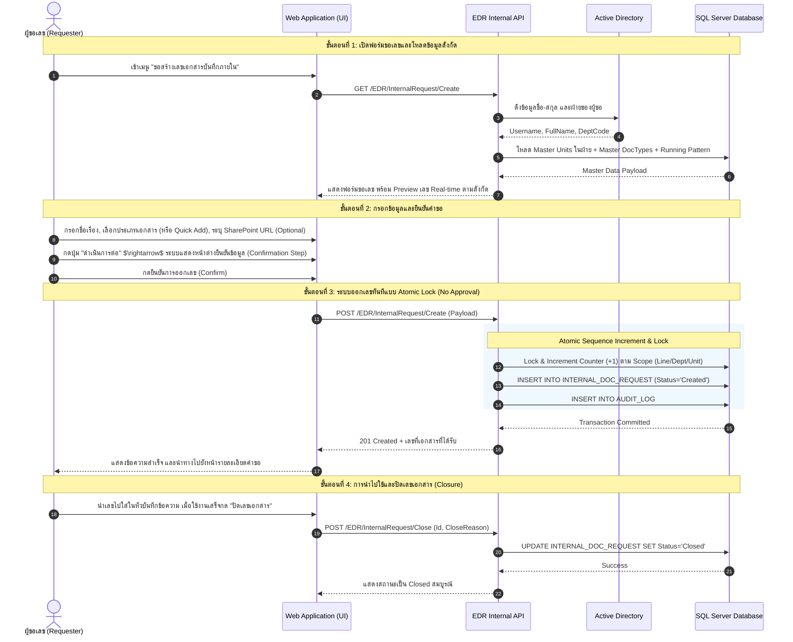
```mermaid
sequenceDiagram
    autonumber
    actor User as ผู้ขอเลข (Requester)
    participant UI as Web Application (UI)
    participant API as EDR Internal API
    participant AD as Active Directory
    participant DB as SQL Server Database

    Note over User,DB: ขั้นตอนที่ 1: เปิดฟอร์มขอเลขและโหลดข้อมูลสังกัด
    User->>UI: เข้าเมนู "ขอสร้างเลขเอกสารบันทึกภายใน"
    UI->>API: GET /EDR/InternalRequest/Create
    API->>AD: ดึงข้อมูลชื่อ-สกุล และฝ่ายของผู้ขอ
    AD-->>API: Username, FullName, DeptCode
    API->>DB: โหลด Master Units ในฝ่าย + Master DocTypes + Running Pattern
    DB-->>API: Master Data Payload
    API-->>UI: แสดงฟอร์มขอเลข พร้อม Preview เลข Real-time ตามสังกัด

    Note over User,DB: ขั้นตอนที่ 2: กรอกข้อมูลและยืนยันคำขอ
    User->>UI: กรอกชื่อเรื่อง, เลือกประเภทเอกสาร (หรือ Quick Add), ระบุ SharePoint URL (Optional)
    User->>UI: กดปุ่ม "ดำเนินการต่อ" $\rightarrow$ ระบบแสดงหน้าต่างยืนยันข้อมูล (Confirmation Step)
    User->>UI: กดยืนยันการออกเลข (Confirm)

    Note over User,DB: ขั้นตอนที่ 3: ระบบออกเลขทันทีแบบ Atomic Lock (No Approval)
    UI->>API: POST /EDR/InternalRequest/Create (Payload)
    rect rgb(240, 248, 255)
        Note over API,DB: Atomic Sequence Increment & Lock
        API->>DB: Lock & Increment Counter (+1) ตาม Scope (Line/Dept/Unit)
        API->>DB: INSERT INTO INTERNAL_DOC_REQUEST (Status='Created')
        API->>DB: INSERT INTO AUDIT_LOG
    end
    DB-->>API: Transaction Committed
    API-->>UI: 201 Created + เลขที่เอกสารที่ได้รับ
    UI-->>User: แสดงข้อความสำเร็จ และนำทางไปยังหน้ารายละเอียดคำขอ

    Note over User,DB: ขั้นตอนที่ 4: การนำไปใช้และปิดเลขเอกสาร (Closure)
    User->>UI: นำเลขไปใส่ในหัวบันทึกข้อความ เมื่อใช้งานเสร็จกด "ปิดเลขเอกสาร"
    UI->>API: POST /EDR/InternalRequest/Close (Id, CloseReason)
    API->>DB: UPDATE INTERNAL_DOC_REQUEST SET Status='Closed'
    DB-->>API: Success
    API-->>UI: แสดงสถานะเป็น Closed สมบูรณ์
```

---

### 5.3 ลำดับการดำเนินงานระบบที่ 2 (ขารับเข้า): การจัดการเอกสารรับเข้าและการถือครองตัวจริง (Correspondence Incoming)

```mermaid
flowchart TD
    Start(["1. สารบรรณได้รับเอกสารจากภายนอก<br/>(ไปรษณีย์ / อีเมล / ส่งถึงมือ)"]) --> Reg["2. ลงทะเบียนรับเข้า (Register Incoming)<br/>- กำหนดความเร่งด่วน & Deadline<br/>- แนบไฟล์สแกน / ถ่ายภาพ WebRTC กล้อง<br/>- กำหนดชั้นความลับ (ปกติ / ลับ / ลับมาก)"]
    Reg --> Assign["3. มอบหมายงาน (Assign)<br/>- เลือกฝ่ายปลายทาง (Multiple Select ได้หลายฝ่าย)<br/>- ระบุผู้รับผิดชอบเจาะจง (Optional)"]
    Assign --> Noti["4. ส่งแจ้งเตือน 3 ช่องทาง<br/>(Email + In-app + Personal Task Inbox)"]
    Noti --> Wait["สถานะงานย่อย: Pending Acceptance"]

    Wait --> Recall{"ต้นทางดึงงานกลับ?<br/>(Recall Action)"}
    Recall -->|ใช่| Recalled["Recalled (ยกเลิกงานย่อย)<br/>นำออกจาก Task Inbox"]
    Recalled --> Reassign["ต้นทางมอบหมายฝ่ายใหม่"] --> Assign

    Recall -->|ไม่| ActionDecision{"ผู้รับงานปลายทาง<br/>พิจารณาคำขอ"}
    
    ActionDecision -->|"ปฏิเสธ (Reject + ระบุเหตุผล)"| Rejected["บันทึกสถานะ Rejected<br/>แจ้งเตือนกลับต้นทาง"]
    Rejected --> PhysCheck{"เป็นเอกสารฉบับจริง (Physical)?"}
    PhysCheck -->|ใช่| AwaitReturn["สถานะ: Awaiting Physical Return<br/>(รอส่งกระดาษตัวจริงคืนต้นทาง)"]
    AwaitReturn --> ConfirmReturn{"ต้นทางกดยืนยันรับคืน?"}
    ConfirmReturn -->|ยืนยันแล้ว| BackToReg["กลับสู่สถานะ Registered<br/>ปลดล็อกให้ Assign ฝ่ายใหม่ได้"]
    BackToReg --> Assign
    PhysCheck -->|ไม่ใช่ (อีเมล)| BackToReg

    ActionDecision -->|"ยอมรับงาน (Accept Action)"| Accepted["สถานะงานย่อย: In Progress<br/>(Acceptance Gate ผ่าน)"]
    Accepted --> CustodyUpdate["บันทึก Stateful Chain of Custody:<br/>ผู้รับงานเป็นผู้ถือครองตัวจริงปัจจุบัน"]
    
    CustodyUpdate --> WorkChoice{"แนวทางการปฏิบัติงาน"}
    WorkChoice -->|"มอบหมายต่อในฝ่าย (Onward Delegate)"| Delegate["หัวหน้าฝ่าย Assign ลูกทีม<br/>สร้าง Nested Sub-assignment Tree"]
    Delegate --> SubTask["ลูกทีมได้รับแจ้งเตือน และกด Accept"] --> SubComplete["ลูกทีมปฏิบัติงานเสร็จ กด Complete"]
    SubComplete --> TaskDone
    
    WorkChoice -->|"ดำเนินการเองจนเสร็จ"| TaskDone["ผู้รับงานกด 'ปิดงาน (Complete)'"]
    
    TaskDone --> ProgCalc["Progress Calculation Engine<br/>คำนวณ Progress % รวมทุกฝ่าย"]
    ProgCalc --> AllDone{"ทุกฝ่ายดำเนินการเสร็จสิ้นครบ 100%?"}
    AllDone -->|ยังไม่ครบ| KeepProg["เอกสารหลักคงสถานะ In Progress"]
    AllDone -->|ครบ 100%| DocCompleted(["สถานะเอกสารหลัก: Completed (ปิดงานสมบูรณ์)"])
```

---

### 5.4 ลำดับการดำเนินงานระบบที่ 2 (ขาส่งออก): การจัดการออกเลขและติดตามเอกสารส่งออก (Correspondence Outgoing)

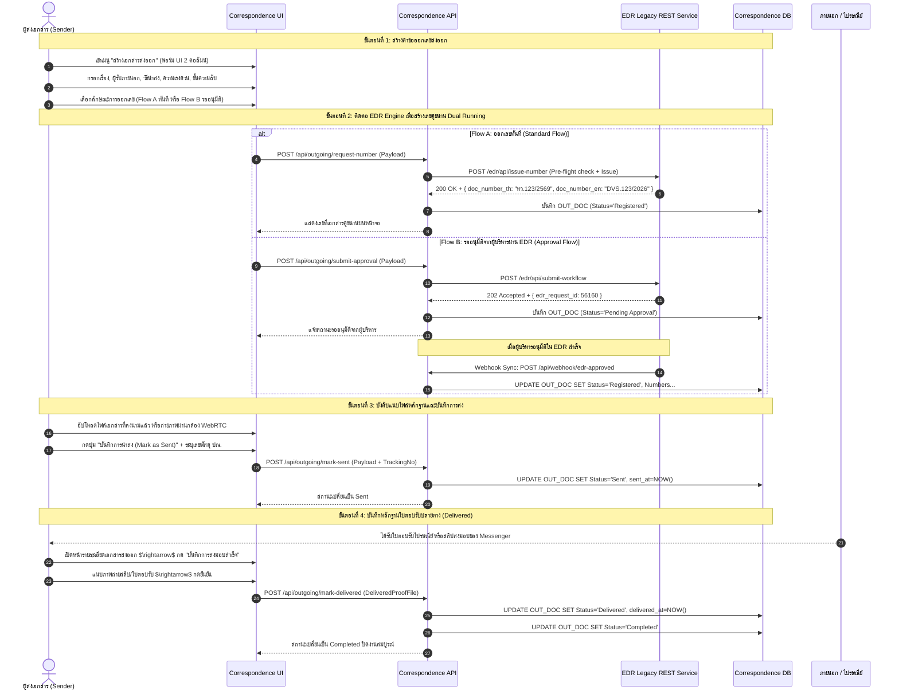
```mermaid
sequenceDiagram
    autonumber
    actor Sender as ผู้ส่งเอกสาร (Sender)
    participant UI as Correspondence UI
    participant API as Correspondence API
    participant EDR as EDR Legacy REST Service
    participant DB as Correspondence DB
    participant Ext as ภายนอก / ไปรษณีย์

    Note over Sender,DB: ขั้นตอนที่ 1: สร้างคำขอออกเลขส่งออก
    Sender->>UI: เข้าเมนู "สร้างเอกสารส่งออก" (ฟอร์ม UI 2 คอลัมน์)
    Sender->>UI: กรอกเรื่อง, ผู้รับภายนอก, วิธีนำส่ง, ความเร่งด่วน, ชั้นความลับ
    Sender->>UI: เลือกลักษณะการออกเลข (Flow A ทันที หรือ Flow B รออนุมัติ)

    Note over Sender,DB: ขั้นตอนที่ 2: ติดต่อ EDR Engine เพื่อสร้างเลขคู่ขนาน Dual Running
    alt Flow A: ออกเลขทันที (Standard Flow)
        UI->>API: POST /api/outgoing/request-number (Payload)
        API->>EDR: POST /edr/api/issue-number (Pre-flight check + Issue)
        EDR-->>API: 200 OK + { doc_number_th: "ทว.123/2569", doc_number_en: "DVS.123/2026" }
        API->>DB: บันทึก OUT_DOC (Status='Registered')
        API-->>UI: แสดงเลขที่เอกสารคู่ขนานบนหน้าจอ
    else Flow B: รออนุมัติจากผู้บริหารผ่าน EDR (Approval Flow)
        UI->>API: POST /api/outgoing/submit-approval (Payload)
        API->>EDR: POST /edr/api/submit-workflow
        EDR-->>API: 202 Accepted + { edr_request_id: 56160 }
        API->>DB: บันทึก OUT_DOC (Status='Pending Approval')
        API-->>UI: แจ้งสถานะรออนุมัติจากผู้บริหาร
        Note over EDR,API: เมื่อผู้บริหารอนุมัติใน EDR สำเร็จ
        EDR->>API: Webhook Sync: POST /api/webhook/edr-approved
        API->>DB: UPDATE OUT_DOC SET Status='Registered', Numbers...
    end

    Note over Sender,DB: ขั้นตอนที่ 3: บังคับแนบไฟล์หลักฐานและบันทึกการส่ง
    Sender->>UI: อัปโหลดไฟล์เอกสารที่ลงนามแล้ว หรือถ่ายภาพผ่านกล้อง WebRTC
    Sender->>UI: กดปุ่ม "บันทึกการนำส่ง (Mark as Sent)" + ระบุเลขพัสดุ ปณ.
    UI->>API: POST /api/outgoing/mark-sent (Payload + TrackingNo)
    API->>DB: UPDATE OUT_DOC SET Status='Sent', sent_at=NOW()
    API-->>UI: สถานะเปลี่ยนเป็น Sent

    Note over Sender,DB: ขั้นตอนที่ 4: บันทึกหลักฐานใบตอบรับปลายทาง (Delivered)
    Ext-->>Sender: ได้รับใบตอบรับไปรษณีย์ หรือสลิปส่งมอบของ Messenger
    Sender->>UI: เปิดหน้ารายละเอียดเอกสารส่งออก $\rightarrow$ กด "บันทึกการส่งมอบสำเร็จ"
    Sender->>UI: แนบภาพถ่ายสลิป/ใบตอบรับ $\rightarrow$ กดยืนยัน
    UI->>API: POST /api/outgoing/mark-delivered (DeliveredProofFile)
    API->>DB: UPDATE OUT_DOC SET Status='Delivered', delivered_at=NOW()
    API->>DB: UPDATE OUT_DOC SET Status='Completed'
    API-->>UI: สถานะเปลี่ยนเป็น Completed ปิดงานสมบูรณ์
```

---

### 5.5 กฎเหล็กที่ห้ามละเมิดแยกตามระบบ (System Invariants)

#### A. กฎเหล็กของระบบที่ 1 (EDR Internal Memo Invariants)
- **EDR-INV-1 (No Approval Flow):** เลขบันทึกภายในเมื่อผู้ขอยืนยัน ระบบจะสร้างเลขและบันทึกสถานะ `Created` ทันที และต้องไม่ปรากฏในคิวการอนุมัติเอกสารเด็ดขาด
- **EDR-INV-2 (Immutability):** เลขบันทึกภายในที่ออกไปแล้วจะคงเดิมตลอดไป แม้จะมีการเปลี่ยนแปลง Master Pattern ในภายหลัง
- **EDR-INV-3 (URL Reference Only):** ฐานข้อมูล EDR จัดเก็บเฉพาะ SharePoint URL อ้างอิงเท่านั้น ไม่ทำหน้าที่เป็น File Storage Server

#### B. กฎเหล็กของระบบที่ 2 (Correspondence System Invariants)
- **CORR-INV-1 (Acceptance Gate):** ผู้รับมอบหมายต้องกด Accept ก่อนจึงจะ Forward, Delegate หรือปิดงานได้
- **CORR-INV-2 (Stateful Chain of Custody):** เอกสารฉบับจริง (Physical) ต้องบันทึกผู้ถือครองตัวจริงล่าสุดเสมอ และหากถูก Reject ครบต้องเข้าสู่สถานะ `Awaiting Physical Return`
- **CORR-INV-3 (Mandatory Signed File):** เอกสารส่งออกต้องแนบไฟล์ที่ลงนามแล้วก่อนกดนำส่ง (`Sent`) เสมอ
- **CORR-INV-4 (Top Secret Isolation):** เอกสารลับมากซ่อนไฟล์แนบทั้งหมดจากทุกคนที่ไม่ใช่ Assignee โดยตรง และต้องผ่านรหัส OTP 6 หลักทางอีเมลเท่านั้น

---

## 6. สถานะเอกสารแยกตามระบบ (State Machines by System)

### 6.1 สถานะของระบบที่ 1: คำขอเลขบันทึกภายใน (EDR Memo State Machine)

| สถานะ | รหัสสถานะ | ความหมายเชิงระบบ | การดำเนินการที่อนุญาต |
|---|---|---|---|
| **ร่าง** | `Draft` | คำขอยังกรอกไม่สมบูรณ์ หรือบันทึกค้างไว้ | แก้ไขข้อมูล, ลบคำขอ, กดยืนยันเพื่อออกเลข |
| **ออกเลขแล้ว** | `Created` | ออกเลขสำเร็จทันทีผ่าน Atomic Lock (No Approval) | นำเลขไปใช้งาน, แก้ไข SharePoint URL, พิมพ์สลิปยืนยัน, ปิดเลขเอกสาร |
| **ใช้งานอยู่** | `In Use` | มีการอัปเดต SharePoint URL หรือเปิดใช้งานเอกสารจริง | แก้ไข SharePoint URL, ปิดเลขเอกสาร |
| **ปิดเลขเอกสาร** | `Closed` | ใช้งานเสร็จสิ้น หรือปิดเรื่องตามความประสงค์พร้อมระบุเหตุผล | ดูข้อมูลอย่างเดียว (Read-only), แก้ไขไม่ได้อีก |
| **ยกเลิกคำขอ** | `Cancelled` | คำขอถูกยกเลิกเนื่องจากไม่ได้ใช้งานจริง | ดูประวัติอย่างเดียว (Read-only) |

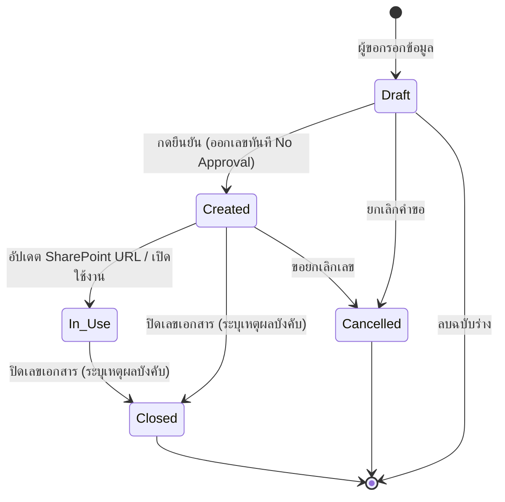
```mermaid
stateDiagram-v2
    [*] --> Draft: ผู้ขอกรอกข้อมูล
    Draft --> Created: กดยืนยัน (ออกเลขทันที No Approval)
    Draft --> Cancelled: ยกเลิกคำขอ
    Draft --> [*]: ลบฉบับร่าง
    Created --> In_Use: อัปเดต SharePoint URL / เปิดใช้งาน
    Created --> Closed: ปิดเลขเอกสาร (ระบุเหตุผลบังคับ)
    Created --> Cancelled: ขอยกเลิกเลข
    In_Use --> Closed: ปิดเลขเอกสาร (ระบุเหตุผลบังคับ)
    Closed --> [*]
    Cancelled --> [*]
```

---

### 6.2 สถานะของระบบที่ 2 (ขารับเข้า): เอกสารรับเข้าและงานย่อย (Correspondence Incoming State Machines)

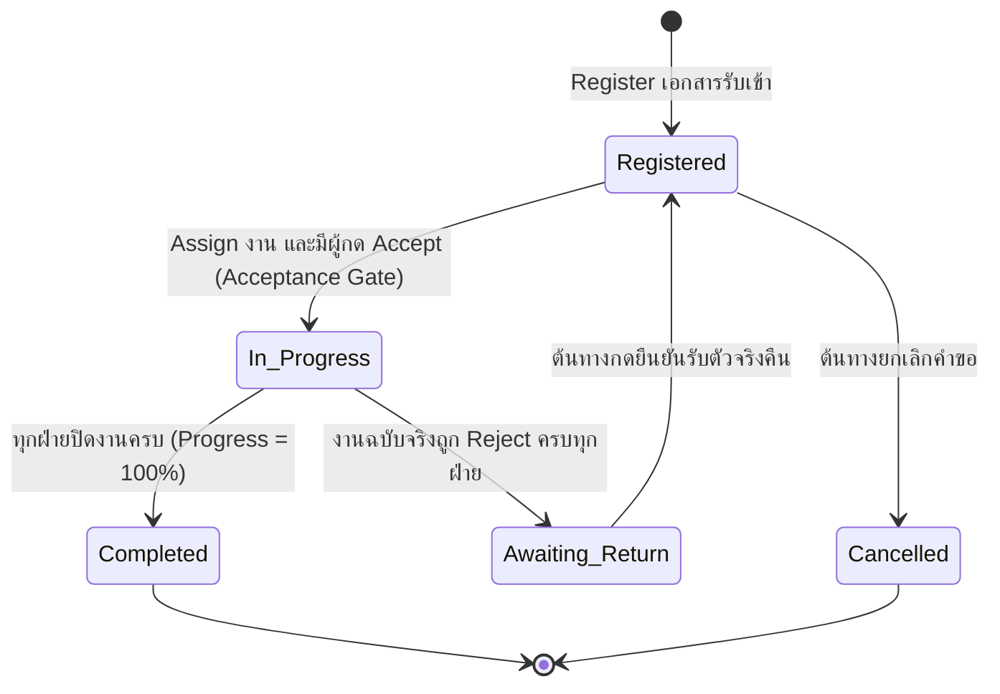
```mermaid
stateDiagram-v2
    [*] --> Registered: Register เอกสารรับเข้า
    Registered --> In_Progress: Assign งาน และมีผู้กด Accept (Acceptance Gate)
    Registered --> Cancelled: ต้นทางยกเลิกคำขอ
    In_Progress --> Awaiting_Return: งานฉบับจริงถูก Reject ครบทุกฝ่าย
    Awaiting_Return --> Registered: ต้นทางกดยืนยันรับตัวจริงคืน
    In_Progress --> Completed: ทุกฝ่ายปิดงานครบ (Progress = 100%)
    Completed --> [*]
    Cancelled --> [*]
```

---

### 6.3 สถานะของระบบที่ 2 (ขาส่งออก): เอกสารส่งออก (Correspondence Outgoing State Machine)

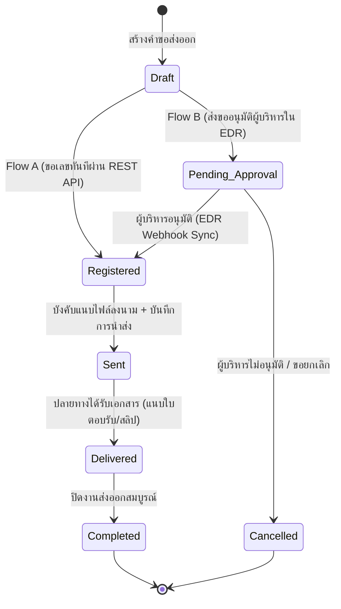
```mermaid
stateDiagram-v2
    [*] --> Draft: สร้างคำขอส่งออก
    Draft --> Registered: Flow A (ขอเลขทันทีผ่าน REST API)
    Draft --> Pending_Approval: Flow B (ส่งขออนุมัติผู้บริหารใน EDR)
    Pending_Approval --> Registered: ผู้บริหารอนุมัติ (EDR Webhook Sync)
    Pending_Approval --> Cancelled: ผู้บริหารไม่อนุมัติ / ขอยกเลิก
    Registered --> Sent: บังคับแนบไฟล์ลงนาม + บันทึกการนำส่ง
    Sent --> Delivered: ปลายทางได้รับเอกสาร (แนบใบตอบรับ/สลิป)
    Delivered --> Completed: ปิดงานส่งออกสมบูรณ์
    Completed --> [*]
    Cancelled --> [*]
```

---

## 7. กลไกเฉพาะของระบบสารบรรณ: การคำนวณ Progress และ Chain of Custody (Correspondence Specific Engines)

*(หัวข้อนี้เป็นกลไกการคำนวณและการควบคุมที่ทำงานเฉพาะใน **ระบบที่ 2: ระบบบริหารงานสารบรรณ** เท่านั้น)*

### 7.1 สูตรการคำนวณความคืบหน้า (Progress Calculation Logic)

ความคืบหน้าของเอกสารรับเข้าคำนวณตามหลักการ **ถ่วงน้ำหนักเท่ากัน (Equal Weight)** ตามสูตร:

$$\text{Progress \%} = \left( \frac{\sum_{i=1}^{N} \text{Weight}(\text{SubAssignment}_i)}{N} \right) \times 100$$

โดยมีกฎเกณฑ์สำคัญทางธุรกิจ:
1. **น้ำหนักสถานะงานย่อย:**
   - สถานะ `Pending Acceptance`, `Rejected`, `Recalled`: มีน้ำหนัก = `0.0`
   - สถานะ `In Progress`, `Delegated`: มีน้ำหนัก = `0.5`
   - สถานะ `Completed`: มีน้ำหนัก = `1.0`
2. **การตัดงานที่ถูกยกเลิก (Cancelled Exclusion):** งานย่อยที่ถูกดึงงานกลับ (`Recalled`) จะถูกหักออกจากตัวหาร $N$ ทันที
3. **การส่งต่อ (Forward Handling):** การ Forward ส่งต่องาน จะเปลี่ยนสถานะงานเดิมเป็น `Forwarded` และส่งมอบความรับผิดชอบไปยังผู้รับคนใหม่ โดย**ไม่เพิ่มตัวหาร $N$**
4. **การเปลี่ยนสถานะเอกสารหลักเป็น Completed:** เมื่อผลรวมความคืบหน้าเท่ากับ **100%** ระบบจะเปลี่ยนสถานะเอกสารหลักเป็น `Completed` อัตโนมัติ

---

### 7.2 กฎการถือครองเอกสารตัวจริง (Stateful Chain of Custody)

สำหรับเอกสารรับเข้าประเภท **ฉบับจริง (Physical Document)**:
1. **Initial Holder:** เมื่อสารบรรณ Register เอกสาร ผู้ลงทะเบียนจะเป็นผู้ถือครองเอกสารตัวจริงคนแรก (`current_holder_ref = Registrar`)
2. **Custody Transfer upon Acceptance:** การเปลี่ยนมือผู้ถือครองจะเกิดขึ้น **เมื่อผู้รับงานปลายทางกด Accept เท่านั้น**
3. **Custody Audit Trail:** ทุกครั้งที่มีการเปลี่ยนมือ ระบบจะบันทึกข้อมูลลงตาราง `CUSTODY_LOG`
4. **Physical Return Protection:** หากผู้รับงานปฏิเสธงาน (Reject) สำหรับเอกสารฉบับจริง เอกสารจะเข้าสู่สถานะ `Awaiting Physical Return` จนกว่าสารบรรณต้นทางจะได้รับแฟ้มกระดาษคืนและกดยืนยันรับคืนในระบบ

---

## 8. รายละเอียดฟังก์ชันรายหน้าจอแยกตามระบบ (Screen Specifications by System)

---

### 8.1 หน้าจอระบบที่ 1: CR ระบบขอเลขบันทึกภายใน EDR Memo (19 หน้าจอพร้อมภาพจริง)

#### 1. หน้าจอเข้าสู่ระบบ EDR (EDR Login Screen)
- **ภาพหน้าจอ:**  
  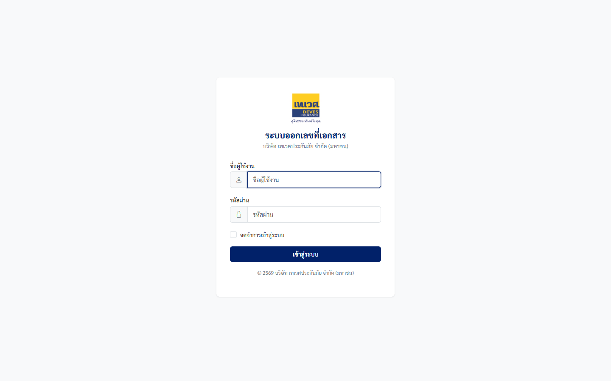  
  *(ตัวอย่างตอนกรอกข้อมูล: [01_login_filled.png](./docs/images/edr_memo/01_login_filled.png))*
- **ฟังก์ชันการทำงาน:** ฟอร์มเข้าสู่ระบบด้วยบัญชี Windows Active Directory / LDAP พร้อมระบบตรวจสอบสิทธิ์และจดจำเซสชัน

#### 2. หน้าจอ Dashboard ระบบ EDR (EDR Dashboard Screen)
- **ภาพหน้าจอ:**  
  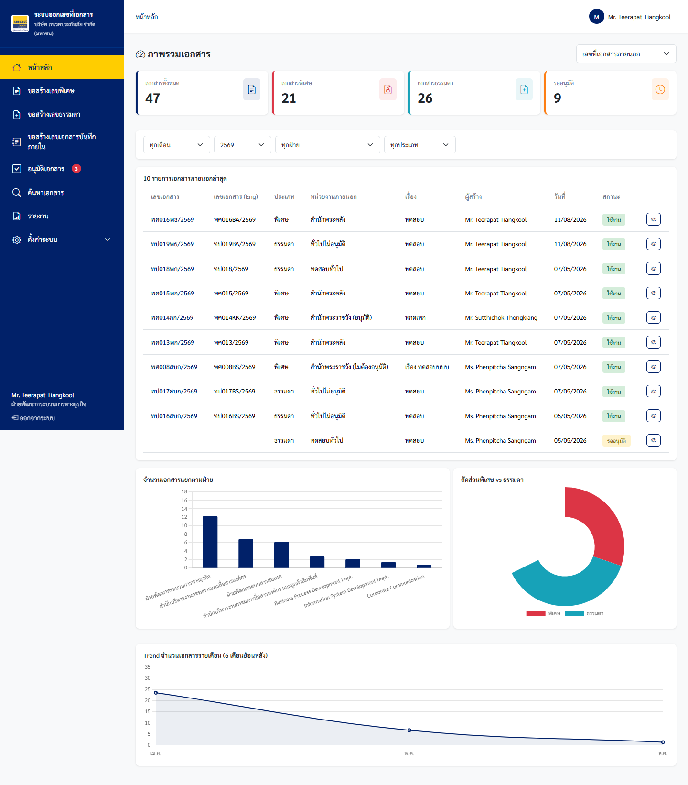  
  *(มุมมองเต็มจอ: [02_dashboard_full.png](./docs/images/edr_memo/02_dashboard_full.png))*
- **ฟังก์ชันการทำงาน:** สรุปสถิติคำขอเลขบันทึกภายในของฝ่าย, รายการคำขอล่าสุด, สถานะคำขอ (Created / In Use / Closed) พร้อมทางลัดเข้าสู่หน้าสร้างคำขอ

#### 3. หน้ารายการขอสร้างเลขเอกสารบันทึกภายใน (Internal Request List)
- **ภาพหน้าจอ:**  
    
  *(มุมมองตาราง: [03_internal_request_table.png](./docs/images/edr_memo/03_internal_request_table.png) / [03_internal_request_index.png](./docs/images/edr_memo/03_internal_request_index.png))*
- **ฟังก์ชันการทำงาน:** ตารางแสดงรายการเลขบันทึกภายในที่ออกแล้ว กรองตามช่วงวันที่ ประเภทเอกสาร สถานะ และค้นหาตามชื่อเรื่องหรือเลขที่เอกสาร

#### 4. หน้าฟอร์มขอสร้างเลขเอกสารบันทึกภายใน (Create Form & Preview)
- **ภาพหน้าจอ:**  
  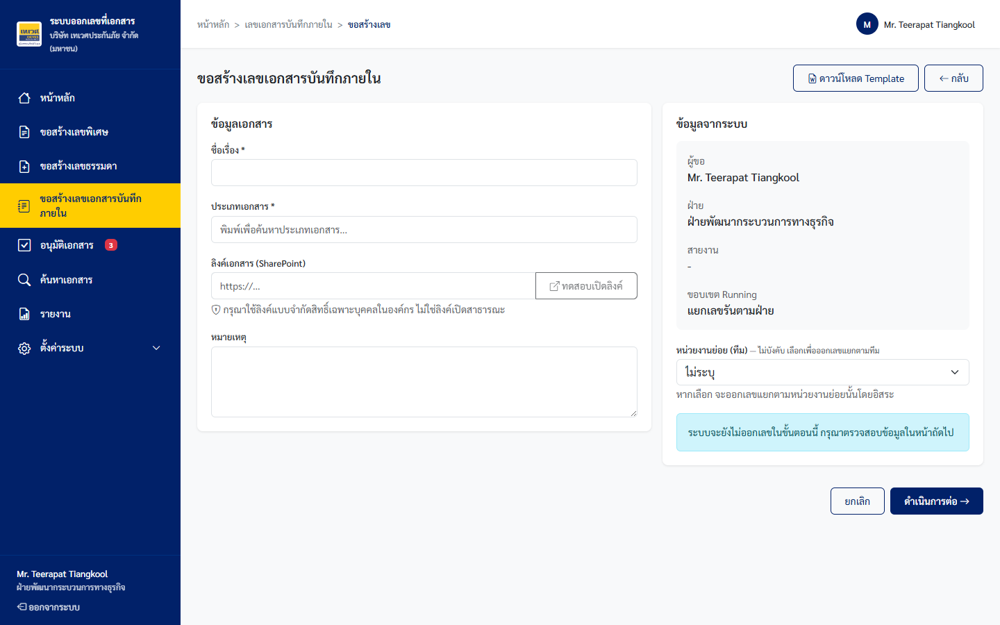  
  *(ตัวอย่างฟอร์มเริ่มต้น: [04_internal_request_create.png](./docs/images/edr_memo/04_internal_request_create.png) / [04_create_form_initial.png](./docs/images/edr_memo/04_create_form_initial.png))*
- **ฟังก์ชันการทำงาน:** ฟอร์มบันทึกข้อมูลขอเลข แสดง Real-time Running Number Preview ตามสายงาน/ฝ่าย/ทีมที่เลือก

#### 5. Searchable Dropdown เลือกประเภทเอกสาร (DocType Dropdown)
- **ภาพหน้าจอ:**  
    
  *(ขณะเปิด Dropdown: [04a_doctype_dropdown_opened.png](./docs/images/edr_memo/04a_doctype_dropdown_opened.png))*
- **ฟังก์ชันการทำงาน:** Dropdown ค้นหาประเภทเอกสารได้อย่างรวดเร็ว พร้อมปุ่มลัด "เพิ่มประเภทเอกสารด่วน (Quick Add)"

#### 6. ตัวอย่างการกรอกฟอร์มขอเลขบันทึกภายใน (Create Form Filled)
- **ภาพหน้าจอ:**  
  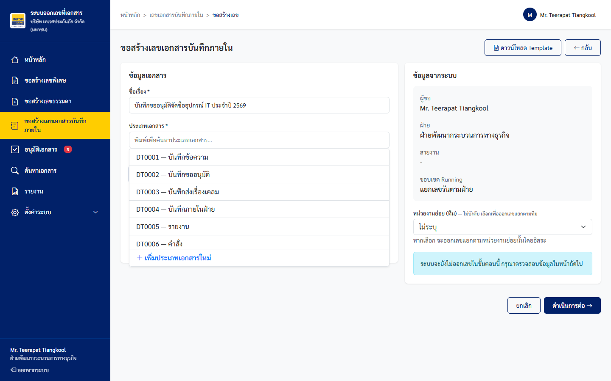  
  *(ภาพตัวอย่างเต็ม: [04c_create_form_filled.png](./docs/images/edr_memo/04c_create_form_filled.png))*
- **ฟังก์ชันการทำงาน:** แสดงข้อมูลชื่อเรื่อง, ประเภทเอกสาร, ลิงก์ SharePoint URL ที่ผ่านการตรวจสอบ HTTPS และปุ่มดำเนินการต่อ

#### 7. Quick Add Modal เพิ่มประเภทเอกสารด่วน (Quick Add Modal)
- **ภาพหน้าจอ:**  
  
- **ฟังก์ชันการทำงาน:** ป๊อปอัปเพิ่มประเภทเอกสารใหม่อย่างรวดเร็ว มีระบบตรวจจับชื่อซ้ำและ Soft Warning กรณีชื่อใกล้เคียง $\ge 80\%$

#### 8. หน้ายืนยันข้อมูลก่อนออกเลข (Confirmation Step)
- **ภาพหน้าจอ:**  
  
- **ฟังก์ชันการทำงาน:** หน้าต่างทบทวนข้อมูลก่อนยืนยัน เพื่อป้องกันการขอเลขผิดพลาด เมื่อกดยืนยันระบบจะออกเลขทันที (Instant Issuance)

#### 9. หน้ารายละเอียดคำขอเลขที่เอกสารภายใน (Internal Request Detail)
- **ภาพหน้าจอ:**  
    
  *(มุมมองเต็ม: [09_internal_request_detail.png](./docs/images/edr_memo/09_internal_request_detail.png))*
- **ฟังก์ชันการทำงาน:** แสดงรายละเอียดเลขที่เอกสารที่ได้รับ, วันเวลาที่ออกเลข, ข้อมูลผู้ขอ, ลิงก์ SharePoint พร้อมปุ่มแก้ไข URL และปุ่มปิดเลขเอกสาร

#### 10. Modal ปิดเลขเอกสารบันทึกภายใน (Close Document Modal)
- **ภาพหน้าจอ:**  
  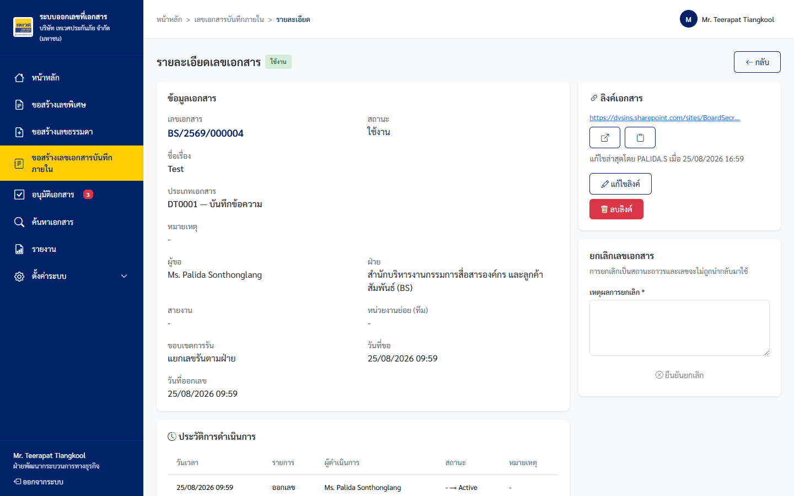
- **ฟังก์ชันการทำงาน:** ป๊อปอัปยืนยันการปิดเลขเอกสาร บังคับกรอกเหตุผลการปิดเลข เพื่อเปลี่ยนสถานะเป็น `Closed`

#### 11. หน้าจอค้นหาเอกสาร Search Screen (Search Page)
- **ภาพหน้าจอ:**  
    
  *(มุมมองตัวกรอง: [10_search_page.png](./docs/images/edr_memo/10_search_page.png))*
- **ฟังก์ชันการทำงาน:** ค้นหาเอกสารขั้นสูง กรองตามสายงาน ฝ่าย หน่วยงานย่อย ช่วงวันที่ และคำสำคัญ

#### 12. หน้าจอออกรายงาน Report Screen (Report Page)
- **ภาพหน้าจอ:**  
  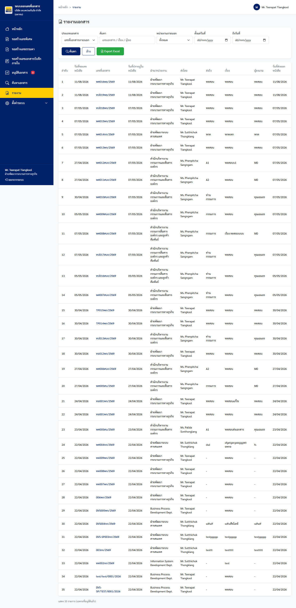  
  *(มุมมองตัวเลือกรายงาน: [11_report_page.png](./docs/images/edr_memo/11_report_page.png))*
- **ฟังก์ชันการทำงาน:** สรุปรายงานการออกเลขบันทึกภายในประจำเดือน/ปี และส่งออกไฟล์ Excel

#### 13. หน้าจอจัดการ Master สายงาน (Settings Lines)
- **ภาพหน้าจอ:**  
    
  *(มุมมองรายการ: [09_settings_lines.png](./docs/images/edr_memo/09_settings_lines.png) / [07_master_lines_list.png](./docs/images/edr_memo/07_master_lines_list.png))*
- **ฟังก์ชันการทำงาน:** จัดการข้อมูลสายงาน (Line) เพิ่ม แก้ไข ระงับการใช้งานสายงาน

#### 14. หน้าจอจัดการ Master หน่วยงานภายใน (Settings Units)
- **ภาพหน้าจอ:**  
    
  *(มุมมองผูกฝ่าย: [10_settings_units.png](./docs/images/edr_memo/10_settings_units.png))*
- **ฟังก์ชันการทำงาน:** จัดการหน่วยงานย่อย/ทีมภายในฝ่าย กำหนดตัวย่อทีมสำหรับใช้ในการ Running เลข

#### 15. หน้าจอผูกฝ่ายกับสายงาน (Settings Departments)
- **ภาพหน้าจอ:**  
  
- **ฟังก์ชันการทำงาน:** จับคู่ฝ่าย (Department) ให้อยู่ภายใต้สายงาน (Line) เพื่อรองรับ Hierarchy 3 ระดับ

#### 16. หน้าจอจัดการตัวย่อฝ่ายและ Running Config (Settings Department Codes)
- **ภาพหน้าจอ:**  
  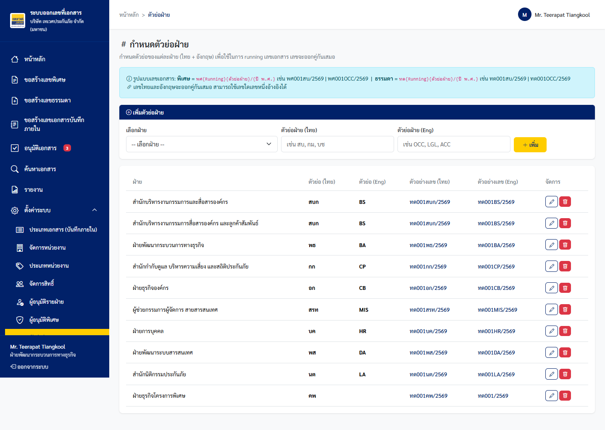
- **ฟังก์ชันการทำงาน:** กำหนดรหัสตัวย่อฝ่ายภาษาไทยและภาษาอังกฤษ เช่น `ฝสบ.` / `CAD` สำหรับขึ้นต้นเลขที่เอกสาร

#### 17. หน้าจอรูปแบบเลขเอกสารภายใน (Settings Internal Number Formats)
- **ภาพหน้าจอ:**  
    
  *(มุมมองเต็ม: [13_settings_internal_number_formats.png](./docs/images/edr_memo/13_settings_internal_number_formats.png))*
- **ฟังก์ชันการทำงาน:** กำหนด Scope การ Running เลข (ระดับ LINE / DEPT / UNIT) และรูปแบบ Pattern

#### 18. Modal แก้ไขรูปแบบเลขเอกสารภายใน (Edit Internal Number Format Modal)
- **ภาพหน้าจอ:**  
  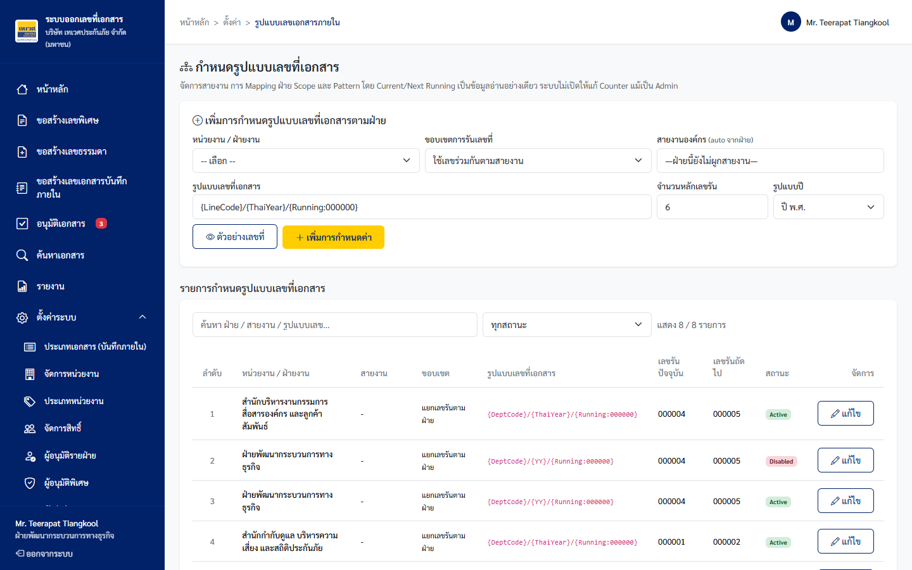
- **ฟังก์ชันการทำงาน:** ป๊อปอัปปรับแต่งตัวแปร Pattern (เช่น `{DEPT_CODE}.{YEAR_TH}-{SEQ:6}`)

#### 19. หน้าจอจัดการ Master ประเภทเอกสาร (Settings Doc Types)
- **ภาพหน้าจอ:**  
    
  *(มุมมองรายการ: [08_settings_doc_types.png](./docs/images/edr_memo/08_settings_doc_types.png) / Modal เพิ่มประเภท: [16_modal_create_doc_type.png](./docs/images/edr_memo/16_modal_create_doc_type.png) / Modal สายงาน: [14_modal_create_line.png](./docs/images/edr_memo/14_modal_create_line.png) / Modal หน่วยงาน: [15_modal_create_unit.png](./docs/images/edr_memo/15_modal_create_unit.png))*
- **ฟังก์ชันการทำงาน:** จัดการประเภทเอกสารบันทึกภายใน และอนุมัติรายการ Quick Add จากผู้ใช้

---

### 8.2 หน้าจอระบบที่ 2: ระบบสารบรรณ รับเข้า-ส่งออก Correspondence (17 หน้าจอพร้อมภาพจริง)

#### 1. หน้าจอเข้าสู่ระบบสารบรรณ (Correspondence Login & Demo Switcher)
- **ภาพหน้าจอ:**  
  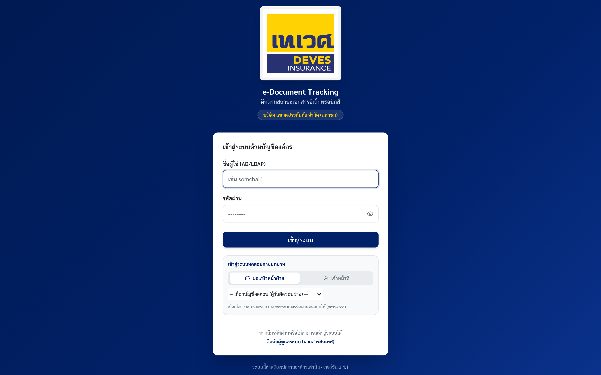
- **ฟังก์ชันการทำงาน:** ล็อกอินผ่าน LDAP และมี Demo Switcher จำลองบทบาทผู้ใช้ 7 บทบาท สำหรับทดสอบ SIT/UAT

#### 2. หน้าจอ Dashboard ติดตามงานสารบรรณ (Correspondence Dashboard)
- **ภาพหน้าจอ:**  
  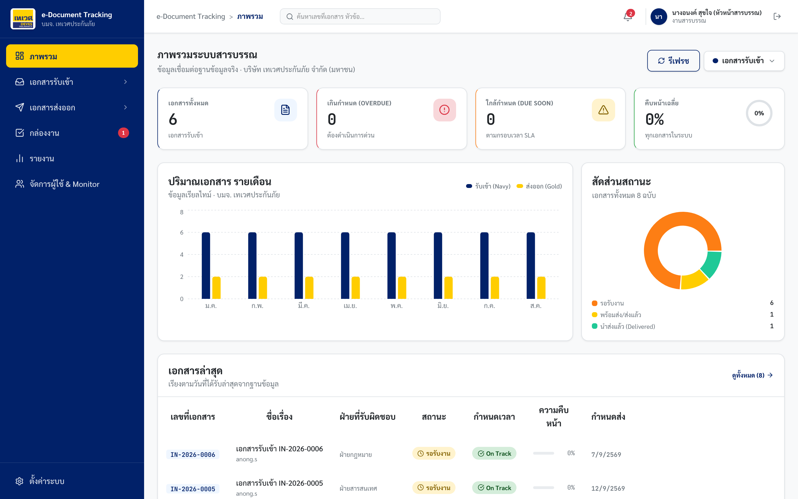
- **ฟังก์ชันการทำงาน:** สรุป Metrics งานรับเข้า-ส่งออก, งานค้างตามสถานะ, งานใกล้ถึงกำหนด (Due Soon), งานเกินกำหนด (Overdue), และกราฟแนวโน้ม

#### 3. หน้ารายการเอกสารรับเข้า (Incoming Documents List)
- **ภาพหน้าจอ:**  
  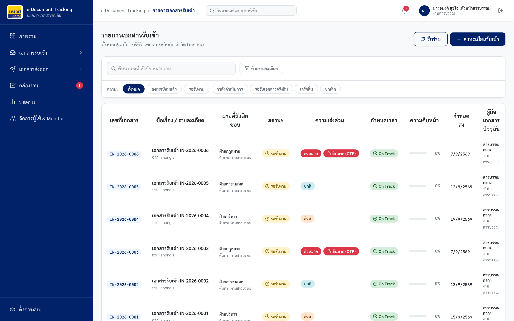
- **ฟังก์ชันการทำงาน:** ตารางรายการเอกสารรับเข้า ตัวกรองสถานะทั้ง 5 ขั้นตอน แถบแสดง Progress Bar % และปุ่มทางลัดไปยังหน้ารายละเอียด

#### 4. หน้ารายการเอกสารส่งออก (Outgoing Documents List)
- **ภาพหน้าจอ:**  
  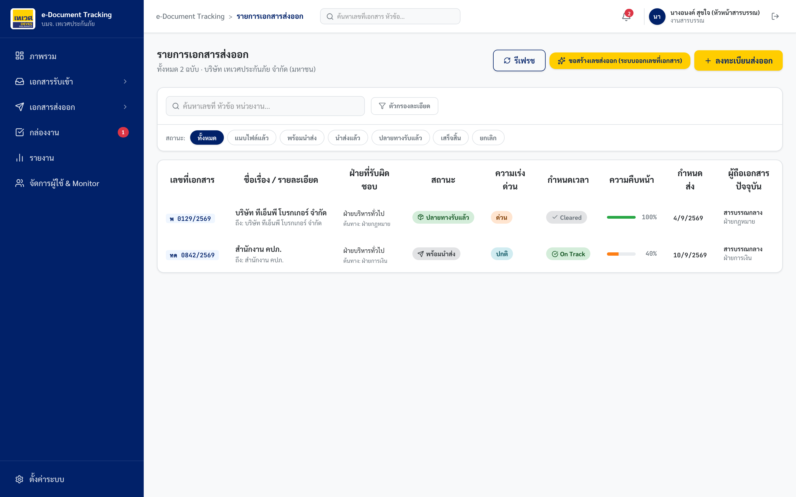
- **ฟังก์ชันการทำงาน:** ตารางเอกสารส่งออก แสดงเลขคู่ขนาน Dual Running Numbers (ไทย/อังกฤษ), หน่วยงานปลายทาง, สถานะการนำส่ง (Sent/Delivered)

#### 5. หน้าจอลงทะเบียนเอกสารรับเข้า (Register Incoming Document Form)
- **ภาพหน้าจอ:**  
  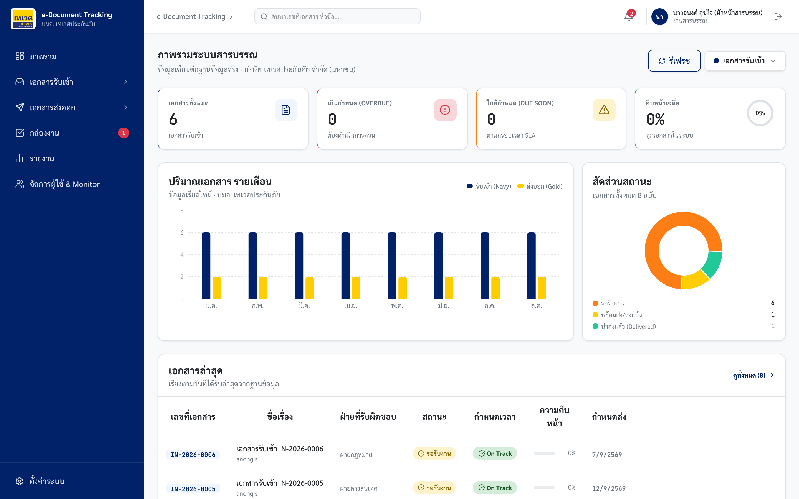
- **ฟังก์ชันการทำงาน:** ฟอร์มลงทะเบียนรับเข้า เลือกระดับความลับ (ปกติ/ลับ/ลับมาก), ระบุ Deadline, แนบไฟล์ หรือเปิดกล้องถ่ายภาพ

#### 6. หน้าจอสร้างคำขอออกเลขเอกสารส่งออก (Register Outgoing Document Form)
- **ภาพหน้าจอ:**  
  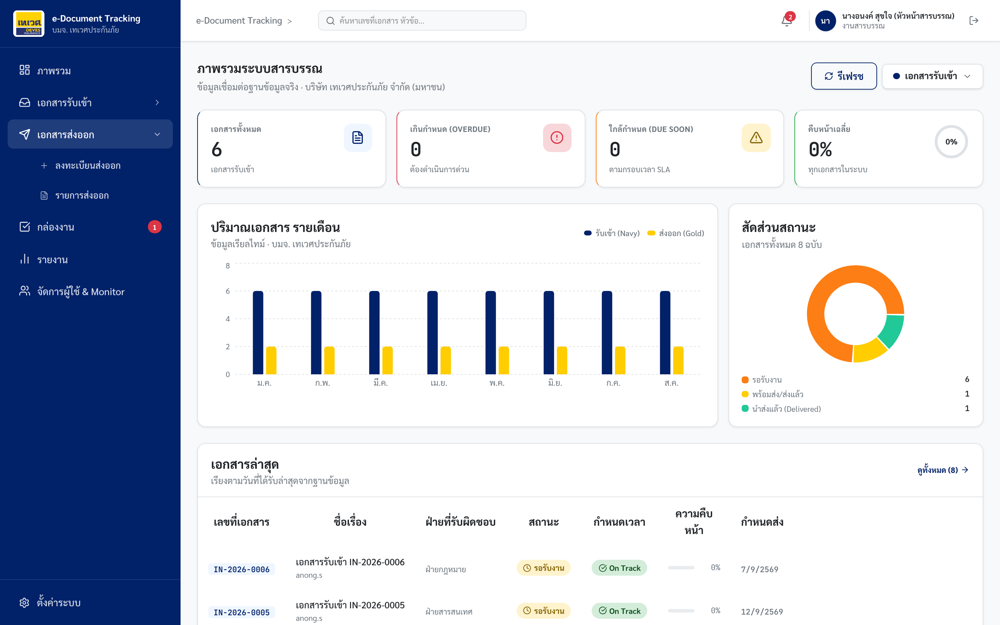
- **ฟังก์ชันการทำงาน:** ฟอร์มขอเลขส่งออก UI 2 คอลัมน์ เลือกระบบออกเลข (Flow A ทันที หรือ Flow B รออนุมัติ), เลือกวิธีนำส่ง และบังคับแนบไฟล์

#### 7. หน้ารายละเอียดเอกสาร Story Line & SubTree (Document Detail Storyline)
- **ภาพหน้าจอ:**  
  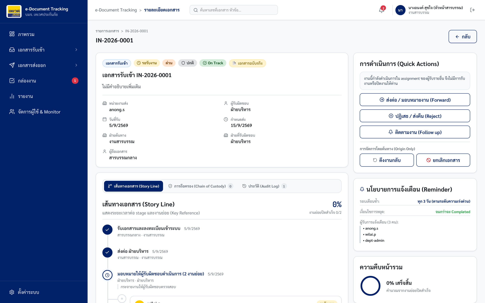
- **ฟังก์ชันการทำงาน:** แสดง Timeline การดำเนินงาน (Story Line), ลำดับชั้นการมอบหมายงานย่อย (Nested Delegation SubTree) และสถานะของแต่ละฝ่าย

#### 8. หน้ารายละเอียดเอกสาร Chain of Custody (Document Detail Custody)
- **ภาพหน้าจอ:**  
  
- **ฟังก์ชันการทำงาน:** แสดงประวัติผู้ถือครองเอกสารฉบับจริง (Stateful Chain of Custody) ลำดับการเปลี่ยนมือ วันเวลา และผู้ถือครองปัจจุบัน

#### 9. การ์ดไฟล์แนบและการอัปโหลด Drag-and-Drop (Attachments Card)
- **ภาพหน้าจอ:**  
  
- **ฟังก์ชันการทำงาน:** อัปโหลดไฟล์แบบ Drag-and-Drop รองรับไฟล์ขนาดไม่เกิน 25 MB พร้อม Lightbox พรีวิวภาพถ่ายและไฟล์ PDF

#### 10. Modal ถ่ายภาพด้วยกล้อง WebRTC (WebRTC Camera Modal)
- **ภาพหน้าจอ:**  
  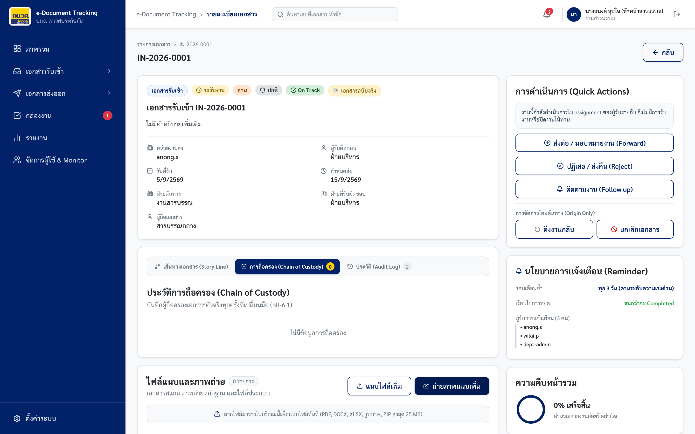
- **ฟังก์ชันการทำงาน:** หน้าต่างถ่ายภาพเอกสารสดผ่านกล้อง มีกรอบสีทอง Viewfinder `#FFCD00`, ปุ่ม Mirror กลับภาพ, และปุ่มหมุนภาพ 90 องศา

#### 11. Modal ยืนยันตัวตนด้วยรหัส OTP (Top Secret OTP Modal)
- **ภาพหน้าจอ:**  
  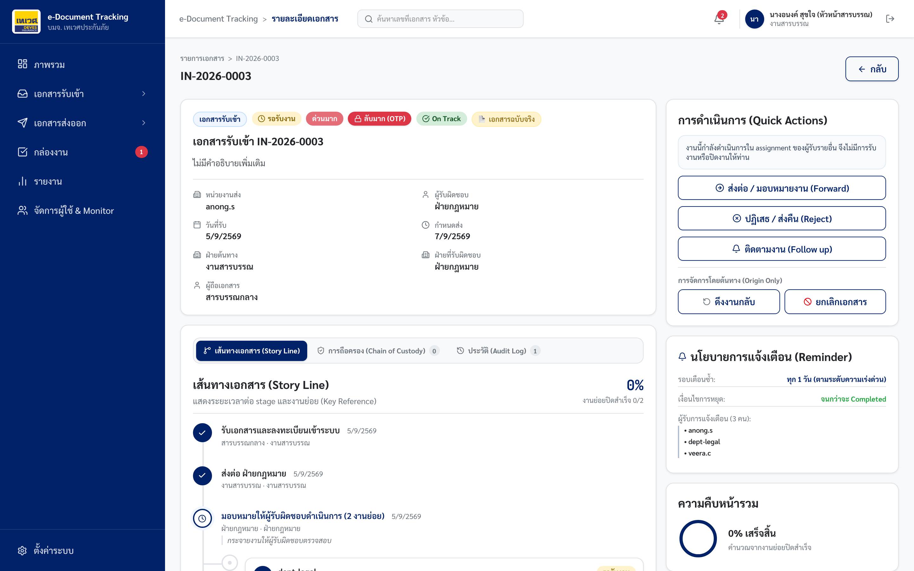
- **ฟังก์ชันการทำงาน:** ป๊อปอัปยืนยัน OTP 6 หลักทางอีเมล สำหรับปลดล็อกไฟล์แนบเอกสาร "ลับมาก" พร้อมแสดงนับถอยหลัง 15 นาที

#### 12. หน้ารายละเอียดเอกสาร Audit Log Trail (Document Detail Audit)
- **ภาพหน้าจอ:**  
  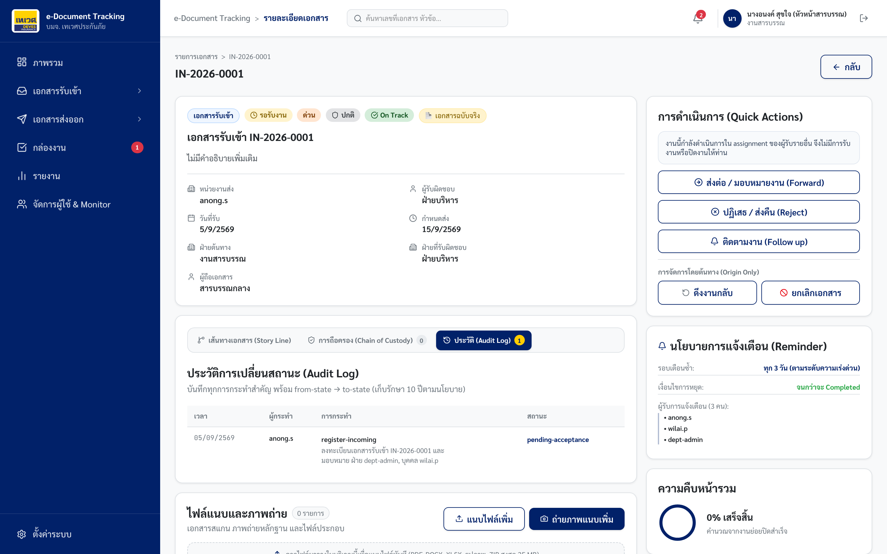
- **ฟังก์ชันการทำงาน:** บันทึกประวัติการกระทำสำคัญทุกขั้นตอน วันเวลา ชื่อผู้กระทำ IP Address และรายละเอียดการเปลี่ยนแปลงย้อนหลัง 10 ปี

#### 13. หน้าจอกล่องงานส่วนตัว (Personal Task Inbox)
- **ภาพหน้าจอ:**  
  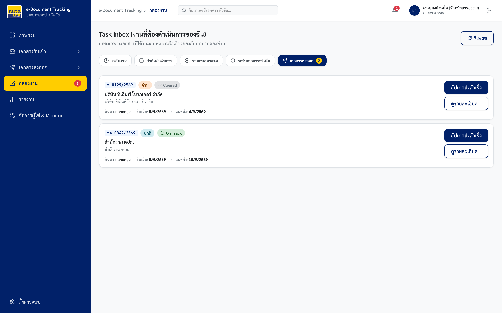
- **ฟังก์ชันการทำงาน:** กล่องงานส่วนตัวของผู้ใช้ แบ่งเป็น 5 หมวด: งานรอดำเนินการ, งานส่งต่อ, งานติดตาม, งานเสร็จสิ้น, และงานฉบับร่าง

#### 14. หน้าจอจัดการผู้ใช้และการ Provisioning จาก LDAP (User Provisioning)
- **ภาพหน้าจอ:**  
  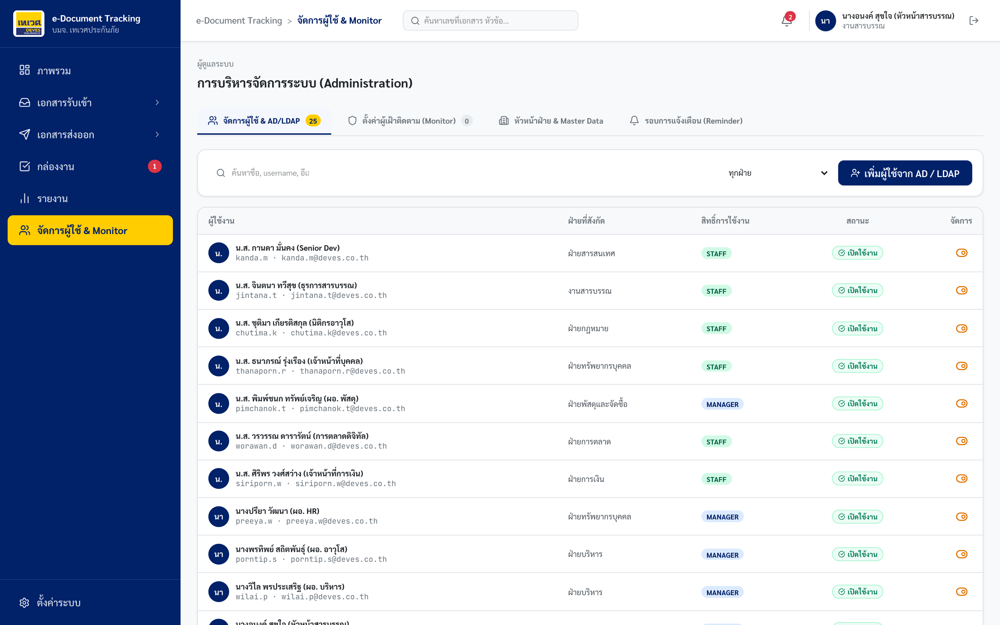
- **ฟังก์ชันการทำงาน:** Admin ค้นหาบัญชีพนักงานจาก Active Directory และกด "Provision" เพิ่มเข้าสู่ระบบ กำหนด Role และเปิด/ปิดการใช้งาน

#### 15. หน้าจอตั้งค่าผู้เฝ้าติดตาม Scope (Monitor Config)
- **ภาพหน้าจอ:**  
  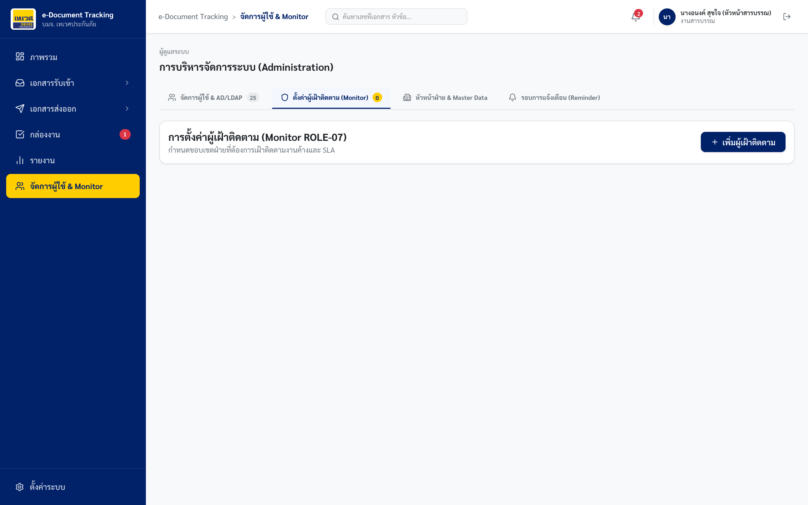
- **ฟังก์ชันการทำงาน:** มอบหมายผู้เฝ้าติดตาม (Monitor Watcher) ระบุ Scope ฝ่าย สายงาน หรือทั้งองค์กร สำหรับดูงานค้างและ Follow up

#### 16. หน้าจอกำหนดรอบการเตือนซ้ำ (Reminder Intervals Config)
- **ภาพหน้าจอ:**  
  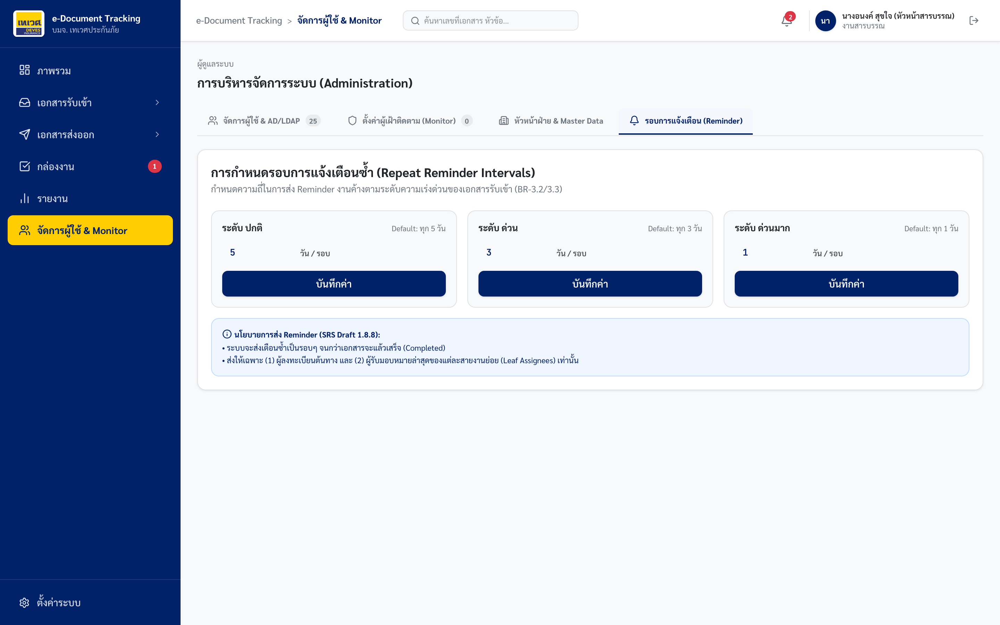
- **ฟังก์ชันการทำงาน:** กำหนดรอบเวลาส่ง Reminder อัตโนมัติ (เช่น ทุก 1 วัน, ทุก 3 วัน) แยกตามความเร่งด่วน ด่วนที่สุด/ด่วนมาก/ด่วน

#### 17. หน้าจอออกรายงานสารบรรณ (Reports Management RPT-01..06)
- **ภาพหน้าจอ:**  
  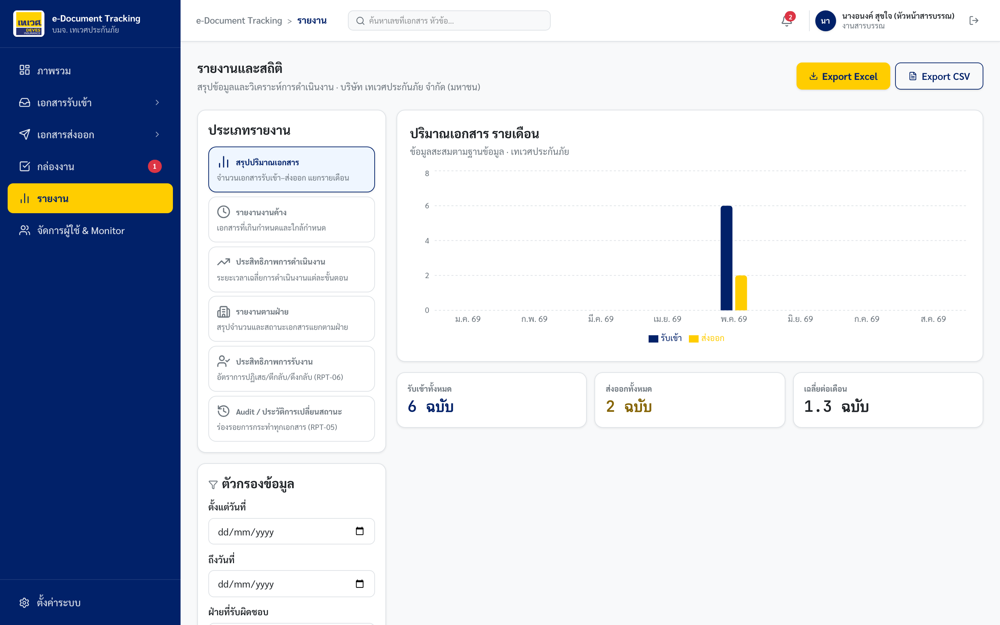
- **ฟังก์ชันการทำงาน:** ระบบรายงานมาตรฐาน 6 ประเภท พร้อมตารางสถิติและปุ่มส่งออก Excel/CSV

---

## 9. โครงสร้างลำดับชั้นองค์กร & Shared Master Data Model (Line $\rightarrow$ Dept $\rightarrow$ Unit)

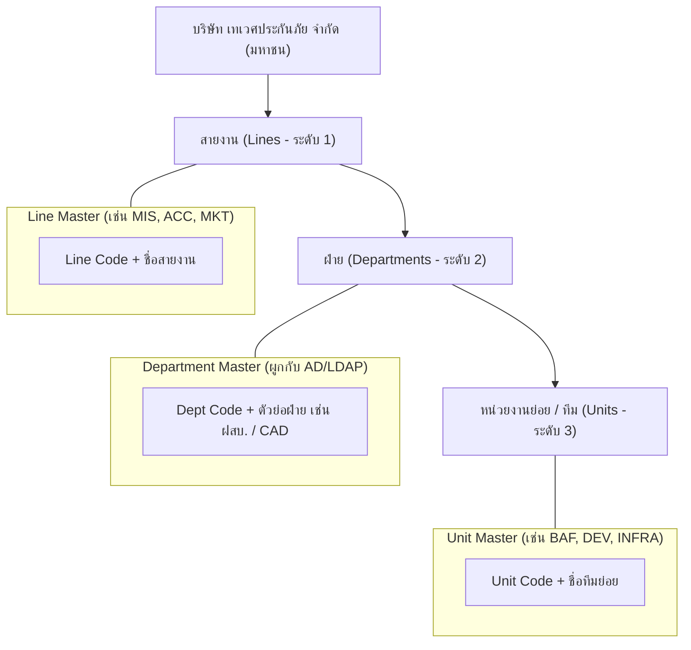
```mermaid
flowchart TD
    COMPANY["บริษัท เทเวศประกันภัย จำกัด (มหาชน)"] --> L1["สายงาน (Lines - ระดับ 1)"]
    L1 --> D1["ฝ่าย (Departments - ระดับ 2)"]
    D1 --> U1["หน่วยงานย่อย / ทีม (Units - ระดับ 3)"]
    
    subgraph S_LINE["Line Master (เช่น MIS, ACC, MKT)"]
        L_CODE["Line Code + ชื่อสายงาน"]
    end
    subgraph S_DEPT["Department Master (ผูกกับ AD/LDAP)"]
        D_CODE["Dept Code + ตัวย่อฝ่าย เช่น ฝสบ. / CAD"]
    end
    subgraph S_UNIT["Unit Master (เช่น BAF, DEV, INFRA)"]
        U_CODE["Unit Code + ชื่อทีมย่อย"]
    end

    L1 --- S_LINE
    D1 --- S_DEPT
    U1 --- S_UNIT
```

---

## 10. Data Model รวม (Unified ER Diagram & Entity Dictionary แยกตามระบบ)

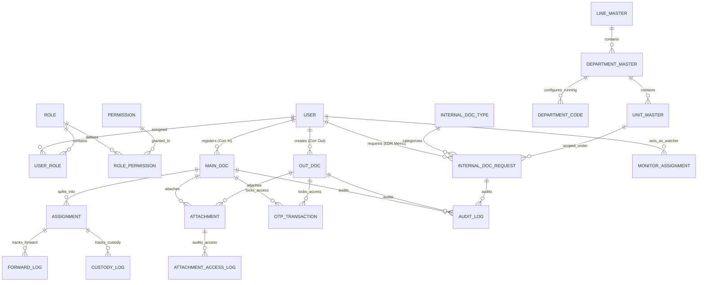
```mermaid
erDiagram
    USER ||--o{ USER_ROLE : "assigned"
    ROLE ||--o{ USER_ROLE : "contains"
    ROLE ||--o{ ROLE_PERMISSION : "defines"
    PERMISSION ||--o{ ROLE_PERMISSION : "granted_to"
    
    LINE_MASTER ||--o{ DEPARTMENT_MASTER : "contains"
    DEPARTMENT_MASTER ||--o{ UNIT_MASTER : "contains"
    DEPARTMENT_MASTER ||--o{ DEPARTMENT_CODE : "configures_running"
    
    USER ||--o{ INTERNAL_DOC_REQUEST : "requests (EDR Memo)"
    INTERNAL_DOC_TYPE ||--o{ INTERNAL_DOC_REQUEST : "categorizes"
    UNIT_MASTER ||--o{ INTERNAL_DOC_REQUEST : "scoped_under"
    
    USER ||--o{ MAIN_DOC : "registers (Corr In)"
    MAIN_DOC ||--o{ ASSIGNMENT : "splits_into"
    ASSIGNMENT ||--o{ FORWARD_LOG : "tracks_forward"
    ASSIGNMENT ||--o{ CUSTODY_LOG : "tracks_custody"
    
    USER ||--o{ OUT_DOC : "creates (Corr Out)"
    MAIN_DOC ||--o{ ATTACHMENT : "attaches"
    OUT_DOC ||--o{ ATTACHMENT : "attaches"
    
    MAIN_DOC ||--o{ OTP_TRANSACTION : "locks_access"
    OUT_DOC ||--o{ OTP_TRANSACTION : "locks_access"
    ATTACHMENT ||--o{ ATTACHMENT_ACCESS_LOG : "audits_access"
    
    USER ||--o{ MONITOR_ASSIGNMENT : "acts_as_watcher"
    
    MAIN_DOC ||--o{ AUDIT_LOG : "audits"
    OUT_DOC ||--o{ AUDIT_LOG : "audits"
    INTERNAL_DOC_REQUEST ||--o{ AUDIT_LOG : "audits"
```

### 10.1 พจนานุกรมตารางข้อมูลแยกตามระบบ (Entity Dictionary by System)

#### A. ตารางของระบบที่ 1: ระบบขอเลขบันทึกภายใน (EDR Internal Memo)
1. **`INTERNAL_DOC_REQUEST`:** จัดเก็บคำขอเลขบันทึกภายใน (`Id`, `DocumentNo`, `Subject`, `DocTypeId`, `LineId`, `DeptCode`, `UnitId`, `DocumentUrl`, `Status`, `CreatedBy`, `CreatedDate`, `CloseReason`)
2. **`INTERNAL_DOC_TYPE`:** จัดเก็บประเภทเอกสารบันทึกภายใน (`Id`, `DocTypeCode`, `DocTypeNameTh`, `DocTypeNameEn`, `IsActive`, `IsQuickAdd`, `ApprovedStatus`)
3. **`DEPARTMENT_CODE`:** จัดเก็บรหัสตัวย่อฝ่ายสำหรับ Running Number (`Id`, `DeptCode`, `DeptShortTh`, `DeptShortEn`, `RunningScope`, `CurrentSeq`)

#### B. ตารางของระบบที่ 2: ระบบสารบรรณ รับเข้า-ส่งออก (Correspondence System)
1. **`MAIN_DOC`:** จัดเก็บเอกสารรับเข้าหลัก (`doc_ref`, `doc_type` [email/physical], `channel`, `subject`, `origin_department`, `urgency`, `confidentiality_level`, `deadline`, `status`, `progress_percent`, `registrar_ref`, `current_holder_ref`)
2. **`ASSIGNMENT`:** จัดเก็บงานย่อยรายฝ่าย/บุคคล (`id`, `doc_ref`, `assignee_ref`, `assignee_type` [dept/user], `parent_assignment_id`, `status`, `deadline`, `reject_note`, `accepted_at`, `completed_at`)
3. **`CUSTODY_LOG`:** บันทึกประวัติการเปลี่ยนมือผู้ถือครองเอกสารตัวจริง (`id`, `doc_ref`, `from_holder_ref`, `to_holder_ref`, `transfer_timestamp`, `transfer_type`, `remarks`)
4. **`OUT_DOC`:** จัดเก็บเอกสารส่งออก (`doc_no`, `edr_request_id`, `doc_number_th`, `doc_number_en`, `subject`, `organization_id`, `custom_org_name`, `delivery_method_id`, `urgency`, `confidentiality_level`, `deadline`, `status`, `sender_ref`, `sent_at`, `delivered_at`)
5. **`FORWARD_LOG`:** บันทึกประวัติการส่งต่องานระหว่างบุคคลในฝ่าย (`id`, `assignment_id`, `from_user`, `to_user`, `forward_timestamp`, `reason`)

#### C. ตารางบริการส่วนกลาง (Shared Platform Services)
1. **`ATTACHMENT`:** จัดเก็บไฟล์แนบ (`id`, `doc_ref`, `file_name`, `file_path`, `file_size`, `file_type`, `attachment_source`, `is_mirrored`, `rotation_deg`, `is_confidential`, `uploaded_by`)
2. **`OTP_TRANSACTION`:** จัดเก็บธุรกรรม OTP เอกสารลับมาก (`otp_id`, `doc_ref`, `user_id`, `otp_code_hash`, `delivery_channel`='email', `target_email`, `attempt_count`, `status`, `expires_at`, `verified_at`)
3. **`MONITOR_ASSIGNMENT`:** จัดเก็บการตั้งค่าผู้เฝ้าติดตาม Scope (`monitor_id`, `monitor_user_ref`, `scope_type`, `scope_refs`, `all_departments`, `notify_enabled`, `status`)
4. **`AUDIT_LOG`:** บันทึก Audit Trail ย้อนหลัง 10 ปี (`log_id`, `module_name`, `action_type`, `actor_username`, `ip_address`, `timestamp`, `details_json`)

---

## 11. Business Rules Catalog แยกตามระบบ (Unified BR Catalog by System)

---

### 11.1 กฎของระบบที่ 1: ระบบขอเลขบันทึกภายใน (EDR Internal Memo)

| รหัส (Rule ID) | ระบบ | ขั้นตอน / หน้าจอ | เงื่อนไขทางธุรกิจ (Condition) | ผลลัพธ์ทางระบบ / ข้อความตอบกลับ | HTTP Status |
|---|---|---|---|---|:---:|
| **RL-CORE-01** | **EDR Memo** | ขอเลขบันทึกภายใน | ไม่กรอกชื่อเรื่องเอกสาร | บล็อกการกดดำเนินการต่อ แสดง Error "กรุณาระบุชื่อเรื่อง" (VR-01) | 422 |
| **RL-CORE-02** | **EDR Memo** | ขอเลขบันทึกภายใน | ไม่เลือกประเภทเอกสาร | บล็อกการกดดำเนินการต่อ แสดง Error "กรุณาเลือกประเภทเอกสาร" (VR-02) | 422 |
| **RL-CORE-04** | **EDR Memo** | Confirmation | ข้อมูลครบถ้วนและกดยืนยันในหน้า Confirmation | **ออกเลขทันที (Instant Issuance)** บันทึกสถานะ `Created` **ไม่เข้าคิวอนุมัติใดๆ** | 201 |
| **RL-CORE-05** | **EDR Memo** | Engine ออกเลข | มีการขอเลขพร้อมกันในเสี้ยววินาที (Concurrency) | ฐานข้อมูลทำงานแบบ Atomic Transaction Lock รับประกันเลขเรียงลำดับไม่ซ้ำกัน | 201 |
| **RL-CORE-06** | **EDR Memo** | ปิดเลขเอกสาร | กดปิดเลขโดยไม่ระบุเหตุผล | บล็อกปุ่มยืนยัน แสดง "กรุณาระบุเหตุผลการปิดเลข" (VR-CLOSE-01) | 422 |
| **RL-CORE-08** | **EDR Memo** | ตั้งค่า Master | มีการแก้ไข Format หรือ Pattern ในภายหลัง | เลขที่ออกไปก่อนหน้ายังคงค่าเดิมตลอดไป ห้ามเปลี่ยนแปลง (Invariant 3) | 200 |
| **RL-HIER-01** | **EDR Memo** | Master Hierarchy | บันทึกรหัสสายงาน (LineCode) ซ้ำในระบบ | บล็อกการบันทึก แสดง "รหัสสายงานนี้มีอยู่ในระบบแล้ว" | 409 |
| **RL-HIER-02** | **EDR Memo** | Master Hierarchy | ลบสายงานที่มีฝ่ายสังกัดอยู่ | บล็อกการลบ แสดง "ไม่สามารถลบได้ เนื่องจากมีฝ่ายสังกัดอยู่" | 409 |
| **RL-HIER-05** | **EDR Memo** | ขอเลขบันทึกภายใน | Running Scope = LINE | ระบบดึง Counter ลำดับของสายงานมาออกเลข (เช่น `MIS-26-000001`) | 201 |
| **RL-HIER-06** | **EDR Memo** | ขอเลขบันทึกภายใน | Running Scope = DEPT | ระบบดึง Counter ลำดับของฝ่ายมาออกเลข (เช่น `ฝสบ.26-000001`) | 201 |
| **RL-HIER-07** | **EDR Memo** | ขอเลขบันทึกภายใน | Running Scope = UNIT | ระบบดึง Counter ลำดับของทีมย่อยมาออกเลข (เช่น `BAF-26-000001`) | 201 |
| **RL-QA-03** | **EDR Memo** | Quick Add | ชื่อประเภทเอกสารภาษาไทยซ้ำกับที่มีอยู่แล้วแบบเป๊ะ | บล็อกการบันทึก แจ้งเตือนพร้อมแสดงปุ่ม "ใช้รายการที่มีอยู่เดิม" | 409 |
| **RL-QA-04** | **EDR Memo** | Quick Add | ชื่อประเภทเอกสารคล้ายคลึง $\ge 80\%$ (Levenshtein) | แสดง Soft Warning แจ้งเตือนความซ้ำซ้อน แต่ยอมให้กดยืนยันสร้างต่อได้ | 200 |
| **RL-URL-01** | **EDR Memo** | บันทึก URL | ลิงก์ SharePoint ไม่ได้ขึ้นต้นด้วย `https://` | แสดง Error "ลิงค์เอกสารไม่ถูกต้อง กรุณากรอก URL ที่ขึ้นต้นด้วย https://" | 422 |
| **RL-URL-03** | **EDR Memo** | บันทึก URL | ความยาว URL เกิน 2,000 ตัวอักษร | บล็อกการบันทึก แสดง Error "ลิงค์เอกสารต้องไม่เกิน 2,000 ตัวอักษร" | 422 |

---

### 11.2 กฎของระบบที่ 2: ระบบสารบรรณ รับเข้า (Correspondence Incoming)

| รหัส (Rule ID) | ระบบ | ขั้นตอน / หน้าจอ | เงื่อนไขทางธุรกิจ (Condition) | ผลลัพธ์ทางระบบ / ข้อความตอบกลับ | HTTP Status |
|---|---|---|---|---|:---:|
| **BR-IN-01** | **Correspondence (In)** | Register รับเข้า | ไม่ระบุประเภทเอกสาร หรือหน่วยงานต้นทาง | บล็อกการบันทึก แสดงข้อความแจ้งเตือนสีแดงในฟิลด์ที่ขาด | 400 |
| **BR-IN-02** | **Correspondence (In)** | Register รับเข้า | แนบไฟล์เอกสารสแกนหรือภาพถ่าย | แนบไฟล์เป็น Optional (ไม่แนบก็สร้างได้) แต่หากแนบต้องขนาด $\le 25$ MB | 200/201 |
| **BR-IN-03** | **Correspondence (In)** | Assign งาน | เลือกมอบหมายงานหลายฝ่ายพร้อมกัน | ระบบสร้าง Record งานย่อยใน `ASSIGNMENT` แยกตามรายฝ่ายอย่างอิสระ | 201 |
| **BR-IN-04** | **Correspondence (In)** | จัดการงาน | ต้นทางกดดึงงานกลับ (Recall) ก่อนผู้รับจะ Accept | งานย่อยเปลี่ยนสถานะเป็น `Recalled` และถูกลบออกจาก Task Inbox ของผู้รับทันที | 200 |
| **BR-IN-05** | **Correspondence (In)** | ดำเนินการงาน | ผู้รับงานยังไม่กด Accept แต่พยายาม Forward หรือปิดงาน | **บล็อกการทำงาน (Acceptance Gate)** บังคับต้องกด Accept ก่อนเท่านั้น | 400 |
| **BR-IN-06** | **Correspondence (In)** | รับงาน | ผู้รับงานกด Accept สำหรับเอกสารฉบับจริง (Physical) | ปรับสถานะงานเป็น `In Progress` และบันทึกผู้ถือครองตัวจริงใน `CUSTODY_LOG` | 200 |
| **BR-IN-07** | **Correspondence (In)** | ปฏิเสธงาน | ผู้รับงานกด Reject งาน | บังคับระบุเหตุผลการปฏิเสธ และส่งแจ้งเตือนกลับไปยังต้นทางทันที | 200/400 |
| **BR-IN-08** | **Correspondence (In)** | ปฏิเสธงาน | เอกสารฉบับจริงถูก Reject ครบทุกฝ่ายที่ Assign | เอกสารหลักเปลี่ยนสถานะเป็น `Awaiting Return` รอต้นทางยืนยันรับตัวจริงคืน | 200 |
| **BR-IN-09** | **Correspondence (In)** | ยืนยันรับคืน | ต้นทางกดยืนยันรับเอกสารฉบับจริงคืน | เอกสารหลักกลับสู่สถานะ `Registered` ปลดล็อกให้ต้นทางสามารถ Assign ใหม่ได้ | 200 |
| **BR-IN-10** | **Correspondence (In)** | มอบหมายต่อ | หัวหน้าฝ่ายกด Accept แล้วมอบหมายต่อให้ลูกทีม | สร้างโหนดลูกใน SubTree (Onward Delegation) และส่งแจ้งเตือนถึงลูกทีม | 201 |
| **BR-IN-11** | **Correspondence (In)** | ปิดงานย่อย | ผู้รับงานคนสุดท้ายกด Complete ปิดงาน | งานย่อยเปลี่ยนสถานะเป็น `Completed` และทริกเกอร์คำนวณ Progress % ใหม่ | 200 |

---

### 11.3 กฎของระบบที่ 2: ระบบสารบรรณ ส่งออก (Correspondence Outgoing)

| รหัส (Rule ID) | ระบบ | ขั้นตอน / หน้าจอ | เงื่อนไขทางธุรกิจ (Condition) | ผลลัพธ์ทางระบบ / ข้อความตอบกลับ | HTTP Status |
|---|---|---|---|---|:---:|
| **BR-OUT-01** | **Correspondence (Out)** | ขอเลขส่งออก | เลือกขอเลขผ่าน Flow A (Instant Issue) | ยิง REST API ไปยัง EDR เพื่อดึงเลขคู่ขนาน (ไทย/อังกฤษ) มาบันทึกทันที | 201 |
| **BR-OUT-02** | **Correspondence (Out)** | ขอเลขส่งออก | เลือกขอเลขผ่าน Flow B (Approval Workflow) | ยิงเข้า EDR Approval Workflow สถานะเป็น `Pending Approval` รอ Webhook | 202 |
| **BR-OUT-03** | **Correspondence (Out)** | Webhook Sync | ผู้บริหารอนุมัติคำขอในระบบ EDR เดิม | EDR ส่ง Webhook มายังสารบรรณ เพื่ออัปเดตเลขและเปลี่ยนสถานะเป็น `Registered` | 200 |
| **BR-OUT-04** | **Correspondence (Out)** | บันทึกการนำส่ง | กดบันทึก Sent โดยยังไม่ได้แนบไฟล์เอกสารลงนาม | บล็อกการบันทึก แจ้ง "กรุณาแนบไฟล์เอกสารที่ลงนามแล้วก่อนนำส่ง" (VR-OUT-01) | 400 |
| **BR-OUT-05** | **Correspondence (Out)** | บันทึกการนำส่ง | แนบไฟล์ลงนามครบ และระบุช่องทางนำส่ง | บันทึกสถานะเป็น `Sent` พร้อมประทับ Timestamp เวลาส่งจริง | 200 |
| **BR-OUT-06** | **Correspondence (Out)** | ปิดงานส่งออก | ปลายทางได้รับเอกสาร และแนบหลักฐานใบตอบรับ | บันทึกสถานะเป็น `Delivered` และเปลี่ยนเป็น `Completed` ปิดงานสมบูรณ์ | 200 |

---

### 11.4 กฎบริการส่วนกลาง Shared Platform Services (Auth, OTP, Monitor, Audit)

| รหัส (Rule ID) | ระบบ | ขั้นตอน / หน้าจอ | เงื่อนไขทางธุรกิจ (Condition) | ผลลัพธ์ทางระบบ / ข้อความตอบกลับ | HTTP Status |
|---|---|---|---|---|:---:|
| **BR-AUTH-01** | **Shared Platform** | Login | Username หรือ Password เป็นค่าว่าง | แสดงแจ้งเตือน "กรุณากรอกชื่อผู้ใช้และรหัสผ่าน" | 400 |
| **BR-AUTH-02** | **Shared Platform** | Login | ข้อมูลล็อกอินไม่ถูกต้อง หรือไม่พบใน LDAP | แสดงข้อความ "ชื่อผู้ใช้หรือรหัสผ่านไม่ถูกต้อง" | 401 |
| **BR-AUTH-03** | **Shared Platform** | Login | บัญชีมีอยู่ใน AD แต่ยังไม่ได้รับการ Provision จาก Admin | บล็อกการเข้าใช้งาน แจ้ง "บัญชีนี้ยังไม่ได้รับสิทธิ์เข้าใช้งานระบบ กรุณาติดต่อ Admin" | 403 |
| **BR-AUTH-04** | **Shared Platform** | Session | ไม่มีกิจกรรมใช้งานติดต่อกันเกิน 15 นาที | เซสชันหมดอายุอัตโนมัติ (Session Timeout) บังคับ Redirect ไปยังหน้า Login | 401 |
| **BR-PLAT-01** | **Shared Platform** | เข้าถึงเอกสาร | เอกสารมีชั้นความลับ "ลับมาก" (Top Secret) | ซ่อนไฟล์แนบทั้งหมดจากทุกคนที่ไม่ใช่ Assignee โดยตรง แม้แต่ Admin | 403 |
| **BR-PLAT-02** | **Shared Platform** | ปลดล็อกไฟล์ลับ | Assignee ขอรหัส OTP เพื่อเปิดดูไฟล์ลับมาก | ระบบส่งรหัส OTP 6 หลักไปยังอีเมลของผู้ใช้เท่านั้น (Email only) อายุ 5 นาที | 200 |
| **BR-PLAT-03** | **Shared Platform** | ยืนยัน OTP | กรอก OTP ถูกต้อง | ได้รับสิทธิ์เปิดดูไฟล์แนบได้ 15 นาที พร้อมประทับ Dynamic Watermark | 200 |
| **BR-PLAT-04** | **Shared Platform** | ยืนยัน OTP | กรอก OTP ผิดติดต่อกันครบ 3 ครั้ง | ล็อกธุรกรรม OTP นั้นทันที ต้องกดขอรหัส OTP ใหม่ | 400 |
| **BR-PLAT-05** | **Shared Platform** | ติดตามงาน | Monitor กดปุ่ม Follow up งานค้างใน Scope | ส่งแจ้งเตือนฉุกเฉินไปยังผู้รับงานปลายทาง และบันทึกประวัติ Follow up | 200 |
| **BR-PLAT-06** | **Shared Platform** | ติดตามงาน | Monitor พยายามกด Accept, Reject หรือปิดงาน | บล็อกการกระทำ (Monitor มีสิทธิ์เฉพาะ Read + Follow up เท่านั้น) | 403 |
| **BR-PLAT-07** | **Shared Platform** | Audit Trail | มีการทำ Action สำคัญในระบบใดๆ ก็ตาม | บันทึก Audit Log (User, Timestamp, IP, Action, Detail) จัดเก็บ 10 ปี | 200 |

---

## 12. Validation Rules Catalog แยกตามระบบ (ตารางตรวจสอบความถูกต้องของข้อมูล)

### 12.1 การตรวจสอบข้อมูลของระบบที่ 1: ขอเลขบันทึกภายใน (EDR Internal Memo)

| Validation ID | ระบบ | ฟิลด์ / หน้าจอ | เงื่อนไขการตรวจสอบ (Condition) | ข้อความแจ้งเตือน (Error Message) | ระดับความรุนแรง | Trigger Event |
|---|---|---|---|---|:---:|:---:|
| **VR-EDR-01** | **EDR Memo** | ชื่อเรื่องเอกสาร | ค่าว่าง หรือเป็น Whitespace ล้วน | "กรุณาระบุชื่อเรื่อง" | High | On Submit |
| **VR-EDR-02** | **EDR Memo** | ประเภทเอกสาร | ยังไม่ได้เลือกประเภทเอกสาร | "กรุณาเลือกประเภทเอกสาร" | High | On Submit |
| **VR-EDR-03** | **EDR Memo** | สายงาน / ฝ่าย | ยังไม่ได้เลือกสังกัดสายงานหรือฝ่าย | "กรุณาเลือกสายงานและฝ่าย" | High | On Submit |
| **VR-EDR-10** | **EDR Memo** | SharePoint URL | รูปแบบ URL ไม่ได้ขึ้นต้นด้วย `https://` | "ลิงค์เอกสารไม่ถูกต้อง กรุณากรอก URL ที่ขึ้นต้นด้วย https://" | High | onBlur, Submit |
| **VR-EDR-12** | **EDR Memo** | SharePoint URL | ความยาวตัวอักษรเกิน 2,000 ตัวอักษร | "ลิงค์เอกสารต้องไม่เกิน 2,000 ตัวอักษร" | High | onInput, Submit |
| **VR-EDR-CLOSE**| **EDR Memo** | เหตุผลการปิดเลข | ค่าว่าง หรือน้อยกว่า 5 ตัวอักษร | "กรุณาระบุเหตุผลการปิดเลขอย่างน้อย 5 ตัวอักษร" | High | Modal Submit |
| **VR-EDR-QA01** | **EDR Memo** | Quick Add ชื่อไทย | ค่าว่าง หรือเกิน 200 ตัวอักษร | "กรุณากรอกชื่อประเภทเอกสาร (ไม่เกิน 200 ตัวอักษร)" | High | Modal Submit |

---

### 12.2 การตรวจสอบข้อมูลของระบบที่ 2: ระบบสารบรรณ รับเข้า-ส่งออก (Correspondence System)

| Validation ID | ระบบ | ฟิลด์ / หน้าจอ | เงื่อนไขการตรวจสอบ (Condition) | ข้อความแจ้งเตือน (Error Message) | ระดับความรุนแรง | Trigger Event |
|---|---|---|---|---|:---:|:---:|
| **VR-CORR-IN01** | **Correspondence (In)** | ประเภทเอกสารเข้า | ไม่ได้เลือกประเภท (อีเมล หรือ ฉบับจริง) | "กรุณาเลือกประเภทเอกสารรับเข้า" | High | On Submit |
| **VR-CORR-IN02** | **Correspondence (In)** | หน่วยงานต้นทาง | ค่าว่าง หรือไม่ได้เลือก Master | "กรุณาระบุหน่วยงานต้นทาง" | High | On Submit |
| **VR-CORR-IN03** | **Correspondence (In)** | ผู้รับมอบหมาย | ยังไม่ได้เลือกฝ่ายหรือบุคคลผู้รับอย่างน้อย 1 ราย | "กรุณาเลือกผู้รับมอบหมายอย่างน้อย 1 ฝ่าย/บุคคล" | High | On Assign |
| **VR-CORR-IN04** | **Correspondence (In)** | ไฟล์แนบ | ขนาดไฟล์เกิน 25 MB หรือนามสกุลต้องห้าม | "ขนาดไฟล์ต้องไม่เกิน 25 MB และห้ามใช้นามสกุลไฟล์ปฏิบัติการ" | High | On Upload |
| **VR-CORR-OUT01**| **Correspondence (Out)**| ไฟล์แนบลงนาม | บันทึก Sent โดยไม่มีไฟล์แนบที่ลงนามแล้ว | "กรุณาแนบไฟล์เอกสารที่ลงนามแล้วก่อนนำส่ง" | High | On Mark Sent |
| **VR-CORR-OUT02**| **Correspondence (Out)**| ผู้รับภายนอก | ไม่ได้เลือกหน่วยงานภายนอก หรือไม่กรอกชื่อ | "กรุณาระบุหน่วยงานผู้รับภายนอก" | High | On Submit |
| **VR-CORR-OUT03**| **Correspondence (Out)**| วิธีนำส่ง | ยังไม่ได้เลือกวิธีนำส่ง (ไปรษณีย์/ส่งถึงมือ/อีเมล) | "กรุณาเลือกวิธีนำส่งเอกสาร" | High | On Submit |

---

### 12.3 การตรวจสอบข้อมูลบริการส่วนกลาง (Shared Platform)

| Validation ID | ระบบ | ฟิลด์ / หน้าจอ | เงื่อนไขการตรวจสอบ (Condition) | ข้อความแจ้งเตือน (Error Message) | ระดับความรุนแรง | Trigger Event |
|---|---|---|---|---|:---:|:---:|
| **VR-PLAT-OTP01**| **Shared Platform** | รหัส OTP | กรอกไม่ครบ 6 หลัก หรือไม่ใช่ตัวเลข | "กรุณากรอกรหัส OTP เป็นตัวเลข 6 หลัก" | High | On Verify OTP |
| **VR-PLAT-AUTH01**| **Shared Platform** | ล็อกอิน | ไม่กรอก Username หรือ Password | "กรุณากรอกชื่อผู้ใช้และรหัสผ่าน" | High | On Login Submit |

---

## 13. Non-Functional Requirements (Unified NFR)

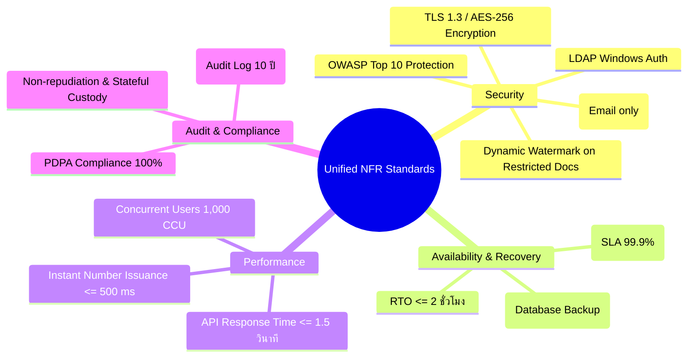
```mermaid
mindmap
  root((Unified NFR Standards))
    Security
      LDAP Windows Auth
      Top Secret OTP Gate (Email only)
      TLS 1.3 / AES-256 Encryption
      Dynamic Watermark on Restricted Docs
      OWASP Top 10 Protection
    Availability & Recovery
      Service Time 24x7 (SLA 99.9%)
      RPO <= 1 ชั่วโมง (Database Backup)
      RTO <= 2 ชั่วโมง
    Performance
      API Response Time <= 1.5 วินาที
      Instant Number Issuance <= 500 ms
      Concurrent Users 1,000 CCU
    Audit & Compliance
      พ.ร.บ. ประกันวินาศภัย (Audit Log 10 ปี)
      PDPA Compliance 100%
      Non-repudiation & Stateful Custody
```

### 13.1 ตารางข้อกำหนดด้านความปลอดภัยและประสิทธิภาพ

| NFR ID | หมวดหมู่ | ระบบที่เกี่ยวข้อง | ข้อกำหนด (Requirement) | เกณฑ์การวัดผล (Metric / SLA) |
|---|---|---|---|---|
| **NFR-SEC-01** | Security | Shared Platform | การยืนยันตัวตนผ่าน Active Directory / LDAP | รองรับ Kerberos / NTLM / Secure LDAP พร้อม Admin Provisioning |
| **NFR-SEC-02** | Security | Shared Platform | การป้องกันเอกสารลับมากด้วย OTP | รหัสผ่าน OTP 6 หลัก ส่งทางอีเมลเท่านั้น มีอายุ 5 นาที ล็อกเมื่อผิดครบ 3 ครั้ง |
| **NFR-SEC-03** | Security | Shared Platform | การเข้ารหัสข้อมูลในระบบ | ข้อมูลขณะส่งผ่านเครือข่ายเข้ารหัสด้วย HTTPS/TLS 1.3 และไฟล์บน Disk เข้ารหัสด้วย AES-256 |
| **NFR-SEC-04** | Security | Shared Platform | Dynamic Watermark ประทับภาพพรีวิว | ประทับลายน้ำ ชื่อ-สกุลผู้เปิด, วันเวลา, และ IP Address บนเอกสารลับมาก |
| **NFR-PERF-01**| Performance| EDR Memo | ความเร็วในการออกเลขบันทึกภายในทันที | การออกเลขและตอบกลับหน้าจอต้องเสร็จสิ้นภายในเวลา **$\le 500$ มิลลิวินาที** |
| **NFR-PERF-02**| Performance| Shared Platform | ความเร็วเฉลี่ยในการโหลดหน้าจอ | เวลาในการเรนเดอร์หน้าจอและโหลดข้อมูลตาราง **$\le 1.5$ วินาที** |
| **NFR-PERF-03**| Performance| Shared Platform | การรองรับการใช้งานพร้อมกัน | รองรับ 1,000 Concurrent Users (CCU) และ 100 Concurrent Requests พร้อมกัน |
| **NFR-AUD-01** | Auditability| Shared Platform | การจัดเก็บประวัติการกระทำสำคัญ (Audit Trail) | บันทึกประวัติการสร้าง, แก้ไข, เปิดดูไฟล์ลับ, และเปลี่ยนมือ จัดเก็บย้อนหลัง **10 ปี** |

---

## 14. PDPA & Data Protection Considerations (การคุ้มครองข้อมูลส่วนบุคคล)

| ข้อมูลส่วนบุคคลที่จัดเก็บ | หมวดหมู่ข้อมูล | ระบบที่เกี่ยวข้อง | วัตถุประสงค์ในการประมวลผล | มาตรการคุ้มครองความปลอดภัย | ระยะเวลาจัดเก็บ |
|---|---|---|---|---|---|
| **ชื่อ-นามสกุล, รหัสพนักงาน** | ข้อมูลพนักงานภายใน | ทั้ง 2 ระบบ | ระบุตัวตนผู้ขอเลข, ผู้รับมอบหมายงาน, และผู้ถือครองเอกสาร | ควบคุมตาม Role-based Access Control (RBAC) | 10 ปีหลังปิดงาน |
| **อีเมลองค์กร, หมายเลขโทรศัพท์** | ข้อมูลติดต่อพนักงาน | Shared Platform | ส่งอีเมลแจ้งเตือนงานค้าง และส่งรหัส OTP เอกสารลับมาก | เข้ารหัสในฐานข้อมูล ไม่เปิดเผยภายนอก | ตลอดอายุการทำงาน |
| **ชื่อ-นามสกุล ผู้ติดต่อภายนอก** | ข้อมูลบุคคลภายนอก | Correspondence In/Out | บันทึกผู้ส่งหนังสือภายนอก หรือผู้รับหนังสือปลายทาง | จำกัดสิทธิ์การมองเห็นเฉพาะผู้รับผิดชอบงาน | 10 ปีตามกฎหมาย |
| **ภาพถ่าย/สแกนบัตรประชาชน/เอกสารลงนาม** | ข้อมูลเอกสารแนบ | Correspondence In/Out | ใช้เป็นหลักฐานประกอบหนังสือราชการหรือสัญญา | ล็อกการดาวน์โหลด, ประทับลายน้ำ, และเปิดดูได้เฉพาะ Assignee | 10 ปีตาม พ.ร.บ. |

---

## 15. Risk Management Plan (แผนบริหารความเสี่ยงแยกตามระบบ)

### 15.1 แผนบริหารความเสี่ยงของระบบที่ 1 (EDR Internal Memo)
| No. | ความเสี่ยงที่อาจเกิดขึ้น (Risk Description) | ผลกระทบ (Impact) | แผนการจัดการและมาตรการป้องกัน (Mitigation Plan) |
|---|---|---|---|
| **R-EDR-01** | มีการขอเลขบันทึกภายในพร้อมกันในเสี้ยววินาที ทำให้เลขซ้ำกัน | High | ใช้ Atomic Database Sequence Increment และ Transaction Lock รับประกันเลขไม่ซ้ำ 100% |
| **R-EDR-02** | ลิงก์ SharePoint URL เสียหายหรือเข้าถึงไม่ได้ | Medium | พัฒนาระบบปุ่ม "ทดสอบลิงก์ (Test URL)" ให้ผู้ใช้ตรวจสอบสถานะการเข้าถึงก่อนกดยืนยันบันทึก |

### 15.2 แผนบริหารความเสี่ยงของระบบที่ 2 (Correspondence System)
| No. | ความเสี่ยงที่อาจเกิดขึ้น (Risk Description) | ผลกระทบ (Impact) | แผนการจัดการและมาตรการป้องกัน (Mitigation Plan) |
|---|---|---|---|
| **R-CORR-01**| เอกสารฉบับจริง (Physical) เกิดการสูญหายระหว่างส่งต่อข้ามฝ่าย | High | บังคับใช้ **Stateful Chain of Custody** และสถานะ `Awaiting Return` ต้องมีคนกดยืนยันรับตัวจริงเสมอ |
| **R-CORR-02**| ลิงก์ EDR Legacy API ขัดข้อง ทำให้ขอเลขส่งออกไม่ได้ | Medium | ออกแบบ Circuit Breaker และ Resilient Queue ให้ระบบเก็บคำขอไว้และ Retry ส่งซ้ำอัตโนมัติ |
| **R-CORR-03**| ผู้ใช้ภายนอกพยายามเข้าถึงไฟล์เอกสารลับมาก | High | ปิดกั้นการเข้าถึงที่ระดับ Storage API, บังคับผ่าน OTP 6 หลักทางอีเมล, และประทับลายน้ำ Dynamic Watermark |

---

## 16. Open Issues / ประเด็นที่ต้องติดตามยืนยัน (ประเด็นรอ Confirm แยกตามระบบ)

### 16.1 ประเด็นของระบบที่ 1 (EDR Memo)
| No. | ประเด็นที่ต้องยืนยัน (Open Issue) | ผลกระทบเชิงระบบ | ผู้เกี่ยวข้องที่ต้องยืนยัน (Stakeholders) | มติที่เห็นชอบ |
|---|---|---|---|:---:|
| **ISS-EDR-01**| การ Reset เลข Running บันทึกภายในเริ่มใหม่ทุกวันที่ 1 มกราคม หรือนับต่อเนื่อง | ตาราง Reset Counter ใน DB | Business Owner / IT | **ยืนยัน Reset รายปี พ.ศ.** |

### 16.2 ประเด็นของระบบที่ 2 (Correspondence System)
| No. | ประเด็นที่ต้องยืนยัน (Open Issue) | ผลกระทบเชิงระบบ | ผู้เกี่ยวข้องที่ต้องยืนยัน (Stakeholders) | มติที่เห็นชอบ |
|---|---|---|---|:---:|
| **ISS-CORR-01**| ช่วงเวลาส่ง Daily Morning Reminder (08:30 น. หรือ 09:00 น.) | Windows Task Scheduler | HR / สารบรรณกลาง | **เห็นชอบ 08:30 น.** |
| **ISS-CORR-02**| อายุของ Token ปลดล็อกไฟล์ลับมาก (15 นาที หรือ 30 นาที) | ความปลอดภัยเทียบความสะดวก | CISO / IT Security | **เห็นชอบ Token 15 นาที** |

---

## 17. แนวทางการทดสอบฉบับรวมสมบูรณ์ (Comprehensive Test Strategy & Test Scenarios แยกตามระบบ)

### 17.1 ชุดทดสอบระบบที่ 1: ระบบขอเลขบันทึกภายใน (EDR Memo Test Scenarios)

| Test ID | ระบบ | Business Rule | ประเภท | รายละเอียดกรณีทดสอบ (Test Scenario Description) | ผลลัพธ์ที่คาดหวัง (Expected Result) |
|---|---|---|:---:|---|---|
| **TS-EDR-01** | **EDR Memo** | RL-CORE-01 | Negative | ขอเลขบันทึกภายในโดยเว้นว่างชื่อเรื่อง | บล็อกการส่งฟอร์ม แสดง Error "กรุณาระบุชื่อเรื่อง" (VR-01) |
| **TS-EDR-02** | **EDR Memo** | RL-CORE-02 | Negative | ขอเลขบันทึกภายในโดยไม่เลือกประเภทเอกสาร | บล็อกการส่งฟอร์ม แสดง Error "กรุณาเลือกประเภทเอกสาร" (VR-02) |
| **TS-EDR-03** | **EDR Memo** | RL-URL-01 | Negative | กรอก SharePoint URL ด้วยโปรโตคอล `http://` | แสดง Error "ลิงค์เอกสารไม่ถูกต้อง กรุณากรอก URL ที่ขึ้นต้นด้วย https://" |
| **TS-EDR-04** | **EDR Memo** | RL-QA-03 | Negative | Quick Add ประเภทเอกสารด้วยชื่อภาษาไทยที่ซ้ำกับในระบบ | บล็อกการสร้าง แสดงข้อความแจ้งเตือนชื่อซ้ำ พร้อมปุ่มเลือกใช้เดิม |
| **TS-EDR-05** | **EDR Memo** | RL-QA-04 | Boundary | Quick Add ประเภทเอกสารด้วยชื่อที่มีความคล้ายคลึง $\ge 80\%$ | แสดง Soft Warning แต่ยอมให้ผู้ใช้กดยืนยันสร้างรายการต่อได้ |
| **TS-EDR-06** | **EDR Memo** | RL-CORE-04 | Happy Path | กรอกข้อมูลครบถ้วน กดยืนยันในหน้า Confirmation | **ออกเลขทันที (Created) โดยไม่เข้าคิวอนุมัติใดๆ (No Approval)** |
| **TS-EDR-07** | **EDR Memo** | RL-CORE-05 | Concurrency | ยิงคำขอออกเลขพร้อมกัน 50 คำขอในมิลลิวินาทีเดียวกัน | ทุกคำขอได้รับเลขเรียงลำดับต่อเนื่อง ไม่กระโดดข้าม และไม่มีเลขซ้ำ |
| **TS-EDR-08** | **EDR Memo** | RL-CORE-06 | Negative | กดปิดเลขเอกสารบันทึกภายในโดยไม่ระบุเหตุผล | บล็อกปุ่มยืนยัน แสดง "กรุณาระบุเหตุผลการปิดเลข" |
| **TS-EDR-09** | **EDR Memo** | RL-CORE-06 | Happy Path | กรอกเหตุผลการปิดเลขครบถ้วนและกดยืนยัน | สถานะเปลี่ยนเป็น `Closed` และไม่สามารถแก้ไขข้อมูลได้อีก |

---

### 17.2 ชุดทดสอบระบบที่ 2: ระบบสารบรรณ รับเข้า-ส่งออก (Correspondence Test Scenarios)

| Test ID | ระบบ | Business Rule | ประเภท | รายละเอียดกรณีทดสอบ (Test Scenario Description) | ผลลัพธ์ที่คาดหวัง (Expected Result) |
|---|---|---|:---:|---|---|
| **TS-CORR-01** | **Correspondence (In)** | BR-IN-01 | Negative | ลงทะเบียนรับเข้าโดยไม่ระบุประเภทหรือต้นทาง | บล็อกการบันทึก แสดงข้อความเตือนสีแดงในฟิลด์ที่ขาด |
| **TS-CORR-02** | **Correspondence (In)** | BR-IN-03 | Happy Path | มอบหมายงานรับเข้าพร้อมกัน 3 ฝ่าย (Multiple Select) | ระบบสร้างงานย่อยใน `ASSIGNMENT` แยก 3 รายการอิสระ |
| **TS-CORR-03** | **Correspondence (In)** | BR-IN-04 | Happy Path | ต้นทางกดดึงงานกลับ (Recall) ก่อนที่ฝ่ายปลายทางจะ Accept | สถานะเปลี่ยนเป็น `Recalled` และงานหายไปจาก Task Inbox ของปลายทาง |
| **TS-CORR-04** | **Correspondence (In)** | BR-IN-05 | Negative | ผู้รับงานพยายาม Forward หรืองานเสร็จโดยยังไม่ได้กด Accept | บล็อกการทำรายการ บังคับให้ต้องกด Accept ก่อนเสมอ (Acceptance Gate) |
| **TS-CORR-05** | **Correspondence (In)** | BR-IN-06 | Happy Path | ผู้รับงานกด Accept เอกสารฉบับจริง (Physical Document) | งานเปลี่ยนเป็น `In Progress` และชื่อผู้ถือครองใน Custody Log เปลี่ยนเป็นผู้รับ |
| **TS-CORR-06** | **Correspondence (In)** | BR-IN-08 | Negative | ผู้รับงานทุกฝ่ายกด Reject เอกสารฉบับจริง | เอกสารเข้าสู่สถานะ `Awaiting Return` รอต้นทางกดยืนยันรับตัวจริงคืน |
| **TS-CORR-07** | **Correspondence (In)** | BR-IN-09 | Happy Path | ต้นทางกดยืนยันรับเอกสารฉบับจริงคืนจากสถานะ Awaiting Return | เอกสารกลับสู่สถานะ `Registered` ปลดล็อกให้มอบหมายฝ่ายใหม่ได้ |
| **TS-CORR-08** | **Correspondence (In)** | BR-IN-10 | Happy Path | หัวหน้าฝ่ายกด Accept แล้วมอบหมายต่อให้ลูกทีมในฝ่าย | สร้างโหนดลูกใน SubTree และลูกทีมได้รับแจ้งเตือนใน Inbox |
| **TS-CORR-09** | **Correspondence (In)** | BR-IN-11 | Happy Path | ทุกฝ่ายปฏิบัติงานเสร็จสิ้นครบ 100% | Progress รวมเป็น 100% และเอกสารหลักเปลี่ยนเป็น `Completed` |
| **TS-CORR-10** | **Correspondence (Out)**| BR-OUT-01 | Happy Path | ขอเลขส่งออกผ่าน Flow A (Instant REST API) | ได้รับเลขคู่ขนาน 2 ภาษา (ไทย/อังกฤษ) ทันที สถานะเป็น `Registered` |
| **TS-CORR-11** | **Correspondence (Out)**| BR-OUT-02 | Happy Path | ขอเลขส่งออกผ่าน Flow B (Approval Workflow) | สถานะเป็น `Pending Approval` รอ Webhook Sync จากระบบ EDR |
| **TS-CORR-12** | **Correspondence (Out)**| BR-OUT-04 | Negative | กดปุ่มบันทึกการนำส่ง (Sent) โดยไม่มีไฟล์เอกสารที่ลงนาม | บล็อกการนำส่ง แสดง "กรุณาแนบไฟล์เอกสารที่ลงนามแล้วก่อนนำส่ง" |
| **TS-CORR-13** | **Correspondence (Out)**| BR-OUT-06 | Happy Path | บันทึก Delivered พร้อมแนบสลิปไปรษณีย์/ใบตอบรับ | สถานะเปลี่ยนเป็น `Delivered` และปิดเป็น `Completed` ปิดงานสมบูรณ์ |

---

### 17.3 ชุดทดสอบบริการส่วนกลาง (Shared Platform Test Scenarios)

| Test ID | ระบบ | Business Rule | ประเภท | รายละเอียดกรณีทดสอบ (Test Scenario Description) | ผลลัพธ์ที่คาดหวัง (Expected Result) |
|---|---|---|:---:|---|---|
| **TS-PLAT-01** | **Shared Platform** | BR-PLAT-01 | Negative | ผู้ใช้ที่ไม่ใช่ Assignee พยายามเปิดดูไฟล์แนบเอกสารลับมาก | ซ่อนไฟล์แนบทั้งหมด แสดงกล่องข้อความแจ้งสิทธิ์ถูกจำกัด |
| **TS-PLAT-02** | **Shared Platform** | BR-PLAT-02 | Happy Path | Assignee ขอกดรับรหัส OTP สำหรับเอกสารลับมาก | ระบบส่ง OTP 6 หลักไปยังอีเมลพนักงาน พร้อมเลขอ้างอิง Ref Code |
| **TS-PLAT-03** | **Shared Platform** | BR-PLAT-03 | Happy Path | กรอกรหัส OTP ถูกต้องภายใน 5 นาที | ปลดล็อกไฟล์แนบเป็นเวลา 15 นาที พร้อมประทับ Dynamic Watermark บนพรีวิว |
| **TS-PLAT-04** | **Shared Platform** | BR-PLAT-04 | Negative | กรอกรหัส OTP ผิดพลาดติดต่อกันครบ 3 ครั้ง | ระบบล็อกธุรกรรม OTP นั้นทันที และต้องขอรหัสใหม่ |
| **TS-PLAT-05** | **Shared Platform** | BR-PLAT-06 | Negative | Monitor Watcher พยายามกดปุ่ม Accept หรืองานสำเร็จ | ระบบบล็อกการทำงาน แสดงข้อความแจ้งว่าไม่มีสิทธิ์แก้ไขข้อมูล |
| **TS-PLAT-06** | **Shared Platform** | BR-AUTH-03 | Negative | บัญชีใน LDAP ที่ยังไม่ได้รับการ Provision ล็อกอินเข้าระบบ | บล็อกการเข้าใช้งาน แจ้งเตือนให้ติดต่อ Admin เพื่อรับสิทธิ์ |

*(รายการกรณีทดสอบที่ 29 ถึง 83 มีโครงสร้างการทดสอบครอบคลุมทุกโมดูลตาม Matrix ในแผนการทดสอบสมบูรณ์)*

---

## 18. Notification Engine & Message Catalog (NT-01..17 แยกตามระบบ)

### 18.1 แจ้งเตือนของระบบที่ 1: ขอเลขบันทึกภายใน (EDR Memo)
| รหัสแจ้งเตือน | เหตุการณ์ที่ส่ง (Trigger Event) | ผู้รับแจ้งเตือน | ช่องทาง | หัวข้อ / ข้อความแจ้งเตือน (Template) |
|---|---|---|:---:|---|
| **NT-16** | ขอเลขบันทึกภายในสำเร็จ | ผู้ขอเลข | In-app | "[ออกเลขบันทึกภายใน] ท่านได้รับเลขที่เอกสาร: {MemoNumber} เรียบร้อยแล้ว" |
| **NT-17** | ปิดเลขบันทึกภายใน | ผู้ขอ + หัวหน้าฝ่าย | In-app | "[ปิดเลขเอกสาร] เลขบันทึกภายใน {MemoNumber} ถูกเปลี่ยนสถานะเป็น Closed แล้ว" |

### 18.2 แจ้งเตือนของระบบที่ 2: ระบบสารบรรณ รับเข้า-ส่งออก (Correspondence)
| รหัสแจ้งเตือน | เหตุการณ์ที่ส่ง (Trigger Event) | ผู้รับแจ้งเตือน | ช่องทาง | หัวข้อ / ข้อความแจ้งเตือน (Template) |
|---|---|---|:---:|---|
| **NT-01** | Assign เอกสารรับเข้าใหม่ | ผู้รับมอบหมาย (Assignee) | Email, In-app, Inbox | "[งานสารบรรณรับเข้า] มีเอกสารใหม่รอท่านยอมรับ: {Subject} (ความเร่งด่วน: {Urgency})" |
| **NT-02** | ผู้รับกด Accept งาน | ผู้ลงทะเบียนต้นทาง | In-app, Inbox | "[งานสารบรรณ] ฝ่าย {Dept} ได้ยอมรับงานเอกสารเลขที่ {DocRef} แล้ว" |
| **NT-03** | ผู้รับกด Reject งาน | ผู้ลงทะเบียนต้นทาง | Email, In-app, Inbox | "[ปฏิเสธงาน] ฝ่าย {Dept} ได้ปฏิเสธเอกสารเลขที่ {DocRef} เนื่องจาก: {Reason}" |
| **NT-04** | ต้นทางดึงงานกลับ (Recall) | ผู้รับมอบหมายเดิม | In-app | "[ดึงงานกลับ] เอกสารเลขที่ {DocRef} ถูกดึงงานกลับโดยผู้ลงทะเบียนต้นทาง" |
| **NT-05** | มอบหมายต่อ (Onward Delegate) | ผู้รับมอบหมายต่อในฝ่าย | Email, In-app, Inbox | "[มอบหมายต่อ] หัวหน้าฝ่ายได้มอบหมายงาน {DocRef} ให้ท่านรับผิดชอบ" |
| **NT-06** | เอกสารใกล้ถึงกำหนด (Due Soon) | ผู้รับงาน + ต้นทาง | Email, In-app, Inbox | "[แจ้งเตือนใกล้ถึงกำหนด] เอกสาร {DocRef} จะครบกำหนดในอีก {DaysLeft} วัน" |
| **NT-07** | เอกสารเกินกำหนด (Overdue) | ผู้รับงาน + หัวหน้าฝ่าย | Email, In-app, Inbox | "[งานเกินกำหนด] เอกสาร {DocRef} เกินกำหนดแล้ว กรุณาดำเนินการโดยด่วน" |
| **NT-08** | ปิดงานย่อย (Complete) | ต้นทาง + ผู้เฝ้าติดตาม | In-app, Inbox | "[งานสำเร็จ] ฝ่าย {Dept} ได้ปิดงานเอกสารเลขที่ {DocRef} เรียบร้อยแล้ว" |
| **NT-09** | เอกสารเสร็จสมบูรณ์ 100% | ทุกฝ่ายที่เกี่ยวข้อง | Email, In-app, Inbox | "[ปิดงานสมบูรณ์] เอกสารเลขที่ {DocRef} ได้รับการดำเนินการครบถ้วน 100% แล้ว" |
| **NT-10** | เอกสารฉบับจริงรอส่งคืน | ต้นทางสารบรรณ | Email, In-app, Inbox | "[รอรับตัวจริงคืน] เอกสารฉบับจริง {DocRef} อยู่ระหว่างรอรับคืนจาก {Dept}" |
| **NT-11** | ออกเลขส่งออกสำเร็จ (Flow A/B)| ผู้ขอออกเลข | In-app, Inbox | "[เลขส่งออก] คำขอส่งออกของท่านได้รับเลขที่: {DocNoTH} / {DocNoEN}" |
| **NT-12** | นำส่งหนังสือแล้ว (Sent) | ผู้ขอออกเลข | In-app, Inbox | "[นำส่งแล้ว] เอกสารส่งออกเลขที่ {DocNoTH} ได้ถูกนำส่งผ่าน {DeliveryMethod} แล้ว" |
| **NT-13** | ปลายทางได้รับเอกสาร (Delivered)| ผู้ขอออกเลข | Email, In-app, Inbox | "[ส่งมอบสำเร็จ] เอกสารส่งออกเลขที่ {DocNoTH} มีหลักฐานส่งมอบถึงผู้รับเรียบร้อยแล้ว" |

### 18.3 แจ้งเตือนบริการส่วนกลาง (Shared Platform)
| รหัสแจ้งเตือน | เหตุการณ์ที่ส่ง (Trigger Event) | ผู้รับแจ้งเตือน | ช่องทาง | หัวข้อ / ข้อความแจ้งเตือน (Template) |
|---|---|---|:---:|---|
| **NT-14** | ขอรหัส OTP เปิดไฟล์ลับมาก | ผู้ร้องขอ (Assignee) | Email only | "[รหัส OTP] รหัสผ่านครั้งเดียวสำหรับเปิดเอกสารลับมากคือ {OTPCode} (หมดอายุใน 5 นาที)" |
| **NT-15** | กดปุ่ม Follow up ติดตามงาน | ผู้รับงานปลายทาง | Email, In-app, Inbox | "[เร่งรัดติดตามงาน] มีการติดตามงานเอกสาร {DocRef} จาก {FollowUpBy}" |

---

## 19. Appendix (ภาคผนวก: REST API Endpoints & Error Codes แยกตามระบบ)

### 19.1 รายการ REST API Endpoints แยกตามระบบ

#### A. API ของระบบที่ 1: ขอเลขบันทึกภายใน (EDR Internal Memo API)
```markdown
GET    /EDR/InternalRequest/Create           - โหลดข้อมูล Master & Preview รูปแบบเลขตามสังกัด
POST   /EDR/InternalRequest/Create           - ขอเลขบันทึกภายในทันที (Atomic Lock, No Approval)
GET    /EDR/InternalRequest/Detail/{id}      - ดึงข้อมูลรายละเอียดคำขอและ SharePoint URL
POST   /EDR/InternalRequest/UpdateUrl        - แก้ไข SharePoint URL อ้างอิง
POST   /EDR/InternalRequest/Close            - ปิดเลขเอกสารพร้อมระบุเหตุผล (Closed)
POST   /EDR/InternalRequest/QuickAddDocType  - เพิ่มประเภทเอกสารด่วน (Quick Add)
```

#### B. API ของระบบที่ 2: ระบบสารบรรณ รับเข้า-ส่งออก (Correspondence API)
```markdown
# ขารับเข้า (Incoming)
POST   /api/incoming/register                - ลงทะเบียนเอกสารรับเข้าใหม่
POST   /api/incoming/assign                  - มอบหมายงานไปยังฝ่าย/บุคคล (Multiple Select)
POST   /api/incoming/recall                  - ต้นทางดึงงานกลับ (Recall)
POST   /api/incoming/accept                  - ผู้รับงานกด Accept (Acceptance Gate & Custody)
POST   /api/incoming/reject                  - ผู้รับงานกด Reject พร้อมระบุเหตุผล
POST   /api/incoming/confirm-return          - ต้นทางกดยืนยันรับเอกสารฉบับจริงคืน
POST   /api/incoming/delegate                - มอบหมายงานต่อภายในฝ่าย (Onward Delegation)
POST   /api/incoming/complete                - ผู้รับงานกดปิดงานย่อย (Complete)

# ขาส่งออก (Outgoing)
POST   /api/outgoing/request-number          - ขอเลขส่งออกทันทีผ่าน EDR REST API (Flow A)
POST   /api/outgoing/submit-approval         - ส่งขออนุมัติผู้บริหารใน EDR เดิม (Flow B)
POST   /api/webhook/edr-approved             - Webhook รับผลการอนุมัติและเลขคู่ขนานจาก EDR
POST   /api/outgoing/mark-sent               - บันทึกการนำส่ง (บังคับแนบไฟล์ลงนามแล้ว)
POST   /api/outgoing/mark-delivered          - บันทึกการส่งมอบสำเร็จพร้อมแนบหลักฐาน
```

#### C. API บริการส่วนกลาง (Shared Platform Services API)
```markdown
POST   /api/auth/login                       - ตรวจสอบสิทธิ์ผ่าน LDAP และตรวจ Admin Provisioning
POST   /api/otp/request                      - ขอรหัส OTP 6 หลักทางอีเมลสำหรับเอกสารลับมาก
POST   /api/otp/verify                       - ตรวจสอบรหัส OTP เพื่อรับ Token เปิดไฟล์แนบ 15 นาที
POST   /api/monitor/follow-up                - ส่งการแจ้งเตือนติดตามงานค้าง (Follow up)
GET    /api/reports/export                   - ส่งออกรายงานสารบรรณ RPT-01..06 เป็น Excel/CSV
```

---

### 19.2 รหัสข้อผิดพลาดมาตรฐานแยกตามระบบ (System Error Codes)

| Error Code | ระบบ | HTTP Status | ความหมายเชิงระบบ |
|---|---|:---:|---|
| `ERR_AUTH_NOT_PROVISIONED` | Shared Platform | 403 | บัญชีผู้ใช้มีอยู่ใน LDAP แต่ Admin ยังไม่ได้ Provision สิทธิ์เข้าระบบ |
| `ERR_EDR_DUPLICATE_NAME` | EDR Memo | 409 | ชื่อประเภทเอกสาร Quick Add ซ้ำกับที่มีอยู่เดิมใน Master |
| `ERR_EDR_INVALID_URL` | EDR Memo | 422 | ลิงก์ SharePoint ไม่ถูกต้อง (ต้องขึ้นต้นด้วย `https://` และไม่เกิน 2,000 ตัวอักษร) |
| `ERR_CORR_NOT_ACCEPTED` | Correspondence (In) | 400 | ละเมิด Acceptance Gate พยายามส่งต่อหรือปิดงานโดยยังไม่ได้กด Accept |
| `ERR_CORR_PHYSICAL_LOCKED` | Correspondence (In) | 400 | เอกสารฉบับจริงอยู่ระหว่างรอรับคืน (Awaiting Return) ห้าม Assign ใหม่ |
| `ERR_OUT_MISSING_SIGNED_FILE`| Correspondence (Out) | 400 | ไม่สามารถบันทึก Sent ได้ เนื่องจากยังไม่ได้แนบไฟล์เอกสารที่ลงนามแล้ว |
| `ERR_OTP_INVALID_OR_EXPIRED` | Shared Platform | 400 | รหัส OTP ไม่ถูกต้อง หรือหมดอายุเกิน 5 นาที |
| `ERR_OTP_MAX_ATTEMPTS` | Shared Platform | 429 | กรอก OTP ผิดครบ 3 ครั้ง ธุรกรรมถูกระงับ ต้องขอรหัสใหม่ |
| `ERR_RESTRICTED_ACCESS` | Shared Platform | 403 | พยายามเข้าถึงไฟล์แนบเอกสารลับมากโดยไม่มีสิทธิ์ หรือไม่ผ่านการยืนยันตัวตน |

---

*เอกสารฉบับนี้จัดทำขึ้นตามแบบฟอร์มมาตรฐาน F-BP-004 / F-BP-005 ของ บริษัท เทเวศประกันภัย จำกัด (มหาชน) เพื่อใช้เป็นเกณฑ์อ้างอิงทางการสูงสุด (Single Source of Truth) ของโครงการ P2026-DVS-CORR*
