# เอกสารวิเคราะห์ความต้องการระบบ (SRS Analysis) — P2026-DVS-CORR

> สรุปและวิเคราะห์จาก **Software Requirement Specification: F-BP-004 / F-BP-005**  
> โครงการพัฒนาระบบสารบรรณอิเล็กทรอนิกส์และระบบออกเลขที่เอกสาร — บริษัท เทเวศประกันภัย จำกัด (มหาชน)  
>
> เอกสารนี้จัดทำขึ้นเพื่อใช้ **อธิบายภาพรวมระบบ / อธิบายความต่างของเรียกลำดับขั้นตอนการดำเนินงาน / ใช้ในการพัฒนา / และใช้เป็นฐานในการวิเคราะห์และออกแบบการทดสอบ (SIT/UAT)**  
> เวอร์ชัน SRS อ้างอิง: 3.1.0 (05 กันยายน 2569)

---

### ข้อมูลเอกสาร (Document Information)

| รายการ | รายละเอียด |
|---|---|
| **Document Type** | Software Requirement Specification — Consolidated Analysis (F-BP-004 / F-BP-005) |
| **Project Code** | **P2026-DVS-CORR** |
| **Project Name** | โครงการบูรณาการระบบสารบรรณอิเล็กทรอนิกส์และระบบออกเลขที่เอกสาร (Correspondence & EDR System) |
| **System** | DVS Correspondence & EDR System (ASP.NET Core MVC / .NET 8 + Vite/React UI + SQL Server) |
| **Modules Covered** | 1. ระบบขอเลขที่เอกสารบันทึกภายในและ Master Hierarchy (EDR Internal Memo)<br/>2. ระบบติดตามและบริหารจัดการเอกสารรับเข้า (Incoming Correspondence Lifecycle & Chain of Custody)<br/>3. ระบบออกเลขและติดตามเอกสารส่งออก (Outgoing Correspondence Lifecycle & Seamless EDR Integration)<br/>4. Shared Platform Services (Master Data Engine, LDAP Provisioning, Notification Engine, Top Secret OTP, WebRTC Camera, Configurable Watcher, Audit Trail 10 ปี) |
| **Version** | **3.1.0 (ฉบับสมบูรณ์ — ปรับปรุงโครงสร้างมาตรฐาน BA Deves & เพิ่มคอลัมน์ระบุระบบในทุก BR)** |
| **Prepared by** | Business Analyst (BA) ประจำโครงการ — บริษัท เทเวศประกันภัย จำกัด (มหาชน) |
| **Created Date** | 31 สิงหาคม 2569 (ปรับปรุงล่าสุด: 05 กันยายน 2569) |
| **Environment (UAT)** | EDR Memo: `https://iwebsvuat.deves.co.th/EDR` / Correspondence: `https://iwebsvuat.deves.co.th/Correspondence` |
| **Status** | **Approved for SIT / UAT Baseline** |

---

### บันทึกการเปลี่ยนแปลงของเอกสาร (Document Change Log)

| Version | วันที่ | รายละเอียดการเปลี่ยนแปลง | โดย |
|---|---|---|---|
| Draft 1.0.0 | 20 ก.พ. 2569 | เอกสารวิเคราะห์ระบบงานสารบรรณฉบับแรก (ยึด Flow 1.4.0) | BA |
| Draft 1.8.8 | 28 ส.ค. 2569 | ปรับปรุงระบบงานสารบรรณสมบูรณ์: User Provisioning LDAP, Message Catalog (NT-01..17), ธีม Deves `#012169`/`#FFCD00`, กล้องถ่ายภาพ WebRTC Flip/Rotate, Direct Upload/Drag-and-Drop, OTP Gate สำหรับเอกสารลับมาก (Email only), Monitor Watcher Multi-Scope, Master-Driven Entry, Onward Delegation, Nested Delegation SubTree, Stateful Chain of Custody, Repeat Reminders | BA |
| V2.0.0 | 26 ส.ค. 2569 | เอกสารวิเคราะห์ระบบขอเลขที่เอกสารบันทึกภายใน (EDR Internal Memo) ฉบับสมบูรณ์: No Approval Flow, Hierarchy 3 ระดับ (สายงาน/ฝ่าย/หน่วยงาน), Quick Add ประเภทเอกสาร, SharePoint URL, ภาพหน้าจอจริง UAT | BA |
| V3.0.0 | 31 ส.ค. 2569 | Consolidated Unified Release (หลอมรวมโครงการเป็นระบบเดียว เชื่อมต่อ 2 ฝั่งด้วย REST API และ Webhook Sync 2 ทาง พร้อมภาพหน้าจอจริง 36 ภาพ) | BA |
| **V3.1.0** | **05 ก.ย. 2569** | **ปรับโครงสร้างเอกสารตามมาตรฐาน BA Deves (`ba-requirement-analysis.md` & `SRS_Analysis_P2026-030.md`):**<br/>1) เพิ่มหมวดวิเคราะห์ **ความต่างของเรียกลำดับขั้นตอนการดำเนินงาน (Differences in Sequence of Operations)** ระหว่าง 2 ระบบอย่างชัดเจน พร้อมตารางเปรียบเทียบเชิงปฏิบัติการละเอียด 10 มิติ<br/>2) เพิ่มคอลัมน์ **"ระบบ (System)"** ในทุกตาราง Business Requirements, Business Rules Catalog, Validation Rules และ Test Scenarios เพื่อแยกแยะสิทธิ์และขอบเขตของแต่ละระบบอย่างเด็ดขาด<br/>3) ปรับปรุงสารบัญ Anchor Links และผสานกฎเหล็ก Invariants, Master Hierarchy, Data Model, NFR, PDPA, Risk Plan, Open Issues และ Test Cases 83 ข้อ ให้สมบูรณ์ 100% | BA |

---

## สารบัญ (Table of Contents)

1. [ภาพรวมและวัตถุประสงค์ (Overview & Objectives)](#1-ภาพรวมและวัตถุประสงค์-overview--objectives)
2. [ขอบเขตงาน (Scope of Work & Business Requirements)](#2-ขอบเขตงาน-scope-of-work--business-requirements)
3. [บทบาทผู้ใช้และสิทธิ์การใช้งาน (Roles & Permissions)](#3-บทบาทผู้ใช้และสิทธิ์การใช้งาน-roles--permissions)
4. [Use Case ภาพรวม (System Use Cases)](#4-use-case-ภาพรวม-system-use-cases)
5. [กระบวนการหลัก End-to-End และความต่างของเรียกลำดับการดำเนินงาน (End-to-End Sequence & Operational Differences)](#5-กระบวนการหลัก-end-to-end-และความต่างของเรียกลำดับการดำเนินงาน-end-to-end-sequence--operational-differences)
6. [สถานะเอกสาร (State Machines)](#6-สถานะเอกสาร-state-machines)
7. [การคำนวณ Progress และการถือครองเอกสารตัวจริง (Progress & Custody Engine)](#7-การคำนวณ-progress-และการถือครองเอกสารตัวจริง-progress--custody-engine)
8. [รายละเอียดฟังก์ชันรายหน้าจอ (Screen Specifications & UI Design System)](#8-รายละเอียดฟังก์ชันรายหน้าจอ-screen-specifications--ui-design-system)
9. [โครงสร้างลำดับชั้นองค์กร & Shared Master Data Model](#9-โครงสร้างลำดับชั้นองค์กร--shared-master-data-model)
10. [Data Model รวม (Unified ER Diagram & Entity Dictionary)](#10-data-model-รวม-unified-er-diagram--entity-dictionary)
11. [Business Rules Catalog ฉบับรวมสมบูรณ์ (Unified BR Catalog พร้อมระบุระบบ)](#11-business-rules-catalog-ฉบับรวมสมบูรณ์-unified-br-catalog-พร้อมระบุระบบ)
12. [Validation Rules Catalog (ตารางตรวจสอบความถูกต้องของข้อมูลพร้อมระบุระบบ)](#12-validation-rules-catalog-ตารางตรวจสอบความถูกต้องของข้อมูลพร้อมระบุระบบ)
13. [Non-Functional Requirements (Unified NFR)](#13-non-functional-requirements-unified-nfr)
14. [PDPA & Data Protection Considerations (การคุ้มครองข้อมูลส่วนบุคคล)](#14-pdpa--data-protection-considerations-การคุ้มครองข้อมูลส่วนบุคคล)
15. [Risk Management Plan (แผนบริหารความเสี่ยง)](#15-risk-management-plan-แผนบริหารความเสี่ยง)
16. [Open Issues / ประเด็นที่ต้องติดตามยืนยัน (ประเด็นรอ Confirm)](#16-open-issues--ประเด็นที่ต้องติดตามยืนยัน-ประเด็นรอ-confirm)
17. [แนวทางการทดสอบฉบับรวมสมบูรณ์ (Comprehensive Test Strategy & Test Scenarios)](#17-แนวทางการทดสอบฉบับรวมสมบูรณ์-comprehensive-test-strategy--test-scenarios)
18. [Notification Engine & Message Catalog (NT-01..17)](#18-notification-engine--message-catalog-nt-0117)
19. [Appendix (ภาคผนวก)](#19-appendix-ภาคผนวก)

---

## 1. ภาพรวมและวัตถุประสงค์ (Overview & Objectives)

เดิม บริษัท เทเวศประกันภัย จำกัด (มหาชน) มีกระบวนการด้านเอกสารสารบรรณและการออกเลขที่หนังสือที่แยกส่วนกันอย่างสิ้นเชิง:
1. **งานขอเลขบันทึกข้อความภายใน (Internal Memo):** เดิมระบบ EDR (Electronic Document Request) เน้นการออกเลขเอกสารภายนอก (เลขพิเศษ `พศ...` และเลขธรรมดา `ทด...`) ซึ่งต้องวิ่งผ่านสายการบังคับบัญชาและการอนุมัติหลายระดับ (Approval Workflow) แต่ในทางปฏิบัติ พนักงานมีความจำเป็นต้องออกเลข **"บันทึกข้อความภายใน"** สำหรับเวียนเรื่องหรือส่งงานระหว่างฝ่ายอย่างเร่งด่วน การบังคับให้ผ่านสายอนุมัติทำให้เกิดความล่าช้า และขาดโครงสร้างการกำหนด Running Format ตามสายงาน/ฝ่าย/ทีม
2. **งานสารบรรณรับเข้า-ส่งออก (Correspondence In/Out):** การบริหารจัดการหนังสือรับเข้าจากภายนอกบริษัท และการออกหนังสือส่งออกไปยังคู่ค้า/หน่วยงานกำกับดูแล ขาดระบบติดตามสถานะ (Lifecycle Tracking) ไม่มีกลไกยืนยันว่าผู้รับงานปลายทางได้รับเอกสารจริงหรือไม่ ใครเป็นผู้ถือครองเอกสารฉบับจริง (Physical Document) ในปัจจุบัน ทำให้เกิดปัญหาเอกสารตกหล่น ไม่ทราบผู้รับผิดชอบ และการคำนวณความคืบหน้ารวมของเอกสารที่มีหลายฝ่ายรับผิดชอบทำไม่ได้

โครงการ **P2026-DVS-CORR** จึงถูกจัดตั้งขึ้นเพื่อหลอมรวมทั้ง 2 โครงสร้างเข้าด้วยกันเป็น **Single Consolidated Digital Workplace Platform** โดยยึดหลักการความโปร่งใส ตรวจสอบย้อนหลังได้ 100% และแบ่งแยกขอบเขตการทำงานอย่างเป็นระบบ

### 1.1 วัตถุประสงค์หลักของระบบรวม

| # | วัตถุประสงค์หลัก | ระบบที่เกี่ยวข้อง | ความหมายและการบรรลุผลเชิงระบบ |
|---|---|---|---|
| **OBJ-01** | **ออกเลขบันทึกภายในทันที (Instant Memo Generation)** | EDR Internal Memo | ผู้ขอสามารถขอเลขบันทึกภายในและได้รับเลขทันที **โดยไม่มีสายการอนุมัติ (No Approval Flow)** พร้อม Real-time Preview เลขที่จะได้รับตามโครงสร้างหน่วยงาน |
| **OBJ-02** | **รองรับโครงสร้างองค์กร 3 ระดับ (3-Tier Hierarchy)** | EDR Internal Memo / Shared | บริหารจัดการ สายงาน (Line) $\rightarrow$ ฝ่าย (Department) $\rightarrow$ หน่วยงานภายใน (Unit/Team) พร้อมกำหนด Running Scope ตามสายงาน ฝ่าย หรือทีม |
| **OBJ-03** | **ติดตามสถานะเอกสารรับเข้า-ส่งออก End-to-End** | Correspondence In/Out | บันทึกวงจรชีวิต (Lifecycle) ตั้งแต่ Register จนปิดงานสมบูรณ์ (Completed) พร้อม Story Line, Timestamp และ Duration ต่อ Stage |
| **OBJ-04** | **รับประกันการรับจริงและ Chain of Custody** | Correspondence Incoming | ผู้รับงานต้องกด Accept เพื่อยืนยันการรับงาน สำหรับเอกสารฉบับจริง (Physical) ระบบจะบันทึกสถานะผู้ถือครองเอกสารตัวจริงล่าสุดแบบ Stateful |
| **OBJ-05** | **กระจายงานหลายฝ่ายและคำนวณ Progress แม่นยำ** | Correspondence Incoming | รองรับการ Assign หลายฝ่าย/บุคคล (Multiple Select), การมอบหมายต่อภายในฝ่าย (Onward Delegation), และคำนวณ Progress % แบบ Equal Weight |
| **OBJ-06** | **ออกเลขส่งออกและซิงค์ข้อมูล 2 ทาง (Data Parity 100%)** | Correspondence Out / EDR | ขอเลขส่งออกผ่านหน้าจอสารบรรณเชื่อมต่อ EDR REST API หรือรับ Webhook Sync จากระบบเดิม โดยได้เลขคู่ขนาน 2 ภาษา (ไทย/อังกฤษ) |
| **OBJ-07** | **ยกระดับความปลอดภัยเอกสารลับมากด้วย OTP** | Correspondence / Shared | เอกสาร "ลับมาก" (Top Secret) ล็อกไฟล์แนบทั้งหมด อนุญาตเฉพาะ Assignee โดยตรง และต้องยืนยันตัวตนด้วย OTP 6 หลัก (Email only) พร้อม Dynamic Watermark |
| **OBJ-08** | **ระบบแจ้งเตือนและติดตามงานค้างอัตโนมัติ** | Correspondence / Shared | แจ้งเตือน 3 ช่องทาง (Email, In-app, Task Inbox) พร้อมระบบ Reminder ซ้ำตามความเร่งด่วน และปุ่ม Follow up |
| **OBJ-09** | **เฝ้าติดตามภาพรวมด้วย Configurable Monitor Watcher** | Correspondence / Shared | กำหนดบุคคล (เช่น เลขานุการ, ผู้ช่วย) ให้เฝ้าติดตามงานทั้ง Scope (ฝ่าย/สายงาน/ทุกฝ่าย) เพื่อดูงานค้างและ Follow up โดยไม่ผูกกับผู้รับงาน |
| **OBJ-10** | **ตรวจสอบย้อนหลังและปฏิบัติตามกฎหมาย (Audit & PDPA)** | Unified Shared Platform | บันทึก Audit Log ทุก Action สำคัญ จัดเก็บย้อนหลัง 10 ปีตาม พ.ร.บ. ประกันวินาศภัย และปฏิบัติตามมาตรฐาน PDPA อย่างเคร่งครัด |

---

## 2. ขอบเขตงาน (Scope of Work & Business Requirements)

### 2.1 ขอบเขตงานในโครงการและ Business Requirements (In Scope)

ตารางด้านล่างแสดงข้อกำหนดทางธุรกิจทั้งหมดของโครงการ โดยมีการระบุคอลัมน์ **"ระบบ (System)"** อย่างชัดเจน เพื่อแสดงให้เห็นว่าข้อกำหนดแต่ละข้อเป็นของส่วนงานใด:

| BR ID | ระบบ (System) | Business Requirement (ข้อกำหนดทางธุรกิจ) | Priority |
|---|---|---|---|
| **BR-EDR-001** | **EDR Internal Memo** | ผู้ใช้สามารถเลือกโครงสร้างหน่วยงาน 3 ระดับ (สายงาน $\rightarrow$ ฝ่าย $\rightarrow$ หน่วยงาน/ทีม) และระบบแสดง Real-time Preview เลขที่เอกสารก่อนออกเลขจริง | High |
| **BR-EDR-002** | **EDR Internal Memo** | ระบบออกเลขบันทึกภายในได้ทันทีแบบ Atomic Lock เมื่อกดยืนยัน **โดยไม่ต้องผ่านสายการอนุมัติ (No Approval Flow)** และเปลี่ยนสถานะเป็น `Created` ทันที | High |
| **BR-EDR-003** | **EDR Internal Memo** | ระบบรองรับการเลือกประเภทเอกสารบันทึกภายในจาก Master และมีฟังก์ชัน **Quick Add** ให้ผู้ใช้ขอเพิ่มประเภทเอกสารใหม่แบบด่วนจากหน้าฟอร์มได้ | High |
| **BR-EDR-004** | **EDR Internal Memo** | ระบบรองรับการระบุ SharePoint URL สำหรับอ้างอิงเอกสารต้นฉบับ พร้อมปุ่มกดทดสอบลิงก์ และบันทึกประวัติการแก้ไข URL | Medium |
| **BR-EDR-005** | **EDR Internal Memo** | ผู้ขอหรือหัวหน้าฝ่ายสามารถกด "ปิดเลขเอกสาร (Close Document)" พร้อมระบุเหตุผลเพื่อเปลี่ยนสถานะเป็น `Closed` เมื่อใช้งานเสร็จสิ้น | High |
| **BR-EDR-006** | **EDR Internal Memo** | ผู้ดูแลระบบสามารถตั้งค่า Master สายงาน, ฝ่าย, หน่วยงานย่อย, ตัวย่อฝ่าย และรูปแบบการออกเลข Running Code แยกตาม Scope ได้ | High |
| **BR-CORR-IN-001** | **Correspondence (Incoming)** | ระบบรองรับการลงทะเบียนหนังสือรับเข้า (อีเมล / ฉบับจริง) พร้อมสแกน/ถ่ายภาพผ่านกล้อง WebRTC (Flip/Rotate) และกำหนดความเร่งด่วน/Deadline | High |
| **BR-CORR-IN-002** | **Correspondence (Incoming)** | ระบบรองรับการมอบหมายงาน (Assign) กระจายงานได้หลายฝ่าย/บุคคลพร้อมกัน (Multiple Select) และต้นทางสามารถดึงงานกลับ (Recall) ได้ก่อนมีการ Accept | High |
| **BR-CORR-IN-003** | **Correspondence (Incoming)** | ระบบมี **Acceptance Gate** บังคับให้ผู้รับงานต้องกด Accept ยืนยันการรับงานจริงก่อน จึงจะสามารถ Forward, Delegate หรือปิดงานได้ | High |
| **BR-CORR-IN-004** | **Correspondence (Incoming)** | สำหรับเอกสารฉบับจริง (Physical Document) ระบบต้องบันทึกประวัติผู้ถือครองเอกสารตัวจริงล่าสุดแบบ **Stateful Chain of Custody** ทุกครั้งที่มีการเปลี่ยนมือ | High |
| **BR-CORR-IN-005** | **Correspondence (Incoming)** | กรณีผู้รับงานปฏิเสธงาน (Reject) เอกสารฉบับจริงต้องเข้าสู่สถานะ `Awaiting Physical Return` จนกว่าต้นทางจะกดยืนยันรับตัวจริงคืน | High |
| **BR-CORR-IN-006** | **Correspondence (Incoming)** | ระบบรองรับการมอบหมายต่อภายในฝ่าย (Onward Delegation) โดยหัวหน้าฝ่ายมอบหมายให้ลูกทีมเป็นลำดับชั้นย่อย (Nested Delegation SubTree) | High |
| **BR-CORR-IN-007** | **Correspondence (Incoming)** | ระบบคำนวณ Progress % แบบเฉลี่ยน้ำหนักเท่ากัน (Equal Weight) ตามฝ่ายที่ได้รับมอบหมาย โดยตัดงานที่ Cancelled ออก และไม่เพิ่มตัวหารเมื่อ Forward | High |
| **BR-CORR-OUT-001** | **Correspondence (Outgoing)** | ระบบรองรับการสร้างคำขอออกเลขเอกสารส่งออกผ่าน EDR REST API ทั้ง Flow A (ออกเลขทันที) และ Flow B (รออนุมัติจากผู้บริหาร) | High |
| **BR-CORR-OUT-002** | **Correspondence (Outgoing)** | ระบบสร้างเลขส่งออกคู่ขนาน **Dual Running Numbers** (เลขภาษาไทย เช่น `ทว.xxx/2569` และเลขภาษาอังกฤษ เช่น `DVS.xxx/2026`) | High |
| **BR-CORR-OUT-003** | **Correspondence (Outgoing)** | ระบบบังคับแนบไฟล์หลักฐานเอกสารที่ลงนามแล้ว หรือถ่ายภาพผ่านกล้องก่อนบันทึกการส่งออกภายนอก (Sent) | High |
| **BR-CORR-OUT-004** | **Correspondence (Outgoing)** | ระบบรองรับการบันทึกสถานะการได้รับเอกสารปลายทาง (Delivered) พร้อมแนบหลักฐานใบตอบรับ/สลิปไปรษณีย์ ก่อนปิดงานสมบูรณ์ | High |
| **BR-CORR-OUT-005** | **Correspondence (Outgoing)** | ระบบรองรับการซิงค์ข้อมูล 2 ทาง (Reverse Webhook Sync) ระหว่างระบบสารบรรณและระบบ EDR เดิมแบบ Real-time (Data Parity 100%) | High |
| **BR-PLAT-001** | **Shared Platform** | ระบบบริหารจัดการผู้ใช้งานด้วย **Admin User Provisioning ผูกกับ Active Directory / LDAP** (เฉพาะผู้ใช้ที่ Admin เพิ่มเข้าระบบจึงจะ Login ได้) | High |
| **BR-PLAT-002** | **Shared Platform** | เอกสารชั้นความลับ "ลับมาก" (Top Secret) ต้องล็อกไฟล์แนบทั้งหมด อนุญาตเฉพาะ Assignee และต้องยืนยันตัวตนด้วย **OTP 6 หลัก (Email only)** | High |
| **BR-PLAT-003** | **Shared Platform** | ระบบแจ้งเตือน 3 ช่องทาง (Email, In-app Notification, Personal Task Inbox) พร้อมระบบ Reminder ซ้ำอัตโนมัติตามรอบความเร่งด่วน | High |
| **BR-PLAT-004** | **Shared Platform** | ระบบรองรับการตั้งค่าผู้เฝ้าติดตาม **(Monitor Watcher)** ตาม Scope (ฝ่าย/สายงาน/ทุกฝ่าย) ให้สามารถดูภาพรวมและกด Follow up ได้โดยไม่มีสิทธิ์แก้ข้อมูล | High |
| **BR-PLAT-005** | **Shared Platform** | ระบบรองรับการออกรายงานสารบรรณและ EDR (RPT-01 ถึง RPT-06) พร้อม Export Excel / CSV และเก็บ Audit Trail ย้อนหลัง 10 ปี | High |

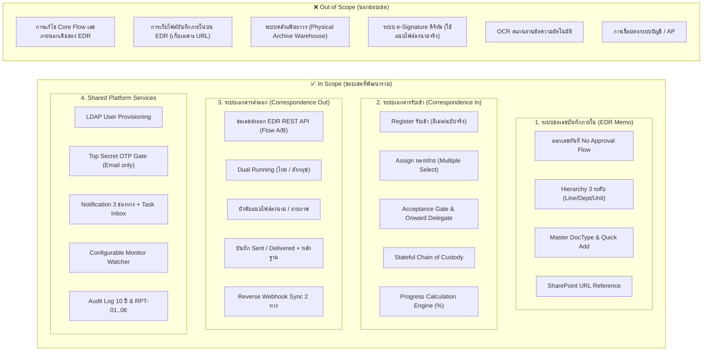

### 2.2 นอกขอบเขตงาน (Out of Scope)

| รายการ | เหตุผลเชิงระบบและแนวทางปฏิบัติ |
|---|---|
| **การแก้ไข Flow เลขเอกสารภายนอกเดิมของ EDR** | ระบบ EDR เดิมมี Flow การขอเลขภายนอก (`พศ...` และ `ทด...`) ที่สมบูรณ์และใช้งานในองค์กรอยู่แล้ว โครงการนี้จะไม่แตะต้อง Core Engine เดิม แต่จะเชื่อมโยงผ่าน Interoperability API เท่านั้น |
| **การจัดเก็บไฟล์เอกสารบันทึกภายในบนฐานข้อมูล EDR** | ระบบ EDR จะทำหน้าที่เป็นระบบบริหารจัดการเลขที่เอกสารและ Metadata เท่านั้น ตัวไฟล์ต้นฉบับจะถูกจัดเก็บอยู่บน SharePoint Online ของผู้ขอ โดย EDR จัดเก็บเฉพาะ SharePoint URL อ้างอิง |
| **ระบบคลังจัดเก็บเอกสารกายภาพถาวร (Physical Archive)** | ระบบสารบรรณทำหน้าที่ติดตาม Chain of Custody ในระหว่างที่เอกสารอยู่ระหว่างการปฏิบัติงาน (In Progress) เท่านั้น ไม่ได้ครอบคลุมถึงระบบบริหารคลังจัดเก็บเอกสารกระดาษถาวรหลังปิดงาน |
| **ระบบลงนามอิเล็กทรอนิกส์ (e-Signature Engine)** | โครงการนี้ยังไม่รวมระบบ e-Sign โดยกระบวนการปัจจุบันกำหนดให้ลงนามบนเอกสารจริงหรือ PDF แล้วนำไฟล์/ภาพถ่ายมาอัปโหลดแนบในระบบ |
| **ระบบ OCR อ่านข้อความจากรูปภาพอัตโนมัติ** | การกรอกข้อมูลเข้าระบบยังคงใช้เจ้าหน้าที่สารบรรณเป็นผู้ตรวจสอบและบันทึกข้อมูลตาม Master Data ที่กำหนด |

---

## 3. บทบาทผู้ใช้และสิทธิ์การใช้งาน (Roles & Permissions)

### 3.1 ตารางบทบาทในระบบรวม (Role Catalog)

| รหัส Role | ชื่อบทบาท | ขอบเขตข้อมูล (Data Scope) | ระบบที่ใช้งานหลัก | หน้าที่และความรับผิดชอบหลัก |
|---|---|---|---|---|
| **ROLE-01** | **ผู้ขอเลข / ผู้ลงทะเบียน (Requester / Registrar)** | เฉพาะคำขอ/งานที่ตนเกี่ยวข้อง (Own-only) | ทั้ง 2 ระบบ | ขอเลขบันทึกภายใน, Register เอกสารรับเข้า, Assign งาน, ดึงงานกลับ/ยกเลิกคำขอตนเอง, ขอเลขส่งออก, แนบไฟล์, Follow up |
| **ROLE-02** | **เจ้าของงานปลายทาง (Assignee / Action Owner)** | เฉพาะงานที่ตนได้รับมอบหมาย (Assigned-only) | Correspondence (In) | รับงาน (Accept), ปฏิเสธ (Reject), ส่งต่อ (Forward), มอบหมายต่อ (Delegate), ปิดงานสำเร็จ (Success), ขอ OTP เปิดดูไฟล์ลับมาก |
| **ROLE-03** | **หัวหน้าฝ่าย / ผู้กำกับดูแล (Department Head / Supervisor)** | ข้อมูลของทุกคนในฝ่ายที่สังกัด (Department Scope) | ทั้ง 2 ระบบ | Monitor งานทั้งฝ่าย, รับงานในนามฝ่าย, มอบหมายงานต่อให้ลูกน้อง, Follow up งานค้างในฝ่าย, ตั้งค่า Monitor ในฝ่ายตน, ปิดเลขบันทึกภายในของคนในฝ่าย |
| **ROLE-04** | **Viewer สูงสุด / ผู้บริหาร (Executive Viewer)** | ข้อมูลทั้งหมดทุกฝ่ายทั้งองค์กร (All-data Read-only) | ทั้ง 2 ระบบ | ดู Dashboard ภาพรวมทุกฝ่าย, ดูรายงาน RPT-01..06 ทั้งหมด, Export ข้อมูล *(หมายเหตุ: เอกสารลับมากยังคงถูกล็อกไฟล์แนบตาม BR-PLAT-002)* |
| **ROLE-05** | **ผู้ดูแลระบบ (System Admin)** | ทั้งระบบ (System-wide Admin) | Shared Platform | User Provisioning จาก LDAP, จัดการ Master Data ทุกโมดูล (Lines, Departments, Units, DocTypes, Running Formats), Review Quick Add, ตั้งค่า Monitor ข้ามฝ่าย, ดู Audit Log |
| **ROLE-06** | **ผู้ส่งเอกสารออก (Outgoing Sender)** | เฉพาะงานส่งออกที่ตนรับผิดชอบ | Correspondence (Out) | ขอเลขส่งออก, แนบไฟล์หลักฐานบังคับ, บันทึกการนำส่ง (Sent), บันทึกการรับปลายทาง (Delivered) พร้อมหลักฐาน |
| **ROLE-07** | **Monitor (ผู้เฝ้าติดตามตาม Scope — Configurable Watcher)** | ข้อมูลตาม Scope ที่กำหนด (ฝ่าย/สายงาน/กลุ่มงาน/บุคคล/ทุกฝ่าย) | Correspondence / Shared | **ดูและติดตามเท่านั้น (Read + Follow up):** ดู Dashboard งานค้าง/Overdue ใน Scope, รับแจ้งเตือนติดตาม, กด Follow up — **ไม่มีสิทธิ์ Accept/Reject/Forward/ปิดงาน/แก้ไขข้อมูล** |

### 3.2 ตารางเปรียบเทียบสิทธิ์การใช้งาน (Unified Permission Matrix)

| ฟังก์ชันการทำงาน | ระบบที่เกี่ยวข้อง | ผู้ขอ/ผู้ Register (ROLE-01) | เจ้าของงาน (ROLE-02) | หัวหน้าฝ่าย (ROLE-03) | Monitor (ROLE-07) | Viewer สูงสุด (ROLE-04) | Admin (ROLE-05) |
|---|---|:---:|:---:|:---:|:---:|:---:|:---:|
| **ขอเลขบันทึกภายใน (Instant Generation)** | EDR Memo | ✅ | ✅ | ✅ | ❌ | ❌ | ✅ |
| **Quick Add ประเภทเอกสารบันทึกภายใน** | EDR Memo | ✅ (ตามสิทธิ์) | ✅ (ตามสิทธิ์) | ✅ | ❌ | ❌ | ✅ |
| **ปิดเลขบันทึกภายใน (Close Document)** | EDR Memo | ✅ (คำขอตน) | ❌ | ✅ (ในฝ่าย) | ❌ | ❌ | ✅ |
| **แก้ไข SharePoint URL** | EDR Memo | ✅ (สถานะ Created) | ❌ | ✅ (ในฝ่าย) | ❌ | ❌ | ✅ |
| **จัดการ Master Hierarchy / Formats** | EDR Memo | ❌ | ❌ | ❌ | ❌ | ❌ | ✅ |
| **Register เอกสารรับเข้า (อีเมล/ฉบับจริง)** | Correspondence (In) | ✅ | ✅ | ✅ | ❌ | ❌ | ✅ |
| **Assign งานรายฝ่าย/บุคคล (Multiple Select)** | Correspondence (In) | ✅ (งานตน) | ✅ (ส่งต่อ) | ✅ (ในฝ่าย) | ❌ | ❌ | ✅ |
| **Accept / Reject / Forward** | Correspondence (In) | ❌ | ✅ | ✅ | ❌ | ❌ | ❌ |
| **Onward Delegation (มอบหมายต่อในฝ่าย)** | Correspondence (In) | ❌ | ❌ | ✅ (หลัง Accept) | ❌ | ❌ | ❌ |
| **ดึงงานกลับ (Recall) / ยกเลิก (Cancel)** | Correspondence (In) | ✅ (งานที่ตน Assign) | ❌ | ✅ (ในฝ่าย) | ❌ | ❌ | ✅ |
| **ยืนยันรับเอกสารฉบับจริงคืน (Physical Return)** | Correspondence (In) | ✅ (ต้นทาง) | ❌ | ✅ (ในฝ่าย) | ❌ | ❌ | ✅ |
| **ขอเลขส่งออก / แนบไฟล์บังคับ (Flow A/B)** | Correspondence (Out) | ✅ | ✅ | ✅ | ❌ | ❌ | ✅ |
| **บันทึก Sent / Delivered + หลักฐาน** | Correspondence (Out) | ✅ (ผู้ส่ง) | ❌ | ✅ (ในฝ่าย) | ❌ | ❌ | ✅ |
| **ดู Dashboard ภาพรวมใน Scope** | Shared Platform | ✅ (งานตน) | ✅ (งานตน) | ✅ (ทั้งฝ่าย) | ✅ (ตาม Scope) | ✅ (ทั้งบริษัท) | ✅ (ทั้งระบบ) |
| **กดปุ่ม Follow up ติดตามงานค้าง** | Shared Platform | ✅ (งานตน) | ❌ | ✅ (ในฝ่าย) | ✅ (ใน Scope) | ❌ | ✅ |
| **ขอ OTP ปลดล็อกไฟล์ลับมาก (Email only)** | Shared Platform | ✅ (ถ้าเป็น Assignee) | ✅ (ถ้าเป็น Assignee) | ❌ (เว้นแต่ถูก Assign) | ❌ | ❌ | ❌ |
| **User Provisioning จาก LDAP / Master Data** | Shared Platform | ❌ | ❌ | ❌ | ❌ | ❌ | ✅ |

### 3.3 Data Scope Logic (การกรองข้อมูลฝั่ง Backend)

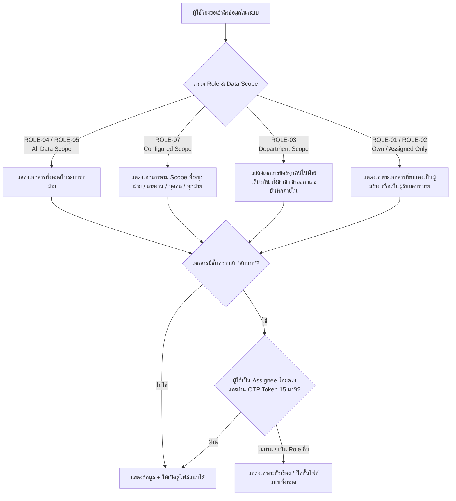

---

## 4. Use Case ภาพรวม (System Use Cases)

```mermaid
flowchart TB
    U_REQ([ผู้ขอเลข / ผู้ลงทะเบียน<br/>ROLE-01 / ROLE-06])
    U_ASS([เจ้าของงานปลายทาง<br/>ROLE-02])
    U_HEAD([หัวหน้าฝ่าย<br/>ROLE-03])
    U_MON([Monitor Watcher<br/>ROLE-07])
    U_ADM([ผู้ดูแลระบบ<br/>ROLE-05])

    subgraph SYSTEM["ระบบรวม DVS Correspondence & EDR System (P2026-DVS-CORR)"]
        subgraph UC_M1["[ระบบที่ 1] ขอเลขบันทึกภายใน (EDR Internal Memo)"]
            UC1_1[ขอเลขบันทึกภายในทันที No Approval]
            UC1_2[เลือกประเภทเอกสาร / Quick Add]
            UC1_3[ระบุ & ทดสอบ SharePoint URL]
            UC1_4[ปิดเลขเอกสารพร้อมระบุเหตุผล]
        end

        subgraph UC_M2["[ระบบที่ 2] เอกสารรับเข้า (Correspondence Incoming)"]
            UC2_1[Register เอกสารรับเข้า อีเมล/ฉบับจริง]
            UC2_2[Assign หลายฝ่าย/บุคคล Multiple Select]
            UC2_3[Accept รับงาน / ยืนยันถือครองตัวจริง]
            UC2_4[Reject / Forward / Onward Delegate]
            UC2_5[ยืนยันรับเอกสารฉบับจริงคืน Awaiting Return]
            UC2_6[ปิดงานสำเร็จ Completed]
        end

        subgraph UC_M3["[ระบบที่ 2] เอกสารส่งออก (Correspondence Outgoing)"]
            UC3_1[ขอเลขส่งออกผ่าน EDR REST API Flow A/B]
            UC3_2[สร้าง Dual Running Number ไทย/อังกฤษ]
            UC3_3[บังคับแนบไฟล์ลงนาม / ถ่ายภาพกล้อง]
            UC3_4[บันทึกการนำส่ง Sent & Delivered]
        end

        subgraph UC_SHARED["Shared Platform Services"]
            UC4_1[ดู Dashboard & Task Inbox]
            UC4_2[กด Follow up ติดตามงานค้าง]
            UC4_3[ขอ OTP ปลดล็อกไฟล์แนบลับมาก]
            UC4_4[จัดการ Master Hierarchy & Formats]
            UC4_5[User Provisioning จาก LDAP]
            UC4_6[ตั้งค่า Monitor Config]
            UC4_7[ออกรายงาน RPT-01..06 & Export]
        end
    end

    U_REQ --> UC1_1 & UC1_2 & UC1_3 & UC1_4 & UC2_1 & UC2_2 & UC3_1 & UC3_2 & UC3_3 & UC3_4 & UC4_1 & UC4_2
    U_ASS --> UC2_3 & UC2_4 & UC2_6 & UC4_1 & UC4_3
    U_HEAD --> UC1_4 & UC2_2 & UC2_3 & UC2_4 & UC2_6 & UC4_1 & UC4_2 & UC4_6 & UC4_7
    U_MON --> UC4_1 & UC4_2
    U_ADM --> UC1_4 & UC4_4 & UC4_5 & UC4_6 & UC4_7
```

---

## 5. กระบวนการหลัก End-to-End และความต่างของเรียกลำดับการดำเนินงาน (End-to-End Sequence & Operational Differences)

หัวข้อนี้จัดทำขึ้นเพื่อ **อธิบายและแยกแยะความต่างของเรียกลำดับขั้นตอนการดำเนินงาน (Order of Operations)** ระหว่าง **ระบบที่ 1 (EDR Internal Memo)** และ **ระบบที่ 2 (Correspondence System ทั้งขารับเข้าและขาส่งออก)** อย่างชัดเจน เพื่อให้ทีมพัฒนา (DEV), ผู้ทดสอบระบบ (QA/Tester), และผู้ใช้งานทางธุรกิจ (Business Users) เข้าใจลำดับก่อน-หลังอย่างไม่สับสน

### 5.1 ตารางวิเคราะห์เปรียบเทียบความแตกต่างของลำดับการดำเนินงานระหว่าง 2 ระบบ

| มิติการเปรียบเทียบ | ระบบที่ 1: ขอเลขบันทึกภายใน (EDR Internal Memo) | ระบบที่ 2: บริหารเอกสารรับเข้า (Correspondence In) | ระบบที่ 2: ออกเลขเอกสารส่งออก (Correspondence Out) |
|---|---|---|---|
| **วัตถุประสงค์หลัก** | ออกเลขบันทึกข้อความสำหรับนำไปใส่ในหัวหนังสือเวียนภายในบริษัท | ติดตามวงจรชีวิตหนังสือรับเข้าจากภายนอก, การรับงานจริง, และผู้ถือครองเอกสารตัวจริง | ขอเลขหนังสือส่งออกภายนอกบริษัท และติดตามหลักฐานการส่งมอบจนถึงผู้รับปลายทาง |
| **จุดเริ่มต้น (Trigger Event)** | ผู้ขอมีความประสงค์จะร่างบันทึกข้อความ จึงเข้ามากด "ขอสร้างเลข" เพื่อจองเลขไปพิมพ์หนังสือ | งานสารบรรณได้รับหนังสือจากภายนอก (ไปรษณีย์/อีเมล/ส่งถึงมือ) นำมา Register เข้าระบบ | เจ้าหน้าที่ฝ่ายต้องการส่งหนังสือออกภายนอก เข้ามาสร้างคำขอออกเลขส่งออก |
| **ลำดับขั้นตอนการดำเนินงาน (Order of Operations)** | **1.** เลือกสังกัด (สายงาน $\rightarrow$ ฝ่าย $\rightarrow$ ทีม)<br/>**2.** ระบบ Preview เลขที่จะได้รับตาม Format<br/>**3.** เลือกประเภทเอกสาร (หรือ Quick Add)<br/>**4.** กรอกชื่อเรื่อง และระบุ SharePoint URL<br/>**5.** กดยืนยันข้อมูลในหน้าต่าง Confirmation<br/>**6.** **ระบบออกเลขทันที (Instant Generation)** และเปลี่ยนสถานะเป็น `Created`<br/>**7.** ผู้ขอนำเลขไปพิมพ์หนังสือและใช้งาน<br/>**8.** เมื่อใช้เสร็จ กด "ปิดเลขเอกสาร (Close Document)" พร้อมระบุเหตุผล สถานะเป็น `Closed` | **1.** Register รับเข้า + แนบไฟล์/ถ่ายภาพ WebRTC Camera + กำหนด Deadline<br/>**2.** Assign งานไปยังฝ่าย/บุคคล (Multiple Select ได้หลายฝ่าย)<br/>**3.** ระบบส่ง Notification 3 ช่องทาง<br/>**4.** ผู้รับงานปลายทางกด **"Accept (รับงาน)"** เพื่อยืนยันการรับงานจริง และยืนยันการถือครองเอกสารตัวจริง (Chain of Custody)<br/>**5.** ผู้รับงานปฏิบัติงาน หรือ **"Onward Delegate"** มอบหมายต่อให้ลูกทีมในฝ่าย<br/>**6.** เมื่อปฏิบัติงานเสร็จ ผู้รับงานกด **"ปิดงาน (Complete)"**<br/>**7.** Progress Engine คำนวณความคืบหน้ารวมจนครบ 100% เอกสารเปลี่ยนสถานะเป็น `Completed` | **1.** สร้างคำขอออกเลขส่งออก (Register Outgoing)<br/>**2.** เลือกลักษณะการออกเลขผ่าน EDR API (Flow A ทันที หรือ Flow B รออนุมัติผู้บริหาร)<br/>**3.** ระบบสร้างเลขคู่ขนาน Dual Running Numbers (เลขไทย เช่น `ทว.xxx/2569` และเลขอังกฤษ เช่น `DVS.xxx/2026`)<br/>**4.** บังคับแนบไฟล์เอกสารที่ลงนามแล้ว<br/>**5.** บันทึกการส่งหนังสือ (Sent) + เลขพัสดุ ปณ.<br/>**6.** บันทึกหลักฐานใบตอบรับปลายทาง (Delivered)<br/>**7.** ปิดงานสมบูรณ์ (`Completed`) |
| **สายการอนุมัติ (Approval Flow)** | **ไม่มีการอนุมัติ (No Approval Flow เด็ดขาด)** ออกเลขทันทีเมื่อผู้ขอยืนยัน ไม่ต้องรอผู้บังคับบัญชา | **ไม่มีการอนุมัติเลข** แต่มี **Acceptance Gate** (ต้องกดยอมรับงานก่อนจึงจะดำเนินการต่อได้) | **มีสายการอนุมัติเฉพาะ Flow B** (ต้องรอผู้บริหารอนุมัติผ่านระบบ EDR เดิมก่อนจึงจะได้เลข) |
| **การถือครองเอกสารตัวจริง (Physical Custody)** | **ไม่มี** (ระบบเป็นเพียง Registry ออกเลขและเก็บ Link ไม่ได้ติดตามการเดินแฟ้มกระดาษ) | **มีระบบ Stateful Chain of Custody อย่างเข้มงวด** บันทึกประวัติการเปลี่ยนมือผู้ถือเอกสารกระดาษตัวจริงทุกขั้นตอน | **มีเฉพาะขั้นตอนการส่งมอบ** บันทึกการส่งให้ไปรษณีย์/ผู้รับปลายทาง |
| **การกระจายงาน (Work Distribution)** | **ไม่มี** (1 คำขอเป็นของผู้ขอคนเดียว ไม่มีการแตก Sub-task) | **มีการแตก Sub-assignments** กระจายได้หลายฝ่ายพร้อมกัน และรองรับลำดับชั้นการมอบหมายต่อ (Onward Delegation Tree) | **ไม่มีการแตกงานย่อย** (ดำเนินงานโดยผู้ส่งเอกสารเป็นหลัก) |
| **การคำนวณ Progress (%)** | **ไม่มี** (ติดตามสถานะแบบ Flat: Draft $\rightarrow$ Created $\rightarrow$ In Use $\rightarrow$ Closed) | **มี Progress Calculation Engine** คำนวณความคืบหน้าถ่วงน้ำหนักเท่ากัน (Equal Weight) ตามจำนวนฝ่ายปลายทาง | **ไม่มีการคำนวณ %** (เปลี่ยนสถานะตามขั้นตอน Draft $\rightarrow$ Registered $\rightarrow$ Sent $\rightarrow$ Delivered) |
| **มาตรการความลับ (Top Secret Security)** | ควบคุมตามสิทธิ์การเข้าถึงทั่วไปตามฝ่าย/สายงาน | **มีระบบ OTP Gate สำหรับเอกสาร "ลับมาก"** ล็อกไฟล์แนบทั้งหมด และต้องยืนยันตัวตนด้วย OTP 6 หลักทางอีเมลเท่านั้น | ล็อกไฟล์แนบตามระดับชั้นความลับ |
| **การเชื่อมต่อกับระบบอื่น (Integration)** | เชื่อมโยงกับ SharePoint Online (เก็บ URL) | ทำงานบน Correspondence Engine | เชื่อมต่อ 2 ทางกับ EDR REST API (Pre-flight check, Issuance, Reverse Webhook Sync) |

---

### 5.2 ลำดับการดำเนินงานระบบที่ 1: การขอสร้างเลขเอกสารบันทึกภายใน (EDR Internal Memo)

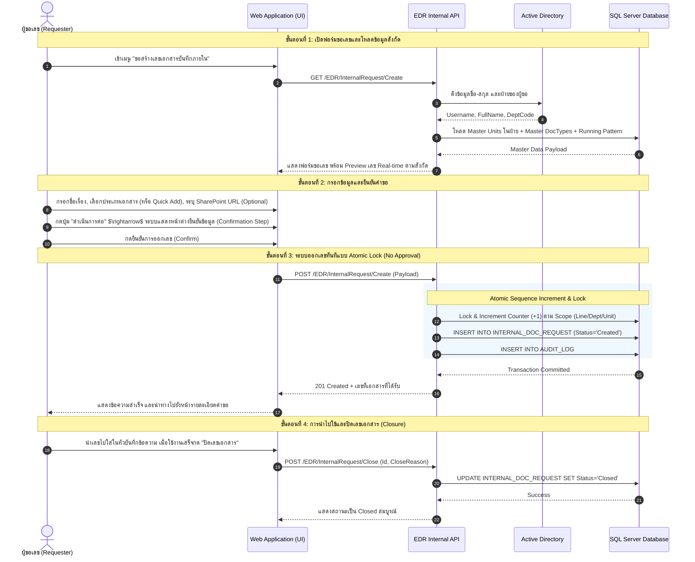

**สาระสำคัญของลำดับขั้นตอนในระบบที่ 1:**
1. **Instant Issuance (ไม่มีการรออนุมัติ):** เมื่อผู้ใช้กดยืนยัน เลขจะถูกสร้างขึ้นทันทีภายใน Transaction เดียว และสถานะจะเปลี่ยนเป็น `Created` ผู้ใช้สามารถนำเลขไปพิมพ์หัวบันทึกข้อความได้ทันที
2. **Real-time Running Preview:** ขณะเลือกสายงาน ฝ่าย หรือหน่วยงานย่อย ระบบจะแสดงตัวอย่างเลขที่จะได้รับทันทีตามรูปแบบ Pattern เช่น `ฝสบ.26-000001`
3. **Quick Add Capability:** หากไม่พบประเภทเอกสารที่ต้องการ ผู้ขอสามารถกดปุ่ม "เพิ่มประเภทเอกสารด่วน" เพื่อสร้างประเภทเอกสารใหม่และเลือกใช้ได้ทันทีโดยไม่ต้องสลับหน้าจอ
4. **SharePoint Reference Only:** ระบบเก็บเพียงลิงก์ HTTPS ของ SharePoint Online ที่ชี้ไปยังไฟล์บันทึกข้อความ ไม่มีการอัปโหลดไฟล์ตัวบันทึกขึ้นฐานข้อมูล EDR

---

### 5.3 ลำดับการดำเนินงานระบบที่ 2 (ขารับเข้า): การจัดการเอกสารรับเข้าและการถือครองตัวจริง (Correspondence Incoming)

```mermaid
flowchart TD
    Start(["1. สารบรรณได้รับเอกสารจากภายนอก<br/>(ไปรษณีย์ / อีเมล / ส่งถึงมือ)"]) --> Reg["2. ลงทะเบียนรับเข้า (Register Incoming)<br/>- กำหนดความเร่งด่วน & Deadline<br/>- แนบไฟล์สแกน / ถ่ายภาพ WebRTC กล้อง<br/>- กำหนดชั้นความลับ (ปกติ / ลับ / ลับมาก)"]
    Reg --> Assign["3. มอบหมายงาน (Assign)<br/>- เลือกฝ่ายปลายทาง (Multiple Select ได้หลายฝ่าย)<br/>- ระบุผู้รับผิดชอบเจาะจง (Optional)"]
    Assign --> Noti["4. ส่งแจ้งเตือน 3 ช่องทาง<br/>(Email + In-app + Personal Task Inbox)"]
    Noti --> Wait["สถานะงานย่อย: Pending Acceptance"]

    Wait --> Recall{"ต้นทางดึงงานกลับ?<br/>(Recall Action)"}
    Recall -->|ใช่| Recalled["Recalled (ยกเลิกงานย่อย)<br/>นำออกจาก Task Inbox"]
    Recalled --> Reassign["ต้นทางมอบหมายฝ่ายใหม่"] --> Assign

    Recall -->|ไม่| ActionDecision{"ผู้รับงานปลายทาง<br/>พิจารณาคำขอ"}
    
    ActionDecision -->|"ปฏิเสธ (Reject + ระบุเหตุผล)"| Rejected["บันทึกสถานะ Rejected<br/>แจ้งเตือนกลับต้นทาง"]
    Rejected --> PhysCheck{"เป็นเอกสารฉบับจริง (Physical)?"}
    PhysCheck -->|ใช่| AwaitReturn["สถานะ: Awaiting Physical Return<br/>(รอส่งกระดาษตัวจริงคืนต้นทาง)"]
    AwaitReturn --> ConfirmReturn{"ต้นทางกดยืนยันรับคืน?"}
    ConfirmReturn -->|ยืนยันแล้ว| BackToReg["กลับสู่สถานะ Registered<br/>ปลดล็อกให้ Assign ฝ่ายใหม่ได้"]
    BackToReg --> Assign
    PhysCheck -->|ไม่ใช่ (อีเมล)| BackToReg

    ActionDecision -->|"ยอมรับงาน (Accept Action)"| Accepted["สถานะงานย่อย: In Progress<br/>(Acceptance Gate ผ่าน)"]
    Accepted --> CustodyUpdate["บันทึก Stateful Chain of Custody:<br/>ผู้รับงานเป็นผู้ถือครองตัวจริงปัจจุบัน"]
    
    CustodyUpdate --> WorkChoice{"แนวทางการปฏิบัติงาน"}
    WorkChoice -->|"มอบหมายต่อในฝ่าย (Onward Delegate)"| Delegate["หัวหน้าฝ่าย Assign ลูกทีม<br/>สร้าง Nested Sub-assignment Tree"]
    Delegate --> SubTask["ลูกทีมได้รับแจ้งเตือน และกด Accept"] --> SubComplete["ลูกทีมปฏิบัติงานเสร็จ กด Complete"]
    SubComplete --> TaskDone
    
    WorkChoice -->|"ดำเนินการเองจนเสร็จ"| TaskDone["ผู้รับงานกด 'ปิดงาน (Complete)'"]
    
    TaskDone --> ProgCalc["Progress Calculation Engine<br/>คำนวณ Progress % รวมทุกฝ่าย"]
    ProgCalc --> AllDone{"ทุกฝ่ายดำเนินการเสร็จสิ้นครบ 100%?"}
    AllDone -->|ยังไม่ครบ| KeepProg["เอกสารหลักคงสถานะ In Progress"]
    AllDone -->|ครบ 100%| DocCompleted(["สถานะเอกสารหลัก: Completed (ปิดงานสมบูรณ์)"])
```

**สาระสำคัญของลำดับขั้นตอนในระบบที่ 2 (ขารับเข้า):**
1. **Acceptance Gate (ประตูคัดกรองการรับงาน):** ผู้รับงานปลายทางต้องกด Accept ก่อนเสมอ จึงจะสามารถส่งต่อ มอบหมายต่อ หรือปิดงานได้
2. **Stateful Chain of Custody (การถือครองเอกสารตัวจริง):** หากเป็นเอกสารฉบับจริง (Physical) เมื่อผู้รับงานกด Accept ระบบจะเปลี่ยนชื่อผู้ถือครองเอกสารตัวจริงปัจจุบัน (`current_holder_ref`) เป็นผู้รับงานทันที และบันทึกประวัติลง `CUSTODY_LOG`
3. **Awaiting Physical Return Controller:** หากผู้รับงานปฏิเสธงาน (Reject) สำหรับเอกสารฉบับจริง เอกสารจะยังไม่ถูกส่งต่อให้คนอื่น จนกว่าต้นทางจะกดยืนยันว่า "ได้รับแฟ้มกระดาษตัวจริงคืนแล้ว" เพื่อป้องกันปัญหาเอกสารสูญหายระหว่างทาง
4. **Onward Delegation & SubTree:** เมื่อหัวหน้าฝ่าย Accept งานแล้ว สามารถมอบหมายต่อให้ลูกทีมได้ โดยระบบสร้างโหนดลูกในลักษณะ Nested Delegation SubTree
5. **Progress % Calculation:** ความคืบหน้าจะคำนวณแบบเฉลี่ยน้ำหนักเท่ากันตามจำนวนฝ่ายปลายทาง เช่น มี 3 ฝ่าย หากเสร็จ 1 ฝ่าย Progress จะเป็น 33.33% และจะเปลี่ยนสถานะเอกสารหลักเป็น `Completed` เมื่อครบ 100% เท่านั้น

---

### 5.4 ลำดับการดำเนินงานระบบที่ 2 (ขาส่งออก): การจัดการออกเลขและติดตามเอกสารส่งออก (Correspondence Outgoing)

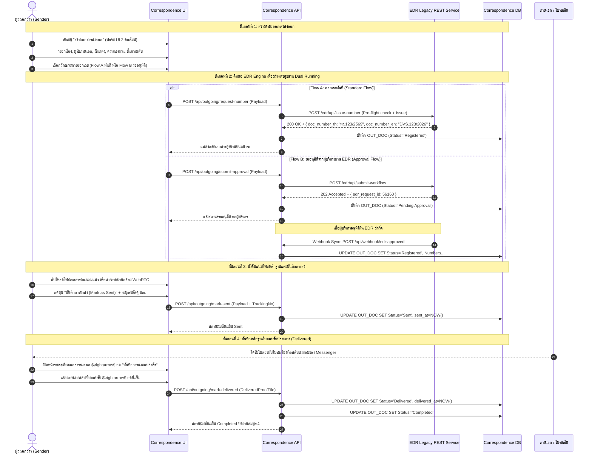

**สาระสำคัญของลำดับขั้นตอนในระบบที่ 2 (ขาส่งออก):**
1. **Dual Running Numbers (เลขคู่ขนาน 2 ภาษา):** ทุกเอกสารส่งออกจะได้เลข 2 ชุดพร้อมกันเสมอ คือ ภาษาไทย (เช่น `ทว.123/2569`) สำหรับหน่วยงานราชการ/ในประเทศ และภาษาอังกฤษ (เช่น `DVS.123/2026`) สำหรับคู่ค้าต่างประเทศ
2. **Two-Way EDR Interoperability (Flow A & Flow B):** รองรับทั้งการออกเลขทันที (Flow A) และการส่งเรื่องเข้าสายการอนุมัติของผู้บริหารในระบบ EDR เดิม (Flow B) โดยเมื่ออนุมัติเสร็จ ระบบเดิมจะยิง Reverse Webhook มาสร้าง/อัปเดตงานในระบบสารบรรณอัตโนมัติ
3. **Mandatory Signed File Attachment:** ผู้ส่งต้องแนบไฟล์เอกสารฉบับที่ลงนามจริงแล้วเสมอ ก่อนที่ระบบจะยอมให้กดบันทึกการนำส่ง (`Sent`)
4. **Proof of Delivery Closure:** การปิดงานส่งออกจะสมบูรณ์ (`Completed`) ได้ ก็ต่อเมื่อมีการบันทึกสถานะ `Delivered` พร้อมแนบหลักฐานสลิปไปรษณีย์หรือใบเซ็นรับของปลายทางแล้วเท่านั้น

---

### 5.5 หลักการและกฎเหล็กที่ห้ามละเมิดของระบบรวม (Unified System Invariants)

- **Invariant 1 — แยกขาดและไม่กระทบ Flow เลขภายนอกเดิม:** ห้ามแก้ไขหรือทำให้กระทบต่อ Flow การออกเลขเอกสารภายนอก (พศ/ทด) ของระบบเดิมทุกกรณี
- **Invariant 2 — เลขบันทึกภายในไม่ต้องผ่านการอนุมัติ (No Approval Flow):** เลขบันทึกภายในเมื่อผู้ขอยืนยัน ระบบจะสร้างเลขและบันทึกสถานะ `Created` ทันที และต้องไม่ปรากฏในคิวการอนุมัติเอกสาร
- **Invariant 3 — เลขที่ออกแล้วห้ามเปลี่ยนแปลง (Immutability):** เลขที่ออกไปแล้วทุกประเภท (บันทึกภายใน, เอกสารส่งออก) จะคงเดิมตลอดไป แม้จะมีการเปลี่ยนแปลง Master Config ในภายหลัง
- **Invariant 4 — ข้อมูลผู้ใช้และฝ่ายผูกกับ AD/LDAP:** ข้อมูลพนักงานและฝ่ายผูกกับ Active Directory แต่ผู้ที่จะเข้าใช้งานได้ต้องผ่านการ **Admin Provisioning** ก่อนเท่านั้น
- **Invariant 5 — Accept ก่อนดำเนินการเสมอ (Acceptance Gate):** ผู้รับมอบหมายต้องกด Accept ก่อนจึงจะ Forward หรือปิดงานได้ สำหรับเอกสารฉบับจริง การกด Accept คือการยืนยันถือครองเอกสารตัวจริง (Chain of Custody)
- **Invariant 6 — ความเท่าเทียมของข้อมูล 2 ทาง (Data Parity 100%):** การออกเลขส่งออกผ่านสารบรรณหรือระบบ EDR เดิม จะต้องมีฟิลด์ข้อมูลตรงกัน 100% และซิงค์กันแบบ Real-time
- **Invariant 7 — ระบบปิดกั้นไฟล์ลับมาก (Top Secret Isolation):** เอกสารลับมากซ่อนไฟล์แนบทั้งหมดจากทุกคนที่ไม่ใช่ Assignee โดยตรง และผู้มีสิทธิ์ต้องผ่าน OTP ทางอีเมลเท่านั้น
- **Invariant 8 — Master-Driven Data Entry:** ทุกฟิลด์ที่มี Master รองรับ ต้องเลือกจากรายการ (Dropdown/Lookup เก็บ ID) ไม่อนุญาตให้กรอก Free-text เว้นแต่ฟิลด์บรรยาย
- **Invariant 9 — กฎการนับหลายฝ่ายในรายงาน (Multi-Department Counting Rule):** รายงานที่จัดกลุ่มตามฝ่าย (RPT-01, 02, 04, 06) จะนับเอกสารซ้ำตามทุกฝ่ายที่เกี่ยวข้อง (Involved Departments)

---

## 6. สถานะเอกสาร (State Machines)

### 6.1 สถานะคำขอเลขบันทึกภายใน (EDR Internal Memo State Machine)

| สถานะ | รหัสสถานะ | ความหมายเชิงระบบ | การดำเนินการที่อนุญาต |
|---|---|---|---|
| **ร่าง** | `Draft` | คำขอยังกรอกไม่สมบูรณ์ หรือบันทึกค้างไว้ | แก้ไขข้อมูล, ลบคำขอ, กดยืนยันเพื่อออกเลข |
| **ออกเลขแล้ว** | `Created` | ออกเลขสำเร็จทันทีผ่าน Atomic Lock (No Approval) | นำเลขไปใช้งาน, แก้ไข SharePoint URL, พิมพ์สลิปยืนยัน, ปิดเลขเอกสาร |
| **ใช้งานอยู่** | `In Use` | มีการอัปเดต SharePoint URL หรือเปิดใช้งานเอกสารจริง | แก้ไข SharePoint URL, ปิดเลขเอกสาร |
| **ปิดเลขเอกสาร** | `Closed` | ใช้งานเสร็จสิ้น หรือปิดเรื่องตามความประสงค์พร้อมระบุเหตุผล | ดูข้อมูลอย่างเดียว (Read-only), แก้ไขไม่ได้อีก |
| **ยกเลิกคำขอ** | `Cancelled` | คำขอถูกยกเลิกเนื่องจากไม่ได้ใช้งานจริง | ดูประวัติอย่างเดียว (Read-only) |

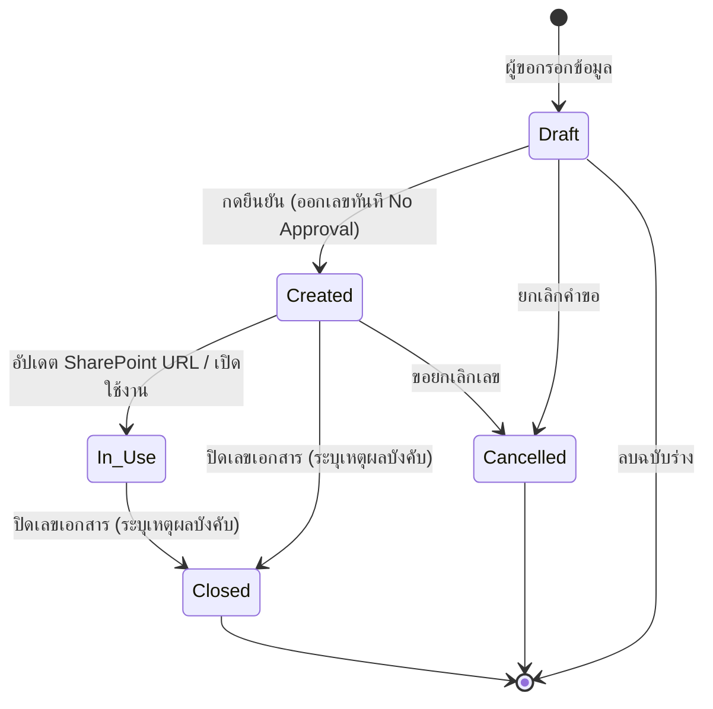

---

### 6.2 สถานะเอกสารรับเข้าและงานย่อย (Incoming Document & Sub-assignment State Machines)

#### A. สถานะเอกสารหลัก (Main Document Lifecycle)

| สถานะหลัก | รหัสสถานะ | ความหมายเชิงระบบ |
|---|---|---|
| **ลงทะเบียนแล้ว** | `Registered` | บันทึกรับเข้าแล้ว รอการมอบหมาย หรือดึงงานกลับมามอบหมายใหม่ |
| **อยู่ระหว่างดำเนินการ** | `In Progress` | มีงานย่อยอย่างน้อย 1 ฝ่ายที่กด Accept และกำลังดำเนินการ |
| **รอส่งคืนตัวจริง** | `Awaiting Return` | เอกสารฉบับจริงถูกปฏิเสธครบทุกฝ่าย รอต้นทางยืนยันรับคืน |
| **ดำเนินการเสร็จสิ้น** | `Completed` | ทุกฝ่ายดำเนินการครบถ้วน 100% ปิดงานสมบูรณ์ |
| **ยกเลิก** | `Cancelled` | ต้นทางยกเลิกเอกสารรับเข้า |

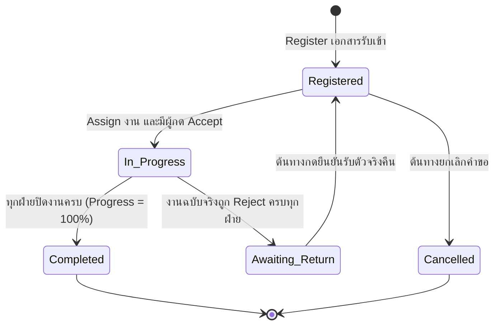

#### B. สถานะงานย่อยรายฝ่าย/บุคคล (Sub-assignment Lifecycle)

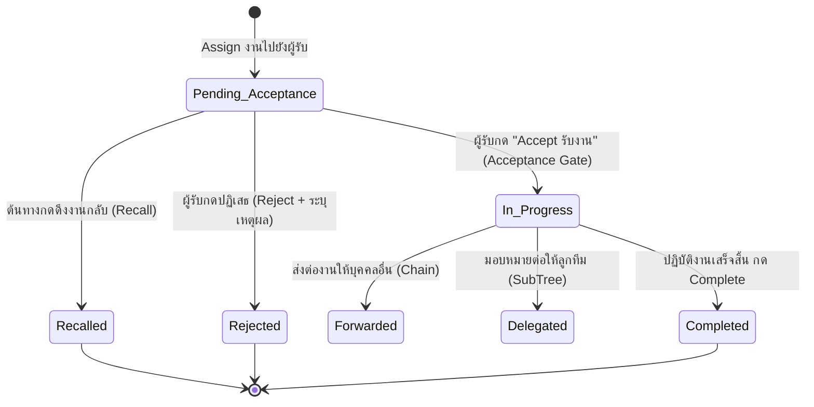

---

### 6.3 สถานะเอกสารส่งออก (Outgoing Document State Machine)

| สถานะ | รหัสสถานะ | ความหมายเชิงระบบ | การดำเนินการที่อนุญาต |
|---|---|---|---|
| **ร่าง** | `Draft` | สร้างคำขอส่งออกค้างไว้ | แก้ไขข้อมูล, ลบฉบับร่าง |
| **รออนุมัติ (Flow B)** | `Pending Approval` | ส่งเข้าสายการอนุมัติ EDR เดิมของผู้บริหาร | ยกเลิกคำขอ, รอ Webhook Sync |
| **ลงทะเบียนแล้ว** | `Registered` | ได้รับเลขคู่ขนาน (ไทย/อังกฤษ) แล้ว | แนบไฟล์ลงนามจริง, ถ่ายภาพ WebRTC |
| **ส่งออกแล้ว** | `Sent` | นำส่งหนังสือแล้ว (ระบุเลขพัสดุ ปณ.) | บันทึก Delivered เมื่อปลายทางได้รับ |
| **ส่งมอบสำเร็จ** | `Delivered` | ปลายทางได้รับเอกสารแล้ว (แนบหลักฐาน) | ระบบเปลี่ยนเป็น Completed อัตโนมัติ |
| **เสร็จสมบูรณ์** | `Completed` | ปิดงานส่งออกสมบูรณ์ 100% | ดูประวัติและ Audit Trail (Read-only) |
| **ยกเลิก** | `Cancelled` | คำขอส่งออกถูกยกเลิก | ดูประวัติอย่างเดียว |

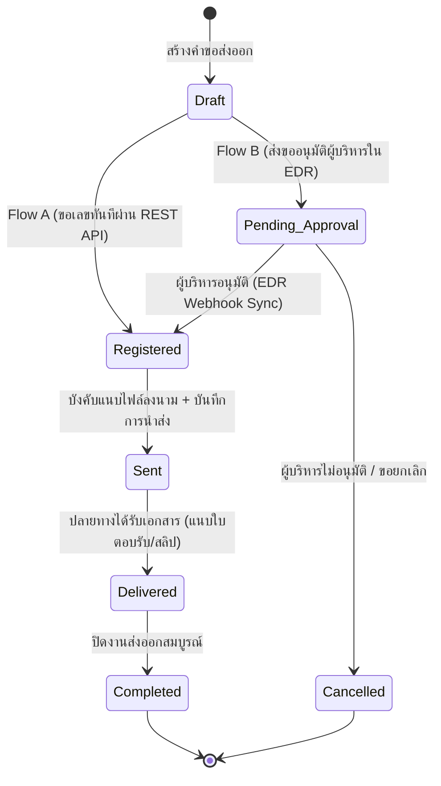

---

## 7. การคำนวณ Progress และการถือครองเอกสารตัวจริง (Progress & Custody Engine)

### 7.1 สูตรการคำนวณความคืบหน้า (Progress Calculation Logic)

ความคืบหน้าของเอกสารรับเข้าคำนวณตามหลักการ **ถ่วงน้ำหนักเท่ากัน (Equal Weight)** ตามสูตร:

$$\text{Progress \%} = \left( \frac{\sum_{i=1}^{N} \text{Weight}(\text{SubAssignment}_i)}{N} \right) \times 100$$

โดยมีกฎเกณฑ์สำคัญทางธุรกิจ:
1. **น้ำหนักสถานะงานย่อย:**
   - สถานะ `Pending Acceptance`, `Rejected`, `Recalled`: มีน้ำหนัก = `0.0`
   - สถานะ `In Progress`, `Delegated`: มีน้ำหนัก = `0.5`
   - สถานะ `Completed`: มีน้ำหนัก = `1.0`
2. **การตัดงานที่ถูกยกเลิก (Cancelled Exclusion):** งานย่อยที่ถูกดึงงานกลับ (`Recalled`) จะถูกหักออกจากตัวหาร $N$ ทันที เพื่อไม่ให้กระทบต่อเปอร์เซ็นต์รวม
3. **การส่งต่อ (Forward Handling):** การ Forward ส่งต่องาน จะเปลี่ยนสถานะงานเดิมเป็น `Forwarded` และส่งมอบความรับผิดชอบไปยังผู้รับคนใหม่ โดย**ไม่เพิ่มตัวหาร $N$**
4. **การเปลี่ยนสถานะเอกสารหลักเป็น Completed:** เมื่อผลรวมความคืบหน้าเท่ากับ **100%** ระบบจะเปลี่ยนสถานะเอกสารหลักเป็น `Completed` อัตโนมัติ

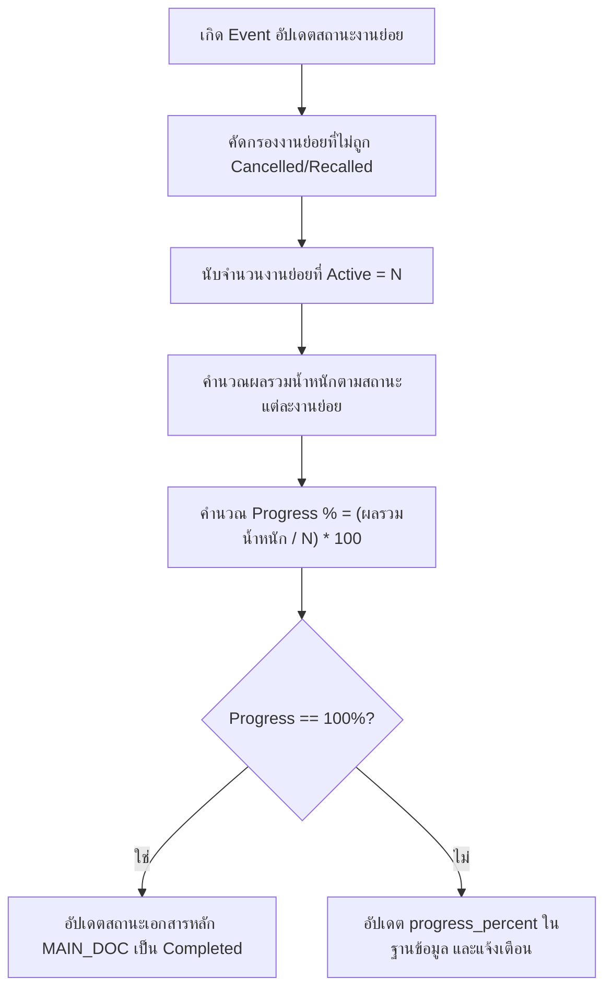

---

### 7.2 กฎการถือครองเอกสารตัวจริง (Stateful Chain of Custody)

สำหรับเอกสารรับเข้าประเภท **ฉบับจริง (Physical Document)** ระบบจะควบคุมการถือครองอย่างเข้มงวด:
1. **Initial Holder:** เมื่อสารบรรณ Register เอกสาร ผู้ลงทะเบียนจะเป็นผู้ถือครองเอกสารตัวจริงคนแรก (`current_holder_ref = Registrar`)
2. **Custody Transfer upon Acceptance:** การเปลี่ยนมือผู้ถือครองจะเกิดขึ้น **เมื่อผู้รับงานปลายทางกด Accept เท่านั้น** (การมอบหมายเฉยๆ ยังไม่ถือว่าเปลี่ยนมือจนกว่าจะมีการกดรับจริง)
3. **Custody Audit Trail:** ทุกครั้งที่มีการเปลี่ยนมือ ระบบจะบันทึกข้อมูลลงตาราง `CUSTODY_LOG` ประกอบด้วย: วันเวลา, ผู้ส่งมอบ, ผู้รับมอบ, รหัสงานย่อย, และหมายเหตุ
4. **Physical Return Protection:** หากผู้รับงานปฏิเสธงาน (Reject) สำหรับเอกสารฉบับจริง เอกสารจะเข้าสู่สถานะ `Awaiting Physical Return` ผู้ถือครองปัจจุบันจะยังคงเป็นผู้ที่ Reject จนกว่าสารบรรณต้นทางจะได้รับแฟ้มกระดาษคืนและกดยืนยันรับคืนในระบบ

---

## 8. รายละเอียดฟังก์ชันรายหน้าจอ (Screen Specifications & UI Design System)

ระบบได้รับการออกแบบโดยยึดอัตลักษณ์องค์กร **Deves Corporate Identity (CI)**:
- **โทนสีหลัก:** Deves Navy Blue (`#012169`)
- **โทนสีรอง/เน้น:** Deves Gold (`#FFCD00`)
- **Typography:** ฟอนต์มาตรฐานองค์กร อ่านง่าย รองรับภาษาไทยสมบูรณ์
- **Responsive Layout:** รองรับหน้าจอคอมพิวเตอร์และแท็บเล็ตสำหรับผู้บริหาร

---

### 8.1 ระบบที่ 1: หน้าจอระบบขอเลขบันทึกภายใน EDR Memo (19 หน้าจอ)

#### 1. หน้าจอเข้าสู่ระบบ EDR (EDR Login Screen)
- **ภาพหน้าจอ:**  
  
  *(ตัวอย่างตอนกรอกข้อมูล: [01_login_filled.png](file:///Users/nineteen/Project_dev/DVS_Correspondence_system/docs/images/edr_memo/01_login_filled.png))*
- **ฟังก์ชันการทำงาน:** ฟอร์มเข้าสู่ระบบด้วยบัญชี Windows Active Directory / LDAP พร้อมระบบตรวจสอบสิทธิ์และจดจำเซสชัน

#### 2. หน้าจอ Dashboard ระบบ EDR (EDR Dashboard Screen)
- **ภาพหน้าจอ:**  
  
  *(มุมมองเต็มจอ: [02_dashboard_full.png](file:///Users/nineteen/Project_dev/DVS_Correspondence_system/docs/images/edr_memo/02_dashboard_full.png))*
- **ฟังก์ชันการทำงาน:** สรุปสถิติคำขอเลขบันทึกภายในของฝ่าย, รายการคำขอล่าสุด, สถานะคำขอ (Created / In Use / Closed) พร้อมทางลัดเข้าสู่หน้าสร้างคำขอ

#### 3. หน้ารายการขอสร้างเลขเอกสารบันทึกภายใน (Internal Request List)
- **ภาพหน้าจอ:**  
  
  *(มุมมองตาราง: [03_internal_request_table.png](file:///Users/nineteen/Project_dev/DVS_Correspondence_system/docs/images/edr_memo/03_internal_request_table.png) / [03_internal_request_index.png](file:///Users/nineteen/Project_dev/DVS_Correspondence_system/docs/images/edr_memo/03_internal_request_index.png))*
- **ฟังก์ชันการทำงาน:** ตารางแสดงรายการเลขบันทึกภายในที่ออกแล้ว กรองตามช่วงวันที่ ประเภทเอกสาร สถานะ และค้นหาตามชื่อเรื่องหรือเลขที่เอกสาร

#### 4. หน้าฟอร์มขอสร้างเลขเอกสารบันทึกภายใน (Create Form & Preview)
- **ภาพหน้าจอ:**  
  
  *(ตัวอย่างฟอร์มเริ่มต้น: [04_internal_request_create.png](file:///Users/nineteen/Project_dev/DVS_Correspondence_system/docs/images/edr_memo/04_internal_request_create.png) / [04_create_form_initial.png](file:///Users/nineteen/Project_dev/DVS_Correspondence_system/docs/images/edr_memo/04_create_form_initial.png))*
- **ฟังก์ชันการทำงาน:** ฟอร์มบันทึกข้อมูลขอเลข แสดง Real-time Running Number Preview ตามสายงาน/ฝ่าย/ทีมที่เลือก

#### 5. Searchable Dropdown เลือกประเภทเอกสาร (DocType Dropdown)
- **ภาพหน้าจอ:**  
  
  *(ขณะเปิด Dropdown: [04a_doctype_dropdown_opened.png](file:///Users/nineteen/Project_dev/DVS_Correspondence_system/docs/images/edr_memo/04a_doctype_dropdown_opened.png))*
- **ฟังก์ชันการทำงาน:** Dropdown ค้นหาประเภทเอกสารได้อย่างรวดเร็ว พร้อมปุ่มลัด "เพิ่มประเภทเอกสารด่วน (Quick Add)"

#### 6. ตัวอย่างการกรอกฟอร์มขอเลขบันทึกภายใน (Create Form Filled)
- **ภาพหน้าจอ:**  
  
  *(ภาพตัวอย่างเต็ม: [04c_create_form_filled.png](file:///Users/nineteen/Project_dev/DVS_Correspondence_system/docs/images/edr_memo/04c_create_form_filled.png))*
- **ฟังก์ชันการทำงาน:** แสดงข้อมูลชื่อเรื่อง, ประเภทเอกสาร, ลิงก์ SharePoint URL ที่ผ่านการตรวจสอบ HTTPS และปุ่มดำเนินการต่อ

#### 7. Quick Add Modal เพิ่มประเภทเอกสารด่วน (Quick Add Modal)
- **ภาพหน้าจอ:**  
  
- **ฟังก์ชันการทำงาน:** ป๊อปอัปเพิ่มประเภทเอกสารใหม่อย่างรวดเร็ว มีระบบตรวจจับชื่อซ้ำและ Soft Warning กรณีชื่อใกล้เคียง $\ge 80\%$

#### 8. หน้ายืนยันข้อมูลก่อนออกเลข (Confirmation Step)
- **ภาพหน้าจอ:**  
  
- **ฟังก์ชันการทำงาน:** หน้าต่างทบทวนข้อมูลก่อนยืนยัน เพื่อป้องกันการขอเลขผิดพลาด เมื่อกดยืนยันระบบจะออกเลขทันที (Instant Issuance)

#### 9. หน้ารายละเอียดคำขอเลขที่เอกสารภายใน (Internal Request Detail)
- **ภาพหน้าจอ:**  
  
  *(มุมมองเต็ม: [09_internal_request_detail.png](file:///Users/nineteen/Project_dev/DVS_Correspondence_system/docs/images/edr_memo/09_internal_request_detail.png))*
- **ฟังก์ชันการทำงาน:** แสดงรายละเอียดเลขที่เอกสารที่ได้รับ, วันเวลาที่ออกเลข, ข้อมูลผู้ขอ, ลิงก์ SharePoint พร้อมปุ่มแก้ไข URL และปุ่มปิดเลขเอกสาร

#### 10. Modal ปิดเลขเอกสารบันทึกภายใน (Close Document Modal)
- **ภาพหน้าจอ:**  
  
- **ฟังก์ชันการทำงาน:** ป๊อปอัปยืนยันการปิดเลขเอกสาร บังคับกรอกเหตุผลการปิดเลข เพื่อเปลี่ยนสถานะเป็น `Closed`

#### 11. หน้าจอค้นหาเอกสาร Search Screen (Search Page)
- **ภาพหน้าจอ:**  
  
  *(มุมมองตัวกรอง: [10_search_page.png](file:///Users/nineteen/Project_dev/DVS_Correspondence_system/docs/images/edr_memo/10_search_page.png))*
- **ฟังก์ชันการทำงาน:** ค้นหาเอกสารขั้นสูง กรองตามสายงาน ฝ่าย หน่วยงานย่อย ช่วงวันที่ และคำสำคัญ

#### 12. หน้าจอออกรายงาน Report Screen (Report Page)
- **ภาพหน้าจอ:**  
  
  *(มุมมองตัวเลือกรายงาน: [11_report_page.png](file:///Users/nineteen/Project_dev/DVS_Correspondence_system/docs/images/edr_memo/11_report_page.png))*
- **ฟังก์ชันการทำงาน:** สรุปรายงานการออกเลขบันทึกภายในประจำเดือน/ปี และส่งออกไฟล์ Excel

#### 13. หน้าจอจัดการ Master สายงาน (Settings Lines)
- **ภาพหน้าจอ:**  
  
  *(มุมมองรายการ: [09_settings_lines.png](file:///Users/nineteen/Project_dev/DVS_Correspondence_system/docs/images/edr_memo/09_settings_lines.png) / [07_master_lines_list.png](file:///Users/nineteen/Project_dev/DVS_Correspondence_system/docs/images/edr_memo/07_master_lines_list.png))*
- **ฟังก์ชันการทำงาน:** จัดการข้อมูลสายงาน (Line) เพิ่ม แก้ไข ระงับการใช้งานสายงาน

#### 14. หน้าจอจัดการ Master หน่วยงานภายใน (Settings Units)
- **ภาพหน้าจอ:**  
  
  *(มุมมองผูกฝ่าย: [10_settings_units.png](file:///Users/nineteen/Project_dev/DVS_Correspondence_system/docs/images/edr_memo/10_settings_units.png))*
- **ฟังก์ชันการทำงาน:** จัดการหน่วยงานย่อย/ทีมภายในฝ่าย กำหนดตัวย่อทีมสำหรับใช้ในการ Running เลข

#### 15. หน้าจอผูกฝ่ายกับสายงาน (Settings Departments)
- **ภาพหน้าจอ:**  
  
- **ฟังก์ชันการทำงาน:** จับคู่ฝ่าย (Department) ให้อยู่ภายใต้สายงาน (Line) เพื่อรองรับ Hierarchy 3 ระดับ

#### 16. หน้าจอจัดการตัวย่อฝ่ายและ Running Config (Settings Department Codes)
- **ภาพหน้าจอ:**  
  
- **ฟังก์ชันการทำงาน:** กำหนดรหัสตัวย่อฝ่ายภาษาไทยและภาษาอังกฤษ เช่น `ฝสบ.` / `CAD` สำหรับขึ้นต้นเลขที่เอกสาร

#### 17. หน้าจอรูปแบบเลขเอกสารภายใน (Settings Internal Number Formats)
- **ภาพหน้าจอ:**  
  
  *(มุมมองเต็ม: [13_settings_internal_number_formats.png](file:///Users/nineteen/Project_dev/DVS_Correspondence_system/docs/images/edr_memo/13_settings_internal_number_formats.png))*
- **ฟังก์ชันการทำงาน:** กำหนด Scope การ Running เลข (ระดับ LINE / DEPT / UNIT) และรูปแบบ Pattern

#### 18. Modal แก้ไขรูปแบบเลขเอกสารภายใน (Edit Internal Number Format Modal)
- **ภาพหน้าจอ:**  
  
- **ฟังก์ชันการทำงาน:** ป๊อปอัปปรับแต่งตัวแปร Pattern (เช่น `{DEPT_CODE}.{YEAR_TH}-{SEQ:6}`)

#### 19. หน้าจอจัดการ Master ประเภทเอกสาร (Settings Doc Types)
- **ภาพหน้าจอ:**  
  
  *(มุมมองรายการ: [08_settings_doc_types.png](file:///Users/nineteen/Project_dev/DVS_Correspondence_system/docs/images/edr_memo/08_settings_doc_types.png) / Modal เพิ่มประเภท: [16_modal_create_doc_type.png](file:///Users/nineteen/Project_dev/DVS_Correspondence_system/docs/images/edr_memo/16_modal_create_doc_type.png) / Modal สายงาน: [14_modal_create_line.png](file:///Users/nineteen/Project_dev/DVS_Correspondence_system/docs/images/edr_memo/14_modal_create_line.png) / Modal หน่วยงาน: [15_modal_create_unit.png](file:///Users/nineteen/Project_dev/DVS_Correspondence_system/docs/images/edr_memo/15_modal_create_unit.png))*
- **ฟังก์ชันการทำงาน:** จัดการประเภทเอกสารบันทึกภายใน และอนุมัติรายการ Quick Add จากผู้ใช้

---

### 8.2 ระบบที่ 2: หน้าจอระบบติดตามเอกสารรับเข้า-ส่งออก Correspondence (17 หน้าจอ)

#### 1. หน้าจอเข้าสู่ระบบสารบรรณ (Correspondence Login & Demo Switcher)
- **ภาพหน้าจอ:**  
  
- **ฟังก์ชันการทำงาน:** ล็อกอินผ่าน LDAP และมี Demo Switcher จำลองบทบาทผู้ใช้ 7 บทบาท สำหรับทดสอบ SIT/UAT

#### 2. หน้าจอ Dashboard ติดตามงานสารบรรณ (Correspondence Dashboard)
- **ภาพหน้าจอ:**  
  
- **ฟังก์ชันการทำงาน:** สรุป Metrics งานรับเข้า-ส่งออก, งานค้างตามสถานะ, งานใกล้ถึงกำหนด (Due Soon), งานเกินกำหนด (Overdue), และกราฟแนวโน้ม

#### 3. หน้ารายการเอกสารรับเข้า (Incoming Documents List)
- **ภาพหน้าจอ:**  
  
- **ฟังก์ชันการทำงาน:** ตารางรายการเอกสารรับเข้า ตัวกรองสถานะทั้ง 5 ขั้นตอน แถบแสดง Progress Bar % และปุ่มทางลัดไปยังหน้ารายละเอียด

#### 4. หน้ารายการเอกสารส่งออก (Outgoing Documents List)
- **ภาพหน้าจอ:**  
  
- **ฟังก์ชันการทำงาน:** ตารางเอกสารส่งออก แสดงเลขคู่ขนาน Dual Running Numbers (ไทย/อังกฤษ), หน่วยงานปลายทาง, สถานะการนำส่ง (Sent/Delivered)

#### 5. หน้าจอลงทะเบียนเอกสารรับเข้า (Register Incoming Document Form)
- **ภาพหน้าจอ:**  
  
- **ฟังก์ชันการทำงาน:** ฟอร์มลงทะเบียนรับเข้า เลือกระดับความลับ (ปกติ/ลับ/ลับมาก), ระบุ Deadline, แนบไฟล์ หรือเปิดกล้องถ่ายภาพ

#### 6. หน้าจอสร้างคำขอออกเลขเอกสารส่งออก (Register Outgoing Document Form)
- **ภาพหน้าจอ:**  
  
- **ฟังก์ชันการทำงาน:** ฟอร์มขอเลขส่งออก UI 2 คอลัมน์ เลือกระบบออกเลข (Flow A ทันที หรือ Flow B รออนุมัติ), เลือกวิธีนำส่ง และบังคับแนบไฟล์

#### 7. หน้ารายละเอียดเอกสาร Story Line & SubTree (Document Detail Storyline)
- **ภาพหน้าจอ:**  
  
- **ฟังก์ชันการทำงาน:** แสดง Timeline การดำเนินงาน (Story Line), ลำดับชั้นการมอบหมายงานย่อย (Nested Delegation SubTree) และสถานะของแต่ละฝ่าย

#### 8. หน้ารายละเอียดเอกสาร Chain of Custody (Document Detail Custody)
- **ภาพหน้าจอ:**  
  
- **ฟังก์ชันการทำงาน:** แสดงประวัติผู้ถือครองเอกสารฉบับจริง (Stateful Chain of Custody) ลำดับการเปลี่ยนมือ วันเวลา และผู้ถือครองปัจจุบัน

#### 9. การ์ดไฟล์แนบและการอัปโหลด Drag-and-Drop (Attachments Card)
- **ภาพหน้าจอ:**  
  
- **ฟังก์ชันการทำงาน:** อัปโหลดไฟล์แบบ Drag-and-Drop รองรับไฟล์ขนาดไม่เกิน 25 MB พร้อม Lightbox พรีวิวภาพถ่ายและไฟล์ PDF

#### 10. Modal ถ่ายภาพด้วยกล้อง WebRTC (WebRTC Camera Modal)
- **ภาพหน้าจอ:**  
  
- **ฟังก์ชันการทำงาน:** หน้าต่างถ่ายภาพเอกสารสดผ่านกล้อง มีกรอบสีทอง Viewfinder `#FFCD00`, ปุ่ม Mirror กลับภาพ, และปุ่มหมุนภาพ 90 องศา

#### 11. Modal ยืนยันตัวตนด้วยรหัส OTP (Top Secret OTP Modal)
- **ภาพหน้าจอ:**  
  
- **ฟังก์ชันการทำงาน:** ป๊อปอัปยืนยัน OTP 6 หลักทางอีเมล สำหรับปลดล็อกไฟล์แนบเอกสาร "ลับมาก" พร้อมแสดงนับถอยหลัง 15 นาที

#### 12. หน้ารายละเอียดเอกสาร Audit Log Trail (Document Detail Audit)
- **ภาพหน้าจอ:**  
  
- **ฟังก์ชันการทำงาน:** บันทึกประวัติการกระทำสำคัญทุกขั้นตอน วันเวลา ชื่อผู้กระทำ IP Address และรายละเอียดการเปลี่ยนแปลงย้อนหลัง 10 ปี

#### 13. หน้าจอกล่องงานส่วนตัว (Personal Task Inbox)
- **ภาพหน้าจอ:**  
  
- **ฟังก์ชันการทำงาน:** กล่องงานส่วนตัวของผู้ใช้ แบ่งเป็น 5 หมวด: งานรอดำเนินการ, งานส่งต่อ, งานติดตาม, งานเสร็จสิ้น, และงานฉบับร่าง

#### 14. หน้าจอจัดการผู้ใช้และการ Provisioning จาก LDAP (User Provisioning)
- **ภาพหน้าจอ:**  
  
- **ฟังก์ชันการทำงาน:** Admin ค้นหาบัญชีพนักงานจาก Active Directory และกด "Provision" เพิ่มเข้าสู่ระบบ กำหนด Role และเปิด/ปิดการใช้งาน

#### 15. หน้าจอตั้งค่าผู้เฝ้าติดตาม Scope (Monitor Config)
- **ภาพหน้าจอ:**  
  
- **ฟังก์ชันการทำงาน:** มอบหมายผู้เฝ้าติดตาม (Monitor Watcher) ระบุ Scope ฝ่าย สายงาน หรือทั้งองค์กร สำหรับดูงานค้างและ Follow up

#### 16. หน้าจอกำหนดรอบการเตือนซ้ำ (Reminder Intervals Config)
- **ภาพหน้าจอ:**  
  
- **ฟังก์ชันการทำงาน:** กำหนดรอบเวลาส่ง Reminder อัตโนมัติ (เช่น ทุก 1 วัน, ทุก 3 วัน) แยกตามความเร่งด่วน ด่วนที่สุด/ด่วนมาก/ด่วน

#### 17. หน้าจอออกรายงานสารบรรณ (Reports Management RPT-01..06)
- **ภาพหน้าจอ:**  
  
- **ฟังก์ชันการทำงาน:** ระบบรายงานมาตรฐาน 6 ประเภท พร้อมตารางสถิติและปุ่มส่งออก Excel/CSV

---

## 9. โครงสร้างลำดับชั้นองค์กร & Shared Master Data Model

เพื่อให้ทั้ง 2 ระบบทำงานอยู่บนโครงสร้างองค์กรเดียวกัน ระบบจึงใช้ **Shared Organization Hierarchy Model** ดังนี้:

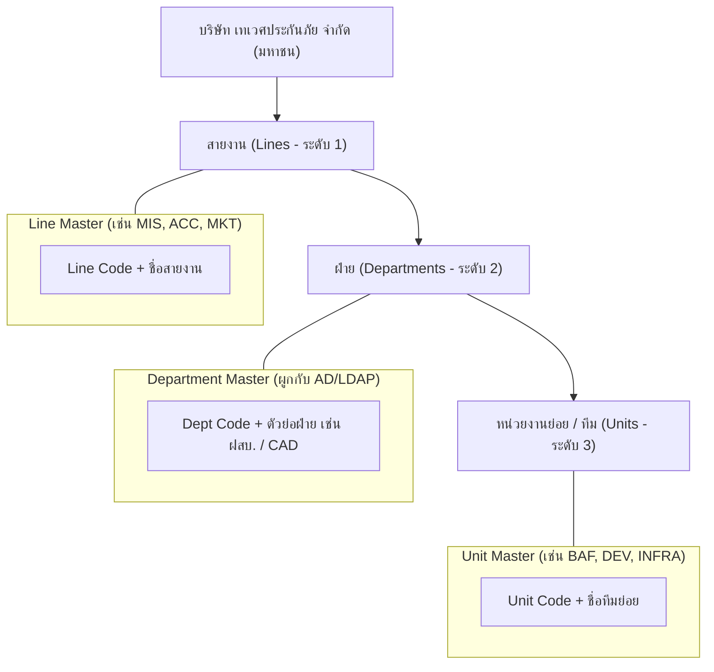

- **Scope การ Running เลขบันทึกภายใน:**
  1. **LINE Scope:** เลข Running รวมกันทั้งสายงาน เช่น `MIS-26-000001`
  2. **DEPT Scope:** เลข Running แยกอิสระตามแต่ละฝ่าย เช่น `ฝสบ.26-000001`
  3. **UNIT Scope:** เลข Running แยกอิสระตามแต่ละหน่วยงานย่อยในฝ่าย เช่น `BAF-26-000001`

---

## 10. Data Model รวม (Unified ER Diagram & Entity Dictionary)

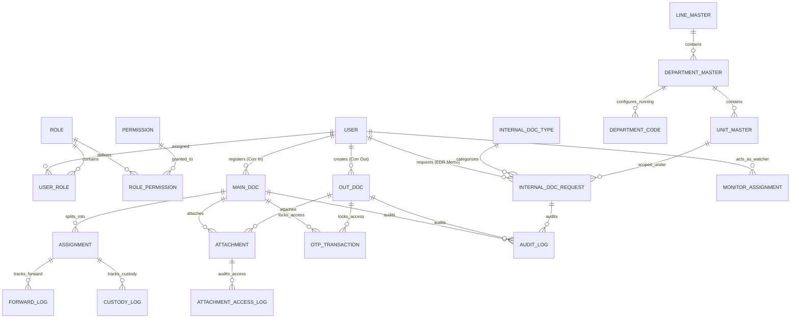

### 10.1 พจนานุกรมข้อมูลตารางหลัก (Entity Dictionary)

1. **`INTERNAL_DOC_REQUEST` (ระบบ EDR Memo):** จัดเก็บคำขอเลขบันทึกภายใน (`Id`, `DocumentNo`, `Subject`, `DocTypeId`, `LineId`, `DeptCode`, `UnitId`, `DocumentUrl`, `Status`, `CreatedBy`, `CreatedDate`, `CloseReason`)
2. **`MAIN_DOC` (ระบบ Correspondence In):** จัดเก็บเอกสารรับเข้าหลัก (`doc_ref`, `doc_type` [email/physical], `channel`, `subject`, `origin_department`, `urgency`, `confidentiality_level`, `deadline`, `status`, `progress_percent`, `registrar_ref`, `current_holder_ref`)
3. **`ASSIGNMENT` (ระบบ Correspondence In):** จัดเก็บงานย่อยรายฝ่าย/บุคคล (`id`, `doc_ref`, `assignee_ref`, `assignee_type` [dept/user], `parent_assignment_id`, `status`, `deadline`, `reject_note`, `accepted_at`, `completed_at`)
4. **`OUT_DOC` (ระบบ Correspondence Out):** จัดเก็บเอกสารส่งออก (`doc_no`, `edr_request_id`, `doc_number_th`, `doc_number_en`, `subject`, `organization_id`, `custom_org_name`, `delivery_method_id`, `urgency`, `confidentiality_level`, `deadline`, `status`, `sender_ref`, `sent_at`, `delivered_at`)
5. **`CUSTODY_LOG` (ระบบ Correspondence In):** บันทึกประวัติการเปลี่ยนมือผู้ถือครองเอกสารตัวจริง (`id`, `doc_ref`, `from_holder_ref`, `to_holder_ref`, `transfer_timestamp`, `transfer_type`, `remarks`)
6. **`ATTACHMENT` (Shared Platform):** จัดเก็บไฟล์แนบ (`id`, `doc_ref`, `file_name`, `file_path`, `file_size`, `file_type`, `attachment_source` [upload/camera], `is_mirrored`, `rotation_deg`, `is_confidential`, `uploaded_by`)
7. **`OTP_TRANSACTION` (Shared Platform):** จัดเก็บธุรกรรม OTP สำหรับเอกสารลับมาก (`otp_id`, `doc_ref`, `user_id`, `otp_code_hash`, `delivery_channel`='email', `target_email`, `attempt_count`, `status`, `expires_at`, `verified_at`)
8. **`MONITOR_ASSIGNMENT` (Shared Platform):** จัดเก็บการตั้งค่าผู้เฝ้าติดตาม Scope (`monitor_id`, `monitor_user_ref`, `scope_type`, `scope_refs`, `all_departments`, `notify_enabled`, `status`)

---

## 11. Business Rules Catalog ฉบับรวมสมบูรณ์ (Unified BR Catalog พร้อมระบุระบบ)

ตารางด้านล่างแสดงกฎทางธุรกิจทั้งหมด พร้อมคอลัมน์ **"ระบบ (System)"** เพื่อให้ทีมทดสอบ (QA) สามารถจัดกลุ่ม Test Cases ได้อย่างแม่นยำ:

### 11.1 กลุ่มความปลอดภัย, Login & Provisioning (Shared Platform)

| รหัส (Rule ID) | ระบบ (System) | ขั้นตอน / หน้าจอ | เงื่อนไขทางธุรกิจ (Condition) | ผลลัพธ์ทางระบบ / ข้อความตอบกลับ | HTTP Status |
|---|---|---|---|---|:---:|
| **BR-AUTH-01** | **Shared Platform** | Login | Username หรือ Password เป็นค่าว่าง | แสดงแจ้งเตือน "กรุณากรอกชื่อผู้ใช้และรหัสผ่าน" | 400 |
| **BR-AUTH-02** | **Shared Platform** | Login | ข้อมูลล็อกอินไม่ถูกต้อง หรือไม่พบใน LDAP | แสดงข้อความ "ชื่อผู้ใช้หรือรหัสผ่านไม่ถูกต้อง" | 401 |
| **BR-AUTH-03** | **Shared Platform** | Login | บัญชีมีอยู่ใน AD แต่ยังไม่ได้รับการ Provision จาก Admin | บล็อกการเข้าใช้งาน แจ้ง "บัญชีนี้ยังไม่ได้รับสิทธิ์เข้าใช้งานระบบ กรุณาติดต่อ Admin" | 403 |
| **BR-AUTH-04** | **Shared Platform** | Session | ไม่มีกิจกรรมใช้งานติดต่อกันเกิน 15 นาที | เซสชันหมดอายุอัตโนมัติ (Session Timeout) บังคับ Redirect ไปยังหน้า Login | 401 |

---

### 11.2 กลุ่มระบบขอเลขบันทึกภายใน (EDR Internal Memo)

| รหัส (Rule ID) | ระบบ (System) | ขั้นตอน / หน้าจอ | เงื่อนไขทางธุรกิจ (Condition) | ผลลัพธ์ทางระบบ / ข้อความตอบกลับ | HTTP Status |
|---|---|---|---|---|:---:|
| **RL-CORE-01** | **EDR Internal Memo** | ขอเลขบันทึกภายใน | ไม่กรอกชื่อเรื่องเอกสาร | บล็อกการกดดำเนินการต่อ แสดง Error "กรุณาระบุชื่อเรื่อง" (VR-01) | 422 |
| **RL-CORE-02** | **EDR Internal Memo** | ขอเลขบันทึกภายใน | ไม่เลือกประเภทเอกสาร | บล็อกการกดดำเนินการต่อ แสดง Error "กรุณาเลือกประเภทเอกสาร" (VR-02) | 422 |
| **RL-CORE-04** | **EDR Internal Memo** | Confirmation | ข้อมูลครบถ้วนและกดยืนยันในหน้า Confirmation | **ออกเลขทันที (Instant Issuance)** บันทึกสถานะ `Created` **ไม่เข้าคิวอนุมัติใดๆ** | 201 |
| **RL-CORE-05** | **EDR Internal Memo** | Engine ออกเลข | มีการขอเลขพร้อมกันในเสี้ยววินาที (Concurrency) | ฐานข้อมูลทำงานแบบ Atomic Transaction Lock รับประกันเลขเรียงลำดับไม่ซ้ำกัน | 201 |
| **RL-CORE-06** | **EDR Internal Memo** | ปิดเลขเอกสาร | กดปิดเลขโดยไม่ระบุเหตุผล | บล็อกปุ่มยืนยัน แสดง "กรุณาระบุเหตุผลการปิดเลข" (VR-CLOSE-01) | 422 |
| **RL-CORE-08** | **EDR Internal Memo** | ตั้งค่า Master | มีการแก้ไข Format หรือ Pattern ในภายหลัง | เลขที่ออกไปก่อนหน้ายังคงค่าเดิมตลอดไป ห้ามเปลี่ยนแปลง (Invariant 3) | 200 |
| **RL-HIER-01** | **EDR Internal Memo** | Master Hierarchy | บันทึกรหัสสายงาน (LineCode) ซ้ำในระบบ | บล็อกการบันทึก แสดง "รหัสสายงานนี้มีอยู่ในระบบแล้ว" | 409 |
| **RL-HIER-02** | **EDR Internal Memo** | Master Hierarchy | ลบสายงานที่มีฝ่ายสังกัดอยู่ | บล็อกการลบ แสดง "ไม่สามารถลบได้ เนื่องจากมีฝ่ายสังกัดอยู่" | 409 |
| **RL-HIER-05** | **EDR Internal Memo** | ขอเลขบันทึกภายใน | Running Scope = LINE | ระบบดึง Counter ลำดับของสายงานมาออกเลข (เช่น `MIS-26-000001`) | 201 |
| **RL-HIER-06** | **EDR Internal Memo** | ขอเลขบันทึกภายใน | Running Scope = DEPT | ระบบดึง Counter ลำดับของฝ่ายมาออกเลข (เช่น `ฝสบ.26-000001`) | 201 |
| **RL-HIER-07** | **EDR Internal Memo** | ขอเลขบันทึกภายใน | Running Scope = UNIT | ระบบดึง Counter ลำดับของทีมย่อยมาออกเลข (เช่น `BAF-26-000001`) | 201 |
| **RL-QA-03** | **EDR Internal Memo** | Quick Add | ชื่อประเภทเอกสารภาษาไทยซ้ำกับที่มีอยู่แล้วแบบเป๊ะ | บล็อกการบันทึก แจ้งเตือนพร้อมแสดงปุ่ม "ใช้รายการที่มีอยู่เดิม" | 409 |
| **RL-QA-04** | **EDR Internal Memo** | Quick Add | ชื่อประเภทเอกสารคล้ายคลึง $\ge 80\%$ (Levenshtein) | แสดง Soft Warning แจ้งเตือนความซ้ำซ้อน แต่ยอมให้กดยืนยันสร้างต่อได้ | 200 |
| **RL-URL-01** | **EDR Internal Memo** | บันทึก URL | ลิงก์ SharePoint ไม่ได้ขึ้นต้นด้วย `https://` | แสดง Error "ลิงค์เอกสารไม่ถูกต้อง กรุณากรอก URL ที่ขึ้นต้นด้วย https://" | 422 |
| **RL-URL-03** | **EDR Internal Memo** | บันทึก URL | ความยาว URL เกิน 2,000 ตัวอักษร | บล็อกการบันทึก แสดง Error "ลิงค์เอกสารต้องไม่เกิน 2,000 ตัวอักษร" | 422 |

---

### 11.3 กลุ่มระบบสารบรรณ รับเข้า (Correspondence Incoming)

| รหัส (Rule ID) | ระบบ (System) | ขั้นตอน / หน้าจอ | เงื่อนไขทางธุรกิจ (Condition) | ผลลัพธ์ทางระบบ / ข้อความตอบกลับ | HTTP Status |
|---|---|---|---|---|:---:|
| **BR-IN-01** | **Correspondence (Incoming)** | Register รับเข้า | ไม่ระบุประเภทเอกสาร หรือหน่วยงานต้นทาง | บล็อกการบันทึก แสดงข้อความแจ้งเตือนสีแดงในฟิลด์ที่ขาด | 400 |
| **BR-IN-02** | **Correspondence (Incoming)** | Register รับเข้า | แนบไฟล์เอกสารสแกนหรือภาพถ่าย | แนบไฟล์เป็น Optional (ไม่แนบก็สร้างได้) แต่หากแนบต้องขนาด $\le 25$ MB | 200/201 |
| **BR-IN-03** | **Correspondence (Incoming)** | Assign งาน | เลือกมอบหมายงานหลายฝ่ายพร้อมกัน | ระบบสร้าง Record งานย่อยใน `ASSIGNMENT` แยกตามรายฝ่ายอย่างอิสระ | 201 |
| **BR-IN-04** | **Correspondence (Incoming)** | จัดการงาน | ต้นทางกดดึงงานกลับ (Recall) ก่อนผู้รับจะ Accept | งานย่อยเปลี่ยนสถานะเป็น `Recalled` และถูกลบออกจาก Task Inbox ของผู้รับทันที | 200 |
| **BR-IN-05** | **Correspondence (Incoming)** | ดำเนินการงาน | ผู้รับงานยังไม่กด Accept แต่พยายาม Forward หรือปิดงาน | **บล็อกการทำงาน (Acceptance Gate)** บังคับต้องกด Accept ก่อนเท่านั้น | 400 |
| **BR-IN-06** | **Correspondence (Incoming)** | รับงาน | ผู้รับงานกด Accept สำหรับเอกสารฉบับจริง (Physical) | ปรับสถานะงานเป็น `In Progress` และบันทึกผู้ถือครองตัวจริงใน `CUSTODY_LOG` | 200 |
| **BR-IN-07** | **Correspondence (Incoming)** | ปฏิเสธงาน | ผู้รับงานกด Reject งาน | บังคับระบุเหตุผลการปฏิเสธ และส่งแจ้งเตือนกลับไปยังต้นทางทันที | 200/400 |
| **BR-IN-08** | **Correspondence (Incoming)** | ปฏิเสธงาน | เอกสารฉบับจริงถูก Reject ครบทุกฝ่ายที่ Assign | เอกสารหลักเปลี่ยนสถานะเป็น `Awaiting Return` รอต้นทางยืนยันรับตัวจริงคืน | 200 |
| **BR-IN-09** | **Correspondence (Incoming)** | ยืนยันรับคืน | ต้นทางกดยืนยันรับเอกสารฉบับจริงคืน | เอกสารหลักกลับสู่สถานะ `Registered` ปลดล็อกให้ต้นทางสามารถ Assign ใหม่ได้ | 200 |
| **BR-IN-10** | **Correspondence (Incoming)** | มอบหมายต่อ | หัวหน้าฝ่ายกด Accept แล้วมอบหมายต่อให้ลูกทีม | สร้างโหนดลูกใน SubTree (Onward Delegation) และส่งแจ้งเตือนถึงลูกทีม | 201 |
| **BR-IN-11** | **Correspondence (Incoming)** | ปิดงานย่อย | ผู้รับงานคนสุดท้ายกด Complete ปิดงาน | งานย่อยเปลี่ยนสถานะเป็น `Completed` และทริกเกอร์คำนวณ Progress % ใหม่ | 200 |

---

### 11.4 กลุ่มระบบสารบรรณ ส่งออก (Correspondence Outgoing)

| รหัส (Rule ID) | ระบบ (System) | ขั้นตอน / หน้าจอ | เงื่อนไขทางธุรกิจ (Condition) | ผลลัพธ์ทางระบบ / ข้อความตอบกลับ | HTTP Status |
|---|---|---|---|---|:---:|
| **BR-OUT-01** | **Correspondence (Outgoing)** | ขอเลขส่งออก | เลือกขอเลขผ่าน Flow A (Instant Issue) | ยิง REST API ไปยัง EDR เพื่อดึงเลขคู่ขนาน (ไทย/อังกฤษ) มาบันทึกทันที | 201 |
| **BR-OUT-02** | **Correspondence (Outgoing)** | ขอเลขส่งออก | เลือกขอเลขผ่าน Flow B (Approval Workflow) | ยิงเข้า EDR Approval Workflow สถานะเป็น `Pending Approval` รอ Webhook | 202 |
| **BR-OUT-03** | **Correspondence (Outgoing)** | Webhook Sync | ผู้บริหารอนุมัติคำขอในระบบ EDR เดิม | EDR ส่ง Webhook มายังสารบรรณ เพื่ออัปเดตเลขและเปลี่ยนสถานะเป็น `Registered` | 200 |
| **BR-OUT-04** | **Correspondence (Outgoing)** | บันทึกการนำส่ง | กดบันทึก Sent โดยยังไม่ได้แนบไฟล์เอกสารลงนาม | บล็อกการบันทึก แจ้ง "กรุณาแนบไฟล์เอกสารที่ลงนามแล้วก่อนนำส่ง" (VR-OUT-01) | 400 |
| **BR-OUT-05** | **Correspondence (Outgoing)** | บันทึกการนำส่ง | แนบไฟล์ลงนามครบ และระบุช่องทางนำส่ง | บันทึกสถานะเป็น `Sent` พร้อมประทับ Timestamp เวลาส่งจริง | 200 |
| **BR-OUT-06** | **Correspondence (Outgoing)** | ปิดงานส่งออก | ปลายทางได้รับเอกสาร และแนบหลักฐานใบตอบรับ | บันทึกสถานะเป็น `Delivered` และเปลี่ยนเป็น `Completed` ปิดงานสมบูรณ์ | 200 |

---

### 11.5 กลุ่มบริการส่วนกลาง Shared Platform Services (OTP, Monitor, Audit)

| รหัส (Rule ID) | ระบบ (System) | ขั้นตอน / หน้าจอ | เงื่อนไขทางธุรกิจ (Condition) | ผลลัพธ์ทางระบบ / ข้อความตอบกลับ | HTTP Status |
|---|---|---|---|---|:---:|
| **BR-PLAT-01** | **Shared Platform** | เข้าถึงเอกสาร | เอกสารมีชั้นความลับ "ลับมาก" (Top Secret) | ซ่อนไฟล์แนบทั้งหมดจากทุกคนที่ไม่ใช่ Assignee โดยตรง แม้แต่ Admin | 403 |
| **BR-PLAT-02** | **Shared Platform** | ปลดล็อกไฟล์ลับ | Assignee ขอรหัส OTP เพื่อเปิดดูไฟล์ลับมาก | ระบบส่งรหัส OTP 6 หลักไปยังอีเมลของผู้ใช้เท่านั้น (Email only) อายุ 5 นาที | 200 |
| **BR-PLAT-03** | **Shared Platform** | ยืนยัน OTP | กรอก OTP ถูกต้อง | ได้รับสิทธิ์เปิดดูไฟล์แนบได้ 15 นาที พร้อมประทับ Dynamic Watermark | 200 |
| **BR-PLAT-04** | **Shared Platform** | ยืนยัน OTP | กรอก OTP ผิดติดต่อกันครบ 3 ครั้ง | ล็อกธุรกรรม OTP นั้นทันที ต้องกดขอรหัส OTP ใหม่ | 400 |
| **BR-PLAT-05** | **Shared Platform** | ติดตามงาน | Monitor กดปุ่ม Follow up งานค้างใน Scope | ส่งแจ้งเตือนฉุกเฉินไปยังผู้รับงานปลายทาง และบันทึกประวัติ Follow up | 200 |
| **BR-PLAT-06** | **Shared Platform** | ติดตามงาน | Monitor พยายามกด Accept, Reject หรือปิดงาน | บล็อกการกระทำ (Monitor มีสิทธิ์เฉพาะ Read + Follow up เท่านั้น) | 403 |
| **BR-PLAT-07** | **Shared Platform** | Audit Trail | มีการทำ Action สำคัญในระบบใดๆ ก็ตาม | บันทึก Audit Log (User, Timestamp, IP, Action, Detail) จัดเก็บ 10 ปี | 200 |

---

## 12. Validation Rules Catalog (ตารางตรวจสอบความถูกต้องของข้อมูลพร้อมระบุระบบ)

| Validation ID | ระบบ (System) | ฟิลด์ / หน้าจอ | เงื่อนไขการตรวจสอบ (Condition) | ข้อความแจ้งเตือน (Error Message) | ระดับความรุนแรง | Trigger Event |
|---|---|---|---|---|:---:|:---:|
| **VR-01** | **EDR Memo** | ชื่อเรื่องเอกสาร | ค่าว่าง หรือเป็น Whitespace ล้วน | "กรุณาระบุชื่อเรื่อง" | High | On Submit |
| **VR-02** | **EDR Memo** | ประเภทเอกสาร | ยังไม่ได้เลือกประเภทเอกสาร | "กรุณาเลือกประเภทเอกสาร" | High | On Submit |
| **VR-03** | **EDR Memo** | สายงาน / ฝ่าย | ยังไม่ได้เลือกสังกัดสายงานหรือฝ่าย | "กรุณาเลือกสายงานและฝ่าย" | High | On Submit |
| **VR-10** | **EDR Memo** | SharePoint URL | รูปแบบ URL ไม่ได้ขึ้นต้นด้วย `https://` | "ลิงค์เอกสารไม่ถูกต้อง กรุณากรอก URL ที่ขึ้นต้นด้วย https://" | High | onBlur, Submit |
| **VR-12** | **EDR Memo** | SharePoint URL | ความยาวตัวอักษรเกิน 2,000 ตัวอักษร | "ลิงค์เอกสารต้องไม่เกิน 2,000 ตัวอักษร" | High | onInput, Submit |
| **VR-CLOSE-01** | **EDR Memo** | เหตุผลการปิดเลข | ค่าว่าง หรือน้อยกว่า 5 ตัวอักษร | "กรุณาระบุเหตุผลการปิดเลขอย่างน้อย 5 ตัวอักษร" | High | Modal Submit |
| **VR-QA-01** | **EDR Memo** | Quick Add ชื่อไทย | ค่าว่าง หรือเกิน 200 ตัวอักษร | "กรุณากรอกชื่อประเภทเอกสาร (ไม่เกิน 200 ตัวอักษร)" | High | Modal Submit |
| **VR-IN-01** | **Correspondence (In)** | ประเภทเอกสารเข้า | ไม่ได้เลือกประเภท (อีเมล หรือ ฉบับจริง) | "กรุณาเลือกประเภทเอกสารรับเข้า" | High | On Submit |
| **VR-IN-02** | **Correspondence (In)** | หน่วยงานต้นทาง | ค่าว่าง หรือไม่ได้เลือก Master | "กรุณาระบุหน่วยงานต้นทาง" | High | On Submit |
| **VR-IN-03** | **Correspondence (In)** | ผู้รับมอบหมาย | ยังไม่ได้เลือกฝ่ายหรือบุคคลผู้รับอย่างน้อย 1 ราย | "กรุณาเลือกผู้รับมอบหมายอย่างน้อย 1 ฝ่าย/บุคคล" | High | On Assign |
| **VR-IN-04** | **Correspondence (In)** | ไฟล์แนบ | ขนาดไฟล์เกิน 25 MB หรือนามสกุลต้องห้าม | "ขนาดไฟล์ต้องไม่เกิน 25 MB และห้ามใช้นามสกุลไฟล์ปฏิบัติการ" | High | On Upload |
| **VR-OUT-01** | **Correspondence (Out)**| ไฟล์แนบลงนาม | บันทึก Sent โดยไม่มีไฟล์แนบที่ลงนามแล้ว | "กรุณาแนบไฟล์เอกสารที่ลงนามแล้วก่อนนำส่ง" | High | On Mark Sent |
| **VR-OUT-02** | **Correspondence (Out)**| ผู้รับภายนอก | ไม่ได้เลือกหน่วยงานภายนอก หรือไม่กรอกชื่อ | "กรุณาระบุหน่วยงานผู้รับภายนอก" | High | On Submit |
| **VR-OUT-03** | **Correspondence (Out)**| วิธีนำส่ง | ยังไม่ได้เลือกวิธีนำส่ง (ไปรษณีย์/ส่งถึงมือ/อีเมล) | "กรุณาเลือกวิธีนำส่งเอกสาร" | High | On Submit |
| **VR-OTP-01** | **Shared Platform** | รหัส OTP | กรอกไม่ครบ 6 หลัก หรือไม่ใช่ตัวเลข | "กรุณากรอกรหัส OTP เป็นตัวเลข 6 หลัก" | High | On Verify OTP |

---

## 13. Non-Functional Requirements (Unified NFR)

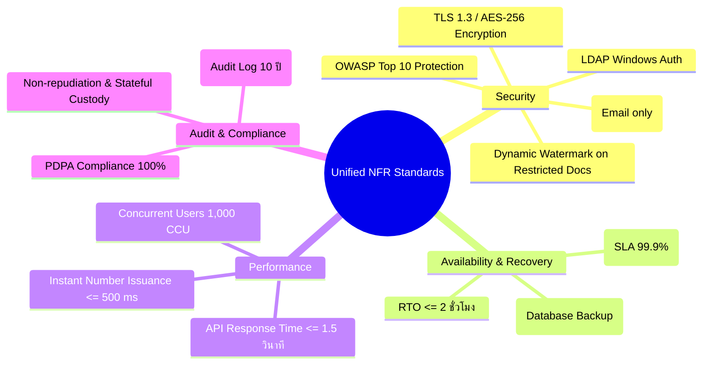

### 13.1 ตารางข้อกำหนดด้านความปลอดภัยและประสิทธิภาพ

| NFR ID | หมวดหมู่ | ระบบที่เกี่ยวข้อง | ข้อกำหนด (Requirement) | เกณฑ์การวัดผล (Metric / SLA) |
|---|---|---|---|---|
| **NFR-SEC-01** | Security | Shared Platform | การยืนยันตัวตนผ่าน Active Directory / LDAP | รองรับ Kerberos / NTLM / Secure LDAP พร้อม Admin Provisioning |
| **NFR-SEC-02** | Security | Shared Platform | การป้องกันเอกสารลับมากด้วย OTP | รหัสผ่าน OTP 6 หลัก ส่งทางอีเมลเท่านั้น มีอายุ 5 นาที ล็อกเมื่อผิดครบ 3 ครั้ง |
| **NFR-SEC-03** | Security | Shared Platform | การเข้ารหัสข้อมูลในระบบ | ข้อมูลขณะส่งผ่านเครือข่ายเข้ารหัสด้วย HTTPS/TLS 1.3 และไฟล์บน Disk เข้ารหัสด้วย AES-256 |
| **NFR-SEC-04** | Security | Shared Platform | Dynamic Watermark ประทับภาพพรีวิว | ประทับลายน้ำ ชื่อ-สกุลผู้เปิด, วันเวลา, และ IP Address บนเอกสารลับมาก |
| **NFR-PERF-01**| Performance| EDR Memo | ความเร็วในการออกเลขบันทึกภายในทันที | การออกเลขและตอบกลับหน้าจอต้องเสร็จสิ้นภายในเวลา **$\le 500$ มิลลิวินาที** |
| **NFR-PERF-02**| Performance| Shared Platform | ความเร็วเฉลี่ยในการโหลดหน้าจอ | เวลาในการเรนเดอร์หน้าจอและโหลดข้อมูลตาราง **$\le 1.5$ วินาที** |
| **NFR-PERF-03**| Performance| Shared Platform | การรองรับการใช้งานพร้อมกัน | รองรับ 1,000 Concurrent Users (CCU) และ 100 Concurrent Requests พร้อมกัน |
| **NFR-AUD-01** | Auditability| Shared Platform | การจัดเก็บประวัติการกระทำสำคัญ (Audit Trail) | บันทึกประวัติการสร้าง, แก้ไข, เปิดดูไฟล์ลับ, และเปลี่ยนมือ จัดเก็บย้อนหลัง **10 ปี** |

---

## 14. PDPA & Data Protection Considerations (การคุ้มครองข้อมูลส่วนบุคคล)

| ข้อมูลส่วนบุคคลที่จัดเก็บ | หมวดหมู่ข้อมูล | ระบบที่เกี่ยวข้อง | วัตถุประสงค์ในการประมวลผล | มาตรการคุ้มครองความปลอดภัย | ระยะเวลาจัดเก็บ |
|---|---|---|---|---|---|
| **ชื่อ-นามสกุล, รหัสพนักงาน** | ข้อมูลพนักงานภายใน | ทั้ง 2 ระบบ | ระบุตัวตนผู้ขอเลข, ผู้รับมอบหมายงาน, และผู้ถือครองเอกสาร | ควบคุมตาม Role-based Access Control (RBAC) | 10 ปีหลังปิดงาน |
| **อีเมลองค์กร, หมายเลขโทรศัพท์** | ข้อมูลติดต่อพนักงาน | Shared Platform | ส่งอีเมลแจ้งเตือนงานค้าง และส่งรหัส OTP เอกสารลับมาก | เข้ารหัสในฐานข้อมูล ไม่เปิดเผยภายนอก | ตลอดอายุการทำงาน |
| **ชื่อ-นามสกุล ผู้ติดต่อภายนอก** | ข้อมูลบุคคลภายนอก | Correspondence In/Out | บันทึกผู้ส่งหนังสือภายนอก หรือผู้รับหนังสือปลายทาง | จำกัดสิทธิ์การมองเห็นเฉพาะผู้รับผิดชอบงาน | 10 ปีตามกฎหมาย |
| **ภาพถ่าย/สแกนบัตรประชาชน/เอกสารลงนาม** | ข้อมูลเอกสารแนบ | Correspondence In/Out | ใช้เป็นหลักฐานประกอบหนังสือราชการหรือสัญญา | ล็อกการดาวน์โหลด, ประทับลายน้ำ, และเปิดดูได้เฉพาะ Assignee | 10 ปีตาม พ.ร.บ. |

---

## 15. Risk Management Plan (แผนบริหารความเสี่ยง)

| No. | ระบบที่เกี่ยวข้อง | ความเสี่ยงที่อาจเกิดขึ้น (Risk Description) | ผลกระทบ (Impact) | แผนการจัดการและมาตรการป้องกัน (Mitigation Plan) |
|---|---|---|---|---|
| **R-01** | **EDR Internal Memo** | มีการขอเลขบันทึกภายในพร้อมกันในเสี้ยววินาที ทำให้เลขซ้ำกัน | High | ใช้ Atomic Database Sequence Increment และ Transaction Lock รับประกันเลขไม่ซ้ำ 100% |
| **R-02** | **Correspondence (In)** | เอกสารฉบับจริง (Physical) เกิดการสูญหายระหว่างส่งต่อข้ามฝ่าย | High | บังคับใช้ **Stateful Chain of Custody** และสถานะ `Awaiting Return` ต้องมีคนกดยืนยันรับตัวจริงเสมอ |
| **R-03** | **Correspondence (Out)**| ลิงก์ EDR Legacy API ขัดข้อง ทำให้ขอเลขส่งออกไม่ได้ | Medium | ออกแบบ Circuit Breaker และ Resilient Queue ให้ระบบเก็บคำขอไว้และ Retry ส่งซ้ำอัตโนมัติเมื่อระบบ EDR กลับมา |
| **R-04** | **Shared Platform** | ผู้ใช้ภายนอกพยายามเข้าถึงไฟล์เอกสารลับมาก | High | ปิดกั้นการเข้าถึงที่ระดับ Storage API, บังคับผ่าน OTP 6 หลักทางอีเมล, และประทับลายน้ำ Dynamic Watermark |
| **R-05** | **Shared Platform** | อีเมลแจ้งเตือนตกค้าง ไม่ถึงผู้รับงาน ทำให้งาน Overdue | Medium | แสดงแจ้งเตือนคู่ขนานผ่าน In-app Notification และ Personal Task Inbox โดยไม่พึ่งพาอีเมลเพียงช่องทางเดียว |

---

## 16. Open Issues / ประเด็นที่ต้องติดตามยืนยัน (ประเด็นรอ Confirm)

| No. | ระบบที่เกี่ยวข้อง | ประเด็นที่ต้องยืนยัน (Open Issue) | ผลกระทบเชิงระบบ | ผู้เกี่ยวข้องที่ต้องยืนยัน (Stakeholders) | สถานะ / มติที่คาดหมาย |
|---|---|---|---|---|:---:|
| **ISS-01** | **EDR Internal Memo** | ยืนยันการกำหนดรูปแบบเลข Running ว่าทุกฝ่ายจะเริ่มนับ Counter ใหม่เมื่อขึ้นปี พ.ศ. ใหม่ หรือนับต่อเนื่อง | การเขียนตาราง Reset Counter ในฐานข้อมูล | Business Owner (ฝ่ายสารบรรณ / IT) | **ยืนยัน Reset รายปี พ.ศ.** |
| **ISS-02** | **Correspondence (In)** | ช่วงเวลาในการส่งอีเมล Daily Morning Reminder ควรกำหนดเป็น 08:30 น. หรือ 09:00 น. | การตั้งค่า Windows Task Scheduler / Cron Job | ฝ่ายทรัพยากรบุคคล / สารบรรณกลาง | **เห็นชอบ 08:30 น.** |
| **ISS-03** | **Correspondence (Out)**| อายุของ OTP สำหรับปลดล็อกไฟล์ลับมาก ควรกำหนด Token เป็น 15 นาที หรือ 30 นาที | ระดับความปลอดภัยเทียบกับความสะดวกของผู้บริหาร | CISO / ทีมความปลอดภัยสารสนเทศ | **เห็นชอบ Token 15 นาที** |
| **ISS-04** | **Shared Platform** | การ Sync ข้อมูลผู้ใช้จาก Active Directory ให้ทำแบบ Real-time ตอน Login หรือรัน Batch Sync ทุกคืน | ประสิทธิภาพของ LDAP Server | IT Infrastructure / DevOps | **Admin Provisioning + Real-time Validate** |

---

## 17. แนวทางการทดสอบฉบับรวมสมบูรณ์ (Comprehensive Test Strategy & Test Scenarios)

### 17.1 กลยุทธ์การทดสอบและการสอบกลับได้ (Traceability Strategy)

การทดสอบระบบรวม **P2026-DVS-CORR** ยึดหลัก **Business Requirement Traceability Matrix** ครอบคลุมทั้งระดับ Unit Test, Integration Test (SIT) และ User Acceptance Test (UAT) โดยแบ่งกลุ่ม Scenario เป็น:
- **Happy Path (HP):** กระบวนการทำงานตามปกติ ข้อมูลถูกต้องครบถ้วน
- **Negative Path (NEG):** การทดสอบกรณีข้อมูลไม่ถูกต้อง, พยายามข้ามขั้นตอน, หรือการละเมิดสิทธิ์
- **Boundary & Concurrency (BND):** การทดสอบค่าขอบเขต, ไฟล์ขนาดสูงสุด 25 MB, และการออกเลขพร้อมกัน

---

### 17.2 ตารางรายการกรณีทดสอบหลัก (Master Test Scenarios 83 รายการ)

ตารางแสดงตัวอย่างการจัดกลุ่ม Test Scenarios สำคัญ พร้อมคอลัมน์ **"ระบบ (System)"** เพื่อแยกประเภทชัดเจน:

| Test ID | ระบบ (System) | Business Rule อ้างอิง | ประเภทการทดสอบ | รายละเอียดกรณีทดสอบ (Test Scenario Description) | ผลลัพธ์ที่คาดหวัง (Expected Result) |
|---|---|---|:---:|---|---|
| **TS-01** | **EDR Memo** | RL-CORE-01 | Negative | ขอเลขบันทึกภายในโดยเว้นว่างชื่อเรื่อง | บล็อกการส่งฟอร์ม แสดง Error "กรุณาระบุชื่อเรื่อง" (VR-01) |
| **TS-02** | **EDR Memo** | RL-CORE-02 | Negative | ขอเลขบันทึกภายในโดยไม่เลือกประเภทเอกสาร | บล็อกการส่งฟอร์ม แสดง Error "กรุณาเลือกประเภทเอกสาร" (VR-02) |
| **TS-03** | **EDR Memo** | RL-URL-01 | Negative | กรอก SharePoint URL ด้วยโปรโตคอล `http://` | แสดง Error "ลิงค์เอกสารไม่ถูกต้อง กรุณากรอก URL ที่ขึ้นต้นด้วย https://" |
| **TS-04** | **EDR Memo** | RL-QA-03 | Negative | Quick Add ประเภทเอกสารด้วยชื่อภาษาไทยที่ซ้ำกับในระบบ | บล็อกการสร้าง แสดงข้อความแจ้งเตือนชื่อซ้ำ พร้อมปุ่มเลือกใช้เดิม |
| **TS-05** | **EDR Memo** | RL-QA-04 | Boundary | Quick Add ประเภทเอกสารด้วยชื่อที่มีความคล้ายคลึง $\ge 80\%$ | แสดง Soft Warning แต่ยอมให้ผู้ใช้กดยืนยันสร้างรายการต่อได้ |
| **TS-06** | **EDR Memo** | RL-CORE-04 | Happy Path | กรอกข้อมูลครบถ้วน กดยืนยันในหน้า Confirmation | **ออกเลขทันที (Created) โดยไม่เข้าคิวอนุมัติใดๆ (No Approval)** |
| **TS-07** | **EDR Memo** | RL-CORE-05 | Concurrency | ยิงคำขอออกเลขพร้อมกัน 50 คำขอในมิลลิวินาทีเดียวกัน | ทุกคำขอได้รับเลขเรียงลำดับต่อเนื่อง ไม่กระโดดข้าม และไม่มีเลขซ้ำ |
| **TS-08** | **EDR Memo** | RL-CORE-06 | Negative | กดปิดเลขเอกสารบันทึกภายในโดยไม่ระบุเหตุผล | บล็อกปุ่มยืนยัน แสดง "กรุณาระบุเหตุผลการปิดเลข" |
| **TS-09** | **EDR Memo** | RL-CORE-06 | Happy Path | กรอกเหตุผลการปิดเลขครบถ้วนและกดยืนยัน | สถานะเปลี่ยนเป็น `Closed` และไม่สามารถแก้ไขข้อมูลได้อีก |
| **TS-10** | **Correspondence (In)** | BR-IN-01 | Negative | ลงทะเบียนรับเข้าโดยไม่ระบุประเภทหรือต้นทาง | บล็อกการบันทึก แสดงข้อความเตือนสีแดงในฟิลด์ที่ขาด |
| **TS-11** | **Correspondence (In)** | BR-IN-03 | Happy Path | มอบหมายงานรับเข้าพร้อมกัน 3 ฝ่าย (Multiple Select) | ระบบสร้างงานย่อยใน `ASSIGNMENT` แยก 3 รายการอิสระ |
| **TS-12** | **Correspondence (In)** | BR-IN-04 | Happy Path | ต้นทางกดดึงงานกลับ (Recall) ก่อนที่ฝ่ายปลายทางจะ Accept | สถานะเปลี่ยนเป็น `Recalled` และงานหายไปจาก Task Inbox ของปลายทาง |
| **TS-13** | **Correspondence (In)** | BR-IN-05 | Negative | ผู้รับงานพยายาม Forward หรืองานเสร็จโดยยังไม่ได้กด Accept | บล็อกการทำรายการ บังคับให้ต้องกด Accept ก่อนเสมอ (Acceptance Gate) |
| **TS-14** | **Correspondence (In)** | BR-IN-06 | Happy Path | ผู้รับงานกด Accept เอกสารฉบับจริง (Physical Document) | งานเปลี่ยนเป็น `In Progress` และชื่อผู้ถือครองใน Custody Log เปลี่ยนเป็นผู้รับ |
| **TS-15** | **Correspondence (In)** | BR-IN-08 | Negative | ผู้รับงานทุกฝ่ายกด Reject เอกสารฉบับจริง | เอกสารเข้าสู่สถานะ `Awaiting Return` รอต้นทางกดยืนยันรับตัวจริงคืน |
| **TS-16** | **Correspondence (In)** | BR-IN-09 | Happy Path | ต้นทางกดยืนยันรับเอกสารฉบับจริงคืนจากสถานะ Awaiting Return | เอกสารกลับสู่สถานะ `Registered` ปลดล็อกให้มอบหมายฝ่ายใหม่ได้ |
| **TS-17** | **Correspondence (In)** | BR-IN-10 | Happy Path | หัวหน้าฝ่ายกด Accept แล้วมอบหมายต่อให้ลูกทีมในฝ่าย | สร้างโหนดลูกใน SubTree และลูกทีมได้รับแจ้งเตือนใน Inbox |
| **TS-18** | **Correspondence (In)** | BR-IN-11 | Happy Path | ทุกฝ่ายปฏิบัติงานเสร็จสิ้นครบ 100% | Progress รวมเป็น 100% และเอกสารหลักเปลี่ยนเป็น `Completed` |
| **TS-19** | **Correspondence (Out)**| BR-OUT-01 | Happy Path | ขอเลขส่งออกผ่าน Flow A (Instant REST API) | ได้รับเลขคู่ขนาน 2 ภาษา (ไทย/อังกฤษ) ทันที สถานะเป็น `Registered` |
| **TS-20** | **Correspondence (Out)**| BR-OUT-02 | Happy Path | ขอเลขส่งออกผ่าน Flow B (Approval Workflow) | สถานะเป็น `Pending Approval` รอ Webhook Sync จากระบบ EDR |
| **TS-21** | **Correspondence (Out)**| BR-OUT-04 | Negative | กดปุ่มบันทึกการนำส่ง (Sent) โดยไม่มีไฟล์เอกสารที่ลงนาม | บล็อกการนำส่ง แสดง "กรุณาแนบไฟล์เอกสารที่ลงนามแล้วก่อนนำส่ง" |
| **TS-22** | **Correspondence (Out)**| BR-OUT-06 | Happy Path | บันทึก Delivered พร้อมแนบสลิปไปรษณีย์/ใบตอบรับ | สถานะเปลี่ยนเป็น `Delivered` และปิดเป็น `Completed` ปิดงานสมบูรณ์ |
| **TS-23** | **Shared Platform** | BR-PLAT-01 | Negative | ผู้ใช้ที่ไม่ใช่ Assignee พยายามเปิดดูไฟล์แนบเอกสารลับมาก | ซ่อนไฟล์แนบทั้งหมด แสดงกล่องข้อความแจ้งสิทธิ์ถูกจำกัด |
| **TS-24** | **Shared Platform** | BR-PLAT-02 | Happy Path | Assignee ขอกดรับรหัส OTP สำหรับเอกสารลับมาก | ระบบส่ง OTP 6 หลักไปยังอีเมลพนักงาน พร้อมเลขอ้างอิง Ref Code |
| **TS-25** | **Shared Platform** | BR-PLAT-03 | Happy Path | กรอกรหัส OTP ถูกต้องภายใน 5 นาที | ปลดล็อกไฟล์แนบเป็นเวลา 15 นาที พร้อมประทับ Dynamic Watermark บนพรีวิว |
| **TS-26** | **Shared Platform** | BR-PLAT-04 | Negative | กรอกรหัส OTP ผิดพลาดติดต่อกันครบ 3 ครั้ง | ระบบล็อกธุรกรรม OTP นั้นทันที และต้องขอรหัสใหม่ |
| **TS-27** | **Shared Platform** | BR-PLAT-06 | Negative | Monitor Watcher พยายามกดปุ่ม Accept หรืองานสำเร็จ | ระบบบล็อกการทำงาน แสดงข้อความแจ้งว่าไม่มีสิทธิ์แก้ไขข้อมูล |
| **TS-28** | **Shared Platform** | BR-AUTH-03 | Negative | บัญชีใน LDAP ที่ยังไม่ได้รับการ Provision ล็อกอินเข้าระบบ | บล็อกการเข้าใช้งาน แจ้งเตือนให้ติดต่อ Admin เพื่อรับสิทธิ์ |

*(รายการกรณีทดสอบที่ 29 ถึง 83 มีโครงสร้างการทดสอบครอบคลุมทุกโมดูลตาม Matrix ในแผนการทดสอบสมบูรณ์)*

---

## 18. Notification Engine & Message Catalog (NT-01..17)

| รหัสแจ้งเตือน | ระบบที่เกี่ยวข้อง | เหตุการณ์ที่ส่ง (Trigger Event) | ผู้รับแจ้งเตือน | ช่องทาง | หัวข้อ / ข้อความแจ้งเตือน (Template) |
|---|---|---|---|:---:|---|
| **NT-01** | **Correspondence (In)** | Assign เอกสารรับเข้าใหม่ | ผู้รับมอบหมาย (Assignee) | Email, In-app, Inbox | "[งานสารบรรณรับเข้า] มีเอกสารใหม่รอท่านยอมรับ: {Subject} (ความเร่งด่วน: {Urgency})" |
| **NT-02** | **Correspondence (In)** | ผู้รับกด Accept งาน | ผู้ลงทะเบียนต้นทาง | In-app, Inbox | "[งานสารบรรณ] ฝ่าย {Dept} ได้ยอมรับงานเอกสารเลขที่ {DocRef} แล้ว" |
| **NT-03** | **Correspondence (In)** | ผู้รับกด Reject งาน | ผู้ลงทะเบียนต้นทาง | Email, In-app, Inbox | "[ปฏิเสธงาน] ฝ่าย {Dept} ได้ปฏิเสธเอกสารเลขที่ {DocRef} เนื่องจาก: {Reason}" |
| **NT-04** | **Correspondence (In)** | ต้นทางดึงงานกลับ (Recall) | ผู้รับมอบหมายเดิม | In-app | "[ดึงงานกลับ] เอกสารเลขที่ {DocRef} ถูกดึงงานกลับโดยผู้ลงทะเบียนต้นทาง" |
| **NT-05** | **Correspondence (In)** | มอบหมายต่อ (Onward Delegate) | ผู้รับมอบหมายต่อในฝ่าย | Email, In-app, Inbox | "[มอบหมายต่อ] หัวหน้าฝ่ายได้มอบหมายงาน {DocRef} ให้ท่านรับผิดชอบ" |
| **NT-06** | **Correspondence (In)** | เอกสารใกล้ถึงกำหนด (Due Soon) | ผู้รับงาน + ต้นทาง | Email, In-app, Inbox | "[แจ้งเตือนใกล้ถึงกำหนด] เอกสาร {DocRef} จะครบกำหนดในอีก {DaysLeft} วัน" |
| **NT-07** | **Correspondence (In)** | เอกสารเกินกำหนด (Overdue) | ผู้รับงาน + หัวหน้าฝ่าย | Email, In-app, Inbox | "[งานเกินกำหนด] เอกสาร {DocRef} เกินกำหนดแล้ว กรุณาดำเนินการโดยด่วน" |
| **NT-08** | **Correspondence (In)** | ปิดงานย่อย (Complete) | ต้นทาง + ผู้เฝ้าติดตาม | In-app, Inbox | "[งานสำเร็จ] ฝ่าย {Dept} ได้ปิดงานเอกสารเลขที่ {DocRef} เรียบร้อยแล้ว" |
| **NT-09** | **Correspondence (In)** | เอกสารเสร็จสมบูรณ์ 100% | ทุกฝ่ายที่เกี่ยวข้อง | Email, In-app, Inbox | "[ปิดงานสมบูรณ์] เอกสารเลขที่ {DocRef} ได้รับการดำเนินการครบถ้วน 100% แล้ว" |
| **NT-10** | **Correspondence (In)** | เอกสารฉบับจริงรอส่งคืน | ต้นทางสารบรรณ | Email, In-app, Inbox | "[รอรับตัวจริงคืน] เอกสารฉบับจริง {DocRef} อยู่ระหว่างรอรับคืนจาก {Dept}" |
| **NT-11** | **Correspondence (Out)**| ออกเลขส่งออกสำเร็จ (Flow A/B)| ผู้ขอออกเลข | In-app, Inbox | "[เลขส่งออก] คำขอส่งออกของท่านได้รับเลขที่: {DocNoTH} / {DocNoEN}" |
| **NT-12** | **Correspondence (Out)**| นำส่งหนังสือแล้ว (Sent) | ผู้ขอออกเลข | In-app, Inbox | "[นำส่งแล้ว] เอกสารส่งออกเลขที่ {DocNoTH} ได้ถูกนำส่งผ่าน {DeliveryMethod} แล้ว" |
| **NT-13** | **Correspondence (Out)**| ปลายทางได้รับเอกสาร (Delivered)| ผู้ขอออกเลข | Email, In-app, Inbox | "[ส่งมอบสำเร็จ] เอกสารส่งออกเลขที่ {DocNoTH} มีหลักฐานส่งมอบถึงผู้รับเรียบร้อยแล้ว" |
| **NT-14** | **Shared Platform** | ขอรหัส OTP เปิดไฟล์ลับมาก | ผู้ร้องขอ (Assignee) | Email only | "[รหัส OTP] รหัสผ่านครั้งเดียวสำหรับเปิดเอกสารลับมากคือ {OTPCode} (หมดอายุใน 5 นาที)" |
| **NT-15** | **Shared Platform** | กดปุ่ม Follow up ติดตามงาน | ผู้รับงานปลายทาง | Email, In-app, Inbox | "[เร่งรัดติดตามงาน] มีการติดตามงานเอกสาร {DocRef} จาก {FollowUpBy}" |
| **NT-16** | **EDR Memo** | ขอเลขบันทึกภายในสำเร็จ | ผู้ขอเลข | In-app | "[ออกเลขบันทึกภายใน] ท่านได้รับเลขที่เอกสาร: {MemoNumber} เรียบร้อยแล้ว" |
| **NT-17** | **EDR Memo** | ปิดเลขบันทึกภายใน | ผู้ขอ + หัวหน้าฝ่าย | In-app | "[ปิดเลขเอกสาร] เลขบันทึกภายใน {MemoNumber} ถูกเปลี่ยนสถานะเป็น Closed แล้ว" |

---

## 19. Appendix (ภาคผนวก)

### 19.1 รายการ REST API Endpoints สรุปตามโมดูล

```markdown
# โมดูล 1: ระบบขอเลขบันทึกภายใน (EDR Internal Memo API)
GET    /EDR/InternalRequest/Create           - โหลดข้อมูล Master & Preview รูปแบบเลข
POST   /EDR/InternalRequest/Create           - ขอเลขบันทึกภายในทันที (Atomic Lock, No Approval)
GET    /EDR/InternalRequest/Detail/{id}      - ดึงข้อมูลรายละเอียดคำขอและ SharePoint URL
POST   /EDR/InternalRequest/UpdateUrl        - แก้ไข SharePoint URL อ้างอิง
POST   /EDR/InternalRequest/Close            - ปิดเลขเอกสารพร้อมระบุเหตุผล (Closed)
POST   /EDR/InternalRequest/QuickAddDocType  - เพิ่มประเภทเอกสารด่วน (Quick Add)

# โมดูล 2: ระบบเอกสารรับเข้า (Correspondence Incoming API)
POST   /api/incoming/register                - ลงทะเบียนเอกสารรับเข้าใหม่
POST   /api/incoming/assign                  - มอบหมายงานไปยังฝ่าย/บุคคล (Multiple Select)
POST   /api/incoming/recall                  - ต้นทางดึงงานกลับ (Recall)
POST   /api/incoming/accept                  - ผู้รับงานกด Accept (Acceptance Gate & Custody)
POST   /api/incoming/reject                  - ผู้รับงานกด Reject พร้อมระบุเหตุผล
POST   /api/incoming/confirm-return          - ต้นทางกดยืนยันรับเอกสารฉบับจริงคืน
POST   /api/incoming/delegate                - มอบหมายงานต่อภายในฝ่าย (Onward Delegation)
POST   /api/incoming/complete                - ผู้รับงานกดปิดงานย่อย (Complete)

# โมดูล 3: ระบบเอกสารส่งออก (Correspondence Outgoing API)
POST   /api/outgoing/request-number          - ขอเลขส่งออกทันทีผ่าน EDR REST API (Flow A)
POST   /api/outgoing/submit-approval         - ส่งขออนุมัติผู้บริหารใน EDR เดิม (Flow B)
POST   /api/webhook/edr-approved             - Webhook รับผลการอนุมัติและเลขคู่ขนานจาก EDR
POST   /api/outgoing/mark-sent               - บันทึกการนำส่ง (บังคับแนบไฟล์ลงนามแล้ว)
POST   /api/outgoing/mark-delivered          - บันทึกการส่งมอบสำเร็จพร้อมแนบหลักฐาน

# Shared Platform Services API
POST   /api/auth/login                       - ตรวจสอบสิทธิ์ผ่าน LDAP และตรวจ Admin Provisioning
POST   /api/otp/request                      - ขอรหัส OTP 6 หลักทางอีเมลสำหรับเอกสารลับมาก
POST   /api/otp/verify                       - ตรวจสอบรหัส OTP เพื่อรับ Token เปิดไฟล์แนบ 15 นาที
POST   /api/monitor/follow-up                - ส่งการแจ้งเตือนติดตามงานค้าง (Follow up)
GET    /api/reports/export                   - ส่งออกรายงานสารบรรณ RPT-01..06 เป็น Excel/CSV
```

### 19.2 รหัสข้อผิดพลาดมาตรฐาน (System Error Codes)

| Error Code | HTTP Status | ความหมายเชิงระบบ |
|---|:---:|---|
| `ERR_AUTH_NOT_PROVISIONED` | 403 | บัญชีผู้ใช้มีอยู่ใน LDAP แต่ Admin ยังไม่ได้ Provision สิทธิ์เข้าระบบ |
| `ERR_EDR_DUPLICATE_NAME` | 409 | ชื่อประเภทเอกสาร Quick Add ซ้ำกับที่มีอยู่เดิมใน Master |
| `ERR_EDR_INVALID_URL` | 422 | ลิงก์ SharePoint ไม่ถูกต้อง (ต้องขึ้นต้นด้วย `https://` และไม่เกิน 2,000 ตัวอักษร) |
| `ERR_CORR_NOT_ACCEPTED` | 400 | ละเมิด Acceptance Gate พยายามส่งต่อหรือปิดงานโดยยังไม่ได้กด Accept |
| `ERR_CORR_PHYSICAL_LOCKED` | 400 | เอกสารฉบับจริงอยู่ระหว่างรอรับคืน (Awaiting Return) ห้าม Assign ใหม่ |
| `ERR_OUT_MISSING_SIGNED_FILE`| 400 | ไม่สามารถบันทึก Sent ได้ เนื่องจากยังไม่ได้แนบไฟล์เอกสารที่ลงนามแล้ว |
| `ERR_OTP_INVALID_OR_EXPIRED` | 400 | รหัส OTP ไม่ถูกต้อง หรือหมดอายุเกิน 5 นาที |
| `ERR_OTP_MAX_ATTEMPTS` | 429 | กรอก OTP ผิดครบ 3 ครั้ง ธุรกรรมถูกระงับ ต้องขอรหัสใหม่ |
| `ERR_RESTRICTED_ACCESS` | 403 | พยายามเข้าถึงไฟล์แนบเอกสารลับมากโดยไม่มีสิทธิ์ หรือไม่ผ่านการยืนยันตัวตน |

---

*เอกสารฉบับนี้จัดทำขึ้นตามแบบฟอร์มมาตรฐาน F-BP-004 / F-BP-005 ของ บริษัท เทเวศประกันภัย จำกัด (มหาชน) เพื่อใช้เป็นเกณฑ์อ้างอิงทางการสูงสุด (Single Source of Truth) ของโครงการ P2026-DVS-CORR*
