# เอกสารวิเคราะห์ความต้องการระบบ (SRS Analysis) — ฉบับรวมสมบูรณ์
# ระบบสารบรรณอิเล็กทรอนิกส์และออกเลขที่เอกสาร (DVS Correspondence & EDR System)

**Document Type:** Software Requirement Specification — Consolidated Analysis (F-BP-004 / F-BP-005)  
**Project:** P2026-DVS-CORR — ระบบสารบรรณอิเล็กทรอนิกส์และออกเลขที่เอกสาร (Correspondence & EDR System)  
**System:** DVS Correspondence & EDR System (ASP.NET Core MVC / .NET 8 + Vite/React UI + SQL Server)  
**Modules:**  
1. โมดูลระบบขอเลขที่เอกสารบันทึกภายในและ Master Hierarchy (Internal Memo & Org Hierarchy)  
2. โมดูลระบบติดตามและบริหารจัดการเอกสารรับเข้า (Incoming Correspondence Lifecycle & Chain of Custody)  
3. โมดูลระบบออกเลขและติดตามเอกสารส่งออก (Outgoing Correspondence Lifecycle & Seamless EDR Integration)  
4. Shared Platform Services (Master Data Engine, LDAP Provisioning, Notification Engine, OTP Security, Camera Capture, Configurable Watcher, Audit Trail 10 ปี)  

**Version:** 3.0.0 (ฉบับรวมสมบูรณ์โครงการเดียว — Single Source of Truth)  
**Prepared by:** Business Analyst (BA)  
**Created Date:** 31 สิงหาคม 2569 (2026)  
**Environment (UAT):** `https://iwebsvuat.deves.co.th/EDR` / `https://iwebsvuat.deves.co.th/Correspondence`  
**Status:** Approved for SIT / UAT  

---

### บันทึกการเปลี่ยนแปลงของเอกสาร (Document Change Log)

| Version | วันที่ | รายละเอียดการเปลี่ยนแปลง | โดย |
|---|---|---|---|
| Draft 1.0.0 | 20 ก.พ. 2026 | เอกสารวิเคราะห์ระบบงานสารบรรณฉบับแรก (ยึด Flow 1.4.0) | BA |
| Draft 1.8.8 | 28 ส.ค. 2026 | ปรับปรุงระบบงานสารบรรณสมบูรณ์: User Provisioning LDAP, Message Catalog (NT-01..17), ธีม Deves `#012169`/`#FFCD00`, กล้องถ่ายภาพ WebRTC Flip/Rotate, Direct Upload/Drag-and-Drop, OTP Gate สำหรับเอกสารลับมาก (Email only), Monitor Watcher Multi-Scope, Master-Driven Entry, Onward Delegation, Nested Delegation SubTree, Stateful Chain of Custody, Repeat Reminders | BA |
| V2.0.0 | 26 ส.ค. 2026 | เอกสารวิเคราะห์ระบบขอเลขที่เอกสารบันทึกภายใน (EDR Internal Memo) ฉบับสมบูรณ์: No Approval Flow, Hierarchy 3 ระดับ (สายงาน/ฝ่าย/หน่วยงาน), Quick Add ประเภทเอกสาร, SharePoint URL, ภาพหน้าจอจริง UAT | BA |
| **V3.0.0** | **31 ส.ค. 2026** | **Consolidated Unified Release (รวมโครงการเป็นระบบเดียว):**<br/>1) รวมระบบขอเลขบันทึกภายใน (EDR Internal Memo) และระบบติดตามเอกสารรับเข้า–ส่งออก (Correspondence Monitoring System) เข้าเป็นโครงการเดียวกันภายใต้รหัส `P2026-DVS-CORR`<br/>2) ผสาน Master Data สถาปัตยกรรมองค์กร (Lines, Departments, Units, Workgroups) และ User Provisioning ผ่าน LDAP/AD เข้าเป็น Shared Engine เดียวกัน<br/>3) บูรณาการ API Contracts เชื่อมโยง 2 ทางแบบ Real-time ระหว่าง EDR Engine และ Correspondence Gateway (Pre-flight Context Check, Seamless Number Request, Webhook Sync, Daily Reconciliation)<br/>4) รวม Business Rules Catalog (RL-xxx / BR-xxx), Validation Rules Catalog (VR-xxx / VAL-xxx), NFR, PDPA, และ Test Scenarios (ข้อ 1–83 + TS-HP/NEG/BND) ไว้ในเอกสารฉบับเดียวอย่างสมบูรณ์ | BA |

---

## สารบัญ (Table of Contents)

1. [ภาพรวมและวัตถุประสงค์ของโครงการ](#1-ภาพรวมและวัตถุประสงค์ของโครงการ)
2. [Executive Summary, สถาปัตยกรรมภาพรวม & กฎเหล็กที่ห้ามละเมิด](#2-executive-summary-สถาปัตยกรรมภาพรวม--กฎเหล็กที่ห้ามละเมิด)
3. [ขอบเขตงาน (Scope of Work)](#3-ขอบเขตงาน-scope-of-work)
4. [บทบาทผู้ใช้และสิทธิ์การใช้งาน (Unified Roles & Permissions)](#4-บทบาทผู้ใช้และสิทธิ์การใช้งาน-unified-roles--permissions)
5. [โครงสร้างลำดับชั้นองค์กร & Master Data Model (Hierarchy & Master-Driven Architecture)](#5-โครงสร้างลำดับชั้นองค์กร--master-data-model-hierarchy--master-driven-architecture)
6. [Use Cases ภาพรวมและกระบวนการหลัก End-to-End](#6-use-cases-ภาพรวมและกระบวนการหลัก-end-to-end)
7. [สถานะเอกสารและการคำนวณ Progress (State Machines & Progress Logic)](#7-สถานะเอกสารและการคำนวณ-progress-state-machines--progress-logic)
8. [Notification Engine & Message Catalog (การแจ้งเตือนและการติดตาม)](#8-notification-engine--message-catalog-การแจ้งเตือนและการติดตาม)
9. [ข้อกำหนดรายหน้าจอและ Dashboard (Screen Specifications & UI Design System)](#9-ข้อกำหนดรายหน้าจอและ-dashboard-screen-specifications--ui-design-system)
10. [Data Model รวม (Unified ER Diagram & Entity Dictionary)](#10-data-model-รวม-unified-er-diagram--entity-dictionary)
11. [Business Rules Catalog ฉบับรวมสมบูรณ์ (Unified BR Catalog)](#11-business-rules-catalog-ฉบับรวมสมบูรณ์-unified-br-catalog)
12. [Validation Rules ฉบับรวมสมบูรณ์ (Unified Validation Catalog)](#12-validation-rules-ฉบับรวมสมบูรณ์-unified-validation-catalog)
13. [Non-Functional Requirements (Unified NFR)](#13-non-functional-requirements-unified-nfr)
14. [PDPA & Data Protection Considerations (การคุ้มครองข้อมูลส่วนบุคคล)](#14-pdpa--data-protection-considerations-การคุ้มครองข้อมูลส่วนบุคคล)
15. [Risk Management Plan (แผนบริหารความเสี่ยง)](#15-risk-management-plan-แผนบริหารความเสี่ยง)
16. [Open Issues / ประเด็นที่ต้องติดตามยืนยัน](#16-open-issues--ประเด็นที่ต้องติดตามยืนยัน)
17. [แนวทางการทดสอบฉบับรวมสมบูรณ์ (Comprehensive Test Strategy & Test Scenarios)](#17-แนวทางการทดสอบฉบับรวมสมบูรณ์-comprehensive-test-strategy--test-scenarios)
18. [Appendix (ภาคผนวก)](#18-appendix-ภาคผนวก)

---

## 1. ภาพรวมและวัตถุประสงค์ของโครงการ

เดิม บริษัท เทเวศประกันภัย จำกัด (มหาชน) มีกระบวนการด้านเอกสารที่แยกส่วนกัน:
1. การขอเลขที่เอกสารดำเนินการผ่านระบบ **EDR (Electronic Document Request)** ซึ่งเน้นการออกเลขเอกสารภายนอก (เลขพิเศษ `พศ...` และเลขธรรมดา `ทด...`) ที่ต้องผ่านสายการอนุมัติ (Approval Workflow) แต่ยังขาดความยืดหยุ่นในการออกเลข **บันทึกข้อความภายใน** ที่ต้องการความรวดเร็วแบบทันที (Instant Generation)
2. การบริหารจัดการงานสารบรรณ (รับหนังสือเข้าจากภายนอก และส่งหนังสือออกไปยังหน่วยงานภายนอก) ดำเนินการแยกกันทุกขั้นตอน เอกสารรับเข้าไม่มีระบบติดตามสถานะว่าผู้รับงานปลายทางได้รับเอกสารจริงหรือไม่ ดำเนินการถึงขั้นใด และใครเป็นผู้ถือครองเอกสารฉบับจริงในปัจจุบัน ทำให้เกิดปัญหาเอกสารตกหล่นและติดตามงานยาก

โครงการ **P2026-DVS-CORR** จึงรวมศูนย์การทำงานทั้ง 2 ส่วนเข้าไว้ในระบบเดียวกันเป็น **Single Unified Correspondence & Document System** เพื่อยกระดับการทำงานสู่ Digital Workplace ที่โปร่งใส มีประสิทธิภาพ และตรวจสอบย้อนหลังได้ 100%

### 1.1 วัตถุประสงค์หลักของระบบรวม

| # | วัตถุประสงค์หลัก | ความหมายและการบรรลุผลเชิงระบบ |
|---|---|---|
| **OBJ-01** | **ออกเลขบันทึกภายในได้ทันที (Instant Memo Generation)** | ผู้ขอสามารถขอเลขบันทึกภายในและได้รับเลขทันทีโดยไม่ต้องผ่านสายการอนุมัติ (No Approval Flow) พร้อม Real-time Preview |
| **OBJ-02** | **รองรับโครงสร้างองค์กร 3 ระดับ (3-Tier Hierarchy)** | บริหารจัดการ สายงาน (Line) $\rightarrow$ ฝ่าย (Department) $\rightarrow$ หน่วยงานภายใน (Unit/Team) พร้อมกำหนด Running Scope ตามสายงาน ฝ่าย หรือทีม |
| **OBJ-03** | **ติดตามสถานะเอกสารรับเข้า-ส่งออก End-to-End** | บันทึกวงจรชีวิต (Lifecycle) ตั้งแต่ Register จนปิดงานสมบูรณ์ (Completed) พร้อม Story Line, Timestamp และ Duration ต่อ Stage |
| **OBJ-04** | **รับประกันการรับจริงและ Chain of Custody** | ผู้รับงานต้องกด Accept เพื่อยืนยันการรับงาน สำหรับเอกสารฉบับจริง (Physical) ระบบจะบันทึกสถานะผู้ถือครองเอกสารตัวจริงล่าสุดแบบ Stateful |
| **OBJ-05** | **กระจายงานหลายฝ่ายและคำนวณ Progress แม่นยำ** | รองรับการ Assign หลายฝ่าย/บุคคล (Multiple Select), การมอบหมายต่อภายในฝ่าย (Onward Delegation), และคำนวณ Progress % แบบ Equal Weight |
| **OBJ-06** | **ออกเลขส่งออกและซิงค์ข้อมูล 2 ทาง (Data Parity 100%)** | ขอเลขส่งออกผ่านหน้าจอสารบรรณเชื่อมต่อ EDR REST API หรือรับ Webhook Sync จากระบบเดิม โดยได้เลขคู่ขนาน 2 ภาษา (ไทย/อังกฤษ) |
| **OBJ-07** | **ยกระดับความปลอดภัยเอกสารลับมากด้วย OTP** | เอกสาร "ลับมาก" (Top Secret) ล็อกไฟล์แนบทั้งหมด อนุญาตเฉพาะ Assignee โดยตรง และต้องยืนยันตัวตนด้วย OTP 6 หลัก (Email only) พร้อม Dynamic Watermark |
| **OBJ-08** | **ระบบแจ้งเตือนและติดตามงานค้างอัตโนมัติ** | แจ้งเตือน 3 ช่องทาง (Email, In-app, Task Inbox) พร้อมระบบ Reminder ซ้ำตามความเร่งด่วน และปุ่ม Follow up |
| **OBJ-09** | **เฝ้าติดตามภาพรวมด้วย Configurable Monitor Watcher** | กำหนดบุคคล (เช่น เลขานุการ, ผู้ช่วย) ให้เฝ้าติดตามงานทั้ง Scope (ฝ่าย/สายงาน/ทุกฝ่าย) เพื่อดูงานค้างและ Follow up โดยไม่ผูกกับผู้รับงาน |
| **OBJ-10** | **ตรวจสอบย้อนหลังและปฏิบัติตามกฎหมาย (Audit & PDPA)** | บันทึก Audit Log ทุก Action สำคัญ จัดเก็บย้อนหลัง 10 ปีตาม พ.ร.บ. ประกันวินาศภัย และปฏิบัติตามมาตรฐาน PDPA อย่างเคร่งครัด |

---

## 2. Executive Summary, สถาปัตยกรรมภาพรวม & กฎเหล็กที่ห้ามละเมิด

### 2.1 สถาปัตยกรรมระบบรวม (Unified Architecture Overview)

```mermaid
flowchart TB
    subgraph ACTORS["Actors & Users"]
        U_GEN([พนักงานทั่วไป / ผู้ขอเลข / ผู้รับงาน])
        U_HEAD([หัวหน้าฝ่าย / ผู้กำกับดูแล])
        U_MON([Monitor / ผู้เฝ้าติดตาม Scope])
        U_ADM([Admin / ผู้ดูแลระบบ])
        EXT_AD[(Active Directory / LDAP)]
    end

    subgraph UNIFIED_APP["P2026-DVS-CORR : Unified Platform"]
        subgraph MODULE_INTERNAL["โมดูล 1: เลขบันทึกภายใน (EDR Internal Memo)"]
            IM_FORM[ฟอร์มขอเลขบันทึกภายใน / Confirmation]
            IM_GEN[Instant Generation Engine / Atomic Lock]
            IM_IDT[Master ประเภทเอกสาร & Quick Add]
            IM_SP[SharePoint URL Manager]
            IM_HIER[Master Hierarchy 3 ระดับ\nLine -> Dept -> Unit]
        end

        subgraph MODULE_INCOMING["โมดูล 2: บริหารเอกสารรับเข้า (Incoming Correspondence)"]
            IN_REG[Register เอกสารเข้า: อีเมล / ฉบับจริง]
            IN_ASN[Assign รายฝ่าย/บุคคล + Multiple Select]
            IN_ACC[Acceptance / Reject / Forward / Delegate]
            IN_COC[Stateful Chain of Custody ผู้ถือครองตัวจริง]
            IN_PROG[Progress Calculation Engine]
            IN_RET[Awaiting Physical Return Controller]
        end

        subgraph MODULE_OUTGOING["โมดูล 3: บริหารเอกสารส่งออก (Outgoing Correspondence)"]
            OUT_REQ[ฟอร์มขอเลขส่งออก UI 2 คอลัมน์ Flow A/B]
            OUT_ATT[บังคับแนบไฟล์ / ถ่ายภาพด้วยกล้อง]
            OUT_SEND[บันทึกการนำส่ง Sent / Delivery Method]
            OUT_DELIV[Delivered Proof Modal / ปิดงาน]
        end

        subgraph SHARED_SERVICES["Shared Platform Services"]
            SEC_AUTH[Authentication & LDAP User Provisioning]
            SEC_OTP[Top Secret OTP Gate & Dynamic Watermark]
            NOTI_ENG[Notification Engine: Email / In-app / Task Inbox]
            DASH_ENG[Unified Dashboard 3 ระดับ & Task Inbox]
            RPT_ENG[Reporting Engine RPT-01..06 & Export Excel/CSV]
            AUDIT_ENG[Audit Trail Engine ย้อนหลัง 10 ปี]
            ATTACH_ENG[Attachment & WebRTC Camera Manager]
        end
    end

    subgraph EXT_INTEGRATION["External Services & Integrations"]
        EDR_LEGACY[EDR Legacy Service Request 56160\nFlow A ทันที / Flow B รออนุมัติ]
        SP_ONLINE[(SharePoint Online)]
        SMTP_RELAY[SMTP Email Relay Server]
        POST_PORTAL[ระบบภายนอกลงทะเบียน ปณ. มารับ]
    end

    ACTORS --> UNIFIED_APP
    SEC_AUTH <-->|ดึงข้อมูลผู้ใช้ & Authenticate| EXT_AD
    IM_SP -.->|เปิดลิงก์เอกสาร| SP_ONLINE
    MODULE_OUTGOING <-->|REST API & Webhooks 2 ทาง| EDR_LEGACY
    NOTI_ENG -->|ส่งอีเมลแจ้งเตือน & OTP| SMTP_RELAY
    OUT_SEND -.->|เปิดหน้าต่างส่ง ปณ.| POST_PORTAL
```

### 2.2 กฎเหล็กที่ห้ามละเมิดของระบบรวม (Unified System Invariants)

- **Invariant 1 — แยกขาดและไม่กระทบ Flow เลขภายนอกเดิม:** ห้ามแก้ไขหรือทำให้กระทบต่อ Flow การออกเลขเอกสารภายนอก (พศ/ทด) ของระบบเดิมทุกกรณี
- **Invariant 2 — เลขบันทึกภายในไม่ต้องผ่านการอนุมัติ (No Approval):** เลขบันทึกภายในเมื่อผู้ขอยืนยัน ระบบจะสร้างเลขและบันทึกสถานะ `Created` ทันที และต้องไม่ปรากฏในคิวการอนุมัติเอกสาร
- **Invariant 3 — เลขที่ออกแล้วห้ามเปลี่ยนแปลง (Immutability):** เลขที่ออกไปแล้วทุกประเภท (บันทึกภายใน, เอกสารส่งออก) จะคงเดิมตลอดไป แม้จะมีการเปลี่ยนแปลง Master Config ในภายหลัง
- **Invariant 4 — ข้อมูลผู้ใช้และฝ่ายผูกกับ AD/LDAP:** ข้อมูลพนักงานและฝ่ายผูกกับ Active Directory แต่ผู้ที่จะเข้าใช้งานได้ต้องผ่านการ **Admin Provisioning** ก่อนเท่านั้น
- **Invariant 5 — Accept ก่อนดำเนินการเสมอ (Acceptance Gate):** ผู้รับมอบหมายต้องกด Accept ก่อนจึงจะ Forward หรือปิดงานได้ สำหรับเอกสารฉบับจริง การกด Accept คือการยืนยันถือครองเอกสารตัวจริง (Chain of Custody)
- **Invariant 6 — ความเท่าเทียมของข้อมูล 2 ทาง (Data Parity 100%):** การออกเลขส่งออกผ่านสารบรรณหรือระบบ EDR เดิม จะต้องมีฟิลด์ข้อมูลตรงกัน 100% และซิงค์กันแบบ Real-time
- **Invariant 7 — ระบบปิดกั้นไฟล์ลับมาก (Top Secret Isolation):** เอกสารลับมากซ่อนไฟล์แนบทั้งหมดจากทุกคนที่ไม่ใช่ Assignee โดยตรง และผู้มีสิทธิ์ต้องผ่าน OTP ทางอีเมลเท่านั้น
- **Invariant 8 — Master-Driven Data Entry:** ทุกฟิลด์ที่มี Master รองรับ ต้องเลือกจากรายการ (Dropdown/Lookup เก็บ ID) ไม่อนุญาตให้กรอก Free-text เว้นแต่ฟิลด์บรรยาย
- **Invariant 9 — กฎการนับหลายฝ่ายในรายงาน (Multi-Department Counting Rule):** รายงานที่จัดกลุ่มตามฝ่าย (RPT-01, 02, 04, 06) จะนับเอกสารซ้ำตามทุกฝ่ายที่เกี่ยวข้อง (Involved Departments)

---

## 3. ขอบเขตงาน (Scope of Work)

### 3.1 In Scope (ขอบเขตงานในระบบรวม)

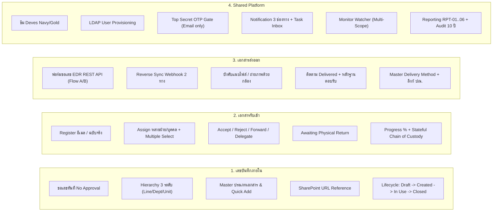

### 3.2 Out of Scope (นอกขอบเขตงาน)

| รายการ | เหตุผลและแผนรองรับ |
|---|---|
| การแก้ไข Flow เลขเอกสารภายนอกเดิม | ระบบเดิมทำงานสมบูรณ์อยู่แล้ว ให้เชื่อมต่อผ่าน Interoperability API |
| การจัดเก็บไฟล์เอกสารบันทึกภายในบน EDR | EDR เก็บเฉพาะ SharePoint URL อ้างอิงเท่านั้น (ไม่ทำหน้าที่เป็น File Server) |
| ระบบคลังเก็บเอกสารกายภาพ (Physical Archive) | ระบบทำหน้าที่ติดตาม Chain of Custody ขณะเดินงาน ไม่ใช่ระบบบริหารคลังแฟ้มถาวร |
| e-Signature / การลงนามดิจิทัลเต็มรูปแบบ | รองรับการอัปโหลดไฟล์/ถ่ายภาพเอกสารที่ลงนามแล้ว ยังไม่มี e-Sign Engine ในเฟสนี้ |
| OCR อ่านข้อความจากรูปภาพอัตโนมัติ | ให้ผู้ใช้กรอกข้อมูลตาม Master และแนบไฟล์จริง |
| การเชื่อมต่อระบบหน่วยงานภายนอกปลายทาง | หน่วยงานภายนอกไม่ใช้ระบบของบริษัท ติดตามผ่านหลักฐานการนำส่งและการตอบรับ |

---

## 4. บทบาทผู้ใช้และสิทธิ์การใช้งาน (Unified Roles & Permissions)

### 4.1 ตารางบทบาทในระบบรวม (Role Catalog)

| รหัส Role | ชื่อบทบาท | ขอบเขตข้อมูล (Data Scope) | หน้าที่และความรับผิดชอบหลัก |
|---|---|---|---|
| **ROLE-01** | **ผู้ลงทะเบียน / ผู้ขอเลข (Registrar / Requester)** | เฉพาะคำขอ/งานที่ตนเกี่ยวข้อง (Own-only) | ขอเลขบันทึกภายใน, Register เอกสารรับเข้า, Assign, ดึงงานกลับ/ยกเลิกคำขอตนเอง, ขอเลขส่งออก, แนบไฟล์, Follow up |
| **ROLE-02** | **เจ้าของงานปลายทาง (Assignee / Action Owner)** | เฉพาะงานที่ตนเกี่ยวข้อง (Assigned-only) | รับงาน (Accept), ปฏิเสธ (Reject), ส่งต่อ (Forward), มอบหมายต่อ (Delegate), ปิดงานสำเร็จ (Success), ขอ OTP เปิดดูไฟล์ลับมาก |
| **ROLE-03** | **หัวหน้าฝ่าย / ผู้กำกับดูแล (Department Head / Supervisor)** | ข้อมูลของทุกคนในฝ่ายที่สังกัด (Department Scope) | Monitor งานทั้งฝ่าย, รับงานในนามฝ่าย, มอบหมายงานต่อให้ลูกน้อง, Follow up งานค้างในฝ่าย, ตั้งค่า Monitor ในฝ่ายตน, ดูรายงานระดับฝ่าย |
| **ROLE-04** | **Viewer สูงสุด / ผู้บริหาร (Executive Viewer)** | ข้อมูลทั้งหมดทุกฝ่ายทั้งองค์กร (All-data Read-only) | ดู Dashboard ภาพรวมทุกฝ่าย, ดูรายงาน RPT-01..06 ทั้งหมด, Export ข้อมูล *(หมายเหตุ: เอกสารลับมากยังคงถูกล็อกไฟล์แนบตาม BR-1.4-B)* |
| **ROLE-05** | **ผู้ดูแลระบบ (Admin)** | ทั้งระบบ (System-wide Admin) | User Provisioning จาก LDAP, จัดการ Master Data ทุกโมดูล (Lines, Departments, Units, DocTypes, Running Formats), Review Quick Add, ตั้งค่า Monitor ข้ามฝ่าย, ดู Audit Log |
| **ROLE-06** | **ผู้ส่งเอกสารออก (Outgoing Sender)** | เฉพาะงานส่งออกที่ตนรับผิดชอบ | ขอเลขส่งออก, แนบไฟล์หลักฐานบังคับ, บันทึกการนำส่ง (Sent), บันทึกการรับปลายทาง (Delivered) พร้อมหลักฐาน |
| **ROLE-07** | **Monitor (ผู้เฝ้าติดตามตาม Scope — Configurable Watcher)** | ข้อมูลตาม Scope ที่กำหนด (ฝ่าย/สายงาน/กลุ่มงาน/บุคคล/ทุกฝ่าย) | **ดูและติดตามเท่านั้น (Read + Follow up):** ดู Dashboard งานค้าง/Overdue ใน Scope, รับแจ้งเตือนติดตาม, กด Follow up — **ไม่มีสิทธิ์ Accept/Reject/Forward/ปิดงาน/แก้ไขข้อมูล** |

### 4.2 ตารางเปรียบเทียบสิทธิ์การใช้งาน (Unified Permission Matrix)

| ฟังก์ชันการทำงาน | ผู้ขอ/ผู้ Register (ROLE-01) | เจ้าของงาน (ROLE-02) | หัวหน้าฝ่าย (ROLE-03) | Monitor (ROLE-07) | Viewer สูงสุด (ROLE-04) | Admin (ROLE-05) |
|---|:---:|:---:|:---:|:---:|:---:|:---:|
| **[โมดูล 1] ขอเลขบันทึกภายใน** | ✅ | ✅ | ✅ | ❌ | ❌ | ✅ |
| **[โมดูล 1] Quick Add ประเภทเอกสาร** | ✅ (ตามสิทธิ์) | ✅ (ตามสิทธิ์) | ✅ | ❌ | ❌ | ✅ |
| **[โมดูล 1] ปิดเลขบันทึกภายใน** | ✅ (คำขอตน) | ❌ | ✅ (ในฝ่าย) | ❌ | ❌ | ✅ |
| **[โมดูล 1] แก้ไข SharePoint URL** | ✅ (Created/In Use) | ❌ | ✅ (ในฝ่าย) | ❌ | ❌ | ✅ |
| **[โมดูล 1] จัดการ Master Hierarchy / Formats** | ❌ | ❌ | ❌ | ❌ | ❌ | ✅ |
| **[โมดูล 2] Register เอกสารรับเข้า** | ✅ | ✅ | ✅ | ❌ | ❌ | ✅ |
| **[โมดูล 2] Assign / Multiple Select** | ✅ (งานตน) | ✅ (ส่งต่อ) | ✅ (ในฝ่าย) | ❌ | ❌ | ✅ |
| **[โมดูล 2] Accept / Reject / Forward** | ❌ | ✅ | ✅ | ❌ | ❌ | ❌ |
| **[โมดูล 2] Onward Delegation (มอบหมายต่อ)** | ❌ | ❌ | ✅ (หลัง Accept) | ❌ | ❌ | ❌ |
| **[โมดูล 2] ดึงงานกลับ (Recall) / ยกเลิก (Cancel)** | ✅ (งานที่ตน Assign) | ❌ | ✅ (ในฝ่าย) | ❌ | ❌ | ✅ |
| **[โมดูล 2] ยืนยันรับเอกสารจริงคืน** | ✅ (ต้นทาง) | ❌ | ✅ (ในฝ่าย) | ❌ | ❌ | ✅ |
| **[โมดูล 3] ขอเลขส่งออก / แนบไฟล์บังคับ** | ✅ | ✅ | ✅ | ❌ | ❌ | ✅ |
| **[โมดูล 3] บันทึก Sent / Delivered + หลักฐาน** | ✅ (ผู้ส่ง) | ❌ | ✅ (ในฝ่าย) | ❌ | ❌ | ✅ |
| **[Shared] ดู Dashboard งานของตนเอง** | ✅ | ✅ | ✅ | ✅ | ✅ | ✅ |
| **[Shared] ดู Dashboard ระดับฝ่าย** | ❌ | ❌ | ✅ | ✅ (ตาม Scope) | ✅ | ✅ |
| **[Shared] ดู Dashboard ภาพรวมทั้งบริษัท** | ❌ | ❌ | ❌ | ✅ (ถ้า Scope=All) | ✅ | ✅ |
| **[Shared] กดปุ่ม Follow up ติดตามงาน** | ✅ (งานที่ตนสร้าง) | ❌ | ✅ (งานในฝ่าย) | ✅ (งานใน Scope) | ❌ | ✅ |
| **[Shared] ยืนยันตัวตนด้วย OTP เปิดไฟล์ลับมาก** | ✅ (ถ้าเป็น Assignee) | ✅ (ถ้าเป็น Assignee) | ❌ (เว้นแต่ถูก Assign) | ❌ (เว้นแต่ถูก Assign) | ❌ (เว้นแต่ถูก Assign) | ❌ |
| **[Shared] User Provisioning จาก LDAP** | ❌ | ❌ | ❌ | ❌ | ❌ | ✅ |
| **[Shared] จัดการ Master Data / Role & Config** | ❌ | ❌ | ❌ | ❌ | ❌ | ✅ |
| **[Shared] ตั้งค่า Monitor Config** | ❌ | ❌ | ✅ (เฉพาะในฝ่าย) | ❌ | ❌ | ✅ (ทั้งองค์กร) |
| **[Shared] Export รายงาน Excel / CSV** | ตามสิทธิ์ | ❌ | ✅ (ระดับฝ่าย) | ✅ (ตาม Scope) | ✅ (ทั้งหมด) | ✅ |

### 4.3 การจัดการผู้ใช้ (User Provisioning จาก LDAP/AD)

ระบบผูกกับ Active Directory (AD) / LDAP ขององค์กรเพื่อตรวจสอบรหัสผ่าน แต่ **ไม่ใช่พนักงานทุกคนใน AD จะเข้าใช้งานระบบได้โดยอัตโนมัติ** — Admin ต้องทำหน้าที่ Provision ผู้ใช้เข้าระบบก่อน

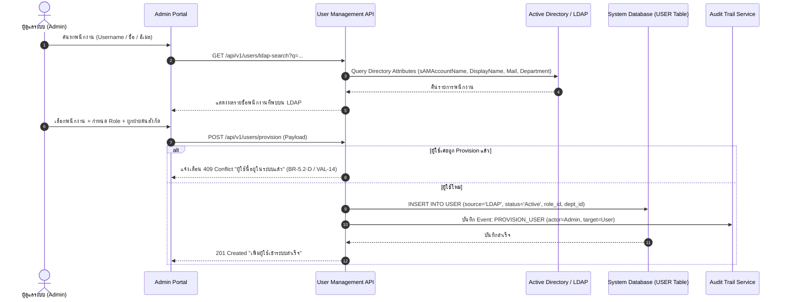

### 4.4 ระดับชั้นความลับและการควบคุมการเข้าถึงไฟล์แนบ (Confidentiality & OTP Matrix)

| ระดับชั้นความลับ | นิยามและตัวอย่างเอกสาร | การมองเห็นไฟล์แนบ (Visibility) | สิทธิ์การเปิดดูพรีวิวและดาวน์โหลด |
|---|---|---|---|
| **ปกติ (Normal)** | หนังสือเวียน, ข่าวสาร, เอกสารทั่วไป | แสดงรายการไฟล์แนบและรูปถ่ายปกติ | เปิดดูและดาวน์โหลดได้ตามสิทธิ์ RBAC ปกติ |
| **ลับ (Confidential)** | สัญญาธุรกิจ, รายงานการเงิน, ข้อมูลส่วนบุคคล | แสดงรายการไฟล์เฉพาะผู้เกี่ยวข้องในสายงาน | เปิดดูและดาวน์โหลดได้เมื่อเข้าสู่ระบบ (Active Session) |
| **ลับมาก (Top Secret)** | ตรวจสอบทุจริต, กลยุทธ์ลับ, คดีความสำคัญสูง | **ซ่อนและล็อกไฟล์ทั้งหมด (Restricted Panel)** แสดงเฉพาะกล่องเตือนความปลอดภัย | **สงวนสิทธิ์เฉพาะ Assignee ใน Story Line เท่านั้น** และ **ต้องยืนยันตัวตนด้วย OTP 6 หลัก (ส่งทางอีเมล)** จึงจะได้ Temporary Token 15 นาที + Dynamic Watermark |

### 4.5 โครงสร้างการตั้งค่า Monitor (Configurable Watcher Specification)

กลไก **Monitor Config** แยกขาดจากการ Assign งาน (BR-5.3) เพื่อให้บุคคลที่ต้องเฝ้าติดตามภาพรวม (เช่น เลขานุการ, ผู้ช่วยผู้บริหาร) มองเห็นงานค้างและกด Follow up ได้โดยไม่ต้องเป็นผู้รับผิดชอบงาน

- **Scope Types ที่รองรับ:**
  1. `department`: ระดับฝ่าย — เลือกได้ **หลายฝ่ายพร้อมกัน (Multi-select)** ใน 1 รายการคอนฟิก
  2. `all_departments`: ครอบคลุม **ทุกฝ่ายทั้งองค์กร (ปัจจุบัน + อนาคต)** ผ่าน Flag `all_departments = true`
  3. `workgroup`: ระดับกลุ่มงาน/สายงาน
  4. `user`: ระดับรายบุคคล
- **สิทธิ์ของ Monitor:** ดู Dashboard, ดู Story Line, รับ Reminder งานค้าง (NT-10..13, 16), กด Follow up (สิทธิ์ Read + Follow up เท่านั้น)

---

## 5. โครงสร้างลำดับชั้นองค์กร & Master Data Model (Hierarchy & Master-Driven Architecture)

### 5.1 โครงสร้าง Hierarchy 3 ระดับ (3-Tier Hierarchy)

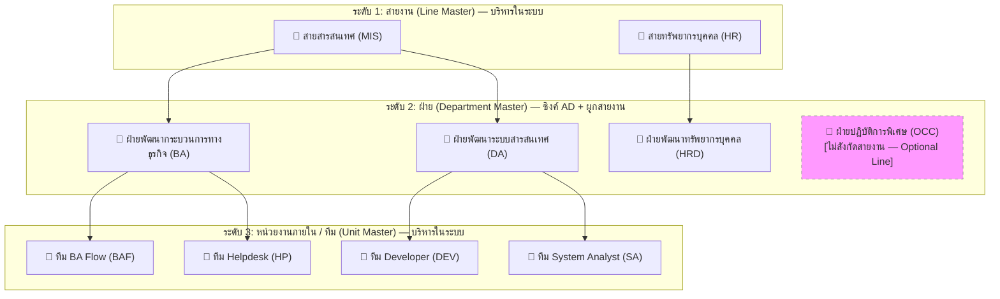

### 5.2 กฎการออกเลขตาม Running Scope

| Running Scope | เงื่อนไขการเลือกในฟอร์ม | รูปแบบ Pattern Template | Counter ระดับ | ตัวอย่างเลขเอกสารที่ได้ |
|---|---|---|---|---|
| **Shared by Line** | เลือกหน่วยงานย่อยเป็น "ไม่ระบุ" | `{LineCode}-{YY}-{Running:000000}` | ระดับสายงาน (LINE) | `MIS-26-000001` |
| **Separate by Dept** | เลือกหน่วยงานย่อยเป็น "ไม่ระบุ" | `{DeptCode}-{YY}-{Running:000000}` | ระดับฝ่าย (DEPT) | `OCC-26-000001` |
| **Unit Running** | เลือกหน่วยงานย่อย (เช่น ทีม BAF) | `{UnitCode}-{YY}-{Running:000000}` | ระดับหน่วยงานย่อย (UNIT) | `BAF-26-000001` |

### 5.3 รูปแบบ Token ที่รองรับใน Pattern เลขเอกสาร

| Token | ความหมายของ Token | ตัวอย่างผลลัพธ์ |
|---|---|---|
| `{LineCode}` | รหัสสายงานจาก Master สายงาน | `MIS`, `HR` |
| `{DeptCode}` | รหัสฝ่ายจาก Master ตัวย่อฝ่าย | `BA`, `DA`, `OCC` |
| `{UnitCode}` | รหัสหน่วยงานภายในจาก Master หน่วยงานย่อย | `BAF`, `DEV`, `SA` |
| `{YY}` | ปี ค.ศ. 2 หลักท้าย | `26` (สำหรับปี 2026) |
| `{YYYY}` | ปี ค.ศ. 4 หลัก | `2026` |
| `{ThaiYear}` | ปี พ.ศ. 4 หลัก | `2569` |
| `{ThaiYear2}` | ปี พ.ศ. 2 หลักท้าย | `69` |
| `{Running:000000}` | ลำดับ Running Number พร้อมเติม 0 ข้างหน้าตามจำนวนหลัก | `000001`, `000042` |

---

## 6. Use Cases ภาพรวมและกระบวนการหลัก End-to-End

### 6.1 End-to-End Use Case Diagram รวมทั้ง 3 โมดูล

```mermaid
flowchart TB
    U([พนักงาน / ผู้ขอ / เจ้าของงาน])
    H([หัวหน้าฝ่าย])
    M([Monitor Watcher])
    A([ผู้ดูแลระบบ Admin])

    subgraph SYSTEM["ระบบรวม P2026-DVS-CORR"]
        subgraph UC_M1["โมดูล 1: เลขบันทึกภายใน"]
            UC1_1[ขอเลขบันทึกภายใน + Confirmation]
            UC1_2[เลือกประเภทเอกสาร / Quick Add]
            UC1_3[ระบุ & ทดสอบ SharePoint URL]
            UC1_4[ปิดเลขเอกสารพร้อมระบุเหตุผล]
        end

        subgraph UC_M2["โมดูล 2: เอกสารรับเข้า"]
            UC2_1[Register เอกสารรับเข้า อีเมล/ฉบับจริง]
            UC2_2[Assign รายฝ่าย/บุคคล Multiple Select]
            UC2_3[Accept รับงาน / Chain of Custody]
            UC2_4[Reject / Forward / Onward Delegate]
            UC2_5[ยืนยันรับเอกสารฉบับจริงคืน]
            UC2_6[ปิดงานสำเร็จ Completed]
        end

        subgraph UC_M3["โมดูล 3: เอกสารส่งออก"]
            UC3_1[ขอเลขส่งออกผ่าน EDR REST API]
            UC3_2[แนบไฟล์หลักฐานบังคับ / ถ่ายภาพกล้อง]
            UC3_3[บันทึกการนำส่ง Sent]
            UC3_4[บันทึก Delivered พร้อมหลักฐานตอบรับ]
        end

        subgraph UC_SHARED["Shared Services & Management"]
            UC4_1[ดู Dashboard 3 ระดับ & Task Inbox]
            UC4_2[กด Follow up ติดตามงานค้าง]
            UC4_3[ขอ OTP ปลดล็อกไฟล์แนบลับมาก]
            UC4_4[จัดการ Master Data & Hierarchy]
            UC4_5[User Provisioning จาก LDAP]
            UC4_6[ตั้งค่า Monitor Config]
            UC4_7[ออกรายงาน RPT-01..06 & Export]
        end
    end

    U --> UC1_1 & UC1_2 & UC1_3 & UC1_4 & UC2_1 & UC2_2 & UC2_3 & UC2_4 & UC3_1 & UC3_2 & UC3_3 & UC3_4 & UC4_1 & UC4_2 & UC4_3
    H --> UC2_2 & UC2_3 & UC2_4 & UC4_1 & UC4_2 & UC4_6 & UC4_7
    M --> UC4_1 & UC4_2
    A --> UC1_4 & UC4_4 & UC4_5 & UC4_6 & UC4_7
```

### 6.2 Flow 1: การขอสร้างเลขเอกสารบันทึกภายใน (Instant Generation)

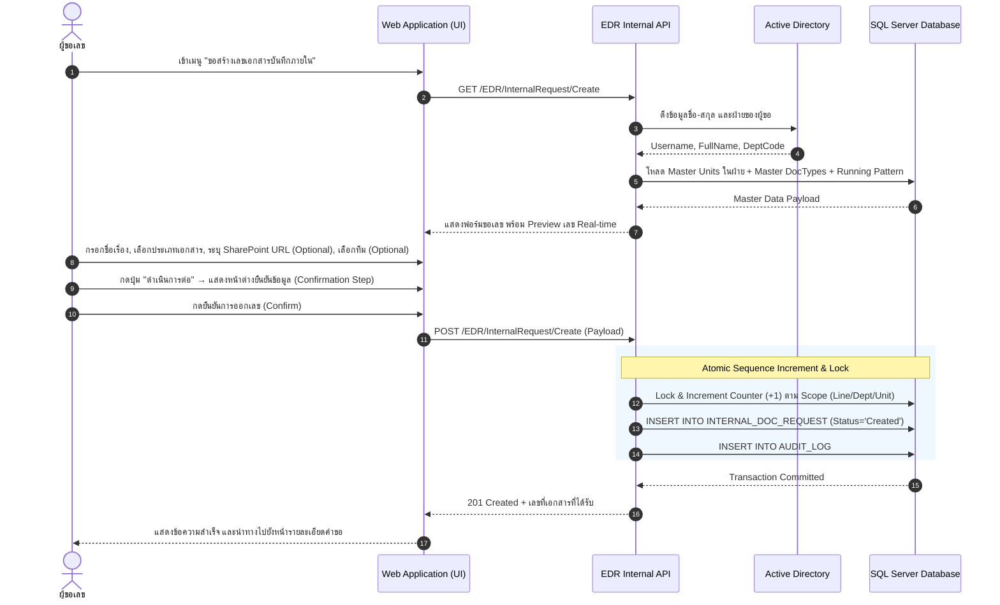

### 6.3 Flow 2: การจัดการเอกสารรับเข้าและการถือครองตัวจริง (Incoming & Chain of Custody)

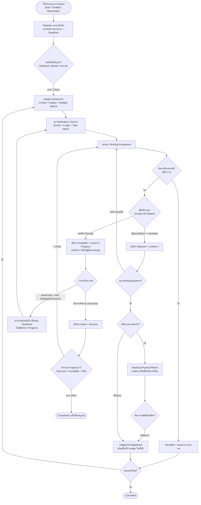

### 6.4 Flow 3: การขอเลขและติดตามเอกสารส่งออก (Outgoing Lifecycle & EDR Sync)

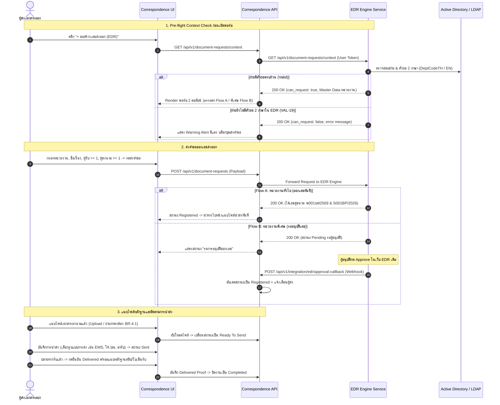

### 6.5 Flow 4: การยืนยันตัวตนด้วย OTP เข้าถึงไฟล์แนบเอกสาร "ลับมาก" (Top Secret OTP Gate)

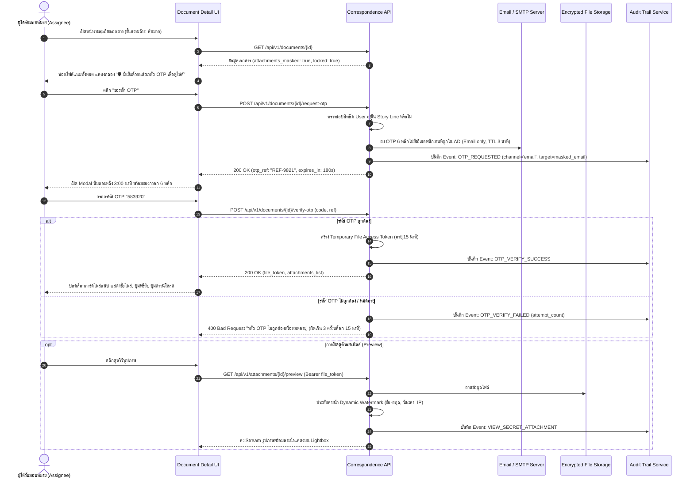

---

## 7. สถานะเอกสารและการคำนวณ Progress (State Machines & Progress Logic)

### 7.1 State Machine: เลขเอกสารบันทึกภายใน

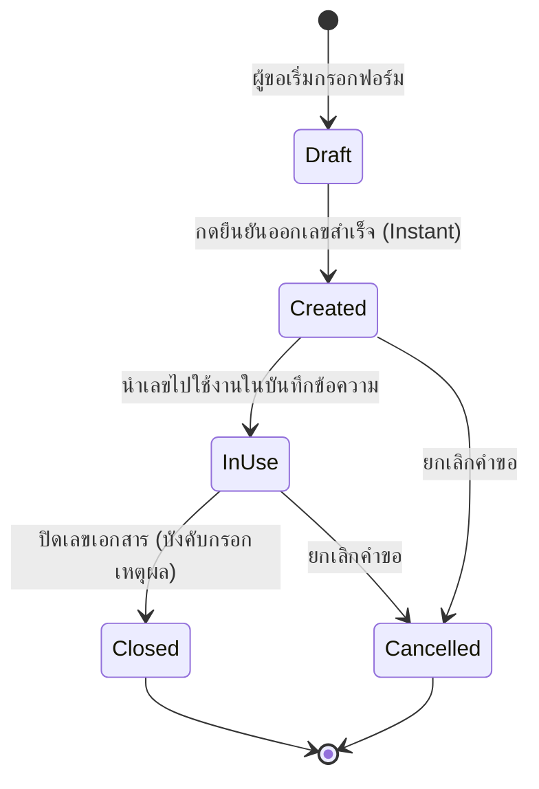

### 7.2 State Machine: เอกสารรับเข้าหลัก (Main Document)

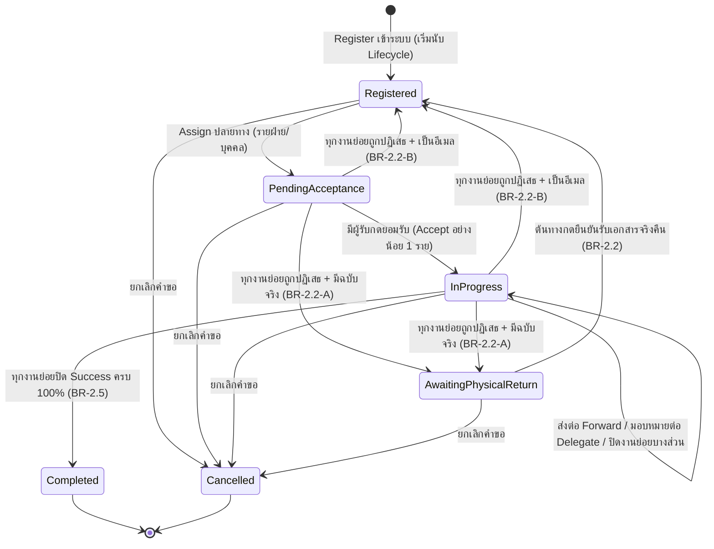

### 7.3 State Machine: งานย่อยรายผู้รับ (Sub-assignment / Delegation)

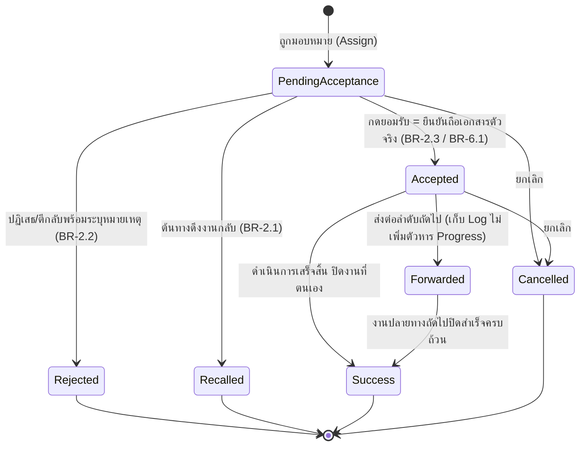

### 7.4 State Machine: เอกสารส่งออก

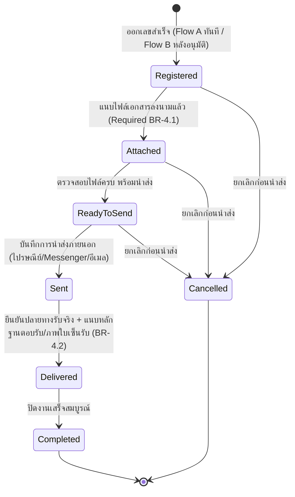

### 7.5 State Machine: Deadline Flag (สถานะคู่ขนานควบคุมการแจ้งเตือน)

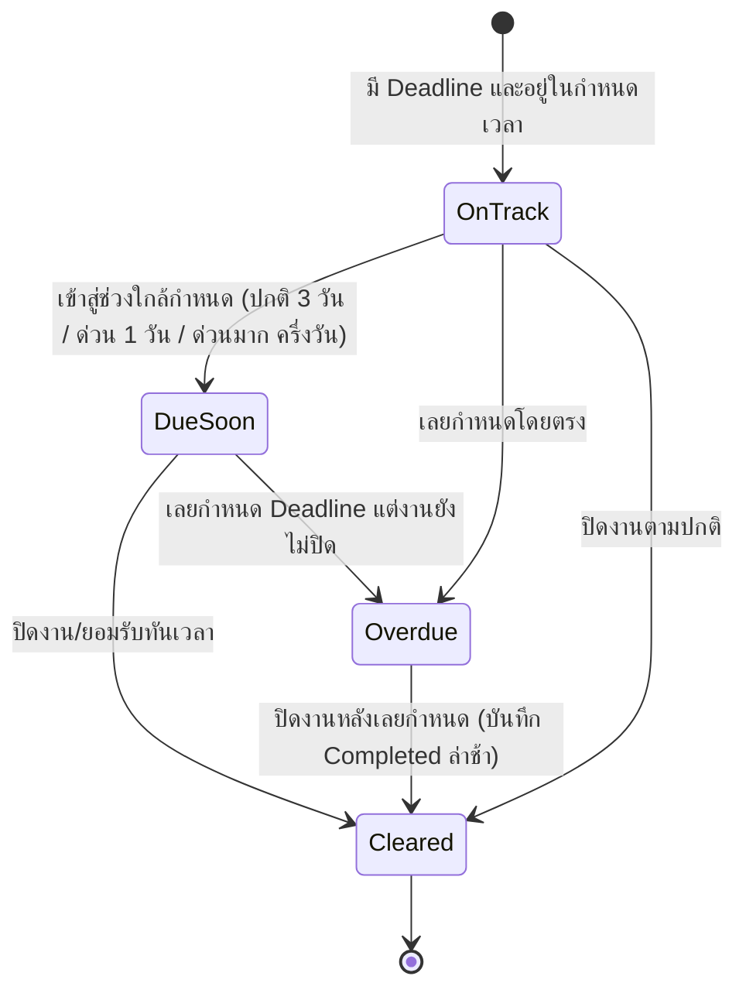

### 7.6 สูตรการคำนวณ Progress % และ Nested Delegation SubTree

$$\text{Progress \%} = \frac{\text{จำนวนงานย่อยสถานะ Success}}{\text{จำนวนงานย่อยทั้งหมดที่นับได้ (Countable Sub-assignments)}} \times 100$$

- **เงื่อนไข:**
  1. ตัดงานย่อยสถานะ `Cancelled` ออกจากตัวหารทั้งหมด
  2. การส่งต่อ (Forward) หรือ มอบหมายต่อ (Onward Delegation) จะแสดงเป็นโครงสร้างต้นไม้ซ้อนชั้น (**Nested Delegation SubTree**) ภายใต้สายงานเดิม โดยไม่เพิ่มตัวหาร Progress

---

## 8. Notification Engine & Message Catalog (การแจ้งเตือนและการติดตาม)

### 8.1 ช่องทางการแจ้งเตือน 3 ช่องทาง (BR-6.2)

1. **Email Notification:** ส่งอีเมลแจ้งเตือนผ่าน SMTP Relay (เนื้อหาเต็ม + ลิงก์ลึก Deep Link)
2. **In-app Notification:** แถบกระดิ่งแจ้งเตือนบนมุมขวาบนของระบบ (ข้อความบรรทัดเดียว สรุปประเด็น)
3. **Task Inbox (กล่องงานส่วนตัว):** รวมเฉพาะรายการงานที่ต้อง **ลงมือทำต่อ (Actionable)** แบ่งเป็น 5 กลุ่ม:
   - 🟡 **รอรับ (Pending Acceptance):** งานที่ถูก Assign รอการกด Accept/Reject
   - 🔵 **กำลังดำเนินการ (In Progress):** งานที่ Accept แล้ว อยู่ระหว่างดำเนินการ
   - 🟣 **รอส่งต่อ / รอปิดงาน (Accepted):** งานที่พร้อมส่งต่อหรือปิดงาน
   - 🟠 **รอรับเอกสารจริงคืน (Awaiting Physical Return):** งานที่ถูกปฏิเสธ รอต้นทางรับตัวจริงคืน
   - 📤 **เอกสารส่งออก (Outgoing Queue):** รอนำส่ง / รออัปเดต Delivered

### 8.2 เกณฑ์เวลาแจ้งเตือนและรอบการเตือนซ้ำ (Repeat Interval ต่อความเร่งด่วน)

| ระดับความเร่งด่วน | แจ้งเตือนล่วงหน้า (Due Soon) | แจ้งเตือนค้างรับ (Pending) | รอบการเตือนซ้ำ (Repeat Interval — Configurable) |
|---|---|---|---|
| **ปกติ (Normal)** | 3 วันทำการก่อน Deadline | ค้างเกิน 2 วันทำการ | **ทุก 5 วัน** — เตือนซ้ำจนกว่าเอกสารจะแล้วเสร็จ (Completed) |
| **ด่วน (Urgent)** | 1 วันทำการก่อน Deadline | ค้างเกิน 1 วันทำการ | **ทุก 3 วัน** — เตือนซ้ำจนกว่าเอกสารจะแล้วเสร็จ (Completed) |
| **ด่วนมาก (Very Urgent)** | ครึ่งวันทำการ + แจ้งทันทีตอน Assign | ค้างเกินครึ่งวันทำการ | **ทุก 1 วัน (ทุกวัน)** — เตือนซ้ำจนกว่าเอกสารจะแล้วเสร็จ (Completed) |

*หมายเหตุ: การส่ง Reminder ยึดเวลาทำการ ส่ง ณ เวลา 08:30 น. ของวันทำการ (BR-3.2 / BR-3.3)*

### 8.3 Channel & Recipient Matrix (Message Catalog NT-01 ถึง NT-17)

| รหัส | เหตุการณ์ / Trigger | Email | In-app | Task Inbox กลุ่ม | ผู้รับหลัก | ผู้รับเพิ่ม (กรณี Assign เป็นฝ่าย) | ผู้รับ Monitor (BR-3.4-A) |
|---|---|:---:|:---:|---|---|---|---|
| **NT-01** | มอบหมายงานใหม่ (Assign) | ✅ | ✅ | 🟡 รอรับ | ผู้ถูก Assign | + หัวหน้าฝ่าย | — |
| **NT-02** | รับงาน (Accept) | ✅ | ✅ | — (แจ้งผล) | ต้นทาง (ผู้ Register/Forward) | — | — |
| **NT-03** | ปฏิเสธ/ตีกลับ (Reject) | ✅ | ✅ | 🟠 (ถ้าครบทุก sub เข้าต้นทาง) | ต้นทาง (ผู้ Register/Forward) | + หัวหน้าฝ่าย | — |
| **NT-04** | ส่งต่อ (Forward) | ✅ | ✅ | 🟡 รอรับ | ผู้รับลำดับถัดไป | + หัวหน้าฝ่าย | — |
| **NT-05** | ดึงงานกลับ (Recall) | ✅ | ✅ | — (ลบออกจากกล่อง) | ผู้ถูกดึงงาน | — | — |
| **NT-06** | ยกเลิกเอกสาร (Cancel) | ✅ | ✅ | — (ลบออกจากกล่อง) | ผู้รับที่ยัง Active | + หัวหน้าฝ่าย | — |
| **NT-07** | รอรับเอกสารจริงคืน (Awaiting Return) | ✅ | ✅ | 🟠 รอรับเอกสารจริงคืน | ต้นทาง / ผู้ Register | + หัวหน้าฝ่าย | — |
| **NT-08** | ยืนยันรับเอกสารจริงคืนแล้ว | ✅ | ✅ | — (แจ้งผล) | ผู้เกี่ยวข้อง / หัวหน้าฝ่าย | — | — |
| **NT-09** | ปิดงานสำเร็จ (Completed 100%) | ✅ | ✅ | — (แจ้งผล) | ผู้ Register | + หัวหน้าฝ่าย | — |
| **NT-10** | ใกล้ถึงกำหนด (Due Soon) | ✅ | ✅ | (คงกลุ่มเดิม + badge Due Soon) | ผู้รับผิดชอบงานล่าสุด | + หัวหน้าฝ่าย | + Monitor ใน Scope |
| **NT-11** | เกินกำหนด (Overdue) | ✅ | ✅ | (คงกลุ่มเดิม + badge Overdue) | ผู้รับผิดชอบงานล่าสุด | + หัวหน้าฝ่าย | + Monitor ใน Scope |
| **NT-12** | ค้างรับเกินกำหนด (Pending Reminder) | ✅ | ✅ | 🟡 รอรับ | ผู้ถูก Assign | + หัวหน้าฝ่าย | + Monitor ใน Scope |
| **NT-13** | ติดตามงาน (Follow up — กดเอง) | ✅ | ✅ | (คงกลุ่มเดิม + badge ถูกตาม) | ผู้รับผิดชอบงานล่าสุด | + หัวหน้าฝ่าย | + Monitor ใน Scope |
| **NT-14** | เอกสารส่งออกนำส่งแล้ว (Sent) | ✅ | ✅ | 📤 รออัปเดต Delivered | ผู้ส่งเอกสารออก | + หัวหน้าฝ่าย | — |
| **NT-15** | ปลายทางรับแล้ว (Delivered) | ✅ | ✅ | — (แจ้งผล) | ผู้ส่งเอกสารออก | — | — |
| **NT-16** | เอกสารส่งออกใกล้/เกินกำหนดนำส่ง | ✅ | ✅ | 📤 รอนำส่ง | ผู้ส่งเอกสารออก | + หัวหน้าฝ่าย | + Monitor ใน Scope |
| **NT-17** | บัญชีถูกเพิ่มเข้าระบบ (Provisioned) | ✅ | ✅ | — | ผู้ใช้ที่ถูกเพิ่ม | — | — |

---

## 9. ข้อกำหนดรายหน้าจอและ Dashboard (Screen Specifications & UI Design System)

### 9.1 มาตรฐานการออกแบบและธีม Deves (Deves Theme Specification)

- **Primary Color:** สีกรมท่า Deves Navy `#012169` (Dark `#001a52`) — หัวตาราง, ปุ่มหลัก, Sidebar
- **Secondary Color:** สีเหลืองทอง Deves Gold `#FFCD00` (Dark `#e6b800`) — กล่องโลโก้ DVS, เมนู Active, Viewfinder กล้อง
- **Background & Card:** พื้นหลังหน้าจอ `#F8F9FA`, พื้นหลังการ์ด `#FFFFFF`, เส้นกรอบ `#DEE2E6`
- **Typography:** ฟอนต์มาตรฐานองค์กร Sarabun / Prompt / Inter

### 9.2 โครงสร้าง Dashboard 3 ระดับ (Real-time Dashboard Hierarchy)

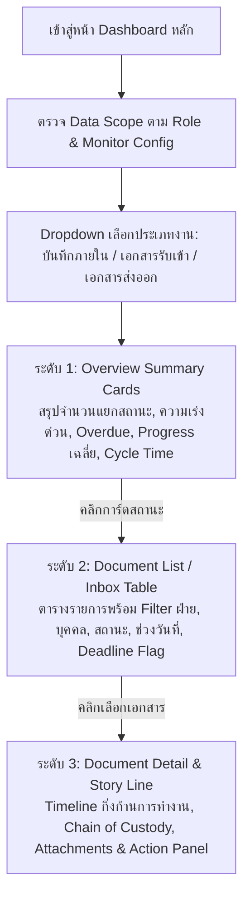

### 9.3 ข้อกำหนดรายหน้าจอ: ระบบขอเลขบันทึกภายใน (EDR Internal Memo & Master Hierarchy — โมดูล 1)

โมดูลนี้ดำเนินการบนระบบ **EDR เดิม** โดยได้รับการปรับปรุง Change Request (CR) เพื่อเพิ่มฟังก์ชันขอเลขบันทึกภายในแบบ Instant Generation (No Approval) และการบริหารจัดการลำดับชั้นองค์กร 3 ระดับ (สายงาน $\rightarrow$ ฝ่าย $\rightarrow$ หน่วยงาน)

#### 9.3.1 หน้าจอเข้าสู่ระบบ (Login Screen)
- **URL:** `/EDR/Account/Login`
- **ภาพประกอบ:**
  
- **องค์ประกอบหน้าจอ:**
  1. ช่องกรอกชื่อผู้ใช้ (Username) และรหัสผ่าน (Password) ผูกกับระบบ Active Directory (AD)
  2. ปุ่ม `เข้าสู่ระบบ (Sign In)` พร้อมระบบ Session Management และ Remember Me
  3. ตรวจสอบสิทธิ์ผู้ใช้และนำทางไปยัง Dashboard หรือเมนูตามสิทธิ์ (Admin / User)

#### 9.3.2 หน้าจอแดชบอร์ดหลักระบบ EDR (Main Dashboard)
- **URL:** `/EDR/Dashboard`
- **ภาพประกอบ:**
  
- **องค์ประกอบหน้าจอ:**
  1. การ์ดสรุปจำนวนคำขอเลขเอกสารแยกตามสถานะ (รออนุมัติ, ออกเลขแล้ว, ยกเลิก)
  2. กราฟแสดงสถิติการออกเลขเอกสารรายเดือนและรายประเภท
  3. ตารางแสดงรายการคำขอล่าสุดของผู้ใช้ พร้อมลิงก์ไปยังรายละเอียด

#### 9.3.3 หน้ารายการขอสร้างเลขเอกสารบันทึกภายใน (Internal Request List Table)
- **URL:** `/EDR/InternalRequest`
- **ภาพประกอบ:**
  
- **องค์ประกอบหน้าจอ:**
  1. ปุ่ม `+ สร้างคำขอเลขเอกสารภายใน` (นำทางไปหน้า Create Form)
  2. ตัวกรองค้นหา (Search Filters): เลขที่เอกสาร, ชื่อเรื่อง, วันที่ขอ, ประเภทเอกสาร, สถานะ
  3. ตารางข้อมูล: เลขที่เอกสาร, วันที่ออกเลข, ชื่อเรื่อง, ประเภทเอกสาร, ผู้ขอ, ฝ่าย/หน่วยงาน, SharePoint URL, สถานะ
  4. ปุ่ม Action รายบรรทัด: ปุ่มดูรายละเอียด (`Detail`), ปุ่มปิดเลข (`Close`) และปุ่มพิมพ์สลิป/คัดลอกเลข

#### 9.3.4 หน้าฟอร์มขอสร้างเลขเอกสารบันทึกภายใน (Create Internal Request Form)
- **URL:** `/EDR/InternalRequest/Create`
- **ภาพประกอบ (ฟอร์มเริ่มต้น):**
  
- **องค์ประกอบฟอร์ม:**
  1. **สายงาน (Line) & ฝ่าย (Department):** แสดงอัตโนมัติตามสังกัดของผู้ขอ (Read-only)
  2. **หน่วยงานย่อย (Unit/Team):** Searchable Dropdown ดึงรายการ Unit ภายใต้ฝ่ายของผู้ขอ (Default เป็น "ไม่ระบุ")
  3. **ประเภทเอกสาร (Document Type):** Searchable Dropdown (Mandatory) พร้อมปุ่ม Quick Add
  4. **ชื่อเรื่อง (Subject):** กล่องข้อความ (Mandatory, ความยาว $\ge 5$ และ $\le 500$ ตัวอักษร)
  5. **SharePoint URL:** กล่องข้อความสำหรับวางลิงก์เอกสารฉบับจริง (Optional, บังคับขึ้นต้นด้วย `https://`) พร้อมปุ่ม "ทดสอบเปิดลิงก์"
  6. **กล่อง Real-time Preview เลขที่จะได้รับ:** แสดงเลขที่ระบบจะออกให้ทันทีแบบเรียลไทม์ เช่น `BAF-26-000001` หรือ `MIS-26-000015`

#### 9.3.5 Dropdown ค้นหาประเภทเอกสาร & ตัวอย่างการกรอกข้อมูล
- **ภาพประกอบ (Dropdown Searchable & ฟอร์มที่กรอกสมบูรณ์):**
  
  
- **พฤติกรรมของระบบ:**
  1. เมื่อพิมพ์ค้นหาในกล่องประเภทเอกสาร ระบบจะกรองรายการที่ตรงกับคำค้นทันที
  2. หากไม่พบประเภทเอกสารที่ต้องการ ผู้ขอสามารถคลิกปุ่ม `+ เพิ่มประเภทเอกสาร` เพื่อเปิด Quick Add Modal ได้ทันทีโดยไม่ต้องสลับหน้าจอ

#### 9.3.6 Quick Add Modal: การเพิ่มประเภทเอกสารแบบเร่งด่วน
- **ภาพประกอบ:**
  
- **พฤติกรรมของระบบ:**
  1. ให้ผู้ขอกรอกชื่อประเภทเอกสารภาษาไทย (Mandatory) และชื่อภาษาอังกฤษ (Optional)
  2. ระบบจะตรวจสอบความซ้ำซ้อน: หากซ้ำแบบ Exact Match จะแจ้งเตือนและแนะนำให้ใช้รายการเดิม; หากมีความคล้ายคลึง $\ge 0.80$ จะแสดง Soft Warning
  3. เมื่อบันทึกสำเร็จ ระบบจะเพิ่มรายการประเภทเอกสารใหม่โดยมีสถานะ `Source = QUICKADD` และเลือกรายการนั้นในฟอร์มทันที

#### 9.3.7 หน้ารายละเอียดคำขอเลขที่เอกสารภายใน (Internal Request Detail View)
- **URL:** `/EDR/InternalRequest/Detail/{id}`
- **ภาพประกอบ:**
  
- **องค์ประกอบหน้าจอ:**
  1. ข้อมูลเลขที่เอกสารที่ได้รับ (ขนาดใหญ่เด่นชัด) พร้อมปุ่ม `Copy Document No.`
  2. ข้อมูลผู้ขอ, ฝ่าย, หน่วยงาน, วันเวลาที่ออกเลข (Timestamp)
  3. ชื่อเรื่อง, ประเภทเอกสาร, และปุ่มเปิดลิงก์ SharePoint Document
  4. ส่วนประวัติและการปิดเลข: ปุ่ม `ปิดเลขเอกสาร (Close Document)`

#### 9.3.8 Modal ปิดเลขเอกสารบันทึกภายใน (Close Document Modal)
- **ภาพประกอบ:**
  
- **พฤติกรรมของระบบ:**
  1. บังคับกรอก **เหตุผลในการปิดเลข (Close Reason)** เช่น เอกสารยกเลิกการส่ง, ออกเลขซ้ำ, มีการแก้ไขเนื้อหาใหม่
  2. เมื่อกดยืนยัน ระบบจะเปลี่ยนสถานะเป็น `Closed` และบันทึกประวัติผู้ปิดและเวลาที่ปิดลงใน Audit Trail ทันที (RL-CORE-06)

#### 9.3.9 หน้าจอค้นหาเอกสารและออกรายงาน (Search & Report Screens)
- **ภาพประกอบ:**
  
  
- **องค์ประกอบหน้าจอ:**
  1. ค้นหาขั้นสูง (Advanced Search): รองรับการค้นหาข้ามสายงาน, ฝ่าย, ช่วงวันที่, คำในชื่อเรื่อง และประเภทเอกสาร
  2. หน้าจอ Report: สามารถออกรายงานสรุปปริมาณการใช้เลขตามฝ่าย และ Export ผลลัพธ์เป็นไฟล์ Excel (.xlsx)

#### 9.3.10 การจัดการ Master สถาปัตยกรรมองค์กร (Lines, Units, Departments, Codes)
- **ภาพประกอบการจัดการ Master Data สถาปัตยกรรมองค์กร:**
  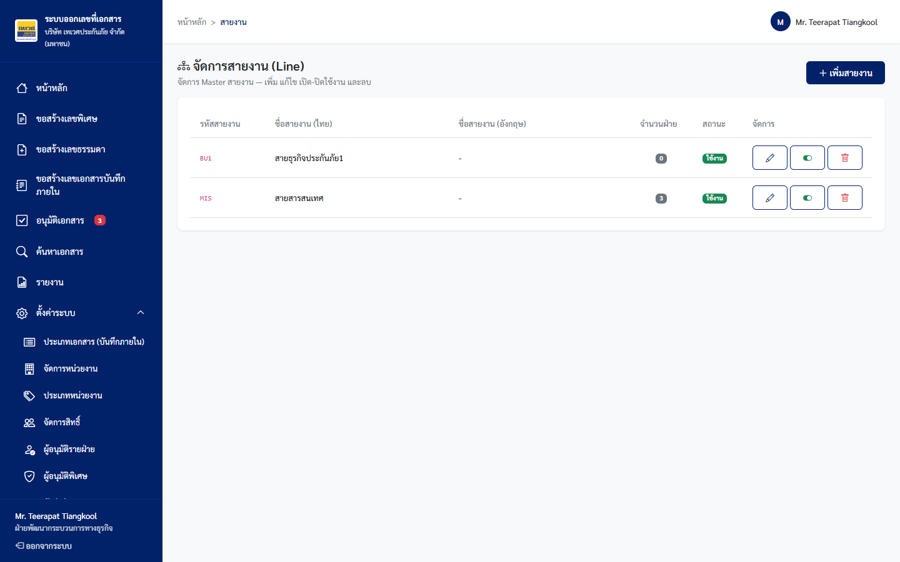
  
  
  
  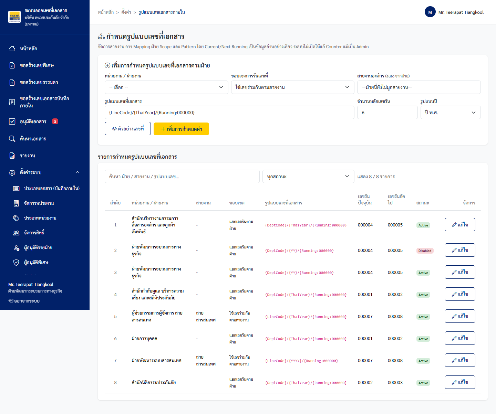
  
  
  
- **สรุปองค์ประกอบ Master Management:**
  1. **Lines (สายงาน):** บริหารจัดการสายงานหลัก (เช่น MIS, ACC, HR) พร้อมกำหนด Running Scope
  2. **Units (หน่วยงานภายใน):** บริหารจัดการทีมย่อยภายใต้ฝ่าย พร้อมตัวย่อประจำหน่วยงาน
  3. **Departments (ฝ่าย):** ผูกฝ่ายเข้ากับสายงานหลัก และระบุตัวย่อ 2 ภาษา (ไทย/อังกฤษ)
  4. **Department Codes & Formats:** กำหนด Pattern รูปแบบเลขเอกสาร เช่น `{UnitCode}-{Year2}-{Seq6}` หรือ `{LineCode}-{Year2}-{Seq6}` พร้อมตัวทดสอบ Preview

---

### 9.4 ข้อกำหนดรายหน้าจอ: ระบบสารบรรณและติดตามเอกสารรับเข้า-ส่งออก (Correspondence Tracking System — โมดูล 2 & 3)

โมดูลนี้พัฒนาด้วยเทคโนโลยี **.NET 8 Web API + React SPA (Vite/Tailwind)** ภายใต้ธีม Deves สีสีกรมท่า `#012169` และสีทอง `#FFCD00` รองรับการติดตามวงจรชีวิตเอกสารแบบ End-to-End

#### 9.4.1 หน้าจอเข้าสู่ระบบและการเลือกบัญชีทดสอบ (Login Screen & Demo Accounts)
- **URL:** `/` (หรือ `/login`)
- **ภาพประกอบ:**
  
- **องค์ประกอบหน้าจอ:**
  1. กล่องโลโก้บริษัท เทเวศประกันภัย จำกัด (มหาชน) พร้อมชื่อระบบ **e-Document Tracking System**
  2. แท็บเลือก Demo Accounts (ฝ่ายบริหาร / สารบรรณ / สายงานปฏิบัติการ) อำนวยความสะดวกในการทดสอบ SIT/UAT
  3. ฟอร์มเข้าสู่ระบบด้วยรหัสพนักงาน/Username และ Password ตรวจสอบกับ Active Directory (LDAP)

#### 9.4.2 หน้าจอแดชบอร์ดภาพรวมสารบรรณ (Executive Dashboard & Real-time Metrics)
- **URL:** `/` (หรือ `/dashboard`)
- **ภาพประกอบ:**
  
- **องค์ประกอบหน้าจอ:**
  1. **สวิตช์เลือกทิศทางเอกสาร (Direction Filter):** ทั้งหมด / เอกสารรับเข้า (Incoming) / เอกสารส่งออก (Outgoing)
  2. **Stat Cards 7 กลุ่มสถานะ:**
     - 🟡 *รอรับงาน (Pending Acceptance)*
     - 🔵 *กำลังดำเนินการ (In Progress)*
     - 🟣 *รอรับเอกสารจริงคืน (Awaiting Physical Return)*
     - 🟡 *พร้อมส่ง / ส่งแล้ว (Sent Queue)*
     - 🟢 *นำส่งแล้ว (Delivered)*
     - 🟢 *เสร็จสิ้นสมบูรณ์ (Completed)*
     - 🔴 *เกินกำหนด (Overdue)* & 🟠 *ใกล้ถึงกำหนด (Due Soon)*
  3. **กราฟิกแสดงผล (Recharts Visualizations):**
     - กราฟวงกลม (Donut Chart) แสดงสัดส่วนสถานะเอกสารในระบบ
     - กราฟแท่งเปรียบเทียบปริมาณเอกสารรับเข้า vs เอกสารส่งออกรายเดือน

#### 9.4.3 หน้ารายการเอกสารรับเข้า (Incoming Documents List Table)
- **URL:** `/document-list/incoming`
- **ภาพประกอบ:**
  
- **องค์ประกอบหน้าจอ:**
  1. ช่องค้นหาอัจฉริยะ (Smart Search): ค้นหาตามเลขที่เอกสาร, ชื่อเรื่อง, หน่วยงานต้นทาง, ผู้รับ
  2. ตัวกรองความเร่งด่วน (Urgency: ปกติ, ด่วน, ด่วนมาก), ชั้นความลับ (ปกติ, ลับ, ลับมาก) และ Deadline Flag
  3. ตารางรายการเอกสาร: แสดงเลขรับ, วันที่รับ, ชื่อเรื่อง, ช่องทาง (อีเมล/ฉบับจริง), ผู้รับมอบหมาย, ความคืบหน้า (Progress Bar %), และป้ายกำกับสถานะ
  4. ลิงก์คลิกเพื่อเข้าสู่หน้าจอรายละเอียดเอกสาร (Document Detail)

#### 9.4.4 หน้ารายการเอกสารส่งออก (Outgoing Documents List Table)
- **URL:** `/document-list/outgoing`
- **ภาพประกอบ:**
  
- **องค์ประกอบหน้าจอ:**
  1. แสดงเลขคู่ขนาน 2 ภาษา (Dual Key): เลขไทย (เช่น `พ 0129/2569` หรือ `ทด 0842/2569`) และเลขอังกฤษ (`SP 0129/2026` หรือ `DVS 0842/2026`)
  2. แสดงหน่วยงานภายนอกปลายทาง, รูปแบบการนำส่ง (เช่น EMS, ไปรษณีย์ลงทะเบียน, ให้ ปณ. มารับ), หมายเลข Tracking Number
  3. สถานะการนำส่ง: Registered $\rightarrow$ Attached $\rightarrow$ Ready to Send $\rightarrow$ Sent $\rightarrow$ Delivered $\rightarrow$ Completed

#### 9.4.5 หน้าจอลงทะเบียนเอกสารรับเข้า (Register Incoming Document Form)
- **URL:** `/register` (แท็บเอกสารรับเข้า)
- **ภาพประกอบ:**
  
- **องค์ประกอบหน้าจอ:**
  1. **ประเภทเอกสาร/ช่องทาง (Channel):** เลือก `อีเมล (Email)` หรือ `ฉบับจริง (Physical)`
  2. **ระดับความเร่งด่วน & ชั้นความลับ:** Dropdown เลือก ปกติ / ด่วน / ด่วนมาก และ ปกติ / ลับ / ลับมาก
  3. **ข้อมูลหนังสือ:** หน่วยงานภายนอกต้นทาง, เลขที่หนังสือต้นทาง, ชื่อเรื่อง, รายละเอียด
  4. **การมอบหมายปลายทาง (Multi-Assignment):** เลือกมอบหมายรายฝ่าย (ส่งหาหัวหน้าฝ่ายตาม BR-2.4-A) หรือมอบหมายรายบุคคล (เลือกได้หลายฝ่าย/หลายคนพร้อมกัน)
  5. **กำหนดวันเสร็จสิ้น (Deadline):** ปฏิทินเลือกวัน พร้อมคำนวณการแจ้งเตือน Due Soon อัตโนมัติ
  6. **แนบไฟล์หลักฐานเริ่มต้น:** รองรับ Direct Upload และการถ่ายภาพผ่านกล้อง WebRTC

#### 9.4.6 หน้าจอสร้างคำขอออกเลขเอกสารส่งออก (Register Outgoing Flow A / Flow B)
- **URL:** `/register` (แท็บเอกสารส่งออก)
- **ภาพประกอบ:**
  
- **องค์ประกอบหน้าจอ:**
  1. **สลับโหมดคำขอ:** Tab `ขอเลขธรรมดา (Flow A — ออกเลขทันที)` / `ขอเลขพิเศษ (Flow B — รอสายอนุมัติ)`
  2. **Pre-flight Context Check Alert:** แสดงตัวย่อฝ่ายและสิทธิ์ของผู้ขอแบบเรียลไทม์
  3. **ข้อมูลการส่งออก:** หน่วยงานภายนอกผู้รับ, รายละเอียดเรื่อง, ผู้ลงนาม, รูปแบบการจัดส่ง (Delivery Method) พร้อมปุ่มลิงก์ภายนอกสำหรับลงทะเบียน ปณ. มารับ

#### 9.4.7 หน้ารายละเอียดเอกสาร — แท็บเส้นทางเอกสาร (Document Detail: Story Line & Nested SubTree)
- **URL:** `/document-detail/{id}` (แท็บ Timeline / Story Line)
- **ภาพประกอบ:**
  
- **องค์ประกอบหน้าจอ:**
  1. **Header Block:** เลขที่เอกสาร, สถานะ, Deadline Flag Badge, ระดับความเร่งด่วน, ระดับชั้นความลับ, Progress Bar รวม %
  2. **Action Bar:** ปุ่ม `ยอมรับงาน (Accept)`, ปุ่ม `ปฏิเสธ/ตีกลับ (Reject)`, ปุ่ม `มอบหมายต่อ (Delegate)`, ปุ่ม `ส่งต่อข้ามฝ่าย (Forward)`, ปุ่ม `เสร็จสิ้น (Complete)`
  3. **Timeline กิ่งก้าน (Nested Delegation SubTree):** แสดงลำดับชั้นการมอบหมายทอดต่อทอด (หัวหน้าฝ่าย $\rightarrow$ เจ้าหน้าที่ A $\rightarrow$ เจ้าหน้าที่ B) พร้อม Timestamp และบันทึกข้อความ

#### 9.4.8 หน้ารายละเอียดเอกสาร — แท็บการถือครองตัวจริง (Document Detail: Stateful Chain of Custody)
- **URL:** `/document-detail/{id}` (แท็บการถือครองตัวจริง)
- **ภาพประกอบ:**
  
- **องค์ประกอบหน้าจอ:**
  1. สำหรับเอกสารประเภท `ฉบับจริง (Physical)` เท่านั้น
  2. แสดงกล่อง **"ผู้ถือครองเอกสารฉบับจริงปัจจุบัน (Current Holder)"** ระบุชื่อ-สกุล, ตำแหน่ง, ฝ่าย, และเวลาที่รับถือครอง
  3. ตารางประวัติการเปลี่ยนมือ (Custody Movement Log): บันทึกทุกจังหวะที่มีการส่งมอบและรับเอกสารตัวจริง

#### 9.4.9 การ์ดไฟล์แนบและการอัปโหลดไฟล์ (Attachments Card & Drag-and-Drop Dropzone)
- **URL:** `/document-detail/{id}` (ส่วนล่างของการ์ดเอกสาร)
- **ภาพประกอบ:**
  
- **องค์ประกอบหน้าจอ:**
  1. รายการไฟล์แนบทั้งหมด พร้อมขนาดไฟล์, วันที่อัปโหลด, และประเภทไฟล์ (PDF, Word, Excel, Image, ZIP)
  2. ปุ่ม `แนบไฟล์เพิ่ม (Direct Upload)` และพื้นที่ Drag-and-Drop รองรับไฟล์สูงสุด 25 MB
  3. ปุ่ม `ถ่ายภาพแนบเพิ่ม (Camera Capture)` เปิดกล้องถ่ายภาพทันที
  4. ปุ่มพรีวิวดูตัวอย่างไฟล์ (Lightbox Preview) และปุ่มดาวน์โหลดไฟล์

#### 9.4.10 Modal ถ่ายภาพด้วยกล้องอุปกรณ์ (WebRTC Camera Capture Modal)
- **ภาพประกอบ:**
  
- **องค์ประกอบ Modal:**
  1. กรอบ Viewfinder สีทอง Deves Gold `#FFCD00` แสดงภาพสดจากกล้อง (Live Video Stream)
  2. ปุ่ม `กลับภาพซ้าย-ขวา (Flip/Mirror)`: แก้ไขปัญหากล้องหน้ากลับด้านสำหรับตัวหนังสือในเอกสาร
  3. ปุ่ม `หมุนภาพ 90° (Rotate)`: หมุนแนวตั้ง/แนวนอนได้ตามความเหมาะสม
  4. ปุ่ม `ถ่ายภาพ (Capture)` $\rightarrow$ แสดงภาพตัวอย่าง (Snapshot Review) $\rightarrow$ กดยืนยันเพื่อบันทึกไฟล์แนบเข้าสู่ระบบ

#### 9.4.11 Modal ยืนยันตัวตนด้วยรหัส OTP สำหรับเอกสารลับมาก (Top Secret OTP Gate Modal)
- **ภาพประกอบ:**
  
- **พฤติกรรมความปลอดภัย:**
  1. สำหรับเอกสารที่ระบุชั้นความลับเป็น **"ลับมาก (Top Secret)"** ไฟล์แนบทั้งหมดจะถูกล็อกไว้
  2. แสดงกล่องคำเตือน `🛡️ เอกสารลับมาก: ยืนยันตัวตนด้วยรหัส OTP ทางอีเมล`
  3. เมื่อคลิก "ขอรหัส OTP" ระบบจะส่งรหัส 6 หลักไปยังอีเมลพนักงานใน Active Directory (TTL 3 นาที)
  4. ผู้ใช้กรอกรหัส 6 หลักใน Modal เมื่อผ่านการตรวจสอบ ระบบจะปลดล็อกให้เปิดดูไฟล์ได้ พร้อมประทับ **Dynamic Watermark** (ชื่อผู้เปิด, วันเวลา, IP) บนหน้าจอเพื่อป้องกันการถ่ายภาพหลุด

#### 9.4.12 หน้ารายละเอียดเอกสาร — แท็บประวัติย้อนหลัง (Document Detail: Audit Log Trail)
- **URL:** `/document-detail/{id}` (แท็บ Audit Log)
- **ภาพประกอบ:**
  
- **องค์ประกอบหน้าจอ:**
  1. ตารางบันทึกกิจกรรมย้อนหลัง (Immutable Audit Log) ตรวจสอบย้อนหลังได้ 10 ปี
  2. บันทึก Timestamp, ชื่อผู้กระทำ, IP Address, Action Key, สถานะก่อนหน้า/สถานะใหม่, และข้อความเหตุผล

#### 9.4.13 กล่องงานส่วนตัว (Personal Task Inbox: 5 Actionable Queues)
- **URL:** `/task-inbox`
- **ภาพประกอบ:**
  
- **องค์ประกอบหน้าจอ:**
  1. **5 แท็บกล่องงานเฉพาะเรื่อง:**
     - 🟡 **รอรับ (Pending Acceptance):** เอกสารที่ส่งมาถึงเรา รอการกด Accept หรือ Reject
     - 🔵 **กำลังดำเนินการ (In Progress):** เอกสารที่เรารับงานแล้ว อยู่ระหว่างทำเรื่อง
     - 🟣 **รอส่งต่อ / รอปิดงาน (Accepted):** เอกสารที่ดำเนินการเสร็จแล้ว รอส่งมอบทอดถัดไป
     - 🟠 **รอรับเอกสารจริงคืน (Awaiting Return):** เอกสารที่ถูกปฏิเสธและต้องรับตัวจริงคืน
     - 📤 **เอกสารส่งออก (Outgoing Queue):** เอกสารส่งออกที่รอนำส่งหรือรอการยืนยันปลายทางรับ
  2. Quick Actions: สามารถกดรับงานหรือเปิดดูรายละเอียดได้โดยตรงจากตาราง

#### 9.4.14 หน้าจอผู้ดูแลระบบ — จัดการผู้ใช้และการ Provisioning ผ่าน LDAP (Admin: User Management)
- **URL:** `/admin` (แท็บจัดการผู้ใช้ & AD/LDAP)
- **ภาพประกอบ:**
  
- **องค์ประกอบหน้าจอ:**
  1. ตารางรายชื่อผู้ใช้ที่ได้รับอนุญาตให้ใช้งานระบบ (Active Users) พร้อม Role, ฝ่าย, และสถานะ
  2. ปุ่ม `+ ค้นหาและเพิ่มผู้ใช้จาก AD/LDAP`: ค้นหาชื่อพนักงานจาก LDAP Server ของเทเวศประกันภัย
  3. Modal ผูก Role และฝ่าย แล้วกด Provisioning เข้าสู่ระบบ เพื่อให้ผู้ใช้สามารถ Login ได้ (BR-5.2)

#### 9.4.15 หน้าจอผู้ดูแลระบบ — ตั้งค่าผู้เฝ้าติดตาม Scope (Admin: Configurable Monitor Watcher)
- **URL:** `/admin` (แท็บตั้งค่าผู้เฝ้าติดตาม Monitor)
- **ภาพประกอบ:**
  
- **องค์ประกอบหน้าจอ:**
  1. ตารางแสดงรายชื่อผู้เฝ้าติดตาม (Monitor Watchers) ที่กำหนดไว้
  2. การกำหนด Scope: รองรับแบบ **หลายฝ่ายพร้อมกัน (Multi-Department)** หรือตัวเลือกพิเศษ **"ทุกฝ่าย (All Departments)"**
  3. ตัวกรองทิศทางงาน: เฝ้าติดตามเฉพาะรับเข้า, เฉพาะส่งออก หรือทั้งสองประเภท
  4. สิทธิ์ของ Monitor: ดูข้อมูลและกดปุ่ม Follow up ติดตามงานค้างได้ตาม Scope โดยไม่ต้องมีส่วนร่วมในเอกสารโดยตรง

#### 9.4.16 หน้าจอผู้ดูแลระบบ — กำหนดรอบการเตือนซ้ำ (Admin: Configurable Reminder Repeat Intervals)
- **URL:** `/admin` (แท็บรอบการแจ้งเตือน Reminder)
- **ภาพประกอบ:**
  
- **องค์ประกอบหน้าจอ:**
  1. กล่องตั้งค่าจำนวนวันรอบการแจ้งเตือนซ้ำ (Repeat Interval Days) ต่อระดับความเร่งด่วน:
     - **ระดับปกติ (Normal):** Default ทุก 5 วันทำการ
     - **ระดับด่วน (Urgent):** Default ทุก 3 วันทำการ
     - **ระดับด่วนมาก (Very Urgent):** Default ทุก 1 วันทำการ (ทุกวัน)
  2. ปุ่ม `บันทึกการตั้งค่ารอบแจ้งเตือน`: มีผลต่อระบบ Background Notification Engine ทันทีโดยไม่ต้อง Deploy ระบบใหม่

#### 9.4.17 หน้าจอออกรายงานสารบรรณและการส่งออกข้อมูล (Reports Management: RPT-01 to RPT-06)
- **URL:** `/reports`
- **ภาพประกอบ:**
  
- **องค์ประกอบหน้าจอ:**
  1. Dropdown เลือกประเภทรายงาน (RPT-01 ถึง RPT-06)
  2. ตัวกรองช่วงวันที่ (Date Range Picker) และเลือกฝ่ายที่เกี่ยวข้อง
  3. ตารางแสดงผลสรุปข้อมูลตามกติกาการนับหลายฝ่าย (Multi-Department Rule)
  4. ปุ่ม Export ข้อมูลเป็นไฟล์ `Excel (.xlsx)` และ `CSV (.csv)` พร้อมบันทึก Audit Trail การส่งออกข้อมูล

---

### 9.5 รายการรายงานและกติกาการนับหลายฝ่าย (Reporting RPT-01 ถึง RPT-06)

| รหัสรายงาน | ชื่อรายงาน | วัตถุประสงค์ | กติกาการนับหลายฝ่าย (Multi-Department Rule) |
|---|---|---|---|
| **RPT-01** | รายงานสถานะเอกสารตามช่วงเวลา | สรุปจำนวนเอกสารแยกตามสถานะ | นับซ้ำตามทุกฝ่ายที่เกี่ยวข้อง (Involved Departments) |
| **RPT-02** | รายงานเอกสารค้างดำเนินการและเกินกำหนด | สรุปงานค้างและ Overdue เพื่อติดตาม | นับซ้ำตามทุกฝ่ายที่เกี่ยวข้อง (Involved Departments) |
| **RPT-03** | รายงานระยะเวลาการดำเนินการ (Cycle Time) | วัดเวลาเฉลี่ยต่อ Stage และคอขวด | แสดงเป็นค่าเฉลี่ยเวลา (Calendar Time) |
| **RPT-04** | รายงานปริมาณงานเอกสาร (Volume Report) | วิเคราะห์ปริมาณงานตามประเภท/ช่องทาง | นับซ้ำตามทุกฝ่ายที่เกี่ยวข้อง (Involved Departments) |
| **RPT-05** | รายงานประวัติและการเปลี่ยนสถานะ (Audit Trail) | ตรวจสอบร่องรอยการทำงานรายเอกสาร | แสดงราย Record เหตุการณ์จริง |
| **RPT-06** | รายงานประสิทธิภาพการรับงานของหน่วยงาน | สรุปอัตราการ Accept / Reject / Recall | คำนวณจากระเบียน Sub-assignments รายฝ่าย |

*หมายเหตุ: รองรับการส่งออกเป็นไฟล์ Excel (.xlsx) และ CSV (.csv) เท่านั้น บันทึก Audit Log ทุกครั้งที่มีการ Export*

---

## 10. Data Model รวม (Unified ER Diagram & Entity Dictionary)

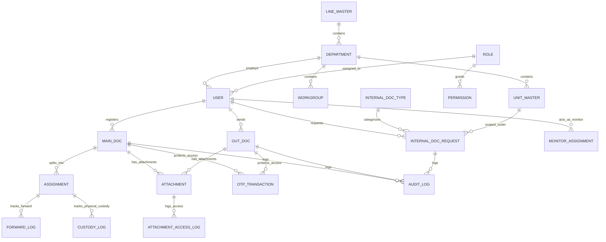

### 10.1 พจนานุกรมข้อมูลตารางหลัก (Entity Dictionary)

1. **`INTERNAL_DOC_REQUEST`:** จัดเก็บคำขอเลขบันทึกภายใน (`Id`, `DocumentNo`, `Subject`, `DocTypeId`, `LineId`, `DeptCode`, `UnitId`, `DocumentUrl`, `Status`, `CreatedBy`, `CreatedDate`, `CloseReason`)
2. **`MAIN_DOC`:** จัดเก็บเอกสารรับเข้าหลัก (`doc_ref`, `doc_type` [email/physical], `channel`, `subject`, `origin_department`, `urgency`, `confidentiality_level`, `deadline`, `status`, `deadline_flag`, `progress_percent`, `registrar_ref`, `current_holder_ref`)
3. **`ASSIGNMENT`:** จัดเก็บงานย่อยรายผู้รับ (`id`, `doc_ref`, `assignee_ref`, `assignee_type` [dept/user], `parent_assignment_id`, `status`, `deadline`, `reject_note`, `accepted_at`, `completed_at`)
4. **`OUT_DOC`:** จัดเก็บเอกสารส่งออก (`doc_no`, `edr_request_id`, `doc_number_th`, `doc_number_en`, `subject`, `organization_id`, `custom_org_name`, `delivery_method_id`, `urgency`, `confidentiality_level`, `deadline`, `status`, `sender_ref`, `sent_at`, `delivered_at`)
5. **`ATTACHMENT`:** จัดเก็บไฟล์แนบ (`id`, `doc_ref`, `file_name`, `file_path`, `file_size`, `file_type`, `attachment_source` [upload/camera], `is_mirrored`, `rotation_deg`, `is_confidential`, `uploaded_by`, `uploaded_at`)
6. **`OTP_TRANSACTION`:** จัดเก็บธุรกรรม OTP สำหรับเอกสารลับมาก (`otp_id`, `doc_ref`, `user_id`, `otp_code_hash`, `otp_ref`, `delivery_channel`='email', `target_email`, `attempt_count`, `status`, `expires_at`, `verified_at`)
7. **`MONITOR_ASSIGNMENT`:** จัดเก็บการตั้งค่าผู้เฝ้าติดตาม (`monitor_id`, `monitor_user_ref`, `scope_type`, `scope_refs`, `all_departments`, `doc_direction_filter`, `notify_enabled`, `status`, `created_by`)
8. **`LINE_MASTER` / `UNIT_MASTER` / `INTERNAL_DOC_TYPE` / `DEPARTMENT_CODE`:** ตาราง Master สำหรับบริหารจัดการ Hierarchy และ Config

---

## 11. Business Rules Catalog ฉบับรวมสมบูรณ์ (Unified BR Catalog)

### 11.1 กฎระบบเลขบันทึกภายในและ Hierarchy (RL-CORE, RL-HIER, RL-IDT, RL-QA, RL-URL)

| Rule ID | เงื่อนไขทางธุรกิจ | ผลลัพธ์ที่คาดหวัง / ข้อความแจ้งเตือน | HTTP Status |
|---|---|---|---|
| **RL-CORE-01** | ชื่อเรื่องว่างตอนขอเลข | บล็อกการส่งฟอร์ม แสดง "กรุณาระบุชื่อเรื่อง" (VR-01) | 422 |
| **RL-CORE-04** | ข้อมูลครบถ้วนและกดยืนยัน | ออกเลขทันที บันทึกสถานะ `Created` ไม่เข้า Approval Queue (BR-005) | 201 |
| **RL-CORE-05** | ขอเลขพร้อมกันหลายคำขอ | Atomic DB Lock ป้องกันเลขซ้ำและรับประกันเลขเรียงลำดับ | 201 |
| **RL-CORE-06** | ปิดเลขโดยไม่ระบุเหตุผล | บล็อกปุ่มปิด แสดง "กรุณาระบุเหตุผลการปิดเลข" (VR-CLOSE-01) | 422 |
| **RL-CORE-08** | Master Pattern มีการเปลี่ยนแปลง | เลขเดิมที่ออกไปแล้วยังคงรหัสเดิม 100% (Invariant 3) | 200 |
| **RL-HIER-01** | LineCode ซ้ำในระบบ | บล็อกการบันทึก แสดง "รหัสสายงานนี้มีอยู่ในระบบแล้ว" (VR-HIER-01) | 409 |
| **RL-HIER-02** | ลบสายงานที่มีฝ่ายสังกัดอยู่ | บล็อกการลบ แสดง "ไม่สามารถลบได้ มีฝ่ายที่สังกัดอยู่ N ฝ่าย" | 409 |
| **RL-HIER-05** | Scope=LINE เลือกทีมไม่ระบุ | ออกเลขตาม Counter สายงาน (เช่น `MIS-26-000001`) | 201 |
| **RL-HIER-07** | Scope=UNIT เลือกทีม BAF | ออกเลขตาม Counter หน่วยงานย่อย (เช่น `BAF-26-000001`) | 201 |
| **RL-IDT-03** | DocTypeCode ซ้ำในระบบ | บล็อกการบันทึก แสดง "รหัสประเภทเอกสารนี้มีอยู่ในระบบแล้ว" | 409 |
| **RL-QA-03** | Quick Add ชื่อภาษาไทยซ้ำ Exact | บล็อกการบันทึก แจ้งเตือนพร้อมปุ่ม "ใช้รายการเดิม" | 409 |
| **RL-QA-04** | Quick Add ชื่อใกล้เคียง $\ge 0.80$ | แสดง Soft Warning แต่ยอมให้ผู้ใช้กดยืนยันสร้างต่อได้ | 200 |
| **RL-URL-01** | SharePoint URL ไม่ใช่ HTTPS | แสดง Error "ลิงค์ไม่ถูกต้อง กรุณากรอก URL ที่ขึ้นต้นด้วย https://" | 422 |
| **RL-URL-03** | URL ยาวเกิน 2,000 ตัวอักษร | แสดง Error "ลิงค์เอกสารต้องไม่เกิน 2,000 ตัวอักษร" | 422 |

### 11.2 กฎระบบสารบรรณ รับเข้า-ส่งออก (BR-1.x ถึง BR-6.x)

| Rule ID | เงื่อนไขทางธุรกิจ | ผลลัพธ์ที่คาดหวัง / ข้อความแจ้งเตือน | HTTP Status |
|---|---|---|---|
| **BR-1.2** | Register เอกสารรับเข้า | แนบหลักฐานเป็น Optional ไม่บล็อกการสร้าง | 200/201 |
| **BR-1.2-A** | ถ่ายภาพเอกสารผ่านกล้อง WebRTC | แสดง Viewfinder สีทอง `#FFCD00`, ปุ่ม Mirror กลับภาพ, ปุ่มหมุน 90° | 200 |
| **BR-1.2-B** | แนบไฟล์ใน Document Detail | รองรับ Direct Upload, Drag-and-Drop $\le$ 25 MB, Lightbox Preview, ลบไฟล์แนบเพิ่ม | 200 |
| **BR-1.3-A** | ขอเลขส่งออกผ่าน EDR API | Flow A ออกเลขคู่ขนานทันที / Flow B บันทึก Pending รออนุมัติ | 200/201 |
| **BR-1.3-B** | Reverse Webhook Sync จาก EDR | รับ Webhook เปิด/อัปเดตงานในสารบรรณอัตโนมัติแบบ Real-time | 200 |
| **BR-1.3-C** | Data Parity & Idempotent Upsert | ข้อมูลตรงกัน 2 ฝั่ง 100% ป้องกันสร้าง Record ซ้ำด้วย Unique Key | 200 |
| **BR-1.4-A** | ระบุระดับชั้นความลับ | เลือก ปกติ / ลับ / ลับมาก (Default = ปกติ) | 200/201 |
| **BR-1.4-B** | จำกัดการมองเห็นไฟล์ลับมาก | ซ่อนไฟล์ทั้งหมดจากบุคคลอื่น รวมถึง Admin และผู้บริหาร (Restricted Box) | 200 / 403 |
| **BR-1.4-C** | ยืนยัน OTP สำหรับเอกสารลับมาก | ส่ง OTP 6 หลักทางอีเมลเท่านั้น (Email only) ได้ Token 15 นาที | 200 / 400 |
| **BR-1.4-D** | ประทับลายน้ำไฟล์ลับมาก | แสดง Dynamic Watermark (ชื่อ-สกุล, วันเวลา, IP) บนพรีวิว | 200 |
| **BR-1.5** | Master-Driven Data Entry | ทุกฟิลด์ผูก Master ต้องเลือกจากรายการ เก็บเป็น Reference ID | 200 / 400 |
| **BR-2.1** | ต้นทางดึงงานกลับ (Recall) | งานย่อยเปลี่ยนเป็น Recalled + ลบออกจาก Task Inbox ของผู้รับ | 200 |
| **BR-2.2** | ปฏิเสธงาน (Reject) | บังคับระบุหมายเหตุ + คืนต้นทาง (ถ้าฉบับจริงครบทุก Sub เข้า Awaiting Return) | 200 / 400 |
| **BR-2.3** | Acceptance Gate | ต้องกด Accept ก่อนจึงจะ Forward หรือปิดงานได้ (ฉบับจริง = ถือครองตัวจริง) | 400 (ถ้ายังไม่ Accept) |
| **BR-2.4-A** | Owner-first & Onward Delegation | Assign รายฝ่ายส่งถึงหัวหน้าฝ่ายก่อน เมื่อ Accept แล้วมอบหมายต่อในฝ่ายได้ | 200/201 |
| **BR-2.5** | การคำนวณ Progress % | ทุก Sub น้ำหนักเท่ากัน, ตัด Cancelled, Forward ไม่เพิ่มตัวหาร | 200 |
| **BR-3.2** | แจ้งเตือน Due Soon / Overdue | ส่ง Reminder ณ 08:30 น. ซ้ำตามรอบความเร่งด่วนจนกว่าจะปิดงาน | - |
| **BR-3.4** | ผู้รับ Reminder ซ้ำ | ส่งเฉพาะ ต้นทาง + ผู้รับมอบหมายล่าสุดของสายการมอบหมาย (Leaf Node) | - |
| **BR-4.1** | เอกสารส่งออกแนบไฟล์หลักฐาน | บังคับแนบไฟล์หรือถ่ายภาพเอกสารลงนามแล้วก่อนนำส่ง (Sent) | 400 (ถ้าไม่แนบ) |
| **BR-4.2** | ติดตาม Delivered เอกสารส่งออก | ผู้ส่งอัปเดต Manual พร้อมแนบสลิป/ภาพใบเซ็นรับก่อนปิด Completed | 200 |
| **BR-5.2** | User Provisioning จาก LDAP | เฉพาะผู้ใช้ที่ Admin เพิ่มเข้าระบบแล้ว (Active) จึงจะ Login ได้ | 201 / 403 |
| **BR-5.3** | Monitor Watcher Config | Monitor ดูงานและ Follow up ใน Scope ได้ แต่แก้/ปิดงานไม่ได้ | 200/201 |
| **BR-6.1** | Stateful Chain of Custody | บันทึกประวัติผู้ถือครองเอกสารตัวจริงทุกครั้งที่มีการเปลี่ยนมือ | 200 |
| **BR-6.3** | Audit Trail Retention | บันทึก Audit Log ทุก Action สำคัญ จัดเก็บย้อนหลัง 10 ปี | - |

---

## 12. Validation Rules ฉบับรวมสมบูรณ์ (Unified Validation Catalog)

| Validation ID | ฟิลด์ / เงื่อนไขที่ตรวจสอบ | ข้อความแจ้งเตือน (Error Message) | ระดับความรุนแรง | Trigger Event |
|---|---|---|---|---|
| **VR-01** | ชื่อเรื่องเอกสารบันทึกภายใน | "กรุณาระบุชื่อเรื่อง" | High | Submit |
| **VR-02** | ประเภทเอกสารบันทึกภายใน | "กรุณาเลือกประเภทเอกสาร" | High | Submit |
| **VR-10** | ลิงค์ SharePoint URL | "ลิงค์เอกสารไม่ถูกต้อง กรุณากรอก URL ที่ขึ้นต้นด้วย https://" | High | onBlur, Submit |
| **VR-12** | ความยาว SharePoint URL | "ลิงค์เอกสารต้องไม่เกิน 2,000 ตัวอักษร" | High | onInput, Submit |
| **VR-CLOSE-01** | เหตุผลการปิดเลขบันทึกภายใน | "กรุณาระบุเหตุผลการปิดเลข" | High | Modal Submit |
| **VAL-01** | ประเภทเอกสารรับเข้า (อีเมล/ฉบับจริง) | "กรุณาเลือกประเภทเอกสาร" | High | Submit |
| **VAL-02** | ช่องทางการรับเอกสารฉบับจริง | "กรุณาเลือกช่องทางการรับเอกสาร" | Medium | Submit |
| **VAL-03** | ชนิดและขนาดไฟล์แนบ | "ไฟล์แนบไม่ถูกต้องหรือเกินขนาดที่กำหนด (รองรับ PDF, DOCX, XLSX, JPG, PNG, WEBP, ZIP ขนาด $\le$ 25 MB)" | Medium | File Select / Drop |
| **VAL-04** | ไฟล์หลักฐานเอกสารส่งออก (BR-4.1) | "ต้องแนบไฟล์หลักฐานหรือภาพถ่ายเอกสารก่อนนำส่ง" | High | Sent Action |
| **VAL-05** | การ Assign โดยไม่เลือกผู้รับ | "กรุณาเลือกผู้รับอย่างน้อย 1 ราย" | High | Submit Assign |
| **VAL-06** | ปฏิเสธงานไม่ระบุหมายเหตุ | "กรุณาระบุหมายเหตุการปฏิเสธ" | High | Reject Modal Submit |
| **VAL-07** | Forward/ปิดงานก่อน Accept | "ต้องกดยอมรับการรับเอกสารก่อนดำเนินการต่อ" | High | Action Button Click |
| **VAL-09** | Assign ใหม่ก่อนรับเอกสารจริงคืน | "ต้องยืนยันรับเอกสารฉบับจริงคืนก่อน Assign ใหม่" | High | Submit Assign |
| **VAL-10** | วันที่ Deadline เป็นวันในอดีต | "กำหนดแล้วเสร็จต้องไม่เป็นวันในอดีต" | Medium | Date Select, Submit |
| **VAL-11** | ยืนยัน Delivered ไม่แนบหลักฐาน | "กรุณาแนบหลักฐานตอบรับ (อัปโหลดไฟล์สลิป/เอกสาร หรือถ่ายภาพใบเซ็นรับ) ก่อนยืนยันปลายทางรับ" | Medium | Delivered Modal Submit |
| **VAL-13** | Login ผู้ใช้ที่ยังไม่ถูก Provision | "บัญชียังไม่ได้รับอนุญาตให้ใช้งานระบบ โปรดติดต่อผู้ดูแลระบบ" | High (403) | Login |
| **VAL-14** | Provisioning ไม่ระบุ Role/ฝ่าย | "กรุณาเลือกผู้ใช้จาก LDAP และระบุ Role/ฝ่าย" | High | Admin Submit |
| **VAL-16** | ขอเลขส่งออกไม่ระบุผู้รับ | "กรุณาระบุผู้รับเอกสารอย่างน้อย 1 คน" | High | Outgoing Submit |
| **VAL-17** | ขอเลขส่งออกไม่ระบุผู้ลงนาม | "กรุณาระบุผู้ลงนามอย่างน้อย 1 คน" | High | Outgoing Submit |
| **VAL-18** | หน่วยงาน "อื่นๆ" ไม่ระบุชื่อ | "กรุณาระบุชื่อหน่วยงานภายนอก" | High | Outgoing Submit |
| **VAL-19** | ฝ่ายไม่มีตัวย่อในระบบ EDR | "ฝ่ายของท่านยังไม่ได้รับการกำหนดรหัสตัวย่อฝ่ายในระบบออกเลขที่เอกสาร กรุณาติดต่อผู้ดูแลระบบเพื่อไปตั้งค่ารหัสตัวย่อฝ่ายที่ระบบออกเลขที่เอกสารก่อนดำเนินการ" | High | Pre-flight Check |
| **VAL-20** | กรอก OTP ผิดหรือหมดอายุ | "รหัส OTP ไม่ถูกต้องหรือหมดอายุ กรุณาตรวจสอบหรือขอรหัสใหม่" | High | OTP Submit |
| **VAL-21** | กรอก OTP ผิดเกิน 3 ครั้ง | "ท่านกรอกรหัส OTP ผิดเกินจำนวนครั้งที่กำหนด ระบบระงับการขอรหัสชั่วคราว 15 นาที เพื่อความปลอดภัย" | High (429) | OTP Submit |
| **VAL-22** | ผู้ไม่มีสิทธิ์เปิดไฟล์ลับมาก | "ท่านไม่มีสิทธิ์เข้าถึงไฟล์แนบของเอกสารชั้นความลับนี้ (สงวนสิทธิ์เฉพาะผู้ได้รับมอบหมายโดยตรง)" | High (403) | Attachment Access |
| **VAL-23** | ตั้งค่า Monitor ไม่เลือก Scope | "กรุณาเลือกผู้เฝ้าติดตามและขอบเขต (Scope) จาก Master Data" | High | Monitor Submit |
| **VAL-24** | หัวหน้าฝ่ายตั้ง Monitor ข้ามฝ่าย | "ไม่มีสิทธิ์กำหนดผู้เฝ้าติดตามนอกฝ่ายที่ท่านกำกับ" | High (403) | Monitor Submit |
| **VAL-25** | ส่งค่าฟิลด์ไม่อยู่ใน Master Data | "ค่าที่เลือกไม่ถูกต้องหรือไม่มีอยู่ในระบบ กรุณาเลือกจากรายการ" | High (400) | Backend Submit |

---

## 13. Non-Functional Requirements (Unified NFR)

| NFR ID | หมวดหมู่ | ข้อกำหนดทางเทคนิค (Requirement) | เกณฑ์การวัดผล (Acceptance Criteria) |
|---|---|---|---|
| **NFR-01** | Performance | Searchable Dropdown Response Time | P95 $\le$ 500 ms บน Server เมื่อข้อมูล Master $\le$ 1,000 รายการ |
| **NFR-02** | Performance | Dashboard Page Load Time | FCP $\le$ 1.0 วินาที และโหลดข้อมูลเสร็จสิ้น $\le$ 3.0 วินาที บน Intranet |
| **NFR-03** | Performance | Real-time Number Preview | แสดงผล Preview เลขภายใน 200 ms หลังผู้ใช้เปลี่ยนตัวเลือก |
| **NFR-04** | Security | Backend Authorization Enforcement | ตรวจสอบสิทธิ์ RBAC และ Data Scope ที่ Controller Layer ทุก Endpoint 100% |
| **NFR-05** | Security | Parameterized Queries & Anti-SQLi | ใช้ Entity Framework Core พร้อม Parameterized Queries ป้องกัน SQL Injection 100% |
| **NFR-06** | Security | XSS & CSRF Protection | ทำ Input Sanitization, Output Encoding, Anti-Forgery Tokens และ CSP Strict |
| **NFR-07** | Security | OTP Cryptography & Watermark | OTP เก็บแบบ BCrypt Hash (TTL 3 นาที), ประทับ Dynamic Watermark บนพรีวิว |
| **NFR-08** | Availability | System SLA & Resilience | ระบบพร้อมใช้งาน $\ge 99.5\%$ ในเวลาทำการ, มี Retry Queue สำหรับ Webhook Sync |
| **NFR-09** | Auditability | Full Audit Trail & 10 Years Retention | บันทึกประวัติการกระทำสำคัญทุกรายการ จัดเก็บย้อนหลัง 10 ปี ตามเกณฑ์ คปภ. |
| **NFR-10** | Interoperability | Dual-System Data Parity SLA | ซิงค์ข้อมูลระหว่าง EDR และ Correspondence แบบ Real-time ล่าช้าไม่เกิน 2 วินาที |
| **NFR-11** | Usability | Device Camera WebRTC Compatibility | รองรับ HTML5 WebRTC บน Chrome, Edge, Safari และ Mobile Browsers |
| **NFR-12** | Compliance | Master Data Referential Integrity | ใช้ Foreign Keys ผูก ID ป้องกัน Orphan Records และใช้ Soft Deactivate |

---

## 14. PDPA & Data Protection Considerations (การคุ้มครองข้อมูลส่วนบุคคล)

1. **ฐานความชอบธรรมทางกฎหมาย (Lawful Basis):** ประมวลผลภายใต้ฐาน **ประโยชน์โดยชอบด้วยกฎหมาย (Legitimate Interests)** และ **สัญญาจ้างแรงงาน** สำหรับการปฏิบัติงานภายในบริษัท
2. **หลักการลดการใช้ข้อมูล (Data Minimization):** ดึงเฉพาะชื่อ-นามสกุล, Username, ฝ่าย และอีเมลจาก Active Directory ไม่มีการจัดเก็บรหัสผ่านในระบบ
3. **การปกป้องเอกสารลับมาก (Confidentiality Protection):** ซ่อนไฟล์แนบทั้งหมดจากผู้ไม่มีส่วนเกี่ยวข้อง บังคับยืนยันตัวตนด้วย OTP ผ่านอีเมล และประทับลายน้ำป้องกันการแคปหน้าจอ
4. **การป้องกันลิงค์หลุด (Anonymous Link Guard):** ระบบแสดงคำเตือน (VR-14) ทุกครั้งที่มีการกรอก SharePoint URL เพื่อป้องกันการนำลิงค์สาธารณะมาใช้งาน

---

## 15. Risk Management Plan (แผนบริหารความเสี่ยง)

| Risk ID | รายละเอียดความเสี่ยง | โอกาสเกิด | ผลกระทบ | ระดับ | มาตรการป้องกันและแก้ไข (Mitigation Plan) |
|---|---|---|---|---|---|
| **R-01** | **Race Condition ในการออกเลข:** ขอเลขพร้อมกันแล้วได้เลขซ้ำ | ปานกลาง | สูง | **สูง** | ใช้ Database Sequence / Atomic Transaction Lock (`UPDLOCK, ROWLOCK`) บน Counter |
| **R-02** | **Regression กระทบเลขภายนอกเดิม:** การปรับ Master กระทบ พศ/ทด | ต่ำ | วิกฤต | **สูง** | แยกตารางและคอลัมน์ของ Internal กับ External ชัดเจน และทำ Automated Regression Test |
| **R-03** | **ข้อมูลซิงค์ไม่ตรงกันระหว่าง 2 ระบบ (Desync):** Webhook ล้มเหลว | ปานกลาง | สูง | **สูง** | มี Retry Queue (Exponential Backoff) + Midnight Daily Reconciliation Job (00:00 น.) |
| **R-04** | **Brute-force เดารหัส OTP สำหรับเอกสารลับมาก:** ถูกโจมตีเดารหัส | ต่ำ | วิกฤต | **สูง** | จำกัดการกรอกผิดไม่เกิน 3 ครั้ง หากเกินบล็อก 15 นาที (VAL-21) + OTP อายุเพียง 3 นาที |
| **R-05** | **เบราว์เซอร์ไม่รองรับกล้อง WebRTC:** กล้องเปิดไม่ติดบนอุปกรณ์เก่า | ปานกลาง | ต่ำ | **ต่ำ** | มีระบบ Fallback อนุญาตให้อัปโหลดไฟล์ภาพจากคลังรูปภาพหรือ Native Camera ได้ |
| **R-06** | **ผู้ใช้กรอกข้อความอิสระจนข้อมูลผิดรูป:** พิมพ์ชื่อฝ่ายผิด | ปานกลาง | ปานกลาง | **ปานกลาง** | บังคับใช้ Master-Driven Data Entry เลือกจาก Dropdown/Lookup 100% (BR-1.5) |

---

## 16. Open Issues / ประเด็นที่ต้องติดตามยืนยัน

| # | ประเด็นที่ต้องติดตาม (Open Issues) | ผลกระทบต่อระบบ | ผู้รับผิดชอบ | สถานะปัจจุบัน |
|---|---|---|---|---|
| 1 | **นโยบายการ Merge ประเภทเอกสาร Quick Add ที่ซ้ำกัน:** การรวม DocType ในอนาคต | Master DocType | BA / Business Owner | วางแผนใน Phase ถัดไป |
| 2 | **การเชื่อมโยง Microsoft Graph API เช็คสถานะ SharePoint:** การตรวจจับลิงค์เสียอัตโนมัติ | IT Security | IT Security / SA | อยู่ระหว่างศึกษาความคุ้มค่า |
| 3 | **การ Digest อีเมลแจ้งเตือนงานค้างหลายรายการ:** รวมอีเมลเตือนตอนเช้าเป็นฉบับเดียว | Notification User Exp | Business Owner | ยืนยันใช้แบบแยกฉบับตาม Event ก่อน |
| 4 | **การเชื่อมโยงระบบทะเบียน ปณ. ภายนอกผ่าน API เต็มรูปแบบ:** ทดแทนการกดปุ่มลิงก์เปิดเว็บ | Outgoing Portal | Project Manager | ใช้งานปุ่มลิงก์ภายนอกในเฟสนี้ |

---

## 17. แนวทางการทดสอบฉบับรวมสมบูรณ์ (Comprehensive Test Strategy & Test Scenarios)

### 17.1 Traceability Matrix: ข้อกำหนด $\rightarrow$ ขอบเขตการทดสอบ

| หมวดหมู่ Business Requirement | ขอบเขตการทดสอบหลัก (Test Area) | รหัส Business Rules & Validations ที่ครอบคลุม |
|---|---|---|
| **โมดูล 1: เลขบันทึกภายใน** | ขอเลขทันที, Hierarchy LINE/DEPT/UNIT, Quick Add, SharePoint URL, ปิดเลข | `RL-CORE-01..08`, `RL-HIER-01..08`, `RL-IDT-01..07`, `RL-QA-01..06`, `VR-01..14` |
| **โมดูล 2: เอกสารรับเข้า** | Register, Assign Multiple, Accept, Reject, Forward, Delegate, Physical Return | `BR-1.2`, `BR-2.1..2.5`, `BR-2.4-A`, `BR-6.1`, `VAL-01..10` |
| **โมดูล 3: เอกสารส่งออก** | Seamless EDR Request, Webhook Sync, บังคับแนบไฟล์, ถ่ายภาพกล้อง, Delivered | `BR-1.3-A..D`, `BR-4.1..4.2`, `VAL-04`, `VAL-11`, `VAL-16..19` |
| **ความมั่นคงปลอดภัย & OTP** | Top Secret OTP Gate (Email only), Dynamic Watermark, Token Timeout | `BR-1.4-A..E`, `VAL-20..22`, `NFR-07` |
| **การเฝ้าติดตาม & การแจ้งเตือน** | Notification 3 ช่องทาง, Reminder ซ้ำตามความเร่งด่วน, Monitor Multi-Scope | `BR-3.2..3.4`, `BR-5.3`, `BR-6.2`, `NT-01..17`, `VAL-23..24` |
| **Master-Driven & Provisioning** | LDAP User Provisioning, Master-Driven Entry, Controlled-Input | `BR-1.5`, `BR-5.2`, `VAL-13..14`, `VAL-25..26` |

### 17.2 รายการ Test Scenarios ฉบับรวมสมบูรณ์ (ข้อ 1 ถึง 83 ครบถ้วน)

#### กลุ่ม A: การ Register และการขอเลขบันทึกภายใน / เอกสารรับเข้า
1. ผู้ขอสร้างเลขบันทึกภายใน (Shared by Line) $\rightarrow$ ได้รับเลขตามสายงาน (เช่น `MIS-26-000001`) ทันที (RL-HIER-05)
2. ผู้ขอสร้างเลขบันทึกภายใน (Unit Running) $\rightarrow$ ได้รับเลขตามทีม (เช่น `BAF-26-000001`) ทันที (RL-HIER-07)
3. ผู้ขอเพิ่มประเภทเอกสารผ่าน Quick Add Modal $\rightarrow$ บันทึกสำเร็จ Auto-select ในฟอร์ม ข้อมูลฟอร์มคงเดิม 100% (RL-QA-05)
4. Register เอกสารรับเข้า (อีเมล / ฉบับจริง) $\rightarrow$ บันทึกสำเร็จ เริ่มนับ Lifecycle สถานะ Registered (BR-1.2)
5. Register เอกสารรับเข้าโดยไม่แนบไฟล์ $\rightarrow$ บันทึกสำเร็จ (Optional ตาม BR-1.2)
6. Register เอกสารรับเข้าแนบไฟล์ $\le$ 25 MB $\rightarrow$ บันทึกสำเร็จ แสดงในรายการไฟล์แนบ (VAL-03)

#### กลุ่ม B: การ Assign และ Multiple Select
7. Assign ระบุตัวบุคคล $\rightarrow$ สถานะ Pending Acceptance, ส่ง Noti ถึงผู้รับ (หัวหน้าไม่ได้รับ) (BR-3.4)
8. Assign เป็นฝ่าย $\rightarrow$ สถานะ Pending Acceptance, ส่ง Noti ถึงผู้รับ + หัวหน้าฝ่าย (BR-3.4)
9. Assign หลายฝ่าย/บุคคลพร้อมกัน (Multiple Select) $\rightarrow$ สร้าง Sub-assignments แยกกิ่ง คำนวณตัวหาร Progress (BR-2.4)
10. Owner-first Routing: Assign รายฝ่าย $\rightarrow$ ส่งถึงหัวหน้าฝ่าย เมื่อหัวหน้า Accept แล้ว มอบหมายต่อ (Delegate) ให้ลูกน้องในฝ่ายได้ (BR-2.4-A)

#### กลุ่ม C: การรับงาน (Accept) และ Chain of Custody
11. ผู้รับกด Accept $\rightarrow$ สถานะ In Progress, แจ้งต้นทาง (NT-02) (BR-2.3)
12. เอกสารฉบับจริง ผู้รับกด Accept $\rightarrow$ บันทึกผู้ถือครองเอกสารตัวจริงล่าสุด (Current Holder) แบบ Stateful (BR-6.1)
13. Forward เอกสารไปปลายทางถัดไป $\rightarrow$ ผู้รับถัดไปต้อง Accept ก่อนดำเนินการต่อ, ไม่เพิ่มตัวหาร Progress (BR-6.1)

#### กลุ่ม D: การปฏิเสธงาน (Reject) และ Awaiting Physical Return
14. ปฏิเสธงานโดยไม่ระบุหมายเหตุ $\rightarrow$ ระบบบล็อกแจ้งเตือนตาม VAL-06 / BR-2.2-E
15. ทุกงานย่อยถูกปฏิเสธ + เอกสารฉบับจริง $\rightarrow$ Main สถานะ `Awaiting Physical Return` บล็อกการ Assign ใหม่จนกว่าต้นทางจะยืนยันรับตัวจริงคืน (BR-2.2-A / VAL-09)
16. ต้นทางกดยืนยันรับเอกสารจริงคืน $\rightarrow$ Main กลับสู่สถานะ `Registered` ปลดล็อกให้ Assign ใหม่ได้ (BR-2.2)
17. ทุกงานย่อยถูกปฏิเสธ + เอกสารอีเมล $\rightarrow$ Main กลับสู่สถานะ `Registered` ทันที (BR-2.2-B)

#### กลุ่ม E: การดึงงานกลับ (Recall) และการยกเลิก (Cancel)
18. ต้นทางดึงงานที่ Pending กลับ $\rightarrow$ สถานะ Recalled + ลบออกจากกล่องงานผู้ถูกดึง (BR-2.1)
19. พยายามดึงงานที่ปิด Success แล้วกลับ $\rightarrow$ ระบบปฏิเสธ HTTP 400 (BR-2.1-E)
20. ยกเลิกเอกสาร $\rightarrow$ สถานะ Cancelled, ตัดออกจากตัวหาร Progress (BR-2.5)

#### กลุ่ม F: การแจ้งเตือน (Notification / Reminder / Follow up)
21. สถานะ Due Soon ตามเกณฑ์ความเร่งด่วน $\rightarrow$ ส่ง Reminder ณ เวลา 08:30 น. (BR-3.2)
22. สถานะ Overdue + Assign เป็นฝ่าย $\rightarrow$ ส่งแจ้งเตือนถึงผู้รับผิดชอบงาน + หัวหน้าฝ่าย (BR-3.4)
23. การเตือนซ้ำเป็นรอบ (Repeat Interval) $\rightarrow$ ส่งซ้ำทุก 5 วัน (ปกติ) / ทุก 3 วัน (ด่วน) / ทุกวัน (ด่วนมาก) จนกว่าจะ Completed (BR-3.2)
24. ผู้รับ Reminder ซ้ำ $\rightarrow$ ส่งเฉพาะ ต้นทาง + ผู้รับมอบหมายล่าสุด (Leaf Node) ไม่ส่งทุกคนในสาย (BR-3.4)
25. กดปุ่ม Follow up $\rightarrow$ ส่งแจ้งเตือนย้ำ 3 ช่องทางทันที (NT-13)
26. ผู้รับกดยอมรับหรือปิดงาน $\rightarrow$ Reminder ที่ค้างในคิวของงานนั้นถูกยกเลิกทันที (Delivery Rules)

#### กลุ่ม G: การจัดการเอกสารส่งออก
27. Register ออก $\rightarrow$ ไม่แนบไฟล์ $\rightarrow$ พยายามกดนำส่ง $\rightarrow$ ระบบบล็อกแจ้งเตือนตาม BR-4.1 / VAL-04
28. แนบไฟล์หลักฐาน $\rightarrow$ Ready To Send $\rightarrow$ บันทึกนำส่ง (Sent) $\rightarrow$ อัปเดต Delivered พร้อมแนบหลักฐานตอบรับ $\rightarrow$ Completed (BR-4.2)
29. อัปเดต Delivered โดยไม่แนบหลักฐานสลิป/ใบเซ็นรับ $\rightarrow$ ระบบบล็อกแจ้งเตือนตาม VAL-11

#### กลุ่ม H: RBAC, Data Scope & User Provisioning
30. ผู้ใช้ปกติเห็นเฉพาะงานตนเอง, หัวหน้าเห็นทั้งฝ่าย, Viewer สูงสุดเห็นทั้งหมด (BR-5.1)
31. Admin เพิ่มผู้ใช้จาก LDAP $\rightarrow$ เลือกพนักงาน + ผูก Role/ฝ่าย $\rightarrow$ บันทึกสำเร็จ (BR-5.2)
32. พนักงาน AD ที่ยังไม่ถูก Provision พยายาม Login $\rightarrow$ ระบบปฏิเสธ HTTP 403 (BR-5.2-A / VAL-13)
33. พนักงานที่ถูก Admin ปิดการใช้งาน (Inactive) Login $\rightarrow$ ระบบปฏิเสธ HTTP 403 (BR-5.2-B)

#### กลุ่ม I: Dashboard, Task Inbox & Reporting
34. Dropdown เลือกประเภทงานบน Dashboard $\rightarrow$ แสดงข้อมูลถูกต้องตามสิทธิ์ (BR-5.1)
35. Task Inbox แสดงเฉพาะงาน Actionable 5 กลุ่ม $\rightarrow$ งานย้ายออกเมื่อเปลี่ยนสถานะ
36. รายงาน RPT-01, 02, 04, 06 แสดงยอดรวมรายฝ่ายแบบนับซ้ำตาม Involved Departments (Multi-Department Rule)
37. Export รายงานเป็น Excel (.xlsx) และ CSV (.csv) สำเร็จ พร้อมบันทึก Audit Log

#### กลุ่ม J: Negative & Boundary Test Scenarios
38. ทดสอบ Validation Rules ทุกข้อ (VAL-01 ถึง VAL-26) พร้อมตรวจสอบ Error Message ภาษาไทย
39. กำหนด Deadline เป็นวันในอดีต $\rightarrow$ ระบบบล็อกแจ้งเตือนตาม VAL-10
40. แนบไฟล์เกินขนาด 25 MB หรือผิดชนิด $\rightarrow$ ระบบบล็อกแจ้งเตือนตาม VAL-03
41. URL ความยาว 2,000 ตัวอักษร $\rightarrow$ บันทึกสำเร็จ; ความยาว 2,001 ตัวอักษร $\rightarrow$ บล็อกแจ้งเตือน (TS-BND-01/02)

#### กลุ่ม K: Non-Functional Requirements
42. ตรวจสอบ Audit Trail ครบทุก Action สำคัญ พร้อมบันทึก From-state $\rightarrow$ To-state ย้อนหลัง 10 ปี (NFR-09)
43. ทดสอบความปลอดภัย Backend Authorization ทุก Endpoint ปฏิเสธการเรียกตรงเมื่อไม่มีสิทธิ์ (NFR-04)

#### กลุ่ม L: กล้องถ่ายภาพ WebRTC และการกลับภาพ (Camera Capture)
44. คลิกถ่ายภาพผ่านกล้อง $\rightarrow$ แสดงภาพสดพร้อม Viewfinder สีทอง `#FFCD00` (BR-1.2-A)
45. สลับกล้องหน้า หรือกดปุ่ม "กลับภาพ" (Mirror) $\rightarrow$ ภาพและตัวหนังสือไม่กลับด้าน (BR-1.2-A)
46. กดปุ่มชัตเตอร์ $\rightarrow$ มี Flash Effect สีขาว และบันทึกภาพพร้อมกลับด้านถูกต้อง
47. หน้าพรีวิวภาพถ่าย $\rightarrow$ กดหมุนภาพ 90° $\rightarrow$ ภาพหมุนตามเข็มนาฬิกาถูกต้อง
48. เอกสารส่งออก: ถ่ายภาพใบเซ็นรับ/สลิปในหน้า Delivered $\rightarrow$ แนบสำเร็จและบันทึกสถานะได้ (BR-4.1-A)

#### กลุ่ม M: การจัดการไฟล์แนบใน Document Detail
49. หน้า Document Detail: กด "แนบไฟล์เพิ่ม" $\rightarrow$ เลือกไฟล์จากเครื่อง $\rightarrow$ แนบสำเร็จ แสดงใน Extra Attachments (BR-1.2-B)
50. ลากไฟล์มาวางในพื้นที่ Dropzone $\rightarrow$ แสดงไฮไลต์ Drag over และแนบไฟล์สำเร็จ (BR-1.2-B)
51. คลิกปุ่ม "ดูรูป" หรือ Thumbnail $\rightarrow$ เปิด Lightbox Preview ภาพความละเอียดสูง
52. คลิกปุ่ม "ลบ" บนไฟล์แนบที่เพิ่มใหม่ $\rightarrow$ ลบสำเร็จ (ไฟล์หลักตั้งต้นไม่สามารถลบได้)

#### กลุ่ม N: การขอเลขส่งออกและการซิงค์ข้อมูล 2 ทาง (Seamless EDR)
53. ขอเลขธรรมดา (Flow A) ผ่านสารบรรณ $\rightarrow$ ยิง EDR API ได้รับเลขคู่ขนาน (`พ001บท/2569` และ `S001BP/2026`) ทันที (BR-1.3-A)
54. ขอเลขพิเศษ (Flow B) ผ่านสารบรรณ $\rightarrow$ EDR ส่งอีเมลหาผู้อนุมัติ สารบรรณแสดงสถานะ Pending (BR-1.3-A)
55. ผู้ขอสังกัดฝ่ายที่ยังไม่มีตัวย่อ 2 ภาษา $\rightarrow$ Pre-flight Check บล็อกแจ้งเตือนตาม VAL-19
56. ขอเลขในเว็บ EDR เดิม $\rightarrow$ EDR ยิง Webhook มาสารบรรณ $\rightarrow$ สารบรรณสร้าง Record อัตโนมัติ (BR-1.3-B)
57. EDR ยิง Webhook ซ้ำด้วย Request ID เดิม $\rightarrow$ สารบรรณทำ Idempotent Update ไม่สร้างซ้ำ (BR-1.3-C)
58. ค้นหาเอกสารส่งออกด้วยเลขไทยหรือเลขอังกฤษ $\rightarrow$ แสดงผลเอกสารฉบับเดียวกันถูกต้อง (BR-1.3-D)

#### กลุ่ม O: การควบคุมการเข้าถึงไฟล์ตามชั้นความลับและ OTP (Top Secret)
59. เอกสารปกติ (Normal) $\rightarrow$ ผู้มีสิทธิ์เข้าถึงเอกสาร ดูและดาวน์โหลดไฟล์แนบได้ทันที (BR-1.4-A)
60. เอกสารลับมาก (Top Secret) มุมมองผู้ไม่ได้รับมอบหมาย $\rightarrow$ ซ่อนไฟล์ทั้งหมด แสดง Restricted Box (BR-1.4-B / VAL-22)
61. เอกสารลับมาก ผู้ได้รับมอบหมายกดขอ OTP $\rightarrow$ ระบบส่ง OTP 6 หลักทางอีเมลเท่านั้น (Email only, TTL 3 นาที) (BR-1.4-C)
62. กรอก OTP ถูกต้อง $\rightarrow$ ปลดล็อกแสดงไฟล์แนบ ได้ Token อายุ 15 นาที (BR-1.4-C)
63. กรอก OTP ผิดเกิน 3 ครั้ง $\rightarrow$ ระงับการขอ OTP ชั่วคราว 15 นาที ตาม VAL-21
64. พรีวิวไฟล์ลับมาก $\rightarrow$ Lightbox ประทับ Dynamic Watermark (ชื่อ, วันเวลา, IP) พาดผ่านภาพ (BR-1.4-D)
65. เวลาผ่านไปเกิน 15 นาที $\rightarrow$ Token หมดอายุ ระบบล็อกไฟล์แนบกลับอัตโนมัติ (BR-1.4-E)

#### กลุ่ม P: การเฝ้าติดตามงานด้วย Monitor Watcher
66. Admin ตั้งค่า Monitor ระดับฝ่าย $\rightarrow$ Monitor เห็นงานทั้งหมดในฝ่ายบน Dashboard ทั้งที่ไม่ใช่ผู้รับงาน (BR-5.3)
67. งานใน Scope เข้าสู่ Overdue $\rightarrow$ Monitor ได้รับ Reminder (NT-11) เพิ่มเติมจากผู้รับงาน (BR-3.4-A)
68. Monitor กดปุ่ม Follow up $\rightarrow$ ส่งแจ้งเตือนย้ำถึงผู้รับงานสำเร็จ (NT-13)
69. Monitor พยายามกด Accept/Reject/Forward/ปิดงาน $\rightarrow$ ปุ่มไม่แสดง/ถูกบล็อก (Read + Follow up เท่านั้น)
70. Monitor กับเอกสารลับมาก $\rightarrow$ Monitor เห็นสถานะงานได้ แต่เปิดไฟล์แนบไม่ได้หากไม่ใช่ Assignee (BR-5.3-A)
71. หัวหน้าฝ่ายตั้งค่า Monitor ข้ามฝ่ายตนเอง $\rightarrow$ ระบบบล็อก HTTP 403 ตาม VAL-24 / BR-5.3-C
72. ตั้งค่า Monitor แบบ Multi-Scope (หลายฝ่าย) หรือ All Departments $\rightarrow$ ครอบคลุมฝ่ายตามที่ระบุถูกต้อง

#### กลุ่ม Q: ข้อมูลที่ควบคุมด้วย Master (Master-Driven Entry)
73. ฟิลด์ ฝ่าย, กลุ่มงาน, ผู้ใช้, หน่วยงานภายนอก, ประเภท, ความเร่งด่วน, ชั้นความลับ บังคับเลือกจาก Master (BR-1.5)
74. ส่งค่า reference ID ที่ไม่มีใน Master ไปยัง Backend $\rightarrow$ ระบบปฏิเสธ HTTP 400 ตาม VAL-25
75. ข้อมูล Master ถูกปิดใช้งาน (Inactive) $\rightarrow$ ไม่แสดงให้เลือกใหม่ แต่เอกสารเดิมยังแสดงค่าถูกต้อง (Soft Reference)
76. หน่วยงานภายนอกเลือก "อื่นๆ" $\rightarrow$ บังคับกรอกชื่อ Free-text ตาม VAL-26

---

## 18. Appendix (ภาคผนวก)

### 18.1 Appendix A: Unified Error Codes Catalog

| Error Code | HTTP Status | คำอธิบายความหมาย | ข้อความแจ้งเตือนผู้ใช้งาน |
|---|---|---|---|
| **ERR-400** | 400 Bad Request | ข้อมูลในคำขอไม่ถูกต้องตามโครงสร้าง | "ข้อมูลที่ส่งมาไม่ถูกต้อง กรุณาตรวจสอบและลองใหม่อีกครั้ง" |
| **ERR-401** | 401 Unauthorized | ชื่อผู้ใช้หรือรหัสผ่านไม่ถูกต้อง | "ชื่อผู้ใช้หรือรหัสผ่านไม่ถูกต้อง" |
| **ERR-403** | 403 Forbidden | ไม่มีสิทธิ์ในการดำเนินการ / บัญชียังไม่ได้รับอนุญาต | "คุณไม่มีสิทธิ์ดำเนินการในส่วนนี้ หรือบัญชียังไม่ได้รับอนุญาตให้ใช้งานระบบ" |
| **ERR-404** | 404 Not Found | ไม่พบข้อมูลที่ต้องการ | "ไม่พบข้อมูลที่ระบุในระบบ" |
| **ERR-409** | 409 Conflict | ข้อมูลซ้ำซ้อนหรือขัดแย้งกับสถานะปัจจุบัน | "ข้อมูลมีอยู่แล้วในระบบ หรือขัดแย้งกับสถานะปัจจุบัน" |
| **ERR-422** | 422 Unprocessable | ข้อมูลไม่ผ่าน Validation Rules | ตามข้อความระบุรายฟิลด์ (VR-xxx) |
| **ERR-429** | 429 Too Many Requests | กรอก OTP ผิดเกินจำนวนครั้งที่กำหนด | "ท่านกรอกรหัส OTP ผิดเกินจำนวนครั้งที่กำหนด ระบบระงับชั่วคราว 15 นาที" |
| **ERR-500** | 500 Server Error | ข้อผิดพลาดภายในเซิร์ฟเวอร์ | "เกิดข้อผิดพลาดในการประมวลผล กรุณาลองใหม่หรือติดต่อ IT Support" |
| **ERR-CR-001** | 422 | ไม่เลือกประเภทเอกสาร | "กรุณาเลือกประเภทเอกสาร" |
| **ERR-CR-002** | 422 | ไม่เลือกผู้รับตอน Assign | "กรุณาเลือกผู้รับอย่างน้อย 1 ราย" |
| **ERR-CR-003** | 400 | Forward/ปิดงานก่อน Accept | "ต้องกดยอมรับการรับเอกสารก่อนดำเนินการต่อ" |
| **ERR-CR-004** | 400 | ปฏิเสธโดยไม่ระบุหมายเหตุ | "กรุณาระบุหมายเหตุการปฏิเสธ" |
| **ERR-CR-005** | 400 | Assign ใหม่ก่อนรับเอกสารจริงคืน | "ต้องยืนยันรับเอกสารฉบับจริงคืนก่อน Assign ใหม่" |
| **ERR-CR-007** | 400 | เอกสารส่งออกไม่แนบไฟล์ | "ต้องแนบไฟล์หลักฐานหรือภาพถ่ายเอกสารก่อนนำส่ง" |
| **ERR-CR-016** | 400 | รหัส OTP ผิดหรือหมดอายุ | "รหัส OTP ไม่ถูกต้องหรือหมดอายุ กรุณาตรวจสอบหรือขอรหัสใหม่" |
| **ERR-CR-018** | 403 | ไม่มีสิทธิ์เข้าถึงไฟล์ลับมาก | "ท่านไม่มีสิทธิ์เข้าถึงไฟล์แนบของเอกสารชั้นความลับนี้ (สงวนสิทธิ์เฉพาะผู้ได้รับมอบหมายโดยตรง)" |

### 18.2 Appendix B: Audit Log Data Dictionary

| Field Name | Data Type | คำอธิบาย |
|---|---|---|
| `log_id` | `VARCHAR(36)` (PK) | รหัส Primary Key ของ Audit Record (UUID) |
| `doc_ref` | `VARCHAR(50)` (Indexed) | เลขที่เอกสาร / Key Reference ที่เกี่ยวข้อง |
| `actor_ref` | `VARCHAR(50)` | รหัสผู้ดำเนินการ (AD Username / System) |
| `action` | `VARCHAR(50)` | ประเภทการกระทำ (`Register`, `Assign`, `Accept`, `Reject`, `Forward`, `Delegate`, `Recall`, `Cancel`, `ConfirmReturn`, `Deliver`, `Complete`, `CloseMemo`, `RequestOTP`, `VerifyOTP_Success`, `VerifyOTP_Failed`, `ViewSecretFile`, `ExportReport`, `ConfigChange`) |
| `from_state` | `VARCHAR(30)` | สถานะก่อนการเปลี่ยนแปลง |
| `to_state` | `VARCHAR(30)` | สถานะหลังการเปลี่ยนแปลง |
| `action_time` | `DATETIME2` | วันเวลาที่เกิดเหตุการณ์ (UTC + 7) |
| `holder_ref` | `VARCHAR(50)` | ผู้ถือครองเอกสารตัวจริงล่าสุด (กรณีเอกสารฉบับจริง) |
| `note` | `NVARCHAR(1000)` | หมายเหตุเพิ่มเติม (เหตุผลปฏิเสธ/ปิดเลข/ช่องทาง OTP) |
| `ip_address` | `VARCHAR(45)` | หมายเลข IP Address ของผู้ดำเนินการ |
| `user_agent` | `NVARCHAR(255)` | เบราว์เซอร์และระบบปฏิบัติการของผู้ดำเนินการ |

*นโยบายการจัดเก็บ: จัดเก็บย้อนหลังอย่างน้อย 10 ปี (BR-6.3 / NFR-09)*

### 18.3 Appendix C: Unified Status Dictionary (Quick Reference)

| กลุ่มงาน / โมดูล | รหัสสถานะ (Status) | ความหมายทางธุรกิจ |
|---|---|---|
| **โมดูล 1: เลขบันทึกภายใน** | `Draft` | กำลังกรอกข้อมูล ยังไม่ได้ออกเลข |
| | `Created` | ออกเลขสำเร็จทันที (สถานะเริ่มต้น) พร้อมนำไปใช้งาน |
| | `In Use` | เลขเอกสารอยู่ระหว่างการใช้งานในบันทึกข้อความ |
| | `Closed` | ปิดเลขเอกสารเรียบร้อยแล้ว (ระบุเหตุผลบังคับ — Terminal State) |
| | `Cancelled` | ยกเลิกเลขเอกสาร (Terminal State) |
| **โมดูล 2: เอกสารรับเข้า (Main)** | `Registered` | นำเข้าระบบแล้ว (เริ่มนับ Lifecycle) รอมอบหมาย |
| | `Pending Acceptance` | มอบหมายแล้ว รอผู้รับกดยอมรับ (Accept) |
| | `In Progress` | มีผู้รับยอมรับอย่างน้อย 1 ราย อยู่ระหว่างดำเนินการ/ส่งต่อ |
| | `Awaiting Physical Return` | ทุกงานย่อยถูกปฏิเสธ รอต้นทางยืนยันรับเอกสารตัวจริงคืน |
| | `Completed` | ทุกงานย่อยปิด Success ครบถ้วน (Progress 100%) |
| | `Cancelled` | ยกเลิกคำขอ |
| **โมดูล 2: เอกสารรับเข้า (Sub)** | `Pending Acceptance` | ถูกมอบหมาย รอกดยอมรับ/ปฏิเสธ |
| | `Accepted` | กดยอมรับการรับงาน (ฉบับจริง = ยืนยันถือครองตัวจริง) |
| | `Rejected` | ปฏิเสธ/ตีกลับงาน พร้อมระบุหมายเหตุ |
| | `Recalled` | ต้นทางดึงงานกลับ |
| | `Forwarded` | ส่งต่อลำดับถัดไป (สืบทอดงานเดิม ไม่เพิ่มตัวหาร) |
| | `Success` | ปิดงานย่อยสำเร็จ |
| **โมดูล 3: เอกสารส่งออก** | `Registered` | ได้รับเลขที่เอกสารแล้ว (Flow A ทันที / Flow B หลังอนุมัติ) |
| | `Attached` | แนบไฟล์เอกสารลงนามแล้ว (Required) |
| | `Ready To Send` | ตรวจสอบไฟล์ครบ พร้อมนำส่งภายนอก |
| | `Sent` | บันทึกการนำส่งเรียบร้อยแล้ว |
| | `Delivered` | ปลายทางรับจริงแล้ว (Manual Update + แนบหลักฐานตอบรับ) |
| | `Completed` | ปิดงานเสร็จสิ้นสมบูรณ์ |
| **สถานะเสริม (Flags)** | `On Track` / `Due Soon` / `Overdue` / `Cleared` | สถานะควบคุมนาฬิกาการแจ้งเตือนตาม Deadline |
| **ชั้นความลับ** | `ปกติ (Normal)` / `ลับ (Confidential)` / `ลับมาก (Top Secret)` | ระดับชั้นความลับในการควบคุมการเข้าถึงไฟล์แนบ |

### 18.4 Appendix D: สเปก API เชื่อมต่อระหว่างระบบ EDR และ ระบบสารบรรณ (EDR Integration API Contracts)

#### 1) `GET /api/v1/document-requests/context` (Pre-flight Context Check)
- **ผู้เรียก:** ระบบสารบรรณ $\rightarrow$ **ผู้ให้บริการ:** EDR Engine
- **Header:** `Authorization: Bearer <token>`, `X-Requester-Username: <username>`
- **Response (200 OK):**
  ```json
  {
    "can_request_number": true,
    "requester": {
      "username": "teerapat.ti",
      "full_name_th": "นายธีรภัทร์ เที่ยงกุล",
      "dept_code_th": "บท",
      "dept_code_en": "BP",
      "is_dept_code_configured": true
    },
    "master_data": {
      "current_year_th": 2569,
      "special_organizations": [{ "id": 1, "name": "สำนักงาน คปภ.", "prefix_th": "พ", "prefix_en": "S" }],
      "general_organizations": [{ "id": 10, "name": "กรมพัฒนาธุรกิจการค้า", "prefix_th": "ท", "prefix_en": "G" }, { "id": 99, "name": "อื่นๆ", "allow_custom_text": true }]
    }
  }
  ```

#### 2) `POST /api/v1/document-requests` (สร้างคำขอออกเลขส่งออก)
- **ผู้เรียก:** ระบบสารบรรณ $\rightarrow$ **ผู้ให้บริการ:** EDR Engine
- **Payload:** `{ "org_type": "general", "organization_id": 10, "subject": "...", "recipients": [...], "signers": [...], "requester_username": "teerapat.ti" }`
- **Response (Flow A — 200 OK):** `{ "status": "Approved", "edr_request_id": 561601, "document_number_th": "ท001บท/2569", "document_number_en": "G001BP/2026" }`
- **Response (Flow B — 200 OK):** `{ "status": "Pending", "edr_request_id": 561602, "message": "คำขออยู่ระหว่างรอการอนุมัติออกเลข" }`

#### 3) `POST /api/v1/integration/edr/sync-document` (Reverse Webhook Push)
- **ผู้เรียก:** EDR Engine $\rightarrow$ **ผู้รับ:** ระบบสารบรรณ
- **Trigger:** เมื่อผู้ใช้ขอเลขบนเว็บ EDR เดิม หรือเมื่อผู้อนุมัติกด Approve
- **Behavior:** สารบรรณทำ **Idempotent Upsert** สร้าง/อัปเดต Record เอกสารส่งออกอัตโนมัติ

#### 4) `POST /api/v1/integration/edr/approval-callback` (Callback แจ้งผลอนุมัติ)
- **Payload:** `{ "edr_request_id": 561602, "action": "Approved", "document_number_th": "พ001บท/2569", "document_number_en": "S001BP/2026" }`

#### 5) `GET /api/v1/integration/edr/reconciliation` (Midnight Daily Reconciliation Job)
- **Trigger:** Cron Job ทุกเที่ยงคืน (00:00 น.) ตรวจสอบ Transaction IDs ทั้งสองฝั่งเพื่อ Re-sync รับประกัน Data Parity 100%

### 18.5 Appendix E: Master Data Catalog & Controlled-Input Matrix

| ฟิลด์ข้อมูลในระบบ | ชนิด UI Input | แหล่งข้อมูล Master | หมายเหตุการควบคุม |
|---|---|---|---|
| **สายงาน (Line)** | Dropdown (ID) | `LINE_MASTER` | บริหารจัดการในระบบ EDR Settings/Lines |
| **ฝ่ายต้นสังกัด (Department)** | Dropdown/Lookup (ID) | `DEPARTMENT` (AD / Master) | ผูกกับ AD และจับคู่สายงานใน Settings/Departments |
| **หน่วยงานย่อย / ทีม (Unit)** | Dropdown (ID) | `UNIT_MASTER` | ผูกกับฝ่ายของผู้ขอ (Default = "ไม่ระบุ") |
| **กลุ่มงาน (Workgroup)** | Dropdown (ID) | `WORKGROUP` | ใช้กำหนด Scope ในการ Assign และ Monitor |
| **ผู้ใช้งาน / ผู้รับ / ผู้ลงนาม** | Autocomplete Search (ID) | `USER` (เฉพาะที่ Provision) | ค้นหาจากฐานข้อมูลพนักงานที่ถูก Provision แล้ว |
| **ประเภทเอกสารบันทึกภายใน** | Searchable Dropdown (ID) | `INTERNAL_DOC_TYPE` | รองรับ Quick Add Modal (`Source=QUICKADD`) |
| **หน่วยงานภายนอก (ปลายทาง)** | Dropdown (ID) + Free-text | Master External Organizations | หากเลือก "อื่นๆ" ต้องระบุชื่อ Free-text (VAL-26) |
| **รูปแบบการส่ง (Delivery Method)** | Dropdown/Lookup (ID) | Master Delivery Methods | เช่น ไปรษณีย์ลงทะเบียน, EMS, ให้ ปณ. มารับ, Messenger |
| **ระดับความเร่งด่วน** | Radio / Badge Button (Enum) | `ปกติ` / `ด่วน` / `ด่วนมาก` | มีผลต่อการคำนวณ Due Soon และรอบการเตือนซ้ำ |
| **ระดับชั้นความลับ** | Radio / Badge Button (Enum) | `ปกติ` / `ลับ` / `ลับมาก` | มีผลต่อการล็อกไฟล์แนบและบังคับ OTP (Email only) |
| **SharePoint URL** | Text Input (HTTPS) | — | Validate HTTPS + RFC 3986 $\le$ 2,000 ตัวอักษร |
| **ชื่อเรื่อง / หมายเหตุ / เหตุผลปิด** | Free-text Input | — | ฟิลด์บรรยายจำเป็นสำหรับการปฏิบัติงาน |

---

*เอกสารวิเคราะห์ความต้องการระบบ (SRS Analysis) ฉบับรวมสมบูรณ์นี้ จัดทำและรับรองความถูกต้องโดย ทีม Business Analyst (BA) ประจำ บริษัท เทเวศประกันภัย จำกัด (มหาชน)*
