# เอกสารวิเคราะห์ Requirement — ระบบขอเลขที่เอกสารภายใน (EDR)
# SRS Analysis — Electronic Document Request

**Document Type:** Software Requirement Specification Analysis / Change Request Analysis (F-BP-004)  
**Project:** P2026-EDR — ระบบออกเลขที่เอกสาร (EDR)  
**System:** EDR — Electronic Document Request (ASP.NET Core MVC / .NET 8)  
**Module:** ระบบเลขบันทึกภายใน + Master Hierarchy + ประเภทเอกสาร + SharePoint URL  
**Version:** 3.3.0 (ฉบับสมบูรณ์ปรับปรุงตาม CR: ยกเลิกประเภทเอกสาร, One-Click Copy, Modal ยกเลิกพร้อมเหตุผล & Audit Log และภาพประกอบหน้าจอจริงจาก UAT)  
**Prepared by:** Business Analyst (BA)  
**Created Date:** 26 สิงหาคม 2569 (ปรับปรุงล่าสุดตาม CR: 06 กันยายน 2569)  
**Environment (UAT):** `https://iwebsvuat.deves.co.th/EDR`  
**Status:** Approved for SIT/UAT  

> **หมายเหตุ:** เอกสารฉบับนี้เป็น Requirement Analysis ฉบับรวมสมบูรณ์ (Consolidated SRS Analysis) สำหรับระบบ EDR — ระบบขอเลขที่เอกสารบันทึกภายใน ครอบคลุมทุก Feature ในครั้งเดียว ประกอบด้วยระบบขอเลขบันทึกภายในหลัก, Master Hierarchy 3 ระดับ (สายงาน/ฝ่าย/หน่วยงานภายใน), Master ประเภทเอกสารพร้อม Quick Add, และการบันทึกลิงค์เอกสาร SharePoint URL อ้างอิง โดยจัดทำตามรูปแบบมาตรฐานของบริษัท เทเวศประกันภัย จำกัด (มหาชน) พร้อมภาพประกอบหน้าจอจริงจากการทดสอบบนระบบ UAT

---

---

## บันทึกการเปลี่ยนแปลงของเอกสาร (Document Change Log)

| Version | วันที่ | รายละเอียดการเปลี่ยนแปลง | โดย |
|---|---|---|---|
| 1.0.0 | 20 ส.ค. 2569 | ร่างข้อกำหนดระบบขอเลขที่เอกสารบันทึกภายใน EDR ฉบับแรก | นายธีรภัทร ทิพรัตน์ (BA) |
| 2.0.0 | 26 ส.ค. 2569 | ฉบับรวมสมบูรณ์ (Consolidated SRS): No Approval Flow, Hierarchy 3 ระดับ, Quick Add ประเภทเอกสาร, SharePoint URL, ภาพประกอบหน้าจอจริง UAT | นายธีรภัทร ทิพรัตน์ (BA) |
| **3.3.0** | **06 ก.ย. 2569** | **ปรับปรุงตาม Change Request (CR) ระบบออกเลขเอกสารบันทึกภายใน:** 1) **แยกสิทธิ์ Admin ฝ่าย vs SuperAdmin:** เพิ่มบทบาท Admin ฝ่าย (จัดการงานทุกคนในฝ่าย 100% แต่ไม่เห็นเมนูตั้งค่า Master Data) และ SuperAdmin ดูแลระบบและ Master ทั้งหมด 2) **Active Directory Auto-Provisioning:** ล็อกอินครั้งแรกแล้วระบบสร้างสิทธิ์ให้อัตโนมัติ 3) **ยกเลิกประเภทเอกสารบันทึกภายในทั้งหมด:** ตัดเรื่องประเภทเอกสาร (DocTypes), Dropdown, Quick Add และ Master ออกทั้งหมดเพื่อความสะดวกรวดเร็ว 4) **เพิ่มการบันทึก Audit Log และการยกเลิกเอกสาร:** บันทึกประวัติการกดยกเลิกเอกสาร (พร้อมบังคับระบุเหตุผลผ่าน Modal) และการเพิ่ม/แก้ไข/ลบ ลิงก์เอกสารอ้างอิง 5) **เพิ่มปุ่มคัดลอกเลขเอกสาร (One-Click Copy):** เพิ่มปุ่ม Copy เลขเอกสารลง Clipboard ในหน้าต่างสำเร็จ, หน้ารายละเอียดคำขอ และตารางรายการ 6) **อัปเดตภาพถ่ายหน้าจอจริงจากการทดสอบบนระบบ UAT ล่าสุดครบถ้วน** | นายธีรภัทร ทิพรัตน์ (Lead BA) |

---

## สารบัญ

1. [ภาพรวมและวัตถุประสงค์ของเอกสาร](#1-ภาพรวมและวัตถุประสงค์ของเอกสาร)
2. [Executive Summary & กฎเหล็กที่ห้ามละเมิด](#2-executive-summary--กฎเหล็กที่ห้ามละเมิด)
3. [System Context & Architecture Overview](#3-system-context--architecture-overview)
4. [Scope of Work (ขอบเขตงาน)](#4-scope-of-work-ขอบเขตงาน)
5. [Business Requirements (ข้อกำหนดทางธุรกิจ)](#5-business-requirements-ข้อกำหนดทางธุรกิจ)
6. [Roles & Permissions (บทบาทและสิทธิ์การใช้งาน)](#6-roles--permissions-บทบาทและสิทธิ์การใช้งาน)
7. [Hierarchy Data Model & Running Scope Logic](#7-hierarchy-data-model--running-scope-logic)
8. [Use Case ภาพรวม](#8-use-case-ภาพรวม)
9. [กระบวนการหลัก End-to-End](#9-กระบวนการหลัก-end-to-end)
10. [Data Model และ Field Specification](#10-data-model-และ-field-specification)
11. [Specification รายหน้าจอพร้อมภาพประกอบจริง](#11-specification-รายหน้าจอพร้อมภาพประกอบจริง)
12. [Business Rules Catalog (สำหรับทดสอบ)](#12-business-rules-catalog-สำหรับทดสอบ)
13. [Validation Rules (กฎการตรวจสอบความถูกต้อง)](#13-validation-rules-กฎการตรวจสอบความถูกต้อง)
14. [Non-Functional Requirements (NFR)](#14-non-functional-requirements-nfr)
15. [PDPA Consideration (การคุ้มครองข้อมูลส่วนบุคคล)](#15-pdpa-consideration-การคุ้มครองข้อมูลส่วนบุคคล)
16. [Risk Management Plan (แผนบริหารความเสี่ยง)](#16-risk-management-plan-แผนบริหารความเสี่ยง)
17. [Open Issues / ประเด็นที่ต้องติดตามยืนยัน](#17-open-issues--ประเด็นที่ต้องติดตามยืนยัน)
18. [แนวทางการทดสอบ (Test Strategy & Scenarios)](#18-แนวทางการทดสอบ-test-strategy--scenarios)
19. [Appendix (ภาคผนวก)](#19-appendix-ภาคผนวก)

---

## 1. ภาพรวมและวัตถุประสงค์ของเอกสาร

เอกสารฉบับนี้เป็น **SRS Analysis (F-BP-004)** ที่รวบรวมและวิเคราะห์ Requirement ของระบบขอเลขที่เอกสารภายใน (EDR) ของบริษัท เทเวศประกันภัย จำกัด (มหาชน) ทั้งหมดไว้ในที่เดียว เพื่อให้ทีม SA, DEV, QA และ Business Users ใช้เป็นเอกสารอ้างอิงมาตรฐานเดียว (Single Source of Truth)

### 1.1 วัตถุประสงค์หลัก
1. **เพิ่มประสิทธิภาพในการออกเลขเอกสารภายใน:** ลดขั้นตอนความซ้ำซ้อน ผู้ขอสามารถขอเลขบันทึกภายในและได้รับเลขทันทีโดยไม่ต้องผ่านสายการอนุมัติ (No Approval Flow)
2. **รองรับโครงสร้างองค์กร 3 ระดับ (3-Tier Hierarchy):** รองรับโครงสร้างองค์กรแบบ สายงาน (Line) → ฝ่าย (Department) → หน่วยงานภายใน (Unit/Team) เพื่อความยืดหยุ่นในการออกเลขตามฝ่ายหรือตามทีม
3. **จัดหมวดหมู่เอกสารอย่างเป็นระบบ:** กำหนด Master ประเภทเอกสาร (Document Types) พร้อมระบบค้นหาอัจฉริยะ (Searchable Dropdown) และสร้างประเภทเร่งด่วน (Quick Add)
4. **เชื่อมโยงเอกสารดิจิทัล:** รองรับการจัดเก็บลิงค์เอกสาร SharePoint URL อ้างอิง เพื่อให้สามารถเปิดดูเอกสารต้นฉบับได้โดยตรงจากระบบ EDR

---

## 2. Executive Summary & กฎเหล็กที่ห้ามละเมิด

ระบบ EDR เดิมรองรับการออกเลขเอกสารภายนอก 2 ประเภท ได้แก่ **เลขเอกสารพิเศษ (`พศ...`)** และ **เลขเอกสารธรรมดา (`ทด...`)** ซึ่งมีขั้นตอนการอนุมัติ (Approval Workflow) การพัฒนาระบบในเฟสนี้เป็นการเพิ่มความสามารถในการออก **เลขเอกสารบันทึกภายใน** พร้อมโครงสร้าง Master ใหม่

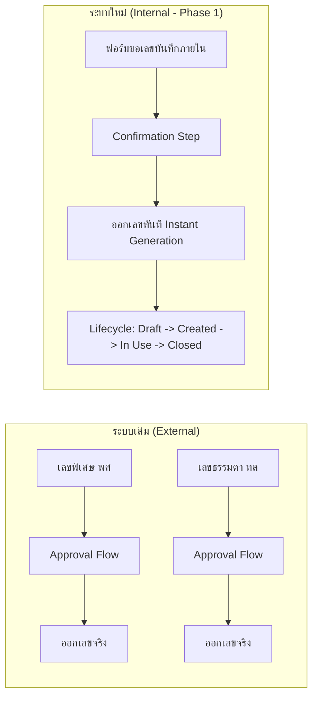

### กฎเหล็กที่ห้ามละเมิด (System Invariants)
- **Invariant 1 — ไม่กระทบ Flow เลขเอกสารภายนอก:** ห้ามแก้ไขหรือกระทบ Flow การออกเลขเอกสารภายนอก (พศ/ทด) ทุกกรณี
- **Invariant 2 — เลขบันทึกภายในไม่ผ่าน Approval:** เลขเอกสารบันทึกภายในไม่ต้องผ่าน Approval ทุกกรณี เมื่อผู้ขอยืนยัน ระบบจะสร้างเลขและบันทึกสถานะ `สร้างแล้ว (Created)` ทันที
- **Invariant 3 — เลขที่สร้างแล้วห้ามเปลี่ยนแปลง:** เลขที่ออกไปแล้วจะคงเดิมตลอดไป แม้จะมีการเปลี่ยนแปลงรูปแบบ Pattern หรือ Master Config ในภายหลัง
- **Invariant 4 — Master ฝ่ายเดิมใช้ร่วมกัน:** Master ตัวย่อฝ่ายเดิมใช้ร่วมกับเลขเอกสารภายนอก ห้ามลบหรือแก้ไขฟิลด์ที่ External ใช้อยู่
- **Invariant 5 — ข้อมูลฝ่ายดึงจาก AD:** ข้อมูลฝ่ายของผู้ขอดึงมาจาก Active Directory (AD) อัตโนมัติและเป็น Read-only สำหรับผู้ขอ; ส่วนสายงานและหน่วยงานภายในบริหารจัดการในระบบ EDR เอง
- **Invariant 6 — EDR ไม่เก็บไฟล์เอกสาร:** ระบบ EDR ไม่ทำหน้าที่ File Server แต่เก็บเฉพาะ URL อ้างอิงไปยัง SharePoint

---

## 3. System Context & Architecture Overview

### 3.1 ภาพรวม System Context

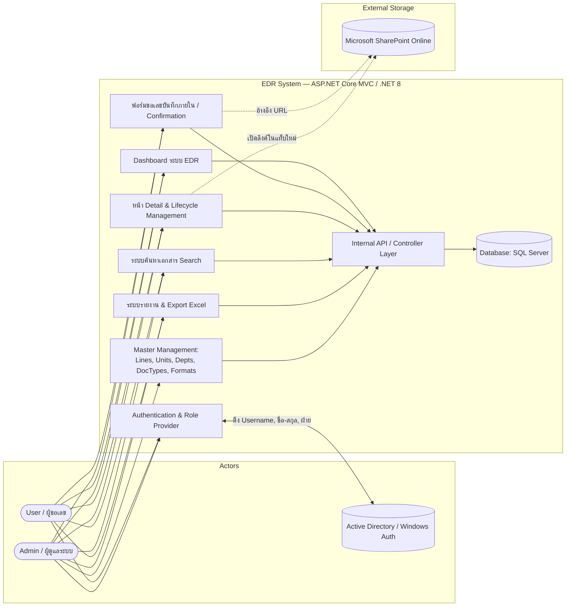

### 3.2 Feature Areas และความสัมพันธ์

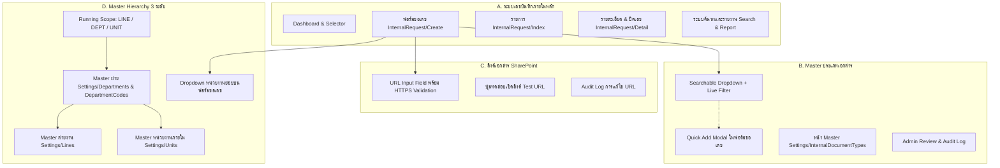

### 3.3 รายละเอียด Tech Stack & UAT Environment

| รายการ | รายละเอียด |
|---|---|
| **Backend Framework** | ASP.NET Core MVC (.NET 8.0) |
| **Frontend** | Razor Views + Bootstrap 5 + Vanilla JavaScript + CSS Design Tokens |
| **Database** | Microsoft SQL Server |
| **Authentication** | Active Directory (AD) / Windows Authentication |
| **Document Storage** | Microsoft SharePoint Online (เก็บเฉพาะ URL อ้างอิง) |
| **UAT URL** | `https://iwebsvuat.deves.co.th/EDR` |

---

## 4. Scope of Work (ขอบเขตงาน)

### 4.1 In Scope (ขอบเขตใน Phase 1)

1. **ระบบเลขบันทึกภายในหลัก (Core Internal Request):**
   - หน้าจอ Dashboard และเมนูแยกประเภทเอกสาร
   - เมนูและ Route ใหม่สำหรับ Internal Request (`/EDR/InternalRequest`)
   - ฟอร์มขอสร้างเลขเอกสารบันทึกภายในพร้อม Confirmation Step
   - การออกเลขทันทีโดยไม่ต้องผ่านสายการอนุมัติ
   - Lifecycle Status: `ฉบับร่าง (Draft)` → `สร้างแล้ว (Created)` → `ใช้งาน (In Use)` → `ปิดเลข (Closed)` / `ยกเลิก (Cancelled)`
   - หน้า Detail แสดง Timeline, ข้อมูลลำดับชั้น และปุ่มปิดเลข (บังคับกรอกเหตุผล)
   - หน้า Search และ Report รองรับ Filter ประเภทเอกสารและ Export Excel

2. **Master Hierarchy 3 ระดับ:**
   - **สายงาน (Line):** หน้าจัดการ Master สายงาน (`Settings/Lines`) พร้อม CRUD และ LineCode
   - **ฝ่าย (Department):** หน้าผูกฝ่ายกับสายงาน (`Settings/Departments`) และหน้าตั้งค่า Running Config (`Settings/DepartmentCodes`)
   - **หน่วยงานภายใน (Unit/Team):** หน้าจัดการหน่วยงานย่อย (`Settings/Units`) ผูกกับฝ่ายที่สังกัด
   - การเลือก Running Scope: `LINE` (ใช้ Counter สายงาน), `DEPT` (ใช้ Counter ฝ่าย), `UNIT` (ใช้ Counter หน่วยงานย่อย)
   - Real-time Preview เลขที่จะได้รับบนหน้า Master และหน้าฟอร์มขอเลข

3. **Master ประเภทเอกสาร (Internal Document Types) & Quick Add:**
   - หน้าจัดการ Master ประเภทเอกสาร (`Settings/InternalDocumentTypes`)
   - Searchable Dropdown เลือกประเภทเอกสารบนฟอร์มขอเลข (Mandatory)
   - Modal เพิ่มประเภทเอกสารด่วน (Quick Add) บนหน้าฟอร์มขอเลขโดยข้อมูลในฟอร์มไม่สูญหาย
   - ระบบตรวจจับชื่อซ้ำ Exact Match และแจ้งเตือนชื่อใกล้เคียง (Similarity Warning)
   - บันทึกสถานะ `Source=QUICKADD`, `ReviewStatus=PENDING` เพื่อให้ Admin ตรวจสอบ

4. **ลิงค์เอกสาร SharePoint URL:**
   - ฟิลด์กรอก SharePoint URL แบบไม่บังคับ (Optional)
   - Validation ตรวจสอบโปรโตคอล HTTPS + RFC 3986 + ความยาวไม่เกิน 2,000 ตัวอักษร
   - แสดงปุ่มทดสอบเปิดลิงค์ในแท็บใหม่ (`target="_blank"` พร้อม `rel="noopener noreferrer"`)
   - สิทธิ์การแก้ไข URL บนหน้า Detail และการบันทึก Audit Log ทุกครั้งที่มีการเปลี่ยนแปลง

### 4.2 Out of Scope (นอกขอบเขต Phase 1)

| รายการ | เหตุผล |
|---|---|
| Flow เลขเอกสารภายนอก (พศ/ทด) | Invariant — เป็นระบบเดิมที่ทำงานแยกต่างหาก ห้ามแก้ไข |
| การอัปโหลด/จัดเก็บไฟล์เอกสารบน EDR | EDR เก็บเฉพาะ SharePoint URL อ้างอิงเท่านั้น |
| การเชื่อมต่อ Microsoft Graph API เชิงลึก | ไม่จำเป็นต้องดึง Metadata หรือไฟล์จาก SharePoint |
| การตรวจสอบสถานะลิงค์เสียอัตโนมัติ (Link Health Check) | วางแผนใน Phase ถัดไป |
| Approval Workflow สำหรับเลขบันทึกภายใน | ไม่ต้องมี Approval ตาม Business Requirement |
| โครงสร้าง Hierarchy เกิน 3 ระดับ | ข้อกำหนดกำหนดไว้สูงสุด 3 ระดับ (สายงาน/ฝ่าย/หน่วยงาน) |
| การรวมหรือ Re-map ประเภทเอกสารที่ซ้ำกัน (Merge Tool) | วางแผนใน Phase ถัดไป |

---

## 5. Business Requirements (ข้อกำหนดทางธุรกิจ)

### 5.1 กลุ่ม A — ระบบเลขบันทึกภายในหลัก

| BR ID | Business Requirement | Priority |
|---|---|---|
| **BR-001** | ผู้ใช้ต้องสามารถเข้าถึงเมนูและหน้ารายการขอสร้างเลขเอกสารบันทึกภายในได้โดยตรง (`/EDR/InternalRequest`) | High |
| **BR-002** | ระบบต้องแสดง Dashboard สรุปจำนวนเลขเอกสารบันทึกภายในแยกจากเลขภายนอก | High |
| **BR-003** | ระบบต้องดึงข้อมูลผู้ขอและฝ่ายจาก Active Directory (AD) โดยอัตโนมัติ และแสดงเป็น Read-only | High |
| **BR-004** | ฟอร์มขอเลขต้องมีขั้นตอนยืนยัน (Confirmation Step) ก่อนทำการออกเลขจริงเสมอ | High |
| **BR-005** | เลขเอกสารบันทึกภายในต้องออกเลขได้ทันทีหลังยืนยัน โดยไม่ต้องผ่านขั้นตอนการอนุมัติ (No Approval) | High |
| **BR-006** | เลขเอกสารบันทึกภายในต้องมี Lifecycle Status (`Created`, `In Use`, `Closed`, `Cancelled`) | High |
| **BR-007** | การปิดเลขเอกสาร (`Closed`) ต้องระบุเหตุผลในการปิดทุกครั้ง และไม่สามารถกลับมาแก้ไขได้อีก | High |
| **BR-008** | หน้ารายการเอกสารต้องกรองข้อมูลตามสิทธิ์: ผู้ใช้ทั่วไปเห็นเฉพาะของตนเอง (Own-only) ส่วน Admin เห็นทั้งหมด (All-data) | High |
| **BR-009** | ระบบค้นหา (Search) และรายงาน (Report) ต้องรองรับการค้นหาตามประเภทเอกสารบันทึกภายใน และสามารถ Export Excel ได้ | High |
| **BR-010** | เลขเอกสารบันทึกภายในต้องไม่ปรากฏในคิวการอนุมัติเอกสาร (Approval Queue) ทุกกรณี | High |
| **BR-011** | ระบบต้องดึงฝ่ายจาก AD และค้นหารูปแบบเลข (Format) และ Running Number ที่ Active ตาม Master Hierarchy | High |
| **BR-012** | ระบบต้องแสดงตัวอย่างเลขที่จะได้รับ (Preview เลข) ให้ผู้ใช้เห็นแบบ Real-time ก่อนกดยืนยัน | High |

### 5.2 กลุ่ม B — Master Hierarchy 3 ระดับ

| BR ID | Business Requirement | Priority |
|---|---|---|
| **BR-H01** | Admin สามารถสร้าง แก้ไข และเปิด-ปิดใช้งาน สายงาน (Line) พร้อมรหัส LineCode ได้จากหน้า Master สายงาน | High |
| **BR-H02** | รหัสสายงาน (LineCode) ต้องไม่ซ้ำกันในระบบ (Case-insensitive) | High |
| **BR-H03** | ระบบต้องป้องกันการลบสายงานที่มีฝ่ายสังกัดอยู่ และแสดงจำนวนฝ่ายที่กำลังใช้งาน | High |
| **BR-H04** | Admin สามารถสร้าง แก้ไข และเปิด-ปิดใช้งาน หน่วยงานภายใน (Unit/Team) พร้อม UnitCode และผูกกับฝ่ายได้ | High |
| **BR-H05** | รหัสหน่วยงานภายใน (UnitCode) ต้องไม่ซ้ำกันในระบบ | High |
| **BR-H06** | 1 หน่วยงานภายในสังกัดได้เพียง 1 ฝ่าย และ 1 ฝ่ายสังกัดได้เพียง 1 สายงาน | High |
| **BR-H07** | ฝ่ายสามารถไม่สังกัดสายงานใดก็ได้ (Optional Line) | High |
| **BR-H08** | การตั้งค่า Running Config (Scope, Pattern, Counter, YearFormat) ต้องตั้งค่าที่ Master ฝ่าย โดยไม่กระทบฟิลด์เลขภายนอก | High |
| **BR-H09** | หน้าจอกำหนดรูปแบบเลขเอกสาร ต้องดึงรหัสจาก Hierarchy Master เท่านั้น ไม่อนุญาตให้กรอกรหัสอิสระ | High |
| **BR-H10** | การแก้ไข Running Config ต้องแสดงคำเตือนและมีผลเฉพาะเลขใหม่ที่สร้างขึ้นหลังจากนั้นเท่านั้น | High |
| **BR-H11** | หน้าฟอร์มขอเลขต้องมี Dropdown "หน่วยงานย่อย (ทีม)" โดยดึงเฉพาะทีมที่ Active และสังกัดฝ่ายของผู้ขอ | High |
| **BR-H12** | Dropdown หน่วยงานย่อยต้องมีตัวเลือก "ไม่ระบุ" เป็นค่าเริ่มต้น (Default) | High |
| **BR-H13** | หากเลือก "ไม่ระบุ" ระบบจะออกเลขตาม Running Scope ของฝ่าย (Shared by Line หรือ Separate by Dept) | High |
| **BR-H14** | หากเลือกหน่วยงานย่อย ระบบจะออกเลขโดยใช้ Running Counter ของหน่วยงานย่อยนั้นแยกอิสระ | High |
| **BR-H15** | หน้า Detail และรายงานต้องแสดงข้อมูล สายงาน, ฝ่าย และหน่วยงานย่อย อย่างถูกต้อง | Medium |

### 5.3 กลุ่ม C — Master ประเภทเอกสาร & Quick Add

| BR ID | Business Requirement | Priority |
|---|---|---|
| **BR-IDT01** | ผู้ขอต้องเลือกประเภทเอกสารจาก Searchable Dropdown (บังคับเลือก Mandatory) | High |
| **BR-IDT02** | Dropdown ต้องสามารถค้นหาได้ทั้งรหัส (Code) และชื่อ (ภาษาไทย/อังกฤษ) แบบพิมพ์ค้นหา (Contains Match) | High |
| **BR-IDT03** | Dropdown ต้องแสดงเฉพาะประเภทเอกสารที่มีสถานะ Active เท่านั้น | High |
| **BR-IDT04** | ผู้ขอที่มีสิทธิ์ต้องสามารถเปิด Quick Add Modal เพื่อเพิ่มประเภทเอกสารใหม่จากหน้าฟอร์มขอเลขได้ทันที | High |
| **BR-IDT05** | ข้อมูลที่กรอกค้างไว้ในฟอร์มขอเลขต้องไม่สูญหายเมื่อเปิดหรือปิด Quick Add Modal | High |
| **BR-IDT06** | เมื่อบันทึก Quick Add สำเร็จ ระบบต้องเลือกประเภทเอกสารที่สร้างใหม่ให้อัตโนมัติในฟอร์ม | High |
| **BR-IDT07** | Admin สามารถจัดการ CRUD และเปิด-ปิดใช้งานประเภทเอกสารได้จากหน้า Master (`Settings/InternalDocumentTypes`) | High |
| **BR-IDT08** | รหัสประเภทเอกสาร (Code) ต้องไม่ซ้ำ และชื่อภาษาไทยต้องไม่ซ้ำกันในระบบ | High |
| **BR-IDT09** | ระบบต้องป้องกันการลบประเภทเอกสารที่มีการอ้างอิงในการออกเลขแล้ว (UsageCount > 0) | High |
| **BR-IDT10** | ระบบต้องบันทึกที่มา (`Source=QUICKADD`) และสถานะการตรวจสอบ (`ReviewStatus=PENDING`) เพื่อให้ Admin ตรวจสอบ | Medium |

### 5.4 กลุ่ม D — ลิงค์เอกสาร SharePoint URL

| BR ID | Business Requirement | Priority |
|---|---|---|
| **BR-URL01** | ผู้ขอสามารถกรอกลิงค์ SharePoint URL อ้างอิงได้ (เป็นฟิลด์ทางเลือก Optional) | High |
| **BR-URL02** | ระบบต้องตรวจสอบรูปแบบลิงค์ (Validation: HTTPS + RFC 3986 + ความยาวไม่เกิน 2,000 ตัวอักษร) | High |
| **BR-URL03** | ระบบต้องแสดงข้อความเตือนให้ระมัดระวังการแชร์ลิงค์แบบไม่จำกัดสิทธิ์ (Anonymous Link) | High |
| **BR-URL04** | ผู้ใช้ต้องสามารถกดปุ่มทดสอบเปิดลิงค์เพื่อตรวจสอบความถูกต้องได้จากหน้าจอ | Medium |
| **BR-URL05** | ผู้ขอหรือ Admin สามารถแก้ไขลิงค์บนหน้า Detail ได้ตามสถานะเอกสารที่กำหนด (`Created`, `In Use`) | Medium |
| **BR-URL06** | ทุกการเพิ่ม แก้ไข หรือลบลิงค์ ต้องบันทึกประวัติการเปลี่ยนแปลงลง Audit Log เสมอ | High |
| **BR-URL07** | รายงานและไฟล์ Export Excel ต้องมีคอลัมน์แสดงลิงค์เอกสาร SharePoint | Medium |

---

## 6. Roles & Permissions (บทบาทและสิทธิ์การใช้งาน)

### 6.1 บทบาทในระบบ

| Role | ขอบเขตข้อมูล (Data Scope) | หน้าที่หลักในระบบ |
|---|---|---|
| **User (ผู้ขอเลขทั่วไป)** | Own-only (เฉพาะคำขอของตนเอง) | สร้างคำขอเลขบันทึกภายใน, เลือกประเภทเอกสาร, Quick Add (ตามสิทธิ์), กรอกและแก้ไขลิงค์ URL ของตนเอง, ปิดเลขเอกสารของตนเอง |
| **Admin (ผู้ดูแลระบบ)** | All-data (ข้อมูลทุกฝ่ายทั้งองค์กร) | จัดการ Master ทุกโมดูล (Lines, Units, Departments, DocTypes, Formats), Review รายการ Quick Add, แก้ไขลิงค์และข้อมูลทุกคำขอ, ดูรายงานและ Export Excel ทั้งองค์กร |

### 6.2 ตารางเปรียบเทียบสิทธิ์ (Permission Matrix)

| ฟังก์ชันการทำงาน | User (ทั่วไป) | User (มีสิทธิ์ Quick Add) | Admin |
|---|---|---|---|
| เข้าดู Dashboard เลขบันทึกภายใน | ✓ | ✓ | ✓ |
| สร้างคำขอเลขบันทึกภายใน | ✓ | ✓ | ✓ |
| เลือกประเภทเอกสารจาก Dropdown | ✓ | ✓ | ✓ |
| กดปุ่ม "+ เพิ่มประเภทเอกสาร" (Quick Add) | ✗ | ✓ | ✓ |
| เลือกหน่วยงานย่อย (ทีม) ในฝ่ายตนเอง | ✓ | ✓ | ✓ |
| กรอกและแก้ไข SharePoint URL ในคำขอตนเอง | ✓ (สถานะ Created/In Use) | ✓ (สถานะ Created/In Use) | ✓ |
| แก้ไข SharePoint URL ในคำขอของผู้อื่น | ✗ | ✗ | ✓ |
| ปิดเลขเอกสารบันทึกภายในของตนเอง | ✓ | ✓ | ✓ |
| ปิดเลขเอกสารบันทึกภายในของผู้อื่น | ✗ | ✗ | ✓ |
| เข้าใช้งานหน้า Master สายงาน (`Settings/Lines`) | ✗ | ✗ | ✓ |
| เข้าใช้งานหน้า Master หน่วยงานภายใน (`Settings/Units`) | ✗ | ✗ | ✓ |
| เข้าใช้งานหน้า ผูกฝ่าย-สายงาน (`Settings/Departments`) | ✗ | ✗ | ✓ |
| เข้าใช้งานหน้า ตัวย่อฝ่าย & Running (`Settings/DepartmentCodes`) | ✗ | ✗ | ✓ |
| เข้าใช้งานหน้า รูปแบบเลขเอกสาร (`Settings/InternalNumberFormats`) | ✗ | ✗ | ✓ |
| เข้าใช้งานหน้า Master ประเภทเอกสาร (`Settings/InternalDocumentTypes`) | ✗ | ✗ | ✓ |
| ดูรายงานและค้นหาเอกสารข้ามฝ่าย | ✗ | ✗ | ✓ |

> **หมายเหตุความปลอดภัย:** การตรวจสอบสิทธิ์ต้องบังคับใช้ที่ **Backend API Controller** ทุก Endpoint ห้ามพึ่งพาเฉพาะการซ่อนปุ่มบน UI

---

## 7. Hierarchy Data Model & Running Scope Logic

### 7.1 โครงสร้างลำดับชั้น 3 ระดับ (3-Tier Hierarchy)

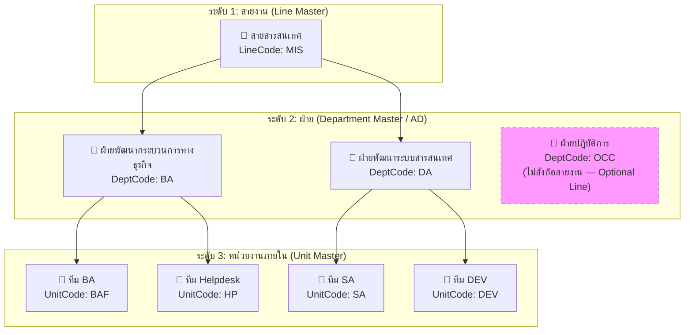

### 7.2 กฎการออกเลขตาม Running Scope

| Running Scope | เงื่อนไขการเลือกในฟอร์ม | รูปแบบ Pattern ที่ใช้ | Counter ระดับ | ตัวอย่างเลขที่ได้ |
|---|---|---|---|---|
| **Shared by Line** | เลือกหน่วยงานย่อยเป็น "ไม่ระบุ" | `{LineCode}-{YY}-{Running:000000}` | LINE Counter | `MIS-26-000001` |
| **Separate by Dept** | เลือกหน่วยงานย่อยเป็น "ไม่ระบุ" | `{DeptCode}-{YY}-{Running:000000}` | DEPT Counter | `OCC-26-000001` |
| **Unit Running** | เลือกหน่วยงานย่อย (เช่น ทีม BAF) | `{UnitCode}-{YY}-{Running:000000}` | UNIT Counter | `BAF-26-000001` |

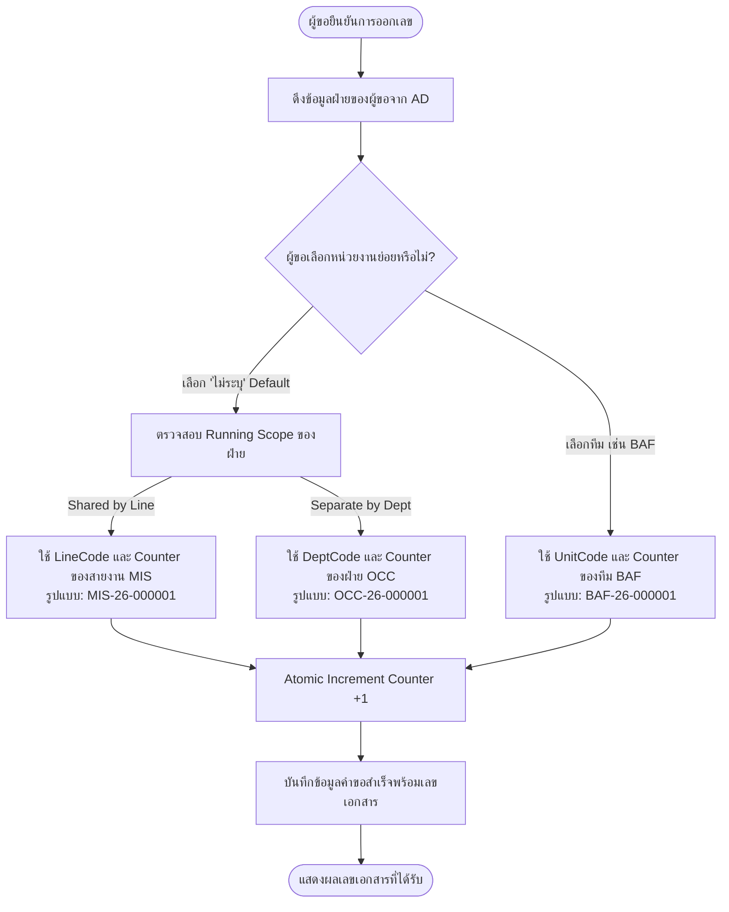

---

## 8. Use Case ภาพรวม

```mermaid
flowchart TB
    U([User / ผู้ขอเลข])
    A([Admin / ผู้ดูแลระบบ])

    subgraph SYS["EDR — ระบบขอเลขที่เอกสารบันทึกภายใน"]
        UC1[เข้าสู่ระบบ AD/Windows Auth]
        UC2[ดู Dashboard เลขบันทึกภายใน]
        UC3[สร้างคำขอเลขบันทึกภายใน]
        UC4[เลือกประเภทเอกสาร Searchable Dropdown]
        UC5[เพิ่มประเภทเอกสารด่วน Quick Add]
        UC6[กรอกและทดสอบ SharePoint URL]
        UC7[เลือกหน่วยงานย่อย ทีม]
        UC8[ยืนยัน Confirmation & ออกเลขทันที]
        UC9[ดูรายละเอียดคำขอ Detail & Timeline]
        UC10[แก้ไข SharePoint URL]
        UC11[ปิดเลขเอกสารพร้อมระบุเหตุผล Close]
        UC12[ค้นหาเอกสาร Search]
        UC13[ออกรายงาน & Export Excel]
        UC14[จัดการ Master สายงาน Lines]
        UC15[จัดการ Master หน่วยงานภายใน Units]
        UC16[จัดการ Master ผูกฝ่าย-สายงาน Departments]
        UC17[จัดการ ตัวย่อฝ่าย & Running Config]
        UC18[จัดการ Master ประเภทเอกสาร InternalDocTypes]
        UC19[Review รายการ Quick Add]
    end

    U --> UC1 & UC2 & UC3 & UC4 & UC5 & UC6 & UC7 & UC8 & UC9 & UC10 & UC11 & UC12 & UC13
    A --> UC1 & UC2 & UC9 & UC10 & UC11 & UC12 & UC13 & UC14 & UC15 & UC16 & UC17 & UC18 & UC19
```

---

## 9. กระบวนการหลัก End-to-End

### 9.1 Flow การขอสร้างเลขเอกสารบันทึกภายใน

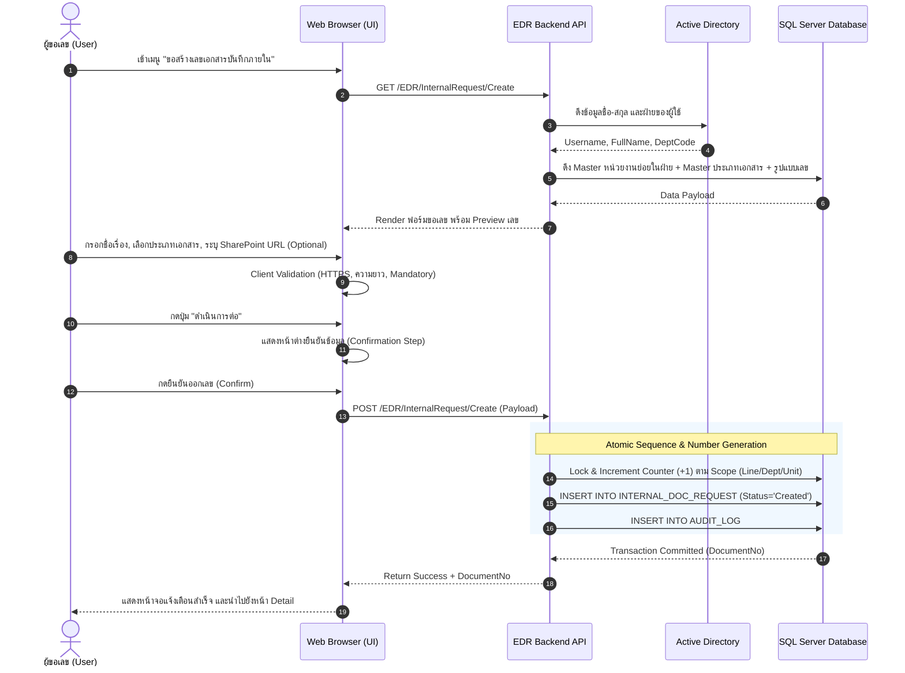

### 9.2 Sub-flow: Quick Add ประเภทเอกสาร

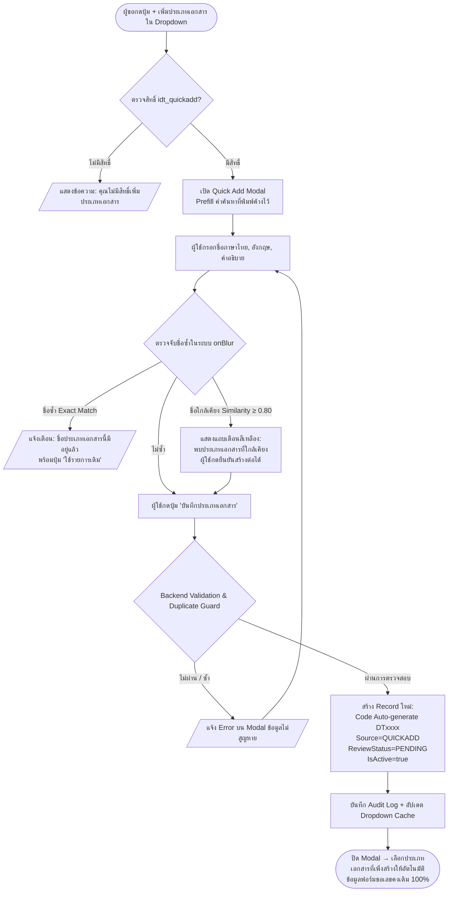

### 9.3 Lifecycle สถานะเลขเอกสารบันทึกภายใน

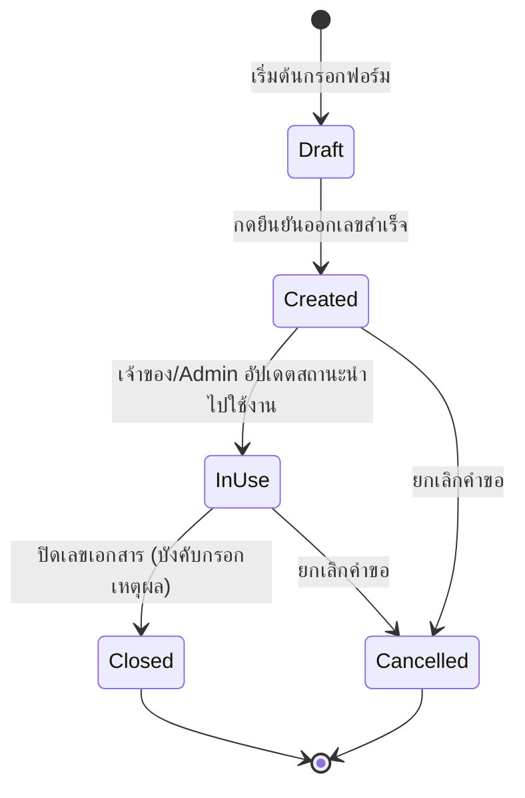

| สถานะ | ความหมายเชิงธุรกิจ | สิทธิ์การแก้ไขลิงค์ SharePoint | Action ที่สามารถทำได้ |
|---|---|---|---|
| `Draft` | กำลังกรอกข้อมูล ยังไม่ได้ออกเลข | — | บันทึก, ล้างข้อมูล, ยกเลิก |
| `Created` | ออกเลขสำเร็จแล้ว (สถานะเริ่มต้น) | ✓ (เจ้าของคำขอ และ Admin) | นำไปใช้งาน (`In Use`), ยกเลิก (`Cancelled`), แก้ไขลิงค์ |
| `In Use` | เลขเอกสารอยู่ระหว่างการใช้งาน | ✓ (เจ้าของคำขอ และ Admin) | ปิดเลข (`Closed`), ยกเลิก (`Cancelled`), แก้ไขลิงค์ |
| `Closed` | ปิดเลขเอกสารเรียบร้อยแล้ว (Terminal State) | ✗ (ไม่อนุญาตให้แก้ไข) | ดูรายละเอียด, พิมพ์รายงาน |
| `Cancelled` | ยกเลิกเลขเอกสาร (Terminal State) | ✗ (ไม่อนุญาตให้แก้ไข) | ดูรายละเอียด |

---

## 10. Data Model และ Field Specification

### 10.1 รูปแบบ Token ที่รองรับใน Pattern เลขเอกสาร

| Token | ความหมาย | ตัวอย่างผลลัพธ์ |
|---|---|---|
| `{LineCode}` | รหัสสายงานจาก Master สายงาน | `MIS`, `HR` |
| `{DeptCode}` | รหัสฝ่ายจาก Master ตัวย่อฝ่าย | `BA`, `DA`, `OCC` |
| `{UnitCode}` | รหัสหน่วยงานภายในจาก Master หน่วยงานย่อย | `BAF`, `DEV`, `SA` |
| `{YY}` | ปี ค.ศ. 2 หลักท้าย | `26` (สำหรับปี 2026) |
| `{YYYY}` | ปี ค.ศ. 4 หลัก | `2026` |
| `{ThaiYear}` | ปี พ.ศ. 4 หลัก | `2569` |
| `{ThaiYear2}` | ปี พ.ศ. 2 หลักท้าย | `69` |
| `{Running:000000}` | ลำดับ Running พร้อมเติม 0 ข้างหน้าตามจำนวนหลักที่กำหนด | `000001`, `000042` |

---

## 11. Specification รายหน้าจอพร้อมภาพประกอบจริง

### 11.1 หน้าจอเข้าสู่ระบบ (Login Screen)

ระบบ EDR รองรับการยืนยันตัวตนผ่าน Active Directory (AD) / Windows Authentication โดยผู้ใช้กรอก Username และ Password ขององค์กรเพื่อเข้าใช้งาน

- **URL:** `/EDR/Account/Login`
- **Fields:** Username (Mandatory), Password (Mandatory), Remember Me (Checkbox)
- **พฤติกรรม:** เมื่อเข้าสู่ระบบสำเร็จ ระบบจะดึงข้อมูลฝ่ายและสิทธิ์ของผู้ใช้เพื่อกำหนดหน้าหลักและเมนูที่แสดง

---

### 11.2 หน้าจอหลักและ Dashboard (Dashboard Screen)

หน้าจอหลักของระบบ EDR แสดงเมนูนำทางด้านซ้าย สรุปสถิติคำขอเอกสาร และรายการคำขอล่าสุด

- **URL:** `/EDR`
- **เมนูนำทางหลัก:**
  - `หน้าหลัก` (`/EDR`)
  - `ขอสร้างเลขพิเศษ` (`/EDR/DocumentRequest?type=Special`)
  - `ขอสร้างเลขธรรมดา` (`/EDR/DocumentRequest?type=General`)
  - `ขอสร้างเลขเอกสารบันทึกภายใน` (`/EDR/InternalRequest`) *(เมนูใหม่)*
  - `อนุมัติเอกสาร` (`/EDR/Approval`) *(เฉพาะเลขภายนอก)*
  - `ค้นหาเอกสาร` (`/EDR/Search`)
  - `รายงาน` (`/EDR/Report`)
  - `ตั้งค่าระบบ` (สำหรับ Admin)
- **Summary Cards:** แสดงจำนวนคำขอทั้งหมด, รายการที่สร้างแล้ว, รายการที่ใช้งานอยู่, และรายการที่ปิดแล้ว

---

### 11.3 หน้ารายการขอสร้างเลขเอกสารบันทึกภายใน (Internal Request Index)

ตารางแสดงรายการคำขอเลขที่เอกสารบันทึกภายในทั้งหมด โดยผู้ใช้ทั่วไปจะเห็นเฉพาะคำขอของตนเอง ส่วน Admin ฝ่ายจะเห็นคำขอของทุกคนในฝ่าย 100% และ SuperAdmin จะเห็นคำขอทั่วทั้งองค์กร ในตารางมีคอลัมน์แสดงสถานะ เหตุผลการยกเลิก และ **ปุ่มคัดลอกเลขที่เอกสาร (One-Click Copy)** ประจำแต่ละแถว

- **URL:** `/EDR/InternalRequest` หรือ `/EDR/InternalRequest/Index`
- **ปุ่ม Action ด้านบน:** ปุ่ม `+ ขอสร้างเลขเอกสารบันทึกภายใน` สำหรับเปิดฟอร์มสร้างคำขอใหม่
- **คอลัมน์ในตาราง:** เลขที่เอกสาร (พร้อมปุ่ม Copy), วันที่ขอ, ชื่อเรื่อง, ฝ่าย/หน่วยงานย่อย, ผู้ขอ, ลิงค์ SharePoint, วันที่สร้าง, สถานะ (สร้างแล้ว / ใช้งาน / ยกเลิก / ปิดแล้ว), เหตุผลการยกเลิก (ถ้ามี), และปุ่มดูรายละเอียด (`Detail`)

---

### 11.4 หน้าฟอร์มขอสร้างเลขเอกสารบันทึกภายใน (Create Internal Request Form)

ฟอร์มสำหรับกรอกข้อมูลคำขอสร้างเลขเอกสารบันทึกภายใน **[CR V3.3.0: ตัดฟิลด์ประเภทเอกสารออกทั้งหมดเพื่อความคล่องตัวสูงสุด]** กรอกเฉพาะชื่อเรื่อง เลือกหน่วยงานย่อย (ถ้ามี) และระบุลิงก์เอกสารอ้างอิง SharePoint

- **URL:** `/EDR/InternalRequest/Create`
- **โครงสร้างฟิลด์:**
  1. **ชื่อเรื่อง (Subject) [Mandatory]:** กล่องข้อความกรอกชื่อเรื่องเอกสาร
  2. **ลิงค์เอกสาร SharePoint (DocumentUrl) [Optional]:** กล่องข้อความกรอก URL พร้อมปุ่มทดสอบเปิดลิงค์
  3. **หมายเหตุ (Remark) [Optional]:** กล่องข้อความรายละเอียดเพิ่มเติม
  4. **หน่วยงานย่อย (ทีม) (UnitId) [Optional]:** Dropdown เลือกทีมในฝ่ายของผู้ขอ (Default = "ไม่ระบุ")
  5. **ผู้ขอ / ฝ่าย / สายงาน:** แสดงข้อมูลอัตโนมัติจาก AD และ Master Hierarchy (Read-only)
  6. **Real-time Running Preview:** แสดงรูปแบบเลขที่จะได้รับทันทีก่อนกดยืนยัน

#### ตัวอย่างการกรอกฟอร์มขอเลขบันทึกภายใน (Create Form Filled)
ผู้ใช้กรอกชื่อเรื่อง เลือกลำดับหน่วยงานย่อย และระบุลิงก์ SharePoint ที่ขึ้นต้นด้วย `https://`

---

### 11.5 [ยกเลิกการใช้งานตาม CR V3.3.0 — Deprecated / Removed] ประเภทเอกสารและ Quick Add Modal

> **สถานะเชิงข้อกำหนด (CR V3.3.0):** **ยกเลิกการใช้งาน (Deprecated / Removed)** — ตัดฟังก์ชัน Searchable Dropdown เลือกประเภทเอกสาร และ Quick Add Modal ออกจากระบบขอเลขบันทึกภายในทั้งหมด ผู้ขอไม่ต้องเลือกประเภทเอกสารอีกต่อไป

#### ภาพหน้าจอเดิมก่อนปรับปรุง (Historical Reference)
- **Searchable Dropdown เดิม:**  
  
- **Quick Add Modal เดิม:**  
  

---

### 11.6 หน้ายืนยันข้อมูลก่อนออกเลข และแจ้งเตือนสำเร็จ (Confirmation Step & Success Modal)

#### 1) Modal ยืนยันข้อมูลคำขอ (Confirmation Modal)
เมื่อผู้ขอกรอกข้อมูลครบและกดปุ่ม "ดำเนินการต่อ" ระบบจะแสดง Modal ให้ตรวจสอบข้อมูลซ้ำก่อนกดยืนยันออกเลขจริง

#### 2) หน้าต่างแจ้งเตือนสำเร็จพร้อมปุ่มคัดลอกเลข (Success Dialog & One-Click Copy)
เมื่อกดยืนยัน ระบบจะทำ Atomic Counter Lock ออกเลขเอกสารให้ทันที (No Approval) และแสดง Modal สำเร็จพร้อม **ปุ่มคัดลอกเลขที่เอกสาร (One-Click Copy)** เพื่อให้ผู้ขอกดคัดลอกเลขลง Clipboard ได้ทันทีในคลิกเดียว

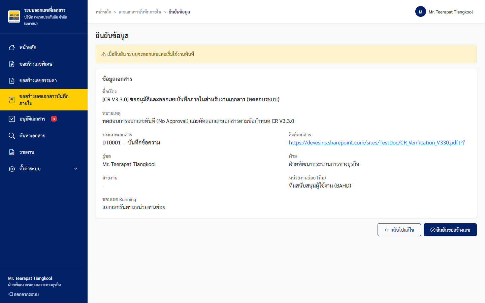

---

### 11.7 หน้ารายละเอียดคำขอเลขที่เอกสารภายใน (Internal Request Detail Screen)

หน้าจอแสดงข้อมูลคำขอที่ออกเลขสำเร็จแล้ว แสดงสถานะปัจจุบัน เลขที่เอกสารพร้อมปุ่ม Copy, ลิงค์ SharePoint, ปุ่มแก้ไขลิงค์พร้อม Audit Log, ปุ่มปิดเลขเอกสาร และปุ่มขอยกเลิกเอกสาร

- **URL:** `/EDR/InternalRequest/Detail/{id}`
- **ฟังก์ชันสำคัญ:**
  - **ปุ่มคัดลอกเลข (One-Click Copy):** ปุ่มข้างเลขที่เอกสาร (`.js-copy-link`) คลิกแล้วคัดลอกเลขลง System Clipboard ทันที
  - **การจัดการลิงก์ SharePoint พร้อม Audit Log:** คลิกปุ่ม `เพิ่มลิงค์` หรือ `แก้ไข` เพื่อปรับปรุงลิงก์เอกสาร ระบบจะบันทึกประวัติการแก้ไขลง Audit Log ทันที
  - **ปุ่มปิดเลขเอกสาร (`Close Document`):** เปิด Modal เพื่อระบุเหตุผลและยืนยันการปิดเลข
  - **ปุ่มยกเลิกเอกสาร (`Cancel Document`):** เปิด Modal บังคับระบุเหตุผลการยกเลิกพร้อมบันทึก Audit Log

#### กล่องแก้ไขลิงก์ SharePoint บนหน้า Detail
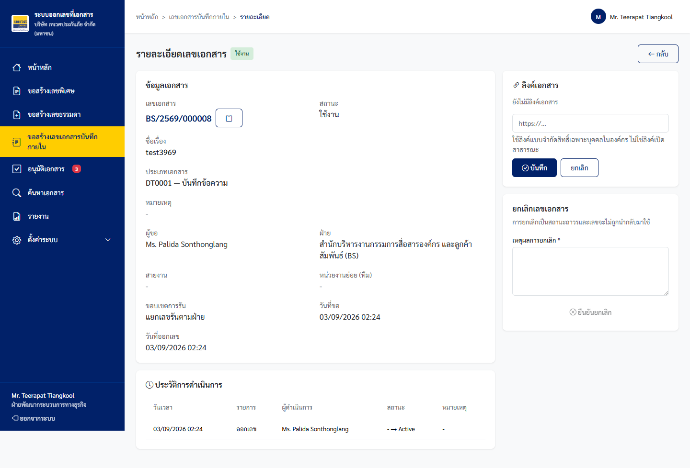

#### Modal ขอยกเลิกเอกสารพร้อมบังคับระบุเหตุผล (Cancel Document Modal)
ตามข้อกำหนด CR V3.3.0 การยกเลิกเอกสารจะต้องระบุเหตุผลความจำเป็นบังคับทุกครั้ง และระบบจะบันทึก Audit Log พร้อมแสดงเหตุผลในตารางรายการ

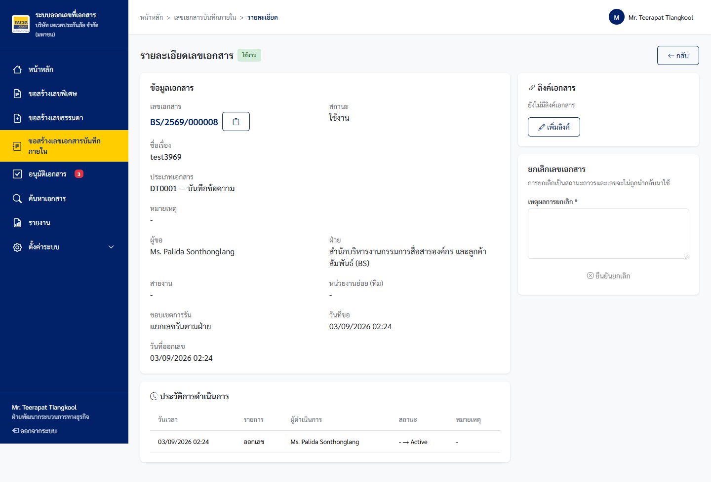

#### Modal ปิดเลขเอกสาร (Close Document Modal)

---

### 11.7 หน้าค้นหาเอกสาร (Search Screen)

หน้าจอค้นหาเอกสารครอบคลุมทั้งเอกสารภายนอก (พิเศษ/ธรรมดา) และเอกสารบันทึกภายใน พร้อมตัวกรองหลากหลายมิติ

- **URL:** `/EDR/Search`
- **ตัวกรองที่รองรับ:**
  - ประเภทคำขอ (ทั้งหมด / เลขพิเศษ / เลขธรรมดา / เลขบันทึกภายใน)
  - เลขที่เอกสาร, ชื่อเรื่อง, ผู้ขอ
  - ฝ่าย / สายงาน / หน่วยงานย่อย
  - ประเภทเอกสารบันทึกภายใน
  - ช่วงวันที่ขอเอกสาร (จากวันที่ - ถึงวันที่)
  - สถานะเอกสาร

---

### 11.8 หน้ารายงานและส่งออก Excel (Report Screen)

หน้าจอรายงานสรุปการออกเลขเอกสาร พร้อมความสามารถในการส่งออกข้อมูลเป็นไฟล์ Excel (.xlsx)

- **URL:** `/EDR/Report`
- **ความสามารถหลัก:**
  - เลือกประเภทรายงาน (เลขเอกสารบันทึกภายใน / เลขเอกสารภายนอก)
  - กรองตามช่วงวันที่, ฝ่าย, สายงาน, ประเภทเอกสาร
  - แสดงตารางข้อมูลสรุปพร้อมคอลัมน์ลิงค์ SharePoint URL
  - ปุ่ม `Export Excel` เพื่อดาวน์โหลดรายงานสำหรับงานตรวจสอบ Audit

---

### 11.9 หน้าจัดการ Master สายงาน (Master Lines Screen)

หน้าจอสำหรับ Admin ในการบริหารจัดการ Master สายงาน (Line) ภายใต้โครงสร้าง Hierarchy ระดับที่ 1

- **URL:** `/EDR/Settings/Lines`
- **ฟังก์ชัน:** เพิ่มสายงานใหม่, แก้ไขชื่อและรหัส LineCode, เปิด/ปิดสถานะการใช้งาน (Active/Inactive), และตรวจสอบจำนวนฝ่ายที่สังกัด
- **กฎการลบ:** ไม่อนุญาตให้ลบสายงานที่มีฝ่ายสังกัดอยู่ เพื่อป้องกันข้อมูลกำพร้า

---

### 11.10 หน้าจัดการ Master หน่วยงานภายใน (Master Units Screen)

หน้าจอสำหรับ Admin ในการบริหารจัดการหน่วยงานย่อย/ทีม (Unit) ภายใต้โครงสร้าง Hierarchy ระดับที่ 3

- **URL:** `/EDR/Settings/Units`
- **ฟังก์ชัน:** เพิ่มหน่วยงานย่อย, กำหนด UnitCode, เลือกฝ่ายที่สังกัด, เปิด/ปิดสถานะการใช้งาน
- **ผลต่อฟอร์มขอเลข:** เฉพาะหน่วยงานย่อยที่ Active และผูกกับฝ่ายของผู้ขอเท่านั้นที่จะปรากฏใน Dropdown บนฟอร์มขอเลข

---

### 11.11 หน้าจอผูกฝ่ายกับสายงาน (Master Departments Mapping)

หน้าจอสำหรับ Admin ในการจับคู่ฝ่าย (Department จาก AD) เข้ากับสายงาน (Line)

- **URL:** `/EDR/Settings/Departments`
- **ฟังก์ชัน:** เลือกสายงานให้แก่แต่ละฝ่าย เพื่อให้ระบบสามารถระบุสายงานต้นสังกัดได้โดยอัตโนมัติเมื่อผู้ใช้ขอเลขเอกสาร

---

### 11.12 หน้าจอจัดการตัวย่อฝ่ายและ Running Config (Department Codes & Running Settings)

หน้าจอสำหรับ Admin ในการกำหนด Running Scope, Pattern Template, จำนวนหลัก Running Digit, และ Running Counter ของแต่ละฝ่าย

- **URL:** `/EDR/Settings/DepartmentCodes`
- **ฟิลด์ตั้งค่าสำหรับ Internal:**
  - `สายงาน (Line)`: Dropdown เลือกสายงาน
  - `Running Scope`: เลือกระหว่าง `Shared by Line`, `Separate by Dept`, หรือ `Unit Running`
  - `Pattern Template (บันทึกภายใน)`: เช่น `{LineCode}-{YY}-{Running:000000}`
  - `จำนวนหลัก Running`: เช่น 6 หลัก
  - `รูปแบบปี`: `YY` / `YYYY` / `ThaiYear`
  - `Current Counter`: ค่า Running ปัจจุบัน

---

### 11.13 หน้าจอจัดการรูปแบบเลขเอกสารภายใน (Internal Number Formats)

หน้าจอแสดงรายการ Format เลขที่เอกสารบันทึกภายในที่เปิดใช้งานของแต่ละฝ่ายและสายงาน

- **URL:** `/EDR/Settings/InternalNumberFormats`
- **Modal แก้ไขรูปแบบเลข:**

- **ฟังก์ชัน:** ปรับแก้ Pattern Template, สถานะเปิด/ปิดใช้งาน, พร้อมแสดงตัวอย่าง Preview เลข Real-time

---

### 11.14 หน้าจอจัดการ Master ประเภทเอกสาร (Master Internal Document Types)

หน้าจอสำหรับ Admin ในการจัดการประเภทเอกสารบันทึกภายในทั้งระบบ พร้อมระบบ Review รายการที่ถูกสร้างมาจาก Quick Add

- **URL:** `/EDR/Settings/InternalDocumentTypes`
- **Modal เพิ่มประเภทเอกสาร:**

- **ฟังก์ชัน:**
  - เพิ่ม/แก้ไข/เปิด-ปิดใช้งานประเภทเอกสาร
  - คอลัมน์ `Source`: แสดง `MASTER` หรือ `QUICKADD`
  - คอลัมน์ `สถานะการตรวจสอบ`: แสดง `PENDING` (รอตรวจ) หรือ `REVIEWED` (ตรวจแล้ว)
  - ตรวจสอบ `UsageCount` ก่อนอนุญาตให้ลบหรือแก้ไขรหัส

---

## 12. Business Rules Catalog (สำหรับทดสอบ)

### 12.1 กลุ่ม RL-CORE — กระบวนการหลักขอเลขและ Lifecycle

| Rule ID | รายละเอียดเงื่อนไขทางธุรกิจ | เงื่อนไข (Condition) | ผลลัพธ์ที่คาดหวัง (Expected Outcome) | HTTP Status |
|---|---|---|---|---|
| **RL-CORE-01** | ผู้ขอไม่กรอกชื่อเรื่อง | ชื่อเรื่อง (Subject) ว่าง | บล็อกการส่งฟอร์ม แสดง Error "กรุณาระบุชื่อเรื่อง" | 422 |
| **RL-CORE-02** | ไม่พบข้อมูลฝ่ายจาก AD | Active Directory ไม่ส่งข้อมูลฝ่าย | บล็อกการออกเลข แสดง "ไม่พบข้อมูลฝ่าย กรุณาติดต่อผู้ดูแลระบบ" | 422 |
| **RL-CORE-03** | ไม่พบ Format ที่ Active | ฝ่ายไม่มีรูปแบบเลขที่ Active ใน Master | แสดง "ไม่พบรูปแบบเลขเอกสาร กรุณาติดต่อ Admin" และไม่อนุญาตให้ออกเลข | 422 |
| **RL-CORE-04** | ออกเลขสำเร็จทันที | ข้อมูลครบถ้วน และกดยืนยัน Confirmation | สร้างเลขทันที บันทึกสถานะ `Created` ไม่ปรากฏใน Approval Queue | 201 |
| **RL-CORE-05** | ป้องกันเลขซ้ำ Race Condition | มีการขอเลขพร้อมกันจากหลายคำขอ | DB Lock / Sequence ทำงานแบบ Atomic รับประกันเลขเรียงลำดับไม่ซ้ำ | 201 |
| **RL-CORE-06** | ปิดเลขโดยไม่ระบุเหตุผล | เหตุผลการปิด (CloseReason) ว่าง | ปุ่มยืนยัน Disabled และแสดงข้อความเตือน "กรุณาระบุเหตุผลการปิดเลข" | 422 |
| **RL-CORE-07** | ปิดเลขที่สถานะ Closed อยู่แล้ว | คำขอมีสถานะ `Closed` อยู่แล้ว | ซ่อนปุ่มปิดเลข และตอบกลับ HTTP 409 หากเรียก API ตรง | 409 |
| **RL-CORE-08** | ความคงอยู่ของเลขเอกสารเดิม | มีการเปลี่ยน Pattern หรือ Counter ใน Master | เลขเอกสารเดิมที่ออกไปแล้วยังคงรหัสเดิม 100% | 200 |

### 12.2 กลุ่ม RL-HIER — Hierarchy Master & Running Scopes

| Rule ID | รายละเอียดเงื่อนไขทางธุรกิจ | เงื่อนไข (Condition) | ผลลัพธ์ที่คาดหวัง (Expected Outcome) | HTTP Status |
|---|---|---|---|---|
| **RL-HIER-01** | LineCode ซ้ำในระบบ | กรอกรหัสสายงานที่มีอยู่แล้ว | บล็อกการบันทึก แสดง "รหัสสายงานนี้มีอยู่ในระบบแล้ว" | 409 |
| **RL-HIER-02** | ลบสายงานที่มีฝ่ายสังกัดอยู่ | มีฝ่ายในระบบอ้างอิง LineId นี้ | บล็อกการลบ แสดง "ไม่สามารถลบได้ มีฝ่ายที่สังกัดอยู่ N ฝ่าย" | 409 |
| **RL-HIER-03** | UnitCode ซ้ำในระบบ | กรอกรหัสหน่วยงานย่อยที่มีอยู่แล้ว | บล็อกการบันทึก แสดง "รหัสหน่วยงานนี้มีอยู่ในระบบแล้ว" | 409 |
| **RL-HIER-04** | ลบหน่วยงานย่อยที่มีคำขอใช้งาน | UnitId ถูกใช้ในคำขอเลขแล้ว | บล็อกการลบ แสดง "ไม่สามารถลบได้ มีเลขเอกสารอ้างอิงอยู่" | 409 |
| **RL-HIER-05** | Running Scope Shared by Line | Scope=LINE, เลือกทีม "ไม่ระบุ" | ออกเลขโดยใช้ LineCode และ Counter ระดับสายงาน (เช่น `MIS-26-xxxxxx`) | 201 |
| **RL-HIER-06** | Running Scope Separate by Dept | Scope=DEPT, เลือกทีม "ไม่ระบุ" | ออกเลขโดยใช้ DeptCode และ Counter ระดับฝ่าย (เช่น `OCC-26-xxxxxx`) | 201 |
| **RL-HIER-07** | Running Scope Unit Running | เลือกหน่วยงานย่อย (เช่น BAF) | ออกเลขโดยใช้ UnitCode และ Counter ของทีมนั้น (เช่น `BAF-26-xxxxxx`) | 201 |
| **RL-HIER-08** | Dropdown ทีมซ่อนเมื่อไม่มีทีม | ฝ่ายของผู้ขอไม่มีหน่วยงานย่อยที่ Active | ไม่แสดง Dropdown หน่วยงานย่อยบนฟอร์มขอเลข | 200 |

### 12.3 กลุ่ม RL-IDT — Master ประเภทเอกสาร

| Rule ID | รายละเอียดเงื่อนไขทางธุรกิจ | เงื่อนไข (Condition) | ผลลัพธ์ที่คาดหวัง (Expected Outcome) | HTTP Status |
|---|---|---|---|---|
| **RL-IDT-01** | สร้าง Master ประเภทเอกสารสำเร็จ | Code และ NameTh ครบถ้วน ไม่ซ้ำ | บันทึกสำเร็จ `Source=MASTER`, `ReviewStatus=REVIEWED` | 201 |
| **RL-IDT-02** | แก้ไขรหัสประเภทเอกสารที่มีการใช้งาน | UsageCount ≥ 1 | บล็อกการแก้ไขรหัส แสดง "ไม่สามารถแก้ไขรหัสได้เนื่องจากมีการใช้งานแล้ว" | 409 |
| **RL-IDT-03** | DocTypeCode ซ้ำ (Case-insensitive) | กรอกรหัสประเภทเอกสารซ้ำ | แสดง "รหัสประเภทเอกสารนี้มีอยู่ในระบบแล้ว" | 409 |
| **RL-IDT-04** | ชื่อไทยซ้ำ (Trim + Case-insensitive) | กรอกชื่อภาษาไทยซ้ำ | แสดง "ชื่อประเภทเอกสาร (ไทย) นี้มีอยู่ในระบบแล้ว" | 409 |
| **RL-IDT-05** | ปิดใช้งานประเภทเอกสารที่มีการอ้างอิง | UsageCount ≥ 1 และกดปิดสถานะ | บันทึก Inactive สำเร็จ, ใน Dropdown ไม่แสดง, ข้อมูลประวัติยังแสดงชื่อเดิม | 200 |
| **RL-IDT-06** | ลบประเภทเอกสารที่ UsageCount > 0 | มีคำขออ้างอิงประเภทเอกสารนี้ | บล็อกการลบ แสดง "ไม่สามารถลบได้ มีคำขอใช้งานอยู่" | 409 |
| **RL-IDT-07** | ลบประเภทเอกสารที่เป็น System Record | `IsSystemRecord = 1` | บล็อกการลบ แสดง "ไม่สามารถลบรายการระบบได้" | 409 |

### 12.4 กลุ่ม RL-QA — Quick Add ประเภทเอกสาร

| Rule ID | รายละเอียดเงื่อนไขทางธุรกิจ | เงื่อนไข (Condition) | ผลลัพธ์ที่คาดหวัง (Expected Outcome) | HTTP Status |
|---|---|---|---|---|
| **RL-QA-01** | สิทธิ์ Quick Add แสดงปุ่ม | ผู้ใช้มีสิทธิ์ `idt_quickadd` | แสดงปุ่ม "+ เพิ่มประเภทเอกสาร" ใน Searchable Dropdown | 200 |
| **RL-QA-02** | ไม่มีสิทธิ์ Quick Add | ผู้ใช้ไม่มีสิทธิ์ `idt_quickadd` | ซ่อนปุ่ม และแสดงข้อความแนะนำให้ติดต่อ Admin | 200 |
| **RL-QA-03** | Quick Add ชื่อซ้ำ Exact Match | กรอกชื่อภาษาไทยซ้ำกับในระบบ | บล็อกการบันทึก แสดงข้อความเตือนพร้อมปุ่ม "ใช้รายการเดิม" | 409 |
| **RL-QA-04** | Quick Add ชื่อใกล้เคียง (Similarity) | ความคล้ายคลึง ≥ 0.80 | แสดง Soft Warning แจ้งเตือนรายการที่ใกล้เคียง แต่ยอมให้กดยืนยันสร้างได้ | 200 |
| **RL-QA-05** | Quick Add สำเร็จและ Auto-select | ข้อมูลถูกต้อง บันทึกสำเร็จ | ปิด Modal, เพิ่มใน Dropdown, เลือกค่าใหม่อัตโนมัติ, ฟอร์มคงข้อมูลเดิม | 201 |
| **RL-QA-06** | ป้องกันการกดบันทึกซ้ำ (Double Submit) | ผู้ใช้กดปุ่มบันทึกรัวๆ | Disable ปุ่มทันที + แสดง Spinner ป้องกันสร้าง Record ซ้ำ | 200 |

### 12.5 กลุ่ม RL-URL — ลิงค์เอกสาร SharePoint URL

| Rule ID | รายละเอียดเงื่อนไขทางธุรกิจ | เงื่อนไข (Condition) | ผลลัพธ์ที่คาดหวัง (Expected Outcome) | HTTP Status |
|---|---|---|---|---|
| **RL-URL-01** | URL ผิดรูปแบบมาตรฐาน | กรอกข้อความที่ไม่ใช่ URL ตาม RFC 3986 | แสดง Error "ลิงค์ไม่ถูกต้อง กรุณากรอก URL ที่ขึ้นต้นด้วย https://" | 422 |
| **RL-URL-02** | URL ใช้โปรโตคอล HTTP | กรอก `http://...` | บล็อกการบันทึก บังคับใช้เฉพาะ `https://` เท่านั้น | 422 |
| **RL-URL-03** | ความยาว URL เกิน 2,000 ตัวอักษร | กรอก URL ยาว 2,001 ตัวอักษรขึ้นไป | แสดง Error "ลิงค์เอกสารต้องไม่เกิน 2,000 ตัวอักษร" | 422 |
| **RL-URL-04** | แก้ไขลิงค์ในสถานะ Terminal State | คำขอมีสถานะ `Closed` หรือ `Cancelled` | ไม่อนุญาตให้แก้ไขลิงค์, ซ่อนปุ่มแก้ไข, API ตอบกลับ 403 | 403 |
| **RL-URL-05** | เจ้าของคำขอแก้ไขลิงค์ในสถานะปกติ | คำขอสถานะ `Created` หรือ `In Use` | บันทึกสำเร็จ + บันทึก Audit Log (User, วันเวลา, URL เดิม, URL ใหม่) | 200 |
| **RL-URL-06** | ลิงค์เป็น Optional Field | ผู้ขอไม่กรอก URL | บันทึกสำเร็จโดยค่าในฟิลด์ `DocumentUrl` เป็น `NULL` | 201 |

---

## 13. Validation Rules (กฎการตรวจสอบความถูกต้อง)

### 13.1 ฟอร์มขอสร้างเลขเอกสารบันทึกภายใน

| VR ID | ฟิลด์ข้อมูล | กฎการตรวจสอบ (Validation Rule) | ข้อความแจ้งเตือน (Error Message) | ระดับความรุนแรง | Trigger Event |
|---|---|---|---|---|---|
| **VR-01** | ชื่อเรื่อง (Subject) | Mandatory, ความยาว 1–250 ตัวอักษร | "กรุณาระบุชื่อเรื่อง" | Error | onBlur, Submit |
| **VR-02** | ประเภทเอกสาร (DocTypeId) | Mandatory, ต้องเลือกจาก Dropdown | "กรุณาเลือกประเภทเอกสาร" | Error | Submit, ดำเนินการต่อ |
| **VR-03** | ประเภทเอกสาร (Security) | ต้องเป็น DocTypeId ที่ Active จริงในฐานข้อมูล | "ประเภทเอกสารที่เลือกไม่ถูกต้องหรือถูกปิดใช้งาน" | Error | Backend Submit |
| **VR-04** | หน่วยงานย่อย (UnitId) | ต้องเป็น UnitId ที่ Active และสังกัดฝ่ายผู้ขอ (ถ้าเลือก) | "หน่วยงานย่อยที่เลือกไม่ถูกต้อง" | Error | Backend Submit |
| **VR-10** | ลิงค์เอกสาร (DocumentUrl) | ต้องขึ้นต้นด้วย `https://` และถูกต้องตาม RFC 3986 | "ลิงค์เอกสารไม่ถูกต้อง กรุณากรอก URL ที่ขึ้นต้นด้วย https://" | Error | onBlur, Submit |
| **VR-12** | ความยาวลิงค์เอกสาร | ความยาวหลังตัดช่องว่าง ≤ 2,000 ตัวอักษร | "ลิงค์เอกสารต้องไม่เกิน 2,000 ตัวอักษร" | Error | onInput, Submit |
| **VR-13** | ตัดช่องว่าง URL | ตัดช่องว่างหัว-ท้ายและ Control Characters อัตโนมัติ | — (Auto-trim) | Info | ก่อน Validate |
| **VR-14** | คำเตือนสิทธิ์ลิงค์ | ตรวจสอบว่าไม่ใช่ Anonymous Public Link | "คำเตือน: กรุณาตรวจสอบว่าลิงค์นี้จำกัดสิทธิ์เฉพาะบุคคลในองค์กร" | Warning | onBlur |

### 13.2 Master ประเภทเอกสาร & Quick Add

| VR ID | ฟิลด์ข้อมูล | กฎการตรวจสอบ (Validation Rule) | ข้อความแจ้งเตือน (Error Message) | ระดับความรุนแรง | Trigger Event |
|---|---|---|---|---|---|
| **VR-IDT-01** | DocTypeCode | Mandatory, ตัวอักษร A-Z 0-9 - _ สูงสุด 20 ตัวอักษร | "กรุณากรอกรหัสประเภทเอกสาร" | Error | onBlur, Submit |
| **VR-IDT-02** | DocTypeCode (Format) | Upper-case อัตโนมัติ, ห้ามมีช่องว่างหรืออักขระพิเศษ | "รหัสใช้ได้เฉพาะตัวอักษร A–Z ตัวเลข 0–9 ขีด (-) ขีดล่าง (_)" | Error | onBlur, Submit |
| **VR-IDT-03** | DocTypeCode (Unique) | ห้ามซ้ำกันในระบบ (Case-insensitive) | "รหัสประเภทเอกสารนี้มีอยู่ในระบบแล้ว" | Error | Backend Submit |
| **VR-IDT-04** | DocTypeNameTh | Mandatory, ความยาว ≤ 150 ตัวอักษร | "กรุณากรอกชื่อประเภทเอกสาร (ภาษาไทย)" | Error | onBlur, Submit |
| **VR-IDT-05** | DocTypeNameTh (Unique) | ห้ามซ้ำกันในระบบ (Trim + ยุบช่องว่างซ้ำ) | "ชื่อประเภทเอกสาร (ไทย) นี้มีอยู่ในระบบแล้ว" | Error | Backend Submit |
| **VR-IDT-06** | DocTypeNameEn | Optional, ความยาว ≤ 150 ตัวอักษร | "ชื่อ (อังกฤษ) ต้องไม่เกิน 150 ตัวอักษร" | Error | onInput, Submit |
| **VR-IDT-07** | Description | Optional, ความยาว ≤ 500 ตัวอักษร | "คำอธิบายต้องไม่เกิน 500 ตัวอักษร" | Error | onInput, Submit |
| **VR-IDT-08** | Similarity Warning | ตรวจจับชื่อคล้ายกัน (Similarity ≥ 0.80) | "พบประเภทเอกสารที่มีชื่อใกล้เคียง: [รายชื่อ] ต้องการสร้างใหม่หรือใช้รายการเดิม?" | Warning | onBlur (Quick Add) |

### 13.3 Master Hierarchy & Running Config

| VR ID | ฟิลด์ข้อมูล | กฎการตรวจสอบ (Validation Rule) | ข้อความแจ้งเตือน (Error Message) | ระดับความรุนแรง | Trigger Event |
|---|---|---|---|---|---|
| **VR-HIER-01** | LineCode | Mandatory, A-Z 0-9 - _, Unique | "รหัสสายงานนี้มีอยู่ในระบบแล้ว" | Error | Submit |
| **VR-HIER-02** | UnitCode | Mandatory, A-Z 0-9 - _, Unique | "รหัสหน่วยงานนี้มีอยู่ในระบบแล้ว" | Error | Submit |
| **VR-HIER-03** | DeptId (ของ Unit) | ต้องเลือกฝ่ายที่มีสถานะ Active | "ฝ่ายที่เลือกไม่ถูกต้องหรือถูกปิดใช้งาน" | Error | Submit |
| **VR-HIER-04** | Pattern Template | Token ต้องถูกต้องและสามารถ Parse ได้ | "รูปแบบเลขไม่ถูกต้อง กรุณาตรวจสอบ Token" | Error | onBlur, Submit |
| **VR-HIER-05** | Pattern Scope LINE | ต้องมี Token `{LineCode}` ใน Pattern | "Running Scope Shared by Line ต้องมี Token {LineCode}" | Error | Submit |
| **VR-HIER-06** | Pattern Scope DEPT | ต้องมี Token `{DeptCode}` ใน Pattern | "Running Scope Separate by Dept ต้องมี Token {DeptCode}" | Error | Submit |
| **VR-HIER-07** | Running Digit | ต้องเป็นตัวเลขจำนวนเต็มที่มากกว่า 0 | "จำนวนหลัก Running ต้องมากกว่า 0" | Error | onBlur, Submit |

### 13.4 ปิดเลขเอกสาร (Close Document)

| VR ID | ฟิลด์ข้อมูล | กฎการตรวจสอบ (Validation Rule) | ข้อความแจ้งเตือน (Error Message) | ระดับความรุนแรง | Trigger Event |
|---|---|---|---|---|---|
| **VR-CLOSE-01** | เหตุผลการปิด | Mandatory, ความยาว 1–500 ตัวอักษร | "กรุณาระบุเหตุผลการปิดเลข" | Error | Submit Modal |
| **VR-CLOSE-02** | สถานะคำขอ | ต้องมีสถานะเป็น `In Use` หรือ `Created` | "เลขนี้ถูกปิดหรือยกเลิกไปแล้ว" | Error | Backend Submit |

---

## 14. Non-Functional Requirements (NFR)

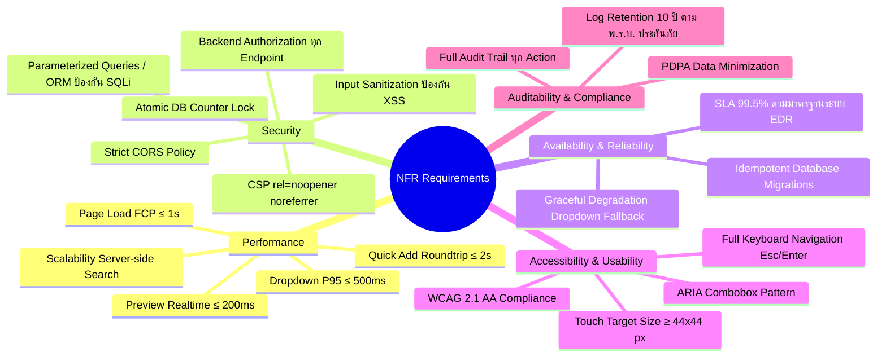

| NFR ID | หมวดหมู่ | ข้อกำหนด (Requirement) | เกณฑ์การวัดผล (Metric / Acceptance Criteria) |
|---|---|---|---|
| **NFR-01** | Performance | Searchable Dropdown API Response Time | P95 ≤ 500 ms บน Server เมื่อข้อมูลประเภทเอกสาร ≤ 1,000 รายการ |
| **NFR-02** | Performance | Page Load Time (First Contentful Paint) | FCP ≤ 1.0 วินาที บนเครือข่ายภายในองค์กร (Intranet) |
| **NFR-03** | Performance | Quick Add Modal Roundtrip Time | ตั้งแต่กดบันทึกจนปิด Modal และเลือกค่าใหม่อัตโนมัติ ≤ 2.0 วินาที |
| **NFR-04** | Performance | Real-time Number Preview | อัปเดต Preview เลขภายใน 200 ms หลังเปลี่ยน Token หรือค่าในฟอร์ม |
| **NFR-05** | Security | Backend Authorization Enforcement | ทุก Endpoint ตรวจสอบสิทธิ์ที่ Controller ห้ามพึ่งพาเฉพาะ UI Check |
| **NFR-06** | Security | Anti-Tabnapping & Cross-Origin Security | ทุกลิงค์ภายนอก (`target="_blank"`) ต้องมี `rel="noopener noreferrer"` |
| **NFR-07** | Security | Input Sanitization & XSS Prevention | ทำการ Encode/Sanitize ข้อมูลทุก Input ก่อนบันทึกและแสดงผลบน View |
| **NFR-08** | Security | SQL Injection Protection | ใช้ Parameterized Queries ผ่าน Entity Framework Core 100% |
| **NFR-09** | Security | Atomic Sequence Lock | การบวกค่า Counter +1 ต้องรันใน Isolation Transaction รับประกันเลขไม่ซ้ำ |
| **NFR-10** | Availability | Graceful Degradation | หาก Dropdown API ขัดข้อง ฟอร์มต้องไม่ Crash และมีปุ่มกด Retry |
| **NFR-11** | Accessibility | ARIA & Keyboard Navigation | Dropdown และ Modal รองรับปุ่มลูกศร, Enter, Esc ตามมาตรฐาน WAI-ARIA |
| **NFR-12** | Auditability | Full Audit Logging | บันทึก Username, Timestamp, Action, OldValue, NewValue ทุกการแก้ไขข้อมูลสำคัญ |
| **NFR-13** | Compliance | Log Retention Policy | จัดเก็บ Audit Log ในระบบอย่างน้อย 10 ปี ตามเกณฑ์ คปภ. และ PDPA |

---

## 15. PDPA Consideration (การคุ้มครองข้อมูลส่วนบุคคล)

### 15.1 รายการข้อมูลส่วนบุคคลที่เกี่ยวข้องในระบบ

| # | ข้อมูลส่วนบุคคล (Data Element) | แหล่งที่มา | วัตถุประสงค์ในการประมวลผล | ตาราง/ฟิลด์ในระบบ |
|---|---|---|---|---|
| 1 | ชื่อ - นามสกุล ผู้ขอเลข | Active Directory (AD) | แสดงบนใบขอเลข, ประวัติการขอเลข | `INTERNAL_DOC_REQUEST.RequesterName` |
| 2 | รหัสพนักงาน / Username (AD) | Active Directory (AD) | ยืนยันตัวตน, จัดการสิทธิ์, บันทึก Audit Log | `CreatedBy`, `UpdatedBy`, `ActionBy` |
| 3 | ฝ่าย / สายงาน ต้นสังกัด | Active Directory (AD) | กำหนดสิทธิ์การเข้าถึงข้อมูล, ออกรหัสเอกสาร | `DeptCode`, `LineId` |
| 4 | SharePoint URL อ้างอิง | ผู้ใช้กรอก | เชื่อมโยงเอกสารต้นฉบับในระบบจัดเก็บ | `INTERNAL_DOC_REQUEST.DocumentUrl` |
| 5 | ประวัติการแก้ไขลิงค์และเอกสาร | บันทึกอัตโนมัติ | ติดตามความถูกต้องโปร่งใส (Accountability) | `AUDIT_LOG` |

### 15.2 มาตรการคุ้มครองข้อมูลส่วนบุคคลตามมาตรฐานองค์กร

1. **ฐานทางกฎหมาย (Legal Basis):** ประมวลผลภายใต้ฐาน **ประโยชน์โดยชอบด้วยกฎหมาย (Legitimate Interests)** และ **สัญญาจ้างแรงงาน** สำหรับการปฏิบัติงานภายในบริษัท
2. **หลักการลดการเก็บข้อมูล (Data Minimization):** จัดเก็บเฉพาะ Username และชื่อ-สกุลจาก AD ไม่เก็บรหัสผ่าน (ใช้การตรวจสอบผ่าน AD Provider); ในส่วนเอกสารเก็บเฉพาะ URL ไม่ดูดไฟล์หรือเนื้อหาในเอกสารเข้ามาเก็บใน EDR
3. **การจัดการสิทธิ์บน SharePoint (Access Control):** การจำกัดสิทธิ์เข้าถึงเนื้อหาไฟล์เอกสารต้นฉบับเป็นความรับผิดชอบของระบบ Microsoft SharePoint และเจ้าของไฟล์ (EDR ทำหน้าที่เป็น Index อ้างอิงเท่านั้น)
4. **คำเตือนเรื่อง Anonymous Link:** ระบบแสดงคำเตือน (VR-14) ทุกครั้งที่มีการกรอก URL เพื่อป้องกันไม่ให้ผู้ใช้สร้างลิงค์แบบ Public Anonymous สำหรับเอกสารที่มีข้อมูลส่วนบุคคลหรือข้อมูลลับ

---

## 16. Risk Management Plan (แผนบริหารความเสี่ยง)

| Risk ID | รายละเอียดความเสี่ยง | โอกาสเกิด | ผลกระทบ | ระดับความเสี่ยง | มาตรการป้องกันและแก้ไข (Mitigation Plan) |
|---|---|---|---|---|---|
| **R-01** | **Race Condition ในการออกเลข:** ผู้ขอ 2 คนกดยืนยันพร้อมกันแล้วได้เลขซ้ำ | ปานกลาง | สูง | **สูง (High)** | ใช้ Database Sequence / Atomic Transaction Lock (`UPDLOCK, ROWLOCK`) บนตาราง Counter เพื่อรับประกันความถูกต้อง 100% |
| **R-02** | **Regression กระทบเลขเอกสารภายนอก:** การปรับแก้ Master ฝ่ายกระทบ Flow พศ/ทด | ต่ำ | วิกฤต | **สูง (High)** | แยกตารางและคอลัมน์ของ Internal กับ External ชัดเจน พร้อมทำ Automated Regression Test ครบทุกรอบการ Deploy |
| **R-03** | **ชื่อประเภทเอกสารซ้ำจาก Quick Add พร้อมกัน:** ผู้ใช้ 2 คนเพิ่มชื่อเดียวกันพร้อมกัน | ปานกลาง | ปานกลาง | **ปานกลาง (Medium)** | ใส่ Unique Constraint บนฐานข้อมูลแบบ Normalized Name (ตัดช่องว่างและตัวพิมพ์เล็กใหญ่) เป็น Last Guard |
| **R-04** | **ข้อมูลรั่วไหลจาก Anonymous SharePoint Link:** มีการนำลิงค์เปิดสาธารณะมาวาง | ปานกลาง | สูง | **สูง (High)** | แสดงข้อความเตือน VR-14 บนหน้าจอ และผลักดันนโยบายระดับองค์กรบน Microsoft 365 Tenant ในการปิด Anonymous Sharing |
| **R-05** | **AD ไม่ส่งข้อมูลฝ่ายของผู้ใช้:** ข้อมูลใน Active Directory ไม่สมบูรณ์ | ต่ำ | สูง | **ปานกลาง (Medium)** | มี Error Handling แจ้งเตือนผู้ใช้ให้ประสานงาน IT Support และมี Fallback Audit Log บันทึกข้อผิดพลาด |
| **R-06** | **ผู้ใช้สับสน Hierarchy 3 ระดับ:** เลือกทีมหรือฝ่ายผิดในการขอเลข | ปานกลาง | ปานกลาง | **ปานกลาง (Medium)** | ออกแบบ UX ให้กระชับ แสดง Preview เลขที่จะได้รับแบบ Real-time และซ่อน Dropdown ทีมหากฝ่ายนั้นไม่มีหน่วยงานย่อย |

---

## 17. Open Issues / ประเด็นที่ต้องติดตามยืนยัน

| # | ประเด็นที่ต้องติดตาม (Open Issues) | ผลกระทบ | ผู้รับผิดชอบ | สถานะ |
|---|---|---|---|---|
| 1 | **นโยบายการ Re-map ประเภทเอกสารที่ซ้ำกันในอนาคต (Merge Tool):** กรณี Admin พบว่ามีประเภทเอกสารที่ Quick Add เข้ามาซ้ำความหมายกัน จะมีระบบ Merge ใน Phase 2 หรือไม่ | Phase 2 Scope | BA / Business Owner | ติดตามใน Phase 2 |
| 2 | **การเชื่อมโยง Microsoft Graph API เพื่อตรวจสอบสิทธิ์ SharePoint อัตโนมัติ:** นโยบายความปลอดภัยของ IT Deves อนุญาตให้ EDR เชื่อมโยง App Registration เพื่อเช็คสถานะลิงค์หรือไม่ | Security & Roadmap | IT Security / SA | อยู่ระหว่างศึกษา |
| 3 | **การกำหนดสิทธิ์ `idt_quickadd` ระดับกลุ่มผู้ใช้ (AD Group / Role):** ยืนยันว่าใน Production จะเปิดสิทธิ์ Quick Add ให้พนักงานทุกคน หรือเฉพาะหัวหน้างาน | User Role Matrix | Business Owner / Admin | ยืนยันเปิดให้ผู้ขอทุกคนใน Phase 1 |

---

## 18. แนวทางการทดสอบ (Test Strategy & Scenarios)

### 18.1 Traceability Matrix: BR → Test Area

| หมวด Business Requirement | ขอบเขตการทดสอบหลัก (Test Area) | กลุ่ม Business Rules ที่ครอบคลุม |
|---|---|---|
| **กลุ่ม A: เลขบันทึกภายในหลัก** | การขอเลข, Confirmation, No Approval, Lifecycle, ปิดเลข | `RL-CORE-01` ถึง `RL-CORE-08` |
| **กลุ่ม B: Master Hierarchy** | สายงาน, หน่วยงานย่อย, Running Scope LINE/DEPT/UNIT | `RL-HIER-01` ถึง `RL-HIER-08` |
| **กลุ่ม C: Master ประเภทเอกสาร** | Searchable Dropdown, Quick Add, Duplicate Guard, Review | `RL-IDT-01` ถึง `RL-IDT-07`, `RL-QA-01` ถึง `RL-QA-06` |
| **กลุ่ม D: ลิงค์ SharePoint URL** | HTTPS Validation, Max Length 2000, ปุ่มทดสอบลิงค์, Audit Log | `RL-URL-01` ถึง `RL-URL-06` |
| **ทุกกลุ่ม** | Data Scope (Own-only vs All-data), Backend Authorization | `NFR-05`, `NFR-08`, `NFR-12` |

### 18.2 Happy Path Test Scenarios

| Test Scenario ID | ขั้นตอนการทดสอบ (Test Scenario) | เงื่อนไขที่ทดสอบ | ผลการทดสอบที่คาดหวัง |
|---|---|---|---|
| **TS-HP-01** | ผู้ขอสร้างเลขเอกสารบันทึกภายใน (Shared by Line) | เลือกประเภทเอกสาร + ไม่ระบุทีม + ไม่กรอกลิงค์ → กดยืนยัน | ได้เลขตามรูปแบบสายงาน (เช่น `MIS-26-000001`) ทันทีโดยไม่ต้องรออนุมัติ |
| **TS-HP-02** | ผู้ขอสร้างเลขเอกสารบันทึกภายใน (Unit Running) | เลือกทีม BAF + กรอกลิงค์ HTTPS ถูกต้อง → กดยืนยัน | ได้เลขตามรูปแบบทีม (เช่น `BAF-26-000001`) บันทึก URL สำเร็จ |
| **TS-HP-03** | ผู้ขอฝ่ายที่ไม่สังกัดสายงาน (Separate by Dept) | ฝ่าย OCC ขอเลข + ไม่ระบุทีม → กดยืนยัน | ได้เลขตามรูปแบบฝ่าย (เช่น `OCC-26-000001`) |
| **TS-HP-04** | ผู้ขอเพิ่มประเภทเอกสารผ่าน Quick Add Modal | พิมพ์ค้นหาไม่พบ → กด "+ เพิ่มประเภท" → กรอกข้อมูล → บันทึก | บันทึกสำเร็จ, Modal ปิด, รายการใหม่ถูกเลือกในฟอร์มทันที, ข้อมูลฟอร์มคงเดิม |
| **TS-HP-05** | Admin สร้างสายงานใหม่และผูกฝ่าย | เพิ่ม Line ใน `Settings/Lines` → ผูกกับฝ่ายใน `Settings/Departments` | ฝ่ายนั้นสามารถใช้งาน Running Scope ของสายงานใหม่ได้ถูกต้อง |
| **TS-HP-06** | Admin สร้างหน่วยงานย่อยใหม่ | เพิ่ม Unit ใน `Settings/Units` ผูกกับฝ่าย BA | ผู้ใช้ในฝ่าย BA มองเห็นทีมใหม่ใน Dropdown บนฟอร์มขอเลขทันที |
| **TS-HP-07** | เจ้าของคำขอแก้ไขลิงค์ SharePoint ในสถานะ Created | เปิดหน้า Detail → กดแก้ไขลิงค์ → ใส่ URL ใหม่ → บันทึก | URL ถูกอัปเดต และบันทึกประวัติลง Audit Log ถูกต้อง |
| **TS-HP-08** | ผู้ขอปิดเลขเอกสารพร้อมระบุเหตุผล | เปิดหน้า Detail → กดปิดเลข → ระบุเหตุผล "ยกเลิกโครงการ" → ยืนยัน | สถานะเปลี่ยนเป็น `Closed` บันทึกเหตุผลและวันที่ปิด ปุ่มปิดเลขซ่อน |
| **TS-HP-09** | Admin ค้นหาและส่งออกรายงาน Excel | เข้าหน้า Report → กรองตามช่วงวันที่และประเภทเอกสาร → กด Export | ได้ไฟล์ Excel สรุปรายการถูกต้อง พร้อมคอลัมน์ SharePoint URL |

### 18.3 Negative Test Scenarios

| Test Scenario ID | ขั้นตอนการทดสอบ (Test Scenario) | เงื่อนไขที่ทดสอบ | ผลการทดสอบที่คาดหวัง |
|---|---|---|---|
| **TS-NEG-01** | ส่งฟอร์มโดยไม่ระบุชื่อเรื่อง | ปล่อยช่องชื่อเรื่องว่างแล้วกดดำเนินการต่อ | ระบบแจ้งเตือน "กรุณาระบุชื่อเรื่อง" และไม่ยอมให้ไปต่อ |
| **TS-NEG-02** | ส่งฟอร์มโดยไม่เลือกประเภทเอกสาร | ปล่อยช่องประเภทเอกสารว่างแล้วกดดำเนินการต่อ | ระบบแจ้งเตือน "กรุณาเลือกประเภทเอกสาร" |
| **TS-NEG-03** | กรอก URL ที่ไม่ใช่ HTTPS | กรอก `http://devesins.sharepoint.com/...` | แจ้ง Error "ลิงค์เอกสารไม่ถูกต้อง กรุณากรอก URL ที่ขึ้นต้นด้วย https://" |
| **TS-NEG-04** | กรอก URL ผิดรูปแบบมาตรฐาน | กรอกข้อความธรรมดา เช่น `my-document-link` | ระบบแจ้งเตือน URL ไม่ถูกต้องตาม RFC 3986 |
| **TS-NEG-05** | Quick Add ชื่อประเภทเอกสารซ้ำ Exact | กรอกชื่อภาษาไทยที่มีอยู่แล้วในระบบ | ระบบบล็อกการบันทึก แจ้งเตือนชื่อซ้ำ พร้อมปุ่มให้เลือกใช้รายการเดิม |
| **TS-NEG-06** | ลบสายงานที่มีฝ่ายสังกัดอยู่ | Admin สั่งลบ Line ที่ยังมีฝ่ายผูกอยู่ | ระบบปฏิเสธการลบ (HTTP 409) แจ้งเตือนจำนวนฝ่ายที่ยังสังกัด |
| **TS-NEG-07** | ลบประเภทเอกสารที่มีคำขอใช้งานแล้ว | Admin สั่งลบ DocType ที่มี UsageCount > 0 | ระบบปฏิเสธการลบ (HTTP 409) แจ้งเตือนมีเอกสารใช้งานอยู่ |
| **TS-NEG-08** | ปิดเลขเอกสารโดยไม่กรอกเหตุผล | เปิด Modal ปิดเลขแล้วกดตกลงโดยไม่ใส่ข้อความ | ปุ่มยืนยัน Disabled แจ้งเตือนให้ระบุเหตุผล |
| **TS-NEG-09** | แก้ไขลิงค์ในสถานะ Closed ผ่าน API ตรง | ยิง POST Request แก้ไข URL ของคำขอที่สถานะ Closed | Backend ตอบกลับ HTTP 403 Forbidden ไม่อนุญาตให้แก้ไข |

### 18.4 Boundary Test Scenarios

| Test Scenario ID | ขอบเขตที่ทดสอบ (Boundary Area) | ค่าที่ทดสอบ (Test Input) | ผลการทดสอบที่คาดหวัง |
|---|---|---|---|
| **TS-BND-01** | ความยาว URL พอดี 2,000 ตัวอักษร | URL ความยาว 2,000 ตัวอักษร (รวม https://) | บันทึกสำเร็จ 100% |
| **TS-BND-02** | ความยาว URL เกินขีดจำกัด (2,001 ตัวอักษร) | URL ความยาว 2,001 ตัวอักษร | ระบบแจ้งเตือนความยาวเกิน 2,000 ตัวอักษร และบล็อกการบันทึก |
| **TS-BND-03** | ชื่อประเภทเอกสารไทยยาวพอดี 150 ตัวอักษร | ชื่อภาษาไทยความยาว 150 ตัวอักษร | บันทึกสำเร็จ |
| **TS-BND-04** | Counter วิ่งเต็มจำนวนหลัก (เช่น 999999) | ค่า Counter ถึงขีดจำกัดสูงสุด | ตัวเลขถัดไปขยายเป็น 1000000 โดยไม่เกิด Overflow Error |

---

## 19. Appendix (ภาคผนวก)

### 19.1 รหัสข้อผิดพลาดมาตรฐาน (Error Code Reference)

| Error Code | HTTP Status | ความหมาย | ข้อความแจ้งเตือนผู้ใช้งาน |
|---|---|---|---|
| **ERR-400** | 400 Bad Request | ข้อมูลใน Request ไม่ถูกต้อง | "ข้อมูลที่ส่งมาไม่ถูกต้อง กรุณาตรวจสอบและลองใหม่อีกครั้ง" |
| **ERR-403** | 403 Forbidden | ไม่มีสิทธิ์ในการดำเนินการนี้ | "คุณไม่มีสิทธิ์ดำเนินการในส่วนนี้ กรุณาติดต่อผู้ดูแลระบบ" |
| **ERR-404** | 404 Not Found | ไม่พบข้อมูลที่ต้องการ | "ไม่พบข้อมูลที่ระบุในระบบ" |
| **ERR-409** | 409 Conflict | ข้อมูลซ้ำซ้อนหรือขัดแย้งกับสถานะปัจจุบัน | ตาม Business Rules แต่ละกรณี (เช่น รหัสซ้ำ หรือข้อมูลถูกใช้งานอยู่) |
| **ERR-422** | 422 Unprocessable Entity | ข้อมูลไม่ผ่าน Validation | ตาม Validation Rules ของแต่ละฟิลด์ |
| **ERR-500** | 500 Internal Server Error | ข้อผิดพลาดภายในเซิร์ฟเวอร์ | "เกิดข้อผิดพลาดในการประมวลผล กรุณาลองใหม่หรือติดต่อ IT Support" |

### 19.2 แผนการถ่ายโอนข้อมูล (Data Migration Plan)

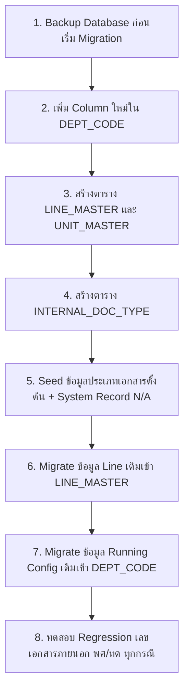

---

*เอกสารฉบับนี้จัดทำและรับรองความถูกต้องโดย Business Analyst — ระบบ EDR บริษัท เทเวศประกันภัย จำกัด (มหาชน)*
