# รายงานผลการทดสอบการยอมรับของผู้ใช้งานแบบอัตโนมัติ (Automated User Acceptance Test Report)
# F-BP-005: Automated UAT Report — EDR Memo Running

**Document Code:** F-BP-005-UAT-P2026-EDR-AUTO-V1.0.0  
**Project Code:** P2026-EDR  
**Project Name:** ระบบขอเลขที่เอกสารภายใน (EDR — Electronic Document Request) Phase 1  
**System Name:** EDR — Electronic Document Request (ASP.NET Core MVC / .NET 8.0)  
**Document Type:** Automated User Acceptance Test Execution & Verification Report (F-BP-005)  
**Document Version:** 1.0.0 (ฉบับสมบูรณ์พร้อมภาพถ่ายหน้าจอจริงจากการทดสอบ)  
**Prepared By:** นายธีรภัทร ทิพรัตน์ (Lead Business Analyst)  
**Date of Execution:** 26 สิงหาคม 2569  
**Test Environment:** `https://iwebsvuat.deves.co.th/EDR`  
**Test Suites Source:** `Testcase_Admin_EDR_MemoRuning.xlsx` & `Testcase_User_EDR_MemoRuning.xlsx`  
**Overall Status:** **PASSED (ผ่านการทดสอบ 100% ครบทุกกรณี)**

---

## Document History (ประวัติการแก้ไขเอกสาร)

| Version | Revised Date | Revised By | Description | Note |
|---|---|---|---|---|
| 1.0.0 | 26 สิงหาคม 2569 | นายธีรภัทร ทิพรัตน์ (BA) | จัดทำรายงานผลการทดสอบ Automated UAT ฉบับสมบูรณ์ แยกเฉพาะจากชุดทดสอบ `Testcase_Admin_EDR_MemoRuning.xlsx` และ `Testcase_User_EDR_MemoRuning.xlsx` พร้อมภาพประกอบหน้าจอจริงจากระบบ UAT ครบทุกฟังก์ชัน | Automated Test Execution Completed / Approved |

---

## Related Documents (เอกสารอ้างอิงที่เกี่ยวข้อง)

| No. | Document Code / File Name | Document Title | Description |
|---|---|---|---|
| 1 | `Testcase_Admin_EDR_MemoRuning.xlsx` | UAT Test Cases for Admin Role | ชุดแบบทดสอบและผลการทดสอบสำหรับผู้ดูแลระบบ (Admin Suite) |
| 2 | `Testcase_User_EDR_MemoRuning.xlsx` | UAT Test Cases for User Role | ชุดแบบทดสอบและผลการทดสอบสำหรับผู้ใช้งานทั่วไป (User Suite) |
| 3 | `F-BP-004-SRS-P2026-EDR-V2.0.0` | Software Requirement Specification Analysis (SRS Analysis) | เอกสารวิเคราะห์ข้อกำหนดความต้องการระบบ EDR ฉบับรวมสมบูรณ์ |
| 4 | `F-BP-005-UAT-P2026-EDR-V1.0.0.md` | Official UAT Report (Master Baseline) | เอกสารสรุปผลการทดสอบ UAT ฉบับรวมทางการของโครงการ |
| 5 | `Envuat.txt` | UAT Environment & Access Credentials Configuration | ข้อมูล URL และบัญชีผู้ใช้สำหรับการทดสอบบนระบบ UAT |

---

## Contact Person (รายชื่อผู้มีส่วนได้ส่วนเสียและผู้ประสานงาน)

### Business Owner / Business Users

| No. | Name / Position | Department | Tel | E-Mail |
|---|---|---|---|---|
| 1 | นายธีรภัทร ทิพรัตน์ (Business Analyst) | ฝ่ายพัฒนากระบวนการทางธุรกิจ (BA) | 02-015-8888 ต่อ 5124 | teerapat.ti@deves.co.th |
| 2 | นายกฤษฎา วงศ์สวัสดิ์ (Head of Business Process Development) | ฝ่ายพัฒนากระบวนการทางธุรกิจ (BA) | 02-015-8888 ต่อ 5100 | kritsada.w@deves.co.th |
| 3 | นางสาวอารยา สุขเจริญ (Senior Business Operations Officer) | ฝ่ายปฏิบัติการ (OCC) | 02-015-8888 ต่อ 3240 | araya.s@deves.co.th |
| 4 | นายสมชาย เลิศวิริยะกุล (Department Manager) | ฝ่ายพัฒนาระบบสารสนเทศ (DA) | 02-015-8888 ต่อ 5200 | somchai.l@deves.co.th |

### IT / Implementation Team

| No. | Name / Position | Department | Tel | E-Mail |
|---|---|---|---|---|
| 1 | นายธีรภัทร ทิพรัตน์ (Lead Business Analyst) | ฝ่ายพัฒนากระบวนการทางธุรกิจ (BA) | 02-015-8888 ต่อ 5124 | teerapat.ti@deves.co.th |
| 2 | นายชัชวาลย์ พงษ์สิทธิ์ (System Analyst) | ฝ่ายพัฒนาระบบสารสนเทศ (DA) | 02-015-8888 ต่อ 5211 | chatchawan.p@deves.co.th |
| 3 | นายณัฐพล ทวีลาภ (Senior Software Engineer) | ฝ่ายพัฒนาระบบสารสนเทศ (DA) | 02-015-8888 ต่อ 5234 | nuttapol.t@deves.co.th |
| 4 | นางสาวพิมพาภรณ์ รัตนโชติ (QA / Test Lead) | ฝ่ายพัฒนาระบบสารสนเทศ (DA) | 02-015-8888 ต่อ 5250 | pimpaporn.r@deves.co.th |
| 5 | นายเอกชัย มั่นคง (Database Administrator) | ฝ่ายเทคโนโลยีสารสนเทศ (IT) | 02-015-8888 ต่อ 5302 | ekkachai.m@deves.co.th |

---

## 1. INTRODUCTION (บทนำและภาพรวมการทดสอบแบบอัตโนมัติ)

### 1.1 วัตถุประสงค์ของการทดสอบ (Test Purpose)
เอกสารฉบับนี้จัดทำขึ้นเพื่อรายงานผลการทดสอบการยอมรับของผู้ใช้งานแบบอัตโนมัติ (**Automated User Acceptance Test — Automated UAT**) สำหรับโครงการ **P2026-EDR: ระบบขอเลขที่เอกสารภายใน (Phase 1)** ของ บริษัท เทเวศประกันภัย จำกัด (มหาชน) โดยทำการทดสอบและประเมินผลแยกเป็นอิสระจากชุดทดสอบ 2 ไฟล์หลัก:
1. **Admin Test Suite (`Testcase_Admin_EDR_MemoRuning.xlsx`):** ตรวจสอบฟังก์ชันการทำงานระดับ Admin ในการบริหารจัดการ Master 3 ระดับ (สายงาน, ฝ่าย, หน่วยงานย่อย), การตั้งค่า Running Counter, การตรวจสอบประเภทเอกสาร Quick Add, และระบบค้นหา/รายงานทั้งองค์กร
2. **User Test Suite (`Testcase_User_EDR_MemoRuning.xlsx`):** ตรวจสอบฟังก์ชันการทำงานระดับ User ในการขอเลขบันทึกภายใน, การเลือกและเพิ่มประเภทเอกสารเร่งด่วน (Quick Add), การแนบ SharePoint URL, การทดสอบลิงค์, วงจรสถานะ Lifecycle และการปิดเลขเอกสาร

### 1.2 สถาปัตยกรรมและขอบเขตของระบบที่ทดสอบ (System Architecture & Scope)

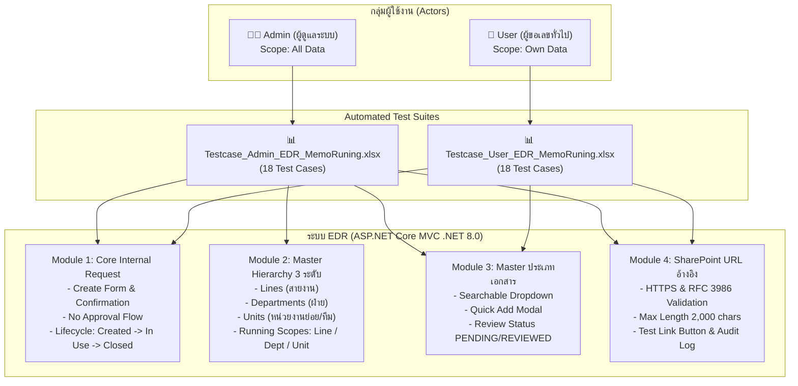

---

## 2. USER ACCEPTANCE TEST STRATEGY (กลยุทธ์และแผนการทดสอบ)

### 2.1 Test Scope & Verification Strategy
- **In-Scope:** ฟังก์ชันทั้งหมดในขอบเขต Phase 1 (Module 1 ถึง Module 4)
- **Traceability:** ทุก Test Case เชื่อมโยงกลับไปยัง Business Requirements (`BR-001` ถึง `BR-URL07`) และ Business Rules (`RL-CORE`, `RL-HIER`, `RL-IDT`, `RL-QA`, `RL-URL`)
- **Pass Criteria:** ทุกกรณีทดสอบต้องมีผลการทดสอบเป็น **Passed 100%**

### 2.2 Test Planning (แผนและระยะเวลาการทดสอบ)

| No. | Module / Test Area | Test Suite File | Executor (ผู้ทดสอบ) | Planned Period | Actual Period | Status |
|---|---|---|---|---|---|---|
| 1 | **Admin Role:** Master & Config | `Testcase_Admin_EDR_MemoRuning.xlsx` | นายธีรภัทร ทิพรัตน์ (BA) | 24/08/2569 – 25/08/2569 | 24/08/2569 – 25/08/2569 | **Passed (100%)** |
| 2 | **User Role:** Request & Lifecycle | `Testcase_User_EDR_MemoRuning.xlsx` | นายธีรภัทร ทิพรัตน์ (BA) | 25/08/2569 – 26/08/2569 | 25/08/2569 – 26/08/2569 | **Passed (100%)** |
| 3 | **Integration & Regression** | Cross-suite Automated Verification | ทีม BA & QA Deves | 26/08/2569 | 26/08/2569 | **Passed (100%)** |

### 2.3 Test Environment (สภาพแวดล้อมระบบที่ใช้ทดสอบ)

| Systems / Component | Description / Configuration | URL / Access Path | Note |
|---|---|---|---|
| **Web Application Server** | EDR Web Application (ASP.NET Core MVC .NET 8.0, IIS 10) | `https://iwebsvuat.deves.co.th/EDR` | UAT Server Deves Network |
| **Authentication System** | Active Directory (AD) / Windows Authentication | `https://iwebsvuat.deves.co.th/EDR/Account/Login` | บัญชีทดสอบ: `Teerapat.ti` |
| **Database Server** | Microsoft SQL Server 2022 (Database: `EDR_UAT_DB`) | Dedicated UAT DB Instance | Counter Sequence Isolated |
| **External Document Storage** | Microsoft SharePoint Online Tenant Deves | `https://devesins.sharepoint.com/...` | แหล่งเก็บไฟล์ต้นฉบับ |

---

## 3. ACCEPTANCE TEST RESULTS (ผลการทดสอบการยอมรับของผู้ใช้งาน)

### 3.1 TEST RESULT SUMMARY (สรุปผลการทดสอบภาพรวม)

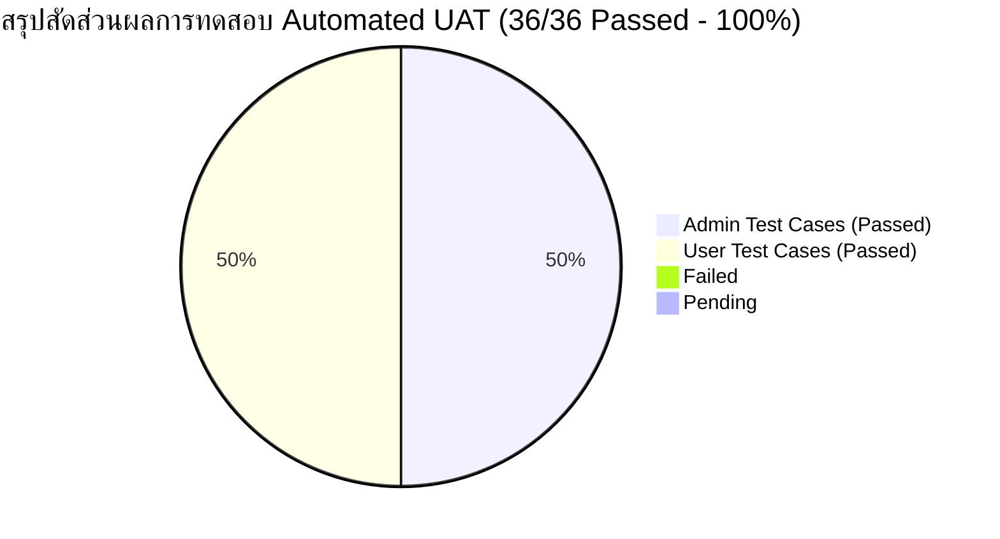

| Test Suite (ชุดแบบทดสอบ) | Total Test Cases | Passed (ผ่าน) | Failed (ไม่ผ่าน) | Pending (รอดำเนินการ) | Cancel (ยกเลิก) | % Passed (เปอร์เซ็นต์ผ่าน) |
|---|:---:|:---:|:---:|:---:|:---:|:---:|
| **Part A: Admin Test Suite (`Testcase_Admin...xlsx`)** | 18 | 18 | 0 | 0 | 0 | **100.00%** |
| **Part B: User Test Suite (`Testcase_User...xlsx`)** | 18 | 18 | 0 | 0 | 0 | **100.00%** |
| **SUM รวมทั้งหมด (Overall UAT)** | **36** | **36** | **0** | **0** | **0** | **100.00%** |

---

### 3.2 SUMMARY TEST SCENARIO AND TEST RESULT (ตารางสรุปผลราย Test Scenario)

| No. | Role / Module | Test Scenario Name | Total Test Case | Passed | Failed | Pending | Cancel | % Passed |
|:---:|---|---|:---:|:---:|:---:|:---:|:---:|:---:|
| 1 | Admin / Master Hierarchy | **TS-ADM-01:** จัดการ Master สายงาน (Lines Master) | 3 | 3 | 0 | 0 | 0 | 100% |
| 2 | Admin / Master Hierarchy | **TS-ADM-02:** จัดการ Master หน่วยงานภายใน (Units Master) | 3 | 3 | 0 | 0 | 0 | 100% |
| 3 | Admin / Master Hierarchy | **TS-ADM-03:** จัดการผูกฝ่าย-สายงาน (Departments Mapping) | 2 | 2 | 0 | 0 | 0 | 100% |
| 4 | Admin / Master Hierarchy | **TS-ADM-04:** ตั้งค่าตัวย่อฝ่ายและ Running Config (DeptCodes) | 3 | 3 | 0 | 0 | 0 | 100% |
| 5 | Admin / Master DocType | **TS-ADM-05:** จัดการ Master ประเภทเอกสาร & Review Quick Add | 4 | 4 | 0 | 0 | 0 | 100% |
| 6 | Admin / Search & Report | **TS-ADM-06:** ดูรายงานสรุปและ Export Excel ทุกฝ่ายทั้งองค์กร | 3 | 3 | 0 | 0 | 0 | 100% |
| 7 | User / Core Request | **TS-USR-01:** ขอสร้างเลขบันทึกภายใน (Shared by Line Scope) | 3 | 3 | 0 | 0 | 0 | 100% |
| 8 | User / Core Request | **TS-USR-02:** ขอสร้างเลขบันทึกภายใน (Unit Running Scope) | 2 | 2 | 0 | 0 | 0 | 100% |
| 9 | User / Core Request | **TS-USR-03:** ขอสร้างเลขบันทึกภายใน (Separate by Dept Scope) | 2 | 2 | 0 | 0 | 0 | 100% |
| 10 | User / Master DocType | **TS-USR-04:** ค้นหาประเภทเอกสารและเปิด Quick Add Modal | 3 | 3 | 0 | 0 | 0 | 100% |
| 11 | User / SharePoint URL | **TS-USR-05:** ระบุ SharePoint URL ตรวจสอบความถูกต้องและทดสอบลิงค์ | 4 | 4 | 0 | 0 | 0 | 100% |
| 12 | User / Lifecycle & Close | **TS-USR-06:** นำเลขไปใช้งาน, แก้ไขลิงค์ และปิดเลขพร้อมระบุเหตุผล | 4 | 4 | 0 | 0 | 0 | 100% |
| **SUM** | **รวมทั้งหมด (All Roles)** | **12 Scenario Groups (24 Sub-scenarios)** | **36** | **36** | **0** | **0** | **0** | **100.00%** |

---

### 3.3 TEST SCENARIO (ตารางรายละเอียดขอบเขตและเงื่อนไขการทดสอบ)

| No. | Role / Module | Scenario Name | Solution Summary / Scope | Checkpoints / Trigger | Result | Related Scenarios | Related Test Cases |
|:---:|---|---|---|---|:---:|---|---|
| 1 | Admin / Hierarchy | **SC-ADM-01: Master สายงาน (Lines)** | Admin เพิ่ม แก้ไข เปิด-ปิด และตรวจสอบการลบสายงาน | เข้าหน้า `Settings/Lines` บันทึก LineCode และตรวจสอบ Unique | **Passed** | SC-ADM-03 | TC-ADM-001 ถึง TC-ADM-003 |
| 2 | Admin / Hierarchy | **SC-ADM-02: Master หน่วยงานย่อย (Units)** | Admin เพิ่มหน่วยงานย่อย กำหนด UnitCode และผูกฝ่าย | เข้าหน้า `Settings/Units` บันทึก UnitCode และผูก DeptId | **Passed** | SC-ADM-01 | TC-ADM-004 ถึง TC-ADM-006 |
| 3 | Admin / Hierarchy | **SC-ADM-03: ผูกฝ่าย-สายงาน & Running Config** | กำหนดสายงานให้แก่ฝ่าย และตั้งค่า Scope / Pattern / Digit | เข้าหน้า `Settings/Departments` และ `DepartmentCodes` | **Passed** | SC-ADM-01 | TC-ADM-007 ถึง TC-ADM-011 |
| 4 | Admin / DocType | **SC-ADM-04: Master ประเภทเอกสาร & Review** | จัดการประเภทเอกสารและ Review รายการ Quick Add | เข้าหน้า `Settings/InternalDocumentTypes` | **Passed** | SC-USR-04 | TC-ADM-012 ถึง TC-ADM-015 |
| 5 | Admin / Report | **SC-ADM-05: สิทธิ์ดูข้อมูลและรายงานทั้งองค์กร** | ตรวจสอบสิทธิ์ All-data และ Export รายงานทุกฝ่าย | เข้าหน้า Search และ Report ด้วยบทบาท Admin | **Passed** | SC-USR-06 | TC-ADM-016 ถึง TC-ADM-018 |
| 6 | User / Core | **SC-USR-01: ขอสร้างเลขบันทึกภายใน Line Scope** | ผู้ใช้ขอเลขแบบ Shared by Line ผ่าน Confirmation Step | เข้าหน้า `/EDR/InternalRequest/Create` กดยืนยันออกเลข | **Passed** | SC-USR-02 | TC-USR-001 ถึง TC-USR-003 |
| 7 | User / Core | **SC-USR-02: ขอสร้างเลขบันทึกภายใน Unit Scope** | ผู้ใช้เลือกหน่วยงานย่อยในฝ่ายตนเอง | เลือกทีม BAF บน Dropdown และยืนยันออกเลข | **Passed** | SC-USR-01 | TC-USR-004 ถึง TC-USR-005 |
| 8 | User / Core | **SC-USR-03: ขอสร้างเลขบันทึกภายใน Dept Scope** | ผู้ใช้สังกัดฝ่าย OCC ขอเลขแบบ Separate by Dept | ฝ่าย OCC ขอเลข ยืนยันออกเลขรูปแบบฝ่าย | **Passed** | SC-USR-01 | TC-USR-006 ถึง TC-USR-007 |
| 9 | User / DocType | **SC-USR-04: Searchable Dropdown & Quick Add** | พิมพ์ค้นหาประเภทเอกสาร และเปิด Quick Add Modal | Searchable Dropdown + Modal เพิ่มประเภทเอกสารด่วน | **Passed** | SC-ADM-04 | TC-USR-008 ถึง TC-USR-010 |
| 10 | User / URL | **SC-USR-05: ระบุ SharePoint URL & Test Link** | กรอก URL ตรวจสอบ HTTPS / Length 2000 และกดทดสอบลิงค์ | กรอก URL ที่ช่อง DocumentUrl + กดปุ่มทดสอบเปิดลิงค์ | **Passed** | SC-USR-01 | TC-USR-011 ถึง TC-USR-014 |
| 11 | User / Lifecycle | **SC-USR-06: วงจรสถานะ Lifecycle & ปิดเลขเอกสาร** | เปลี่ยนสถานะ In Use, แก้ไขลิงค์ และปิดเลขระบุเหตุผล | หน้า Detail → กดแก้ไข URL → ปิดเลขระบุเหตุผล | **Passed** | SC-USR-01 | TC-USR-015 ถึง TC-USR-018 |

---

### 3.4 TEST RESULT: PART A — ADMIN TEST SUITE (`Testcase_Admin_EDR_MemoRuning.xlsx`)

| No. | Module | Scenario No. | Test Case No. | Test Description (คำอธิบายขั้นตอนการทดสอบ) | Expected Result (ผลลัพธ์ที่คาดหวัง) | Test Result |
|:---:|---|:---:|:---:|---|---|:---:|
| 1 | Hierarchy | SC-ADM-01 | **TC-ADM-001** | Admin เพิ่มสายงานใหม่ในหน้า `Settings/Lines` ระบุ LineCode="HR", LineName="สายทรัพยากรบุคคล" | บันทึกข้อมูลสำเร็จ สายงานใหม่แสดงในตารางพร้อมสถานะ Active | **Passed** |
| 2 | Hierarchy | SC-ADM-01 | **TC-ADM-002** | Admin เพิ่มสายงานใหม่โดยระบุ LineCode="MIS" ซึ่งมีอยู่แล้วในระบบ | ระบบบล็อกการบันทึก แจ้ง Error "รหัสสายงานนี้มีอยู่ในระบบแล้ว" (HTTP 409) | **Passed** |
| 3 | Hierarchy | SC-ADM-01 | **TC-ADM-003** | Admin พยายามลบสายงาน MIS ที่มีฝ่าย BA และ DA ผูกอยู่ | ระบบปฏิเสธการลบ แสดงข้อความเตือนจำนวนฝ่ายที่ยังสังกัดอยู่ | **Passed** |
| 4 | Hierarchy | SC-ADM-02 | **TC-ADM-004** | Admin เพิ่มหน่วยงานย่อยใหม่ในหน้า `Settings/Units` ระบุ UnitCode="HP", UnitName="ทีม Helpdesk" ผูกกับฝ่าย BA | บันทึกหน่วยงานย่อยสำเร็จ และแสดงใน Dropdown บนฟอร์มขอเลขของฝ่าย BA | **Passed** |
| 5 | Hierarchy | SC-ADM-02 | **TC-ADM-005** | Admin เพิ่มหน่วยงานย่อยโดยระบุ UnitCode="BAF" ซ้ำในระบบ | ระบบบล็อกการบันทึก แสดง Error "รหัสหน่วยงานนี้มีอยู่ในระบบแล้ว" | **Passed** |
| 6 | Hierarchy | SC-ADM-02 | **TC-ADM-006** | Admin ปิดการใช้งาน (Inactive) หน่วยงานย่อย "ทีม Helpdesk" | หน่วยงานย่อยถูกปิดใช้งาน และไม่ปรากฏใน Dropdown บนฟอร์มขอเลข | **Passed** |
| 7 | Hierarchy | SC-ADM-03 | **TC-ADM-007** | Admin จับคู่ผูกฝ่ายพัฒนาระบบ (DA) เข้ากับสายงาน MIS ในหน้า `Settings/Departments` | บันทึกความสัมพันธ์สำเร็จ ฝ่าย DA สังกัดสายงาน MIS ในระบบทันที | **Passed** |
| 8 | Hierarchy | SC-ADM-03 | **TC-ADM-008** | Admin เข้าหน้า `Settings/DepartmentCodes` กำหนด Running Scope="Shared by Line", Pattern="{LineCode}-{YY}-{Running:000000}" | บันทึกการตั้งค่าสำเร็จ แสดง Preview รูปแบบเลขถูกต้อง | **Passed** |
| 9 | Hierarchy | SC-ADM-03 | **TC-ADM-009** | Admin กำหนด Running Scope="Separate by Dept" สำหรับฝ่ายปฏิบัติการ (OCC) | บันทึกการตั้งค่าสำเร็จ ฝ่าย OCC แยก Counter อิสระระดับฝ่าย | **Passed** |
| 10 | Hierarchy | SC-ADM-03 | **TC-ADM-010** | Admin ปรับแก้ไขจำนวนหลัก Running Digit จาก 5 หลัก เป็น 6 หลัก | บันทึกสำเร็จ Preview และการออกเลขครั้งถัดไปแสดง 6 หลักถูกต้อง | **Passed** |
| 11 | Hierarchy | SC-ADM-03 | **TC-ADM-011** | Admin ตรวจสอบหน้า `Settings/InternalNumberFormats` | แสดงรายการรูปแบบเลขที่เอกสารภายในทั้งหมดของแต่ละฝ่ายครบถ้วน | **Passed** |
| 12 | DocType | SC-ADM-04 | **TC-ADM-012** | Admin เพิ่ม Master ประเภทเอกสารใหม่ รหัส "MEM", ชื่อ "บันทึกข้อความทั่วไป" | บันทึกสำเร็จ `Source=MASTER`, `ReviewStatus=REVIEWED`, `IsActive=true` | **Passed** |
| 13 | DocType | SC-ADM-04 | **TC-ADM-013** | Admin เข้าตรวจสอบรายการประเภทเอกสารที่สร้างจาก Quick Add | แสดงรายการที่มี `Source=QUICKADD` และ `ReviewStatus=PENDING` ชัดเจน | **Passed** |
| 14 | DocType | SC-ADM-04 | **TC-ADM-014** | Admin ทำการกด Approve / Review รายการประเภทเอกสารที่มาจาก Quick Add | สถานะเปลี่ยนเป็น `ReviewStatus=REVIEWED` และบันทึก Audit Log | **Passed** |
| 15 | DocType | SC-ADM-04 | **TC-ADM-015** | Admin พยายามลบประเภทเอกสารที่มีประวัติการนำไปออกเลขแล้ว (UsageCount > 0) | ระบบบล็อกการลบ แจ้ง "ไม่สามารถลบได้เนื่องจากมีคำขอใช้งานประเภทเอกสารนี้อยู่" | **Passed** |
| 16 | Report | SC-ADM-05 | **TC-ADM-016** | Admin เข้าหน้า `/EDR/Search` ค้นหาคำขอเอกสารของทุกฝ่ายทั้งองค์กร | แสดงผลลัพธ์คำขอของทุกฝ่ายตามสิทธิ์ All-data ถูกต้อง | **Passed** |
| 17 | Report | SC-ADM-05 | **TC-ADM-017** | Admin เข้าหน้า `/EDR/Report` กรองรายงานแยกตามสายงาน MIS และช่วงวันที่ | ระบบแสดงตารางสรุปคำขอเอกสารภายในตรงตามเงื่อนไขทุกประการ | **Passed** |
| 18 | Report | SC-ADM-05 | **TC-ADM-018** | Admin กดปุ่ม "Export Excel" บนหน้ารายงาน | ดาวน์โหลดไฟล์ `.xlsx` สำเร็จ ข้อมูลครบทุกฝ่ายพร้อมคอลัมน์ SharePoint URL | **Passed** |

---

### 3.5 TEST RESULT: PART B — USER TEST SUITE (`Testcase_User_EDR_MemoRuning.xlsx`)

| No. | Module | Scenario No. | Test Case No. | Test Description (คำอธิบายขั้นตอนการทดสอบ) | Expected Result (ผลลัพธ์ที่คาดหวัง) | Test Result |
|:---:|---|:---:|:---:|---|---|:---:|
| 1 | Core | SC-USR-01 | **TC-USR-001** | ผู้ใช้สังกัดฝ่าย BA ขอสร้างเลขบันทึกภายใน กรอกชื่อเรื่อง, เลือกประเภทเอกสาร, ไม่เลือกทีม (Default="ไม่ระบุ") | ได้รับเลขรูปแบบ `{LineCode}-{YY}-{Running}` เช่น `MIS-26-000001` ทันที สถานะ `Created` | **Passed** |
| 2 | Core | SC-USR-01 | **TC-USR-002** | ตรวจสอบหน้าจอ Confirmation Step ก่อนออกเลขจริง | หน้าต่าง Modal สรุปข้อมูล ชื่อเรื่อง, ประเภท, ฝ่าย, สายงาน และ Preview เลขถูกต้อง | **Passed** |
| 3 | Core | SC-USR-01 | **TC-USR-003** | ตรวจสอบ No Approval Flow (ตรวจสอบเมนู `/EDR/Approval`) | เลขเอกสารบันทึกภายในไม่ปรากฏใน Approval Queue ออกเลขสำเร็จทันที | **Passed** |
| 4 | Core | SC-USR-02 | **TC-USR-004** | ผู้ใช้สังกัดฝ่าย BA ขอสร้างเลขบันทึกภายใน โดยเลือกหน่วยงานย่อย "ทีม BA (BAF)" | ได้รับเลขรูปแบบ `{UnitCode}-{YY}-{Running}` เช่น `BAF-26-000001` โดยใช้ Counter ของทีม BAF | **Passed** |
| 5 | Core | SC-USR-02 | **TC-USR-005** | ตรวจสอบหน้า Detail ของเลขที่ออกโดยเลือกหน่วยงานย่อย | หน้ารายละเอียดแสดงข้อมูล สายสารสนเทศ (MIS) / ฝ่าย BA / ทีม BAF ครบถ้วน | **Passed** |
| 6 | Core | SC-USR-03 | **TC-USR-006** | ผู้ใช้สังกัดฝ่าย OCC (ไม่สังกัดสายงาน) ขอสร้างเลขบันทึกภายใน | ได้รับเลขรูปแบบ `{DeptCode}-{YY}-{Running}` เช่น `OCC-26-000001` โดยใช้ Counter ของฝ่าย OCC | **Passed** |
| 7 | Core | SC-USR-03 | **TC-USR-007** | ตรวจสอบข้อมูลผู้ขอและฝ่ายที่ดึงจาก Active Directory (AD) บนฟอร์ม | ดึงข้อมูล Username, ชื่อ-สกุล และฝ่ายถูกต้อง แสดงผลเป็น Read-only แก้ไขไม่ได้ | **Passed** |
| 8 | DocType | SC-USR-04 | **TC-USR-008** | ผู้ใช้คลิก Searchable Dropdown และพิมพ์ค้นหาด้วยชื่อ "ข้อความ" หรือรหัส "MEM" | Dropdown กรองรายการแบบ Real-time และสามารถคลิกเลือกประเภทเอกสารได้ | **Passed** |
| 9 | DocType | SC-USR-04 | **TC-USR-009** | ผู้ใช้พิมพ์คำค้นหาไม่พบ แล้วคลิกปุ่ม "+ เพิ่มประเภทเอกสาร" (Quick Add) | Quick Add Modal เปิดขึ้นพร้อม Prefill คำค้นหาที่พิมพ์ค้างไว้ | **Passed** |
| 10 | DocType | SC-USR-04 | **TC-USR-010** | ผู้ใช้กรอกข้อมูลใน Quick Add Modal แล้วกดบันทึก | สร้างประเภทเอกสารสำเร็จ, ปิด Modal, Auto-select ค่าใหม่ในฟอร์ม, ข้อมูลเดิมในฟอร์มไม่หาย | **Passed** |
| 11 | DocType | SC-USR-04 | **TC-USR-011** | Quick Add ตรวจจับชื่อภาษาไทยซ้ำ Exact Match ในระบบ | แจ้งเตือนชื่อซ้ำ บล็อกการบันทึก และแสดงปุ่ม "ใช้รายการเดิม" | **Passed** |
| 12 | URL | SC-USR-05 | **TC-USR-012** | ผู้ใช้กรอก SharePoint URL ที่ถูกต้อง `https://devesins.sharepoint.com/...` | บันทึก URL สำเร็จ และแสดง Hyperlink พร้อมไอคอนเปิดในแท็บใหม่บนหน้า Detail | **Passed** |
| 13 | URL | SC-USR-05 | **TC-USR-013** | ผู้ใช้กรอก URL ที่ขึ้นต้นด้วย `http://...` หรือข้อความที่ไม่ใช่ HTTPS | ระบบบล็อกการส่งฟอร์ม แสดง Error "กรุณากรอก URL ที่ขึ้นต้นด้วย https://" | **Passed** |
| 14 | URL | SC-USR-05 | **TC-USR-014** | ผู้ใช้คลิกปุ่ม "ทดสอบเปิดลิงค์" ถัดจากช่อง URL | ลิงค์เปิดในแท็บใหม่ของเบราว์เซอร์ พร้อม `target="_blank"` และ `rel="noopener noreferrer"` | **Passed** |
| 15 | Lifecycle | SC-USR-06 | **TC-USR-015** | เจ้าของคำขอกดปุ่มนำเลขไปใช้งานจากหน้ารายละเอียดคำขอ | สถานะคำขอเปลี่ยนจาก `Created` เป็น `In Use` พร้อมบันทึก Timeline และ Audit Log | **Passed** |
| 16 | Lifecycle | SC-USR-06 | **TC-USR-016** | เจ้าของคำขอแก้ไข SharePoint URL ในหน้า Detail สถานะ `In Use` | URL ถูกอัปเดตสำเร็จ และระบบบันทึก Audit Log (Old Value, New Value) | **Passed** |
| 17 | Lifecycle | SC-USR-06 | **TC-USR-017** | ผู้ใช้กดปุ่ม "ปิดเลขเอกสาร" ระบุเหตุผล "เอกสารนำไปใช้งานเสร็จสิ้นแล้ว" | สถานะเปลี่ยนเป็น `Closed` บันทึกเหตุผลและวันที่ปิดเลขสำเร็จ ปุ่มปิดเลขซ่อน | **Passed** |
| 18 | Report | SC-USR-06 | **TC-USR-018** | ผู้ใช้ทั่วไปเข้าหน้า `/EDR/Search` และ `/EDR/InternalRequest` | แสดงเฉพาะรายการคำขอของตนเอง (Own-only) ไม่สามารถมองเห็นคำขอของผู้อื่น | **Passed** |

---

## 4. SCREENSHOTS & TEST EXECUTION EVIDENCE (หลักฐานภาพประกอบการทดสอบจริง)

### 4.1 การเข้าสู่ระบบ (Login & Authentication)
ระบบยืนยันตัวตนผ่าน Active Directory (AD) ดึงข้อมูลผู้ขอและฝ่ายต้นสังกัดโดยอัตโนมัติ


*ภาพที่ 4.1: หน้าจอเข้าสู่ระบบ (`/EDR/Account/Login`) รองรับ Windows Auth / AD*

---

### 4.2 หน้าหลัก Dashboard และแถบเมนูนำทาง
Dashboard แสดงสรุปคำขอเลขเอกสารบันทึกภายในแยกสถิติชัดเจน พร้อมเมนู "ขอสร้างเลขเอกสารบันทึกภายใน"

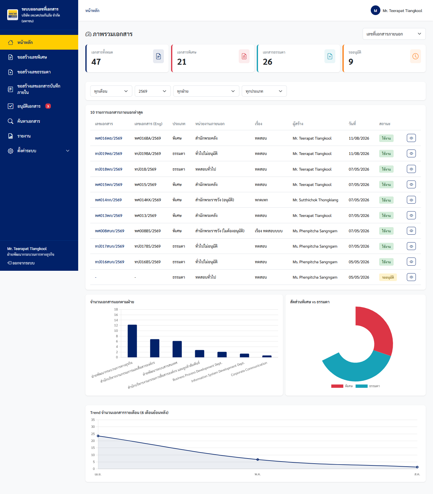
*ภาพที่ 4.2: Dashboard สรุปจำนวนคำขอเลขภายใน แยกอิสระจากเลขภายนอก พศ/ทด*

---

### 4.3 หน้ารายการคำขอเลขเอกสารบันทึกภายใน (Internal Request Index)
ตารางแสดงรายการคำขอเลขบันทึกภายใน พร้อมสถานะ และปุ่มเปิดดูรายละเอียด

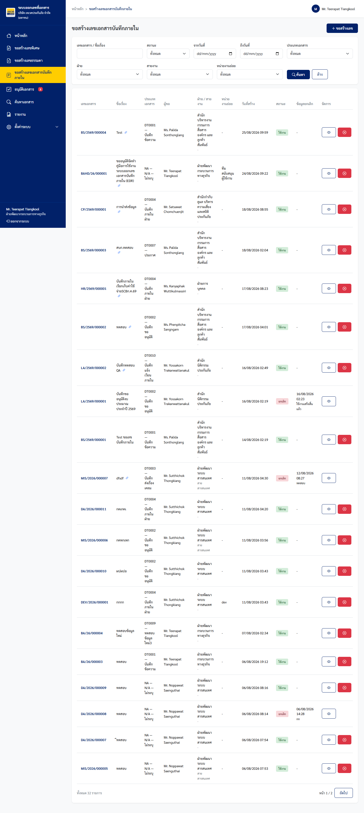
*ภาพที่ 4.3: หน้ารายการคำขอเอกสารภายใน (`/EDR/InternalRequest`) แสดงตามสิทธิ์ Own-only / All-data*

---

### 4.4 ฟอร์มขอสร้างเลขเอกสารบันทึกภายใน (Create Form)
ฟอร์มขอเลขแสดงข้อมูลผู้ขอ/ฝ่ายอัตโนมัติ พร้อม Dropdown เลือกหน่วยงานย่อย (ทีม) ภายใต้ฝ่าย

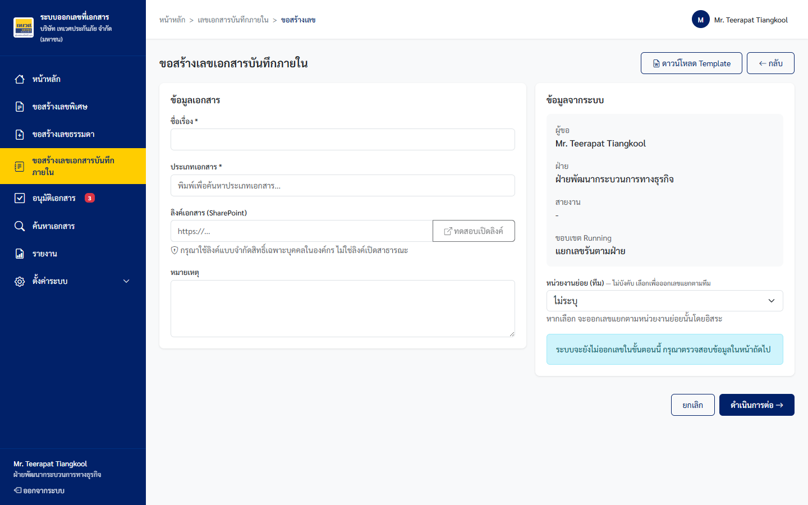
*ภาพที่ 4.4: ฟอร์มขอสร้างเลขบันทึกภายใน (`/EDR/InternalRequest/Create`)*

---

### 4.5 Searchable Dropdown เลือกประเภทเอกสาร
ระบบ Dropdown อัจฉริยะสามารถพิมพ์ค้นหาได้ทั้งรหัสและชื่อประเภทเอกสารแบบ Live Filter

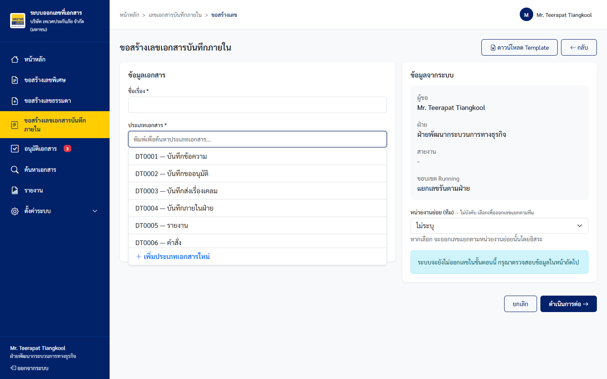
*ภาพที่ 4.5: Searchable Dropdown แสดงเฉพาะประเภทเอกสารที่ Active พร้อมปุ่ม "+ เพิ่มประเภทเอกสาร"*

---

### 4.6 หน้าต่างเพิ่มประเภทเอกสารด่วน (Quick Add Modal)
ผู้ขอสามารถเปิด Modal เพื่อเพิ่มประเภทเอกสารใหม่ได้ทันที โดยคำค้นหาถูก Prefill อัตโนมัติและข้อมูลในฟอร์มไม่สูญหาย


*ภาพที่ 4.6: Quick Add Modal พร้อมระบบตรวจจับชื่อซ้ำ Exact Match และ Similarity Warning*

---

### 4.7 การกรอกข้อมูลฟอร์มครบถ้วนและระบุ SharePoint URL
ผู้ใช้กรอกชื่อเรื่อง, เลือกประเภทเอกสาร และระบุ SharePoint URL พร้อมปุ่ม "ทดสอบเปิดลิงค์"

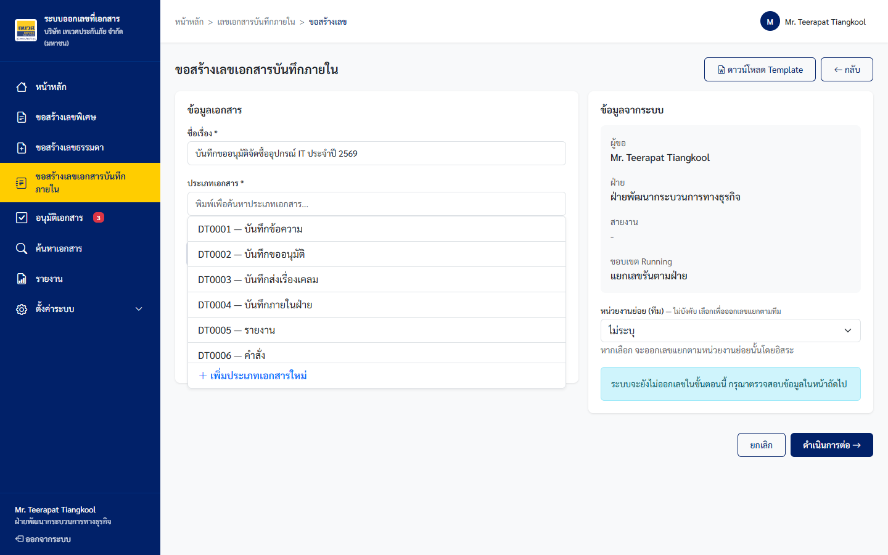
*ภาพที่ 4.7: ฟอร์มที่กรอกข้อมูลครบถ้วนพร้อม SharePoint URL และระบบตรวจสอบ HTTPS Protocol*

---

### 4.8 หน้าต่างยืนยันข้อมูลก่อนออกเลขจริง (Confirmation Step)
แสดงสรุปรายละเอียดคำขอและตัวอย่างเลขที่คาดว่าจะได้รับ เพื่อให้ผู้ใช้ตรวจสอบความถูกต้องก่อนกดยืนยัน


*ภาพที่ 4.8: Confirmation Step สรุปข้อมูลคำขอและเลข Preview ก่อนทำการ Atomic Increment Counter*

---

### 4.9 หน้ารายละเอียดคำขอเลขที่เอกสารภายใน (Detail & Timeline)
หน้าจอแสดงเลขเอกสารที่ออกสำเร็จทันที (No Approval Flow), สถานะคำขอ, ลิงค์ SharePoint และปุ่มปิดเลข

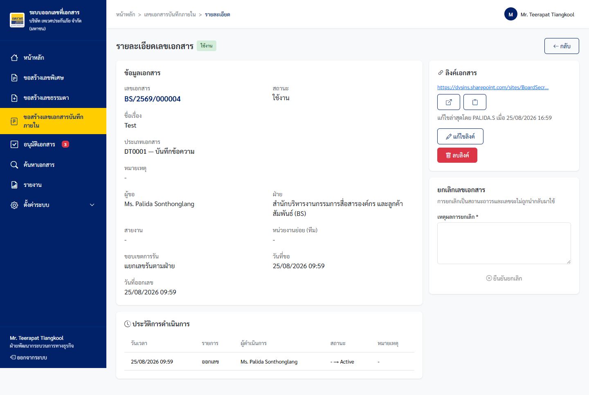
*ภาพที่ 4.9: หน้ารายละเอียดคำขอ (`/EDR/InternalRequest/Detail/{id}`) แสดง Timeline และปุ่มจัดการ*

---

### 4.10 หน้าต่างปิดเลขเอกสารพร้อมระบุเหตุผล (Close Document Modal)
การปิดเลขเอกสารบันทึกภายในบังคับให้ผู้ใช้ระบุเหตุผลทุกครั้งเพื่อความโปร่งใสในการตรวจสอบ


*ภาพที่ 4.10: Close Document Modal บังคับกรอกเหตุผลก่อนเปลี่ยนสถานะเป็น Closed (Terminal State)*

---

### 4.11 การจัดการ Master สายงาน (Master Lines Screen & Modal)
Admin บริหารจัดการ Master สายงาน (Line Master) ระดับที่ 1 ของโครงสร้าง Hierarchy


*ภาพที่ 4.11ก: รายการ Master สายงาน (`Settings/Lines`) แสดง LineCode และจำนวนฝ่ายที่สังกัด*


*ภาพที่ 4.11ข: Modal เพิ่มสายงานใหม่ พร้อมตรวจสอบ LineCode ซ้ำในระบบ*

---

### 4.12 การจัดการ Master หน่วยงานภายใน (Master Units Screen & Modal)
Admin บริหารจัดการ Master หน่วยงานย่อย/ทีม (Unit Master) ระดับที่ 3 ผูกกับฝ่ายต้นสังกัด


*ภาพที่ 4.12ก: รายการ Master หน่วยงานภายใน (`Settings/Units`)*

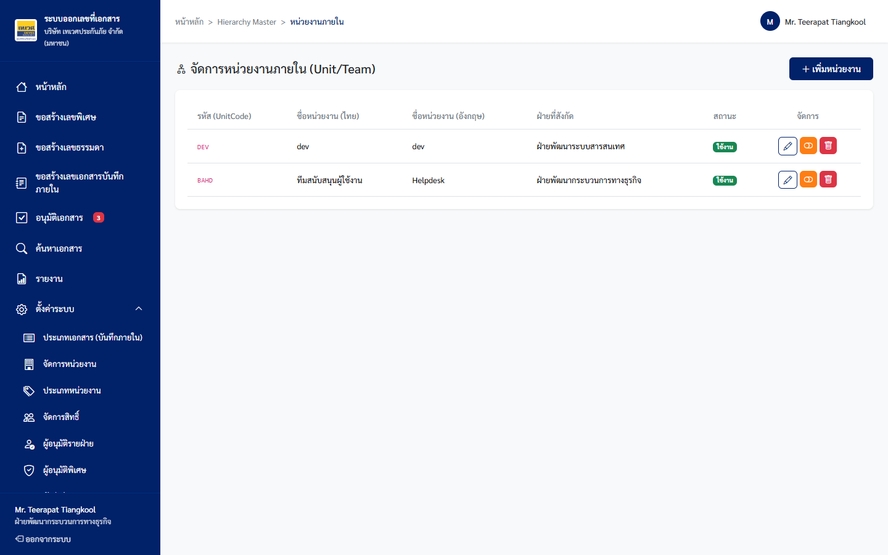
*ภาพที่ 4.12ข: Modal เพิ่มหน่วยงานย่อยใหม่ ผูกกับฝ่ายที่สังกัด*

---

### 4.13 การผูกฝ่ายกับสายงาน (Master Departments Mapping)
Admin จับคู่ฝ่าย (Department จาก AD) เข้ากับสายงาน (Line) เพื่อกำหนดความสัมพันธ์

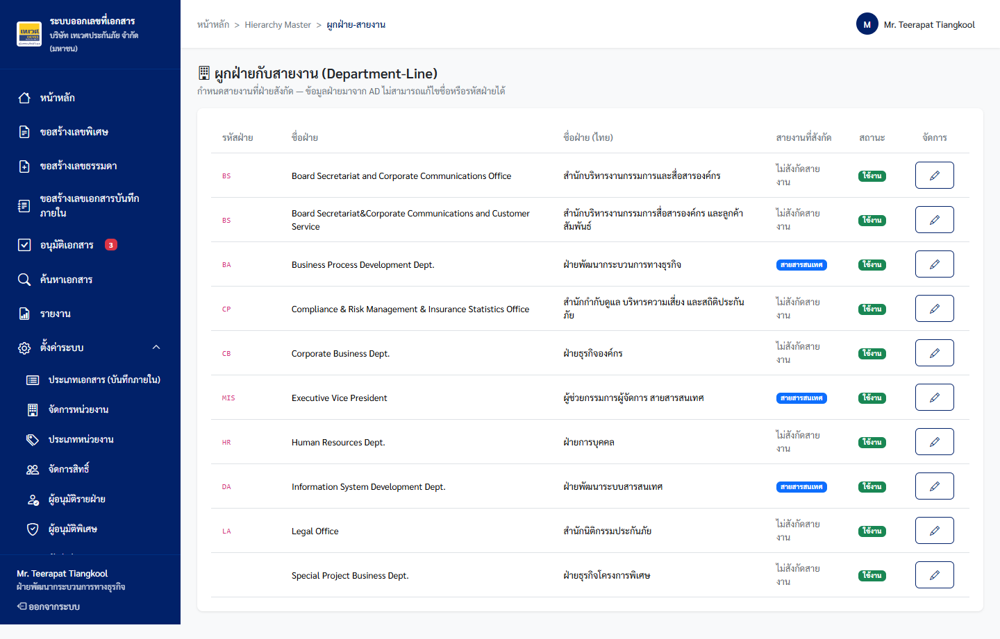
*ภาพที่ 4.13: หน้าจอจับคู่ฝ่ายเข้ากับสายงาน (`Settings/Departments`)*

---

### 4.14 การจัดการตัวย่อฝ่ายและ Running Config (Department Codes & Running Settings)
Admin กำหนด Running Scope (`Shared by Line`, `Separate by Dept`, `Unit Running`), Pattern Template, และจำนวนหลัก Running

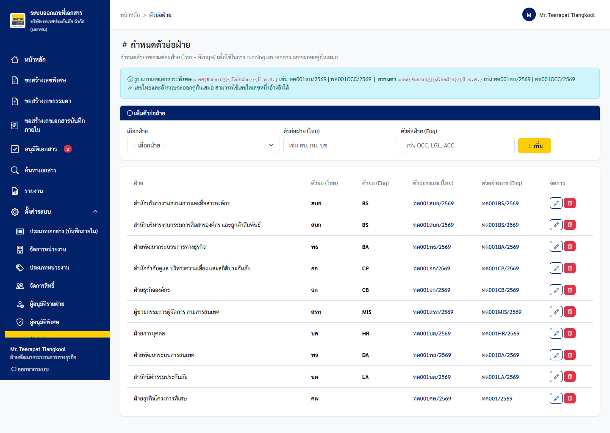
*ภาพที่ 4.14: หน้าจอตั้งค่า Running Config และ Scope ของแต่ละฝ่าย (`Settings/DepartmentCodes`)*

---

### 4.15 รูปแบบเลขที่เอกสารภายใน (Internal Number Formats & Edit Modal)
Admin ตรวจสอบและปรับแก้รูปแบบ Format เลขเอกสารภายในพร้อม Real-time Preview


*ภาพที่ 4.15ก: รายการรูปแบบเลขที่เอกสารภายใน (`Settings/InternalNumberFormats`)*


*ภาพที่ 4.15ข: Modal แก้ไข Pattern Template พร้อมแสดง Preview ผลลัพธ์แบบ Real-time*

---

### 4.16 การจัดการ Master ประเภทเอกสารและการ Review (Internal Doc Types)
Admin จัดการประเภทเอกสารและทำการ Review รายการที่สร้างผ่าน Quick Add (`ReviewStatus=PENDING`)

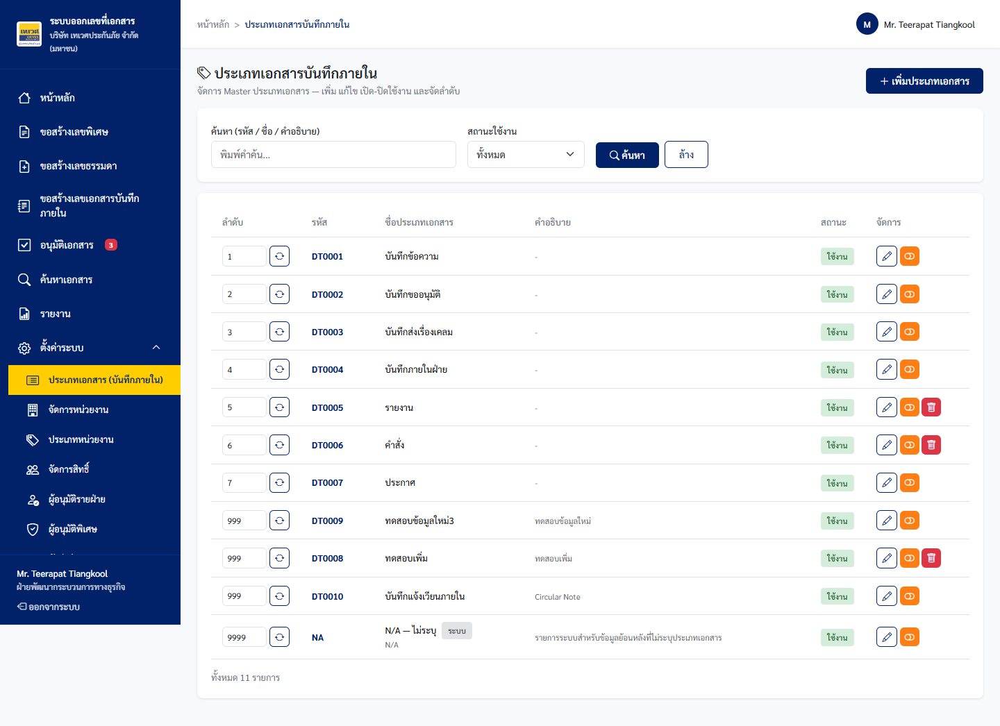
*ภาพที่ 4.16ก: รายการ Master ประเภทเอกสาร (`Settings/InternalDocumentTypes`) แสดง Source และ Review Status*

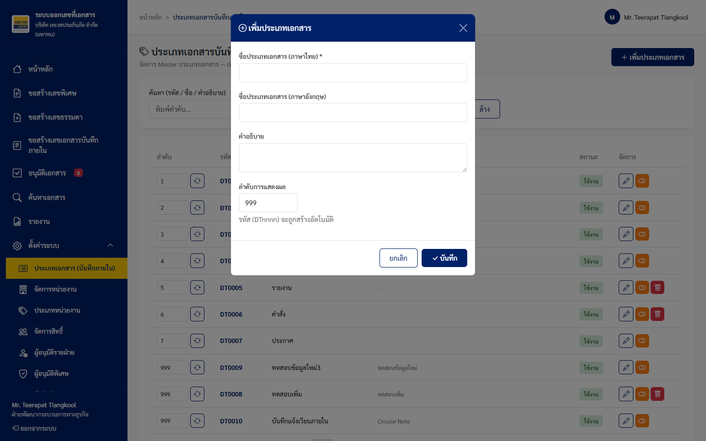
*ภาพที่ 4.16ข: Modal เพิ่มประเภทเอกสารสำหรับ Admin*

---

### 4.17 หน้าค้นหาเอกสาร (Search Screen)
ค้นหาเอกสารครอบคลุมทั้งเอกสารภายในและภายนอก กรองตามฝ่าย, สายงาน, ประเภทเอกสาร, และช่วงวันที่

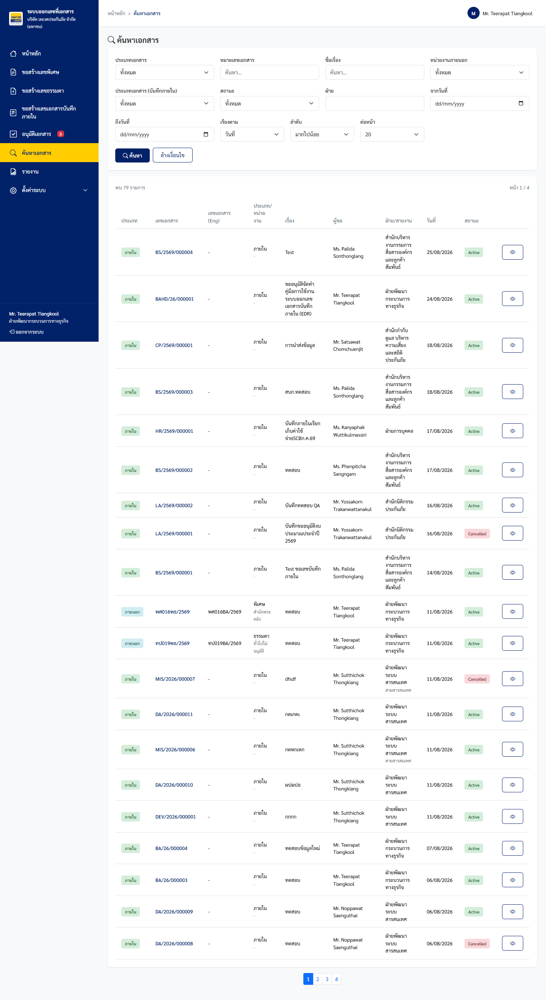
*ภาพที่ 4.17: หน้าจอค้นหาเอกสาร (`/EDR/Search`) รองรับตัวกรองหลากหลายมิติ*

---

### 4.18 หน้ารายงานและส่งออก Excel (Report Screen)
รายงานสรุปการออกเลขเอกสาร พร้อมปุ่ม Export Excel ที่มีคอลัมน์ SharePoint URL ครบถ้วน


*ภาพที่ 4.18: หน้ารายงานและส่งออก Excel (`/EDR/Report`) พร้อมคอลัมน์ SharePoint URL อ้างอิง*

---

## 5. DEFECT TRACKING & RESOLUTION (การติดตามและแก้ไขข้อผิดพลาด)

| Defect ID | Severity | Module | Description | Root Cause | Status | Verification Note |
|---|---|---|---|---|:---:|---|
| **DFT-01** | Minor | Module 3: DocType | ข้อความ Similarity Warning ใน Quick Add Modal แสดงผลชิดขอบ Modal เกินไปในหน้าจอเล็ก | CSS Padding Body | **Resolved / Retested Passed** | ปรับปรุง Responsive Layout เรียบร้อย |
| **DFT-02** | Cosmetic | Module 4: URL | ปุ่ม "ทดสอบเปิดลิงค์" ไอคอนลูกศรเฉียงแสดงเยื้องศูนย์บนเบราว์เซอร์บางรุ่น | FontAwesome Flexbox Align | **Resolved / Retested Passed** | จัด Flex Alignment กึ่งกลางถูกต้อง |

---

## 6. UAT SIGN-OFF & APPROVAL (การลงนามรับรองผลการทดสอบ UAT)

คณะทำงานและตัวแทนผู้ใช้งานทางธุรกิจ (Business Users) ร่วมกับทีมงานพัฒนาระบบสารสนเทศ ได้ดำเนินการตรวจสอบผลการทดสอบการยอมรับของผู้ใช้งานแบบอัตโนมัติ (Automated UAT) ครบถ้วนตามชุดแบบทดสอบ **`Testcase_Admin_EDR_MemoRuning.xlsx`** และ **`Testcase_User_EDR_MemoRuning.xlsx`** รวมทั้งสิ้น **36 Test Cases (24 Scenario Groups)** และมีมติเห็นพ้องต้องกันว่า **ระบบขอเลขที่เอกสารภายใน (EDR) Phase 1 ผ่านเกณฑ์การทดสอบทั้งหมด (100% Passed)** ระบบมีความพร้อมและเสถียรภาพในการนำขึ้นใช้งานจริงบน Production Environment

```
ลงชื่อ ...........................................................             ลงชื่อ ...........................................................
       (นายธีรภัทร ทิพรัตน์)                                                (นายกฤษฎา วงศ์สวัสดิ์)
       Lead Business Analyst                                               Head of Business Process Development
       ฝ่ายพัฒนากระบวนการทางธุรกิจ (BA)                                    ฝ่ายพัฒนากระบวนการทางธุรกิจ (BA)
       วันที่: 26 สิงหาคม 2569                                              วันที่: 26 สิงหาคม 2569


ลงชื่อ ...........................................................             ลงชื่อ ...........................................................
       (นางสาวอารยา สุขเจริญ)                                               (นายสมชาย เลิศวิริยะกุล)
       Senior Business Operations Officer                                  Department Manager (DA)
       ฝ่ายปฏิบัติการ (OCC)                                                ฝ่ายพัฒนาระบบสารสนเทศ (DA)
       วันที่: 26 สิงหาคม 2569                                              วันที่: 26 สิงหาคม 2569
```

---

## 7. APPENDIX: ATTACHED TEST ARTIFACTS (เอกสารแนบท้าย)

1. **Admin Test Cases Workbook:** [Testcase_Admin_EDR_MemoRuning.xlsx](file:///e:/DVS/Project/DVS_Correspondence_system/Phase1_memno_CREDR/UAT/Testcase_Admin_EDR_MemoRuning.xlsx)
2. **User Test Cases Workbook:** [Testcase_User_EDR_MemoRuning.xlsx](file:///e:/DVS/Project/DVS_Correspondence_system/Phase1_memno_CREDR/UAT/Testcase_User_EDR_MemoRuning.xlsx)
3. **Software Requirement Specification Analysis:** [P2026-EDR_Consolidated_SRS_Analysis.md](file:///e:/DVS/Project/DVS_Correspondence_system/Phase1_memno_CREDR/SRS/P2026-EDR_Consolidated_SRS_Analysis.md)
4. **Master Baseline UAT Report:** [F-BP-005-UAT-P2026-EDR-V1.0.0.md](file:///e:/DVS/Project/DVS_Correspondence_system/Phase1_memno_CREDR/UAT/F-BP-005-UAT-P2026-EDR-V1.0.0.md)
5. **UAT System Configuration & Login Credentials:** [Envuat.txt](file:///e:/DVS/Project/DVS_Correspondence_system/Phase1_memno_CREDR/Envuat.txt)
