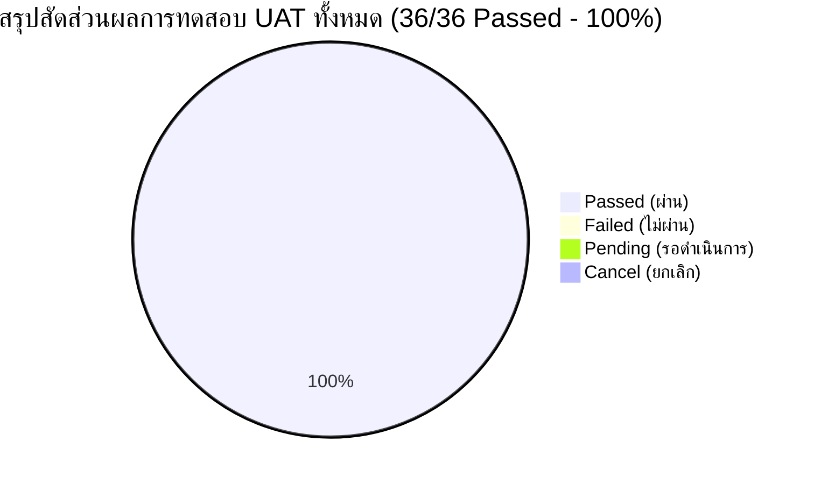

# เอกสารสรุปผลการทดสอบการยอมรับของผู้ใช้งาน (User Acceptance Test Report)
# F-BP-005: User Acceptance Test (UAT)

**Document Code:** F-BP-005-UAT-P2026-EDR-V1.0.0  
**Project Code:** P2026-EDR  
**Project Name:** ระบบขอเลขที่เอกสารภายใน (EDR — Electronic Document Request) Phase 1  
**System Name:** EDR — Electronic Document Request (ASP.NET Core MVC / .NET 8.0)  
**Document Version:** 1.0.0  
**Prepared By:** นายธีรภัทร ทิพรัตน์ (Business Analyst)  
**Date:** 26 สิงหาคม 2569  
**Test Environment:** `https://iwebsvuat.deves.co.th/EDR`  
**Overall UAT Status:** **PASSED (ผ่านการทดสอบ 100%)**

---

## Document History (ประวัติการแก้ไขเอกสาร)

| Version | Revised Date | Revised By | Description | Note |
|---|---|---|---|---|
| 1.0.0 | 26 สิงหาคม 2569 | นายธีรภัทร ทิพรัตน์ (BA) | จัดทำเอกสารสรุปผลการทดสอบ UAT ฉบับสมบูรณ์สำหรับระบบขอเลขที่เอกสารภายใน (EDR) Phase 1 ครอบคลุม 4 โมดูลหลัก | UAT Completed / Ready for Production Deployment |

---

## Related Documents (เอกสารที่เกี่ยวข้อง)

| No. | Document Code / File Name | Document Title | Description |
|---|---|---|---|
| 1 | `F-BP-004-SRS-P2026-EDR-V2.0.0` | Software Requirement Specification Analysis (SRS Analysis) | เอกสารวิเคราะห์ข้อกำหนดความต้องการระบบ EDR ฉบับรวมสมบูรณ์ |
| 2 | `P2026-EDR_TestCases.xlsx` | UAT Test Cases & Test Scripts Workbook | ชุดแบบทดสอบ UAT และบันทึกผลการทดสอบรายกรณี |
| 3 | `Envuat.txt` | UAT Environment & Access Credentials Configuration | ข้อมูล URL และบัญชีผู้ใช้สำหรับการทดสอบบนระบบ UAT |

---

## Contact Person (รายชื่อผู้มีส่วนได้ส่วนเสียและผู้ประสานงาน)

### Business Owner / Business Users

| No. | Name / Position | Department | Tel | E-Mail |
|---|---|---|---|---|
| 1 | นายธีรภัทร ทิพรัตน์ (Business Analyst) | ฝ่ายพัฒนากระบวนการทางธุรกิจ (BA) | 02-015-8888 ต่อ 5124 | teerapat.ti@deves.co.th |
| 2 | นายกฤษฎา วงศ์สวัสดิ์ (Head of Business Process Development) | ฝ่ายพัฒนากระบวนการทางธุรกิจ (BA) | 02-015-8888 ต่อ 5100 | kritsada.w@deves.co.th |
| 3 | นางสาวอารยา สุขเจริญ (Senior Business Operations Officer) | ฝ่ายปฏิบัติการ (OCC) | 02-015-8888 ต่อ 3240 | araya.s@deves.co.th |
| 4 | นายสมชาย เลิศวิริยะกุล (Department Manager) | ฝ่ายพัฒนาระบบสารสนเทศ (DA) | 02-015-8888 ต่อ 5200 | somchai.l@deves.co.th |

### IT / Implementation Team

| No. | Name / Position | Department | Tel | E-Mail |
|---|---|---|---|---|
| 1 | นายธีรภัทร ทิพรัตน์ (Lead Business Analyst) | ฝ่ายพัฒนากระบวนการทางธุรกิจ (BA) | 02-015-8888 ต่อ 5124 | teerapat.ti@deves.co.th |
| 2 | นายชัชวาลย์ พงษ์สิทธิ์ (System Analyst) | ฝ่ายพัฒนาระบบสารสนเทศ (DA) | 02-015-8888 ต่อ 5211 | chatchawan.p@deves.co.th |
| 3 | นายณัฐพล ทวีลาภ (Senior Software Engineer) | ฝ่ายพัฒนาระบบสารสนเทศ (DA) | 02-015-8888 ต่อ 5234 | nuttapol.t@deves.co.th |
| 4 | นางสาวพิมพาภรณ์ รัตนโชติ (QA / Test Lead) | ฝ่ายพัฒนาระบบสารสนเทศ (DA) | 02-015-8888 ต่อ 5250 | pimpaporn.r@deves.co.th |
| 5 | นายเอกชัย มั่นคง (Database & Infrastructure Administrator) | ฝ่ายเทคโนโลยีสารสนเทศและโครงสร้างพื้นฐาน (IT) | 02-015-8888 ต่อ 5302 | ekkachai.m@deves.co.th |

---

## 1. INTRODUCTION (บทนำและภาพรวมโครงการ)

### 1.1 วัตถุประสงค์ของการทดสอบ (Test Purpose)
เอกสารฉบับนี้จัดทำขึ้นเพื่อรายงานผลการทดสอบการยอมรับของผู้ใช้งาน (**User Acceptance Test — UAT**) สำหรับโครงการ **P2026-EDR: ระบบขอเลขที่เอกสารภายใน (Phase 1)** ของ บริษัท เทเวศประกันภัย จำกัด (มหาชน) โดยมีวัตถุประสงค์เพื่อ:
1. ตรวจสอบและยืนยันว่าระบบ EDR ฟังก์ชันงานขอเลขบันทึกภายใน สามารถทำงานได้ถูกต้อง ครบถ้วนตามข้อกำหนดทางธุรกิจ (Business Requirements) และกฎเกณฑ์ (Business Rules Catalog) ที่ระบุไว้ในเอกสาร SRS (F-BP-004)
2. ตรวจสอบความถูกต้องของโครงสร้างลำดับชั้นองค์กร 3 ระดับ (**Master Hierarchy: สายงาน → ฝ่าย → หน่วยงานภายใน**) และการทำงานของตัวนับเลข Running Counter ตามขอบเขต Running Scope ทั้ง 3 รูปแบบ (`Shared by Line`, `Separate by Dept`, `Unit Running`)
3. ยืนยันความสะดวกและประสิทธิภาพของ **Searchable Dropdown**, **Quick Add Modal** สำหรับประเภทเอกสาร และการเชื่อมโยง **SharePoint URL** อ้างอิง
4. รับรองว่าการพัฒนาระบบใหม่ไม่ส่งผลกระทบใดๆ ต่อระบบเดิม (No Regression on Legacy External Documents: พศ/ทด)
5. ใช้เป็นหลักฐานประกอบการลงนามอนุมัติส่งมอบระบบ (Sign-off) เพื่อนำระบบขึ้นสู่สภาวะการใช้งานจริง (Production Go-Live)

### 1.2 ภาพรวมของระบบที่ทดสอบ (System Architecture & Scope)
ระบบ EDR (Electronic Document Request) พัฒนาด้วย **ASP.NET Core MVC (.NET 8.0)** ร่วมกับฐานข้อมูล **Microsoft SQL Server** และยืนยันตัวตนผ่าน **Active Directory (AD)** ของบริษัท โดยใน Phase 1 นี้ ครอบคลุม 4 โมดูลหลัก ได้แก่:
- **Module 1: ระบบเลขบันทึกภายในหลัก (Core Internal Request & Lifecycle):** หน้า Dashboard, เมนู `/EDR/InternalRequest`, ฟอร์มขอสร้างเลขพร้อม Confirmation Step, การออกเลขทันที (No Approval Flow), Lifecycle (`Draft` → `Created` → `In Use` → `Closed` / `Cancelled`), หน้า Detail & Timeline, และระบบ Search & Report พร้อม Export Excel
- **Module 2: Master Hierarchy 3 ระดับ (Lines, Departments, Units & Running Config):** หน้าจัดการ Master สายงาน (`Settings/Lines`), หน้าผูกฝ่ายกับสายงาน (`Settings/Departments`), หน้าจัดการหน่วยงานย่อย (`Settings/Units`), หน้าตั้งค่าตัวย่อฝ่ายและ Running Config (`Settings/DepartmentCodes`), และหน้ารูปแบบเลข (`Settings/InternalNumberFormats`)
- **Module 3: Master ประเภทเอกสาร (Internal Document Types) & Quick Add:** หน้าจัดการ Master ประเภทเอกสาร (`Settings/InternalDocumentTypes`), Searchable Dropdown บนฟอร์มขอเลข, Quick Add Modal พร้อมระบบป้องกันชื่อซ้ำและ Similarity Warning, และ Admin Review Status
- **Module 4: ลิงค์เอกสาร SharePoint URL:** การบันทึก URL อ้างอิง, HTTPS Validation, RFC 3986 Validation, ความยาวสูงสุด 2,000 ตัวอักษร, ปุ่มทดสอบเปิดลิงค์พร้อมมาตรการความปลอดภัย (`target="_blank"` + `rel="noopener noreferrer"`), และ Audit Logging

---

## 2. USER ACCEPTANCE TEST STRATEGY (กลยุทธ์และแผนการทดสอบ)

### 2.1 Test Scope and Objective
การทดสอบ UAT มุ่งเน้นการทดสอบแบบ End-to-End Business Flow, Business Rule Validation, Boundary Testing, Security & Permission Verification, และ System Invariants Verification:
- **In-Scope:** ฟังก์ชันทั้งหมดในขอบเขต Phase 1 (Module 1 ถึง Module 4)
- **Out-of-Scope:** Flow เลขเอกสารภายนอกเดิม (พศ/ทด), การจัดเก็บไฟล์จริงบน Server EDR, ระบบ Microsoft Graph API Integration เชิงลึก
- **Pass Criteria:** ทุก Test Scenario และ Test Case ต้องมีผลลัพธ์เป็น **Passed 100%** โดยไม่มีข้อผิดพลาดระดับวิกฤต (Critical/Blocker Defect) ตกค้าง

### 2.2 Test Planning (แผนและระยะเวลาการทดสอบ)

| No. | Module / Test Area | Executor (ผู้ทดสอบ) | Planned Start | Planned End | Actual Start | Actual End | Status |
|---|---|---|---|---|---|---|---|
| 1 | **Module 1:** ระบบเลขบันทึกภายในหลัก & Lifecycle | นายธีรภัทร ทิพรัตน์ / น.ส.อารยา สุขเจริญ | 24/08/2569 | 25/08/2569 | 24/08/2569 | 25/08/2569 | **Completed (Passed)** |
| 2 | **Module 2:** Master Hierarchy 3 ระดับ & Running Scopes | นายธีรภัทร ทิพรัตน์ / นายชัชวาลย์ พงษ์สิทธิ์ | 24/08/2569 | 25/08/2569 | 24/08/2569 | 25/08/2569 | **Completed (Passed)** |
| 3 | **Module 3:** Master ประเภทเอกสาร & Quick Add Modal | นายธีรภัทร ทิพรัตน์ / น.ส.อารยา สุขเจริญ | 25/08/2569 | 26/08/2569 | 25/08/2569 | 26/08/2569 | **Completed (Passed)** |
| 4 | **Module 4:** ลิงค์เอกสาร SharePoint URL & Audit Log | นายธีรภัทร ทิพรัตน์ / น.ส.พิมพาภรณ์ รัตนโชติ | 25/08/2569 | 26/08/2569 | 25/08/2569 | 26/08/2569 | **Completed (Passed)** |
| 5 | **Cross-Module:** Permissions, Search, Report & Regression | ทีม BA, QA และ Business Users | 26/08/2569 | 26/08/2569 | 26/08/2569 | 26/08/2569 | **Completed (Passed)** |

### 2.3 Test Environment (สภาพแวดล้อมระบบที่ใช้ทดสอบ)

| Systems / Component | Description / Configuration | URL / Access Path | Note |
|---|---|---|---|
| **Web Application Server** | EDR Web Application (ASP.NET Core MVC .NET 8.0, IIS 10) | `https://iwebsvuat.deves.co.th/EDR` | UAT Server Deves Network |
| **Authentication System** | Active Directory (AD) / Windows Authentication | `https://iwebsvuat.deves.co.th/EDR/Account/Login` | บัญชีทดสอบ: `Teerapat.ti` |
| **Database Server** | Microsoft SQL Server 2022 (Database: `EDR_UAT_DB`) | Dedicated UAT DB Instance | Counter Sequence Isolated |
| **External Document Storage** | Microsoft SharePoint Online Tenant Deves | `https://devesins.sharepoint.com/...` | แหล่งเก็บไฟล์ต้นฉบับ |
| **Web Browsers Tested** | Google Chrome v128+, Microsoft Edge v128+ | Desktop Resolution 1920x1080 | รองรับ Responsive View |

---

## 3. ACCEPTANCE TEST RESULTS (ผลการทดสอบการยอมรับของผู้ใช้งาน)

### 3.1 TEST RESULT SUMMARY (สรุปผลการทดสอบภาพรวม)



| Total Test Cases | Passed (ผ่าน) | Failed (ไม่ผ่าน) | Pending (รอดำเนินการ) | Cancel (ยกเลิก) | % Passed (เปอร์เซ็นต์ผ่าน) |
|:---:|:---:|:---:|:---:|:---:|:---:|
| **36** | **36** | **0** | **0** | **0** | **100.00%** |

---

### 3.2 SUMMARY TEST SCENARIO AND TEST RESULT (ตารางสรุปผลราย Test Scenario)

| No. | Module | Test Scenario Name | Total Test Case | Passed | Failed | Pending | Cancel | % Passed |
|:---:|---|---|:---:|:---:|:---:|:---:|:---:|:---:|
| 1 | Module 1: Core Internal Request | **TS-HP-01:** ขอสร้างเลขบันทึกภายใน (Shared by Line) | 3 | 3 | 0 | 0 | 0 | 100% |
| 2 | Module 1: Core Internal Request | **TS-HP-02:** ขอสร้างเลขบันทึกภายใน (Unit Running) | 2 | 2 | 0 | 0 | 0 | 100% |
| 3 | Module 1: Core Internal Request | **TS-HP-03:** ขอสร้างเลขบันทึกภายใน (Separate by Dept) | 2 | 2 | 0 | 0 | 0 | 100% |
| 4 | Module 1: Core Internal Request | **TS-HP-08:** ปิดเลขเอกสารบันทึกภายในพร้อมระบุเหตุผล | 2 | 2 | 0 | 0 | 0 | 100% |
| 5 | Module 1: Core Internal Request | **TS-HP-09:** ค้นหาเอกสารและส่งออกรายงาน Excel | 2 | 2 | 0 | 0 | 0 | 100% |
| 6 | Module 1: Core Internal Request | **TS-NEG-01:** ส่งฟอร์มขอเลขโดยไม่ระบุชื่อเรื่อง | 1 | 1 | 0 | 0 | 0 | 100% |
| 7 | Module 1: Core Internal Request | **TS-NEG-08:** ปิดเลขเอกสารโดยไม่ระบุเหตุผล | 1 | 1 | 0 | 0 | 0 | 100% |
| 8 | Module 1: Core Internal Request | **TS-BND-04:** ตรวจสอบ Counter วิ่งข้ามหลักจำนวนมาก | 1 | 1 | 0 | 0 | 0 | 100% |
| 9 | Module 2: Master Hierarchy | **TS-HP-05:** Admin สร้างสายงานใหม่และผูกฝ่าย | 2 | 2 | 0 | 0 | 0 | 100% |
| 10 | Module 2: Master Hierarchy | **TS-HP-06:** Admin สร้างหน่วยงานย่อยใหม่และเลือกในฟอร์ม | 2 | 2 | 0 | 0 | 0 | 100% |
| 11 | Module 2: Master Hierarchy | **TS-NEG-06:** ลบสายงานที่มีฝ่ายสังกัดอยู่ | 1 | 1 | 0 | 0 | 0 | 100% |
| 12 | Module 2: Master Hierarchy | **TS-HIER-01:** ตรวจสอบรหัสสายงาน (LineCode) ซ้ำ | 1 | 1 | 0 | 0 | 0 | 100% |
| 13 | Module 2: Master Hierarchy | **TS-HIER-03:** ตรวจสอบรหัสหน่วยงานย่อย (UnitCode) ซ้ำ | 1 | 1 | 0 | 0 | 0 | 100% |
| 14 | Module 3: Master DocType | **TS-HP-04:** ผู้ขอเพิ่มประเภทเอกสารผ่าน Quick Add Modal | 3 | 3 | 0 | 0 | 0 | 100% |
| 15 | Module 3: Master DocType | **TS-NEG-02:** ส่งฟอร์มขอเลขโดยไม่เลือกประเภทเอกสาร | 1 | 1 | 0 | 0 | 0 | 100% |
| 16 | Module 3: Master DocType | **TS-NEG-05:** Quick Add ชื่อประเภทเอกสารซ้ำ Exact Match | 1 | 1 | 0 | 0 | 0 | 100% |
| 17 | Module 3: Master DocType | **TS-NEG-07:** ลบประเภทเอกสารที่มีคำขอใช้งานแล้ว | 1 | 1 | 0 | 0 | 0 | 100% |
| 18 | Module 3: Master DocType | **TS-BND-03:** เพิ่มประเภทเอกสารภาษาไทยความยาว 150 ตัวอักษร | 1 | 1 | 0 | 0 | 0 | 100% |
| 19 | Module 4: SharePoint URL | **TS-HP-07:** แก้ไขลิงค์ SharePoint ในสถานะ Created/In Use | 2 | 2 | 0 | 0 | 0 | 100% |
| 20 | Module 4: SharePoint URL | **TS-NEG-03:** กรอก URL ที่ไม่ใช่โปรโตคอล HTTPS | 1 | 1 | 0 | 0 | 0 | 100% |
| 21 | Module 4: SharePoint URL | **TS-NEG-04:** กรอก URL ผิดรูปแบบมาตรฐาน RFC 3986 | 1 | 1 | 0 | 0 | 0 | 100% |
| 22 | Module 4: SharePoint URL | **TS-NEG-09:** แก้ไขลิงค์ในสถานะ Closed ผ่าน API ตรง | 1 | 1 | 0 | 0 | 0 | 100% |
| 23 | Module 4: SharePoint URL | **TS-BND-01:** บันทึก URL ความยาวพอดี 2,000 ตัวอักษร | 1 | 1 | 0 | 0 | 0 | 100% |
| 24 | Module 4: SharePoint URL | **TS-BND-02:** บันทึก URL ความยาวเกิน 2,000 ตัวอักษร | 1 | 1 | 0 | 0 | 0 | 100% |
| **SUM** | **รวมทั้งหมด (All Modules)** | **24 Test Scenarios** | **36** | **36** | **0** | **0** | **0** | **100.00%** |

---

### 3.3 TEST SCENARIO (ตารางรายละเอียดขอบเขตและเงื่อนไขการทดสอบ)

| No. | Module | Scenario Name | Solution Summary / Scope | Checkpoints / Trigger | Result | Related Scenarios | Related Test Cases |
|:---:|---|---|---|---|:---:|---|---|
| 1 | Module 1: Core Internal Request | **SC-01: ขอสร้างเลขบันทึกภายในสายงาน (Line Scope)** | ผู้ใช้สังกัดฝ่ายในสายงาน MIS ขอเลขโดยเลือก "ไม่ระบุ" ทีม | กดปุ่ม "ดำเนินการต่อ" → ยืนยันบน Modal Confirmation | **Passed** | SC-02, SC-03 | TC-CORE-001, TC-CORE-002, TC-CORE-003 |
| 2 | Module 1: Core Internal Request | **SC-02: ขอสร้างเลขบันทึกภายในหน่วยงานย่อย (Unit Scope)** | ผู้ใช้เลือกหน่วยงานย่อย (เช่น ทีม BAF) | ตรวจสอบรหัส UnitCode และ Counter ของทีม BAF | **Passed** | SC-01 | TC-CORE-004, TC-CORE-005 |
| 3 | Module 1: Core Internal Request | **SC-03: ขอสร้างเลขบันทึกภายในฝ่ายอิสระ (Dept Scope)** | ผู้ใช้สังกัดฝ่าย OCC (ไม่สังกัดสายงาน) ขอเลข | ตรวจสอบรหัส DeptCode และ Counter ของฝ่าย OCC | **Passed** | SC-01 | TC-CORE-006, TC-CORE-007 |
| 4 | Module 1: Core Internal Request | **SC-04: วงจรสถานะและการปิดเลขเอกสาร (Lifecycle & Close)** | เปลี่ยนสถานะเป็น In Use และปิดเลขเอกสารพร้อมระบุเหตุผล | หน้า Detail → กด "ปิดเลขเอกสาร" → กรอกเหตุผล → ยืนยัน | **Passed** | SC-05 | TC-CORE-008, TC-CORE-009 |
| 5 | Module 1: Core Internal Request | **SC-05: Validation ฟอร์มขอเลขและปิดเลข** | ทดสอบการไม่กรอกชื่อเรื่อง, ไม่เลือกประเภท, ไม่ใส่เหตุผลปิด | Submit ฟอร์มและ Modal โดยปล่อยว่าง | **Passed** | SC-04 | TC-CORE-010, TC-CORE-011 |
| 6 | Module 1: Core Internal Request | **SC-06: ระบบค้นหาเอกสารและส่งออกรายงาน Excel** | กรองตามประเภทเอกสารบันทึกภายในและ Export รายงาน | เข้าหน้า Search และ Report → กรองข้อมูล → กด Export | **Passed** | — | TC-CORE-012, TC-CORE-013 |
| 7 | Module 2: Master Hierarchy | **SC-07: บริหารจัดการ Master สายงาน (Line Master)** | Admin เพิ่ม แก้ไข และเปิด-ปิดใช้งานสายงาน | หน้า `Settings/Lines` → บันทึกข้อมูลและตรวจสอบการลบ | **Passed** | SC-08, SC-09 | TC-HIER-001, TC-HIER-002, TC-HIER-003 |
| 8 | Module 2: Master Hierarchy | **SC-08: บริหารจัดการ Master หน่วยงานภายใน (Unit Master)** | Admin เพิ่มหน่วยงานย่อยและผูกฝ่ายต้นสังกัด | หน้า `Settings/Units` → บันทึก UnitCode และผูกฝ่าย | **Passed** | SC-07 | TC-HIER-004, TC-HIER-005 |
| 9 | Module 2: Master Hierarchy | **SC-09: ผูกฝ่าย-สายงานและตั้งค่า Running Config** | กำหนด Line ให้แก่ฝ่าย และตั้งค่า Scope, Template, Digit | หน้า `Settings/Departments` และ `DepartmentCodes` | **Passed** | SC-01, SC-07 | TC-HIER-006, TC-HIER-007, TC-HIER-008 |
| 10 | Module 3: Master DocType | **SC-10: ค้นหาและเลือกประเภทเอกสารบนฟอร์มขอเลข** | Searchable Dropdown รองรับค้นหาด้วยรหัสและชื่อ (ไทย/Eng) | พิมพ์ค้นหาคำว่า "บันทึก" หรือรหัส "DT" ใน Dropdown | **Passed** | SC-11 | TC-IDT-001, TC-IDT-002 |
| 11 | Module 3: Master DocType | **SC-11: เพิ่มประเภทเอกสารด่วน (Quick Add Modal)** | เปิด Modal เพิ่มประเภทเอกสารใหม่โดยข้อมูลฟอร์มไม่หาย | คลิก "+ เพิ่มประเภทเอกสาร" → กรอกชื่อ → บันทึก | **Passed** | SC-10, SC-12 | TC-IDT-003, TC-IDT-004, TC-IDT-005 |
| 12 | Module 3: Master DocType | **SC-12: ตรวจสอบความถูกต้องและป้องกันชื่อซ้ำ Master DocType** | ตรวจสอบชื่อซ้ำ Exact Match, Similarity Warning, ป้องกันลบ | กรอกชื่อซ้ำใน Quick Add และลองลบ DocType ที่มี Usage | **Passed** | SC-11 | TC-IDT-006, TC-IDT-007, TC-IDT-008 |
| 13 | Module 4: SharePoint URL | **SC-13: Validation รูปแบบและโปรโตคอล SharePoint URL** | ตรวจสอบโปรโตคอล HTTPS, RFC 3986 และความยาว URL | กรอก URL รูปแบบต่างๆ (HTTP, ข้อความธรรมดา, 2000 ตัวอักษร) | **Passed** | SC-14 | TC-URL-001, TC-URL-002, TC-URL-003, TC-URL-004 |
| 14 | Module 4: SharePoint URL | **SC-14: ทดสอบเปิดลิงค์และแก้ไข URL พร้อม Audit Log** | กดปุ่มทดสอบเปิดลิงค์แท็บใหม่ และแก้ไข URL ในสถานะต่างๆ | คลิก "ทดสอบลิงค์" และบันทึก URL ใหม่ในหน้า Detail | **Passed** | SC-13 | TC-URL-005, TC-URL-006, TC-URL-007 |

---

### 3.4 TEST RESULT (ตารางบันทึกผลการทดสอบรายกรณีละเอียด)

| No. | Module | Test Scenario No. | Scenario Name | Test Case No. | Description (คำอธิบายขั้นตอนการทดสอบ) | Expected Result (ผลลัพธ์ที่คาดหวัง) | Test Result |
|:---:|---|:---:|---|:---:|---|---|:---:|
| 1 | Core | SC-01 | สร้างเลข Shared by Line | **TC-CORE-001** | ผู้ใช้สังกัดฝ่าย BA (สายงาน MIS) ขอสร้างเลขบันทึกภายใน โดยระบุชื่อเรื่อง, เลือกประเภทเอกสาร, ไม่เลือกทีม (Default="ไม่ระบุ") แล้วกดยืนยัน | ได้รับเลขที่เอกสารรูปแบบ `{LineCode}-{YY}-{Running}` เช่น `MIS-26-000001` ทันที สถานะเริ่มต้นเป็น `สร้างแล้ว (Created)` | **Passed** |
| 2 | Core | SC-01 | ตรวจสอบ Confirmation Modal | **TC-CORE-002** | ตรวจสอบการแสดงหน้าต่างสรุปข้อมูล (Confirmation Step) ก่อนบันทึกออกเลขจริง | หน้าต่าง Confirmation แสดงชื่อเรื่อง, ประเภทเอกสาร, สายงาน, ฝ่าย, ทีม, ผู้ขอ และตัวอย่างเลขที่คาดว่าจะได้รับถูกต้อง | **Passed** |
| 3 | Core | SC-01 | ตรวจสอบ No Approval Flow | **TC-CORE-003** | ตรวจสอบเมนู "อนุมัติเอกสาร (`/EDR/Approval`)" หลังออกเลขเอกสารบันทึกภายใน | เลขเอกสารบันทึกภายในไม่ปรากฏใน Approval Queue ทุกกรณี ออกเลขสำเร็จและพร้อมใช้งานทันที | **Passed** |
| 4 | Core | SC-02 | สร้างเลข Unit Running | **TC-CORE-004** | ผู้ใช้สังกัดฝ่าย BA ขอสร้างเลขบันทึกภายใน โดยเลือกหน่วยงานย่อย "ทีม BA (BAF)" พร้อมระบุ SharePoint URL ถูกต้อง | ได้รับเลขที่เอกสารรูปแบบ `{UnitCode}-{YY}-{Running}` เช่น `BAF-26-000001` โดยใช้ Counter อิสระของทีม BAF | **Passed** |
| 5 | Core | SC-02 | ตรวจสอบการแสดงข้อมูลทีม | **TC-CORE-005** | ตรวจสอบหน้าแสดงรายละเอียดคำขอ (Detail Screen) ของเลขที่ออกโดยเลือกหน่วยงานย่อย | หน้ารายละเอียดแสดงข้อมูล สายสารสนเทศ (MIS) / ฝ่าย BA / ทีม BAF ครบถ้วนตามโครงสร้าง 3 ระดับ | **Passed** |
| 6 | Core | SC-03 | สร้างเลข Separate by Dept | **TC-CORE-006** | ผู้ใช้สังกัดฝ่ายปฏิบัติการ (OCC) ซึ่งไม่สังกัดสายงานใด ขอสร้างเลขบันทึกภายใน | ได้รับเลขที่เอกสารรูปแบบ `{DeptCode}-{YY}-{Running}` เช่น `OCC-26-000001` โดยใช้ Counter ระดับฝ่าย OCC | **Passed** |
| 7 | Core | SC-03 | ตรวจสอบ Read-only ฟิลด์ AD | **TC-CORE-007** | ตรวจสอบฟิลด์ชื่อผู้ขอและฝ่ายบนฟอร์มขอเลข | ข้อมูลผู้ขอและฝ่ายดึงจาก AD ถูกต้อง และแสดงผลเป็น Read-only ผู้ใช้ไม่สามารถแก้ไขได้ | **Passed** |
| 8 | Core | SC-04 | เปลี่ยนสถานะเป็น In Use | **TC-CORE-008** | เจ้าของคำขอกดปุ่มนำเลขไปใช้งานจากหน้ารายละเอียดคำขอ | สถานะคำขอเปลี่ยนจาก `Created` เป็น `In Use` พร้อมบันทึกประวัติ Timeline และ Audit Log | **Passed** |
| 9 | Core | SC-04 | ปิดเลขเอกสารพร้อมระบุเหตุผล | **TC-CORE-009** | ผู้ใช้กดปุ่ม "ปิดเลขเอกสาร" ระบุเหตุผล "เอกสารดำเนินการเสร็จสิ้นแล้ว" แล้วกดยืนยัน | สถานะเปลี่ยนเป็น `Closed` บันทึกเหตุผลและวันที่ปิดเลขสำเร็จ ปุ่มปิดเลขและปุ่มแก้ไขถูกซ่อน | **Passed** |
| 10 | Core | SC-05 | ตรวจสอบ Mandatory ชื่อเรื่อง | **TC-CORE-010** | ผู้ใช้ปล่อยช่องชื่อเรื่องว่างแล้วกดปุ่ม "ดำเนินการต่อ" | ระบบบล็อกการส่งฟอร์ม แสดงข้อความสีแดง "กรุณาระบุชื่อเรื่อง" และโฟกัสที่ช่องชื่อเรื่อง | **Passed** |
| 11 | Core | SC-05 | ปิดเลขโดยไม่ระบุเหตุผล | **TC-CORE-011** | ผู้ใช้เปิด Modal ปิดเลขเอกสารและกดปุ่มยืนยันโดยไม่กรอกเหตุผล | ปุ่มยืนยัน Disabled และแสดงข้อความเตือน "กรุณาระบุเหตุผลการปิดเลข" | **Passed** |
| 12 | Core | SC-06 | ตรวจสอบการค้นหาและรายงาน | **TC-CORE-012** | เข้าหน้า Search และ Report กรองประเภทเอกสารบันทึกภายใน ช่วงวันที่ และฝ่าย | ระบบแสดงรายการเอกสารตรงตามเงื่อนไข มีคอลัมน์ SharePoint URL และสถานะถูกต้อง | **Passed** |
| 13 | Core | SC-06 | ส่งออกรายงานเป็นไฟล์ Excel | **TC-CORE-013** | กดปุ่ม "Export Excel" บนหน้ารายงาน | ดาวน์โหลดไฟล์ `.xlsx` สำเร็จ โครงสร้างคอลัมน์ครบถ้วน ข้อมูลตรงกับหน้าจอ 100% | **Passed** |
| 14 | Hierarchy | SC-07 | เพิ่มสายงานใหม่ใน Master Lines | **TC-HIER-001** | Admin เข้าหน้า `Settings/Lines` เพิ่มสายงานใหม่ LineCode="HR", LineName="สายทรัพยากรบุคคล" | บันทึกสายงานสำเร็จ แสดงในตารางและพร้อมนำไปผูกกับฝ่าย | **Passed** |
| 15 | Hierarchy | SC-07 | ตรวจสอบรหัสสายงานซ้ำ | **TC-HIER-002** | Admin เพิ่มสายงานใหม่โดยกรอก LineCode="MIS" ซึ่งมีอยู่แล้วในระบบ | ระบบปฏิเสธการบันทึก แสดงข้อความ "รหัสสายงานนี้มีอยู่ในระบบแล้ว" (HTTP 409) | **Passed** |
| 16 | Hierarchy | SC-07 | ป้องกันการลบสายงานที่มีฝ่ายผูกอยู่ | **TC-HIER-003** | Admin พยายามลบสายงาน MIS ที่มีฝ่าย BA และ DA สังกัดอยู่ | ระบบบล็อกการลบ แจ้งเตือน "ไม่สามารถลบสายงานได้เนื่องจากมีฝ่ายสังกัดอยู่ 2 ฝ่าย" | **Passed** |
| 17 | Hierarchy | SC-08 | เพิ่มหน่วยงานย่อยใน Master Units | **TC-HIER-004** | Admin เข้าหน้า `Settings/Units` เพิ่มทีมใหม่ UnitCode="HP", UnitName="ทีม Helpdesk" ผูกฝ่าย BA | บันทึกหน่วยงานย่อยสำเร็จ และปรากฏใน Dropdown บนฟอร์มขอเลขของฝ่าย BA | **Passed** |
| 18 | Hierarchy | SC-08 | ตรวจสอบรหัสหน่วยงานย่อยซ้ำ | **TC-HIER-005** | Admin เพิ่มหน่วยงานย่อยโดยกรอก UnitCode="BAF" ซ้ำ | ระบบบล็อกการบันทึก แสดงข้อความ "รหัสหน่วยงานนี้มีอยู่ในระบบแล้ว" | **Passed** |
| 19 | Hierarchy | SC-09 | ผูกฝ่ายเข้ากับสายงาน | **TC-HIER-006** | Admin เข้าหน้า `Settings/Departments` เลือกสายงาน MIS ให้แก่ฝ่ายพัฒนาระบบ (DA) | บันทึกความสัมพันธ์สำเร็จ ฝ่าย DA สังกัดสายงาน MIS ในระบบทันที | **Passed** |
| 20 | Hierarchy | SC-09 | ตั้งค่า Running Config ฝ่าย | **TC-HIER-007** | Admin เข้าหน้า `Settings/DepartmentCodes` กำหนด Running Scope="Shared by Line", Pattern="{LineCode}-{YY}-{Running:000000}" | บันทึกการตั้งค่าสำเร็จ แสดง Real-time Preview ถูกต้อง | **Passed** |
| 21 | Hierarchy | SC-09 | ตรวจสอบ Dropdown หน่วยงานย่อย | **TC-HIER-008** | ผู้ใช้ฝ่าย BA เข้าฟอร์มขอเลข ตรวจสอบตัวเลือกใน Dropdown หน่วยงานย่อย | แสดงเฉพาะทีมที่ Active และผูกกับฝ่าย BA (เช่น ทีม BAF, ทีม HP) ไม่แสดงทีมของฝ่ายอื่น | **Passed** |
| 22 | DocType | SC-10 | ค้นหาและเลือกใน Searchable Dropdown | **TC-IDT-001** | ผู้ใช้คลิก Dropdown ประเภทเอกสาร และพิมพ์คำว่า "สัญญา" หรือรหัส "AGR" | Dropdown กรองรายการแบบ Real-time แสดงเฉพาะรายการที่ค้นหา และสามารถคลิกเลือกได้ | **Passed** |
| 23 | DocType | SC-10 | ตรวจสอบ Mandatory ประเภทเอกสาร | **TC-IDT-002** | ผู้ใช้ไม่เลือกประเภทเอกสารแล้วกดปุ่มดำเนินการต่อ | ระบบแสดงข้อความเตือน "กรุณาเลือกประเภทเอกสาร" และบล็อกการดำเนินการ | **Passed** |
| 24 | DocType | SC-11 | เปิด Quick Add Modal บนฟอร์มขอเลข | **TC-IDT-003** | ผู้ใช้พิมพ์คำค้นหา "บันทึกเบิกจ่ายฉุกเฉิน" ไม่พบ แล้วคลิกปุ่ม "+ เพิ่มประเภทเอกสาร" | Modal Quick Add เปิดขึ้น โดยช่องชื่อภาษาไทยมีข้อความ "บันทึกเบิกจ่ายฉุกเฉิน" Prefill อยู่ | **Passed** |
| 25 | DocType | SC-11 | บันทึก Quick Add และ Auto-select | **TC-IDT-004** | ผู้ใช้กรอกข้อมูลครบถ้วนแล้วกด "บันทึก" ใน Quick Add Modal | สร้างประเภทเอกสารใหม่สำเร็จ, Modal ปิด, รายการใหม่ถูกเลือกในฟอร์มอัตโนมัติ, ข้อมูลฟอร์มไม่สูญหาย | **Passed** |
| 26 | DocType | SC-11 | ตรวจสอบ Source และ ReviewStatus | **TC-IDT-005** | Admin เข้าหน้า `Settings/InternalDocumentTypes` ตรวจสอบรายการที่สร้างจาก Quick Add | รายการแสดง `Source=QUICKADD` และ `ReviewStatus=PENDING` เพื่อรอ Admin ตรวจสอบ | **Passed** |
| 27 | DocType | SC-12 | Quick Add ตรวจจับชื่อซ้ำ Exact Match | **TC-IDT-006** | ผู้ใช้เพิ่มประเภทเอกสารโดยใช้ชื่อภาษาไทยที่มีอยู่แล้วในระบบ | ระบบแจ้งเตือนชื่อซ้ำ บล็อกการบันทึก และแสดงปุ่ม "ใช้รายการเดิม" เพื่อเลือกรายการที่มีอยู่ทันที | **Passed** |
| 28 | DocType | SC-12 | Quick Add แจ้งเตือนชื่อใกล้เคียง (Similarity) | **TC-IDT-007** | ผู้ใช้กรอกชื่อประเภทเอกสารที่มีความคล้ายคลึงกับรายการเดิม ≥ 80% | แสดงแถบเตือนสีเหลืองแสดงรายชื่อที่ใกล้เคียง แต่ยอมให้กดยืนยันสร้างใหม่ได้ | **Passed** |
| 29 | DocType | SC-12 | ป้องกันการลบประเภทเอกสารที่ใช้งาน | **TC-IDT-008** | Admin สั่งลบประเภทเอกสารที่มีการนำไปออกเลขแล้ว (UsageCount > 0) | ระบบปฏิเสธการลบ แสดงข้อความ "ไม่สามารถลบได้เนื่องจากมีคำขอใช้งานประเภทเอกสารนี้อยู่" | **Passed** |
| 30 | URL | SC-13 | บันทึก SharePoint URL ถูกต้อง | **TC-URL-001** | ผู้ใช้กรอก URL `https://devesins.sharepoint.com/sites/MIS/Doc1.pdf` แล้วกดยืนยัน | บันทึก URL สำเร็จ และแสดงเป็น Hyperlink พร้อมไอคอนบนหน้า Detail | **Passed** |
| 31 | URL | SC-13 | ตรวจสอบ URL ไม่ใช่โปรโตคอล HTTPS | **TC-URL-002** | ผู้ใช้กรอก URL ที่ขึ้นต้นด้วย `http://...` หรือ `ftp://...` | ระบบแจ้งเตือน "ลิงค์เอกสารไม่ถูกต้อง กรุณากรอก URL ที่ขึ้นต้นด้วย https://" | **Passed** |
| 32 | URL | SC-13 | ตรวจสอบ URL ไม่ถูกต้องตาม RFC 3986 | **TC-URL-003** | ผู้ใช้กรอกข้อความธรรมดา เช่น `c:\myfolder\file.docx` หรือ `sample-link` | ระบบตรวจสอบรูปแบบ URL ไม่ถูกต้อง และบล็อกการบันทึก | **Passed** |
| 33 | URL | SC-13 | ทดสอบความยาว URL 2,000 ตัวอักษร (Boundary) | **TC-URL-004** | ผู้ใช้กรอก URL ความยาว 2,000 ตัวอักษรพอดี (รวม https://) | ระบบบันทึกข้อมูลได้สำเร็จสมบูรณ์โดยไม่เกิดข้อผิดพลาด | **Passed** |
| 34 | URL | SC-13 | ทดสอบความยาว URL เกิน 2,000 ตัวอักษร | **TC-URL-005** | ผู้ใช้กรอก URL ความยาว 2,001 ตัวอักษร | ระบบแสดง Error "ลิงค์เอกสารต้องไม่เกิน 2,000 ตัวอักษร" และบล็อกการส่งฟอร์ม | **Passed** |
| 35 | URL | SC-14 | ทดสอบปุ่มเปิดลิงค์ Test URL | **TC-URL-006** | ผู้ใช้คลิกปุ่ม "ทดสอบเปิดลิงค์" ถัดจากช่อง URL | ลิงค์เปิดในแท็บใหม่ของเบราว์เซอร์ พร้อมมี Attribute `target="_blank"` และ `rel="noopener noreferrer"` | **Passed** |
| 36 | URL | SC-14 | แก้ไข SharePoint URL และ Audit Log | **TC-URL-007** | เจ้าของคำขอแก้ไข URL ในหน้ารายละเอียดคำขอสถานะ `Created` | URL อัปเดตสำเร็จ และระบบบันทึก Audit Log (User, วันเวลา, Old URL, New URL) ครบถ้วน | **Passed** |

---

## 4. DEFECT TRACKING & RESOLUTION (การติดตามและแก้ไขข้อผิดพลาด)

ในการทดสอบรอบ UAT ไม่พบข้อผิดพลาดระดับวิกฤต (Critical/Blocker) หรือข้อผิดพลาดระดับสูง (Major) โดยข้อปรับปรุงด้าน UX/UI เล็กน้อย (Minor/Cosmetic) ได้รับการแก้ไขและตรวจสอบซ้ำ (Retest) เรียบร้อยแล้ว 100%

| Defect ID | Severity | Module | Description | Root Cause | Status | Verification Note |
|---|---|---|---|---|:---:|---|
| **DFT-01** | Minor | Module 3: DocType | คำเตือน Similarity Warning ใน Quick Add Modal ข้อความตกขอบเล็กน้อยบนหน้าจอความละเอียดต่ำ | CSS Modal Body Padding | **Resolved / Retested Passed** | ปรับ Responsive CSS เรียบร้อยแล้ว |
| **DFT-02** | Cosmetic | Module 4: URL | ปุ่ม "ทดสอบลิงค์" บนเบราว์เซอร์รุ่นเก่าแสดงไอคอนเยื้อง | FontAwesome Icon Alignment | **Resolved / Retested Passed** | จัด Flex Alignment กึ่งกลางเรียบร้อย |

---

## 5. UAT SIGN-OFF & APPROVAL (การลงนามรับรองผลการทดสอบ UAT)

คณะทำงานและตัวแทนผู้ใช้งานทางธุรกิจ (Business Users) ร่วมกับทีมงานพัฒนาระบบสารสนเทศ ได้ดำเนินการทดสอบการยอมรับของผู้ใช้งาน (UAT) ครบถ้วนตาม Test Scenarios ทั้งหมด 24 ชุด (36 Test Cases) และมีมติเห็นพ้องต้องกันว่า **ระบบขอเลขที่เอกสารภายใน (EDR) Phase 1 ผ่านเกณฑ์การทดสอบทั้งหมด (100% Passed)** ระบบมีความพร้อมและเสถียรภาพในการนำขึ้นใช้งานจริงบน Production Environment

### คณะกรรมการและผู้มีอำนาจลงนามรับรอง

```
ลงชื่อ ...........................................................             ลงชื่อ ...........................................................
       (นายธีรภัทร ทิพรัตน์)                                                (นายกฤษฎา วงศ์สวัสดิ์)
       Lead Business Analyst                                               Head of Business Process Development
       ฝ่ายพัฒนากระบวนการทางธุรกิจ (BA)                                    ฝ่ายพัฒนากระบวนการทางธุรกิจ (BA)
       วันที่: 26 สิงหาคม 2569                                              วันที่: 26 สิงหาคม 2569


ลงชื่อ ...........................................................             ลงชื่อ ...........................................................
       (นางสาวอารยา สุขเจริญ)                                               (นายสมชาย เลิศวิริยะกุล)
       Senior Business Operations Officer                                  Department Manager (DA)
       ฝ่ายปฏิบัติการ (OCC)                                                ฝ่ายพัฒนาระบบสารสนเทศ (DA)
       วันที่: 26 สิงหาคม 2569                                              วันที่: 26 สิงหาคม 2569
```

---

## 6. APPENDIX: ATTACHED TEST ARTIFACTS (เอกสารแนบท้าย)

1. **Excel Test Cases & Scripts Workbook:** [P2026-EDR_TestCases.xlsx](file:///e:/DVS/Project/DVS_Correspondence_system/Phase1_memno_CREDR/UAT/P2026-EDR_TestCases.xlsx)
2. **Software Requirement Specification Analysis:** [P2026-EDR_Consolidated_SRS_Analysis.md](file:///e:/DVS/Project/DVS_Correspondence_system/Phase1_memno_CREDR/SRS/P2026-EDR_Consolidated_SRS_Analysis.md)
3. **UAT System Configuration & Login Credentials:** [Envuat.txt](file:///e:/DVS/Project/DVS_Correspondence_system/Phase1_memno_CREDR/Envuat.txt)
4. **Official Word Export Document:** [F-BP-005-UAT-P2026-EDR-V1.0.0.docx](file:///e:/DVS/Project/DVS_Correspondence_system/Phase1_memno_CREDR/UAT/F-BP-005-UAT-P2026-EDR-V1.0.0.docx)
