# เอกสารวิเคราะห์ระบบ Monitor สถานะเอกสารรับเข้า–ส่งออก (Correspondence System) — P2026-XXX

**Document Type:** Software Requirement Specification — Analysis (SRS Analysis)
**Project:** P2026-XXx ระบบ Monitor สถานะเอกสารรับเข้า–ส่งออก (Correspondence System)
**System:** Correspondence Monitoring System (ครอบคลุม 2 ประเภทงานเอกสารในระบบเดียว: เอกสารรับเข้า และ เอกสารส่งออก)
**Form:** F-BP-005
**Version:** Draft 1.8.8
**Prepared by:** BA (Sub Agent — Requirement Analysis)
**Created Date:** 26 สิงหาคม 2026
**Source Files:** `Requiment.txt`, `Correspondence_InOut_Flows.md` (Flow/Diagram Draft 1.4.0 — Open Questions ปิดครบทุกข้อ), `F-BP-009-R56160.docx` (ระบบออกเลขที่เอกสาร EDR)
**Status:** Draft for Review

### บันทึกการเปลี่ยนแปลง (Change Log)

| Version | วันที่ | รายละเอียดการเปลี่ยนแปลง | โดย |
|---|---|---|---|
| Draft 1.0.0 | 20 ก.พ. 2026 | เอกสารวิเคราะห์ฉบับแรก (ยึด Flow 1.4.0) | BA |
| Draft 1.1.0 | 20 ก.พ. 2026 | เพิ่ม requirement **User Provisioning ผ่าน LDAP โดย Admin** — ปรับหมวด 3 (Roles & Permissions + Permission Matrix), หมวด 4 (Use Case), เพิ่ม Flow/Sequence การ Provisioning และ Login (3.3), ปรับ NFR-01 + เพิ่ม NFR-14 (LDAP Integration), เพิ่ม BR-5.2, Validation VAL-13/VAL-14, Test Scenario กลุ่ม H, ปรับ Data Model (USER), ปิด/อัปเดต Open Issue ข้อ 9 | BA |
| Draft 1.2.0 | 20 ก.พ. 2026 | เพิ่ม **Notification Specification (Message Catalog)** — หมวด 8.4–8.8: matrix ทุก event (NT-01..17) พร้อมช่องทาง/ผู้รับ, Merge Variables Dictionary, Subject + Body templates ทุก event (Assign/Accept/Reject/Forward/Recall/Cancel/Awaiting Return/Completed/Due Soon/Overdue/Pending/Follow up/เอกสารส่งออก Sent/Delivered/Provisioned), Delivery Rules; เพิ่ม BR-6.2-A, Test Scenario F ข้อ 18b, Open Issue 13–15 | BA |
| Draft 1.3.0 | 20 ก.พ. 2026 | **เลิกใช้คำว่า "Phase 1 / Phase 2" ทั่วทั้งเอกสาร** เพื่อป้องกันความเข้าใจผิดว่าเป็นการพัฒนาคนละรอบ/คนละเฟส — เปลี่ยนเป็นการแบ่งตาม **ประเภทงานเอกสาร**: "เอกสารรับเข้า" (เดิม Phase 1) และ "เอกสารส่งออก" (เดิม Phase 2) ซึ่งเป็น **คนละประเภทงานในระบบเดียวกัน พัฒนาในรอบเดียวกัน**; ปรับหัวข้อ/ตาราง/State Machine/Notification/Dashboard/Test Scenario ให้สอดคล้อง และเปลี่ยนชื่อ field ทางเทคนิคใน Data Model เป็น `doc_direction` (ค่า `incoming`/`outgoing`) แทนความหมาย Phase | BA |
| Draft 1.4.0 | 21 ส.ค. 2026 | **ปรับปรุง UI Theme สู่ ธีม Deves (บมจ. เทเวศประกันภัย / ระบบ EDNS) + เพิ่มการแนบไฟล์ด้วยกล้องถ่ายภาพของอุปกรณ์ (Device Camera Capture)**:<br/>1) ปรับ Design Tokens และ UI Component ตามธีม Deves: Primary Navy `#012169` (Dark `#001a52`), Secondary Gold `#FFCD00` (Dark `#e6b800`), Status Badges ตามตาราง Deves, Sidebar 260px พร้อมกล่องโลโก้ DVS สีทอง<br/>2) เพิ่มทางเลือกการแนบไฟล์ผ่าน **กล้องถ่ายภาพของอุปกรณ์ (Camera Capture)** ทั้งขั้นตอน Register เอกสารรับเข้า/ส่งออก และการแนบหลักฐานนำส่ง Delivered พร้อมฟังก์ชัน **กลับภาพซ้าย-ขวา (Horizontal Flip/Mirror)** สำหรับกล้องหน้า และ **หมุนภาพ (Rotate 90°)**<br/>3) เพิ่ม Business Rule `BR-1.2-A`, `BR-4.1-A`, `NFR-15` (Device Camera & WebRTC Compatibility), ปรับ `VAL-03`/`VAL-04`/`VAL-11`, เพิ่ม Test Scenario กลุ่ม L และ Appendix D | BA |
| Draft 1.4.1 | 21 ส.ค. 2026 | **เพิ่มข้อกำหนดการแนบไฟล์เอกสารโดยตรง (Direct File Upload & Drag-and-Drop) ในหน้าจอรายละเอียดเอกสาร (Document Detail Page)**:<br/>1) เพิ่มความสามารถการแนบไฟล์จากเครื่องโดยตรง (PDF, DOCX, XLSX, รูปภาพ JPG/PNG/WEBP, ZIP สูงสุด 25 MB) ในการ์ด "ไฟล์แนบและภาพถ่าย" ของหน้าจอ Document Detail ควบคู่กับปุ่ม "ถ่ายภาพแนบเพิ่ม" (Camera Capture)<br/>2) เพิ่มพื้นที่ Drag-and-Drop (Dropzone) สำหรับลากไฟล์มาวางบนหน้าจอเพื่อแนบได้ทันที<br/>3) เพิ่มระบบจัดการไฟล์แนบครบวงจร: พรีวิวรูปภาพ (Lightbox Preview Modal), ดาวน์โหลดไฟล์ (Download), และลบไฟล์แนบที่เพิ่มใหม่ (Delete Extra Attachment)<br/>4) รองรับการแนบไฟล์หลักฐานโดยตรงใน Modal ยืนยันปลายทางรับ (Delivered Modal) ควบคู่กับกล้องถ่ายภาพ<br/>5) เพิ่ม Business Rule `BR-1.2-B`, ปรับ `BR-4.1`, `BR-4.2`, `VAL-03`, `VAL-11`, `NFR-04`, `NFR-15`, เพิ่ม Test Scenario กลุ่ม M และ Appendix D (Component Specs) | BA |
| Draft 1.5.0 | 21 ส.ค. 2026 | **เพิ่มสเปกการขอสร้างเลขที่เอกสารส่งออก (Seamless Outgoing Number Request) และการซิงค์ข้อมูล 2 ทาง (Bi-directional Data Parity)**:<br/>1) เพิ่มข้อกำหนดหน้าจอสร้างคำขอออกเลขเอกสารส่งออกบนระบบสารบรรณ (UI 2 คอลัมน์: ขอเลขธรรมดา / ขอเลขพิเศษ) เชื่อมต่อระบบออกเลขที่เอกสาร (EDR) ผ่าน REST API Gateway<br/>2) เพิ่มกลไกความเท่าเทียมของข้อมูล (Data Parity 100%): รองรับทั้งกรณีสร้างเลขจากระบบสารบรรณ หรือสร้างเลขจากระบบออกเลขที่เอกสารเดิม ข้อมูลตรงกัน 2 ฝั่งแบบ Real-time<br/>3) เพิ่ม Reverse Sync Webhook Receiver: เมื่อระบบออกเลขที่เอกสารมีการออกเลข/อนุมัติ จะ Push ข้อมูลมาเปิด/อัปเดตงานในระบบสารบรรณอัตโนมัติ เพื่อเข้าสู่กระบวนการ Monitor การนำส่ง<br/>4) รองรับ Dual Key (เลขไทย `พ001สอ/2569` และ เลขอังกฤษ `S001CC/2026`) ในการค้นหาและแสดงผล<br/>5) เพิ่ม Business Rules `BR-1.3-A` ถึง `BR-1.3-D`, Validations `VAL-15` ถึง `VAL-18`, Test Scenarios กลุ่ม N (TC 55–62) และ Component Specs (OutgoingNumberRequestModal) | BA |
| Draft 1.6.0 | 21 ส.ค. 2026 | **เพิ่มสเปกการตรวจสอบบริบทและตัวย่อฝ่ายผ่าน Pre-flight Context Check API และ สัญญาเชื่อมต่อ API ทั้ง 5 เส้น (Complete Dual-System Interoperability Blueprint)**:<br/>1) เพิ่มข้อกำหนด **Pre-flight Context Check API (`GET /api/v1/document-requests/context`)** เพื่อตรวจสอบผู้ใช้จาก LDAP, ดึงฝ่าย, ตรวจสอบตัวย่อฝ่าย 2 ภาษา (`DeptCodeTH`/`DeptCodeEN`) และดึง Master Data หน่วยงานแบบ Real-time ก่อนเปิดฟอร์ม (แจ้งเตือนล่วงหน้าตาม VAL-19 ทันที)<br/>2) เพิ่มรายละเอียด **API Contract ครบทั้ง 5 เส้น** ใน Appendix 18.6: Pre-check API, Number Request API, Reverse Webhook Sync API, Approval Callback API และ Daily Reconciliation Job<br/>3) เพิ่มกลไก Fail-safe, Retry Queue (Exponential Backoff) และ Idempotent Upsert<br/>4) เพิ่มข้อกำหนด NFR-16 (Dual-System Interoperability SLA) | BA |
| Draft 1.7.0 | 26 ส.ค. 2026 | **เพิ่มระบบการเข้าถึงไฟล์แนบตามชั้นความลับ และการยืนยันตัวตนด้วย OTP สำหรับเอกสาร "ลับมาก" (Confidentiality Classification & Top Secret OTP File Access Control)**:<br/>1) เพิ่มการจำแนกระดับชั้นความลับเอกสาร 3 ระดับ: `ปกติ` (Normal), `ลับ` (Confidential), และ `ลับมาก` (Top Secret)<br/>2) เพิ่มข้อกำหนด **การจำกัดการมองเห็นไฟล์แนบสำหรับเอกสาร "ลับมาก" (Restricted Attachment Visibility)**: ซ่อนรายละเอียดไฟล์แนบ ภาพถ่าย และปุ่มดาวน์โหลด/พรีวิว สำหรับผู้ที่ไม่ได้ถูก Assign โดยตรง (แสดงเป็น Restricted Locked Box)<br/>3) เพิ่มข้อกำหนด **การยืนยันตัวตนด้วย OTP 6 หลัก (OTP Identity Verification)**: ผู้ได้รับมอบหมายต้องขอรหัส OTP ผ่าน SMS/Email และยืนยันตัวตนสำเร็จก่อน จึงจะได้รับ Temporary File Access Token (อายุ 15 นาที) ในการเปิดดูพรีวิวและดาวน์โหลดไฟล์แนบ<br/>4) เพิ่มระบบ **Dynamic Watermarking**: ประทับลายน้ำ (ชื่อ-สกุล, Username, วันเวลา, IP) ขณะเปิดดูพรีวิวไฟล์แนบเอกสารลับมาก<br/>5) เพิ่ม Business Rules `BR-1.4-A` ถึง `BR-1.4-E`, Validation Rules `VAL-20` ถึง `VAL-22`, Non-Functional Requirement `NFR-17`, Test Scenarios กลุ่ม O (TC 63–70), Data Model (`confidentiality_level`, `OTP_TRANSACTION`, `ATTACHMENT_ACCESS_LOG`) และ UI Specs (OtpVerificationModal) | BA |
| Draft 1.7.1 | 26 ส.ค. 2026 | **กำหนดช่องทางส่ง OTP ยืนยันตัวตนเป็นอีเมลเท่านั้น (Email-only OTP Delivery)** — ตัดช่องทาง SMS ออกทั้งหมด: ปรับ Flowchart/Sequence Diagram หมวด 5.4 (ส่งผ่านอีเมล/SMTP Relay), `BR-1.4-C` (ส่งไปยังอีเมลที่ผูกใน LDAP/AD เท่านั้น), `NFR-17` (SMTP Relay เท่านั้น + ปรับ SLA นำส่งเป็น 30 วินาที), Data Model `OTP_TRANSACTION.delivery_channel = email` และตัดฟิลด์ `USER.phone_number` ออก, UI `OtpVerificationModal` (แสดงอีเมลปลายทาง Masked), และ Test Scenario ข้อ 66 | BA |
| Draft 1.8.0 | 26 ส.ค. 2026 | **เพิ่ม Monitor (ผู้เฝ้าติดตามที่ Config ได้ — Configurable Watcher) และหลักการ Master-Driven Data Entry**:<br/>1) เพิ่ม `ROLE-07 Monitor` (ดู+ติดตามเท่านั้น ตาม Scope ที่กำหนด ไม่ผูกกับผู้รับงาน) + คอลัมน์ใน Permission Matrix + หมวดใหม่ 3.5 (Monitor Config + Diagram + โครงสร้างการตั้งค่า)<br/>2) เพิ่ม Business Rules `BR-5.3`, `BR-5.3-A/B/C`, `BR-3.4-A` (Monitor รับแจ้งเตือนงานค้างเพิ่มเติม) และ `BR-1.5` (Master-Driven Data Entry)<br/>3) เพิ่ม Data Model `MONITOR_ASSIGNMENT`, `DEPARTMENT`, `WORKGROUP` (Master) + ความสัมพันธ์<br/>4) เพิ่ม `NFR-18` (Master Data & Referential Integrity), Validations `VAL-23`–`VAL-26`, Notification recipient note (Monitor), มุมมอง Monitor บน Dashboard<br/>5) เพิ่ม Test Scenarios กลุ่ม P (Monitor, TC 71–78) และ Q (Master-Driven, TC 79–83), Appendix F (Master Data Catalog & Controlled-Input Matrix) + UI `MonitorConfigModal` | BA |
| Draft 1.8.1 | 26 ส.ค. 2026 | **ปรับคำศัพท์เรื่องฝ่ายให้สอดคล้องกับ mockup (Document_Model) — งานปรับปรุงเอกสารเท่านั้น ไม่กระทบตรรกะเชิงกระบวนการ**:<br/>1) เพิ่มหมายเหตุคำศัพท์เรื่องฝ่าย นิยาม **"ฝ่ายต้นทาง" (Origin_Department_Field ตรงกับ `originDepartment`)** แยกจาก **"ฝ่ายที่รับผิดชอบ" (ฝ่ายของผู้รับมอบหมาย ตรงกับ `department`)** พร้อมหมายเหตุชี้แจงว่า "ต้นทาง" เชิงกระบวนการ (หมวด 5/6/8) หมายถึง Registrar_Actor คงความหมายเดิม<br/>2) เพิ่มหมายเหตุความหมายฟิลด์ฝ่ายในหมวด 10 (Data Model) แยก Origin_Department_Field ออกจากฝ่ายที่รับผิดชอบ และปรับคำอธิบาย Merge Variable `{{department}}` (หมวด 8) ให้เป็น "ฝ่ายที่รับผิดชอบ" ของผู้รับมอบหมาย<br/>3) แทนคำกำกวม "ฝ่ายดำเนินการ" ในคำอธิบายส่วนหัว Document Detail (หมวด 9) ด้วย "ฝ่ายที่รับผิดชอบ" — คงถ้อยคำ "ต้นทาง" เชิงผู้กระทำ, ชื่อ entity/field/variable และ Mermaid relationship label ทางเทคนิคไว้ทั้งหมด | BA |
| Draft 1.8.2 | 26 ส.ค. 2026 | **เพิ่มคำอธิบายการมอบหมายแบบรายฝ่าย: ส่งถึงหัวหน้า/เจ้าของฝ่ายก่อน แล้วมอบหมายต่อได้ (Owner-first Routing & Onward Delegation) — งานปรับปรุงเอกสารเท่านั้น (terminology/rule/data-model) ไม่กระทบตรรกะเชิงกระบวนการ, State Machine, Notification Matrix หรือความหมาย/เลขที่กฎเดิม**:<br/>1) เพิ่มหมายเหตุในหมวด 10 (Data Model) อธิบายว่าการมอบหมายแบบ **รายฝ่าย (Assign รายฝ่าย)** จะส่งถึง **หัวหน้า/เจ้าของฝ่าย (Department Owner)** เป็นผู้รับผิดชอบลำดับแรก โดยอ้างอิงแนวคิดฟิลด์เดิม `DEPARTMENT.head_user_ref` (ไม่เพิ่ม/เปลี่ยนชื่อฟิลด์ทางเทคนิค)<br/>2) เพิ่มหมายเหตุกฎ `BR-2.4-A` (**Owner-first routing & onward delegation**) ในหมวด 11.2 อธิบายว่าเมื่อหัวหน้า/เจ้าของฝ่าย Accept แล้ว สามารถ **มอบหมายต่อ (มอบหมายต่อ / Delegate)** ให้ผู้ใต้บังคับบัญชาในฝ่ายเดียวกันได้ — สอดคล้องกับ BR-2.4 (Multiple Select / Assign รายฝ่าย/บุคคล) โดยไม่แก้ไขเงื่อนไข/ผลลัพธ์ของ BR-2.4 เดิม | BA |
| Draft 1.8.3 | 26 ส.ค. 2026 | **ปรับปรุงคำอธิบาย Monitor ให้รองรับการเฝ้าติดตามหลายฝ่ายพร้อมกัน (Multi-Scope) และตัวเลือก "ทุกฝ่าย (all departments)" — งานปรับปรุงเอกสารเท่านั้น (terminology/rule/data-model) ไม่กระทบตรรกะเชิงกระบวนการ, State Machine หรือ Notification Matrix เดิม**:<br/>1) ปรับหมวด 3.5 (Monitor Config) อธิบายว่า Monitor **หนึ่งรายการเฝ้าติดตามได้หลายฝ่ายพร้อมกัน (multi-select)** โดยไม่ต้องสร้างหลายรายการ และเพิ่มตัวเลือกพิเศษ **"ทุกฝ่าย (all departments)"** ที่จัดเก็บเป็น flag `all_departments = true` ครอบคลุมทุกฝ่ายทั้งที่มีอยู่ปัจจุบันและที่จะเพิ่มในอนาคต<br/>2) ปรับกฎ `BR-5.3` และตารางโครงสร้างการตั้งค่า (หมวด 3.5.1) ให้ครอบคลุมการเลือกหลายเป้าหมาย (เก็บใน `scope_refs`) และ flag `all_departments` พร้อมตัวอย่างการตั้งค่าแบบหลายฝ่ายและแบบทุกฝ่าย<br/>3) ปรับ Data Model `MONITOR_ASSIGNMENT` (หมวด 10 ER) ให้จัดเก็บเป้าหมายหลายรายการด้วยฟิลด์ `scope_refs` (แทน `scope_ref` เดิมแบบค่าเดียว) และเพิ่มฟิลด์ `all_departments` (boolean, default false; ใช้กับ `scope_type=department`; เมื่อ true ให้ `scope_refs` ว่าง) — ไม่แตะ entity/field อื่น | BA |
| Draft 1.8.4 | 28 ส.ค. 2026 | **ปรับปรุงกฎ `BR-1.4-C` ให้รองรับสิทธิ์เข้าถึงแบบเต็มสาย (Full-flow Access) และกำหนดการส่ง OTP ผ่านอีเมลเท่านั้นสำหรับเอกสารลับมาก — งานปรับปรุงเอกสารเท่านั้น (terminology/rule) ไม่กระทบตรรกะเชิงกระบวนการ, State Machine หรือ Notification Matrix เดิม**:<br/>1) ปรับถ้อยคำ `BR-1.4-C` ระบุว่าสำหรับเอกสารลับมาก ผู้มีสิทธิ์เข้าถึงคือ **ทุกคนที่เคยถูกมอบหมายหรือมีส่วนร่วมใน flow ของเอกสาร รวมถึงผู้ที่ดำเนินการและส่งต่อเอกสารไปแล้ว (past/forwarded participants)** ไม่จำกัดเฉพาะผู้ถือครองปัจจุบัน (Full-flow Access)<br/>2) ระบุชัดว่าการส่งรหัส OTP สำหรับกรณีลับมากต้อง **ส่งผ่านอีเมลเท่านั้น (Email only)** ตัดช่องทาง SMS/เบอร์โทรออก โดยยังคงมาตรการ OTP Gate และอายุ Token เดิมไว้ | BA |
| Draft 1.8.5 | 28 ส.ค. 2026 | **ปรับปรุงคำอธิบายการลงทะเบียนเอกสารส่งออก: ฝ่ายต้นทางรับผิดชอบในตัว (ไม่มี Assign ภายใน) + เพิ่ม Master Data รูปแบบการส่ง (Delivery Method) และปุ่มลิงก์ไประบบภายนอกลงทะเบียนให้ ปณ. มารับ — งานปรับปรุงเอกสารเท่านั้น (terminology/rule) ไม่กระทบตรรกะเชิงกระบวนการ, State Machine หรือ Notification Matrix เดิม**:<br/>1) เพิ่มหมายเหตุว่าสำหรับ **เอกสารส่งออก** ฝ่ายต้นทาง (`originDepartment`) เป็น **ฝ่ายที่รับผิดชอบในตัวอยู่แล้ว** (เป็นผู้ส่งออกไปยังหน่วยงานภายนอก) จึง **ไม่มีการมอบหมายผู้รับงานภายใน (Assign)** เหมือนเอกสารรับเข้า — ต่างจากเอกสารรับเข้าที่ต้องมอบหมายผู้รับผิดชอบภายใน<br/>2) เพิ่ม Master Data **รูปแบบการส่ง (Delivery Method)** สำหรับเอกสารส่งออก (สอดคล้อง Master-Driven Data Entry `BR-1.5`): เลือกจากรายการ เช่น ไปรษณีย์ลงทะเบียน, EMS, ให้ ปณ. มารับ, Messenger, รับด้วยตนเอง, จัดส่งอิเล็กทรอนิกส์ — เก็บเป็น reference ID และเพิ่มแถวในตาราง Master Data Catalog (Appendix F, หมวด 18.6)<br/>3) เพิ่มปุ่มลิงก์ไปยัง **ระบบภายนอกสำหรับลงทะเบียนให้ ปณ. (ไปรษณีย์) มารับ** เอกสาร (แสดงเมื่อเลือกรูปแบบการส่งที่เกี่ยวข้อง) เป็นทางลัดเปิดระบบภายนอกในหน้าต่างใหม่ | BA |
| Draft 1.8.6 | 28 ส.ค. 2026 | **ปรับปรุงหน้ารายละเอียดเอกสารส่งออก (Document Detail — เอกสารส่งออก) ให้สอดคล้องกับหน้าลงทะเบียน + เพิ่มฟิลด์ `deliveryMethod` ใน mockup Document_Model — งานปรับปรุงเอกสาร/mockup consistency เท่านั้น ไม่กระทบตรรกะเชิงกระบวนการ, State Machine หรือ Notification Matrix เดิม**:<br/>1) ปรับหน้ารายละเอียดเอกสารส่งออกให้แสดง **รูปแบบการส่ง (Delivery Method)** ที่บันทึกไว้ตอนลงทะเบียน (สอดคล้องกับ Master Data ที่เพิ่มใน Draft 1.8.5) เพื่อให้ข้อมูลบนหน้ารายละเอียดตรงกับหน้าลงทะเบียน<br/>2) ใช้ป้ายกำกับ (label) ให้เหมาะกับเอกสารส่งออก เช่น **หน่วยงานปลายทาง** แทนป้ายกำกับที่ใช้กับเอกสารรับเข้า<br/>3) แสดง **ฝ่ายต้นทาง = ฝ่ายที่รับผิดชอบ** เป็นรายการเดียว สอดคล้องกับ Draft 1.8.5 ที่ระบุว่าเอกสารส่งออกไม่มีการมอบหมายผู้รับงานภายใน (Assign)<br/>4) เพิ่มฟิลด์ `deliveryMethod` (อ้างอิง id ของ Delivery Method Master) ในโครงข้อมูลเอกสาร (mockup Document_Model) สำหรับเอกสารส่งออก | BA |
| Draft 1.8.7 | 28 ส.ค. 2026 | **ปรับปรุงการแสดง Story Line การมอบหมายต่อภายในฝ่ายให้เป็นโครงสร้างต้นไม้ซ้อนชั้น (Nested Delegation SubTree) + ทำการติดตามการถือครองเอกสารฉบับจริงแบบ Stateful (Chain of Custody) ใน mockup — งานปรับปรุงเอกสาร/mockup consistency เท่านั้น ไม่กระทบตรรกะเชิงกระบวนการ, State Machine หรือ Notification Matrix เดิม**:<br/>1) ปรับการแสดง Story Line ให้การมอบหมายต่อ (Onward Delegation) ภายในฝ่ายเดียวกันเป็นทอด ๆ (A → B → C …) แสดงเป็น **โครงสร้างต้นไม้ซ้อนชั้น (Nested SubTree)** ตามลำดับสายการมอบหมาย แทนการแสดงแบบรายการแบน (Flat) — สอดคล้องกับ **BR-2.4-A (Owner-first routing & Onward Delegation)**; เพิ่มแนวคิดสายสืบทอด (lineage) ในระดับ mockup ผ่านฟิลด์อ้างอิงงานย่อยต้นทาง (parent reference)<br/>2) ปรับการติดตามการถือครองเอกสารฉบับจริง (Chain of Custody) ให้เป็นแบบ **stateful** สะท้อนผู้ถือครองเอกสารตัวจริง ณ ปัจจุบัน (Current Holder) เมื่อมีการเปลี่ยนมือ (รับงาน/มอบหมายต่อ/ส่งต่อ) — สอดคล้องกับ **BR-6.1 (Chain of Custody)** โดยจำกัดเฉพาะเอกสารฉบับจริง (physical) เท่านั้น | BA |
| Draft 1.8.8 | 28 ส.ค. 2026 | **ปรับปรุงเชิงกฎธุรกิจ (intentional rule refinement) เรื่องรอบการเตือนซ้ำและผู้รับ Reminder — เป็นการปรับกฎการแจ้งเตือนโดยเจตนาตามที่ผู้ใช้ร้องขอ ไม่ใช่การ sync เอกสารเฉย ๆ; ไม่กระทบ State Machine (หมวด 6) และไม่ปรับโครงสร้าง Notification Templates (หมวด 8.7)**:<br/>1) กำหนด **รอบการเตือนซ้ำ (Repeat Interval) แบบ configurable ต่อระดับความเร่งด่วน** ค่า default: ปกติ = ทุก 5 วัน / ด่วน = ทุก 3 วัน / ด่วนมาก = ทุก 1 วัน (ทุกวัน) โดยระบบ **เตือนซ้ำเป็นรอบ ๆ จนกว่าเอกสารจะแล้วเสร็จ (Completed)** — ปรับตาราง หมวด 8.2 (เพิ่มคอลัมน์รอบการเตือนซ้ำ + หมายเหตุ) และปรับถ้อยคำ `BR-3.2`, `BR-3.3` (หมวด 11.3)<br/>2) กำหนด **ผู้รับ Reminder ซ้ำ (NT-10/11/12/13)** ให้ส่งเฉพาะ (ก) **ต้นทาง (Origin)** — ผู้ลงทะเบียน/ผู้ริเริ่มเอกสาร และ (ข) **ผู้รับมอบหมายล่าสุดของแต่ละสายการมอบหมาย** (leaf ของแต่ละ Delegation Tree ตาม BR-2.4-A) เท่านั้น ไม่ส่งถึงผู้มีส่วนร่วมทุกคนและไม่ส่งถึงหัวหน้าฝ่ายเป็นการทั่วไป (เว้นแต่เป็นต้นทางหรือผู้รับมอบหมายล่าสุด) — ปรับหมายเหตุ recipient หมวด 8.6 และถ้อยคำ `BR-3.4` (หมวด 11.3); การส่งให้ Monitor ตาม BR-3.4-A/BR-5.3 ยังคงเป็นการส่งเพิ่มเติมแยกต่างหาก | BA |
| Draft 1.8.9 | 28 ส.ค. 2026 | **ปรับปรุงนิยามกติกาการรายงาน/นับหลายฝ่าย (Multi-Department Reporting & Counting Rule) สำหรับ RPT-01, RPT-02, RPT-04, RPT-06 และแก้ไข/เพิ่ม helper function ใน mockup (`mock.ts` / `ReportsPage.tsx`) ให้สะท้อนการเกี่ยวข้องหลายฝ่ายของเอกสารในรายงานได้ถูกต้อง — งานปรับปรุงเอกสาร/mockup consistency เท่านั้น ไม่กระทบ State Machine (หมวด 6)**:<br/>1) ปรับปรุงนิยามกติกาการนับหลายฝ่าย (Multi-Department Counting Rule) และคำอธิบายรายงาน RPT-01, RPT-02, RPT-04, RPT-06 (หมวด 9.4) ให้ระบุชัดว่ายอดรวมรายฝ่ายอาจมากกว่าจำนวนเอกสารจริงจากการนับซ้ำข้ามฝ่าย พร้อมระบุที่มาของข้อมูล RPT-06<br/>2) แก้ไข/เพิ่ม helper function ใน mockup (`mock.ts` และ `ReportsPage.tsx`) ให้คำนวณ Involved Departments และการนับซ้ำข้ามฝ่ายตามกติกาที่ปรับปรุงได้ถูกต้อง โดยไม่กระทบ State Machine (หมวด 6) | BA |

> **หมายเหตุสำคัญเรื่องคำศัพท์:** เอกสารฉบับนี้ครอบคลุม **2 ประเภทงานเอกสาร (document type / work type)** คือ **เอกสารรับเข้า** และ **เอกสารส่งออก** ซึ่งเป็น *คนละประเภทงานที่อยู่ในระบบเดียวกันและพัฒนาในรอบเดียวกัน* — **ไม่ใช่การแบ่งเฟส (Phase) การพัฒนาออกเป็นคนละรอบ** คำว่า "Phase 1/Phase 2" ที่เคยใช้ในเวอร์ชันก่อนถูกยกเลิกทั้งหมดแล้ว

> **หมายเหตุคำศัพท์เรื่องฝ่าย (Department Terminology Note):** เพื่อให้เอกสารวิเคราะห์ฉบับนี้สื่อความหมายเรื่อง "ฝ่าย" ตรงกับป้ายกำกับใน mockup (Document_Model) จึงกำหนดคำจำกัดความของฝ่ายสองแนวคิดที่ต่างกันไว้ดังนี้:
>
> - **"ฝ่ายต้นทาง" (Origin_Department_Field):** ฝ่ายที่เป็น *จุดกำเนิดของเอกสาร* ในเชิงโครงสร้างข้อมูล ตรงกับฟิลด์ `originDepartment` ใน Document_Model ของ mockup — เป็นฟิลด์ข้อมูลที่ระบุว่าเอกสารมีต้นกำเนิดจากฝ่ายใด
> - **"ฝ่ายที่รับผิดชอบ":** ฝ่ายของ *ผู้รับมอบหมาย (Assignee)* ที่ดำเนินการเอกสาร ตรงกับ `department` ของ Assignee ซึ่งแมปไปยังฟิลด์ `department` ใน Document_Model ของ mockup — เป็นฝ่ายที่รับผิดชอบดำเนินการตามที่ได้รับมอบหมาย
>
> **หมายเหตุชี้แจงคำว่า "ต้นทาง" เชิงกระบวนการ (Reconciliation Note):** คำว่า **"ต้นทาง"** ที่ปรากฏในบริบท **workflow (หมวด 5), State Machine (หมวด 6) และ Notification (หมวด 8 เช่น NT-02/NT-03/NT-07)** หมายถึง **Registrar_Actor** คือ *ผู้ Register / ผู้ Forward* ซึ่งเป็น **บทบาทผู้กระทำ** ในเชิงกระบวนการ — เป็นความหมายที่แยกต่างหากจากฟิลด์ **"ฝ่ายต้นทาง" (Origin_Department_Field)** ในเชิงโครงสร้างข้อมูลข้างต้น ทั้งสองคำใช้คำพ้อง "ต้นทาง" แต่คนละความหมาย ถ้อยคำ "ต้นทาง" เดิมในบริบทผู้กระทำ (หมวด 5/6/8) คงความหมาย Registrar_Actor ไว้ตามเดิมทุกจุด

---

## สารบัญ

1. [ภาพรวมและวัตถุประสงค์](#1-ภาพรวมและวัตถุประสงค์)
2. [ขอบเขตงาน (Scope of Work)](#2-ขอบเขตงาน-scope-of-work)
3. [บทบาทผู้ใช้และสิทธิ์ (Roles & Permissions)](#3-บทบาทผู้ใช้และสิทธิ์-roles--permissions)
4. [Use Case ภาพรวม](#4-use-case-ภาพรวม)
5. [กระบวนการหลัก End-to-End](#5-กระบวนการหลัก-end-to-end)
6. [สถานะเอกสาร (State Machines)](#6-สถานะเอกสาร-state-machines)
7. [การคำนวณ Progress และ Chain of Custody](#7-การคำนวณ-progress-และ-chain-of-custody)
8. [Notification / Reminder / Follow up](#8-notification--reminder--follow-up)
9. [Dashboard และ Reporting](#9-dashboard-และ-reporting)
10. [Data Model (ER Diagram)](#10-data-model-er-diagram)
11. [Business Rules Catalog (สำหรับทดสอบ)](#11-business-rules-catalog-สำหรับทดสอบ)
12. [Validation Rules](#12-validation-rules)
13. [Non-Functional Requirements (NFR)](#13-non-functional-requirements-nfr)
14. [PDPA Consideration](#14-pdpa-consideration)
15. [Risk Management Plan](#15-risk-management-plan)
16. [Open Issues / ประเด็นที่ต้องยืนยัน](#16-open-issues--ประเด็นที่ต้องยืนยัน)
17. [แนวทางการทดสอบ (Test Strategy & Scenarios)](#17-แนวทางการทดสอบ-test-strategy--scenarios)
18. [Appendix](#18-appendix)

---

## 1. ภาพรวมและวัตถุประสงค์

ปัจจุบันการรับเอกสารเข้าและส่งเอกสารออกของบริษัททำงาน **แยกกันทุกขั้นตอน** โดยหน่วยงานหลักที่รับเอกสารคือฝ่ายบริหารทั่วไป (แต่หน่วยงานอื่นก็อาจรับได้เช่นกัน) เมื่อรับเอกสารแล้วจะนำส่งต่อไปยังเจ้าของงานปลายทาง แต่ไม่สามารถติดตามได้ว่าเรื่องนั้น **ได้รับจริงหรือไม่** และ **ดำเนินการถึงขั้นใดแล้ว** ทำให้เกิดปัญหาเอกสารตกหล่น ตามงานไม่ได้ และไม่ทราบผู้ถือครองเอกสารฉบับจริง

ระบบนี้แก้ปัญหาโดยรวมกระบวนการรับเข้าและส่งออกไว้ในระบบเดียว ผูกผู้ใช้ทั้งหมดกับ **AD user** เพื่อยืนยันตัวตน และใช้ติดตามสถานะเอกสารแบบ end-to-end

| # | วัตถุประสงค์ | ความหมายเชิงระบบ |
|---|---|---|
| 1 | ติดตามสถานะเอกสารได้ทุกขั้นตอน | บันทึก lifecycle ตั้งแต่ Register จนปิดงาน พร้อม Story Line/timestamp รายเอกสาร |
| 2 | ยืนยันการรับจริง (Chain of Custody) | ผู้รับต้องกด Accept ก่อนดำเนินการต่อ — สำหรับเอกสารฉบับจริง = ยืนยันถือครองเอกสารตัวจริง |
| 3 | รองรับการกระจายงาน + คำนวณ Progress | Assign หลายฝ่าย/บุคคล (Multiple Select) ผูก Key Reference และคำนวณ Progress % |
| 4 | แจ้งเตือนและติดตามงานค้าง | Reminder (Due Soon/Overdue/Pending) ผ่าน 3 ช่องทาง + ปุ่ม Follow up |
| 5 | Monitor แบบ Real-time | Dashboard 3 ระดับ (Overview → List → Detail/Story Line) + มุมมองหัวหน้าฝ่าย |
| 6 | จัดเก็บหลักฐานเอกสารออก | งานเอกสารส่งออกต่อยอดระบบออกเลขเดิม เพิ่มการแนบไฟล์หลักฐาน (บังคับ) + ติดตามถึง Delivered |
| 7 | ตรวจสอบย้อนหลังได้ (Auditability) | Audit Log ทุกการกระทำสำคัญ เก็บย้อนหลัง 10 ปี |

**ข้อกำหนดสำคัญ (AD user + LDAP Provisioning):** ผู้ใช้ ฝ่าย และผู้กำกับดูแลทั้งหมดผูกกับ Active Directory และ Master Data ฝ่าย/หัวหน้า เพื่อยืนยันตัวตนและกำหนดสิทธิ์การมองเห็น (RBAC) อย่างไรก็ตาม **ไม่ใช่ทุกคนใน AD จะเข้าใช้งานระบบได้เอง** — ผู้ใช้ต้องถูก **Admin เพิ่มเข้าระบบ (Provisioning)** โดยระบบเชื่อมต่อและดึงข้อมูลผู้ใช้จาก **LDAP** ก่อน แล้วผูก Role/ฝ่าย เฉพาะผู้ใช้ที่ถูก Provision แล้วเท่านั้นจึงจะ login ได้ (การยืนยันตัวตนตอน login ยังตรวจกับ LDAP/AD credential — ดู BR-5.2 และ NFR-01/NFR-14)

> **บริบทเอกสาร:** requirement ผ่านการซักถาม/ยืนยันกับผู้ใช้มาแล้วหลายรอบ (Open Questions 24 ข้อปิดครบในไฟล์ Flow 1.4.0) เอกสารฉบับนี้จึงเป็นการวิเคราะห์เพื่อใช้พัฒนา/ทดสอบ (SIT/UAT) โดยยึด Flow 1.4.0 เป็นแหล่งข้อมูลหลัก

---

## 2. ขอบเขตงาน (Scope of Work)

### 2.1 In Scope

**ประเภทงานเอกสารรับเข้า**
- Register เอกสาร 2 ประเภท (อีเมล / ฉบับจริง — ช่องทางไปรษณีย์/Messenger) + แนบหลักฐาน (Optional, แนบย้อนหลังได้หลายไฟล์) รองรับทั้งการอัปโหลดไฟล์จากเครื่อง (PDF, DOCX, XLSX, JPG, PNG, WEBP, ZIP ขนาด ≤ 25 MB) และ **การถ่ายภาพผ่านกล้องของอุปกรณ์ (Device Camera Capture)** พร้อมฟังก์ชันกลับภาพ (Flip/Mirror) และหมุนภาพ (Rotate 90°) + เริ่มนับ lifecycle ตั้งแต่ Register
- **การจัดการไฟล์แนบในหน้าจอรายละเอียดเอกสาร (Document Detail Attachment Management)**: รองรับการแนบไฟล์เอกสารเพิ่มเติมโดยตรงจากเครื่อง (Direct File Upload & Drag-and-Drop) และการถ่ายภาพผ่านกล้องของอุปกรณ์ (Camera Capture) ได้ทุกเมื่อในหน้าจอ Document Detail พร้อมการดูตัวอย่างภาพ (Lightbox Preview), ดาวน์โหลดไฟล์ (Download), และลบรายการที่แนบเพิ่ม (Delete Extra Attachment) โดยไม่กระทบเอกสารแนบหลัก
- Assign รายฝ่าย/รายบุคคล + Multiple Select ผูก Key Reference + สืบทอด Deadline ของ Main
- รับงาน: Accept (= ยืนยันถือครองเอกสารฉบับจริง) / ปฏิเสธ-ตีกลับ + หมายเหตุ / ส่งต่อ (Forward)
- ต้นทางดึงงานกลับ / ยกเลิก + Audit Log + Notification
- กลไกรับเอกสารฉบับจริงคืน (Awaiting Physical Return) เฉพาะเอกสารฉบับจริง
- คำนวณ Progress % (ทุก Sub น้ำหนักเท่ากัน, ตัด Cancelled, รองรับ 1:1)

**ประเภทงานเอกสารส่งออก**
- **การออกเลขที่เอกสารและการซิงค์ข้อมูล 2 ทาง (Outgoing Document Numbering & Bi-directional Interoperability)**:
  - **กรณีที่ 1 (สร้างที่ระบบออกเลขที่เอกสารโดยตรง):** เมื่อผู้ใช้สร้างหรืออนุมัติคำขอในระบบออกเลขที่เอกสาร (EDR System Request 56160) หลังบ้านของระบบออกเลขที่เอกสารจะส่ง Webhook Push ข้อมูลมาซิงค์กับระบบสารบรรณแบบ Real-time เพื่อให้ระบบสารบรรณรับช่วงต่อในการ Monitor วงจรชีวิตการนำส่ง
  - **กรณีที่ 2 (สร้างคำขอผ่านระบบสารบรรณ):** ผู้ใช้สามารถสร้างคำขอออกเลขผ่านฟอร์มบนระบบสารบรรณได้โดยตรง โดยระบบสารบรรณจะส่งข้อมูลไปประมวลผลผ่าน Business Logic ทั้งหมดของระบบออกเลขที่เอกสาร (LDAP Profile, Master Data, ตรวจสอบประเภทหน่วยงาน Flow A ทันที / Flow B รออนุมัติ, และการสร้างเลขคู่ขนานภาษาไทยและอังกฤษ) แล้วคืนค่ากลับมาแสดงผล
  - **กรณีที่ 3 (กรณีทำไม่ได้ / ไม่มีตัวย่อฝ่ายใน Master Data):** ระบบออกเลขที่เอกสารจะส่ง Error แจ้งเตือนอย่างชัดเจน: *"ฝ่ายของท่านยังไม่ได้รับการกำหนดรหัสตัวย่อฝ่ายในระบบออกเลขที่เอกสาร กรุณาติดต่อผู้ดูแลระบบเพื่อไปตั้งค่ารหัสตัวย่อฝ่ายที่ระบบออกเลขที่เอกสารก่อนดำเนินการ (VAL-19)"*
- **การติดตามวงจรชีวิตการนำส่ง (Delivery Lifecycle Tracking)**: แนบไฟล์หลักฐาน (บังคับ — รองรับทั้งการอัปโหลดไฟล์จากเครื่องโดยตรง, Drag-and-Drop, และการถ่ายภาพผ่านกล้องของอุปกรณ์) + นำส่ง (Sent) + ติดตามถึง Delivered (ผู้ส่งอัปเดตเอง manual พร้อมแนบหลักฐานตอบรับผ่านการอัปโหลดไฟล์สลิป/เอกสาร หรือถ่ายภาพใบเซ็นรับด้วยกล้อง) + เสร็จสิ้น (Completed)

> **หมายเหตุ:** งานเอกสารรับเข้าและงานเอกสารส่งออกเป็น **คนละประเภทงานในระบบเดียวกัน** และพัฒนาไปพร้อมกันในรอบเดียวกัน ไม่ใช่การแบ่งเฟสการพัฒนาออกเป็นคนละรอบ

**ระบบส่วนกลางและ UI Design System**
- **ธีม Deves (บมจ.เทเวศประกันภัย / ระบบ EDNS)**: โทนสีกรมท่า Navy `#012169` (Dark `#001a52`), สีเหลืองทอง Gold `#FFCD00` (Dark `#e6b800`), พื้นหลัง `#F8F9FA`, กรอบ `#DEE2E6`, สถานะ Badges ตามตารางมาตรฐาน Deves, Sidebar กว้าง 260px พร้อมกล่องโลโก้ DVS สีทอง
- **ระบบจัดการไฟล์แนบและภาพถ่าย (Attachment & Camera Management)**:
  - รองรับการแนบไฟล์จากเครื่องโดยตรง (Direct File Upload) ผ่าน Native File Dialog และพื้นที่ลากวางไฟล์ (Drag-and-Drop Dropzone) รองรับ PDF, Office (DOCX, XLSX), รูปภาพ (JPG, PNG, WEBP), ZIP สูงสุด 25 MB ต่อไฟล์
  - รองรับการสตรีมภาพสดผ่านกล้องของอุปกรณ์ (Device Camera Module / WebRTC), เส้นกรอบ Viewfinder เล็งเอกสารสีทอง `#FFCD00`, ปุ่มชัตเตอร์ Flash, ปุ่มกลับภาพซ้าย-ขวา (Horizontal Flip/Mirror) สำหรับกล้องหน้า และปุ่มหมุนภาพ 90°
  - การ์ดแสดงรายการไฟล์แนบแยกตามประเภทด้วยไอคอนเฉพาะ พร้อม Badge แหล่งที่มา (`เอกสารแนบหลัก`, `ไฟล์แนบเพิ่ม`, `ถ่ายจากกล้อง`), ปุ่มดูรูป (Lightbox Modal), ปุ่มดาวน์โหลด และปุ่มลบไฟล์แนบเพิ่ม
- Notification 3 ช่องทาง: Email + In-app + Task Inbox (กล่องงานแบ่งกลุ่ม)
- ความเร่งด่วน (ปกติ/ด่วน/ด่วนมาก) + Deadline + Deadline Flag + Reminder configurable (ยึดเวลาทำการ 08:30 น.) + ปุ่ม Follow up
- Dashboard real-time 3 ระดับ + Dropdown เลือกประเภทเอกสาร (รับเข้า/ส่งออก) + มุมมองหัวหน้าฝ่าย
- RBAC configurable (Admin จัดการ Role ได้โดยตรง, no approval workflow)
- **Monitor (ผู้เฝ้าติดตามที่ Config ได้)**: กำหนดบุคคลให้เฝ้าติดตามงานทั้ง Scope (ฝ่าย/สายงาน/กลุ่มงาน/บุคคล) เพื่อดูงานค้างและ Follow up ได้ครอบคลุมทั้งสายงาน **โดยไม่ผูกกับผู้รับงาน** (ดูอย่างเดียว + Follow up) — เลือก Scope จาก Master Data
- **Master-Driven Data Entry**: ทุกฟิลด์ที่มี Master รองรับต้องเลือกจากรายการ (Dropdown/Lookup/Autocomplete เก็บ reference ID) เพื่อลดข้อผิดพลาด — อนุญาต Free-text เฉพาะฟิลด์เชิงบรรยาย (ชื่อเรื่อง/หมายเหตุ) และกรณีหน่วยงานภายนอก "อื่นๆ"
- Reporting RPT-01..06 + Export Excel/CSV
- Audit Log เก็บ 10 ปี

### 2.2 Out of Scope / ต้อง Confirm

- ระบบจัดเก็บเอกสารตัวจริงเชิงกายภาพ (physical archive/แฟ้ม)
- e-Signature / ลงนามดิจิทัล
- OCR อ่านเนื้อหาเอกสารอัตโนมัติ
- การเปลี่ยนแปลงระบบออกเลขเอกสารเดิม (งานเอกสารส่งออกใช้เลขเดิม ไม่ออกเลขซ้ำ)
- การเชื่อมต่อระบบภายนอกของหน่วยงานปลายทาง (หน่วยงานภายนอกไม่ใช้ระบบ)

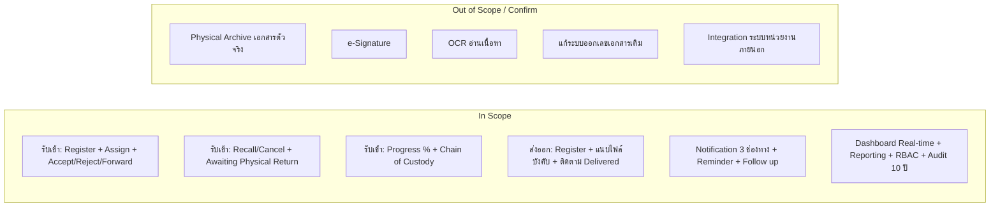
```mermaid
flowchart LR
    subgraph IN["In Scope"]
        A1["รับเข้า: Register + Assign + Accept/Reject/Forward"]
        A2["รับเข้า: Recall/Cancel + Awaiting Physical Return"]
        A3["รับเข้า: Progress % + Chain of Custody"]
        A4["ส่งออก: Register + แนบไฟล์บังคับ + ติดตาม Delivered"]
        A5["Notification 3 ช่องทาง + Reminder + Follow up"]
        A6["Dashboard Real-time + Reporting + RBAC + Audit 10 ปี"]
    end
    subgraph OUT["Out of Scope / Confirm"]
        B1["Physical Archive เอกสารตัวจริง"]
        B2["e-Signature"]
        B3["OCR อ่านเนื้อหา"]
        B4["แก้ระบบออกเลขเอกสารเดิม"]
        B5["Integration ระบบหน่วยงานภายนอก"]
    end
```

---

## 3. บทบาทผู้ใช้และสิทธิ์ (Roles & Permissions)

ผู้ใช้ทั้งหมดผูกกับ AD user โดยมี Master Data ตั้งค่าว่าฝ่ายใดมีใครเป็นหัวหน้า/ผู้กำกับดูแล สิทธิ์การเห็นข้อมูลเป็น **RBAC configurable** (BR-5.1) — Admin สร้าง/แก้ Role และเพิ่ม/ลดสิทธิ์ได้โดยตรง มีผลทันที ไม่มี approval workflow และบันทึก Audit Log

### 3.1 บทบาทตั้งต้น (แก้ไข/เพิ่มได้)

| รหัส | บทบาท | ขอบเขตข้อมูล (Data Scope) | หน้าที่หลัก |
|---|---|---|---|
| ROLE-01 | ผู้ Register (ทุกคนทำได้) | เฉพาะงานที่ตนเกี่ยวข้อง | Register เอกสารเข้า, Assign, ดึงงานกลับ/ยกเลิก, Follow up |
| ROLE-02 | เจ้าของงานปลายทาง (ผู้ใช้ปกติ) | เฉพาะงานที่ตนเกี่ยวข้อง | Accept/Reject/Forward, ปิดงาน Success, รับ Reminder |
| ROLE-03 | หัวหน้าฝ่าย / ผู้กำกับดูแล | เห็นตามฝ่ายที่กำกับ | Monitor งานทั้งฝ่าย, Accept/Forward, Follow up, report ฝ่าย |
| ROLE-04 | Viewer สูงสุด (ผู้บริหาร/ส่วนกลาง) | เห็นทั้งหมดทุกฝ่าย ทั้งเอกสารรับเข้าและส่งออก | ดู Dashboard/Report ทั้งหมด, Export |
| ROLE-05 | Admin | ทั้งบริษัท | จัดการผู้ใช้ (User Provisioning จาก LDAP — เพิ่ม/ปิดการใช้งานผู้ใช้ + ผูก Role/ฝ่าย), จัดการ Role & Permission, Master Data ฝ่าย/หัวหน้า |
| ROLE-06 | ผู้ส่งเอกสารออก (งานเอกสารส่งออก) | เฉพาะงานที่ตนเกี่ยวข้อง | Register ออก, แนบไฟล์, นำส่ง, อัปเดต Delivered |
| ROLE-07 | **Monitor (ผู้เฝ้าติดตามงานตาม Scope — Configurable)** | **เห็นงานทั้งหมดตาม Scope ที่ถูกกำหนด (ฝ่าย/สายงาน/กลุ่มงาน/รายบุคคล) — ไม่ผูกกับการเป็นผู้รับงาน** | Monitor งานทั้งสายงาน/ฝ่ายที่กำหนด (รวมงานค้าง/Overdue), รับ Reminder ของงานใน Scope, กด Follow up — **ไม่มีสิทธิ์ Accept/Reject/Forward/ปิดงาน** (สิทธิ์ดูและติดตามเท่านั้น) |

> หมายเหตุ: ผู้ใช้ 1 คนอาจมีหลายบทบาทได้ (เช่น เป็นทั้งผู้ Register และเจ้าของงาน) การมองเห็นและการรับแจ้งเตือนขึ้นกับ Role + รูปแบบการ Assign (BR-3.4)
> **Monitor (ROLE-07) เป็นบทบาทเฝ้าติดตามที่ Config ได้ (แยกจากผู้รับงาน)** — Admin/หัวหน้าฝ่ายกำหนดให้บุคคลใด "เฝ้าติดตาม" งานของ Scope ใดก็ได้ (เลือกฝ่าย/สายงาน/บุคคลจาก Master Data) เพื่อให้ผู้ที่ต้อง Monitor ตามงานค้างได้ครอบคลุมทั้งสายงาน **โดยไม่ต้องเป็นผู้รับงานและไม่ผูกกับ Assignee** — รายละเอียดการตั้งค่าดูหมวด 3.5 และ BR-5.3

### 3.2 Permission Matrix (สรุป)

| สิทธิ์ / บทบาท | ผู้ Register | เจ้าของงาน | หัวหน้าฝ่าย | Monitor (ROLE-07) | Viewer สูงสุด | Admin |
|---|:---:|:---:|:---:|:---:|:---:|:---:|
| Register เอกสารเข้า/ออก | ✅ | ✅ | ✅ | ❌ | ❌ | ✅ |
| Assign / Multiple Select | ✅ | ✅ (ส่งต่อ) | ✅ | ❌ | ❌ | ✅ |
| Accept / Reject / Forward | ❌ | ✅ | ✅ | ❌ | ❌ | ❌ |
| ดึงงานกลับ / ยกเลิก | ✅ (ของตน) | ❌ | ✅ (ในฝ่าย) | ❌ | ❌ | ✅ |
| ยืนยันรับเอกสารจริงคืน | ✅ (ต้นทาง) | ❌ | ✅ | ❌ | ❌ | ✅ |
| ดู Dashboard งานตน | ✅ | ✅ | ✅ | ✅ | ✅ | ✅ |
| ดู Dashboard ทั้งฝ่าย | ❌ | ❌ | ✅ | ✅ (เฉพาะ Scope ที่ถูกกำหนด) | ✅ | ✅ |
| ดู Dashboard ทั้งหมด | ❌ | ❌ | ❌ | ❌ (จำกัดตาม Scope) | ✅ | ✅ |
| Follow up | ✅ | ❌ | ✅ | ✅ (ในงานที่เฝ้าติดตาม) | ❌ | ✅ |
| Export รายงาน | ตามสิทธิ์ | ❌ | ✅ (ฝ่าย) | ✅ (เฉพาะ Scope) | ✅ (ทั้งหมด) | ✅ |
| จัดการผู้ใช้ (User Provisioning จาก LDAP) | ❌ | ❌ | ❌ | ❌ | ❌ | ✅ |
| จัดการ Role & Permission | ❌ | ❌ | ❌ | ❌ | ❌ | ✅ |
| จัดการ Master Data ฝ่าย/หัวหน้า | ❌ | ❌ | ❌ | ❌ | ❌ | ✅ |
| ตั้งค่า Monitor (กำหนดผู้เฝ้าติดตาม + Scope) | ❌ | ❌ | ✅ (ในฝ่ายตน) | ❌ | ❌ | ✅ (ทั้งบริษัท) |

> **สำคัญ:** การกรองข้อมูลตามสิทธิ์ (Data Scope) ต้องทำที่ **Backend** (Data Access Control) ไม่ใช่ซ่อนที่ UI เท่านั้น
> **Monitor (ROLE-07)** มีสิทธิ์ **ดูและติดตามเท่านั้น (read + follow-up)** ตาม Scope ที่ถูกกำหนดผ่านการ Config — ไม่สามารถ Accept/Reject/Forward/ปิดงานได้ และ Scope การมองเห็นถูกจำกัดเฉพาะ ฝ่าย/สายงาน/กลุ่มงาน/บุคคล ที่ระบุไว้ใน Monitor Config (ดูหมวด 3.5)

### 3.3 User Provisioning ผ่าน LDAP + การยืนยันตัวตนตอน Login

ระบบผูกกับ Active Directory/LDAP เพื่อยืนยันตัวตน แต่ **การมีบัญชีใน AD ไม่ได้แปลว่าเข้าใช้ระบบได้อัตโนมัติ** — Admin ต้องเป็นผู้เพิ่มผู้ใช้เข้าระบบ (Provisioning) โดยระบบเชื่อมต่อ LDAP เพื่อค้นหา/เลือกผู้ใช้จาก directory แล้วผูก Role และฝ่าย เฉพาะผู้ใช้ที่ถูก Provision (สถานะ Active) เท่านั้นจึงจะ login ได้ (BR-5.2)

**3.3.1 กระบวนการ Provisioning (Admin เพิ่มผู้ใช้จาก LDAP)**

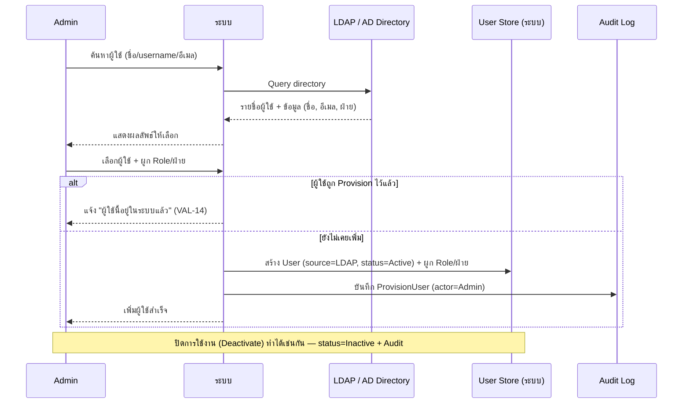
```mermaid
sequenceDiagram
    participant Admin as Admin
    participant S as ระบบ
    participant LDAP as LDAP / AD Directory
    participant DB as User Store (ระบบ)
    participant Audit as Audit Log

    Admin->>S: ค้นหาผู้ใช้ (ชื่อ/username/อีเมล)
    S->>LDAP: Query directory
    LDAP-->>S: รายชื่อผู้ใช้ + ข้อมูล (ชื่อ, อีเมล, ฝ่าย)
    S-->>Admin: แสดงผลลัพธ์ให้เลือก
    Admin->>S: เลือกผู้ใช้ + ผูก Role/ฝ่าย
    alt ผู้ใช้ถูก Provision ไว้แล้ว
        S-->>Admin: แจ้ง "ผู้ใช้นี้อยู่ในระบบแล้ว" (VAL-14)
    else ยังไม่เคยเพิ่ม
        S->>DB: สร้าง User (source=LDAP, status=Active) + ผูก Role/ฝ่าย
        S->>Audit: บันทึก ProvisionUser (actor=Admin)
        S-->>Admin: เพิ่มผู้ใช้สำเร็จ
    end
    note over Admin,DB: ปิดการใช้งาน (Deactivate) ทำได้เช่นกัน — status=Inactive + Audit
```

**3.3.2 กระบวนการ Login (ตรวจ Provision + Authenticate กับ LDAP/AD)**

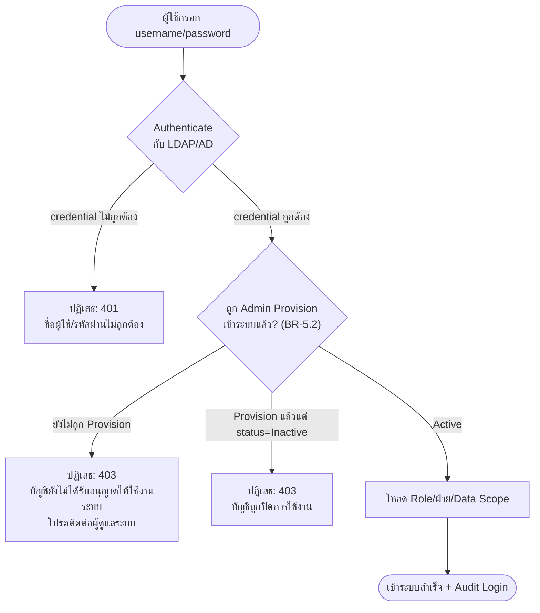
```mermaid
flowchart TD
    Start(["ผู้ใช้กรอก username/password"]) --> Auth{"Authenticate<br/>กับ LDAP/AD"}
    Auth -->|"credential ไม่ถูกต้อง"| Fail1["ปฏิเสธ: 401<br/>ชื่อผู้ใช้/รหัสผ่านไม่ถูกต้อง"]
    Auth -->|"credential ถูกต้อง"| Prov{"ถูก Admin Provision<br/>เข้าระบบแล้ว? (BR-5.2)"}
    Prov -->|"ยังไม่ถูก Provision"| Fail2["ปฏิเสธ: 403<br/>บัญชียังไม่ได้รับอนุญาตให้ใช้งานระบบ<br/>โปรดติดต่อผู้ดูแลระบบ"]
    Prov -->|"Provision แล้วแต่ status=Inactive"| Fail3["ปฏิเสธ: 403<br/>บัญชีถูกปิดการใช้งาน"]
    Prov -->|"Active"| Load["โหลด Role/ฝ่าย/Data Scope"]
    Load --> Ok(["เข้าระบบสำเร็จ + Audit Login"])
```

> การ authenticate ตรวจกับ LDAP/AD ทุกครั้ง (ระบบไม่เก็บรหัสผ่านแยก) จากนั้นจึงตรวจสถานะ Provision ในระบบก่อนอนุญาตเข้าใช้งาน — ผู้ใช้ AD ที่ยังไม่ถูก Admin เพิ่มเข้าระบบจะถูกปฏิเสธด้วย HTTP 403 (BR-5.2 / VAL-13)

### 3.4 ระดับชั้นความลับและการควบคุมการเข้าถึงไฟล์แนบ (Confidentiality Levels & Attachment Access Control)

เพื่อยกระดับความมั่นคงปลอดภัยของข้อมูลสารบรรณและป้องกันการรั่วไหลของเอกสารสำคัญ ระบบจำแนกระดับชั้นความลับของเอกสารออกเป็น 3 ระดับ พร้อมมาตรการควบคุมการเข้าถึงไฟล์แนบ (Attachment Access Control) ที่แตกต่างกัน:

#### 3.4.1 ระดับชั้นความลับ (Confidentiality Classification)

| ระดับความลับ | คำจำกัดความ / ตัวอย่างเอกสาร | นโยบายการแสดงรายละเอียดไฟล์แนบ | นโยบายการเข้าถึงและดาวน์โหลดไฟล์ |
|---|---|---|---|
| **ปกติ (Normal)** | เอกสารทั่วไป, ข่าวสารประชาสัมพันธ์, หนังสือเวียน | แสดงรายการไฟล์แนบและรูปถ่ายแก่ทุกคนที่มีสิทธิ์เข้าถึงเอกสารตาม Data Scope | เปิดดูพรีวิวและดาวน์โหลดได้ตามสิทธิ์ RBAC ปกติ (ไม่ต้องยืนยัน OTP) |
| **ลับ (Confidential)** | เอกสารสัญญาทางธุรกิจ, รายงานการเงินภายใน, ผลการประเมินบุคคล | แสดงรายการไฟล์แนบเฉพาะผู้เกี่ยวข้องในสายงาน (Assignee, Registrar, ผู้บังคับบัญชา) | เปิดดูพรีวิวและดาวน์โหลดได้เมื่อล็อกอินเข้าสู่ระบบเรียบร้อย (Active Session) |
| **ลับมาก (Top Secret)** | เอกสารการตรวจสอบทุจริต, แผนกลยุทธ์ลับ, ข้อพิพาททางกฎหมายระดับสูง, ข้อมูลอ่อนไหวขั้นสูงสุด | **ซ่อนและล็อกรายละเอียดไฟล์แนบทั้งหมด** (ชื่อไฟล์, ประเภท, พรีวิว) สำหรับบุคคลทั่วไปและผู้บริหารที่ไม่ได้ถูกมอบหมาย — แสดงเป็น **Restricted Locked Panel** | **สงวนสิทธิ์เฉพาะผู้ได้รับมอบหมายโดยตรง (Assignee) เท่านั้น** และ **ต้องยืนยันตัวตนด้วยรหัส OTP 6 หลัก** ก่อนปลดล็อกไฟล์แนบทุกครั้ง (จำกัดเวลาเข้าถึง 15 นาที พร้อม Dynamic Watermark) |

#### 3.4.2 Attachment Access & OTP Verification Matrix (ตารางสิทธิ์การเข้าถึงไฟล์แนบ)

| บทบาท / สถานะผู้ใช้ | เอกสารปกติ | เอกสารลับ | เอกสารลับมาก (ยังไม่ยืนยัน OTP) | เอกสารลับมาก (ยืนยัน OTP สำเร็จ) |
|---|:---:|:---:|:---:|:---:|
| **ผู้ได้รับมอบหมายโดยตรง (Assignee)** | ✅ ดู/โหลดได้ | ✅ ดู/โหลดได้ | 🔒 เห็นปุ่ม "ยืนยันตัวตนด้วย OTP เพื่อดูไฟล์" | ✅ ดูพรีวิว (ติด Watermark) / โหลดได้ (15 นาที) |
| **ผู้ลงทะเบียน (Registrar - ผู้สร้าง)** | ✅ ดู/โหลดได้ | ✅ ดู/โหลดได้ | 🔒 ต้องยืนยัน OTP (เฉพาะกรณีมีสิทธิ์ถือครอง) | ✅ ดูพรีวิว (ติด Watermark) / โหลดได้ |
| **หัวหน้าฝ่ายของผู้ได้รับมอบหมาย** | ✅ ดู/โหลดได้ | ✅ ดู/โหลดได้ | ❌ ซ่อนรายละเอียดไฟล์ (Restricted) | ❌ เข้าถึงไฟล์ไม่ได้ (เว้นแต่ถูก Re-assign โดยตรง) |
| **Viewer สูงสุด (ผู้บริหาร)** | ✅ ดู/โหลดได้ | ✅ ดู/โหลดได้ | ❌ ซ่อนรายละเอียดไฟล์ (Restricted — BR-1.4-B) | ❌ เข้าถึงไฟล์ไม่ได้ (สงวนสิทธิ์เฉพาะผู้รับมอบหมาย) |
| **ผู้ใช้อื่นนอกสายงาน / ผู้ใช้ทั่วไป** | ตาม Scope | ❌ 403 | ❌ 403 Forbidden (ไม่เห็นทั้งตัวเอกสารและไฟล์) | ❌ 403 Forbidden |
| **Admin (ผู้ดูแลระบบ)** | ดู Log | ดู Log | ❌ ซ่อนรายละเอียดไฟล์ (Admin ดูได้เฉพาะ Metadata/Audit) | ❌ ไม่มีสิทธิ์เปิดดูเนื้อหาไฟล์ลับมาก |

> **หมายเหตุความปลอดภัย:** สำหรับเอกสาร "ลับมาก" แม้จะเป็นผู้บริหารสูงสุดหรือ Admin ระบบจะ **ไม่เปิดให้เข้าถึงไฟล์แนบโดยพลการ** เว้นแต่บุคคลนั้นจะได้รับการ Assign มอบหมายงานโดยตรงใน Story Line ของเอกสาร และต้องผ่านการยืนยันตัวตนด้วย OTP เพื่อสร้าง Chain of Accountability ที่ชัดเจนใน Audit Log

### 3.5 Monitor (ผู้เฝ้าติดตามงานตาม Scope) — Configurable Watcher

ปัญหาเดิม: การมองเห็นและการรับแจ้งเตือน "ผูกกับผู้รับงาน (Assignee) และหัวหน้าฝ่ายตามสายบังคับบัญชา" เท่านั้น ทำให้ผู้ที่มีหน้าที่ **ต้องเฝ้าติดตามภาพรวมของสายงาน** (เช่น ผู้ช่วยหัวหน้า, เลขานุการฝ่าย, ผู้ประสานงานข้ามฝ่าย, ผู้บริหารที่กำกับหลายฝ่าย) **มองไม่เห็นงานค้างของทั้งสายงาน** หากตนไม่ใช่ผู้รับงานหรือไม่ใช่หัวหน้าฝ่ายโดยตำแหน่ง

ระบบจึงเพิ่มกลไก **Monitor Config (การกำหนดผู้เฝ้าติดตามแบบยืดหยุ่น)** ที่ **แยกขาดจากการ Assign งาน** โดยสมบูรณ์:

**หลักการ (BR-5.3)**
1. **กำหนดผู้เฝ้าติดตามได้อิสระ** — Admin (ทั้งบริษัท) หรือหัวหน้าฝ่าย (เฉพาะฝ่ายตน) กำหนดให้ "บุคคลใดก็ได้" เป็น Monitor ของ Scope ที่เลือก โดย **ไม่จำเป็นต้องเป็นผู้รับงานหรือหัวหน้าฝ่ายตามสายบังคับบัญชา**
2. **Scope เลือกได้จาก Master Data** — ขอบเขตการเฝ้าติดตามเลือกได้ 4 ระดับ (เลือกค่าจาก Master Data เสมอ ลดข้อผิดพลาด):
   - `department` — **ทั้งฝ่าย (ประเภทหลัก)** เลือกได้ **หลายฝ่ายพร้อมกัน (multi-select)** จาก Master Data ฝ่าย — Monitor **หนึ่งรายการเฝ้าติดตามได้หลายฝ่ายในคราวเดียว** โดยไม่ต้องสร้างหลายรายการ (เก็บค่าฝ่ายที่เลือกทั้งหมดไว้ใน `scope_refs`)
   - **ทุกฝ่าย (all departments)** — ตัวเลือกพิเศษของ `department` ที่จัดเก็บเป็น flag `all_departments = true` หมายถึงครอบคลุม **ทุกฝ่ายทั้งที่มีอยู่ปัจจุบันและที่จะเพิ่มในอนาคต** โดยไม่ต้องเลือกทีละฝ่าย (เมื่อเลือก "ทุกฝ่าย" ระบบจะไม่เก็บค่าฝ่ายรายรายการใน `scope_refs`)
   - `workgroup` — สายงาน/กลุ่มงาน (เลือกจาก Master Data กลุ่มงาน)
   - `user` — รายบุคคล (เลือกผู้ใช้จากรายชื่อที่ถูก Provision)
   - `doc_direction` — จำกัดเฉพาะประเภทงาน (incoming/outgoing) ประกอบกับ scope ข้างต้นได้
3. **สิทธิ์ = ดู + ติดตามเท่านั้น** — Monitor เห็นงานทั้งหมดใน Scope (รวมงานค้าง/Overdue/Pending) บน Dashboard และกด **Follow up** ได้ แต่ **ไม่มีสิทธิ์ Accept/Reject/Forward/ปิดงาน/Assign** (ไม่ก้าวก่ายเจ้าของงาน)
4. **รับแจ้งเตือนงานค้างของทั้ง Scope** — Monitor รับ Notification กลุ่มติดตาม (Due Soon/Overdue/Pending/Follow up) ของงานใน Scope **เพิ่มเติมจากผู้รับงานและหัวหน้าฝ่าย** เพื่อไม่ให้งานค้างหลุดรอด
5. **ไม่กระทบ Chain of Custody / Progress** — Monitor ไม่นับเป็นผู้ถือครองและไม่นับใน Progress
6. **จำกัดชั้นความลับ** — Monitor เห็น *สถานะ/ความคืบหน้า* ของงานลับ/ลับมากได้ตาม Scope แต่ **การเข้าถึงไฟล์แนบยังยึดกฎ BR-1.4-B/1.4-C** (เอกสารลับมากต้องเป็น Assignee + ยืนยัน OTP เท่านั้น — Monitor ที่ไม่ใช่ Assignee เห็นไฟล์แนบไม่ได้)
7. **ทุกการตั้งค่าบันทึก Audit** — เพิ่ม/แก้/ยกเลิก Monitor Config บันทึก Audit Log (actor, scope, target, effective range)

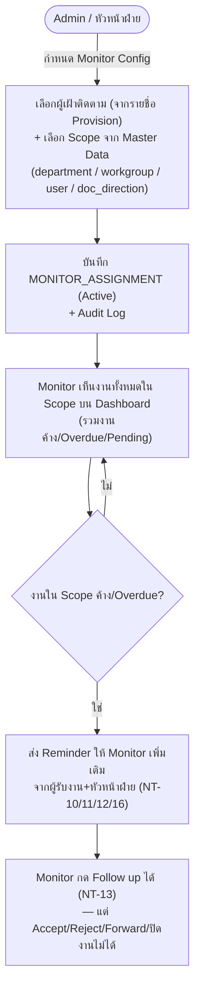
```mermaid
flowchart TD
    Admin(["Admin / หัวหน้าฝ่าย"]) -->|"กำหนด Monitor Config"| Cfg["เลือกผู้เฝ้าติดตาม (จากรายชื่อ Provision)<br/>+ เลือก Scope จาก Master Data<br/>(department / workgroup / user / doc_direction)"]
    Cfg --> Save["บันทึก MONITOR_ASSIGNMENT (Active)<br/>+ Audit Log"]
    Save --> Vis["Monitor เห็นงานทั้งหมดใน Scope บน Dashboard<br/>(รวมงานค้าง/Overdue/Pending)"]
    Vis --> Act{"งานใน Scope ค้าง/Overdue?"}
    Act -->|"ใช่"| Noti["ส่ง Reminder ให้ Monitor เพิ่มเติม<br/>จากผู้รับงาน+หัวหน้าฝ่าย (NT-10/11/12/16)"]
    Noti --> FU["Monitor กด Follow up ได้ (NT-13)<br/>— แต่ Accept/Reject/Forward/ปิดงานไม่ได้"]
    Act -->|"ไม่"| Vis
```

#### 3.5.1 โครงสร้างการตั้งค่า Monitor (Monitor Config)

| ฟิลด์ | ความหมาย | ที่มา (ควบคุมด้วย Master Data) |
|---|---|---|
| monitor_user_ref | ผู้เฝ้าติดตาม | เลือกจากรายชื่อผู้ใช้ที่ถูก Provision (LDAP) |
| scope_type | ระดับ Scope | Enum: `department` / `workgroup` / `user` / `doc_direction` |
| scope_refs | ค่าเป้าหมายของ Scope (**หลายรายการ**) | เลือกจาก Master Data ตาม scope_type ได้ **มากกว่าหนึ่งค่า** (ฝ่าย/กลุ่มงาน/ผู้ใช้) — สำหรับ `department` เลือกได้หลายฝ่ายพร้อมกัน (แทนฟิลด์เดิม `scope_ref` แบบค่าเดียว) |
| all_departments | ครอบคลุมทุกฝ่าย (ปัจจุบัน+อนาคต) | Boolean (default false) — ใช้กับ `scope_type=department`; เมื่อ `true` ให้ `scope_refs` ว่าง |
| doc_direction_filter | จำกัดประเภทงาน (optional) | Enum: `incoming` / `outgoing` / `all` |
| effective_from / effective_to | ช่วงเวลาที่มีผล (optional) | ปฏิทิน |
| notify_enabled | รับแจ้งเตือนงานค้างใน Scope หรือไม่ | Boolean (default true) |
| created_by / created_at | ผู้ตั้งค่า + เวลา | Audit |
| status | สถานะ | `Active` / `Inactive` |

> **ตัวอย่าง:** กำหนดให้ "คุณสมหญิง (เลขานุการฝ่ายสินไหม)" เป็น Monitor ของ `scope_type=department, scope_refs=[ฝ่ายสินไหม], doc_direction_filter=all` → คุณสมหญิงเห็นงานรับเข้า/ส่งออกทั้งหมดของฝ่ายสินไหม รับแจ้งงานค้าง และตาม Follow up ได้ ทั้งที่ไม่ได้เป็นผู้รับงานหรือหัวหน้าฝ่าย
>
> **ตัวอย่าง (หลายฝ่าย):** กำหนด Monitor ของ `scope_type=department, scope_refs=[ฝ่ายการเงิน, ฝ่ายพัสดุและจัดซื้อ]` → ผู้เฝ้าติดตามหนึ่งคนดูแลทั้งสองฝ่ายได้พร้อมกันในรายการเดียว
>
> **ตัวอย่าง (ทุกฝ่าย):** กำหนด Monitor ของ `scope_type=department, all_departments=true, scope_refs=[]` → ครอบคลุมทุกฝ่ายทั้งที่มีอยู่ปัจจุบันและฝ่ายที่จะเพิ่มในอนาคตโดยอัตโนมัติ โดยไม่ต้องเลือกทีละฝ่าย

---

## 4. Use Case ภาพรวม


```mermaid
flowchart TB
    Registrar(["ผู้ Register<br/>ทุกคนทำได้"])
    Owner(["เจ้าของงานปลายทาง"])
    Head(["หัวหน้าฝ่าย / ผู้กำกับดูแล"])
    Sender(["ผู้ส่งเอกสารออก"])
    Admin(["Admin / Master Data"])

    subgraph System["ระบบ Monitor เอกสารเข้า–ออก"]
        UC1["Register + แนบหลักฐาน + ความเร่งด่วน/Deadline"]
        UC2["Assign รายฝ่าย/บุคคล + Multiple Select"]
        UC3["Accept ยอมรับการรับเอกสาร"]
        UC4["Reject/ตีกลับ + หมายเหตุ"]
        UC5["Forward ส่งต่อลำดับถัดไป"]
        UC6["ปิดงาน Success"]
        UC7["ดึงงานกลับ / ยกเลิก"]
        UC8["ยืนยันรับเอกสารจริงคืน"]
        UC9["Monitor สถานะ + Progress + Deadline"]
        UC10["รับ Reminder / กด Follow up"]
        UC11["เอกสารส่งออก: Register ออก + แนบไฟล์ + นำส่ง + Delivered"]
        UC12["ตั้งค่า Master + Role/สิทธิ์ (RBAC)"]
        UC13["เพิ่ม/จัดการผู้ใช้จาก LDAP (User Provisioning)"]
        UC14["ตั้งค่า Monitor (กำหนดผู้เฝ้าติดตาม + Scope จาก Master Data)"]
        UC15["Monitor: เฝ้าติดตามงานทั้ง Scope + Follow up (ดูอย่างเดียว)"]
    end
    Monitor(["Monitor / ผู้เฝ้าติดตาม<br/>(Configurable)"])

    Registrar --> UC1
    Registrar --> UC2
    Registrar --> UC7
    Registrar --> UC8
    Registrar --> UC10
    Owner --> UC3
    Owner --> UC4
    Owner --> UC5
    Owner --> UC6
    Owner --> UC10
    Head --> UC3
    Head --> UC5
    Head --> UC9
    Head --> UC10
    Sender --> UC11
    Sender --> UC10
    Admin --> UC12
    Admin --> UC13
    Admin --> UC14
    Admin --> UC9
    Head --> UC14
    Monitor --> UC15
    Monitor --> UC10
```

> **การมองเห็น vs การรับแจ้งเตือน:** หัวหน้าฝ่ายเห็นงานลูกน้องในฝ่ายได้เสมอ แต่การ *รับแจ้งเตือน* ขึ้นกับรูปแบบ Assign — Assign ระบุตัวบุคคล หัวหน้าไม่ได้รับแจ้งเตือน / Assign เป็นฝ่าย หัวหน้าฝ่ายได้รับแจ้งเตือน (BR-3.4)
> **Monitor (ROLE-07):** ผู้ที่ถูกกำหนดเป็น Monitor เห็นงานทั้งหมดใน Scope ที่กำหนด (ฝ่าย/สายงาน/บุคคล) และรับแจ้งเตือนงานค้าง/Overdue ของ Scope นั้น **โดยไม่ผูกกับการเป็นผู้รับงาน** — ใช้สำหรับผู้ที่ต้องเฝ้าติดตามภาพรวมและตามงานค้าง (BR-5.3)

---

## 5. กระบวนการหลัก End-to-End

### 5.1 หลักการทำงานสำคัญ (Business Invariants)

1. **Lifecycle เริ่มนับตั้งแต่ Register** — tracking/Story Line เริ่มที่สถานะ Registered
2. **ต้อง Accept ก่อนเสมอ** — ผู้รับต้องกดยอมรับก่อนจึงจะ Forward หรือปิดงานได้ (BR-2.3)
3. **Accept = Chain of Custody** — เอกสารฉบับจริง การกด Accept = ยืนยันถือครองเอกสารตัวจริง บันทึกผู้ถือครองล่าสุด (BR-6.1)
4. **Forward ไม่นับ Progress แต่เก็บ Log** — สืบทอดงานย่อยเดิม ไม่เพิ่มตัวหาร แต่บันทึกเส้นทางทุกครั้ง (BR-6.1)
5. **Deadline สืบทอดจาก Main เสมอ** — ไม่กำหนด Deadline ย่อยซ้ำ (BR-3.1)
6. **ปฏิเสธทุกงานย่อย → คืนต้นทาง** — เอกสารฉบับจริงเข้า Awaiting Physical Return / อีเมล Assign ใหม่ได้ทันที (BR-2.2)
7. **Progress: ทุก Sub น้ำหนักเท่ากัน, ตัด Cancelled, รองรับ 1:1** (BR-2.5)

### 5.2 เอกสารรับเข้า — End-to-End Flow (รับเข้า → ปิดงาน)

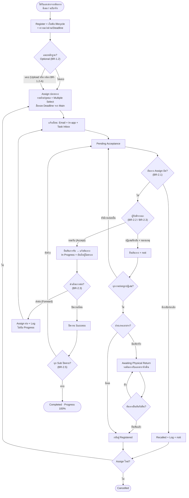
```mermaid
flowchart TD
    Start(["ได้รับเอกสารจากต้นทาง<br/>อีเมล / ฉบับจริง"]) --> Reg["Register = เริ่มนับ lifecycle<br/>+ ความเร่งด่วน/Deadline"]
    Reg --> AttChk{"แนบหลักฐาน?<br/>Optional (BR-1.2)"}
    AttChk -->|"ไม่แนบ"| Assign["Assign ปลายทาง<br/>รายฝ่าย/บุคคล + Multiple Select<br/>สืบทอด Deadline จาก Main"]
    AttChk -->|"แนบ (Upload หรือ กล้อง BR-1.2-A)"| Assign
    Assign --> Noti1["แจ้งเตือน: Email + In-app + Task Inbox"]
    Noti1 --> Wait["Pending Acceptance"]

    Wait --> Recall{"ต้นทาง Assign ผิด?<br/>(BR-2.1)"}
    Recall -->|"ดึงกลับ/ยกเลิก"| RecallFlow["Recalled + Log + noti"]
    RecallFlow --> ReAssign{"Assign ใหม่?"}
    ReAssign -->|"ใช่"| Assign
    ReAssign -->|"ไม่"| Cancelled(["Cancelled"])

    Recall -->|"ไม่"| Decide{"ผู้รับพิจารณา<br/>(BR-2.2 / BR-2.3)"}
    Decide -->|"ปฏิเสธ/ตีกลับ + หมายเหตุ"| Reject["คืนต้นทาง + noti"]
    Reject --> AllRej{"ทุกงานย่อยถูกปฏิเสธ?"}
    AllRej -->|"ใช่"| DocType{"ประเภทเอกสาร?"}
    DocType -->|"มีฉบับจริง"| AwaitReturn["Awaiting Physical Return<br/>รอต้นทางรับเอกสารจริงคืน"]
    AwaitReturn --> Confirm{"ต้นทางยืนยันรับคืน?"}
    Confirm -->|"ยัง"| AwaitReturn
    Confirm -->|"ยืนยันแล้ว"| BackReg["กลับสู่ Registered"]
    DocType -->|"อีเมล"| BackReg
    BackReg --> ReAssign
    AllRej -->|"ยังมีงานย่อยอื่น"| Wait
    Decide -->|"ยอมรับ (Accept)"| Accept["ยืนยันการรับ → แจ้งต้นทาง<br/>In Progress + บันทึกผู้ถือครอง"]

    Accept --> Next{"ดำเนินการต่อ?<br/>(BR-2.3)"}
    Next -->|"ส่งต่อ (Forward)"| Fwd["Assign ต่อ + Log<br/>ไม่นับ Progress"]
    Fwd --> Noti1
    Next -->|"ปิดงานที่ตน"| Close["ปิดงาน Success"]
    Close --> ProgChk{"ทุก Sub ปิดครบ?<br/>(BR-2.5)"}
    ProgChk -->|"ยังค้าง"| Wait
    ProgChk -->|"ครบ"| Done(["Completed · Progress 100%"])
```

### 5.3 เอกสารส่งออก — End-to-End Flow (Register → ส่ง → ติดตาม)

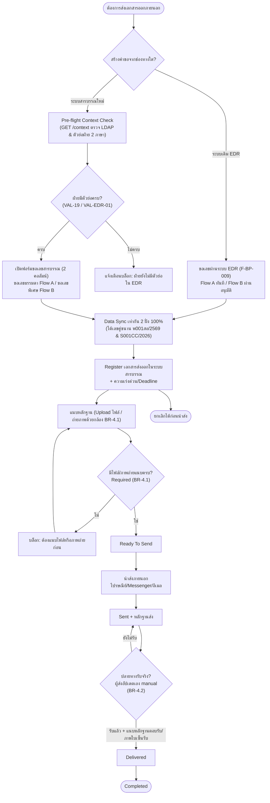
```mermaid
flowchart TD
    Start(["ต้องการส่งเอกสารออกภายนอก"]) --> Origin{"สร้างคำขอจากช่องทางใด?"}
    Origin -->|"ระบบเดิม EDR"| RegEDR["ขอเลขผ่านระบบ EDR (F-BP-009)<br/>Flow A ทันที / Flow B ผ่านอนุมัติ"]
    Origin -->|"ระบบสารบรรณใหม่"| PreCheck["Pre-flight Context Check<br/>(GET /context ตรวจ LDAP & ตัวย่อฝ่าย 2 ภาษา)"]
    PreCheck --> ValidDept{"ฝ่ายมีตัวย่อครบ?<br/>(VAL-19 / VAL-EDR-01)"}
    ValidDept -->|"ไม่ครบ"| BlockAlert["แจ้งเตือนบล็อก: ฝ่ายยังไม่มีตัวย่อใน EDR"]
    ValidDept -->|"ครบ"| RegCorr["เปิดฟอร์มขอเลขสารบรรณ (2 คอลัมน์)<br/>ขอเลขธรรมดา Flow A / ขอเลขพิเศษ Flow B"]
    RegEDR --> Sync["Data Sync เท่ากัน 2 ฝั่ง 100%<br/>(ได้เลขคู่ขนาน พ001สอ/2569 & S001CC/2026)"]
    RegCorr --> Sync
    Sync --> RegMain["Register เอกสารส่งออกในระบบสารบรรณ<br/>+ ความเร่งด่วน/Deadline"]
    RegMain --> Att["แนบหลักฐาน (Upload ไฟล์ / ถ่ายภาพด้วยกล้อง BR-4.1)"]
    Att --> AttChk{"มีไฟล์/ภาพถ่ายแนบครบ?<br/>Required (BR-4.1)"}
    AttChk -->|"ไม่"| AttErr["บล็อก: ต้องแนบไฟล์หรือภาพถ่ายก่อน"]
    AttErr --> Att
    AttChk -->|"ใช่"| Ready["Ready To Send"]
    Ready --> Send["นำส่งภายนอก<br/>ไปรษณีย์/Messenger/อีเมล"]
    Send --> Sent["Sent + หลักฐานส่ง"]
    Sent --> Ack{"ปลายทางรับจริง?<br/>ผู้ส่งอัปเดตเอง manual<br/>(BR-4.2)"}
    Ack -->|"รับแล้ว + แนบหลักฐานตอบรับ/ภาพใบเซ็นรับ"| Recv["Delivered"]
    Recv --> Done(["Completed"])
    Ack -->|"ยังไม่รับ"| Sent
    RegMain --> Cancel(["ยกเลิกได้ก่อนนำส่ง"])
```

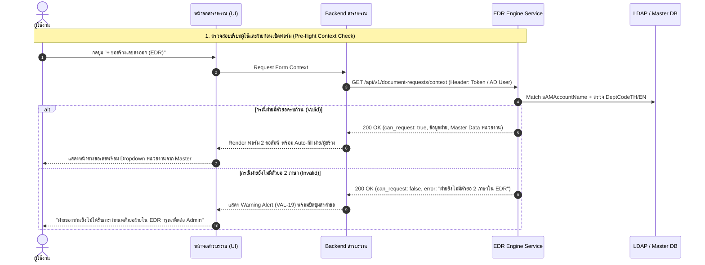
```mermaid
sequenceDiagram
    autonumber
    actor User as ผู้ใช้งาน
    participant CorrUI as หน้าจอสารบรรณ (UI)
    participant CorrAPI as Backend สารบรรณ
    participant EDR as EDR Engine Service
    participant LDAP as LDAP / Master DB

    Note over User,EDR: 1. ตรวจสอบบริบทผู้ใช้และฝ่ายก่อนเปิดฟอร์ม (Pre-flight Context Check)
    User->>CorrUI: กดปุ่ม "+ ขอสร้างเลขส่งออก (EDR)"
    CorrUI->>CorrAPI: Request Form Context
    CorrAPI->>EDR: GET /api/v1/document-requests/context (Header: Token / AD User)
    EDR->>LDAP: Match sAMAccountName + ตรวจ DeptCodeTH/EN
    alt กรณีฝ่ายมีตัวย่อครบถ้วน (Valid)
        EDR-->>CorrAPI: 200 OK (can_request: true, ข้อมูลฝ่าย, Master Data หน่วยงาน)
        CorrAPI-->>CorrUI: Render ฟอร์ม 2 คอลัมน์ พร้อม Auto-fill ฝ่าย/ผู้สร้าง
        CorrUI-->>User: แสดงหน้าต่างขอเลขพร้อม Dropdown หน่วยงานจาก Master
    else กรณีฝ่ายยังไม่มีตัวย่อ 2 ภาษา (Invalid)
        EDR-->>CorrAPI: 200 OK (can_request: false, error: "ฝ่ายยังไม่มีตัวย่อ 2 ภาษาใน EDR")
        CorrAPI-->>CorrUI: แสดง Warning Alert (VAL-19) พร้อมปิดปุ่มส่งคำขอ
        CorrUI-->>User: "ฝ่ายของท่านยังไม่ได้รับการกำหนดตัวย่อฝ่ายใน EDR กรุณาติดต่อ Admin"
    end
```

> **ข้อกำหนดการออกเลขและความเท่าเทียมของข้อมูล (Data Parity):** ระบบสารบรรณทำหน้าที่หลักในการ **Monitor สถานะวงจรชีวิตการนำส่ง** ขณะที่ระบบ EDR เดิมเป็นผู้ออกเลขที่เอกสาร ทั้งนี้ ระบบสารบรรณใหม่รองรับการสร้างคำขอออกเลขได้โดยตรงเช่นกัน โดยทั้งสองระบบใช้ **Shared Data Contract เดียวกัน ทำให้ข้อมูลฟิลด์ทุกตัว (เรื่อง, หน่วยงาน, ผู้รับ, ผู้ลงนาม, เลขที่เอกสาร 2 ภาษา) เท่ากัน 100% ไม่ว่าจะสร้างจากระบบใด**

### 5.4 กระบวนการยืนยันตัวตนด้วย OTP เพื่อเข้าถึงไฟล์แนบเอกสาร "ลับมาก" (Top Secret OTP File Access Flow)

เอกสารที่มีระดับชั้นความลับ **"ลับมาก" (Top Secret)** ถูกออกแบบให้มีกลไกความปลอดภัย 2 ชั้น (Two-Factor Authorization for Attachments) เพื่อป้องกันการเข้าถึงไฟล์โดยไม่ได้รับอนุญาต:

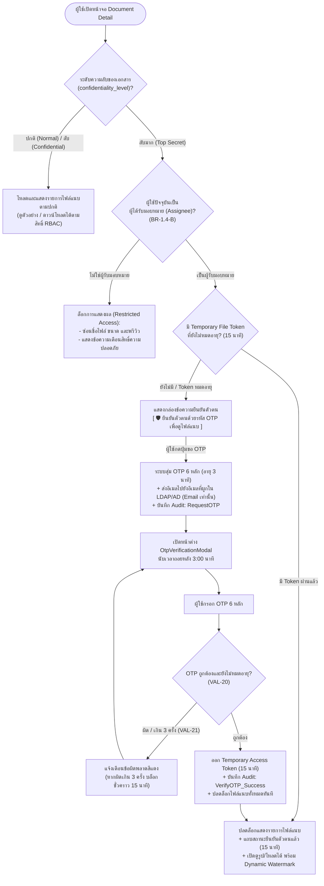
```mermaid
flowchart TD
    Start(["ผู้ใช้เปิดหน้าจอ Document Detail"]) --> CheckConf{"ระดับความลับของเอกสาร<br/>(confidentiality_level)?"}
    CheckConf -->|"ปกติ (Normal) / ลับ (Confidential)"| NormalAccess["โหลดและแสดงรายการไฟล์แนบตามปกติ<br/>(ดูตัวอย่าง / ดาวน์โหลดได้ตามสิทธิ์ RBAC)"]
    
    CheckConf -->|"ลับมาก (Top Secret)"| CheckAssign{"ผู้ใช้ปัจจุบันเป็น<br/>ผู้ได้รับมอบหมาย (Assignee)?<br/>(BR-1.4-B)"}
    
    CheckAssign -->|"ไม่ใช่ผู้รับมอบหมาย"| HideFiles["ล็อกการแสดงผล (Restricted Access):<br/>- ซ่อนชื่อไฟล์ ขนาด และพรีวิว<br/>- แสดงข้อความเตือนสิทธิ์ความปลอดภัย"]
    
    CheckAssign -->|"เป็นผู้รับมอบหมาย"| CheckSession{"มี Temporary File Token<br/>ที่ยังไม่หมดอายุ? (15 นาที)"}
    
    CheckSession -->|"มี Token ผ่านแล้ว"| ShowFiles["ปลดล็อกแสดงรายการไฟล์แนบ<br/>+ แถบสถานะยืนยันตัวตนแล้ว (15 นาที)<br/>+ เปิดดูรูป/โหลดได้ พร้อม Dynamic Watermark"]
    
    CheckSession -->|"ยังไม่มี / Token หมดอายุ"| LockBox["แสดงกล่องข้อความยืนยันตัวตน<br/>[ 🛡️ ยืนยันตัวตนด้วยรหัส OTP เพื่อดูไฟล์แนบ ]"]
    
    LockBox -->|"ผู้ใช้กดปุ่มขอ OTP"| ReqOTP["ระบบสุ่ม OTP 6 หลัก (อายุ 3 นาที)<br/>+ ส่งอีเมลไปยังอีเมลที่ผูกใน LDAP/AD (Email เท่านั้น)<br/>+ บันทึก Audit: RequestOTP"]
    
    ReqOTP --> Modal["เปิดหน้าต่าง OtpVerificationModal<br/>นับเวลาถอยหลัง 3:00 นาที"]
    
    Modal --> InputOTP["ผู้ใช้กรอก OTP 6 หลัก"]
    
    InputOTP --> Verify{"OTP ถูกต้องและยังไม่หมดอายุ?<br/>(VAL-20)"}
    
    Verify -->|"ผิด / เกิน 3 ครั้ง (VAL-21)"| Fail["แจ้งเตือนข้อผิดพลาดสีแดง<br/>(หากผิดเกิน 3 ครั้ง บล็อกชั่วคราว 15 นาที)"]
    Fail --> Modal
    
    Verify -->|"ถูกต้อง"| Success["ออก Temporary Access Token (15 นาที)<br/>+ บันทึก Audit: VerifyOTP_Success<br/>+ ปลดล็อกไฟล์แนบทั้งหมดทันที"]
    Success --> ShowFiles
```

#### Sequence Diagram การยืนยันตัวตน OTP และการเข้าถึงไฟล์แนบ

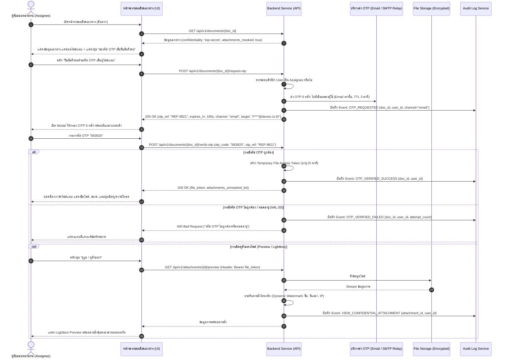
```mermaid
sequenceDiagram
    autonumber
    actor User as ผู้รับมอบหมายงาน (Assignee)
    participant UI as หน้าจอรายละเอียดเอกสาร (UI)
    participant API as Backend Service (API)
    participant OTP_Svc as บริการส่ง OTP (Email / SMTP Relay)
    participant Storage as File Storage (Encrypted)
    participant Audit as Audit Log Service

    User->>UI: เปิดหน้ารายละเอียดเอกสาร (ลับมาก)
    UI->>API: GET /api/v1/documents/{doc_id}
    API-->>UI: ข้อมูลเอกสาร (confidentiality: 'top-secret', attachments_masked: true)
    UI-->>User: แสดงข้อมูลเอกสาร แต่ซ่อนไฟล์แนบ + แสดงปุ่ม "ขอรหัส OTP เพื่อยืนยันตัวตน"

    User->>UI: คลิก "ยืนยันตัวตนด้วยรหัส OTP เพื่อดูไฟล์แนบ"
    UI->>API: POST /api/v1/documents/{doc_id}/request-otp
    API->>API: ตรวจสอบสิทธิ์ว่า User เป็น Assignee หรือไม่
    API->>OTP_Svc: ส่ง OTP 6 หลัก ไปยังอีเมลของผู้ใช้ (Email เท่านั้น, TTL 3 นาที)
    API->>Audit: บันทึก Event: OTP_REQUESTED (doc_id, user_id, channel="email")
    API-->>UI: 200 OK (otp_ref: "REF-9821", expires_in: 180s, channel: "email", target: "t****@deves.co.th")
    UI-->>User: เปิด Modal ให้กรอก OTP 6 หลัก พร้อมนับเวลาถอยหลัง

    User->>UI: กรอกรหัส OTP "583920"
    UI->>API: POST /api/v1/documents/{doc_id}/verify-otp (otp_code: "583920", otp_ref: "REF-9821")
    alt กรณีรหัส OTP ถูกต้อง
        API->>API: สร้าง Temporary File Access Token (อายุ 15 นาที)
        API->>Audit: บันทึก Event: OTP_VERIFIED_SUCCESS (doc_id, user_id)
        API-->>UI: 200 OK (file_token, attachments_unmasked_list)
        UI-->>User: ปลดล็อกการ์ดไฟล์แนบ แสดงชื่อไฟล์, ขนาด, และปุ่มเปิดดู/ดาวน์โหลด
    else กรณีรหัส OTP ไม่ถูกต้อง / หมดอายุ (VAL-20)
        API->>Audit: บันทึก Event: OTP_VERIFIED_FAILED (doc_id, user_id, attempt_count)
        API-->>UI: 400 Bad Request ("รหัส OTP ไม่ถูกต้องหรือหมดอายุ")
        UI-->>User: แสดงแถบสีแดงแจ้งข้อผิดพลาด
    end

    opt การเปิดดูตัวอย่างไฟล์ (Preview / Lightbox)
        User->>UI: คลิกปุ่ม "ดูรูป / ดูตัวอย่าง"
        UI->>API: GET /api/v1/attachments/{id}/preview (Header: Bearer file_token)
        API->>Storage: ดึงข้อมูลไฟล์
        Storage-->>API: Stream ข้อมูลภาพ
        API->>API: ประทับลายน้ำไดนามิก (Dynamic Watermark: ชื่อ, วันเวลา, IP)
        API->>Audit: บันทึก Event: VIEW_CONFIDENTIAL_ATTACHMENT (attachment_id, user_id)
        API-->>UI: ข้อมูลภาพพร้อมลายน้ำ
        UI-->>User: แสดง Lightbox Preview พร้อมลายน้ำคุ้มครองความปลอดภัย
    end
```

---

## 6. สถานะเอกสาร (State Machines)

### 6.1 เอกสารรับเข้า — เอกสารหลัก (Main Document)

| สถานะ | ความหมาย |
|---|---|
| Registered | นำเข้าระบบแล้ว (แนบหลักฐาน Optional) ยังไม่ Assign |
| Pending Acceptance | Assign แล้ว รอผู้รับกดยอมรับ |
| In Progress | มีผู้รับยอมรับอย่างน้อย 1 ราย และกำลังดำเนินการ/ส่งต่อ |
| Awaiting Physical Return | (เฉพาะเอกสารฉบับจริง) ทุกงานย่อยถูกปฏิเสธ รอต้นทางรับเอกสารตัวจริงคืน ก่อนปลดล็อกให้ Assign ใหม่ |
| Completed | ทุกงานย่อยปิด Success (Progress 100%) |
| Cancelled | ยกเลิก ไม่นำมาคิด Progress |

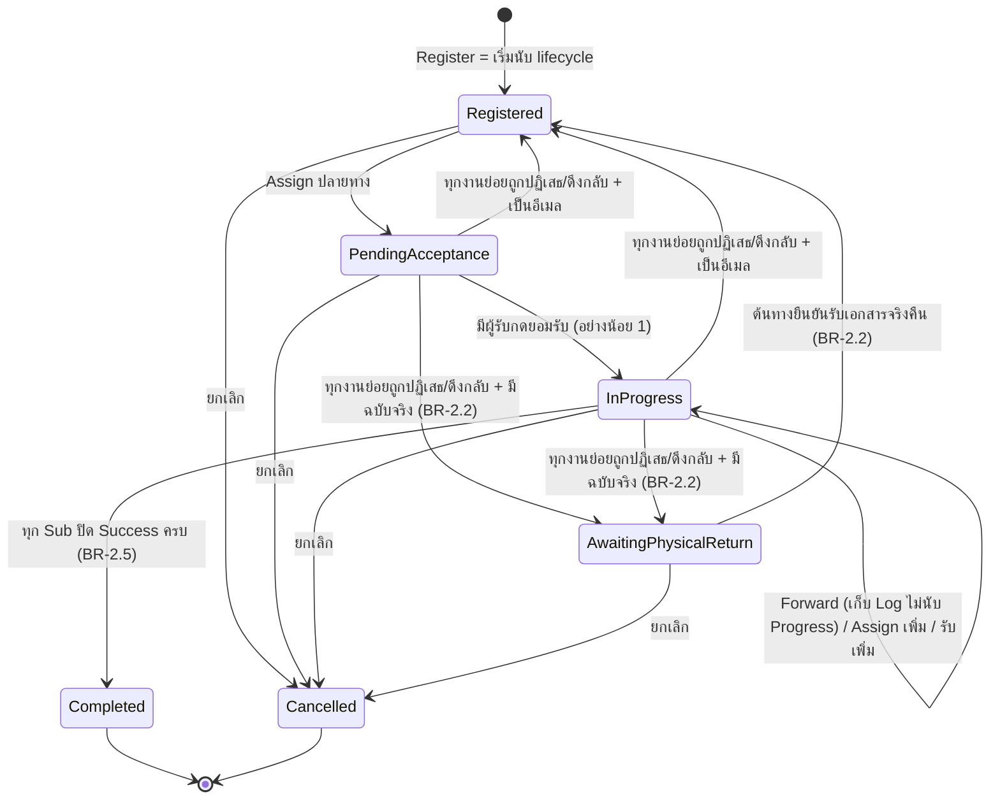
```mermaid
stateDiagram-v2
    [*] --> Registered: Register = เริ่มนับ lifecycle
    Registered --> PendingAcceptance: Assign ปลายทาง
    PendingAcceptance --> InProgress: มีผู้รับกดยอมรับ (อย่างน้อย 1)
    PendingAcceptance --> AwaitingPhysicalReturn: ทุกงานย่อยถูกปฏิเสธ/ดึงกลับ + มีฉบับจริง (BR-2.2)
    InProgress --> AwaitingPhysicalReturn: ทุกงานย่อยถูกปฏิเสธ/ดึงกลับ + มีฉบับจริง (BR-2.2)
    PendingAcceptance --> Registered: ทุกงานย่อยถูกปฏิเสธ/ดึงกลับ + เป็นอีเมล
    InProgress --> Registered: ทุกงานย่อยถูกปฏิเสธ/ดึงกลับ + เป็นอีเมล
    AwaitingPhysicalReturn --> Registered: ต้นทางยืนยันรับเอกสารจริงคืน (BR-2.2)
    InProgress --> InProgress: Forward (เก็บ Log ไม่นับ Progress) / Assign เพิ่ม / รับเพิ่ม
    InProgress --> Completed: ทุก Sub ปิด Success ครบ (BR-2.5)
    Registered --> Cancelled: ยกเลิก
    PendingAcceptance --> Cancelled: ยกเลิก
    InProgress --> Cancelled: ยกเลิก
    AwaitingPhysicalReturn --> Cancelled: ยกเลิก
    Completed --> [*]
    Cancelled --> [*]
```

### 6.2 เอกสารรับเข้า — งานย่อยรายผู้รับ (Assignment / Sub Doc)

| สถานะ | ความหมาย |
|---|---|
| Pending Acceptance | ถูก Assign รอกดยอมรับ |
| Accepted | ยอมรับว่าได้รับ (ยืนยันไปต้นทาง / ถือครองเอกสารตัวจริง) |
| Rejected | ปฏิเสธ/ตีกลับพร้อมหมายเหตุ |
| Recalled | ต้นทางดึงงานกลับ |
| Forwarded | ส่งต่อ Assign ลำดับถัดไป (เก็บ Log ไม่นับตัวหาร Progress) |
| Success | ปิดงานสำเร็จ |
| Cancelled | ยกเลิก ไม่คิด Progress |

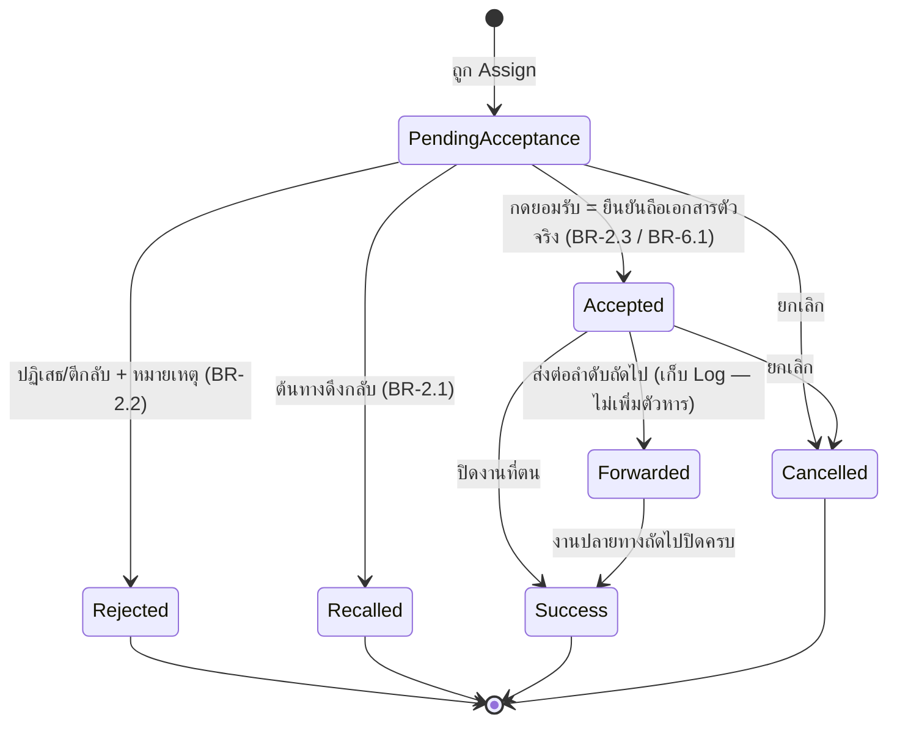
```mermaid
stateDiagram-v2
    [*] --> PendingAcceptance: ถูก Assign
    PendingAcceptance --> Accepted: กดยอมรับ = ยืนยันถือเอกสารตัวจริง (BR-2.3 / BR-6.1)
    PendingAcceptance --> Rejected: ปฏิเสธ/ตีกลับ + หมายเหตุ (BR-2.2)
    PendingAcceptance --> Recalled: ต้นทางดึงกลับ (BR-2.1)
    Accepted --> Forwarded: ส่งต่อลำดับถัดไป (เก็บ Log — ไม่เพิ่มตัวหาร)
    Accepted --> Success: ปิดงานที่ตน
    Forwarded --> Success: งานปลายทางถัดไปปิดครบ
    Rejected --> [*]
    Recalled --> [*]
    PendingAcceptance --> Cancelled: ยกเลิก
    Accepted --> Cancelled: ยกเลิก
    Success --> [*]
    Cancelled --> [*]
```

### 6.3 เอกสารส่งออก

| สถานะ | ความหมาย |
|---|---|
| Registered | ออกเลขเอกสารแล้ว |
| Attached | แนบไฟล์หลักฐานแล้ว |
| Ready To Send | ตรวจไฟล์ครบ พร้อมนำส่ง |
| Sent | นำส่งแล้ว + มีหลักฐานการส่ง |
| Delivered | ปลายทางรับจริงแล้ว (ผู้ส่งอัปเดตเอง + แนบหลักฐานตอบรับ) |
| Completed | แล้วเสร็จ / ปิดงานหลังยืนยันปลายทางรับ |
| Cancelled | ยกเลิกก่อนนำส่ง |

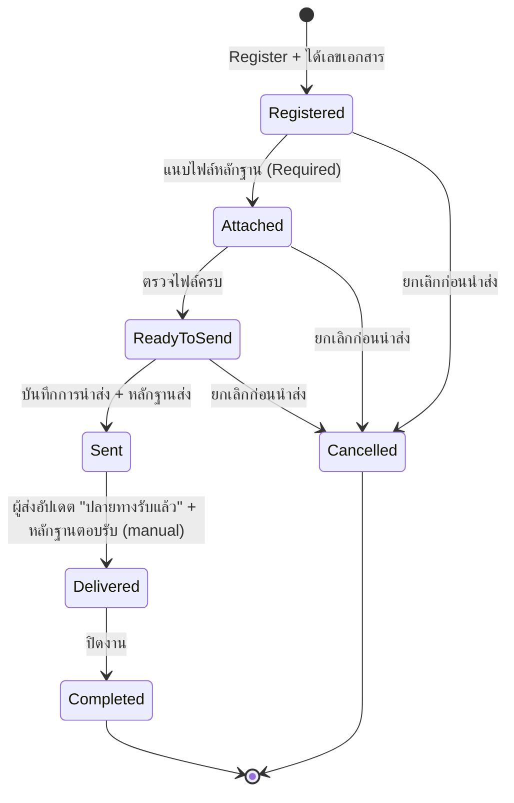
```mermaid
stateDiagram-v2
    [*] --> Registered: Register + ได้เลขเอกสาร
    Registered --> Attached: แนบไฟล์หลักฐาน (Required)
    Attached --> ReadyToSend: ตรวจไฟล์ครบ
    ReadyToSend --> Sent: บันทึกการนำส่ง + หลักฐานส่ง
    Sent --> Delivered: ผู้ส่งอัปเดต "ปลายทางรับแล้ว" + หลักฐานตอบรับ (manual)
    Delivered --> Completed: ปิดงาน
    Registered --> Cancelled: ยกเลิกก่อนนำส่ง
    Attached --> Cancelled: ยกเลิกก่อนนำส่ง
    ReadyToSend --> Cancelled: ยกเลิกก่อนนำส่ง
    Completed --> [*]
    Cancelled --> [*]
```

### 6.4 Deadline Flag (สถานะเสริม — ใช้ทั้งเอกสารรับเข้าและเอกสารส่งออก)

Flag กำหนดเวลาเป็นสถานะคู่ขนานกับสถานะงานหลัก ใช้ขับ Notification/Follow up และการแสดงผลบน Dashboard โดยไม่เปลี่ยนสถานะงานหลัก **ไม่มีสถานะ Escalated** (แทนด้วย Follow up + แจ้งหัวหน้าฝ่ายตามรูปแบบ Assign)

| Flag | ความหมาย |
|---|---|
| On Track | มี Deadline และยังอยู่ในกำหนด |
| Due Soon | ใกล้ถึง Deadline ตามเกณฑ์ configurable (ปกติ 3 วัน / ด่วน 1 วัน / ด่วนมาก ครึ่งวัน) → ส่ง Reminder |
| Overdue | เลย Deadline แล้วงานยังไม่ปิด → แจ้งเตือน (Assign เป็นฝ่าย → แจ้งหัวหน้าฝ่ายด้วย) |
| Cleared | ปิด/ยอมรับงานแล้ว หยุดนาฬิกาติดตาม (บันทึกหากเสร็จล่าช้า) |

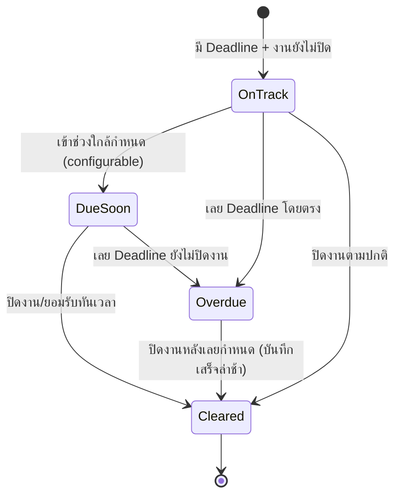
```mermaid
stateDiagram-v2
    [*] --> OnTrack: มี Deadline + งานยังไม่ปิด
    OnTrack --> DueSoon: เข้าช่วงใกล้กำหนด (configurable)
    DueSoon --> Overdue: เลย Deadline ยังไม่ปิดงาน
    OnTrack --> Overdue: เลย Deadline โดยตรง
    DueSoon --> Cleared: ปิดงาน/ยอมรับทันเวลา
    Overdue --> Cleared: ปิดงานหลังเลยกำหนด (บันทึกเสร็จล่าช้า)
    OnTrack --> Cleared: ปิดงานตามปกติ
    Cleared --> [*]
```

---

## 7. การคำนวณ Progress และ Chain of Custody

### 7.1 Progress Percent Calculation

Logic: ปิดทุก Sub = สำเร็จของ Main / Sub ที่ยกเลิกไม่นำมารวม / ทุก Sub น้ำหนักเท่ากัน / รองรับ 1:1 / Forward ไม่เพิ่มตัวหาร

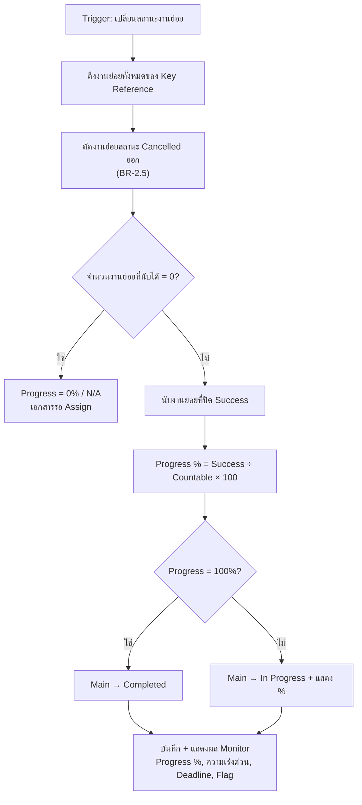
```mermaid
flowchart TD
    A["Trigger: เปลี่ยนสถานะงานย่อย"] --> B["ดึงงานย่อยทั้งหมดของ Key Reference"]
    B --> C["ตัดงานย่อยสถานะ Cancelled ออก<br/>(BR-2.5)"]
    C --> D{"จำนวนงานย่อยที่นับได้ = 0?"}
    D -->|"ใช่"| E["Progress = 0% / N/A<br/>เอกสารรอ Assign"]
    D -->|"ไม่"| F["นับงานย่อยที่ปิด Success"]
    F --> G["Progress % = Success ÷ Countable × 100"]
    G --> H{"Progress = 100%?"}
    H -->|"ใช่"| I["Main → Completed"]
    H -->|"ไม่"| J["Main → In Progress + แสดง %"]
    I --> K["บันทึก + แสดงผล Monitor<br/>Progress %, ความเร่งด่วน, Deadline, Flag"]
    J --> K
```

> **สูตร:** `Progress % = (จำนวน Sub สถานะ Success) ÷ (จำนวน Sub ที่นับได้ ยกเว้น Cancelled) × 100` — งานย่อยที่ Forward ยังคงเป็นงานย่อยเดิม (สืบทอด) ไม่เพิ่มตัวหาร

### 7.2 Chain of Custody — Accept = ยืนยันถือครองเอกสารตัวจริง

สำหรับเอกสารฉบับจริง ทุกครั้งที่เปลี่ยนมือ (รับงาน/ส่งต่อ) ผู้รับต้องกด Accept = ยืนยันถือเอกสารตัวจริงในมือ ระบบบันทึกผู้ถือครองล่าสุด เพื่อไล่หากรณีเอกสารสูญหาย

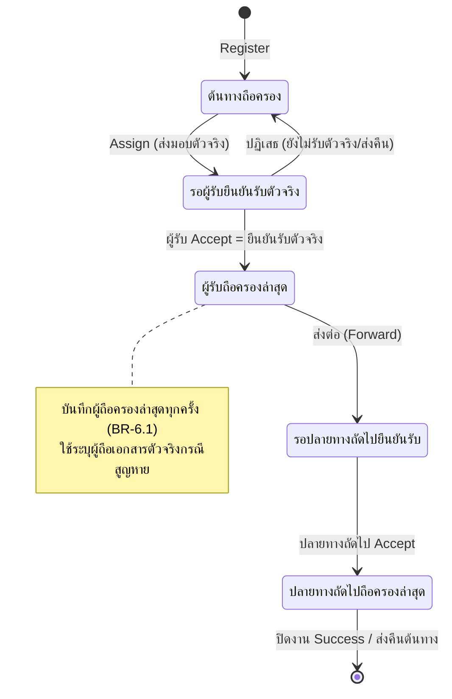
```mermaid
stateDiagram-v2
    state "ต้นทางถือครอง" as Src
    state "รอผู้รับยืนยันรับตัวจริง" as WaitR1
    state "ผู้รับถือครองล่าสุด" as Holder1
    state "รอปลายทางถัดไปยืนยันรับ" as WaitR2
    state "ปลายทางถัดไปถือครองล่าสุด" as Holder2

    [*] --> Src: Register
    Src --> WaitR1: Assign (ส่งมอบตัวจริง)
    WaitR1 --> Holder1: ผู้รับ Accept = ยืนยันรับตัวจริง
    WaitR1 --> Src: ปฏิเสธ (ยังไม่รับตัวจริง/ส่งคืน)
    Holder1 --> WaitR2: ส่งต่อ (Forward)
    WaitR2 --> Holder2: ปลายทางถัดไป Accept
    Holder2 --> [*]: ปิดงาน Success / ส่งคืนต้นทาง
    note right of Holder1
        บันทึกผู้ถือครองล่าสุดทุกครั้ง (BR-6.1)
        ใช้ระบุผู้ถือเอกสารตัวจริงกรณีสูญหาย
    end note
```

> สำหรับเอกสารอีเมลไม่มีการถือครองตัวจริง ระบบบันทึกเฉพาะเส้นทางการส่งต่อเชิงงาน (Forward log)

---

## 8. Notification / Reminder / Follow up

### 8.1 ช่องทางแจ้งเตือน (BR-6.2)

ระบบแจ้งเตือน **3 ช่องทางควบคู่กัน**:
1. **Email** — อีเมลแจ้งเตือน
2. **In-app Notification** — แจ้งเตือนในระบบ
3. **Task Inbox (กล่องงาน)** — รวมงานที่ผู้ใช้ต้องดำเนินการต่อทั้งหมด แบ่งกลุ่ม (รอรับ / กำลังดำเนินการ / รอส่งต่อ / รอรับเอกสารจริงคืน / เอกสารส่งออก) รองรับ mark as read/done

### 8.2 เกณฑ์เวลาแจ้งเตือนตามระดับความเร่งด่วน (Configurable)

ทุกค่าเป็น default ที่ปรับ config ได้ การแจ้งเตือนยึดเวลาทำการ ส่ง ณ ต้นเวลาทำการ (default 08:30 น.) ไม่แจ้งนอกเวลาทำการ (BR-3.2 / BR-3.3)

| ระดับความเร่งด่วน | Due Soon (ล่วงหน้าก่อน Deadline) | Pending เกินกำหนด | รอบการเตือนซ้ำ (Repeat Interval — default, configurable) |
|---|---|---|---|
| ปกติ | 3 วัน | ค้างเกิน 2 วันทำการ | **ทุก 5 วัน** — เตือนซ้ำจนกว่าเอกสารจะแล้วเสร็จ (Completed) |
| ด่วน | 1 วัน | ค้างเกิน 1 วันทำการ | **ทุก 3 วัน** — เตือนซ้ำจนกว่าเอกสารจะแล้วเสร็จ (Completed) |
| ด่วนมาก | ครึ่งวัน + แจ้งทันทีเมื่อ Assign | ค้างเกินครึ่งวันทำการ | **ทุก 1 วัน (ทุกวัน)** — เตือนซ้ำจนกว่าเอกสารจะแล้วเสร็จ (Completed) |

> **หมายเหตุรอบการเตือนซ้ำ (Repeat Interval):** รอบการส่ง Reminder ซ้ำเป็นค่า **default ที่ปรับ config ได้ต่อระดับความเร่งด่วน** — ปกติ = ทุก 5 วัน / ด่วน = ทุก 3 วัน / ด่วนมาก = ทุก 1 วัน (ทุกวัน) โดยระบบจะ **ส่งเตือนซ้ำเป็นรอบ ๆ ตามช่วงเวลาข้างต้นไปเรื่อย ๆ จนกว่าเอกสารจะแล้วเสร็จ (Completed)** จึงหยุดนาฬิกาและยกเลิก Reminder ที่ค้าง (สอดคล้อง BR-3.2 / BR-3.3) — การนับรอบยึดเวลาทำการ และส่ง ณ ต้นเวลาทำการ (default 08:30 น.)

### 8.3 กลไก Reminder / Follow up

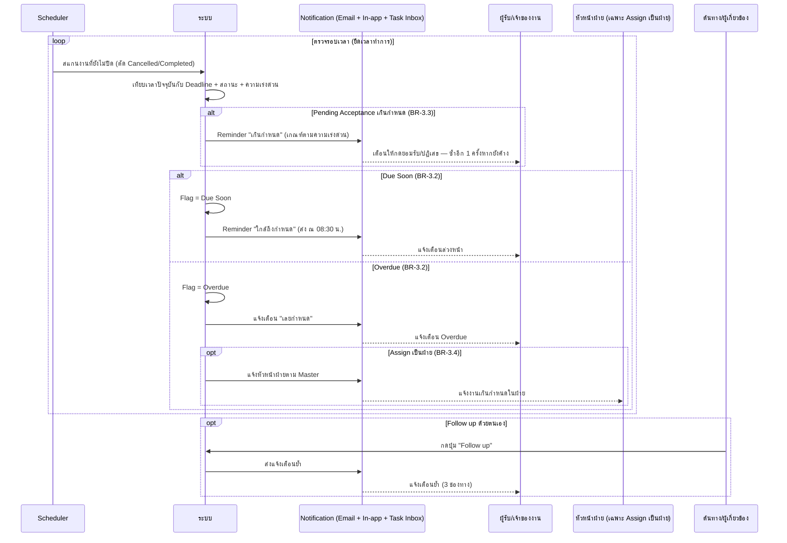
```mermaid
sequenceDiagram
    participant Sch as Scheduler
    participant S as ระบบ
    participant N as Notification (Email + In-app + Task Inbox)
    participant Rcv as ผู้รับ/เจ้าของงาน
    participant Head as หัวหน้าฝ่าย (เฉพาะ Assign เป็นฝ่าย)
    participant Src as ต้นทาง/ผู้เกี่ยวข้อง

    loop ตรวจรอบเวลา (ยึดเวลาทำการ)
        Sch->>S: สแกนงานที่ยังไม่ปิด (ตัด Cancelled/Completed)
        S->>S: เทียบเวลาปัจจุบันกับ Deadline + สถานะ + ความเร่งด่วน
        alt Pending Acceptance เกินกำหนด (BR-3.3)
            S->>N: Reminder "เกินกำหนด" (เกณฑ์ตามความเร่งด่วน)
            N-->>Rcv: เตือนให้กดยอมรับ/ปฏิเสธ — ซ้ำอีก 1 ครั้งหากยังค้าง
        end
        alt Due Soon (BR-3.2)
            S->>S: Flag = Due Soon
            S->>N: Reminder "ใกล้ถึงกำหนด" (ส่ง ณ 08:30 น.)
            N-->>Rcv: แจ้งเตือนล่วงหน้า
        else Overdue (BR-3.2)
            S->>S: Flag = Overdue
            S->>N: แจ้งเตือน "เลยกำหนด"
            N-->>Rcv: แจ้งเตือน Overdue
            opt Assign เป็นฝ่าย (BR-3.4)
                S->>N: แจ้งหัวหน้าฝ่ายตาม Master
                N-->>Head: แจ้งงานเกินกำหนดในฝ่าย
            end
        end
    end
    opt Follow up ด้วยตนเอง
        Src->>S: กดปุ่ม "Follow up"
        S->>N: ส่งแจ้งเตือนย้ำ
        N-->>Rcv: แจ้งเตือนย้ำ (3 ช่องทาง)
    end
```

> **ไม่มี Escalation อัตโนมัติหลายชั้น** — เมื่อ Overdue ระบบแจ้งเตือนตามรูปแบบ Assign และผู้เกี่ยวข้องกด Follow up ได้เอง เมื่อผู้รับ Accept/ปิดงาน ระบบหยุดนาฬิกาและยกเลิก Reminder ที่ค้าง สำหรับงานเอกสารส่งออก Reminder ครอบคลุมเฉพาะการนำส่ง/แล้วเสร็จภายใน Deadline (ขั้น Delivered ไม่มี reminder บังคับ — BR-4.2)

### 8.4 Notification Specification — Message Catalog (สเปคข้อความสำหรับส่งจริง)

หัวข้อนี้ระบุ **หัวข้อ (Subject) และเนื้อหา (Body) ของทุก event/trigger** ที่ระบบต้องแจ้งเตือน พร้อมช่องทางและผู้รับ เพื่อให้ทีมพัฒนานำไปตั้งค่า template และตัวแปร merge ได้โดยตรง ยึดหลักการช่องทาง (BR-6.2) และรูปแบบผู้รับตาม Assign (BR-3.4)

**หลักการทั่วไป**
1. **3 ช่องทางไม่เท่ากันตามลักษณะงาน** — Email + In-app ส่งทุก event; **Task Inbox แสดงเฉพาะ event ที่ต้องลงมือทำต่อ (actionable)** ตามกลุ่มในหัวข้อ 9.2 ส่วน event เชิงแจ้งผล (Accept/Completed/Delivered/ยืนยันรับคืน) ไม่เข้ากล่องงาน (ดู 8.6)
2. **Prefix ความเร่งด่วนใน Subject** — เติมป้ายนำหน้าตามระดับ: ด่วนมาก = `[ด่วนที่สุด]`, ด่วน = `[ด่วน]`, ปกติ = ไม่มี prefix
3. **ยึดเวลาทำการ** — Reminder/แจ้งเตือนตามกำหนดเวลาส่ง ณ ต้นเวลาทำการ (default 08:30 น.) ไม่ส่งนอกเวลาทำการ (BR-3.2/3.3) ส่วน event ที่เกิดจากการกระทำของผู้ใช้ (Assign/Accept/Reject/Forward/Recall/Cancel) ส่งทันที (real-time)
4. **ทุก Email/In-app แนบลิงก์ลึก (deep link)** `{{link}}` เปิดไปยังหน้า Story Line/Detail ของเอกสารนั้น
5. **In-app แสดงข้อความสั้น (one-line)**; Email แสดงเนื้อหาเต็ม; Task Inbox แสดง label + badge ความเร่งด่วน/Deadline Flag

### 8.5 ตัวแปร Merge (Placeholder Dictionary)

ตัวแปรที่ใช้ merge ใน template ทั้งหมด (ชื่อ field อ้างอิง Data Model หมวด 10):

| Placeholder | ความหมาย | ที่มา (field) |
|---|---|---|
| `{{system_name}}` | ชื่อระบบ (เช่น "ระบบติดตามเอกสารรับเข้า–ส่งออก") | Config |
| `{{doc_ref}}` | เลขที่/Key Reference เอกสารรับเข้า | MAIN_DOC.doc_ref |
| `{{doc_no}}` | เลขที่เอกสารส่งออก | OUT_DOC.doc_no |
| `{{doc_title}}` | ชื่อเรื่อง/หัวข้อเอกสาร | MAIN_DOC/OUT_DOC |
| `{{doc_type}}` | ประเภทเอกสาร (อีเมล / ฉบับจริง) | MAIN_DOC.doc_type |
| `{{channel}}` | ช่องทางรับ/ส่ง (ไปรษณีย์/Messenger/อีเมล) | MAIN_DOC.channel |
| `{{urgency}}` | ระดับความเร่งด่วน (ปกติ/ด่วน/ด่วนมาก) | MAIN_DOC.urgency |
| `{{deadline}}` | กำหนดแล้วเสร็จ (วันที่+เวลา) | MAIN_DOC.deadline |
| `{{assignee_name}}` | ชื่อผู้รับมอบหมาย/ผู้รับผิดชอบ | ASSIGNMENT.assignee_ref |
| `{{department}}` | ฝ่ายที่รับผิดชอบของผู้รับมอบหมาย (ฝ่ายที่ Assignee สังกัด กรณี Assign เป็นฝ่าย) | ASSIGNMENT (assignee_type=ฝ่าย) |
| `{{assigner_name}}` | ผู้มอบหมาย (ผู้กด Assign) | AUDIT_LOG.actor_ref |
| `{{registrar_name}}` | ผู้ Register ต้นทาง | MAIN_DOC.registrar_ref |
| `{{forwarded_by}}` | ผู้ส่งต่อ (ต้นทางของ Forward) | FORWARD_LOG.from_user |
| `{{holder_name}}` | ผู้ถือครองเอกสารฉบับจริงล่าสุด | CUSTODY_LOG.holder_ref |
| `{{reject_note}}` | หมายเหตุการปฏิเสธ/ตีกลับ | ASSIGNMENT.reject_note |
| `{{cancel_note}}` | หมายเหตุการยกเลิก/ดึงงานกลับ | AUDIT_LOG.note |
| `{{recall_by}}` | ผู้ดึงงานกลับ | AUDIT_LOG.actor_ref |
| `{{followup_by}}` | ผู้กดปุ่ม Follow up | AUDIT_LOG.actor_ref |
| `{{progress_percent}}` | ความคืบหน้าเอกสารหลัก | MAIN_DOC.progress_percent |
| `{{days_left}}` | จำนวนวันทำการคงเหลือก่อน Deadline | คำนวณ |
| `{{days_overdue}}` | จำนวนวันทำการที่เกินกำหนด | คำนวณ |
| `{{action_time}}` | วันเวลาที่เกิดเหตุการณ์ | AUDIT_LOG.action_time |
| `{{sender_name}}` | ผู้ส่งเอกสารส่งออก | OUT_DOC.sender_ref |
| `{{recipient_org}}` | ปลายทางภายนอกที่นำส่ง (เอกสารส่งออก) | OUT_DOC |
| `{{sent_date}}` | วันที่นำส่ง (เอกสารส่งออก) | OUT_DOC.sent_at |
| `{{delivered_date}}` | วันที่ปลายทางรับจริง (เอกสารส่งออก) | OUT_DOC.delivered_at |
| `{{link}}` | ลิงก์ลึกเปิด Story Line/Detail เอกสาร | Config + doc_ref/doc_no |

> **รูปแบบวันที่ (`{{deadline}}`, `{{action_time}}` ฯลฯ):** ต้องยืนยันการแสดงผล พ.ศ./ค.ศ. และรูปแบบ (แนะนำ `DD/MM/YYYY HH:mm น.`) — ดู Open Issue ข้อ 13

### 8.6 Channel & Recipient Matrix (สรุปทุก Event)

รวมทุก event/trigger พร้อมช่องทาง 3 ช่อง และผู้รับ (ผู้รับเพิ่มเมื่อ **Assign เป็นฝ่าย** ตาม BR-3.4)

| รหัส | Event / Trigger | BR อ้างอิง | Email | In-app | Task Inbox (กลุ่ม) | ผู้รับหลัก | ผู้รับเพิ่ม (กรณี Assign เป็นฝ่าย) |
|---|---|---|:---:|:---:|---|---|---|
| NT-01 | มอบหมายงานใหม่ (Assign) | BR-2.4 / 3.4 | ✅ | ✅ | 🟡 รอรับ | ผู้ถูก Assign | + หัวหน้าฝ่าย |
| NT-02 | รับงาน (Accept) | BR-2.3 / 6.1 | ✅ | ✅ | — (แจ้งผล) | ต้นทาง (ผู้ Register / ผู้ Forward) | — |
| NT-03 | ปฏิเสธ/ตีกลับ (Reject) | BR-2.2 | ✅ | ✅ | 🟠 (ถ้าฉบับจริงครบทุก sub → ต้นทาง) | ต้นทาง (ผู้ Register / ผู้ Forward) | + หัวหน้าฝ่าย |
| NT-04 | ส่งต่อ (Forward) | BR-6.1 | ✅ | ✅ | 🟡 รอรับ | ผู้รับลำดับถัดไป | + หัวหน้าฝ่าย |
| NT-05 | ดึงงานกลับ (Recall) | BR-2.1 | ✅ | ✅ | — (ลบงานออกจากกล่องผู้ถูกดึง) | ผู้ถูกดึงงาน | — |
| NT-06 | ยกเลิกเอกสาร/งานย่อย (Cancel) | BR-2.1 | ✅ | ✅ | — (ลบงานออกจากกล่อง) | ผู้รับที่ยัง active | + หัวหน้าฝ่าย |
| NT-07 | รอรับเอกสารฉบับจริงคืน (Awaiting Physical Return) | BR-2.2-A | ✅ | ✅ | 🟠 รอรับเอกสารจริงคืน | ต้นทาง / ผู้ Register | + หัวหน้าฝ่าย |
| NT-08 | ยืนยันรับเอกสารฉบับจริงคืนแล้ว | BR-2.2 | ✅ | ✅ | — (แจ้งผล) | ผู้เกี่ยวข้อง / หัวหน้าฝ่าย (info) | — |
| NT-09 | ปิดงานสำเร็จ (Completed 100%) | BR-2.5 | ✅ | ✅ | — (แจ้งผล) | ผู้ Register | + หัวหน้าฝ่าย |
| NT-10 | ใกล้กำหนด (Due Soon) | BR-3.2 | ✅ | ✅ | (คงกลุ่มเดิม + badge Due Soon) | ผู้รับผิดชอบงาน | + หัวหน้าฝ่าย |
| NT-11 | เกินกำหนด (Overdue) | BR-3.2 / 3.4 | ✅ | ✅ | (คงกลุ่มเดิม + badge Overdue) | ผู้รับผิดชอบงาน | + หัวหน้าฝ่าย |
| NT-12 | ค้างรับเกินกำหนด (Pending Acceptance Reminder) | BR-3.3 | ✅ | ✅ | 🟡 รอรับ | ผู้ถูก Assign | + หัวหน้าฝ่าย |
| NT-13 | ติดตามงาน (Follow up — manual) | BR-3.4 | ✅ | ✅ | (คงกลุ่มเดิม) | ผู้รับผิดชอบงาน | + หัวหน้าฝ่าย |
| NT-14 | เอกสารส่งออกนำส่งแล้ว (Sent) | BR-4.2 | ✅ | ✅ | 📤 รออัปเดต Delivered | ผู้ส่ง (เอกสารส่งออก) | + หัวหน้าฝ่าย (info) |
| NT-15 | เอกสารส่งออกปลายทางรับแล้ว (Delivered) | BR-4.2 | ✅ | ✅ | — (แจ้งผล) | ผู้ส่ง + ผู้เกี่ยวข้อง | — |
| NT-16 | เอกสารส่งออกใกล้/เกินกำหนดนำส่ง | BR-3.2 / 4.2 | ✅ | ✅ | 📤 รอนำส่ง | ผู้ส่ง (เอกสารส่งออก) | + หัวหน้าฝ่าย |
| NT-17 | บัญชีถูกเพิ่มเข้าระบบ (Provisioned) — *Optional* | BR-5.2 | ✅ | ✅ | — | ผู้ใช้ที่ถูก Provision | — |

> **หมายเหตุ recipient (BR-3.4):** เมื่อ **Assign ระบุตัวบุคคล** ระบบแจ้งเฉพาะผู้ถูก assign (ไม่แจ้งหัวหน้า) / เมื่อ **Assign เป็นฝ่าย** แจ้งผู้ถูก assign + หัวหน้าฝ่าย เสมอ — คอลัมน์ "ผู้รับเพิ่ม" มีผลเฉพาะกรณี Assign เป็นฝ่าย
> **หมายเหตุ recipient — Monitor (BR-3.4-A / BR-5.3):** สำหรับ event กลุ่มติดตาม **NT-10 (Due Soon), NT-11 (Overdue), NT-12 (Pending), NT-13 (Follow up), NT-16 (ส่งออกใกล้/เกินกำหนด)** หากงานนั้นอยู่ใน Scope ของผู้เฝ้าติดตาม (Monitor) ที่ `notify_enabled=true` → ระบบส่งให้ **Monitor เพิ่มเติม** จากผู้รับหลัก/หัวหน้าฝ่าย โดยไม่ขึ้นกับว่า Monitor เป็นผู้รับงานหรือไม่ (Monitor ไม่รับ event เชิงลงมือทำ เช่น NT-01/04 เว้นแต่กำหนดไว้)
> **หมายเหตุผู้รับ Reminder ซ้ำ (Repeat Reminder Recipients):** สำหรับการแจ้งเตือน **ซ้ำเป็นรอบ ๆ** ในกลุ่มติดตาม **NT-10 (Due Soon), NT-11 (Overdue), NT-12 (Pending), NT-13 (Follow up)** ระบบส่งเฉพาะถึงบุคคล 2 กลุ่มเท่านั้น คือ (ก) **ต้นทาง (Origin)** — ผู้ลงทะเบียน/ผู้ริเริ่มเอกสาร (Registrar/Initiator) และ (ข) **ผู้รับมอบหมายล่าสุดของแต่ละสายการมอบหมาย (Latest Assignee)** — คือ leaf ปลายสุดของแต่ละสายต้นไม้การมอบหมายต่อ (Delegation Tree/SubTree ตาม BR-2.4-A) โดย **ไม่ส่งถึงผู้มีส่วนร่วมทุกคนในสาย และไม่ส่งถึงหัวหน้าฝ่ายเป็นการทั่วไป** เว้นแต่หัวหน้าฝ่ายผู้นั้นเป็นต้นทางหรือเป็นผู้รับมอบหมายล่าสุดของสายใดสายหนึ่ง (การส่งให้ Monitor ตาม BR-3.4-A/BR-5.3 ยังคงเป็นการส่งเพิ่มเติมแยกต่างหาก)
> **การยกเลิก Reminder:** เมื่อผู้รับ Accept / ปิดงาน / งานถูก Recall/Cancel ระบบต้องหยุดนาฬิกาและ **ยกเลิก Reminder ที่ค้างในคิว** (NT-10/11/12) ทันที

### 8.7 Notification Templates (Subject + Body ต่อ Event)

รูปแบบมาตรฐาน: **Subject** = หัวข้ออีเมล (In-app ใช้ข้อความสั้น) · **Email Body** = เนื้อหาเต็ม · **In-app** = ข้อความบรรทัดเดียว · **Task Inbox** = label ในกล่องงาน (ถ้ามี)

ส่วนท้ายอีเมลทุกฉบับ (footer มาตรฐาน):
```
เปิดดูรายละเอียด: {{link}}
อีเมลนี้ส่งอัตโนมัติจาก {{system_name}} กรุณาอย่าตอบกลับ
```

---

#### กลุ่มที่ 1 — Workflow เอกสารรับเข้า

**NT-01 · มอบหมายงานใหม่ (Assign)** — ผู้รับ: ผู้ถูก Assign (+ หัวหน้าฝ่าย ถ้า Assign เป็นฝ่าย)

- **Subject:** `{{urgency_prefix}}[งานใหม่] เอกสาร {{doc_ref}} มอบหมายให้คุณดำเนินการ`
- **In-app:** `คุณได้รับมอบหมายเอกสาร {{doc_ref}} ({{urgency}}) กำหนด {{deadline}}`
- **Task Inbox:** กลุ่ม 🟡 รอรับ — `{{doc_ref}} · {{doc_title}}`
- **Email Body:**
```
เรียน {{assignee_name}}

คุณได้รับมอบหมายเอกสารให้ดำเนินการ รายละเอียดดังนี้
- เลขที่เอกสาร : {{doc_ref}}
- เรื่อง        : {{doc_title}}
- ประเภท       : {{doc_type}} (ช่องทาง: {{channel}})
- ความเร่งด่วน  : {{urgency}}
- กำหนดแล้วเสร็จ: {{deadline}}
- มอบหมายโดย   : {{assigner_name}}

กรุณาเข้าสู่ระบบเพื่อ "กดยอมรับ (Accept)" หรือ "ปฏิเสธ/ตีกลับ" เอกสารนี้
หมายเหตุ: กรณีเอกสารฉบับจริง การกดยอมรับถือเป็นการยืนยันการรับเอกสารตัวจริงไว้ในความครอบครอง
```

**NT-02 · รับงาน (Accept)** — ผู้รับ: ต้นทาง (ผู้ Register / ผู้ Forward)

- **Subject:** `[รับงานแล้ว] เอกสาร {{doc_ref}} ได้รับการยอมรับโดย {{assignee_name}}`
- **In-app:** `{{assignee_name}} ยอมรับเอกสาร {{doc_ref}} แล้ว`
- **Email Body:**
```
เรียน {{registrar_name}}

เอกสารที่ท่านมอบหมายได้รับการยอมรับแล้ว
- เลขที่เอกสาร : {{doc_ref}}
- เรื่อง        : {{doc_title}}
- ผู้รับงาน     : {{assignee_name}} ({{department}})
- ยอมรับเมื่อ   : {{action_time}}
{{#if doc_type == ฉบับจริง}}- ผู้ถือครองเอกสารฉบับจริงล่าสุด: {{holder_name}}{{/if}}

ท่านสามารถติดตามความคืบหน้าได้จากหน้า Story Line ของเอกสาร
```

**NT-03 · ปฏิเสธ/ตีกลับ (Reject)** — ผู้รับ: ต้นทาง (+ หัวหน้าฝ่าย ถ้า Assign เป็นฝ่าย)

- **Subject:** `{{urgency_prefix}}[ตีกลับ] เอกสาร {{doc_ref}} ถูกปฏิเสธโดย {{assignee_name}}`
- **In-app:** `เอกสาร {{doc_ref}} ถูกตีกลับ: {{reject_note}}`
- **Task Inbox:** หากเป็นเอกสารฉบับจริงและทุกงานย่อยถูกปฏิเสธ → เข้ากลุ่ม 🟠 รอรับเอกสารจริงคืน ของต้นทาง (ดู NT-07)
- **Email Body:**
```
เรียน {{registrar_name}}

เอกสารที่ท่านมอบหมายถูกปฏิเสธ/ตีกลับ
- เลขที่เอกสาร : {{doc_ref}}
- เรื่อง        : {{doc_title}}
- ผู้ปฏิเสธ     : {{assignee_name}} ({{department}})
- เหตุผล       : {{reject_note}}
- ปฏิเสธเมื่อ   : {{action_time}}

กรุณาตรวจสอบและมอบหมายใหม่ตามความเหมาะสม
{{#if doc_type == ฉบับจริง}}หมายเหตุ: หากทุกผู้รับปฏิเสธ ท่านต้องยืนยันการรับเอกสารฉบับจริงคืนก่อนจึงจะมอบหมายใหม่ได้{{/if}}
```

**NT-04 · ส่งต่อ (Forward)** — ผู้รับ: ผู้รับลำดับถัดไป (+ หัวหน้าฝ่าย ถ้าเป็นฝ่าย)

- **Subject:** `{{urgency_prefix}}[ส่งต่อ] เอกสาร {{doc_ref}} ส่งต่อให้คุณดำเนินการ`
- **In-app:** `{{forwarded_by}} ส่งต่อเอกสาร {{doc_ref}} ให้คุณ กำหนด {{deadline}}`
- **Task Inbox:** กลุ่ม 🟡 รอรับ — `{{doc_ref}} · {{doc_title}}`
- **Email Body:**
```
เรียน {{assignee_name}}

มีเอกสารถูกส่งต่อให้ท่านดำเนินการ
- เลขที่เอกสาร : {{doc_ref}}
- เรื่อง        : {{doc_title}}
- ประเภท       : {{doc_type}} (ช่องทาง: {{channel}})
- ความเร่งด่วน  : {{urgency}}
- กำหนดแล้วเสร็จ: {{deadline}} (สืบทอดจากเอกสารหลัก)
- ส่งต่อโดย     : {{forwarded_by}}

กรุณากดยอมรับ (Accept) เพื่อรับช่วงดำเนินการ
{{#if doc_type == ฉบับจริง}}การกดยอมรับถือเป็นการยืนยันรับเอกสารฉบับจริงต่อจากผู้ส่งต่อ{{/if}}
```

**NT-05 · ดึงงานกลับ (Recall)** — ผู้รับ: ผู้ถูกดึงงาน

- **Subject:** `[ดึงงานกลับ] เอกสาร {{doc_ref}} ถูกดึงกลับโดยต้นทาง`
- **In-app:** `เอกสาร {{doc_ref}} ถูกดึงกลับ ไม่ต้องดำเนินการต่อ`
- **Task Inbox:** ลบงานออกจากกล่องของผู้ถูกดึง
- **Email Body:**
```
เรียน {{assignee_name}}

เอกสารที่มอบหมายให้ท่านถูกดึงกลับโดยต้นทาง ท่านไม่ต้องดำเนินการต่อ
- เลขที่เอกสาร : {{doc_ref}}
- เรื่อง        : {{doc_title}}
- ดึงกลับโดย   : {{recall_by}}
- หมายเหตุ     : {{cancel_note}}
- ดำเนินการเมื่อ: {{action_time}}
```

**NT-06 · ยกเลิกเอกสาร/งานย่อย (Cancel)** — ผู้รับ: ผู้รับที่ยัง active (+ หัวหน้าฝ่าย ถ้าเป็นฝ่าย)

- **Subject:** `[ยกเลิก] เอกสาร {{doc_ref}} ถูกยกเลิก`
- **In-app:** `เอกสาร {{doc_ref}} ถูกยกเลิก`
- **Task Inbox:** ลบงานออกจากกล่องของผู้รับที่เกี่ยวข้อง
- **Email Body:**
```
เรียน {{assignee_name}}

เอกสารต่อไปนี้ถูกยกเลิก ท่านไม่ต้องดำเนินการต่อ
- เลขที่เอกสาร : {{doc_ref}}
- เรื่อง        : {{doc_title}}
- ยกเลิกโดย    : {{recall_by}}
- เหตุผล       : {{cancel_note}}
- ดำเนินการเมื่อ: {{action_time}}
```

**NT-07 · รอรับเอกสารฉบับจริงคืน (Awaiting Physical Return)** — ผู้รับ: ต้นทาง/ผู้ Register (+ หัวหน้าฝ่าย ถ้าเป็นฝ่าย)

- **Subject:** `{{urgency_prefix}}[รอรับเอกสารจริงคืน] เอกสาร {{doc_ref}} รอการรับเอกสารฉบับจริงคืน`
- **In-app:** `เอกสาร {{doc_ref}} ถูกปฏิเสธทั้งหมด กรุณายืนยันรับเอกสารฉบับจริงคืนก่อนมอบหมายใหม่`
- **Task Inbox:** กลุ่ม 🟠 รอรับเอกสารจริงคืน — `{{doc_ref}} · {{doc_title}}`
- **Email Body:**
```
เรียน {{registrar_name}}

เอกสารฉบับจริงต่อไปนี้ถูกปฏิเสธจากผู้รับทุกราย และอยู่ในสถานะ "รอรับเอกสารฉบับจริงคืน"
- เลขที่เอกสาร : {{doc_ref}}
- เรื่อง        : {{doc_title}}
- ผู้ถือครองล่าสุด: {{holder_name}}

กรุณายืนยันการรับเอกสารฉบับจริงคืนในระบบ ก่อนจึงจะสามารถมอบหมาย (Assign) ใหม่ได้
```

**NT-08 · ยืนยันรับเอกสารฉบับจริงคืนแล้ว** — ผู้รับ: ผู้เกี่ยวข้อง/หัวหน้าฝ่าย (แจ้งผล)

- **Subject:** `[ยืนยันรับคืนแล้ว] เอกสาร {{doc_ref}} พร้อมมอบหมายใหม่`
- **In-app:** `เอกสาร {{doc_ref}} ยืนยันรับเอกสารฉบับจริงคืนแล้ว (สถานะ: Registered)`
- **Email Body:**
```
เรียน ผู้เกี่ยวข้อง

เอกสารฉบับจริงต่อไปนี้ได้รับการยืนยันรับคืนเรียบร้อยแล้ว และกลับสู่สถานะ "Registered" พร้อมมอบหมายใหม่
- เลขที่เอกสาร : {{doc_ref}}
- เรื่อง        : {{doc_title}}
- ยืนยันโดย    : {{registrar_name}}
- ยืนยันเมื่อ   : {{action_time}}
```

**NT-09 · ปิดงานสำเร็จ (Completed 100%)** — ผู้รับ: ผู้ Register (+ หัวหน้าฝ่าย ถ้าเป็นฝ่าย)

- **Subject:** `[เสร็จสิ้น] เอกสาร {{doc_ref}} ดำเนินการครบถ้วน (100%)`
- **In-app:** `เอกสาร {{doc_ref}} ดำเนินการเสร็จสมบูรณ์แล้ว`
- **Email Body:**
```
เรียน {{registrar_name}}

เอกสารต่อไปนี้ดำเนินการครบทุกงานย่อยและปิดงานสมบูรณ์แล้ว
- เลขที่เอกสาร : {{doc_ref}}
- เรื่อง        : {{doc_title}}
- ความคืบหน้า  : {{progress_percent}}% (Completed)
- ปิดงานเมื่อ   : {{action_time}}
```

---

#### กลุ่มที่ 2 — Reminder / ติดตาม (ทั้งเอกสารรับเข้าและเอกสารส่งออกที่ยังไม่ปิด)

**NT-10 · ใกล้ถึงกำหนด (Due Soon)** — ผู้รับ: ผู้รับผิดชอบงาน (+ หัวหน้าฝ่าย ถ้าเป็นฝ่าย) · ส่ง ณ 08:30 น.

- **Subject:** `{{urgency_prefix}}[ใกล้ถึงกำหนด] เอกสาร {{doc_ref}} เหลือเวลาอีก {{days_left}} วัน`
- **In-app:** `เอกสาร {{doc_ref}} ใกล้ถึงกำหนด ({{deadline}}) เหลือ {{days_left}} วัน`
- **Task Inbox:** คงกลุ่มเดิม + แสดง badge "Due Soon"
- **Email Body:**
```
เรียน {{assignee_name}}

เอกสารที่ท่านรับผิดชอบใกล้ถึงกำหนดแล้ว กรุณาเร่งดำเนินการ
- เลขที่เอกสาร : {{doc_ref}}
- เรื่อง        : {{doc_title}}
- ความเร่งด่วน  : {{urgency}}
- กำหนดแล้วเสร็จ: {{deadline}} (เหลืออีก {{days_left}} วันทำการ)
- ความคืบหน้า  : {{progress_percent}}%
```

**NT-11 · เกินกำหนด (Overdue)** — ผู้รับ: ผู้รับผิดชอบงาน (+ หัวหน้าฝ่าย ถ้าเป็นฝ่าย)

- **Subject:** `{{urgency_prefix}}[เกินกำหนด] เอกสาร {{doc_ref}} เกินกำหนดแล้ว {{days_overdue}} วัน`
- **In-app:** `เอกสาร {{doc_ref}} เกินกำหนด ({{deadline}}) แล้ว {{days_overdue}} วัน`
- **Task Inbox:** คงกลุ่มเดิม + แสดง badge "Overdue"
- **Email Body:**
```
เรียน {{assignee_name}}

เอกสารที่ท่านรับผิดชอบเกินกำหนดแล้ว กรุณาดำเนินการโดยด่วน
- เลขที่เอกสาร : {{doc_ref}}
- เรื่อง        : {{doc_title}}
- ความเร่งด่วน  : {{urgency}}
- กำหนดแล้วเสร็จ: {{deadline}} (เกินกำหนด {{days_overdue}} วันทำการ)
- ความคืบหน้า  : {{progress_percent}}%
{{#if assignee_type == ฝ่าย}}สำเนาถึงหัวหน้าฝ่าย {{department}} เพื่อทราบและติดตาม{{/if}}
```

**NT-12 · ค้างรับเกินกำหนด (Pending Acceptance Reminder)** — ผู้รับ: ผู้ถูก Assign (+ หัวหน้าฝ่าย ถ้าเป็นฝ่าย) · เตือน + ซ้ำอีก 1 ครั้งหากยังค้าง

- **Subject:** `{{urgency_prefix}}[ค้างรับงาน] เอกสาร {{doc_ref}} รอการตอบรับจากคุณ`
- **In-app:** `เอกสาร {{doc_ref}} รอคุณกดยอมรับ/ปฏิเสธ (ค้างเกินกำหนด)`
- **Task Inbox:** กลุ่ม 🟡 รอรับ + badge เตือน
- **Email Body:**
```
เรียน {{assignee_name}}

มีเอกสารที่มอบหมายให้ท่านค้างรอการตอบรับเกินกำหนด กรุณากดยอมรับหรือปฏิเสธ
- เลขที่เอกสาร : {{doc_ref}}
- เรื่อง        : {{doc_title}}
- ความเร่งด่วน  : {{urgency}}
- มอบหมายโดย   : {{assigner_name}}
- กำหนดแล้วเสร็จ: {{deadline}}

หากไม่ดำเนินการ ระบบจะแจ้งเตือนซ้ำอีกครั้ง
```

**NT-13 · ติดตามงาน (Follow up — กดด้วยตนเอง)** — ผู้รับ: ผู้รับผิดชอบงาน (+ หัวหน้าฝ่าย ถ้าเป็นฝ่าย)

- **Subject:** `{{urgency_prefix}}[ติดตามงาน] {{followup_by}} ขอติดตามเอกสาร {{doc_ref}}`
- **In-app:** `{{followup_by}} ติดตามเอกสาร {{doc_ref}} กรุณาดำเนินการ`
- **Task Inbox:** คงกลุ่มเดิม + badge "ถูกติดตาม"
- **Email Body:**
```
เรียน {{assignee_name}}

{{followup_by}} ขอติดตามความคืบหน้าของเอกสารที่ท่านรับผิดชอบ
- เลขที่เอกสาร : {{doc_ref}}
- เรื่อง        : {{doc_title}}
- ความเร่งด่วน  : {{urgency}}
- กำหนดแล้วเสร็จ: {{deadline}}
- ความคืบหน้า  : {{progress_percent}}%

กรุณาเข้าระบบเพื่อดำเนินการหรืออัปเดตสถานะ
```

---

#### กลุ่มที่ 3 — เอกสารส่งออก

**NT-14 · นำส่งแล้ว (Sent)** — ผู้รับ: ผู้ส่ง (+ หัวหน้าฝ่าย แจ้งเพื่อทราบ ถ้ากำหนด)

- **Subject:** `[นำส่งแล้ว] เอกสารออกเลขที่ {{doc_no}} ถูกนำส่งแล้ว`
- **In-app:** `เอกสารออก {{doc_no}} นำส่งแล้วเมื่อ {{sent_date}} — รออัปเดตการรับปลายทาง`
- **Task Inbox:** กลุ่ม 📤 รออัปเดต Delivered — `{{doc_no}} · {{doc_title}}`
- **Email Body:**
```
เรียน {{sender_name}}

เอกสารออกต่อไปนี้ถูกบันทึกการนำส่งเรียบร้อยแล้ว
- เลขที่เอกสาร : {{doc_no}}
- เรื่อง        : {{doc_title}}
- ปลายทาง      : {{recipient_org}}
- ช่องทางนำส่ง  : {{channel}}
- นำส่งเมื่อ    : {{sent_date}}

เมื่อปลายทางรับเอกสารแล้ว กรุณาอัปเดตสถานะ "Delivered" พร้อมแนบหลักฐานตอบรับในระบบ
```

**NT-15 · ปลายทางรับแล้ว (Delivered)** — ผู้รับ: ผู้ส่ง + ผู้เกี่ยวข้อง (แจ้งผล)

- **Subject:** `[ปลายทางรับแล้ว] เอกสารออกเลขที่ {{doc_no}} ส่งถึงปลายทางเรียบร้อย`
- **In-app:** `เอกสารออก {{doc_no}} ปลายทางรับแล้วเมื่อ {{delivered_date}}`
- **Email Body:**
```
เรียน {{sender_name}}

เอกสารออกต่อไปนี้ได้รับการยืนยันว่าปลายทางรับเรียบร้อยแล้ว
- เลขที่เอกสาร : {{doc_no}}
- เรื่อง        : {{doc_title}}
- ปลายทาง      : {{recipient_org}}
- ปลายทางรับเมื่อ: {{delivered_date}}

สถานะเอกสารถูกปิดเป็น Completed พร้อมหลักฐานตอบรับในระบบ
```

**NT-16 · ใกล้/เกินกำหนดนำส่ง (เอกสารส่งออก)** — ผู้รับ: ผู้ส่ง (+ หัวหน้าฝ่าย ถ้าเป็นฝ่าย)

- **Subject:** `{{urgency_prefix}}[ติดตามการนำส่ง] เอกสารออก {{doc_no}} {{due_state_text}}`
- **In-app:** `เอกสารออก {{doc_no}} {{due_state_text}} (กำหนด {{deadline}})`
- **Task Inbox:** กลุ่ม 📤 รอนำส่ง + badge Due Soon/Overdue
- **Email Body:**
```
เรียน {{sender_name}}

เอกสารออกต่อไปนี้ {{due_state_text}} กรุณาดำเนินการนำส่ง/ปิดงานภายในกำหนด
- เลขที่เอกสาร : {{doc_no}}
- เรื่อง        : {{doc_title}}
- ความเร่งด่วน  : {{urgency}}
- กำหนดแล้วเสร็จ: {{deadline}}
- สถานะปัจจุบัน : {{status}}
```
> `{{due_state_text}}` = "ใกล้ถึงกำหนดนำส่ง (เหลือ {{days_left}} วัน)" หรือ "เกินกำหนดนำส่งแล้ว {{days_overdue}} วัน" ตามกรณี · Reminder ครอบคลุมเฉพาะขั้นก่อน Delivered (ขั้น Delivered ไม่มี reminder บังคับ — BR-4.2)

---

#### กลุ่มที่ 4 — บัญชีผู้ใช้ (Optional — ต้องยืนยัน ดู Open Issue ข้อ 14)

**NT-17 · บัญชีถูกเพิ่มเข้าระบบ (Provisioned)** — ผู้รับ: ผู้ใช้ที่ถูก Provision

- **Subject:** `[แจ้งสิทธิ์เข้าใช้งาน] บัญชีของคุณถูกเพิ่มเข้า {{system_name}} แล้ว`
- **In-app:** `บัญชีของคุณพร้อมใช้งานแล้ว — ฝ่าย {{department}}, สิทธิ์ {{role_name}}`
- **Email Body:**
```
เรียน {{assignee_name}}

บัญชีของท่านได้รับอนุญาตให้เข้าใช้งาน {{system_name}} แล้ว
- ฝ่าย   : {{department}}
- สิทธิ์  : {{role_name}}
- เพิ่มโดย: {{assigner_name}} (ผู้ดูแลระบบ)

ท่านสามารถเข้าสู่ระบบด้วยบัญชี AD/LDAP ของท่าน
```

### 8.8 หลักการส่งเชิงเทคนิค (Delivery Rules)

| หัวข้อ | กฎ |
|---|---|
| Quiet hours | Reminder (NT-10/11/12/16) ส่ง ณ ต้นเวลาทำการ (08:30 น.) เท่านั้น ไม่ส่งนอกเวลาทำการ (BR-3.2/3.3) — event ที่เกิดจากการกระทำของผู้ใช้ (NT-01..09, 14, 15, 17) ส่ง real-time |
| De-duplication | รวมงานหลายรายการของผู้รับคนเดียวกันในรอบเวลาเดียวได้ (digest) เพื่อลดสแปม — ต้องยืนยันรูปแบบ (Open Issue 15) |
| ยกเลิก Reminder | Accept/ปิดงาน/Recall/Cancel → ยกเลิก Reminder ที่ค้างในคิวของเอกสาร/งานย่อยนั้นทันที |
| ความถี่ | ปกติ: 1 ครั้ง + ซ้ำ 1 ครั้ง / ด่วน: เช้า-บ่าย / ด่วนมาก: ทุกช่วงเวลาทำการ (ตามหมวด 8.2) |
| Fallback | หากส่ง Email ล้มเหลว In-app + Task Inbox ยังต้องแสดง — มี log การส่ง (delivery log) ต่อ event |
| Audit | ทุกการส่งแจ้งเตือนสำคัญบันทึกลง log (event, recipient, channel, time) เพื่อตรวจสอบย้อนหลัง |

> **ความปลอดภัย/PDPA:** เนื้อหาอีเมลควรใส่เท่าที่จำเป็น หลีกเลี่ยงการส่งข้อมูลอ่อนไหว/เนื้อหาเอกสารเต็มทางอีเมล ให้ผู้รับคลิก `{{link}}` เข้าระบบเพื่อดูรายละเอียด (สอดคล้อง NFR-12 Data Protection)

---

## 9. Dashboard และ Reporting

### 9.1 Dashboard 3 ระดับ (Real-time)

Dashboard เป็นหัวใจของระบบ อัปเดต real-time มี Dropdown เลือกประเภทเอกสาร (รับเข้า/ส่งออก) และกรองข้อมูลตามสิทธิ์ (BR-5.1)

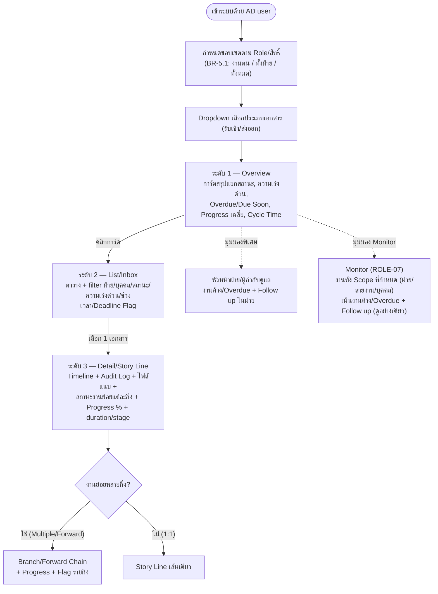
```mermaid
flowchart TD
    Login(["เข้าระบบด้วย AD user"]) --> Scope["กำหนดขอบเขตตาม Role/สิทธิ์<br/>(BR-5.1: งานตน / ทั้งฝ่าย / ทั้งหมด)"]
    Scope --> DocType["Dropdown เลือกประเภทเอกสาร (รับเข้า/ส่งออก)"]
    DocType --> L1["ระดับ 1 — Overview<br/>การ์ดสรุปแยกสถานะ, ความเร่งด่วน,<br/>Overdue/Due Soon, Progress เฉลี่ย, Cycle Time"]
    L1 -->|"คลิกการ์ด"| L2["ระดับ 2 — List/Inbox<br/>ตาราง + filter ฝ่าย/บุคคล/สถานะ/<br/>ความเร่งด่วน/ช่วงเวลา/Deadline Flag"]
    L2 -->|"เลือก 1 เอกสาร"| L3["ระดับ 3 — Detail/Story Line<br/>Timeline + Audit Log + ไฟล์แนบ +<br/>สถานะงานย่อยแต่ละกิ่ง + Progress % + duration/stage"]
    L3 --> D1{"งานย่อยหลายกิ่ง?"}
    D1 -->|"ใช่ (Multiple/Forward)"| Tree["Branch/Forward Chain<br/>+ Progress + Flag รายกิ่ง"]
    D1 -->|"ไม่ (1:1)"| Line["Story Line เส้นเดียว"]
    L1 -.->|"มุมมองพิเศษ"| Sup["หัวหน้าฝ่าย/ผู้กำกับดูแล<br/>งานค้าง/Overdue + Follow up ในฝ่าย"]
    L1 -.->|"มุมมอง Monitor"| Mon["Monitor (ROLE-07)<br/>งานทั้ง Scope ที่กำหนด (ฝ่าย/สายงาน/บุคคล)<br/>เน้นงานค้าง/Overdue + Follow up (ดูอย่างเดียว)"]
```

> **Story Line** แสดง duration ต่อ stage (เวลาที่งานค้างที่แต่ละผู้ถือครอง) เพื่อชี้คอขวด และสรุปผู้ถือครองงานนานสุด (Bottleneck) — คำนวณด้วยเวลาจริง (calendar time) สอดคล้องกับ Cycle Time ใน RPT-03

**ข้อกำหนดหน้าจอรายละเอียดเอกสาร (Document Detail Page — ระดับ 3):**
- **ส่วนหัว (Header & Subject Card):** แสดงเลขที่เอกสาร, สถานะหลัก, Deadline Flag, ระดับความเร่งด่วน, ข้อมูลผู้ส่ง/ผู้รับ, กำหนดส่ง, และฝ่ายที่รับผิดชอบ
- **ส่วนแท็บข้อมูล (Tabbed Information):**
  - แท็บ *เส้นทางเอกสาร (Story Line)*: แสดง node การดำเนินงาน, งานย่อยรายกิ่ง (Sub-assignments), และ % ความคืบหน้า
  - แท็บ *การถือครอง (Chain of Custody)*: (เฉพาะเอกสารฉบับจริง) แสดงประวัติผู้ถือครองเอกสารตัวจริงทุกการเปลี่ยนมือ
  - แท็บ *ประวัติ (Audit Log)*: แสดงบันทึก audit log ย้อนหลังทุกการกระทำ
- **การ์ดไฟล์แนบและภาพถ่าย (Attachments & Photos Card — BR-1.2-B):**
  - **Action Buttons:** 
    1. ปุ่ม `แนบไฟล์เพิ่ม` (สีน้ำเงิน `#012169`): เปิด Native File Dialog เพื่อเลือกไฟล์จากเครื่อง (PDF, DOCX, XLSX, รูปภาพ, ZIP สูงสุด 25 MB)
    2. ปุ่ม `ถ่ายภาพแนบเพิ่ม` (สีทอง `#FFCD00`): เปิด CameraCaptureModal ถ่ายภาพสดผ่านกล้อง WebRTC พร้อมระบบกลับภาพ (Mirror) และหมุนภาพ (Rotate 90°)
  - **พื้นที่ลากวางไฟล์ (Drag-and-Drop Dropzone):** ผู้ใช้สามารถลากไฟล์จากเครื่องมาวางในการ์ดเพื่อแนบไฟล์ได้ทันที
  - **รายการไฟล์แนบ:**
    - แสดงไอคอนจำแนกประเภทไฟล์ (PDF สีแดง, XLSX สีเขียว, DOCX สีน้ำเงิน, รูปภาพพร้อม Thumbnail)
    - แสดง Badge จำแนกแหล่งที่มา: `เอกสารแนบหลัก`, `ไฟล์แนบเพิ่ม`, `ถ่ายจากกล้อง`
    - แสดงขนาดไฟล์และวันเวลาที่แนบ
    - ปุ่มการทำงาน: `ดูรูป` / `ดูตัวอย่าง` (เปิด Lightbox Modal พรีวิวภาพ), `ดาวน์โหลด` (Download ไฟล์ลงเครื่อง), และ `ลบ` (Delete เฉพาะไฟล์ที่แนบเพิ่ม)
- **การ์ดการดำเนินการ (Action Panel):**
  - *เอกสารรับเข้า:* ปุ่มรับงาน (Accept), ปฏิเสธ/ส่งคืน (Reject), ส่งต่อ (Forward), ปิดงาน (Success), ติดตาม (Follow up), ดึงกลับ (Recall), ยกเลิก (Cancel)
  - *เอกสารส่งออก:* ปุ่มบันทึกการนำส่ง (Sent), ยืนยันปลายทางรับ (Delivered) ซึ่งเปิด Modal ให้แนบหลักฐานสลิป/เอกสารหรือถ่ายภาพใบเซ็นรับ, ติดตาม (Follow up), ยกเลิกเอกสาร (Cancel)

### 9.2 Task Inbox (กล่องงาน)

Task Inbox แสดงเฉพาะงานที่ผู้ใช้ต้อง **ลงมือทำต่อ (actionable)** แบ่งกลุ่มตามการดำเนินการ:
- 🟡 รอรับ (Pending Acceptance)
- 🔵 กำลังดำเนินการ (In Progress)
- 🟣 รอส่งต่อ / รอปิดงาน (Accepted)
- 🟠 รอรับเอกสารจริงคืน (Awaiting Physical Return — เฉพาะต้นทาง)
- 📤 เอกสารส่งออก — รอนำส่ง / รออัปเดต Delivered

จัดลำดับตามความเร่งด่วน + Deadline Flag (ด่วนมาก/Overdue ขึ้นบนสุด) งานที่เพียง "เฝ้าดู" (หัวหน้าดูงานลูกน้อง) แสดงบน Dashboard ไม่ปะปนในกล่องงานส่วนตัว

### 9.3 ข้อกำหนดหน้าจอสร้างคำขอออกเลขที่เอกสารส่งออก (Outgoing Document Number Request UI)

ระบบสารบรรณรองรับการเปิดฟอร์มสร้างคำขอออกเลขที่เอกสารส่งออก (Seamless EDR Integration) ภายในระบบโดยตรง แบ่งออกเป็น 2 รูปแบบตามประเภทหน่วยงาน:

```
┌────────────────────────────────────────────────────────────────────────────────────────────────────────┐
│ หน้าหลัก > เอกสารส่งออก > สร้างคำขอขอเลขที่เอกสาร                                     (M) Mr. Teerapat  │
│                                                                                                        │
│ [ ธรรมดา (Flow A) ]  [ พิเศษ (Flow B) ]  (Tab สลับโหมดการขอเลข)                                         │
│                                                                                                        │
│ สร้างคำขอ — ธรรมดา / พิเศษ  [ ธรรมดา / พิเศษ ] (Badge แสดงประเภท)                                       │
├─────────────────────────────────────────────────────────┬──────────────────────────────────────────────┤
│ [ข้อมูลที่ต้องกรอก]                                      │ [ข้อมูลอัตโนมัติ (Read-only)]                 │
│                                                         │                                              │
│ หน่วยงานภายนอก *                                         │ ผู้สร้าง:                                      │
│ [ เลือกหน่วยงานภายนอก...                            ▼ ] │ Mr. Teerapat Tiangkool                       │
│ (*หากเลือก "อื่นๆ" ในโหมดธรรมดา จะมีช่อง Free-text บังคับ)│                                              │
│                                                         │ ฝ่าย:                                         │
│ ชื่อเรื่อง *                                             │ ฝ่ายพัฒนากระบวนการทางธุรกิจ                    │
│ [ กรอกหัวข้อเรื่องหนังสือ...                          ] │                                              │
│                                                         │ วันที่:                                       │
│ หมายเหตุ                                                │ 21/08/2026                                   │
│ [ ระบุรายละเอียด/หมายเหตุเพิ่มเติม...                ] │                                              │
│                                                         │ ประเภท:                                      │
│ รายการเอกสาร                         [+ เพิ่มรายการ]     │ [ ธรรมดา / พิเศษ ] (Badge)                    │
│ ┌─────────────────────────────────────────────────────┐ └──────────────────────────────────────────────┘
│ │ (ตารางรายการเอกสารย่อย: รายละเอียด, ผู้รับ, ลำดับ)    │                                              │
│ └─────────────────────────────────────────────────────┘                                                │
│                                                                                                        │
│ ผู้รับเอกสาร * (บังคับอย่างน้อย 1 คน) [+ เพิ่มผู้รับ]                                                  │
│ ┌─────────────────────────────────────────────────────┐                                                │
│ │ (ตารางผู้รับเอกสาร: ชื่อ-นามสกุล, ตำแหน่ง, ฝ่าย, ลำดับ)│                                              │
│ └─────────────────────────────────────────────────────┘                                                │
│                                                                                                        │
│ ผู้ลงนาม * (บังคับอย่างน้อย 1 คน)    [+ เพิ่มผู้ลงนาม]                                                 │
│ ┌─────────────────────────────────────────────────────┐                                                │
│ │ (ตารางผู้ลงนาม: ชื่อ-นามสกุล, ตำแหน่ง, ลำดับ)        │                                              │
│ └─────────────────────────────────────────────────────┘                                                │
├────────────────────────────────────────────────────────────────────────────────────────────────────────┤
│                                                            [  ยกเลิก  ]   [ ✈ ส่งคำขอ (สีกรมท่า) ]     │
└────────────────────────────────────────────────────────────────────────────────────────────────────────┘
```

**พฤติกรรมของระบบเมื่อกดปุ่ม "ส่งคำขอ":**
1. **ขอเลขธรรมดา (Flow A):**
   - ตรวจสอบความถูกต้องของข้อมูล (เรื่อง, หน่วยงาน, ผู้รับ $\ge 1$, ผู้ลงนาม $\ge 1$)
   - ยิง REST API ไปยัง EDR Engine $\rightarrow$ ได้รับเลขที่เอกสารคู่ขนานทันที (`พ001สอ/2569` และ `S001CC/2026`)
   - ระบบบันทึกเอกสารเป็นสถานะ `Registered` และ **นำทางผู้ใช้เข้าสู่หน้า "แนบไฟล์หลักฐาน/ถ่ายภาพด้วยกล้อง" (BR-4.1) ทันที** เพื่อเตรียมนำส่ง (`Ready To Send`)
2. **ขอเลขพิเศษ (Flow B):**
   - ยิง REST API ไปยัง EDR Engine $\rightarrow$ บันทึกคำขอสถานะ `Pending (รออนุมัติเลข)` และ EDR ยิง Email Noti หาผู้อนุมัติ
   - แสดงสถานะในระบบสารบรรณเป็น *"รอการอนุมัติออกเลข"* เมื่อผู้อนุมัติกด Approve ระบบจะได้รับ Webhook คืนค่าเลขที่เอกสาร และแจ้งเตือนให้ผู้ขอเข้ามาแนบไฟล์ส่งออกต่อ

### 9.4 รายการรายงาน (Reporting)

Export **Excel (.xlsx) และ CSV (.csv) เท่านั้น** (ไม่รองรับ PDF) การ export บันทึก Audit

| รหัส | รายงาน | วัตถุประสงค์ | Filter หลัก |
|---|---|---|---|
| RPT-01 ¹ | สถานะเอกสารตามช่วงเวลา | สรุปจำนวนแยกสถานะ (เข้า/ออก) — เมื่อสรุปตามฝ่าย ยอดรวมรายฝ่ายอาจมากกว่าจำนวนเอกสารจริงจากการนับซ้ำข้ามฝ่าย | ช่วงเวลา, ประเภทเอกสาร (รับเข้า/ส่งออก), ฝ่าย, สถานะ |
| RPT-02 ¹ | งานค้าง / Overdue | ชี้งานเกินกำหนด/ค้างรับ เพื่อ Follow up — เมื่อสรุปตามฝ่าย ยอดรวมรายฝ่ายอาจมากกว่าจำนวนเอกสารจริงจากการนับซ้ำข้ามฝ่าย | ฝ่าย, บุคคล, ความเร่งด่วน, Deadline Flag |
| RPT-03 | ระยะเวลาดำเนินการ (Cycle Time) | วัดเวลาเฉลี่ยต่อ stage/ฝ่าย (calendar time) — เป็นค่าเฉลี่ย ไม่ใช่ยอดนับเอกสาร จึงไม่เข้ากติกานับซ้ำข้ามฝ่าย | stage, ฝ่าย, ช่วงเวลา, ความเร่งด่วน |
| RPT-04 ¹ | ปริมาณงาน (Volume) | ดูปริมาณตามประเภท/ช่องทาง/ความเร่งด่วน — เมื่อสรุปตามฝ่าย ยอดรวมรายฝ่ายอาจมากกว่าจำนวนเอกสารจริงจากการนับซ้ำข้ามฝ่าย | ประเภท, ช่องทาง, ความเร่งด่วน, ช่วงเวลา |
| RPT-05 | Audit / ประวัติการเปลี่ยนสถานะ | ตรวจร่องรอยรายเอกสาร — แสดงรายเอกสาร/รายเหตุการณ์ ไม่ใช่ยอดรวมตามฝ่าย จึงไม่เข้ากติกานับซ้ำข้ามฝ่าย | Key Reference/เลขเอกสาร, ช่วงเวลา |
| RPT-06 ¹ | ประสิทธิภาพการรับงาน | อัตราปฏิเสธ/ตีกลับ/ดึงกลับ ต่อฝ่าย — ยอดมอบหมาย/รับ/ปฏิเสธ/ดึงกลับ นับจากงานย่อย (Sub-assignment) ของแต่ละฝ่าย เอกสารที่มีงานย่อยหลายฝ่ายจึงถูกนับซ้ำข้ามฝ่าย ทำให้ยอดรวมรายฝ่ายอาจมากกว่าจำนวนเอกสารจริงได้เช่นกัน | ฝ่าย, บุคคล, ช่วงเวลา |

> **หมายเหตุ — กติกาการนับหลายฝ่าย (Multi-Department Counting Rule):** เอกสาร 1 ฉบับสามารถเกี่ยวข้องกับหลายฝ่ายพร้อมกันได้ผ่านงานย่อย (Sub-assignment) — เมื่อรายงานจัดกลุ่มผลลัพธ์ตามฝ่าย (สัญลักษณ์ ¹ ในตาราง: RPT-01, RPT-02, RPT-04, RPT-06) เอกสารฉบับนั้นจะถูก **นับซ้ำภายใต้ทุกฝ่ายที่เกี่ยวข้อง** (Involved Departments = ฝ่ายจาก Sub-assignment ทุกสถานะ รวมกับฝ่ายที่รับผิดชอบและฝ่ายต้นทาง) ไม่ใช่นับจากฝ่ายรับผิดชอบเพียงฝ่ายเดียว ดังนั้น **ยอดรวมที่สรุปตามฝ่าย (สรุปตามฝ่าย) ของรายงานเหล่านี้อาจมากกว่าจำนวนเอกสารจริงในระบบ** เนื่องจากการนับซ้ำข้ามฝ่าย (double-counting) — ตัวเลขนี้ยังคงถูกต้องในเชิงตรรกะของรายงานตามฝ่าย แต่ไม่ควรนำไปรวม (sum) ข้ามฝ่ายเพื่ออ้างเป็นจำนวนเอกสารทั้งหมดที่ไม่ซ้ำ (unique document count) ส่วน RPT-03 และ RPT-05 ไม่เข้ากติกานี้เพราะเป็นค่าเฉลี่ย/รายเหตุการณ์ ไม่ใช่ยอดนับเอกสารตามฝ่าย
>
> **หมายเหตุ — ที่มาของ RPT-06 (ประสิทธิภาพการรับงาน):** ตัวเลขในรายงานนี้ (จำนวนที่มอบหมาย/รับ/ปฏิเสธ/ดึงกลับ และอัตราปฏิเสธ) คำนวณจากสถานะจริงของระเบียนงานย่อย (Sub-assignment) ที่บันทึกไว้ในระบบ ณ ขณะเรียกรายงาน ไม่ใช่ค่าคงที่ (static/hardcoded) ที่กำหนดไว้ล่วงหน้า
>
> **หมายเหตุ — ความหมายของยอดรวมรายฝ่ายใน RPT-01, RPT-02, RPT-04, RPT-06:** เนื่องจากรายงานทั้งสี่ฉบับนี้จัดกลุ่มผลลัพธ์ตามฝ่าย (สรุปตามฝ่าย) ภายใต้กติกาการนับหลายฝ่ายข้างต้น ตัวเลข "จำนวนเอกสาร" หรือ "จำนวนงานที่มอบหมาย" ที่แสดงต่อฝ่ายในรายงานเหล่านี้ **ไม่ใช่จำนวนเอกสารที่ไม่ซ้ำ (unique document count)** หากนำยอดรวมของทุกฝ่ายมาบวกกัน ผลรวมที่ได้ **อาจมากกว่าจำนวนเอกสารจริงในระบบ** เนื่องจากเอกสารที่เกี่ยวข้องหลายฝ่ายจะถูกนับซ้ำในทุกฝ่ายที่เกี่ยวข้อง (นับซ้ำข้ามฝ่าย) ผู้อ่านรายงานควรตีความตัวเลขต่อฝ่ายเป็น "ภาระงานของฝ่ายนั้น" ไม่ใช่ "ส่วนแบ่งที่ไม่ซ้ำกันของเอกสารทั้งหมด"

---

## 10. Data Model (ER Diagram)

> โมเดลเชิงตรรกะสรุปจากพฤติกรรมใน Flow 1.4.0 (field ปรับได้ตามการออกแบบจริง) — User/Department/Head อ้างอิงจาก AD + Master Data
>
> **การแยกประเภทงานเอกสาร:** ใช้ field `doc_direction` เป็นตัวจำแนก **ประเภทเอกสาร** ด้วยค่า `incoming` (เอกสารรับเข้า) และ `outgoing` (เอกสารส่งออก) แทนแนวคิด "Phase" เดิม โดยเอกสารรับเข้าเก็บใน `MAIN_DOC` และเอกสารส่งออกเก็บใน `OUT_DOC` — ทั้งสองเป็นคนละประเภทงานในระบบเดียวกัน ใช้ค่า `doc_direction` ในการ filter/แสดงผลบน Dashboard และรายงาน
>
> **หมายเหตุความหมายของฟิลด์ฝ่าย (Department Field Semantics):** เพื่อให้ Data Model สื่อความหมายเรื่องฝ่ายตรงกับ Document_Model ของ mockup (ดูหมายเหตุคำศัพท์เรื่องฝ่ายก่อนสารบัญ) ให้ตีความฝ่ายในโมเดลนี้ดังนี้ (เป็นการอธิบายความหมาย ไม่เปลี่ยนชื่อ entity/field ทางเทคนิค):
> - **ฝ่ายที่ผู้รับมอบหมายสังกัด = "ฝ่ายที่รับผิดชอบ":** ความสัมพันธ์ `DEPARTMENT ||--o{ ASSIGNMENT` และฟิลด์ `ASSIGNMENT.assignee_ref` / `assignee_type` (กรณี `assignee_type=รายฝ่าย`) สื่อถึง **ฝ่ายที่รับผิดชอบ** ดำเนินการเอกสาร ซึ่งเป็นแนวคิดเดียวกับฟิลด์ `department` ใน Document_Model ของ mockup (ฝ่ายของ Assignee)
> - **ฝ่ายต้นทาง = Origin_Department_Field (ฟิลด์แยก):** **"ฝ่ายต้นทาง"** เป็นฟิลด์ที่ระบุ *จุดกำเนิดของเอกสาร* แยกต่างหากจากฝ่ายที่รับผิดชอบข้างต้น ตรงกับฟิลด์ `originDepartment` ใน Document_Model ของ mockup — ไม่ใช่บทบาทผู้กระทำ `registrar_ref` (ผู้ Register ต้นทาง) ซึ่งเป็น Registrar_Actor เชิงกระบวนการ


```mermaid
erDiagram
    USER ||--o{ MAIN_DOC : "Register"
    USER ||--o{ ASSIGNMENT : "ถูก Assign / กระทำ"
    DEPARTMENT ||--o{ ASSIGNMENT : "ฝ่ายผู้รับ"
    DEPARTMENT ||--o| USER : "หัวหน้า/ผู้กำกับดูแล"
    ROLE ||--o{ USER : "ผูก Role (Provision โดย Admin)"
    ROLE ||--o{ PERMISSION : "มีสิทธิ์"
    USER ||--o{ USER : "Admin provision (provisioned_by)"
    USER ||--o{ MONITOR_ASSIGNMENT : "เป็นผู้เฝ้าติดตาม (Monitor)"
    DEPARTMENT ||--o{ WORKGROUP : "มีกลุ่มงาน"
    DEPARTMENT ||--o{ MONITOR_ASSIGNMENT : "Scope=department"
    WORKGROUP ||--o{ MONITOR_ASSIGNMENT : "Scope=workgroup"

    MAIN_DOC ||--|{ ASSIGNMENT : "มีงานย่อย (Key Reference)"
    MAIN_DOC ||--o{ ATTACHMENT : "ไฟล์แนบหลักฐาน"
    MAIN_DOC ||--o{ AUDIT_LOG : "ประวัติการเปลี่ยนสถานะ"
    MAIN_DOC ||--o{ OTP_TRANSACTION : "บันทึกการขอ OTP ปลดล็อกไฟล์"
    MAIN_DOC ||--o{ ATTACHMENT_ACCESS_LOG : "ประวัติการเข้าถึงไฟล์ลับมาก"
    ASSIGNMENT ||--o{ FORWARD_LOG : "เส้นทางส่งต่อ"
    ASSIGNMENT ||--o{ CUSTODY_LOG : "ผู้ถือครองล่าสุด"

    OUT_DOC ||--|{ ATTACHMENT : "ไฟล์หลักฐาน (บังคับ)"
    OUT_DOC ||--o{ AUDIT_LOG : "ประวัติ"
    OUT_DOC ||--o{ OTP_TRANSACTION : "ขอ OTP"
    OUT_DOC ||--o{ ATTACHMENT_ACCESS_LOG : "ประวัติเข้าถึงไฟล์"

    MAIN_DOC {
        string doc_ref PK "Key Reference / REG-YYYY-NNNN"
        string doc_direction "ประเภทงานเอกสาร = incoming (เอกสารรับเข้า)"
        string doc_type "อีเมล / ฉบับจริง"
        string channel "ไปรษณีย์ / Messenger / อีเมล"
        string urgency "ปกติ/ด่วน/ด่วนมาก"
        string confidentiality_level "normal / confidential / top_secret (BR-1.4-A)"
        datetime deadline
        string status "Registered/PendingAcceptance/InProgress/AwaitingPhysicalReturn/Completed/Cancelled"
        string deadline_flag "OnTrack/DueSoon/Overdue/Cleared"
        decimal progress_percent
        string registrar_ref "AD user"
        datetime created_at "เริ่มนับ lifecycle"
    }
    ASSIGNMENT {
        string id PK
        string doc_ref FK
        string assignee_ref "AD user / ฝ่าย"
        string assignee_type "รายฝ่าย / รายบุคคล"
        string status "PendingAcceptance/Accepted/Rejected/Recalled/Forwarded/Success/Cancelled"
        datetime deadline "สืบทอดจาก Main เสมอ"
        string reject_note
        datetime accepted_at
    }
    FORWARD_LOG {
        string id PK
        string assignment_id FK
        string from_user "AD user"
        string to_user "AD user / ฝ่าย"
        datetime forwarded_at
    }
    CUSTODY_LOG {
        string id PK
        string assignment_id FK
        string holder_ref "ผู้ถือครองล่าสุด"
        datetime held_at
        string note "chain of custody เอกสารฉบับจริง"
    }
    OUT_DOC {
        string doc_no PK "เลขเอกสารจากระบบเดิม"
        string doc_direction "ประเภทงานเอกสาร = outgoing (เอกสารส่งออก)"
        string urgency
        string confidentiality_level "normal / confidential / top_secret (BR-1.4-A)"
        datetime deadline
        string status "Registered/Attached/ReadyToSend/Sent/Delivered/Completed/Cancelled"
        string deadline_flag
        string sender_ref "AD user"
        datetime sent_at
        datetime delivered_at "manual update"
    }
    ATTACHMENT {
        string id PK
        string doc_ref FK "Main/Out doc"
        string file_path
        string file_name
        string file_type "pdf / docx / xlsx / image"
        string attachment_source "upload / camera"
        boolean is_mirrored "true เมื่อใช้โหมดกลับภาพซ้าย-ขวา"
        int rotation_deg "องศาการหมุน 0/90/180/270"
        boolean is_confidential "true หากเป็นเอกสารลับมาก (BR-1.4-B)"
        string file_hash
        string uploaded_by "AD user"
        datetime uploaded_at
    }
    OTP_TRANSACTION {
        string otp_id PK
        string doc_ref FK
        string user_id FK "AD User ที่ขอ OTP"
        string otp_code_hash "BCrypt Hash ของรหัส OTP 6 หลัก"
        string otp_ref "รหัสอ้างอิง เช่น REF-9821"
        string delivery_channel "email (ช่องทางเดียว — Email only)"
        string target_destination "อีเมลผู้ใช้ที่ถูก Mask (เช่น t****@deves.co.th)"
        int attempt_count "จำนวนครั้งที่กรอก (max 3)"
        string status "pending / verified / expired / max_attempts_exceeded"
        datetime created_at
        datetime expires_at "TTL 3 นาที (180 วินาที)"
        datetime verified_at
    }
    ATTACHMENT_ACCESS_LOG {
        string access_id PK
        string doc_ref FK
        string attachment_id FK
        string user_id FK "AD User ที่เข้าดู/โหลด"
        string access_type "preview_watermark / download"
        string ip_address
        string user_agent
        datetime accessed_at
    }
    AUDIT_LOG {
        string log_id PK
        string doc_ref FK
        string actor_ref "AD user"
        string action "Register/Assign/Accept/Reject/Forward/Recall/Cancel/Deliver/RequestOTP/VerifyOTP/ViewSecretFile"
        string from_state
        string to_state
        datetime action_time
        string note
    }
    USER {
        string user_id PK "อ้างอิง AD/LDAP (sAMAccountName/UPN)"
        string display_name "ชื่อ-นามสกุล (จาก LDAP)"
        string email "จาก LDAP (ใช้เป็นช่องทางรับ OTP — Email only)"
        string department_ref "ฝ่าย (ผูกตอน Provision)"
        string role_id FK "Role ที่ Admin ผูก"
        string source "LDAP"
        string status "Active / Inactive (provisioned)"
        string provisioned_by "Admin user ที่เพิ่มเข้าระบบ"
        datetime provisioned_at
        datetime last_login_at
    }
    ROLE {
        string role_id PK
        string name
        string data_scope "own/dept/all"
    }
    PERMISSION {
        string perm_key PK
        string role_id FK
    }
    DEPARTMENT {
        string department_id PK "Master Data ฝ่าย"
        string name_th
        string name_en
        string dept_code_th "ตัวย่อฝ่าย ไทย (สำหรับ EDR)"
        string dept_code_en "ตัวย่อฝ่าย อังกฤษ (สำหรับ EDR)"
        string head_user_ref "หัวหน้าฝ่าย/ผู้กำกับดูแล (FK USER)"
        boolean is_active
    }
    WORKGROUP {
        string workgroup_id PK "Master Data กลุ่มงาน/สายงาน"
        string department_id FK "สังกัดฝ่าย"
        string name
        boolean is_active
    }
    MONITOR_ASSIGNMENT {
        string monitor_id PK
        string monitor_user_ref FK "ผู้เฝ้าติดตาม (เลือกจากผู้ใช้ที่ Provision)"
        string scope_type "department / workgroup / user / doc_direction"
        string scope_refs "ค่าเป้าหมายจาก Master หลายรายการ (array ของ department_id/workgroup_id/user_id) — แทน scope_ref เดิมแบบค่าเดียว"
        boolean all_departments "ครอบคลุมทุกฝ่ายปัจจุบัน+อนาคต (default false; ใช้กับ scope_type=department; เมื่อ true ให้ scope_refs ว่าง)"
        string doc_direction_filter "incoming / outgoing / all"
        boolean notify_enabled "รับแจ้งเตือนงานค้างใน Scope (default true)"
        datetime effective_from
        datetime effective_to
        string status "Active / Inactive"
        string created_by "ผู้ตั้งค่า (Admin/หัวหน้าฝ่าย)"
        datetime created_at
    }
```

> **หมายเหตุการมอบหมายแบบรายฝ่าย: ส่งถึงหัวหน้า/เจ้าของฝ่ายก่อน แล้วมอบหมายต่อได้ (Owner-first Routing & Onward Delegation — Data Model Note):** เมื่อการมอบหมายเป็นแบบ **รายฝ่าย (Assign รายฝ่าย, assignee เป็นฝ่าย)** ผู้รับผิดชอบลำดับแรกของงานย่อยฝ่ายนั้นคือ **หัวหน้า/เจ้าของฝ่าย (Department Owner)** ซึ่งอ้างอิงจากฟิลด์เดิมในโมเดล `DEPARTMENT.head_user_ref` (หัวหน้าฝ่าย/ผู้กำกับดูแล — FK USER) โดย **ไม่มีการเพิ่มหรือเปลี่ยนชื่อฟิลด์ทางเทคนิค** — เป็นการอธิบายความหมายของฟิลด์ที่มีอยู่แล้วให้ครอบคลุมบทบาท "ผู้รับผิดชอบลำดับแรกของการมอบหมายรายฝ่าย" หลังจากหัวหน้า/เจ้าของฝ่าย Accept แล้ว สามารถ **มอบหมายต่อ (มอบหมายต่อ / onward delegation)** ให้ผู้ใช้ที่สังกัดฝ่ายเดียวกัน (ฝ่ายตรงกับ `head_user_ref` ที่อ้างถึง) ได้ โดยงานที่มอบหมายต่อเป็นงานย่อยรายบุคคลภายใต้ Key Reference เดิมตาม BR-2.4 (ดู BR-2.4-A ในหมวด 11.2) — หมายเหตุนี้เป็นระดับคำศัพท์/กฎ/คำอธิบายข้อมูลเท่านั้น ไม่กระทบ State Machine, Progress หรือ Notification Matrix เดิม

---

## 11. Business Rules Catalog (สำหรับทดสอบ)

รวม Business Rules ทั้งหมดจาก Flow 1.4.0 พร้อมเงื่อนไข ผลลัพธ์/ข้อความ และ HTTP status (สำหรับส่วนที่เป็น API) ใช้เป็น checklist ในการเขียน Test Case

### 11.1 Register และ การขอสร้างเลขที่เอกสารส่งออก (BR-1.x)

| รหัส | เงื่อนไข | ผลลัพธ์ / ข้อความ | HTTP |
|---|---|---|---|
| BR-1.2 | Register แนบหลักฐานและหมายเหตุ | Optional — ปล่อยว่างได้ ไม่บล็อก / แนบไฟล์เพิ่มย้อนหลังได้หลายไฟล์โดยผู้เกี่ยวข้องลำดับถัดไป (รองรับทั้ง Upload ไฟล์จากเครื่องโดยตรง, Drag-and-Drop, และ ถ่ายภาพผ่านกล้อง) | 200/201 |
| BR-1.2-A | การถ่ายภาพเอกสารผ่านกล้องของอุปกรณ์ (Camera Capture) | รองรับ WebRTC stream / Native Mobile Camera พร้อมเส้นกรอบ Viewfinder สีทอง `#FFCD00`, ปุ่มชัตเตอร์ Flash, ปุ่มกลับภาพซ้าย-ขวา (Flip/Mirror) แก้ตัวอักษรกลับด้านสำหรับกล้องหน้า, ปุ่มหมุนภาพ 90° และ Lightbox พรีวิวรูปภาพก่อนแนบจริง บันทึกเป็น JPEG (ขนาด ≤ 25 MB) | 200/201 |
| BR-1.2-B | การจัดการไฟล์แนบในหน้าจอรายละเอียดเอกสาร (Document Detail Attachment Management) | ผู้มีสิทธิ์เกี่ยวข้องกับเอกสารสามารถ (1) แนบไฟล์เพิ่มจากเครื่องโดยตรง (Direct File Upload), (2) ลากวางไฟล์ (Drag-and-Drop Dropzone) ขนาด ≤ 25 MB (รองรับ PDF, DOCX, XLSX, JPG, PNG, WEBP, ZIP) หรือ (3) ถ่ายภาพผ่านกล้อง (Camera Capture) ได้ทุกเมื่อในหน้าจอ Document Detail โดยระบบบันทึกเป็น Extra Attachment แยกจากเอกสารแนบหลัก รองรับการดูตัวอย่าง (Lightbox Preview), ดาวน์โหลดไฟล์ (Download) และลบไฟล์แนบที่เพิ่มใหม่ (Delete) | 200/201 |
| BR-1.3-A | การขอสร้างเลขเอกสารส่งออกผ่าน EDR REST API (Seamless Number Request) | ผู้ใช้สร้างคำขอออกเลขส่งออกผ่านหน้าจอบนระบบสารบรรณ (UI 2 คอลัมน์) ระบบจะยิง API ไปยัง EDR Engine ทันที: (1) หากเป็นหน่วยงานทั่วไป (Flow A) EDR ออกเลขคู่ขนาน (ไทย + อังกฤษ) ให้ทันที สารบรรณเปลี่ยนสถานะเป็น `Registered` และพาไปหน้าแนบไฟล์นำส่ง (BR-4.1); (2) หากเป็นหน่วยงานพิเศษ (Flow B) สารบรรณบันทึกสถานะ `Pending (รออนุมัติเลข)` และ EDR ส่ง Email Noti หาผู้อนุมัติ | 200/201 |
| BR-1.3-B | การรับข้อมูลซิงค์ย้อนกลับจาก Webhook ของ EDR (Reverse Inbound EDR Sync) | เมื่อผู้ใช้สร้างคำขอและได้รับเลขที่เอกสารผ่านเว็บ EDR เดิม หรือเมื่อผู้อนุมัติกด Approve ใน EDR ระบบ EDR จะยิง Webhook (`POST /api/v1/integration/edr/sync-document`) มาเปิดหรืออัปเดตรายการเอกสารส่งออกในระบบสารบรรณโดยอัตโนมัติ เพื่อให้สารบรรณเริ่มกระบวนการ Monitor การนำส่งได้ทันที | 200 |
| BR-1.3-C | กฎความเท่าเทียมของข้อมูลและการป้องกันข้อมูลซ้ำ (Data Parity & Idempotent Upsert) | ข้อมูลคำขอทั้งสองระบบมีโครงสร้างฟิลด์เท่ากัน 100% (เรื่อง, หน่วยงาน, ผู้รับ, ผู้ลงนาม, ผู้สร้าง/ฝ่าย, เลขที่ 2 ภาษา) และระบบใช้ `EDR Request ID` หรือ `DocumentNumberTH` เป็น Unique Key ในการ Upsert ป้องกันการสร้างรายการซ้ำ | 200 |
| BR-1.3-D | การจัดเก็บและค้นหาเลขคู่ขนาน 2 ภาษา (Dual Key TH/EN Storage & Search) | ระบบจัดเก็บทั้งเลขภาษาไทย (เช่น `พ001สอ/2569`) และภาษาอังกฤษ (เช่น `S001CC/2026`) เป็น Alternate Key และรองรับการค้นหา (Cross-search) ด้วยเลขภาษาใดก็ได้ | 200 |
| BR-1.5 | **ข้อมูลต้องมาจาก Master Data / ตัวเลือกที่ควบคุมได้ (Master-Driven Data Entry)** | ทุกฟิลด์ที่มี Master รองรับ **ต้องเลือกจากรายการ (Dropdown/Lookup/Autocomplete ผูก ID)** ไม่ใช่พิมพ์อิสระ — ได้แก่ ฝ่าย/หน่วยงานภายใน, กลุ่มงาน, ผู้ใช้/ผู้รับ/ผู้ลงนาม (จาก LDAP ที่ Provision), หน่วยงานภายนอก, ประเภทเอกสาร, ช่องทาง, ความเร่งด่วน, ระดับชั้นความลับ, Scope ของ Monitor; ระบบเก็บเป็น **reference ID** ไม่เก็บข้อความ label เพื่อคงความถูกต้อง (referential integrity) — อนุญาต Free-text เฉพาะฟิลด์เชิงบรรยาย (ชื่อเรื่อง, หมายเหตุ, เหตุผลปฏิเสธ) และกรณี "อื่นๆ" ของหน่วยงานภายนอกที่ยังไม่มีใน Master (บังคับกรอกชื่อ + แนะนำให้ Admin เพิ่มเข้า Master ภายหลัง) | 200/201 · 400 (หากส่ง label ที่ไม่มีใน Master) |

### 11.2 Assign / รับงาน (BR-2.x)

| รหัส | เงื่อนไข | ผลลัพธ์ / ข้อความ | HTTP |
|---|---|---|---|
| BR-2.1 | ต้นทางดึงงานกลับ/ยกเลิกงานที่ยังไม่ปิด | สถานะงานย่อย = Recalled + เก็บ Log + noti ผู้ถูกดึงงาน (3 ช่องทาง) | 200 |
| BR-2.1-E | ดึงงานกลับที่ปิด Success แล้ว | "ไม่สามารถดึงงานที่ปิดแล้วกลับได้" | 400 |
| BR-2.2 | ผู้รับปฏิเสธ/ตีกลับ ต้องระบุหมายเหตุ | สถานะ = Rejected + คืนต้นทาง + noti | 200 |
| BR-2.2-A | ทุกงานย่อยถูกปฏิเสธ + เอกสารมีฉบับจริง | Main → Awaiting Physical Return / ต้องยืนยันรับคืนก่อน Assign ใหม่ | 200 |
| BR-2.2-B | ทุกงานย่อยถูกปฏิเสธ + เอกสารเป็นอีเมล | Main → Registered / Assign ใหม่ได้ทันที | 200 |
| BR-2.2-E | ปฏิเสธโดยไม่ระบุหมายเหตุ | "กรุณาระบุหมายเหตุการปฏิเสธ" | 400 |
| BR-2.3 | ต้อง Accept ก่อนจึง Forward / ปิดงาน Success ได้ | บล็อกหากยังไม่ Accept — เอกสารฉบับจริง Accept = ยืนยันถือครองตัวจริง (บันทึกผู้ถือครอง) | 400 (หากยังไม่ Accept) |
| BR-2.4 | Assign Multiple Select หลายฝ่าย/บุคคล | สร้างหลายงานย่อยผูก Key Reference เดียว + คำนวณ Progress | 201 |
| BR-2.4-A | **Owner-first routing & onward delegation** — เมื่อ Assign เป็น **รายฝ่าย** (assignee เป็นฝ่าย ตาม BR-2.4) | งานย่อยรายฝ่ายส่งถึง **หัวหน้า/เจ้าของฝ่าย (Department Owner) เป็นผู้รับผิดชอบลำดับแรก** โดยอ้างอิงฟิลด์เดิม `DEPARTMENT.head_user_ref` (ดูหมวด 10); หลังหัวหน้า/เจ้าของฝ่าย **Accept** (ตาม BR-2.3) แล้ว สามารถ **มอบหมายต่อ (มอบหมายต่อ / Delegate)** ให้ผู้ใต้บังคับบัญชาในฝ่ายเดียวกัน โดยสร้างงานย่อยรายบุคคลใหม่ภายใต้ Key Reference เดิม — สอดคล้องและอยู่ภายใต้ BR-2.4 (ไม่แก้ไขเงื่อนไข/ผลลัพธ์ของ BR-2.4 เดิม, ไม่กระทบ Progress/State Machine/Notification) | 200/201 |
| BR-2.5 | ปิดทุก Sub = Main สำเร็จ / Sub Cancelled ไม่นับ / ทุก Sub equal weight / รองรับ 1:1 | Progress = Success ÷ Countable × 100 | 200 |

### 11.3 ความเร่งด่วน / Deadline / Notification (BR-3.x)

| รหัส | เงื่อนไข | ผลลัพธ์ / ข้อความ | HTTP |
|---|---|---|---|
| BR-3.1 | กำหนดความเร่งด่วน + Deadline ตั้งแต่ Register/Assign | งานย่อยสืบทอด Deadline ของ Main เสมอ ไม่กำหนด Deadline ย่อยซ้ำ | 200 |
| BR-3.2 | ใกล้ Deadline (Due Soon) / เลย Deadline (Overdue) งานยังไม่ปิด | ส่ง Reminder / แจ้ง Overdue — **รอบการเตือนซ้ำ configurable ต่อระดับความเร่งด่วน (default: ปกติ = ทุก 5 วัน / ด่วน = ทุก 3 วัน / ด่วนมาก = ทุก 1 วัน (ทุกวัน)) เตือนซ้ำเป็นรอบ ๆ จนกว่าเอกสารจะแล้วเสร็จ (Completed)** ยึดเวลาทำการ (08:30 น.) | - |
| BR-3.3 | Pending Acceptance ค้างเกินกำหนด | ส่ง Reminder และ **เตือนซ้ำตามรอบ configurable ต่อระดับความเร่งด่วน (default: ปกติ = ทุก 5 วัน / ด่วน = ทุก 3 วัน / ด่วนมาก = ทุก 1 วัน (ทุกวัน)) จนกว่าเอกสารจะแล้วเสร็จ (Completed)** | - |
| BR-3.4 | รูปแบบการแจ้งเตือนตาม Assign | Assign บุคคล → เฉพาะผู้ถูก assign / Assign ฝ่าย → ผู้ถูก assign + หัวหน้าฝ่าย / มีปุ่ม Follow up / ไม่มี Escalation อัตโนมัติ<br/>**ผู้รับ Reminder ซ้ำ (NT-10/11/12/13):** ส่งเฉพาะ (ก) **ต้นทาง** (ผู้ลงทะเบียน/ผู้ริเริ่มเอกสาร) และ (ข) **ผู้รับมอบหมายล่าสุดของแต่ละสายการมอบหมาย** (leaf ของแต่ละ Delegation Tree ตาม BR-2.4-A) เท่านั้น — ไม่ส่งถึงผู้มีส่วนร่วมทุกคน และไม่ส่งถึงหัวหน้าฝ่ายเป็นการทั่วไป เว้นแต่ผู้นั้นเป็นต้นทางหรือผู้รับมอบหมายล่าสุด | - |
| BR-3.4-A | ผู้เฝ้าติดตาม (Monitor) รับแจ้งเตือนงานค้างเพิ่มเติม | หากงานอยู่ใน Scope ของ Monitor ที่ `notify_enabled=true` → ส่ง Reminder กลุ่มติดตาม (Due Soon/Overdue/Pending/Follow up: NT-10/11/12/13/16) ให้ Monitor **เพิ่มเติมจากผู้รับงานและหัวหน้าฝ่าย** โดยไม่ขึ้นกับว่า Monitor เป็นผู้รับงานหรือไม่ (BR-5.3) | - |

### 11.4 เอกสารส่งออก (BR-4.x)

| รหัส | เงื่อนไข | ผลลัพธ์ / ข้อความ | HTTP |
|---|---|---|---|
| BR-4.1 | เอกสารส่งออกแนบไฟล์หลักฐาน | บังคับ (Required) — รองรับทั้ง Upload ไฟล์จากเครื่องโดยตรง (PDF/Office/Image/ZIP ≤ 25 MB), ลากวาง Drag-and-Drop, และถ่ายภาพผ่านกล้องของอุปกรณ์ (Camera Capture) หากไม่มีแนบ บล็อก "ต้องแนบไฟล์หลักฐานหรือภาพถ่ายเอกสารก่อนนำส่ง" | 400 |
| BR-4.1-A | การถ่ายภาพหลักฐานการตอบรับ/ใบเซ็นรับ (Delivered Proof) | รองรับการเปิดกล้องเพื่อถ่ายภาพใบเสร็จ / ใบเซ็นรับของ Messenger / สลิปไปรษณีย์ แนบเป็นหลักฐานยืนยัน Delivered | 200 |
| BR-4.1-B | การแนบไฟล์หลักฐานตอบรับโดยตรง (Delivered File Attachment) | รองรับการอัปโหลดไฟล์สลิป/เอกสารตอบรับจากเครื่องโดยตรงใน Modal ยืนยัน Delivered (VAL-11) | 200 |
| BR-4.2 | ติดตามถึง Delivered (ปลายทางรับจริง) | ผู้ส่งอัปเดตเอง (manual) + แนบหลักฐานตอบรับ (อัปโหลดไฟล์สลิป/เอกสาร หรือถ่ายภาพใบเซ็นรับ) ก่อน Completed — ไม่มี reminder บังคับ / ไม่มีสถานะ "รอยืนยันปลายทางรับ" แยก | 200 |

### 11.5 RBAC / Chain of Custody / Notification / Audit (BR-5.x, BR-6.x)

| รหัส | เงื่อนไข | ผลลัพธ์ / ข้อความ | HTTP |
|---|---|---|---|
| BR-5.1 | สิทธิ์การเห็นข้อมูล Dashboard/Report | RBAC configurable — Viewer สูงสุดเห็นทั้งหมด / หัวหน้าเห็นตามฝ่าย / ผู้ใช้ปกติเห็นงานตน — Admin จัดการ Role ได้โดยตรง ไม่มี approval workflow + Audit Log | 200 / 403 (นอกขอบเขต) |
| BR-5.2 | User Provisioning — เพิ่มผู้ใช้เข้าระบบเฉพาะโดย Admin ผ่าน LDAP | Admin ค้นหา/เลือกผู้ใช้จาก LDAP → ผูก Role/ฝ่าย → บันทึก (source=LDAP, status=Active) + Audit Log | 201 |
| BR-5.2-A | ผู้ใช้ AD ที่ยังไม่ถูก Admin Provision พยายาม login | authenticate LDAP/AD ผ่าน แต่ระบบปฏิเสธ "บัญชียังไม่ได้รับอนุญาตให้ใช้งานระบบ โปรดติดต่อผู้ดูแลระบบ" | 403 |
| BR-5.2-B | ผู้ใช้ที่ถูก Provision แล้วแต่ถูก Admin ปิดการใช้งาน (status=Inactive) login | ปฏิเสธ "บัญชีถูกปิดการใช้งาน" | 403 |
| BR-5.2-C | Login ด้วย credential ไม่ถูกต้อง | ปฏิเสธ "ชื่อผู้ใช้หรือรหัสผ่านไม่ถูกต้อง" (ตรวจกับ LDAP/AD) | 401 |
| BR-5.2-D | Admin เพิ่มผู้ใช้ที่ถูก Provision ไว้แล้วซ้ำ | ปฏิเสธ "ผู้ใช้นี้อยู่ในระบบแล้ว" | 409 |
| BR-5.3 | **Monitor Configuration & Scope (ผู้เฝ้าติดตามที่ Config ได้)** | Admin (ทั้งบริษัท) / หัวหน้าฝ่าย (เฉพาะฝ่ายตน) กำหนดบุคคลเป็น Monitor ของ Scope ที่เลือกจาก Master Data (`department`/`workgroup`/`user`/`doc_direction`) โดย **เลือกได้หลายเป้าหมายพร้อมกัน** (เก็บใน `scope_refs`) และสำหรับ `department` เลือก **"ทุกฝ่าย (all departments)"** ได้ผ่าน flag `all_departments=true` ครอบคลุมทุกฝ่ายปัจจุบัน+อนาคต → Monitor เห็นงานทั้งหมดใน Scope (รวมงานค้าง/Overdue) + รับ Reminder กลุ่มติดตาม + กด Follow up ได้ **แต่ Accept/Reject/Forward/ปิดงาน/Assign ไม่ได้** และ **ไม่ผูกกับ Assignee** — ทุกการตั้งค่าบันทึก Audit | 200/201 |
| BR-5.3-A | Monitor เข้าถึงไฟล์แนบตามชั้นความลับ | Monitor เห็นสถานะ/ความคืบหน้าใน Scope ได้ แต่ **ไฟล์แนบเอกสารลับมากยังยึด BR-1.4-B/1.4-C** (ต้องเป็น Assignee + OTP) — Monitor ที่ไม่ใช่ Assignee เปิดไฟล์แนบลับมากไม่ได้ | 200 / 403 |
| BR-5.3-B | ตั้งค่า Monitor โดยไม่เลือกผู้ใช้ หรือไม่เลือก Scope จาก Master | บล็อก "กรุณาเลือกผู้เฝ้าติดตามและขอบเขต (Scope) จาก Master Data" (VAL-23) | 400 |
| BR-5.3-C | หัวหน้าฝ่ายตั้งค่า Monitor ข้ามฝ่ายที่ตนไม่ได้กำกับ | บล็อก "ไม่มีสิทธิ์กำหนดผู้เฝ้าติดตามนอกฝ่ายที่ท่านกำกับ" (VAL-24) | 403 |
| BR-6.1 | Forward สืบทอดงานเดิม ไม่เพิ่มตัวหาร Progress | บันทึก Log ส่งต่อทุกครั้ง (ผู้ส่ง/ผู้รับ/เวลา) — เอกสารฉบับจริง Accept ทุกครั้ง = บันทึกผู้ถือครองล่าสุด | 200 |
| BR-6.2 | แจ้งเตือน 3 ช่องทาง | Email + In-app + Task Inbox — Task Inbox แสดงงานที่ต้องทำต่อทั้งหมด แบ่งกลุ่ม + mark as read/done | - |
| BR-6.2-A | เนื้อหาแจ้งเตือนต่อ event (Subject/Body) | ทุก event มี template + ผู้รับ + ช่องทางตาม Message Catalog (หมวด 8.4–8.8, NT-01..17) — Email + In-app ส่งทุก event, Task Inbox เฉพาะงาน actionable, ผู้รับตาม BR-3.4 (บุคคล/ฝ่าย+หัวหน้า) | - |
| BR-6.3 | Audit Log retention | เก็บย้อนหลัง 10 ปี (Non-Functional) | - |

### 11.6 ระดับชั้นความลับและการยืนยันตัวตนด้วย OTP (BR-1.4-x)

| รหัส | เงื่อนไข | ผลลัพธ์ / ข้อความ | HTTP |
|---|---|---|---|
| BR-1.4-A | การระบุระดับชั้นความลับตอน Register | ผู้ลงทะเบียนต้องระบุชั้นความลับ: `ปกติ` (Normal), `ลับ` (Confidential), หรือ `ลับมาก` (Top Secret) โดยค่าเริ่มต้นคือ `ปกติ` | 200/201 |
| BR-1.4-B | การจำกัดการมองเห็นไฟล์แนบสำหรับเอกสาร "ลับมาก" (Restricted Attachment Visibility) | สำหรับเอกสารลับมาก ระบบจะซ่อนชื่อไฟล์ ขนาด ข้อมูลทางเทคนิค และพรีวิวไฟล์แนบทั้งหมดจากบุคคลอื่น รวมถึง Viewer สูงสุดและ Admin (แสดงเป็น Restricted Locked Box) โดยจะแสดงรายละเอียดและอนุญาตให้เข้าถึงได้เฉพาะผู้ที่ได้รับมอบหมายงานโดยตรง (Assignee) เท่านั้น | 200 / 403 |
| BR-1.4-C | การยืนยันตัวตนด้วยรหัส OTP + สิทธิ์เข้าถึงแบบเต็มสายสำหรับเอกสารลับมาก (OTP Identity Verification & Full-flow Access) | **สำหรับเอกสารลับมาก ผู้มีสิทธิ์เข้าถึงคือทุกคนที่เคยถูกมอบหมายหรือมีส่วนร่วมใน flow ของเอกสาร รวมถึงผู้ที่ดำเนินการและส่งต่อเอกสารไปแล้ว (past/forwarded participants) ไม่จำกัดเฉพาะผู้ถือครองปัจจุบัน (Full-flow Access)** $\rightarrow$ ผู้มีสิทธิ์ต้องกดขอรหัส OTP $\rightarrow$ ระบบสุ่ม OTP 6 หลัก **ส่งผ่านอีเมลเท่านั้น ไปยังอีเมลที่ผูกไว้ใน LDAP/AD (Email only — ตัดช่องทาง SMS/เบอร์โทรออก)** (อายุ 3 นาที) $\rightarrow$ เมื่อกรอกถูกต้อง ระบบออก Temporary File Access Token (อายุ 15 นาที) เพื่อปลดล็อกให้ดูตัวอย่างและดาวน์โหลดไฟล์ได้ | 200 / 400 |
| BR-1.4-D | การประทับลายน้ำไดนามิกขณะเปิดดูพรีวิวไฟล์ลับมาก (Dynamic Watermarking) | ขณะเปิดดูพรีวิว (Lightbox) หรือดาวน์โหลดไฟล์ลับมาก ระบบจะประทับลายน้ำโปร่งใสระบุ `[ชื่อ-นามสกุล] [Username] [วันเวลาที่เปิดดู] [IP Address]` พาดผ่านเนื้อหาไฟล์ เพื่อป้องกันการถ่ายภาพหน้าจอหรือนำข้อมูลไปเผยแพร่ | 200 |
| BR-1.4-E | การจำกัดระยะเวลาการเข้าถึงไฟล์ชั่วคราวและการล็อกซ้ำอัตโนมัติ (Session Timeout & Auto-lock) | Temporary File Access Token มีอายุ 15 นาที หากไม่มีการใช้งานเกิน 15 นาที ระบบจะล็อกไฟล์แนบกลับสู่สถานะเดิมอัตโนมัติ และผู้ใช้ต้องขอ OTP ยืนยันตัวตนใหม่อีกครั้ง | 200 / 401 |

---

## 12. Validation Rules

| Validation ID | Condition | Error Message | Severity |
|---|---|---|---|
| VAL-01 | ไม่เลือกประเภทเอกสาร (อีเมล/ฉบับจริง) ตอน Register | "กรุณาเลือกประเภทเอกสาร" | High |
| VAL-02 | ฉบับจริงแต่ไม่ระบุช่องทาง (ไปรษณีย์/Messenger) | "กรุณาเลือกช่องทางการรับเอกสาร" | Medium |
| VAL-03 | ไฟล์แนบเอกสารรับเข้า / หน้าจอ Document Detail ผิดชนิดหรือเกินขนาด 25 MB | "ไฟล์แนบไม่ถูกต้องหรือเกินขนาดที่กำหนด (รองรับ PDF, DOCX, XLSX, JPG, PNG, WEBP, ZIP ขนาด ≤ 25 MB)" | Medium |
| VAL-04 | เอกสารส่งออกไม่มีไฟล์หรือภาพถ่ายแนบก่อนนำส่ง (BR-4.1) | "ต้องแนบไฟล์หลักฐานหรือภาพถ่ายเอกสารก่อนนำส่ง" | High |
| VAL-05 | Assign โดยไม่เลือกผู้รับ | "กรุณาเลือกผู้รับอย่างน้อย 1 ราย" | High |
| VAL-06 | ปฏิเสธ/ตีกลับ โดยไม่ระบุหมายเหตุ (BR-2.2) | "กรุณาระบุหมายเหตุการปฏิเสธ" | High |
| VAL-07 | Forward/ปิดงาน ก่อน Accept (BR-2.3) | "ต้องกดยอมรับการรับเอกสารก่อนดำเนินการต่อ" | High |
| VAL-08 | ยกเลิก/ดึงงานที่ปิด Success แล้ว (BR-2.1) | "ไม่สามารถดำเนินการกับงานที่ปิดแล้ว" | Medium |
| VAL-09 | Assign ใหม่ก่อนยืนยันรับเอกสารจริงคืน (ฉบับจริง, BR-2.2) | "ต้องยืนยันรับเอกสารฉบับจริงคืนก่อน Assign ใหม่" | High |
| VAL-10 | Deadline ก่อนวันปัจจุบัน | "กำหนดแล้วเสร็จต้องไม่เป็นวันในอดีต" | Medium |
| VAL-11 | อัปเดต Delivered (เอกสารส่งออก) โดยไม่แนบหลักฐานตอบรับ/ภาพถ่ายใบเซ็นรับ | "กรุณาแนบหลักฐานตอบรับ (อัปโหลดไฟล์สลิป/เอกสาร หรือถ่ายภาพใบเซ็นรับ) ก่อนยืนยันปลายทางรับ" | Medium |
| VAL-12 | Admin แก้ Role โดยไม่มีสิทธิ์ (BR-5.1) | "ไม่มีสิทธิ์จัดการ Role" | High |
| VAL-13 | Login โดยบัญชียังไม่ถูก Provision / ถูกปิดการใช้งาน (BR-5.2-A/B) | "บัญชียังไม่ได้รับอนุญาตให้ใช้งานระบบ โปรดติดต่อผู้ดูแลระบบ" / "บัญชีถูกปิดการใช้งาน" | High |
| VAL-14 | Provisioning โดยไม่เลือกผู้ใช้จาก LDAP หรือไม่ผูก Role/ฝ่าย (BR-5.2) | "กรุณาเลือกผู้ใช้จาก LDAP และระบุ Role/ฝ่าย" | High |
| VAL-15 | การเข้าถึงกล้องถ่ายภาพถูกปฏิเสธ Permission | "ไม่สามารถเข้าถึงกล้องถ่ายภาพได้ กรุณาอนุญาตสิทธิ์การใช้กล้องหรือใช้วิธีเลือกไฟล์" | Low |
| VAL-16 | ขอเลขส่งออกโดยไม่ระบุผู้รับเอกสาร (BR-1.3-A) | "กรุณาระบุผู้รับเอกสารอย่างน้อย 1 คน" | High |
| VAL-17 | ขอเลขส่งออกโดยไม่ระบุผู้ลงนาม (BR-1.3-A) | "กรุณาระบุผู้ลงนามอย่างน้อย 1 คน" | High |
| VAL-18 | ขอเลขธรรมดาเลือกหน่วยงาน "อื่นๆ" แต่ไม่ระบุชื่อ Free-text (BR-1.3-A) | "กรุณาระบุชื่อหน่วยงานภายนอก" | High |
| VAL-19 | ผู้ขอสังกัดฝ่ายที่ยังไม่มีตัวย่อ 2 ภาษาในระบบออกเลขที่เอกสาร (BR-1.3-A) | "ฝ่ายของท่านยังไม่ได้รับการกำหนดรหัสตัวย่อฝ่ายในระบบออกเลขที่เอกสาร กรุณาติดต่อผู้ดูแลระบบเพื่อไปตั้งค่ารหัสตัวย่อฝ่ายที่ระบบออกเลขที่เอกสารก่อนดำเนินการ" | High |
| VAL-20 | กรอกรหัส OTP ไม่ถูกต้อง หรือ OTP หมดอายุ (BR-1.4-C) | "รหัส OTP ไม่ถูกต้องหรือหมดอายุ กรุณาตรวจสอบหรือขอรหัสใหม่" | High |
| VAL-21 | กรอกรหัส OTP ผิดติดต่อกันเกิน 3 ครั้ง (BR-1.4-C) | "ท่านกรอกรหัส OTP ผิดเกินจำนวนครั้งที่กำหนด ระบบระงับการขอรหัสชั่วคราว 15 นาที เพื่อความปลอดภัย" | High |
| VAL-22 | ผู้ใช้ที่ไม่ใช่ผู้รับมอบหมายพยายามเข้าถึงไฟล์แนบลับมาก (BR-1.4-B) | "ท่านไม่มีสิทธิ์เข้าถึงไฟล์แนบของเอกสารชั้นความลับนี้ (สงวนสิทธิ์เฉพาะผู้ได้รับมอบหมายโดยตรง)" | High (403) |
| VAL-23 | ตั้งค่า Monitor โดยไม่เลือกผู้เฝ้าติดตาม หรือไม่เลือก Scope จาก Master (BR-5.3-B) | "กรุณาเลือกผู้เฝ้าติดตามและขอบเขต (Scope) จาก Master Data" | High |
| VAL-24 | หัวหน้าฝ่ายตั้งค่า Monitor ให้ Scope นอกฝ่ายที่ตนกำกับ (BR-5.3-C) | "ไม่มีสิทธิ์กำหนดผู้เฝ้าติดตามนอกฝ่ายที่ท่านกำกับ" | High (403) |
| VAL-25 | ส่งค่าในฟิลด์ที่ต้องมาจาก Master แต่ค่าที่ส่งไม่มีใน Master (label/ID ไม่ตรง) (BR-1.5) | "ค่าที่เลือกไม่ถูกต้องหรือไม่มีอยู่ในระบบ กรุณาเลือกจากรายการ" | High |
| VAL-26 | หน่วยงานภายนอกเลือก "อื่นๆ" แต่ไม่กรอกชื่อ Free-text (BR-1.5 / สอดคล้อง VAL-18) | "กรุณาระบุชื่อหน่วยงานภายนอก" | High |

---

## 13. Non-Functional Requirements (NFR)

| NFR ID | Requirement | Description |
|---|---|---|
| NFR-01 | Security — Authentication | ยืนยันตัวตนผ่าน LDAP/AD credential เท่านั้น ไม่เก็บ/บริหารรหัสผ่านแยกจาก AD และ **อนุญาตเข้าระบบเฉพาะผู้ใช้ที่ถูก Admin Provision เข้าระบบแล้ว (status=Active)** — ไม่ใช่ทุกคนใน AD (BR-5.2) |
| NFR-02 | Security — Access Control | กรองข้อมูลตามสิทธิ์ (Data Scope) ที่ Backend ตาม RBAC (BR-5.1) ไม่ใช่ซ่อนที่ UI |
| NFR-03 | Security — Input/Attack | Validate input, ป้องกัน XSS/SQLi/CSRF, ใช้ HTTPS/TLS ≥ 1.2 |
| NFR-04 | Security — File Handling | ตรวจชนิด/ขนาดไฟล์แนบ (≤ 25 MB/ไฟล์), ตรวจสอบ MIME type และ Magic Bytes ป้องกันนามสกุลแฝง, สแกนไฟล์อันตราย, รองรับ Direct Upload, Drag-and-Drop, กล้อง WebRTC, จัดเก็บพร้อม hash อ้างอิง |
| NFR-05 | Auditability | บันทึก Audit Log ทุกการกระทำสำคัญ (Register/Assign/Accept/Reject/Forward/Recall/Cancel/Deliver/Config/OTP) พร้อม from-state → to-state |
| NFR-06 | Auditability — Retention | เก็บ Audit Log ย้อนหลัง 10 ปี (BR-6.3) |
| NFR-07 | Availability | ระบบให้บริการช่วงเวลาทำการเป็นอย่างน้อย + มี backup/recovery ตาม SLA องค์กร |
| NFR-08 | Performance | Dashboard real-time โหลด/refresh ภายในเวลาที่ยอมรับได้ (แนะนำ ≤ 5 วินาที/หน้า) |
| NFR-09 | Scheduler Reliability | Scheduler Reminder ต้องทำงานตรงเวลาทำการ (08:30 น.) และมี alert เมื่อ job ล้มเหลว |
| NFR-10 | Maintainability | เกณฑ์เวลาแจ้งเตือน/เวลาทำการ/retention ปรับผ่าน Configuration ได้ ไม่ Hardcode |
| NFR-11 | Usability | Error Message ภาษาไทยชัดเจน + Task Inbox แบ่งกลุ่มเข้าใจง่าย |
| NFR-12 | Data Protection (PDPA) | ควบคุมการเข้าถึงข้อมูลส่วนบุคคลตามสิทธิ์ + Data Masking ข้อมูลอ่อนไหวหากมีการแสดง |
| NFR-13 | Traceability | ทุกงานย่อยผูก Key Reference / ทุกไฟล์ผูกเลขเอกสาร ค้นหาย้อนหลังได้ |
| NFR-14 | LDAP Integration | เชื่อมต่อ LDAP/AD ผ่านช่องทางเข้ารหัส (LDAPS/StartTLS), มี service account สิทธิ์อ่านเท่าที่จำเป็น, จัดการ timeout/retry และ fallback เมื่อ LDAP ไม่ตอบสนอง, บันทึก Audit การ Provisioning/Deactivate ผู้ใช้ |
| NFR-15 | Device Camera & WebRTC Compatibility | รองรับ HTML5 `navigator.mediaDevices.getUserMedia` บนเบราว์เซอร์มาตรฐาน (Chrome, Edge, Safari, Firefox) และกล้องของสมาร์ตโฟน/แท็บเล็ต (iOS Safari, Android Chrome) พร้อม fallback ถ่ายภาพผ่าน `<input type="file" capture="environment">` เมื่อไม่รองรับ WebRTC |
| NFR-16 | Dual-System Interoperability & Data Parity | เชื่อมต่อ REST API และ Webhook ระหว่างระบบสารบรรณและระบบ EDR (Request 56160) ด้วยมาตรฐาน JSON over HTTPS พร้อมระบบ Exponential Backoff Retry Queue สำหรับ Webhook และมี Daily Reconciliation Job รับประกันความเท่าเทียมของข้อมูล 100% (BR-1.3-C) |
| NFR-17 | Security & SLA — OTP File Access Verification | ระบบส่งรหัส OTP **ผ่านอีเมลเท่านั้น (SMTP Relay — Email only, ไม่ใช้ SMS Gateway)** ต้องนำส่งรหัสถึงกล่องอีเมลผู้ใช้ภายใน 30 วินาที (SLA $\ge 99.5\%$), รหัส OTP เข้ารหัสด้วย BCrypt Hash บนฐานข้อมูล, ป้องกัน Brute-force ด้วย Rate Limiting (สูงสุด 3 ครั้ง/รอบ, ล็อก 15 นาที), และไฟล์แนบลับมากต้องเข้ารหัสด้วย AES-256 (Encryption at Rest) |
| NFR-18 | Master Data Integrity & Referential Integrity | ฟิลด์ที่มี Master รองรับต้องเก็บเป็น **reference ID** และผูก Foreign Key กับ Master (ฝ่าย, กลุ่มงาน, ผู้ใช้, หน่วยงานภายนอก, ประเภท/ช่องทาง/ความเร่งด่วน/ชั้นความลับ, Scope ของ Monitor) — Backend ต้อง Validate ค่าที่รับกับ Master ทุกครั้ง (ปฏิเสธค่าที่ไม่มีใน Master ตาม VAL-25), UI ใช้ Dropdown/Lookup/Autocomplete ที่ดึงจาก Master แบบ Real-time, และเมื่อ Master ถูกปิดใช้งาน (is_active=false) ต้องไม่ให้เลือกใหม่แต่คงค่าที่อ้างอิงไว้เดิม (soft reference) เพื่อคงประวัติ (BR-1.5) |

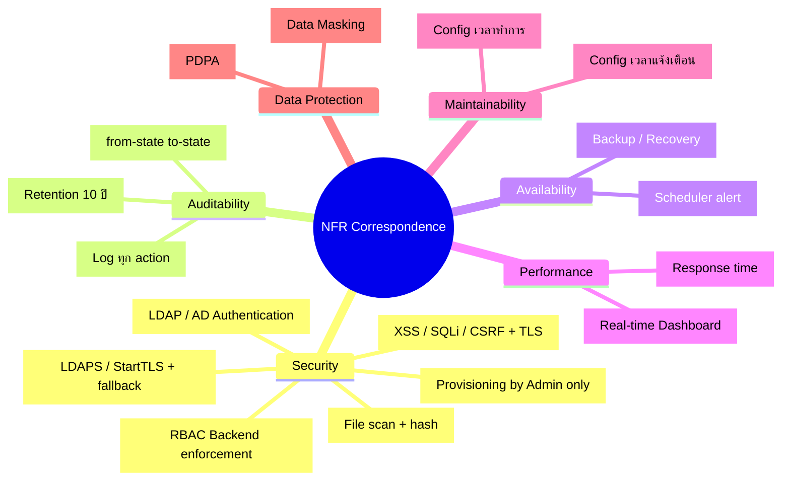
```mermaid
mindmap
  root((NFR Correspondence))
    Security
      ["LDAP / AD Authentication"]
      ["Provisioning by Admin only"]
      ["RBAC Backend enforcement"]
      ["XSS / SQLi / CSRF + TLS"]
      ["File scan + hash"]
      ["LDAPS / StartTLS + fallback"]
    Auditability
      ["Log ทุก action"]
      ["Retention 10 ปี"]
      ["from-state to-state"]
    Availability
      ["Backup / Recovery"]
      ["Scheduler alert"]
    Performance
      ["Real-time Dashboard"]
      ["Response time"]
    Maintainability
      ["Config เวลาแจ้งเตือน"]
      ["Config เวลาทำการ"]
    Data Protection
      ["PDPA"]
      ["Data Masking"]
```

---

## 14. PDPA Consideration

ระบบมีการจัดเก็บและประมวลผลข้อมูลส่วนบุคคลของผู้ใช้ภายใน (AD user) และอาจมีข้อมูลส่วนบุคคลของบุคคลภายนอกในเนื้อหาเอกสาร/ไฟล์แนบ ต้องใช้เท่าที่จำเป็นตามวัตถุประสงค์และควบคุมการเข้าถึงตามสิทธิ์

| ข้อมูลส่วนบุคคล | ไฟล์/หน้าจอที่เกี่ยวข้อง | วัตถุประสงค์ |
|---|---|---|
| ชื่อ-นามสกุล / AD user ผู้ Register/ผู้รับ/ผู้ถือครอง | Story Line, Audit Log, Dashboard | ระบุตัวผู้กระทำและผู้ถือครองเอกสาร (chain of custody) |
| ฝ่าย/ตำแหน่ง/หัวหน้าฝ่าย | Master Data, Assign, Dashboard | กำหนดการมอบหมายและการมองเห็น (RBAC) |
| เนื้อหาเอกสาร / ไฟล์แนบหลักฐาน | Attachment (เอกสารรับเข้า/ส่งออก) | จัดเก็บหลักฐานการรับ-ส่งเอกสาร |
| ข้อมูลปลายทางภายนอก (ชื่อ/ที่อยู่ผู้รับ) | Register เอกสารส่งออก, หลักฐานตอบรับ | นำส่งและยืนยันการรับเอกสารออก |
| อีเมล / ข้อมูลติดต่อ | Notification | ใช้ส่งแจ้งเตือนตามวัตถุประสงค์เท่านั้น |

ข้อพิจารณาเพิ่มเติม:
- ควบคุมการเข้าถึงข้อมูลตาม RBAC (Data Scope) ที่ Backend
- ไฟล์แนบที่อาจมีข้อมูลส่วนบุคคลของบุคคลภายนอก ต้องจำกัดการเข้าถึงตามสิทธิ์และมี Audit การเปิดดู/Export
- โครงการที่มีข้อมูลส่วนบุคคลควรผ่านความเห็นชอบจากคณะทำงาน DPO และควบคุมตาม PDPA + พ.ร.บ. คอมพิวเตอร์
- กำหนดนโยบายการเก็บรักษาไฟล์แนบ/ข้อมูลให้สอดคล้องกับ retention (Audit Log 10 ปี — ต้องยืนยัน retention ของไฟล์แนบแยก)

---

## 15. Risk Management Plan

| No. | Risk Description | Impact | Mitigation |
|---:|---|---|---|
| 1 | เอกสารฉบับจริงสูญหายระหว่างส่งต่อ (Forward) | ไม่ทราบผู้ถือครองล่าสุด งานสะดุด | Chain of Custody: Accept = ยืนยันถือครอง + Forward Log ทุกครั้ง (BR-6.1) |
| 2 | ผู้รับไม่กด Accept ทำให้ติดตามไม่ได้ | Progress ค้าง Pending นาน | Reminder Pending เกินกำหนด + ซ้ำ 1 ครั้ง + Follow up (BR-3.3/3.4) |
| 3 | คำนวณ Progress ผิดเมื่อมี Cancelled/Forward | รายงานสถานะคลาดเคลื่อน | สูตรตัด Cancelled + Forward ไม่เพิ่มตัวหาร + unit test (BR-2.5/6.1) |
| 4 | Assign ใหม่ก่อนรับเอกสารฉบับจริงคืน | เอกสารตัวจริงหาย/ซ้ำซ้อน | บังคับผ่าน Awaiting Physical Return + ยืนยันรับคืน (BR-2.2, VAL-09) |
| 5 | เอกสารส่งออก Delivered ไม่ถูกอัปเดต (manual) | ไม่ทราบว่าปลายทางรับจริง | Reminder Deadline การนำส่ง/แล้วเสร็จ + Follow up (ไม่มี reminder Delivered บังคับ) |
| 6 | Reminder ยิงนอกเวลาทำการ/ถี่เกินไป | รบกวนผู้ใช้ | ยึดเวลาทำการ 08:30 น. + เกณฑ์ configurable ต่อความเร่งด่วน (BR-3.2) |
| 7 | สิทธิ์การเห็นข้อมูลรั่ว (เห็นงานข้ามฝ่าย) | ละเมิด PDPA/ข้อมูลภายใน | RBAC enforcement ที่ Backend + Audit การเข้าถึง (NFR-02) |
| 8 | Admin แก้ Role ผิดพลาด (no approval) | สิทธิ์เกิน/ขาด | มีผลทันทีแต่บันทึก Audit Log ครบ + review เป็นระยะ (BR-5.1) |
| 9 | ไฟล์แนบมีข้อมูลส่วนบุคคล/ไฟล์อันตราย | ละเมิด PDPA / ความปลอดภัย | ตรวจชนิด/ขนาด + สแกนไฟล์ + จำกัดการเข้าถึง + Audit (NFR-04/12) |
| 10 | ข้อมูลผู้ใช้ที่ Provision แล้วไม่ตรงกับ LDAP (ชื่อ/ฝ่าย/บัญชีถูกปิดใน AD) | มอบหมาย/แจ้งเตือนผิดคน / บัญชีที่ควรปิดยังใช้ได้ | กำหนดรอบ refresh ข้อมูลผู้ใช้จาก LDAP + deactivate เมื่อบัญชีถูกปิดใน AD + ตรวจสอบก่อน go-live (NFR-14, BR-5.2) |
| 11 | LDAP/AD ไม่ตอบสนองตอน login/Provisioning | ผู้ใช้เข้าระบบไม่ได้ / เพิ่มผู้ใช้ไม่ได้ | timeout/retry + fallback + alert ทีม IT + ข้อความแจ้งผู้ใช้ชัดเจน (NFR-14) |
| 12 | ผู้ใช้ AD ที่ไม่ได้รับอนุญาตพยายามเข้าระบบ | เข้าถึงข้อมูลโดยไม่ได้รับสิทธิ์ | บังคับ Provision โดย Admin เท่านั้น + login ตรวจสถานะ Provision → 403 + Audit ความพยายามเข้าระบบ (BR-5.2) |

---

## 16. Open Issues / ประเด็นที่ต้องยืนยัน

> requirement ผ่านการ clarify มาแล้ว 24 ข้อ (ปิดครบในไฟล์ Flow 1.4.0) ประเด็นด้านล่างเป็นจุดเชิงเทคนิค/รายละเอียดการ implement ที่ควรยืนยันก่อนพัฒนา ไม่กระทบ business flow หลัก

| No. | ประเด็น | ผู้เกี่ยวข้อง |
|---:|---|---|
| 1 | Project code จริง (`P2026-040` เป็นค่าที่ BA เสนอ) และรหัสแบบฟอร์ม `F-BP-005` — ต้องยืนยันกับ PMO | PMO / BA |
| 2 | รูปแบบ Key Reference / เลขรับเอกสารรับเข้า (prefix, running, ปี พ.ศ./ค.ศ.) | BU / BA |
| 3 | เวลาทำการจริงและวันหยุด (default 08:30 น.) — ใช้ปฏิทินบริษัท/วันหยุดราชการหรือไม่ (แม้ Cycle Time ใช้ calendar time) | BU / IT |
| 4 | ชนิด/ขนาดไฟล์แนบที่อนุญาต + จำนวนไฟล์สูงสุดต่อเอกสาร | BU / IT |
| 5 | Retention ของไฟล์แนบและข้อมูลเอกสาร (Audit Log กำหนด 10 ปีแล้ว) | IT / Compliance / DPO |
| 6 | จุดเชื่อมต่อระบบออกเลขเอกสารเดิม (เอกสารส่งออก) — API/DB อ่านเลขเอกสารอย่างไร | IT / BA |
| 7 | นิยาม "ปลายทางถือครองล่าสุด" กรณีเอกสารฉบับจริงส่งต่อหลายชั้น — ระบุถึงระดับบุคคลเสมอหรือระดับฝ่ายได้ | BU / BA |
| 8 | เกณฑ์ default Pending เกินกำหนด (ตาราง 1.11.1) — ยืนยันค่าและสิทธิ์การ override รายฝ่าย | BU / BA |
| 9 | **[อัปเดต 1.1.0]** ยืนยันแล้ว: ผู้ใช้เข้าระบบได้เฉพาะที่ Admin Provision จาก LDAP เท่านั้น (ไม่ใช่ sync ทั้ง AD อัตโนมัติ) — คงเหลือประเด็น implement: รอบ/วิธี refresh ข้อมูลผู้ใช้ที่ Provision แล้ว (ชื่อ/ฝ่าย/สถานะ) จาก LDAP, การ deactivate อัตโนมัติเมื่อบัญชีถูกปิดใน AD, และ fallback เมื่อ LDAP ไม่ตอบสนองตอน login (NFR-14) | IT / BA |
| 10 | ต้องมี MFA/ระดับความปลอดภัยเพิ่มสำหรับ Admin/Viewer สูงสุดหรือไม่ | IT Security |
| 11 | ขอบเขต attribute ที่ดึงจาก LDAP ตอน Provisioning (ชื่อ/อีเมล/ฝ่าย/ตำแหน่ง) และ mapping ฝ่ายจาก LDAP → Master Data ฝ่ายในระบบ | IT / BA |
| 12 | การกำหนด Role เริ่มต้นตอน Provision (ระบุด้วยมือทุกครั้ง หรือมี default ตามฝ่าย) และการยืนยันตัวตนของ service account ที่ใช้เชื่อม LDAP | IT Security / BA |
| 13 | **[Notification]** รูปแบบวันที่ในข้อความแจ้งเตือน (พ.ศ./ค.ศ. + รูปแบบ `DD/MM/YYYY HH:mm`), ชื่อระบบ/ผู้ส่ง (sender email), และข้อความ prefix ความเร่งด่วน (`[ด่วนที่สุด]`/`[ด่วน]`) ที่ใช้จริง | BU / BA |
| 14 | **[Notification]** ต้องส่งแจ้งเตือน NT-08 (ยืนยันรับเอกสารจริงคืน), NT-09 (Completed), NT-14 (Sent), NT-17 (Provisioned) หรือไม่ และใครเป็นผู้รับเชิงแจ้งผลบ้าง (informational) — ยืนยันขอบเขต | BU / BA |
| 15 | **[Notification]** นโยบายรวมข้อความ (digest/de-duplication) เมื่อผู้รับมีงานหลายรายการในรอบเดียว และช่องทาง fallback เมื่อ Email ล้มเหลว | BU / IT |

---

## 17. แนวทางการทดสอบ (Test Strategy & Scenarios)

### 17.1 Traceability: BR → พื้นที่ทดสอบ

```mermaid
flowchart LR
    BR12["BR-1.2 Register/แนบ"] --> T1["TC Register + แนบ Optional/หลายไฟล์"]
    BR2["BR-2.x Assign/รับงาน"] --> T2["TC Accept/Reject/Forward/Recall/Progress"]
    BR3["BR-3.x Deadline/Noti"] --> T3["TC Reminder/Due Soon/Overdue/Follow up"]
    BR4["BR-4.x เอกสารส่งออก"] --> T4["TC Register ออก/แนบบังคับ/Delivered"]
    BR5["BR-5.1 RBAC"] --> T5["TC Role/Data Scope/Admin จัดการ Role"]
    BR52["BR-5.2 Provisioning/Login"] --> T5b["TC Provision จาก LDAP/Login ตรวจ Provision + Authenticate"]
    BR6["BR-6.x Custody/Noti/Audit"] --> T6["TC Chain of Custody/Task Inbox/Audit"]
```

### 17.2 Test Scenarios หลัก

**A. Happy Path — เอกสารรับเข้า End-to-End**
1. Register (ฉบับจริง) → Assign 1 ราย → Accept → ปิดงาน Success → Main = Completed, Progress 100%
2. Register → Assign Multiple (3 ฝ่าย) → ทุกฝ่าย Accept → ปิดครบ → Completed

**B. Progress & Multiple Select**
3. Assign 4 ราย → ปิด Success 2 ราย → Progress = 50% + Main = In Progress
4. Assign 4 ราย → 1 ราย Cancelled → ตัวหาร = 3 → ปิด Success 3 → Progress 100% (BR-2.5)
5. Assign 1 ราย (1:1) → ปิด Success → Completed

**C. Accept / Chain of Custody (เอกสารฉบับจริง)**
6. Forward ก่อน Accept → บล็อก (VAL-07 / BR-2.3)
7. Accept เอกสารฉบับจริง → บันทึกผู้ถือครองล่าสุด → Forward → ปลายทางถัดไปต้อง Accept → ผู้ถือครองเปลี่ยน (BR-6.1)
8. ตรวจ Story Line/Custody Log ระบุผู้ถือครองล่าสุดถูกต้องกรณีสูญหาย

**D. ปฏิเสธ & Awaiting Physical Return**
9. ปฏิเสธไม่ระบุหมายเหตุ → บล็อก (BR-2.2-E)
10. ทุกงานย่อยถูกปฏิเสธ + เอกสารฉบับจริง → Main = Awaiting Physical Return → Assign ใหม่ก่อนยืนยันรับคืน → บล็อก (VAL-09) → ยืนยันรับคืน → Registered → Assign ใหม่ได้
11. ทุกงานย่อยถูกปฏิเสธ + อีเมล → Main = Registered ทันที → Assign ใหม่ได้

**E. ดึงงานกลับ / ยกเลิก**
12. ต้นทางดึงงานที่ Pending กลับ → Recalled + noti ผู้ถูกดึง (BR-2.1)
13. ดึงงานที่ปิด Success แล้ว → บล็อก (BR-2.1-E)
14. ยกเลิกเอกสาร → Cancelled + ไม่นำมาคิด Progress

**F. Notification / Reminder / Follow up**
15. Due Soon ตามเกณฑ์ความเร่งด่วน (ปกติ 3 วัน/ด่วน 1 วัน/ด่วนมาก ครึ่งวัน) → ส่ง Reminder ณ 08:30 น. (BR-3.2)
16. Overdue + Assign เป็นฝ่าย → แจ้งหัวหน้าฝ่ายด้วย / Assign บุคคล → ไม่แจ้งหัวหน้า (BR-3.4)
17. Pending เกินกำหนด → เตือน + ซ้ำอีก 1 ครั้ง (BR-3.3)
18. กด Follow up → ส่งแจ้งเตือนย้ำ 3 ช่องทาง
18b. ตรวจ Subject/Body ทุก event ตาม Message Catalog (NT-01..17) → placeholder merge ถูกต้อง, ผู้รับตรงตาม BR-3.4 (Assign บุคคล vs ฝ่าย), Task Inbox แสดงเฉพาะ event actionable (BR-6.2-A)
19. ถึงกำหนดนอกเวลาทำการ → รอส่งต้นเวลาทำการถัดไป
19b. Accept/ปิดงาน/Recall/Cancel → Reminder ที่ค้างในคิวถูกยกเลิกทันที (หมวด 8.8)

**G. เอกสารส่งออก**
20. Register ออก → ไม่แนบไฟล์ → นำส่ง → บล็อก (BR-4.1/VAL-04)
21. แนบไฟล์ → Ready To Send → Sent → อัปเดต Delivered + หลักฐานตอบรับ → Completed
22. อัปเดต Delivered โดยไม่แนบหลักฐานตอบรับ → เตือน (VAL-11)
23. ตรวจว่าขั้น Delivered ไม่มี reminder บังคับ (BR-4.2)

**H. RBAC / Data Scope / User Provisioning**
24. ผู้ใช้ปกติเห็นเฉพาะงานตน / หัวหน้าเห็นทั้งฝ่าย / Viewer สูงสุดเห็นทั้งหมด (BR-5.1)
25. Admin สร้าง/แก้ Role → มีผลทันที + บันทึก Audit Log (no approval)
26. ผู้ไม่มีสิทธิ์จัดการ Role → 403 (VAL-12)
27. Admin ค้นหาผู้ใช้จาก LDAP → เลือก → ผูก Role/ฝ่าย → บันทึกสำเร็จ (201) + Audit ProvisionUser (BR-5.2)
28. Provisioning โดยไม่เลือกผู้ใช้/ไม่ผูก Role/ฝ่าย → บล็อก (VAL-14)
29. เพิ่มผู้ใช้ที่ถูก Provision ไว้แล้วซ้ำ → ปฏิเสธ 409 (BR-5.2-D)
30. ผู้ใช้ AD ที่ **ยังไม่ถูก Provision** login (credential ถูกต้อง) → ปฏิเสธ 403 (BR-5.2-A / VAL-13)
31. ผู้ใช้ที่ถูก Provision แล้วแต่ Admin ปิดการใช้งาน (Inactive) login → ปฏิเสธ 403 (BR-5.2-B)
32. Login ด้วย credential ผิด → ปฏิเสธ 401 (BR-5.2-C)
33. ผู้ใช้ Active login สำเร็จ → โหลด Role/ฝ่าย/Data Scope ถูกต้อง + Audit Login

**I. Dashboard / Task Inbox / Reporting**
34. Dropdown เลือกประเภทเอกสาร (รับเข้า/ส่งออก) แสดงข้อมูลถูกต้อง
35. Story Line แสดง duration ต่อ stage + ระบุผู้ถือครองนานสุด (Bottleneck)
36. Task Inbox แบ่งกลุ่มถูกต้อง + งานย้ายออกกลุ่มเมื่อเปลี่ยนสถานะ + mark as read/done
37. RPT-01..06 + Export Excel/CSV + บันทึก Audit การ export / Cycle Time ใช้ calendar time

**J. Negative / Boundary**
38. ทุก Validation (VAL-01..14) พร้อมข้อความและ HTTP status ที่ระบุ
39. Deadline เป็นวันในอดีต → บล็อก (VAL-10)
40. Register แนบไฟล์เกินขนาด/ผิดชนิด → เตือน (VAL-03)

**K. Non-Functional (ตรวจแยก)**
41. Audit Log ครบทุก action (รวม ProvisionUser/Login) + retention 10 ปี / RBAC enforce ที่ Backend / LDAPS + TLS / File scan

**L. Device Camera Capture & Image Flip/Rotation (การถ่ายภาพผ่านกล้องและการกลับภาพ)**
42. คลิก "ถ่ายภาพด้วยกล้องของอุปกรณ์" → Browser ขอสิทธิ์ (Permission) → อนุญาต → แสดงภาพสดจากกล้อง WebRTC พร้อมกรอบเล็ง Viewfinder สีทอง `#FFCD00` (BR-1.2-A)
43. สลับกล้องหน้า (Front Camera) → ระบบเปิดโหมดกลับภาพ (Mirror) ให้อัตโนมัติ หรือกดปุ่ม "กลับภาพ" → ภาพสดและตัวหนังสือบนเอกสารไม่กลับด้าน
44. กดปุ่มชัตเตอร์ → มี Flash Effect สีขาว → ภาพที่บันทึกถูกกลับด้านตามโหมดที่เลือกจริง
45. ในหน้าพรีวิวภาพถ่าย → กดปุ่ม "กลับภาพ" (Flip) เพื่อสลับซ้าย-ขวาอีกครั้ง หรือกด "หมุน 90°" (Rotate) → ภาพหมุนตามเข็มนาฬิกา
46. กดยืนยันใช้ภาพถ่าย → เพิ่มเข้ารายการเอกสารแนบ (ชนิด Camera Photo) พร้อมแสดง Thumbnail และเปิดดู Lightbox ได้
47. เอกสารส่งออก: ใช้กล้องถ่ายภาพหลักฐานการตอบรับ/ใบเซ็นรับ (Delivered Proof) ในหน้าต่าง Delivered → แนบสำเร็จและบันทึกสถานะได้ (BR-4.1-A)
48. ปฏิเสธสิทธิ์การใช้กล้องหรือไม่รองรับ WebRTC → ระบบแจ้งเตือนตาม VAL-15 และอนุญาตให้เลือกรูปภาพจากคลังรูปหรือถ่ายผ่าน Native Camera

**M. การแนบไฟล์โดยตรงและจัดการไฟล์แนบในหน้าจอ Document Detail (Direct File Upload & Attachment Management)**
49. หน้าจอ Document Detail: คลิกปุ่ม "แนบไฟล์เพิ่ม" → Native File Dialog เปิดขึ้น → เลือกไฟล์ PDF/DOCX/XLSX/รูปภาพ (ขนาด ≤ 25 MB) → แนบสำเร็จ แสดงในรายการไฟล์แนบเพิ่มเติม (Extra Attachments) พร้อมไอคอนเฉพาะประเภทและ Badge "ไฟล์แนบเพิ่ม" (BR-1.2-B)
50. ลากไฟล์จากเครื่องมาวางในพื้นที่ Dropzone บนการ์ดไฟล์แนบ → มีแถบไฮไลต์ Drag over → ปล่อยไฟล์ (Drop) → ระบบอ่านไฟล์และแนบเข้ารายการสำเร็จ
51. คลิกปุ่ม "ดาวน์โหลด" บนไฟล์แนบหลัก (Initial) หรือไฟล์แนบเพิ่มเติม → ดาวน์โหลดไฟล์ลงเครื่องสำเร็จ
52. คลิกปุ่ม "ดูรูป" หรือคลิกภาพ Thumbnail ของรูปภาพ / ภาพถ่ายจากกล้อง → เปิด Lightbox Modal พรีวิวภาพความละเอียดสูง พร้อมปุ่มดาวน์โหลด
53. คลิกปุ่ม "ลบ" (Trash) บนไฟล์แนบที่เพิ่มใหม่ → มีการลบรายการออกจากเอกสารสำเร็จ (ไฟล์แนบหลักของเอกสารไม่สามารถลบได้)
54. ใน Modal ยืนยันปลายทางรับ (Delivered): กดปุ่ม "แนบไฟล์สลิป / เอกสาร" → เลือกไฟล์หลักฐานจากเครื่อง → แนบสำเร็จและติ๊กเลือก "แนบหลักฐานตอบรับแล้ว" ให้อัตโนมัติ (BR-4.1-B / VAL-11)

**N. การขอสร้างเลขที่เอกสารส่งออกและการซิงค์ข้อมูล 2 ทาง (Outgoing Document Numbering & Bi-directional EDR Sync)**
55. **ขอเลขธรรมดา (Flow A) ผ่านระบบสารบรรณ:** ผู้ใช้เปิดฟอร์มขอเลขธรรมดา → กรอกหน่วยงานทั่วไป, เรื่อง, ผู้รับ 1 คน, ผู้ลงนาม 1 คน → กดส่งคำขอ → ระบบยิง API ไป EDR → ได้รับเลขคู่ขนาน (`พ001สอ/2569` และ `S001CC/2026`) ทันที → สถานะเป็น `Registered` และพาไปหน้าแนบไฟล์หลักฐาน (BR-1.3-A)
56. **ขอเลขพิเศษ (Flow B) ผ่านระบบสารบรรณ:** ผู้ใช้เปิดฟอร์มขอเลขพิเศษ → เลือกหน่วยงานพิเศษ → กดส่งคำขอ → EDR ยิง Email Noti หาผู้อนุมัติ → สารบรรณแสดงสถานะ `Pending (รออนุมัติเลข)` (BR-1.3-A)
57. **ขอเลขธรรมดาเลือกหน่วยงาน "อื่นๆ":** เลือกตัวเลือก "อื่นๆ" → ช่อง Free-text ปรากฏขึ้น → ไม่กรอกชื่อหน่วยงาน → กดส่ง → ระบบบล็อกแจ้งเตือนตาม VAL-18
58. **การตรวจสอบผู้รับและผู้ลงนาม:** ไม่ระบุผู้รับ (`DocumentRecipient` = 0) หรือไม่ระบุผู้ลงนาม (`DocumentSigner` = 0) → ระบบบล็อกแจ้งเตือนตาม VAL-16 / VAL-17
59. **Reverse Inbound Sync จาก EDR เดิม (Flow A):** ผู้ใช้ขอเลขในเว็บ EDR เดิม → EDR ออกเลขสำเร็จ → EDR ยิง Webhook มาที่สารบรรณ (`POST /api/v1/integration/edr/sync-document`) → สารบรรณสร้าง Record เอกสารส่งออกอัตโนมัติ พร้อมแจ้งเตือนผู้ขอให้เข้าแนบไฟล์ (BR-1.3-B)
60. **Reverse Inbound Sync จาก EDR เดิม (Flow B เมื่อ Approve):** ผู้อนุมัติกด Approve ใน EDR → EDR ยิง Webhook ส่งเลขที่ออกสำเร็จมายังสารบรรณ → สารบรรณเปลี่ยนสถานะจาก Pending เป็น `Registered` และแจ้งเตือนผู้ขอ
61. **Data Parity & Idempotent Check:** EDR ยิง Sync ซ้ำด้วย Request ID เดียวกัน → ระบบสารบรรณทำการ Update ข้อมูลเดิม ไม่สร้าง Record ซ้ำซ้อน (BR-1.3-C)
62. **Dual Language Search:** ค้นหาเอกสารส่งออกในสารบรรณด้วยเลขไทย (`พ001สอ/2569`) หรือเลขอังกฤษ (`S001CC/2026`) → แสดงผลลัพธ์เอกสารฉบับเดียวกันถูกต้อง (BR-1.3-D)

**O. การควบคุมการเข้าถึงไฟล์ตามระดับชั้นความลับ และการยืนยันตัวตนด้วย OTP (Confidentiality & OTP Verification)**
63. **เอกสารชั้นความลับปกติ (Normal):** ผู้ใช้ที่มีสิทธิ์เข้าถึงเอกสาร สามารถเห็นรายชื่อไฟล์แนบ, ภาพถ่าย, พรีวิว และดาวน์โหลดไฟล์ได้ทันทีโดยไม่ต้องกรอก OTP (BR-1.4-A)
64. **เอกสารลับมาก (Top Secret) — มุมมองผู้ไม่ได้รับมอบหมาย:** ผู้ใช้ที่ไม่ได้ถูก Assign ใน Story Line (รวมถึง Viewer สูงสุด และ Admin) เข้าดูหน้า Document Detail $\rightarrow$ ระบบซ่อนชื่อไฟล์, ซ่อนขนาด, ซ่อนปุ่มดาวน์โหลด และแสดงกล่องแจ้งเตือนความปลอดภัย Restricted Access (BR-1.4-B / VAL-22)
65. **เอกสารลับมาก (Top Secret) — มุมมองผู้ได้รับมอบหมาย (ยังไม่ยืนยัน OTP):** ผู้ใช้ที่ถูก Assign เข้าดูหน้า Document Detail $\rightarrow$ การ์ดไฟล์แนบแสดงสถานะล็อก พร้อมแสดงปุ่มเด่น "ยืนยันตัวตนด้วยรหัส OTP เพื่อดูไฟล์แนบ"
66. **การขอรหัส OTP (Request OTP):** ผู้ได้รับมอบหมายคลิกปุ่มขอ OTP $\rightarrow$ ระบบส่ง OTP 6 หลักไปยัง**อีเมลของผู้ใช้เท่านั้น (Email only)** พร้อมเปิด Modal นับเวลาถอยหลัง 3:00 นาที และบันทึก Audit: `RequestOTP` (channel=email) (BR-1.4-C)
67. **การกรอกรหัส OTP ไม่ถูกต้อง / หมดอายุ:** ผู้ใช้กรอก OTP ผิด หรือกรอกเมื่อเวลาหมด $\rightarrow$ ระบบแจ้งเตือนตาม VAL-20 และไม่ออก Token ปลดล็อกไฟล์
68. **การกรอก OTP ผิดเกิน 3 ครั้ง (Brute-force Protection):** กรอกรหัสผิดติดต่อกัน 3 ครั้ง $\rightarrow$ ระบบระงับการขอ OTP ชั่วคราว 15 นาที ตาม VAL-21 และบันทึก Audit Security Alert
69. **การยืนยัน OTP สำเร็จและการปลดล็อกไฟล์ (Success & Temporary Access):** ผู้ใช้กรอก OTP ถูกต้อง $\rightarrow$ Modal ปิดลง, การ์ดไฟล์แนบปลดล็อกแสดงรายการไฟล์ทั้งหมด พร้อม Badge สีเขียว "ยืนยันตัวตนแล้ว (เข้าถึงได้ 15 นาที)" และบันทึก Audit: `VerifyOTP_Success`
70. **Dynamic Watermark & Session Timeout:** ผู้ใช้คลิกดูรูปภาพ/พรีวิวไฟล์ลับมาก $\rightarrow$ Lightbox พรีวิวประทับลายน้ำโปร่งใส `[ชื่อ-นามสกุล] [วันเวลา] [IP]` (BR-1.4-D) และเมื่อเวลาผ่านไปครบ 15 นาที ระบบล็อกไฟล์แนบกลับอัตโนมัติ (BR-1.4-E)

**P. Monitor (ผู้เฝ้าติดตามที่ Config ได้ — Configurable Watcher)**
71. **ตั้งค่า Monitor ระดับฝ่าย:** Admin กำหนดผู้ใช้ A เป็น Monitor `scope_type=department, scope_ref=ฝ่าย X` → ผู้ใช้ A เห็นงานรับเข้า/ส่งออกทั้งหมดของฝ่าย X บน Dashboard ทั้งที่ไม่ใช่ผู้รับงาน/หัวหน้าฝ่าย (BR-5.3)
72. **Monitor รับแจ้งเตือนงานค้าง:** งานในฝ่าย X เข้า Overdue → ผู้ใช้ A (Monitor) ได้รับ Reminder (NT-11) เพิ่มเติมจากผู้รับงาน+หัวหน้าฝ่าย (BR-3.4-A)
73. **Monitor กด Follow up ได้:** ผู้ใช้ A กด Follow up งานค้างใน Scope → ส่งแจ้งเตือนย้ำถึงผู้รับงาน (NT-13) สำเร็จ
74. **Monitor ทำ action ต้องห้ามไม่ได้:** ผู้ใช้ A พยายามกด Accept/Reject/Forward/ปิดงาน → ปุ่มไม่ปรากฏ/ถูกบล็อก (สิทธิ์ดูและติดตามเท่านั้น)
75. **Monitor Scope รายบุคคล/สายงาน:** ตั้งค่า `scope_type=user` หรือ `workgroup` → Monitor เห็นเฉพาะงานของบุคคล/กลุ่มงานที่กำหนด ไม่เห็นงานนอก Scope
76. **Monitor กับไฟล์ลับมาก:** เอกสารลับมากในฝ่าย X → Monitor เห็นสถานะ/ความคืบหน้าได้ แต่เปิดไฟล์แนบไม่ได้ (ไม่ใช่ Assignee) ตาม BR-5.3-A / BR-1.4-B
77. **หัวหน้าฝ่ายตั้ง Monitor ข้ามฝ่าย:** หัวหน้าฝ่าย X ตั้ง Monitor ให้ Scope ฝ่าย Y → บล็อก 403 (VAL-24 / BR-5.3-C)
78. **ตั้งค่า Monitor ไม่ครบ:** ไม่เลือกผู้ใช้/ไม่เลือก Scope → บล็อก (VAL-23) + ทุกการตั้งค่าบันทึก Audit

**Q. Master-Driven Data Entry (ข้อมูลจาก Master ลดข้อผิดพลาด)**
79. **ฟิลด์ผูก Master เป็น Dropdown/Lookup:** ฝ่าย, กลุ่มงาน, ผู้รับ/ผู้ลงนาม, หน่วยงานภายนอก, ประเภท/ช่องทาง/ความเร่งด่วน/ชั้นความลับ ต้องเลือกจากรายการ ไม่มีช่องพิมพ์อิสระ (BR-1.5)
80. **Backend ปฏิเสธค่านอก Master:** ยิง request ที่มี reference ID/label ที่ไม่มีใน Master → ระบบปฏิเสธ 400 (VAL-25)
81. **เก็บเป็น reference ID:** บันทึกเอกสารแล้วตรวจฐานข้อมูล → ฟิลด์ Master เก็บเป็น ID ผูก FK ไม่ใช่ข้อความ label (NFR-18)
82. **Master ถูกปิดใช้งาน:** ปิด (is_active=false) ฝ่าย/หน่วยงานหนึ่ง → เลือกใหม่ไม่ได้ แต่เอกสารเดิมที่อ้างอิงไว้ยังแสดงค่าเดิมถูกต้อง (soft reference — NFR-18)
83. **หน่วยงานภายนอก "อื่นๆ":** เลือก "อื่นๆ" โดยไม่กรอกชื่อ → บล็อก (VAL-26); กรอกชื่อ → บันทึกเป็น custom text พร้อมแนะนำให้ Admin เพิ่มเข้า Master

---

## 18. Appendix

### 18.1 Appendix A: Suggested Error Codes

| Error Code | Description | Step |
|---|---|---|
| ERR-CR-001 | ไม่เลือกประเภทเอกสาร | Register |
| ERR-CR-002 | ไม่เลือกผู้รับตอน Assign | Assign |
| ERR-CR-003 | Forward/ปิดงานก่อน Accept | รับงาน |
| ERR-CR-004 | ปฏิเสธโดยไม่ระบุหมายเหตุ | รับงาน |
| ERR-CR-005 | Assign ใหม่ก่อนยืนยันรับเอกสารจริงคืน | Awaiting Physical Return |
| ERR-CR-006 | ดึงงาน/ยกเลิกงานที่ปิดแล้ว | Recall/Cancel |
| ERR-CR-007 | เอกสารส่งออกนำส่งโดยไม่แนบไฟล์ | Attach |
| ERR-CR-008 | Deadline เป็นวันในอดีต | Register/Assign |
| ERR-CR-009 | ไฟล์แนบผิดชนิด/เกินขนาด | Attach |
| ERR-CR-010 | ไม่มีสิทธิ์จัดการ Role/ข้อมูล | RBAC |
| ERR-CR-011 | บัญชียังไม่ถูก Provision / ถูกปิดการใช้งาน (403) | Login |
| ERR-CR-012 | ชื่อผู้ใช้หรือรหัสผ่านไม่ถูกต้อง (401) | Login |
| ERR-CR-013 | Provisioning ไม่เลือกผู้ใช้/ไม่ผูก Role/ฝ่าย | User Provisioning |
| ERR-CR-014 | เพิ่มผู้ใช้ที่อยู่ในระบบแล้วซ้ำ (409) | User Provisioning |
| ERR-CR-015 | ไม่สามารถเข้าถึงกล้องถ่ายภาพของอุปกรณ์ได้ | Camera Capture |
| ERR-CR-016 | รหัส OTP ไม่ถูกต้องหรือหมดอายุ (400) | OTP Verification |
| ERR-CR-017 | กรอก OTP ผิดเกินจำนวนครั้งที่กำหนด ระงับชั่วคราว 15 นาที (429) | OTP Verification |
| ERR-CR-018 | ไม่มีสิทธิ์เข้าถึงไฟล์แนบเอกสารชั้นความลับลับมาก (403) | Attachment Access |

### 18.2 Appendix B: Audit Log Data Dictionary

| Field | Description |
|---|---|
| log_id | Primary Key ของ Log |
| doc_ref | Key Reference / เลขเอกสารที่เกี่ยวข้อง |
| actor_ref | ผู้ดำเนินการ (AD user) |
| action | ประเภทการกระทำ (Register / Assign / Accept / Reject / Forward / Recall / Cancel / ConfirmReturn / Deliver / Complete / ConfigChange / Export / CameraCapture / DirectFileUpload / DeleteAttachment / RequestOTP / VerifyOTP_Success / VerifyOTP_Failed / ViewSecretFile / DownloadSecretFile) |
| from_state | สถานะก่อนเปลี่ยน |
| to_state | สถานะหลังเปลี่ยน |
| action_time | วันเวลาที่เกิดเหตุการณ์ |
| holder_ref | ผู้ถือครองล่าสุด (กรณีเอกสารฉบับจริง) |
| note | หมายเหตุ (เช่น เหตุผลปฏิเสธ/ยกเลิก/ชื่อไฟล์แนบ/ช่องทาง OTP) |
| ip_address | IP ของผู้ดำเนินการ |

> retention: 10 ปี (BR-6.3 / NFR-06)

### 18.3 Appendix C: สรุปสถานะ (Status Dictionary) — Quick Reference

| กลุ่ม | สถานะ |
|---|---|
| เอกสารรับเข้า — Main | Registered · Pending Acceptance · In Progress · Awaiting Physical Return · Completed · Cancelled |
| เอกสารรับเข้า — Sub (Assignment) | Pending Acceptance · Accepted · Rejected · Recalled · Forwarded · Success · Cancelled |
| เอกสารส่งออก | Registered · Attached · Ready To Send · Sent · Delivered · Completed · Cancelled |
| Deadline Flag (ทั้งเอกสารรับเข้าและส่งออก) | On Track · Due Soon · Overdue · Cleared |
| ระดับชั้นความลับ (Confidentiality) | ปกติ (Normal) · ลับ (Confidential) · ลับมาก (Top Secret) |

### 18.4 Appendix D: มาตรฐานการออกแบบและธีม Deves (Deves Theme Specification)

ระบบใช้มาตรฐานการออกแบบ **ธีม Deves (บมจ. เทเวศประกันภัย / ระบบ EDNS)** ดังนี้:

#### 1) Design Tokens (ค่าสีหลัก)
- **Primary Navy**: `#012169` (Dark `#001a52`) — ใช้สำหรับ Sidebar, หัวตาราง, ปุ่มหลัก, Breadcrumb Active, Avatar
- **Secondary Gold**: `#FFCD00` (Dark `#e6b800`) — ใช้สำหรับ กล่องโลโก้ DVS, เมนู Active บน Sidebar, กราฟส่งออก, Viewfinder กล้อง
- **Neutral Background**: Page BG `#F8F9FA`, Card BG `#FFFFFF`, Border `#DEE2E6`, Text `#212529`, Text Muted `#6C757D`
- **Functional**: Success `#28A745`, Danger `#DC3545`, Warning `#FD7E14`, Info `#17A2B8`

#### 2) Status & Confidentiality Badges Table
| Badge / สถานะ | Background | Text | การใช้งาน |
|---|---|---|---|
| `badge-pending` (รอรับงาน / รออนุมัติ) | `#FFF3CD` | `#856404` | Pending Acceptance |
| `badge-approved` (เสร็จสิ้น / ปลายทางรับแล้ว) | `#D4EDDA` | `#155724` | Delivered / Completed / Success |
| `badge-rejected` (ยกเลิก / ปฏิเสธ) | `#F8D7DA` | `#721C24` | Cancelled / Rejected |
| `badge-draft` (ลงทะเบียนแล้ว / ฉบับร่าง) | `#E2E3E5` | `#383D41` | Registered / Ready to Send |
| `badge-returned` (รอรับคืน / ตีกลับ) | `#FFE5D0` | `#7C3A00` | Awaiting Physical Return |
| `badge-normal` (กำลังดำเนินการ / นำส่งแล้ว) | `#D1ECF1` | `#0C5460` | In Progress / Sent |
| `badge-urgent` (ด่วนมาก) | `#DC3545` | `#FFFFFF` (Pulse) | Very Urgent |
| `conf-normal` (ปกติ) | `#E2E3E5` | `#383D41` | ชั้นความลับปกติ |
| `conf-confidential` (ลับ) | `#FFE5D0` | `#D9534F` | ชั้นความลับ: ลับ |
| `conf-top-secret` (ลับมาก) | `#DC3545` | `#FFFFFF` (Shield) | ชั้นความลับ: ลับมาก (บังคับ OTP) |

#### 3) Layout & Component Specs
- **Sidebar**: กว้าง 260px พื้นหลัง `#012169`, กล่องโลโก้ 40×40px `rounded-[8px]` สี `#FFCD00` ตัวอักษรสี `#012169` "DVS", เมนู Active พื้น `#FFCD00` ตัวหนังสือ `#012169` ตัวหนา
- **TopBar**: Breadcrumb คั่นด้วย `>` (Active เป็น `#012169` ตัวหนา, ก่อนหน้า `#6C757D`), Avatar วงกลมสีกรมท่า `#012169`
- **SummaryCard**: `border-left: 4px solid [color]`, ตัวเลขขนาดใหญ่ฟอนต์ Mono, ไอคอนในกรอบสีกลมกลืน
- **CameraCaptureModal**: หน้าต่างถ่ายภาพเอกสารแบบ Realtime (WebRTC) + กรอบเล็ง Viewfinder สีทอง `#FFCD00` + ปุ่มชัตเตอร์ Flash + ปุ่มกลับภาพซ้าย-ขวา (Horizontal Flip/Mirror) + ปุ่มหมุนภาพ 90° (Rotate) + Lightbox พรีวิว
- **AttachmentsCard**: การ์ดแสดงไฟล์แนบและภาพถ่าย พร้อมระบบตรวจสอบชั้นความลับ:
  - หากเป็นเอกสาร **ลับมาก** และผู้ใช้ไม่ใช่ Assignee: แสดง Restricted Access Box สีเทา/แดง ล็อกการแสดงผล
  - หากเป็น Assignee (ยังไม่ยืนยัน OTP): แสดงกล่องแจ้งเตือนความปลอดภัยพร้อมปุ่มเด่น `[ 🛡️ ยืนยันตัวตนด้วยรหัส OTP เพื่อดูไฟล์แนบ ]`
  - หลังยืนยัน OTP: ปลดล็อกแสดงรายการไฟล์แนบ, ปุ่มพรีวิว (พร้อม Dynamic Watermark), ปุ่มดาวน์โหลด และ Badge ยืนยันตัวตนสีเขียว
- **OtpVerificationModal**: หน้าต่างยืนยันตัวตนด้วย OTP 6 หลัก ประกอบด้วย:
  - รหัสอ้างอิง (OTP Reference เช่น `REF-9821`)
  - ข้อความระบุช่องทางส่ง: "ระบบได้ส่งรหัส OTP ไปยัง**อีเมล** ของท่าน (`t****@deves.co.th`) แล้ว" — **ส่งทางอีเมลเท่านั้น ไม่มีช่องทาง SMS**
  - ช่องกรอก OTP 6 ช่อง พร้อมระบบ Auto-focus และ Auto-submit เมื่อครบ 6 หลัก
  - ตัวนับเวลาถอยหลัง (Countdown 3:00 นาที)
  - ปุ่มส่งรหัสใหม่อีกครั้ง (Resend OTP) เมื่อเวลาหมด
  - ปุ่มจำลอง Quick Fill (สำหรับทดสอบในโหมด Demo)
- **DeliverEvidenceModal**: หน้าต่างยืนยันปลายทางรับเอกสารส่งออก (Delivered) พร้อม Checkbox ยืนยัน, ปุ่มอัปโหลดไฟล์หลักฐานสลิป/เอกสาร และปุ่มถ่ายภาพใบเซ็นรับด้วยกล้อง พร้อมรายการแสดงไฟล์หลักฐานที่แนบแล้ว
- **OutgoingNumberRequestModal**: หน้าต่าง/ฟอร์มสร้างคำขอออกเลขที่เอกสารส่งออก (Seamless EDR Integration) ประกอบด้วย Tab สลับประเภทคำขอ (ขอเลขธรรมดา Badge ฟ้า / ขอเลขพิเศษ Badge ชมพู), Layout 2 คอลัมน์ (คอลัมน์ซ้าย: ข้อมูลที่ต้องกรอก ประกอบด้วย หน่วยงาน, ช่อง Free-text กรณีเลือกอื่นๆ, ชื่อเรื่อง, หมายเหตุ, รายการเอกสาร +ปุ่มสีทองเพิ่มรายการ, ผู้รับเอกสาร +ปุ่มสีทองเพิ่มผู้รับบังคับ $\ge 1$, ผู้ลงนาม +ปุ่มสีทองเพิ่มผู้ลงนามบังคับ $\ge 1$; คอลัมน์ขวา: ข้อมูลอัตโนมัติ แสดง ผู้สร้าง, ฝ่าย, วันที่, ประเภท), ปุ่มยกเลิก และปุ่มส่งคำขอสีกรมท่า `#012169` ไอคอนเครื่องบินกระดาษ

### 18.5 Appendix E: สเปก API เชื่อมต่อกับระบบ EDR (EDR Integration API Specifications)

เพื่อรองรับการทำงานร่วมกันอย่างสมบูรณ์แบบ (Bi-directional Interoperability) ระหว่างระบบสารบรรณ (P2026-040) และระบบออกเลข EDR (Request 56160) ระบบมีการเชื่อมต่อผ่าน 5 Endpoints หลัก:

#### 1) `GET /api/v1/document-requests/context` (Pre-flight Context & Master Data Check)
- **ผู้เรียก (Caller):** ระบบสารบรรณ $\rightarrow$ **ผู้ให้บริการ (Provider):** EDR Service
- **จุดประสงค์:** เรียกทันทีเมื่อผู้ใช้กดปุ่มเปิดฟอร์มสร้างคำขอเลข เพื่อตรวจสอบตัวตนกับ LDAP, ตรวจสอบตัวย่อฝ่าย 2 ภาษา (`DeptCodeTH`/`DeptCodeEN`), และดึง Master Data หน่วยงานแบบ Real-time
- **Request Headers:**
  - `Authorization: Bearer <user_jwt_token>`
  - `X-Requester-Username: <ad_samaccountname>`
- **Response Structure (200 OK — กรณีฝ่ายถูกต้อง):**
  ```json
  {
    "can_request_number": true,
    "requester": {
      "username": "teerapat.ti",
      "full_name_th": "นายธีรภัทร์ เที่ยงกุล",
      "full_name_en": "Mr. Teerapat Tiangkool",
      "email": "teerapat.ti@deves.co.th",
      "department_id": 104,
      "department_name_th": "ฝ่ายพัฒนากระบวนการทางธุรกิจ",
      "department_name_en": "Business Process Development",
      "dept_code_th": "บท",
      "dept_code_en": "BP",
      "is_dept_code_configured": true
    },
    "master_data": {
      "current_year_th": 2569,
      "current_year_en": 2026,
      "special_organizations": [
        { "id": 1, "name": "สำนักงาน คปภ.", "prefix_th": "พ", "prefix_en": "S" },
        { "id": 2, "name": "สมาคมประกันวินาศภัยไทย", "prefix_th": "พ", "prefix_en": "S" }
      ],
      "general_organizations": [
        { "id": 10, "name": "กรมพัฒนาธุรกิจการค้า", "prefix_th": "ท", "prefix_en": "G" },
        { "id": 11, "name": "บริษัท ไทยรับประกันภัยต่อ จำกัด (มหาชน)", "prefix_th": "ท", "prefix_en": "G" },
        { "id": 99, "name": "อื่นๆ", "allow_custom_text": true }
      ]
    },
    "validation_error": null
  }
  ```
- **Response Structure (200 OK — กรณีฝ่ายยังไม่มีตัวย่อในระบบ):**
  ```json
  {
    "can_request_number": false,
    "requester": {
      "username": "somchai.ja",
      "full_name_th": "นายสมชาย ใจดี",
      "department_name_th": "ฝ่ายการตลาดพิเศษ",
      "is_dept_code_configured": false
    },
    "validation_error": "ฝ่ายของท่าน (ฝ่ายการตลาดพิเศษ) ยังไม่ได้รับการกำหนดตัวย่อฝ่ายในระบบ EDR กรุณาติดต่อผู้ดูแลระบบเพื่อกำหนดตัวย่อฝ่ายก่อนออกเลข (VAL-19)"
  }
  ```

#### 2) `POST /api/v1/document-requests` (ยิงสร้างคำขอออกเลขจากระบบสารบรรณ)
- **ผู้เรียก:** ระบบสารบรรณ $\rightarrow$ **ผู้ให้บริการ:** EDR Service
- **Request Body:** `{ "org_type": "general", "organization_id": 10, "custom_org_name": null, "subject": "...", "remark": "...", "items": [...], "recipients": [...], "signers": [...], "requester_username": "teerapat.ti" }`
- **Response (Flow A — 200 OK):** `{ "status": "Approved", "edr_request_id": 561601, "document_number_th": "ท001บท/2569", "document_number_en": "G001BP/2026", "running_no": 1, "year_th": 2569, "approved_date": "2026-08-21T14:20:00Z", "approved_by": "SYSTEM" }`
- **Response (Flow B — 200 OK):** `{ "status": "Pending", "edr_request_id": 561602, "document_number_th": null, "document_number_en": null, "message": "คำขออยู่ระหว่างรอการอนุมัติจากผู้มีอำนาจ ระบบได้ส่ง Email แจ้งเตือนเรียบร้อยแล้ว" }`

#### 3) `POST /api/v1/integration/edr/sync-document` (Reverse Webhook Push จาก EDR $\rightarrow$ สารบรรณ)
- **ผู้เรียก:** EDR Engine $\rightarrow$ **ผู้รับ:** ระบบสารบรรณ
- **Trigger:** เมื่อผู้ใช้ขอเลขบนเว็บ EDR เดิม หรือมีการแก้ไข/อนุมัติเลขใน EDR
- **Behavior:** สารบรรณทำ **Idempotent Upsert** โดยใช้ `edr_request_id` หรือ `document_number_th` เป็น Key หากเป็นรายการใหม่ จะสร้าง Record เอกสารส่งออกและส่ง Notification แจ้งผู้ขอให้เข้าแนบไฟล์

#### 4) `POST /api/v1/integration/edr/approval-callback` (Callback แจ้งผลผู้อนุมัติ)
- **Payload:** `{ "edr_request_id": 561602, "action": "Approved" | "Rejected", "document_number_th": "พ001บท/2569", "document_number_en": "S001BP/2026", "approver": "somchai.ap", "reject_reason": null }`

#### 5) `GET /api/v1/integration/edr/reconciliation` (Midnight Daily Reconciliation Job)
- **Trigger:** Cron Job ทุกเที่ยงคืน (00:00 น.) ตรวจเทียบ Transaction IDs 2 ฝั่งเพื่อ Re-sync อัตโนมัติ รับประกัน Data Parity 100%

### 18.6 Appendix F: Master Data Catalog & Controlled-Input Matrix (ลดข้อผิดพลาดของข้อมูล)

ตารางสรุปว่าฟิลด์ใดต้อง **เลือกจาก Master/รายการควบคุม** (เก็บเป็น reference ID) และฟิลด์ใดอนุญาต Free-text (BR-1.5 / NFR-18) เพื่อลดข้อผิดพลาดจากการพิมพ์อิสระ:

| ฟิลด์ / Input | ชนิด Input | แหล่ง Master | หมายเหตุ |
|---|---|---|---|
| ฝ่าย/หน่วยงานภายใน | Dropdown/Lookup (ID) | `DEPARTMENT` (Master + LDAP mapping) | ผูก FK ทุกที่ที่อ้างฝ่าย |
| กลุ่มงาน/สายงาน | Dropdown (ID) | `WORKGROUP` | ใช้กับ Assign/Monitor scope |
| ผู้ใช้ / ผู้รับ / ผู้ลงนาม / ผู้ถือครอง | Autocomplete (ID) | `USER` (เฉพาะที่ Provision) | เลือกจากรายชื่อ ไม่พิมพ์ชื่อเอง |
| หัวหน้าฝ่าย/ผู้กำกับดูแล | Lookup (ID) | `DEPARTMENT.head_user_ref` | ตั้งใน Master |
| ผู้เฝ้าติดตาม (Monitor) + Scope | Dropdown/Lookup (ID) | `USER` + `DEPARTMENT`/`WORKGROUP` | ตาม BR-5.3 |
| หน่วยงานภายนอก (ปลายทาง) | Dropdown (ID) + "อื่นๆ" | Master หน่วยงานภายนอก (จาก EDR context) | "อื่นๆ" → Free-text บังคับ (VAL-26) |
| ประเภทเอกสาร (อีเมล/ฉบับจริง) | Enum (fixed list) | System Enum | — |
| ช่องทาง (ไปรษณีย์/Messenger/อีเมล) | Enum (fixed list) | System Enum | — |
| **รูปแบบการส่ง (Delivery Method) — เอกสารส่งออก** | Dropdown/Lookup (ID) | Master รูปแบบการส่ง (Delivery Method) | เลือกจากรายการ เช่น ไปรษณีย์ลงทะเบียน, EMS, ให้ ปณ. มารับ, Messenger, รับด้วยตนเอง, จัดส่งอิเล็กทรอนิกส์ (BR-1.5); เมื่อเลือกแบบ "ให้ ปณ. มารับ" มีปุ่มลิงก์ไประบบภายนอกลงทะเบียน ปณ. |
| ความเร่งด่วน (ปกติ/ด่วน/ด่วนมาก) | Enum (fixed list) | System Enum | — |
| ระดับชั้นความลับ (ปกติ/ลับ/ลับมาก) | Enum (fixed list) | System Enum | default ปกติ (BR-1.4-A) |
| ประเภทงาน (incoming/outgoing) | Enum (fixed list) | System Enum (`doc_direction`) | — |
| สถานะงาน / Deadline Flag | System-managed | State Machine (หมวด 6) | ระบบกำหนดเอง ไม่ให้พิมพ์ |
| Role / Permission / Data Scope | Dropdown (ID) | `ROLE` / `PERMISSION` | Admin จัดการ |
| **ชื่อเรื่อง (Subject)** | **Free-text** | — | เชิงบรรยาย (จำเป็น) |
| **หมายเหตุ / เหตุผลปฏิเสธ / หมายเหตุยกเลิก** | **Free-text** | — | เชิงบรรยาย |
| Deadline / วันเวลา | Date/Time Picker | — | Validate ไม่เป็นอดีต (VAL-10) |

> **หลักการ:** "ถ้ามี Master ให้เลือกจาก Master เสมอ" — UI ใช้ Dropdown/Lookup/Autocomplete ที่ดึงค่าจาก Master แบบ real-time และเก็บเป็น reference ID, Backend Validate ค่าที่รับกับ Master ทุกครั้ง (VAL-25) เพื่อคงความถูกต้องของข้อมูล (referential integrity) และลด human error จากการพิมพ์อิสระ

#### Component เพิ่มเติม (UI Spec)
- **MonitorConfigModal**: หน้าต่างตั้งค่าผู้เฝ้าติดตาม ประกอบด้วย — Autocomplete เลือกผู้ใช้ (Monitor) จากรายชื่อที่ Provision, Dropdown เลือก `scope_type`, Lookup เลือกเป้าหมาย Scope จาก Master (ฝ่าย/กลุ่มงาน/บุคคล), ตัวเลือกจำกัดประเภทงาน (รับเข้า/ส่งออก/ทั้งหมด), Toggle รับแจ้งเตือนงานค้าง, ช่วงเวลามีผล (optional) และปุ่มบันทึก (บันทึก Audit) — หัวหน้าฝ่ายเห็นเฉพาะ Scope ฝ่ายตน, Admin เห็นทั้งบริษัท

---

> **สรุป:** ระบบนี้คือ workflow ติดตามเอกสารรับเข้าและเอกสารส่งออก (สองประเภทงานในระบบเดียวกัน พัฒนาในรอบเดียวกัน) ที่หัวใจอยู่ที่ (1) **Chain of Custody + Accept ก่อนดำเนินการ** เพื่อยืนยันการรับจริงและระบุผู้ถือครองเอกสารฉบับจริง, (2) **การคำนวณ Progress ที่แม่นยำ** (ตัด Cancelled, Forward ไม่นับตัวหาร, equal weight), (3) **การติดตามงานค้างด้วย Reminder/Follow up** ตามความเร่งด่วนที่ config ได้, (4) **การแนบไฟล์ที่ยืดหยุ่นรองรับทั้ง Direct Upload, Drag-and-Drop และการถ่ายภาพสดผ่านกล้องพร้อมการกลับภาพทั้งขั้นตอนลงทะเบียนและหน้าจอรายละเอียดเอกสาร**, (5) **การออกเลขส่งออกและการซิงค์ข้อมูล 2 ทาง (Bi-directional Data Parity & Pre-flight Context Check) ร่วมกับระบบ EDR**, และ (6) **Monitor real-time + Task Inbox + RBAC ภายใต้ธีมมาตรฐาน Deves** จุดที่ควรทดสอบเข้มที่สุดคือ **Chain of Custody / Awaiting Physical Return**, **Direct Upload & Camera Capture**, **Bi-directional EDR Numbering & Webhook Sync**, และ **Progress Calculation** พร้อมความถูกต้องของ Audit Log
