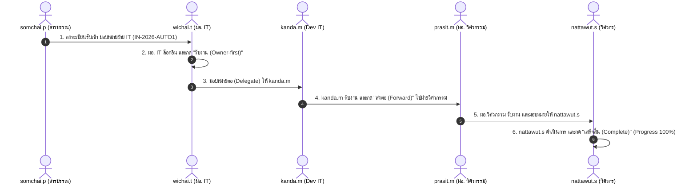
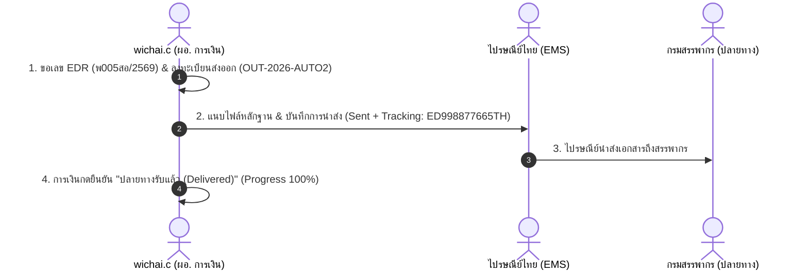

# คู่มือชุดทดสอบระบบสารบรรณอิเล็กทรอนิกส์ (Detailed Test Cases Specification)

**ระบบ:** Correspondence Monitoring System (ระบบ Monitor สถานะเอกสารรับเข้า–ส่งออก)  
**บริษัท:** บริษัท เทเวศประกันภัย จำกัด (มหาชน)  
**เวอร์ชันระบบ:** 2.0.0 (Phase 2 Full-Stack: ASP.NET Core 8 Web API + React TypeScript Tailwind)  
**สถานะ:** พร้อมสำหรับการทดสอบแบบ Manual QA และการพัฒนา Automation Test (Playwright / Cypress / C# xUnit)  
**URL ระบบทดสอบ:** `http://localhost:5000` (Frontend SPA) / `http://localhost:5000/api` (Backend API)  

---

## สารบัญชุดการทดสอบ (Test Suite Index)

| รหัสโมดูล | ชื่อโมดูล / ฟังก์ชันงาน | จำนวน Test Cases | ประเภทการทดสอบ | ความสำคัญ |
| :--- | :--- | :---: | :--- | :---: |
| **TC-AUTH** | ระบบยืนยันตัวตนและการควบคุมสิทธิ์ (Authentication & RBAC) | 6 | UI / API / Security | Critical |
| **TC-REG-IN** | การลงทะเบียนเอกสารรับเข้า (Incoming Registration) | 8 | UI / API / Functional | Critical |
| **TC-REG-OUT** | การลงทะเบียนเอกสารส่งออก & EDR (Outgoing & EDR) | 7 | UI / API / Integration | Critical |
| **TC-WF** | เวิร์กโฟลว์, สถานะเอกสาร & การกระจายงาน (Workflow & Delegation) | 12 | E2E / Functional / State | Critical |
| **TC-OTP** | เอกสารลับมาก, ระบบ OTP & ลายน้ำไดนามิก (Top Secret OTP & Watermark) | 6 | Security / Functional | High |
| **TC-DEL** | การติดตามและนำส่งเอกสารภายนอก (Outgoing Delivery Lifecycle) | 5 | UI / Functional | High |
| **TC-INBOX** | กล่องข้อความงาน & การค้นหา/กรองข้อมูล (Task Inbox & Filters) | 6 | UI / Functional | Medium |
| **TC-DASH** | แดชบอร์ดผู้บริหาร & การติดตาม SLA (Dashboard & SLA) | 5 | UI / Visual / Data | High |
| **TC-RPT** | รายงานมาตรฐาน 6 ฉบับ & การส่งออกไฟล์ (Reports & Export) | 7 | Data / Functional | High |
| **TC-ADM** | การจัดการผู้ใช้ LDAP & ข้อมูลหลัก (Admin & Master Data) | 6 | UI / API / Admin | High |
| **TC-NFR** | ความปลอดภัย, NFR & Resilience (Security & API Resilience) | 5 | API / NFR / Performance | Critical |
| **E2E-FLOW** | การทดสอบรวมตั้งแต่ต้นจนจบกระบวนการ (End-to-End Automation Flows) | 5 Scenarios | Multi-Actor E2E | Critical |
| **รวมทั้งหมด** | | **78 รายการ** | | |

---

## ข้อมูลบัญชีผู้ใช้สำหรับทดสอบ (Test Accounts Reference)

| Username | รหัสผ่าน | Role ID | Role Name | ฝ่ายที่สังกัด | วัตถุประสงค์ในการทดสอบ |
| :--- | :--- | :---: | :--- | :--- | :--- |
| `sutthichok.t` | `password123` | `ROLE-05` | Admin (ผู้ดูแลระบบ) | ฝ่ายสารสนเทศ | ทดสอบสิทธิ์ Admin, LDAP Provision, Master Data |
| `admin` | `password123` | `ROLE-05` | Admin (ผู้ดูแลระบบ) | ฝ่ายสารสนเทศ | ทดสอบสิทธิ์ Super Admin |
| `somchai.p` | `password123` | `ROLE-01` | สารบรรณ (Register) | งานสารบรรณ | ลงทะเบียนรับเข้า, แนบไฟล์/กล้อง, ยืนยันรับตัวจริงคืน |
| `anong.s` | `password123` | `ROLE-03` | หัวหน้างานสารบรรณ | งานสารบรรณ | ตรวจสอบงานสารบรรณ, ส่งต่อข้ามฝ่าย |
| `wichai.t` | `password123` | `ROLE-03` | ผอ. ฝ่ายสารสนเทศ | ฝ่ายสารสนเทศ | รับงาน Owner-first, มอบหมายต่อ (Delegate), ปฏิเสธ |
| `kanda.m` | `password123` | `ROLE-02` | เจ้าหน้าที่ IT (Staff) | ฝ่ายสารสนเทศ | รับงาน, ปิดงาน Complete, ยืนยัน OTP เอกสารลับมาก |
| `wichai.c` | `password123` | `ROLE-03`/`06`| ผอ. การเงิน / ผู้ส่งออก | ฝ่ายการเงิน | ลงทะเบียนส่งออก, ขอเลข EDR, บันทึกนำส่ง/รับมอบ |
| `siriporn.w` | `password123` | `ROLE-02` | เจ้าหน้าที่การเงิน | ฝ่ายการเงิน | รับงานเอกสารการเงิน, แนบไฟล์เพิ่มเติม, ปิดงาน |
| `prasit.m` | `password123` | `ROLE-03` | ผอ. ฝ่ายวิศวกรรม | ฝ่ายวิศวกรรม | รับงานส่งต่อข้ามสายงาน, มอบหมายต่อ |
| `nattawut.s` | `password123` | `ROLE-02` | วิศวกร (Staff) | ฝ่ายวิศวกรรม | ปฏิบัติงานทางวิศวกรรม, ปิดงาน Complete |
| `prapat.k` | `password123` | `ROLE-04` | ผู้บริหาร (Executive) | ฝ่ายบริหารทั่วไป | ดู Dashboard ภาพรวมทุกฝ่าย (Read-only All) |
| `monitor.auditor`| `password123` | `ROLE-07`| Monitor (ผู้เฝ้าติดตาม)| ฝ่ายบริหารทั่วไป | ติดตามงานค้าง, ตรวจสอบ SLA, ดู Story Line |

---

# 1. ระบบยืนยันตัวตนและการควบคุมสิทธิ์ (TC-AUTH)

### TC-AUTH-001: ล็อกอินเข้าสู่ระบบสำเร็จด้วยข้อมูลที่ถูกต้อง (Positive Login)
- **Module:** Authentication
- **Test Type:** Functional / UI / E2E
- **Priority:** Critical
- **Pre-requisite:** ผู้ใช้ `somchai.p` มีสถานะ `IsActive = true` ในฐานข้อมูล
- **Target URL / API:** `http://localhost:5000/login` | `POST /api/auth/login`
- **Automation Selectors:**
  - Username Input: `input[name="username"]` หรือ `#username`
  - Password Input: `input[name="password"]` หรือ `#password`
  - Submit Button: `button[type="submit"]` หรือ text `เข้าสู่ระบบ`
  - Dashboard Header: `header` หรือ text `ระบบติดตามสถานะเอกสาร`
- **Test Steps:**
  1. เปิดเบราว์เซอร์ไปที่ `/login`
  2. กรอก Username: `somchai.p`
  3. กรอก Password: `password123`
  4. คลิกปุ่ม "เข้าสู่ระบบ"
- **Expected Results:**
  - ได้รับ HTTP 200 พร้อม JWT Token และข้อมูล User Profile
  - ระบบเปลี่ยนเส้นทาง (Redirect) ไปยังหน้าแรก (`/dashboard` หรือ `/tasks`)
  - มุมขวาบนแสดงชื่อผู้ใช้ "นายสมชาย พัฒนาการ" และบทบาท "ผู้ Register (สารบรรณ)"
  - LocalStorage มีการบันทึก Key `token` และ `user`

---

### TC-AUTH-002: ล็อกอินไม่สำเร็จเมื่อรหัสผ่านไม่ถูกต้อง (Invalid Password)
- **Module:** Authentication
- **Test Type:** Negative / Security
- **Priority:** High
- **Target URL / API:** `http://localhost:5000/login` | `POST /api/auth/login`
- **Automation Selectors:**
  - Error Alert: `.alert-danger` หรือ `[role="alert"]` หรือ Toast Message
- **Test Steps:**
  1. เปิดหน้า `/login`
  2. กรอก Username: `somchai.p`
  3. กรอก Password: `wrongpassword999`
  4. คลิกปุ่ม "เข้าสู่ระบบ"
- **Expected Results:**
  - ได้รับ HTTP 401 Unauthorized
  - ไม่เกิดการ Redirect ไปหน้าอื่น
  - แสดงข้อความแจ้งเตือน "ชื่อผู้ใช้หรือรหัสผ่านไม่ถูกต้อง"
  - ไม่มี Token บันทึกใน Storage

---

### TC-AUTH-003: ล็อกอินไม่สำเร็จเมื่อบัญชีผู้ใช้ถูกระงับ (Inactive User Login)
- **Module:** Authentication
- **Test Type:** Negative / Security / Business Rule
- **Priority:** High
- **Pre-requisite:** ผู้ใช้ถูกตั้งค่า `IsActive = false` ผ่านหน้า Admin
- **Test Steps:**
  1. เปิดหน้า `/login`
  2. กรอก Username ของบัญชีที่ถูก Inactive
  3. กรอกรหัสผ่านที่ถูกต้อง
  4. คลิกปุ่ม "เข้าสู่ระบบ"
- **Expected Results:**
  - ได้รับ HTTP 403 Forbidden หรือ 401 Unauthorized
  - แสดงข้อความ "บัญชีผู้ใช้ของท่านถูกระงับการใช้งาน กรุณาติดต่อผู้ดูแลระบบ"

---

### TC-AUTH-004: ออกจากระบบสำเร็จ (Logout Flow)
- **Module:** Authentication
- **Test Type:** Functional / UI
- **Priority:** High
- **Pre-requisite:** ผู้ใช้ล็อกอินอยู่ในระบบเรียบร้อย
- **Automation Selectors:**
  - Profile Menu Button: `#user-menu-btn` หรือ `button:has-text("สมชาย")`
  - Logout Button: `button:has-text("ออกจากระบบ")` หรือ `a[href="/logout"]`
- **Test Steps:**
  1. คลิกที่เมนูโปรไฟล์มุมขวาบน
  2. คลิกปุ่ม "ออกจากระบบ"
- **Expected Results:**
  - เคลียร์ JWT Token และ Session ข้อมูลผู้ใช้ในเบราว์เซอร์
  - Redirect กลับมายังหน้า `/login`
  - เมื่อพยายามกดปุ่ม Back ของเบราว์เซอร์ ระบบต้องไม่ยอมให้เข้าถึงหน้าที่ต้องล็อกอิน

---

### TC-AUTH-005: ตรวจสอบการควบคุมสิทธิ์ตามบทบาทบนเมนู (RBAC Menu Visibility)
- **Module:** RBAC
- **Test Type:** Functional / Security
- **Priority:** Critical
- **Test Matrix:**
  | ผู้ใช้ (Role) | เมนู Admin | เมนู Register In | เมนู Register Out | เมนู Reports | แดชบอร์ด |
  | :--- | :---: | :---: | :---: | :---: | :---: |
  | `somchai.p` (ROLE-01) | ❌ ไม่แสดง | ✅ แสดง | ❌ ไม่แสดง | ❌ ไม่แสดง | ✅ เฉพาะงานตนเอง |
  | `kanda.m` (ROLE-02) | ❌ ไม่แสดง | ❌ ไม่แสดง | ❌ ไม่แสดง | ❌ ไม่แสดง | ✅ เฉพาะงานตนเอง |
  | `wichai.t` (ROLE-03) | ❌ ไม่แสดง | ❌ ไม่แสดง | ❌ ไม่แสดง | ✅ แสดง | ✅ ภาพรวมฝ่าย IT |
  | `prapat.k` (ROLE-04) | ❌ ไม่แสดง | ❌ ไม่แสดง | ❌ ไม่แสดง | ✅ แสดง | ✅ ภาพรวมทุกฝ่าย (Read-only) |
  | `sutthichok.t` (ROLE-05)| ✅ แสดง | ✅ แสดง | ✅ แสดง | ✅ แสดง | ✅ ทุกฟังก์ชัน |
  | `wichai.c` (ROLE-06) | ❌ ไม่แสดง | ❌ ไม่แสดง | ✅ แสดง | ✅ แสดง | ✅ ภาพรวมฝ่ายการเงิน |
  | `monitor.auditor` (ROLE-07)| ❌ ไม่แสดง| ❌ ไม่แสดง | ❌ ไม่แสดง | ✅ แสดง | ✅ หน้า Monitor ติดตาม |
- **Expected Results:**
  - ผู้ใช้เห็นเฉพาะเมนูที่สอดคล้องกับ Role ID ของตนเอง
  - หากผู้ใช้ไม่มีสิทธิ์ พยายามพิมพ์ URL โดยตรง เช่น `/admin` ระบบจะแสดงหน้า "Access Denied" หรือ Redirect กลับ

---

### TC-AUTH-006: ตรวจสอบการป้องกัน Unauthorized API Access (API Guard)
- **Module:** RBAC / API
- **Test Type:** Security / API
- **Priority:** Critical
- **Test Steps:**
  1. ยิง Request `GET /api/admin/users` โดยไม่ส่ง Authorization Header
  2. ยิง Request `GET /api/admin/users` โดยใช้ Token ของ `kanda.m` (ROLE-02)
- **Expected Results:**
  - ขั้นตอนที่ 1 ได้รับ HTTP 401 Unauthorized
  - ขั้นตอนที่ 2 ได้รับ HTTP 403 Forbidden พร้อม Problem Details RFC 7807

---

# 2. การลงทะเบียนเอกสารรับเข้า (TC-REG-IN)

### TC-REG-IN-001: ลงทะเบียนเอกสารรับเข้าช่องทางไปรษณีย์/ฉบับจริง สำเร็จ (Physical Incoming)
- **Module:** Document Registration (Incoming)
- **Test Type:** Functional / E2E
- **Priority:** Critical
- **Actor:** `somchai.p` (ROLE-01 งานสารบรรณ)
- **Target URL / API:** `http://localhost:5000/register` (Tab: เอกสารรับเข้า) | `POST /api/documents/incoming`
- **Automation Selectors:**
  - Tab Incoming: `button:has-text("เอกสารรับเข้า")`
  - Channel Radio: `input[value="physical"]` หรือ label `เอกสารฉบับจริง`
  - Sender Input: `input[name="sender"]` หรือ placeholder `เช่น บริษัท คู่ค้า จำกัด`
  - RefDocNo Input: `input[name="refDocNumber"]` หรือ placeholder `เช่น ทว-67/0891`
  - Subject Input: `input[name="subject"]`
  - Urgency Select: `select[name="urgency"]` (ค่า: `normal`, `urgent`, `very-urgent`)
  - Confidentiality Select: `select[name="confidentiality"]` (ค่า: `normal`, `confidential`, `top-secret`)
  - Deadline Input: `input[name="deadline"]`
  - Description Textarea: `textarea[name="description"]`
  - Assignee Picker Button: `button:has-text("เลือกผู้รับผิดชอบ")`
  - Submit Button: `button[type="submit"]:has-text("บันทึกและลงทะเบียนเอกสาร")`
  - Success Modal Confirm Button: `button:has-text("ไปยังหน้ารายการเอกสาร")`
- **Test Steps:**
  1. ล็อกอินด้วย `somchai.p` และไปที่หน้า `/register`
  2. เลือกช่องทาง: `เอกสารฉบับจริง (Physical)`
  3. กรอก หน่วยงานต้นทาง: `กรมการประกันภัย (คปภ.)`
  4. กรอก เลขที่หนังสือต้นทาง: `คปภ-1044/2569`
  5. กรอก เรื่อง: `ขอความอนุเคราะห์ข้อมูลสถิติการรับประกันภัยไตรมาส 1`
  6. เลือก ความเร่งด่วน: `ด่วน (Urgent)`
  7. เลือก ชั้นความลับ: `ปกติ (Normal)`
  8. ระบุ กำหนดดำเนินการ: วันที่ปัจจุบัน + 5 วัน
  9. กดปุ่มเลือกผู้รับผิดชอบ $\rightarrow$ เลือกฝ่าย: `ฝ่ายสารสนเทศ`
  10. แนบไฟล์ PDF ทดสอบ `sample_doc.pdf` ขนาด 1.5 MB
  11. กดปุ่ม "บันทึกและลงทะเบียนเอกสาร"
- **Expected Results:**
  - Backend ส่ง HTTP 201 Created พร้อม Document Object และ Document Number รูปแบบ `IN-2026-XXXXX`
  - แสดง Modal แจ้งเตือนลงทะเบียนสำเร็จ
  - สถานะเริ่มต้นของเอกสารเป็น `pending-acceptance` (รอรับงาน)
  - ผู้ถือครองเอกสารฉบับจริงเริ่มต้น (`current_holder`) เป็น `somchai.p` (สารบรรณ)
  - บันทึกประวัติ Chain of Custody รายการแรก "รับเอกสารเข้าสู่ระบบสารบรรณ"

---

### TC-REG-IN-002: ลงทะเบียนเอกสารรับเข้าช่องทางอีเมล และมอบหมายรายบุคคล (Email Incoming to Specific User)
- **Module:** Document Registration (Incoming)
- **Test Type:** Functional / E2E
- **Priority:** High
- **Actor:** `somchai.p` (ROLE-01)
- **Test Steps:**
  1. ไปที่หน้า `/register` เลือก "เอกสารรับเข้า"
  2. เลือกช่องทาง: `อีเมล (Email)`
  3. กรอก หน่วยงานส่ง: `audit@externalauditor.com`
  4. กรอก เรื่อง: `รายงานผลการตรวจสอบระบบความมั่นคงปลอดภัยสารสนเทศ ประจำปี 2569`
  5. เลือก ความเร่งด่วน: `ด่วนมาก (Very Urgent)`
  6. เลือก ชั้นความลับ: `ลับ (Confidential)`
  7. กำหนดวันเสร็จสิ้น: วันที่ปัจจุบัน + 3 วัน
  8. เลือกผู้รับมอบหมาย: รายบุคคล $\rightarrow$ `kanda.m (น.ส.กานดา มีสุข - ฝ่ายสารสนเทศ)`
  9. แนบไฟล์ `audit_report_2026.pdf`
  10. คลิก "บันทึกและลงทะเบียนเอกสาร"
- **Expected Results:**
  - บันทึกเอกสารสำเร็จ ได้เลขที่ `IN-2026-XXXXX`
  - เอกสารระบุ `responsibleDepartment = ฝ่ายสารสนเทศ` และ `assignee = kanda.m`
  - ผู้ใช้ `kanda.m` จะเห็นงานนี้ใน Task Inbox เมนู "งานที่ต้องปฏิบัติ"

---

### TC-REG-IN-003: ลงทะเบียนเอกสารและแนบภาพถ่ายด้วยกล้องถ่ายภาพ (Camera Capture Attachment)
- **Module:** Document Registration (Incoming)
- **Test Type:** UI / Functional
- **Priority:** High
- **Actor:** `somchai.p` (ROLE-01)
- **Automation Selectors:**
  - Camera Button: `button:has-text("ถ่ายภาพจากกล้อง")`
  - Camera Modal: `div[role="dialog"]:has-text("ถ่ายภาพเอกสาร")`
  - Capture Shutter Button: `button[title="ถ่ายภาพ"]` หรือ `.camera-shutter-btn`
  - Confirm Photo Button: `button:has-text("ใช้ภาพนี้")`
  - Attachment Item: `.attachment-item`
- **Test Steps:**
  1. ที่หน้าลงทะเบียน กดปุ่ม "ถ่ายภาพจากกล้อง"
  2. อนุญาตให้เบราว์เซอร์เข้าถึงกล้อง (Webcam)
  3. วิดีโอสดแสดงผลบนหน้าจอ จากนั้นกดปุ่ม "ถ่ายภาพ"
  4. ตรวจสอบภาพพรีวิว และกดปุ่ม "ใช้ภาพนี้"
- **Expected Results:**
  - ภาพถ่ายถูกแปลงเป็น DataURL / Base64 หรือ Blob และแสดงในรายการไฟล์แนบ
  - รายการแสดงชื่อไฟล์ เช่น `camera-photo-20260902-164500.jpg` พร้อมเวลาที่ถ่าย
  - มีปุ่มลบไฟล์และปุ่มพรีวิวภาพขนาดใหญ่

---

### TC-REG-IN-004: ลงทะเบียนแบบกระจายงานหลายฝ่าย/หลายบุคคล (Multi-department Multi-assignee)
- **Module:** Document Registration (Incoming)
- **Test Type:** Functional / Complex Business Logic (BR-2.4)
- **Priority:** Critical
- **Actor:** `somchai.p` (ROLE-01)
- **Test Steps:**
  1. กรอกข้อมูลเอกสารรับเข้า เรื่อง "คำสั่งคณะกรรมการบริหารเรื่องนโยบายความปลอดภัยองค์กร"
  2. กดปุ่มเลือกผู้รับผิดชอบ $\rightarrow$ ติ๊กเลือกฝ่าย 3 ฝ่าย:
     - `ฝ่ายสารสนเทศ` (IT)
     - `ฝ่ายกฎหมาย` (Legal)
     - `ฝ่ายทรัพยากรบุคคล` (HR)
  3. ติ๊กเลือกบุคคลเพิ่มเติม: `siriporn.w` (ฝ่ายการเงิน)
  4. บันทึกเอกสาร
- **Expected Results:**
  - ระบบสร้าง Sub-assignments แยกเป็น 4 รายการย่อยภายใต้ Document ID เดียวกัน
  - ทุกรายการย่อยมีสถานะเริ่มต้นเป็น `pending` (รอรับงาน)
  - Progress รวมของเอกสารเริ่มต้นที่ `0%`
  - หัวหน้าฝ่ายของทั้ง 3 ฝ่าย และ `siriporn.w` เห็นงานนี้ใน Inbox ของตนเอง

---

### TC-REG-IN-005: ตรวจสอบ Validation ฟอร์มเอกสารรับเข้า (Mandatory Field Validation)
- **Module:** Document Registration
- **Test Type:** Negative / Validation
- **Priority:** High
- **Test Steps:**
  1. เปิดหน้าลงทะเบียนเอกสารรับเข้า
  2. ไม่กรอกหัวข้อเอกสาร (Subject)
  3. ไม่เลือกความเร่งด่วน หรือไม่ระบุกำหนดส่ง
  4. กดปุ่ม "บันทึกและลงทะเบียนเอกสาร"
- **Expected Results:**
  - ฟอร์มไม่ทำการส่งข้อมูลไปยัง Server
  - มีข้อความแจ้งเตือนสีแดงใต้ฟิลด์:
    - "กรุณากรอกหัวข้อเอกสาร"
    - "กรุณาระบุกำหนดดำเนินการ"
  - ช่อง Input ถูกไฮไลต์ขอบสีแดง (`border-red-500`)

---

### TC-REG-IN-006: ตรวจสอบการตรวจสอบขนาดและประเภทไฟล์แนบ (Attachment File Type & Size Validation)
- **Module:** Document Registration
- **Test Type:** Negative / Security
- **Priority:** Medium
- **Test Steps:**
  1. พยายามอัปโหลดไฟล์นามสกุลไม่อนุญาต เช่น `.exe`, `.bat`, `.sh`
  2. พยายามอัปโหลดไฟล์ขนาดเกิน 25 MB
- **Expected Results:**
  - ระบบปฏิเสธการอัปโหลด และแสดงข้อความแจ้งเตือน "ไฟล์ต้องเป็น PDF, DOCX, XLSX, รูปภาพ หรือ ZIP และขนาดไม่เกิน 25 MB"

---

### TC-REG-IN-007: ตรวจสอบการอนุมานฝ่ายที่รับผิดชอบตามผู้รับมอบหมาย (Responsible Dept Inference)
- **Module:** Document Registration
- **Test Type:** Functional / UI
- **Test Steps:**
  1. ในหน้าลงทะเบียน เลือกผู้รับมอบหมายเป็น `kanda.m` (เจ้าหน้าที่ IT)
- **Expected Results:**
  - ช่อง "ฝ่ายที่รับผิดชอบ" แสดงค่าอัตโนมัติเป็น "ฝ่ายสารสนเทศ"
  - แสดงตำแหน่ง "วิศวกรซอฟต์แวร์ / เจ้าหน้าที่สารสนเทศ" โดยอัตโนมัติ

---

### TC-REG-IN-008: การลงทะเบียนเอกสารชั้นความลับ "ลับมาก" (Top Secret Registration)
- **Module:** Document Registration
- **Test Type:** Security / Functional
- **Test Steps:**
  1. ลงทะเบียนเอกสารรับเข้า เลือกชั้นความลับ: `ลับมาก (Top Secret)`
  2. แนบไฟล์ `confidential_strategy.pdf`
  3. บันทึกเอกสาร
- **Expected Results:**
  - เอกสารถูกบันทึกด้วย `confidentiality = top-secret`
  - เมื่อเปิดดูหน้ารายละเอียดเอกสาร ผู้ใช้ทั่วไปที่ไม่ได้รับอนุญาตจะไม่สามารถดาวน์โหลดหรือดูภาพพรีวิวไฟล์ได้จนกว่าจะผ่าน OTP Verification

---

# 3. การลงทะเบียนเอกสารส่งออก & EDR (TC-REG-OUT)

### TC-REG-OUT-001: ขอเลขที่เอกสารส่งออก EDR รูปแบบปกติ (Normal EDR Number Request)
- **Module:** Outgoing & EDR Integration
- **Test Type:** Integration / UI / API
- **Priority:** Critical
- **Actor:** `wichai.c` (ROLE-03/06 ผอ. การเงิน)
- **Target URL / API:** `http://localhost:5000/register` (Tab: เอกสารส่งออก) | `POST /api/edr/request-number`
- **Automation Selectors:**
  - Request EDR Button: `button:has-text("ขอเลขที่ส่งออกจากระบบ EDR")`
  - EDR Modal: `div[role="dialog"]:has-text("ขอเลขที่เอกสารส่งออก (EDR)")`
  - Year Select: `select[name="edrYear"]`
  - Running Type Radio: `input[value="normal"]`
  - Submit EDR Request: `button:has-text("ออกเลขที่เอกสาร")`
  - Issued Number Display: `.edr-badge` หรือ text `พ001สอ/2569`
- **Test Steps:**
  1. ล็อกอินด้วย `wichai.c` และไปที่หน้า `/register` เลือก "เอกสารส่งออก"
  2. คลิกปุ่ม "ขอเลขที่ส่งออกจากระบบ EDR"
  3. ใน Modal เลือกประเภท: ปกติ (Normal) และปี พ.ศ. 2569
  4. คลิกปุ่ม "ออกเลขที่เอกสาร"
- **Expected Results:**
  - API EDR ตอบกลับ HTTP 200 พร้อมเลขที่เอกสารภาษาไทย (เช่น `พ001สอ/2569`) และภาษาอังกฤษ (เช่น `S001CC/2026`)
  - ฟิลด์เลขที่เอกสารในฟอร์มถูกกรอกและล็อคค่าอัตโนมัติ
  - แสดง Badge ยืนยันว่า "ออกเลข EDR สำเร็จ"

---

### TC-REG-OUT-002: ขอเลขที่เอกสารส่งออก EDR รูปแบบพิเศษ (Special Format EDR Number Request)
- **Module:** Outgoing & EDR Integration
- **Test Type:** Integration / Functional
- **Priority:** High
- **Test Steps:**
  1. คลิกปุ่ม "ขอเลขที่ส่งออกจากระบบ EDR"
  2. เลือกประเภท: พิเศษ (Special)
  3. เลือกรหัสหมวดพิเศษ เช่น `กม` (ฝ่ายกฎหมาย) หรือ `บห` (ผู้บริหาร)
  4. กดปุ่ม "ออกเลขที่เอกสาร"
- **Expected Results:**
  - ได้รับเลขที่เอกสารรูปแบบเฉพาะ เช่น `พ001กม/2569`
  - แสดงผลในฟอร์มถูกต้อง

---

### TC-REG-OUT-003: ตรวจสอบกฎบังคับแนบไฟล์สำหรับเอกสารส่งออก (Mandatory Attachment Rule BR-4.1 / VAL-04)
- **Module:** Outgoing Registration
- **Test Type:** Business Rule / Negative
- **Priority:** Critical
- **Test Steps:**
  1. กรอกข้อมูลเอกสารส่งออกครบถ้วนทุกช่อง (เรื่อง, ผู้รับภายนอก, กำหนดส่ง, รูปแบบการนำส่ง)
  2. ไม่แนบไฟล์เอกสารหรือภาพถ่ายใดๆ
  3. คลิกปุ่ม "บันทึกและลงทะเบียนเอกสาร"
- **Expected Results:**
  - ระบบไม่อนุญาตให้บันทึก
  - แสดงข้อความแจ้งเตือน Error: "ต้องแนบไฟล์หลักฐานหรือภาพถ่ายเอกสารก่อนนำส่ง (BR-4.1 / VAL-04)"
  - ปุ่ม Submit ไม่ส่ง API Request

---

### TC-REG-OUT-004: ลงทะเบียนเอกสารส่งออกสำเร็จพร้อมไฟล์แนบ (Complete Outgoing Registration)
- **Module:** Outgoing Registration
- **Test Type:** Functional / E2E
- **Priority:** Critical
- **Actor:** `wichai.c` (ROLE-03/06)
- **Test Steps:**
  1. ขอเลข EDR ได้เลข `พ002สอ/2569`
  2. กรอก หน่วยงานปลายทาง: `สำนักงานสรรพากรพื้นที่กรุงเทพมหานคร 3`
  3. กรอก เรื่อง: `หนังสือนำส่งภาษีเงินได้หัก ณ ที่จ่าย ประจำเดือนสิงหาคม 2569`
  4. เลือก รูปแบบการส่ง: `ไปรษณีย์ด่วนพิเศษ (EMS)`
  5. เลือก ความเร่งด่วน: `ด่วน (Urgent)`
  6. แนบไฟล์ `tax_cover_letter.pdf` ขนาด 2.1 MB
  7. คลิกปุ่ม "บันทึกและลงทะเบียนเอกสาร"
- **Expected Results:**
  - API บันทึกเอกสารส่งออกสำเร็จ (`POST /api/documents/outgoing`)
  - สถานะเริ่มต้นของเอกสารส่งออกเป็น `ready-to-send` หรือ `awaiting_delivery`
  - ฝ่ายต้นทางและฝ่ายที่รับผิดชอบถูกกำหนดเป็น "ฝ่ายการเงิน" (ไม่มีขั้นตอน Internal Assign)
  - เอกสารแสดงในรายการ "เอกสารส่งออก"

---

### TC-REG-OUT-005: ลิงก์เชื่อมโยงระบบภายนอกสำหรับการเรียกรถไปรษณีย์ (Postal Pickup External Link)
- **Module:** Outgoing Registration
- **Test Type:** UI / Functional
- **Test Steps:**
  1. ในหน้าลงทะเบียนเอกสารส่งออก เลือกรูปแบบการส่ง: `ให้ ไปรษณีย์ มารับเอกสารที่บริษัท`
- **Expected Results:**
  - ปรากฏกล่องคำแนะนำและปุ่ม External Link "เข้าสู่ระบบนัดหมายไปรษณีย์ไทย (Thailand Post Pickup Service)"
  - เมื่อคลิก ลิงก์จะเปิดหน้าต่างใหม่ (`target="_blank"`) ไปยัง URL พอร์ทัลของไปรษณีย์ไทย

---

### TC-REG-OUT-006: รับข้อมูลเอกสารส่งออกผ่าน EDR Webhook พร้อม Idempotency Key (Webhook Parity)
- **Module:** EDR Integration / Webhook
- **Test Type:** API / Integration
- **Priority:** Critical
- **Target API:** `POST /api/edr/webhook`
- **Test Steps:**
  1. ยิง HTTP POST ไปที่ `/api/edr/webhook` พร้อม Header `X-Idempotency-Key: EDR-SYNC-99881` และ Payload ข้อมูลเอกสารส่งออกจากระบบ EDR
  2. ยิง Request ซ้ำด้วย Header `X-Idempotency-Key` เดิมและ Payload เดิม
- **Expected Results:**
  - การยิงครั้งที่ 1: ได้รับ HTTP 200/201 เอกสารถูกสร้างและบันทึกลงระบบ Correspondence
  - การยิงครั้งที่ 2: ได้รับ HTTP 200 OK (Idempotent replay) ไม่เกิดข้อมูลซ้ำซ้อนในฐานข้อมูล

---

### TC-REG-OUT-007: ตรวจสอบการจัดการ Retry เมื่อ Webhook ขัดข้อง (Webhook Resilience Policy)
- **Module:** EDR Integration / Resilience
- **Test Type:** Resilience / API
- **Test Steps:**
  1. จำลองสถานการณ์ฐานข้อมูลชะงักชั่วคราวขณะ Webhook ยิงเข้ามา
- **Expected Results:**
  - Polly Resilience Policy ทำการ Retry แบบ Exponential Backoff (3 ครั้ง)
  - เมื่อระบบกลับมาปกติ การประมวลผล Webhook จะเสร็จสมบูรณ์โดยข้อมูลไม่สูญหาย

---

# 4. เวิร์กโฟลว์, สถานะเอกสาร & การกระจายงาน (TC-WF)

### TC-WF-001: หัวหน้าฝ่ายรับงานระดับฝ่าย (Department Owner-first Acceptance)
- **Module:** Workflow
- **Test Type:** Functional / Business Logic (BR-2.1)
- **Priority:** Critical
- **Actor:** `wichai.t` (ROLE-03 ผอ. ฝ่ายสารสนเทศ)
- **Pre-requisite:** มีเอกสารรับเข้า `IN-2026-0001` ที่ถูกมอบหมายมายัง `ฝ่ายสารสนเทศ` และสถานะเป็น `pending-acceptance`
- **Automation Selectors:**
  - Accept Button: `button:has-text("รับงาน (หัวหน้าฝ่าย)")` หรือ `button:has-text("รับงาน (Accept)")`
  - Confirm Modal Button: `button:has-text("ยืนยันรับงาน")`
  - Status Badge: `.status-badge`
- **Test Steps:**
  1. ล็อกอินด้วย `wichai.t`
  2. ไปที่หน้ารายละเอียดเอกสาร `/documents/IN-2026-0001`
  3. คลิกปุ่ม "รับงาน (Accept)"
  4. กดยืนยันใน Modal ยืนยันการรับงาน
- **Expected Results:**
  - API ส่ง HTTP 200 (`POST /api/documents/{id}/transition` ด้วย `action: accept`)
  - สถานะของ Sub-task ของฝ่าย IT เปลี่ยนเป็น `accepted` (`in-progress`)
  - สถานะภาพรวมเอกสารเปลี่ยนเป็น `in-progress` (กำลังดำเนินการ)
  - บันทึกชื่อผู้รับงาน `wichai.t` และ Timestamp ใน Timeline และ Audit Log

---

### TC-WF-002: การมอบหมายงานต่อให้ผู้ใต้บังคับบัญชา (Onward Delegation Lineage Tree)
- **Module:** Workflow & Delegation
- **Test Type:** Functional / Business Logic (BR-2.2 / BR-2.3)
- **Priority:** Critical
- **Actor:** `wichai.t` (ROLE-03) $\rightarrow$ มอบหมายต่อให้ `kanda.m` (ROLE-02)
- **Pre-requisite:** เอกสารอยู่ในสถานะ `in-progress` ภายใต้การดูแลของ `wichai.t`
- **Automation Selectors:**
  - Delegate Button: `button:has-text("มอบหมายต่อ (Delegate)")`
  - Subordinate Select: `select[name="delegateUser"]`
  - Delegate Note Textarea: `textarea[name="delegateNote"]`
  - Confirm Delegate Button: `button:has-text("ยืนยันมอบหมายต่อ")`
- **Test Steps:**
  1. ที่หน้ารายละเอียดเอกสาร คลิกปุ่ม "มอบหมายต่อ (Delegate)"
  2. ใน Modal เลือกผู้รับมอบหมาย: `kanda.m (น.ส.กานดา มีสุข)`
  3. กรอกคำสั่งการ: `รบกวนตรวจสอบข้อกำหนดเทคนิคและจัดเตรียมสรุปรายงานภายใน 3 วัน`
  4. คลิกปุ่ม "ยืนยันมอบหมายต่อ"
- **Expected Results:**
  - ระบบสร้าง Sub-task ใหม่ภายใต้ Sub-task เดิม (`parent_id = id ของ wichai.t`)
  - สายการมอบหมายแสดงผลแบบ Tree Hierarchy ชัดเจนในแท็บ "งานย่อย / มอบหมาย"
  - `kanda.m` ได้รับการแจ้งเตือน และเอกสารปรากฏใน Inbox ของ `kanda.m`
  - ผู้ถือครองเอกสาร (`current_holder`) ถูกอัปเดตเป็น `kanda.m`

---

### TC-WF-003: เจ้าหน้าที่ผู้รับมอบหมายปิดงานสำเร็จ (Complete Sub-task & Main Task)
- **Module:** Workflow
- **Test Type:** Functional / E2E
- **Priority:** Critical
- **Actor:** `kanda.m` (ROLE-02 Staff IT)
- **Automation Selectors:**
  - Complete Button: `button:has-text("ดำเนินการเสร็จสิ้น (Complete)")`
  - Confirm Complete Button: `button:has-text("ยืนยันเสร็จสิ้น")`
  - Progress Text: `span:has-text("100%")`
- **Test Steps:**
  1. ล็อกอินด้วย `kanda.m`
  2. เปิดเอกสารที่ได้รับมอบหมาย
  3. แนบไฟล์ผลการดำเนินงานเพิ่มเติม (ถ้ามี)
  4. คลิกปุ่ม "ดำเนินการเสร็จสิ้น (Complete)"
  5. กดยืนยันใน Modal
- **Expected Results:**
  - Sub-task ของ `kanda.m` เปลี่ยนสถานะเป็น `success`
  - ความคืบหน้า (Progress) คำนวณใหม่เป็น `100%`
  - หากไม่มีงานย่อยอื่นค้างอยู่ สถานะเอกสารหลักเปลี่ยนเป็น `completed` (เสร็จสิ้น)
  - เส้นทางเอกสาร (Story Line) แสดงขั้นตอนเสร็จสิ้นพร้อมเวลาประทับ

---

### TC-WF-004: การปฏิเสธและตีกลับเอกสารพร้อมระบุเหตุผล (Reject & Return Flow)
- **Module:** Workflow
- **Test Type:** Functional / Business Logic (BR-2.2)
- **Priority:** Critical
- **Actor:** `wichai.t` (ROLE-03)
- **Pre-requisite:** เอกสารสถานะ `pending-acceptance` ถูกมอบหมายมาผิดฝ่าย
- **Automation Selectors:**
  - Reject Button: `button:has-text("ปฏิเสธ/ส่งคืน (Reject)")`
  - Reject Reason Textarea: `textarea[placeholder*="ระบุเหตุผลที่ปฏิเสธ"]`
  - Confirm Reject Button: `button:has-text("ยืนยันส่งคืน")`
- **Test Steps:**
  1. เปิดหน้ารายละเอียดเอกสาร
  2. คลิกปุ่ม "ปฏิเสธ/ส่งคืน (Reject)"
  3. ไม่กรอกเหตุผล แล้วลองกดปุ่มยืนยัน $\rightarrow$ ตรวจสอบว่าปุ่มถูก Disabled
  4. กรอกเหตุผล: `เอกสารนี้เกี่ยวกับสัญญาจัดซื้อจัดจ้าง ควรเป็นของฝ่ายพัสดุและจัดซื้อ`
  5. คลิกปุ่ม "ยืนยันส่งคืน"
- **Expected Results:**
  - Sub-task เปลี่ยนสถานะเป็น `rejected` (ปฏิเสธ/ตีกลับ)
  - เอกสารถูกส่งกลับไปยังผู้ส่งต้นทาง (`somchai.p`)
  - บันทึกข้อความเหตุผลลงใน Audit Log
  - ส่ง Notification / Email แจ้งเตือนไปยังต้นทาง

---

### TC-WF-005: การส่งต่อเอกสารข้ามฝ่าย (Forward Across Department)
- **Module:** Workflow
- **Test Type:** Functional
- **Priority:** Critical
- **Actor:** `kanda.m` (IT) $\rightarrow$ ส่งต่อให้ `ฝ่ายวิศวกรรม`
- **Automation Selectors:**
  - Forward Button: `button:has-text("ส่งต่อ (Forward)")`
  - Target Dept Select: `select:has(option:has-text("ฝ่ายวิศวกรรม"))`
  - Forward Note Textarea: `textarea[placeholder*="ระบุคำแนะนำ"]`
  - Confirm Forward Button: `button:has-text("ยืนยันส่งต่อ")`
- **Test Steps:**
  1. ล็อกอินด้วย `kanda.m` เปิดเอกสารสถานะ `in-progress`
  2. คลิกปุ่ม "ส่งต่อ (Forward)"
  3. เลือกฝ่ายปลายทาง: `ฝ่ายวิศวกรรม`
  4. กรอกข้อความสั่งการ: `ขอให้ฝ่ายวิศวกรรมร่วมตรวจสอบแบบแปลนห้องเซิร์ฟเวอร์`
  5. กดยืนยันการส่งต่อ
- **Expected Results:**
  - Sub-task เดิมของ IT ถูกเปลี่ยนสถานะเป็น `forwarded`
  - สร้าง Sub-task ใหม่ของฝ่ายวิศวกรรม สถานะ `pending`
  - `prasit.m` (ผอ. วิศวกรรม) เห็นเอกสารนี้ใน Inbox เพื่อรอรับงาน
  - Timeline เพิ่ม Event การ Forward ข้ามฝ่าย

---

### TC-WF-006: การดึงงานกลับโดยต้นทาง (Recall Flow)
- **Module:** Workflow
- **Test Type:** Functional / Business Logic (BR-2.1)
- **Priority:** High
- **Actor:** `somchai.p` (ต้นทางที่มอบหมายงาน)
- **Pre-requisite:** ปลายทางยังไม่ได้กดรับงาน (สถานะยังคงเป็น `pending-acceptance`)
- **Automation Selectors:**
  - Recall Button: `button:has-text("ดึงงานกลับ (Recall)")`
  - Confirm Recall Button: `button:has-text("ยืนยันดึงงานกลับ")`
- **Test Steps:**
  1. ล็อกอินด้วย `somchai.p`
  2. เปิดเอกสารที่เพิ่งส่งไปผิดคน/ผิดฝ่าย
  3. คลิกปุ่ม "ดึงงานกลับ (Recall)" และกดยืนยัน
- **Expected Results:**
  - งานถูกดึงกลับมาที่ `somchai.p`
  - รายการงานใน Inbox ของปลายทางเดิมจะหายไป
  - มี Audit Log บันทึกการ Recall พร้อมแจ้ง Noti เตือนผู้เกี่ยวข้อง

---

### TC-WF-007: การยกเลิกเอกสาร (Cancel Document Flow)
- **Module:** Workflow
- **Test Type:** Functional / Business Logic (BR-2.5)
- **Priority:** High
- **Actor:** Admin หรือ สารบรรณผู้สร้างเอกสาร
- **Automation Selectors:**
  - Cancel Button: `button:has-text("ยกเลิกเอกสาร (Cancel)")`
  - Confirm Cancel Button: `button:has-text("ยืนยันยกเลิก")`
- **Test Steps:**
  1. เปิดเอกสารที่ต้องการยกเลิก
  2. คลิกปุ่ม "ยกเลิกเอกสาร (Cancel)" และกดยืนยัน
- **Expected Results:**
  - สถานะเอกสารเปลี่ยนเป็น `cancelled`
  - เอกสารไม่ถูกนำมานับคำนวณใน Progress และไม่นับเป็นงานค้าง Overdue
  - แสดง Badge สถานะ "ยกเลิก" สีเทา

---

### TC-WF-008: การคำนวณ Progress แบบหลายสายงานย่อยและตัด Sub-task ที่ยกเลิกออก (Progress Invariant Rule)
- **Module:** Workflow & Calculation Logic
- **Test Type:** Property-Based / Unit / Integration
- **Priority:** Critical
- **Pre-requisite:** เอกสารมี 4 Sub-tasks:
  - Sub 1: `success`
  - Sub 2: `success`
  - Sub 3: `in-progress`
  - Sub 4: `cancelled`
- **Test Steps:**
  1. คำนวณ Progress ของเอกสาร
- **Expected Results:**
  - รายการ Sub 4 ที่ `cancelled` ไม่ถูกนำมาเป็นตัวหาร
  - จำนวนงานที่นับได้ (Countable) = 3 งาน (Sub 1, 2, 3)
  - จำนวนงานสำเร็จ = 2 งาน
  - $\text{Progress} = \text{round}((2 / 3) \times 100) = 67\%$
  - ค่า Progress ต้องอยู่ระหว่าง $0\% \le \text{Progress} \le 100\%$ เสมอ

---

### TC-WF-009: วงจรการส่งคืนเอกสารฉบับจริง (Physical Return Cycle)
- **Module:** Physical Custody & Workflow
- **Test Type:** Functional / Business Rule
- **Priority:** High
- **Pre-requisite:** เอกสารฉบับจริงปิดงานแล้ว และเข้าสู่สถานะ `awaiting-physical-return`
- **Automation Selectors:**
  - Return Banner: `div:has-text("รอรับเอกสารฉบับจริงคืน")`
  - Confirm Return Button: `button:has-text("ยืนยันรับเอกสารคืน")`
- **Test Steps:**
  1. ผู้ถือครองนำเอกสารฉบับจริงมาส่งคืนที่งานสารบรรณ
  2. ล็อกอินด้วย `somchai.p` (สารบรรณ)
  3. เปิดหน้ารายละเอียดเอกสาร
  4. คลิกปุ่ม "ยืนยันรับเอกสารคืน" ในแถบ Banner สีเหลือง
- **Expected Results:**
  - สถานะเอกสารเปลี่ยนเป็น `completed` (เสร็จสมบูรณ์)
  - ผู้ถือครองเอกสารตัวจริงกลับมาเป็น `somchai.p (งานสารบรรณ)`
  - เพิ่มบันทึก Chain of Custody "ส่งคืนเอกสารฉบับจริงแก่งานสารบรรณเรียบร้อย"

---

### TC-WF-010: ตรวจสอบบันทึกการส่งมอบการถือครองเอกสาร (Chain of Custody Tracking)
- **Module:** Physical Custody
- **Test Type:** Functional / Data Integrity
- **Priority:** High
- **Test Steps:**
  1. เข้าแท็บ "การถือครอง (Chain of Custody)" ในหน้ารายละเอียดเอกสาร
- **Expected Results:**
  - แสดงตารางประวัติผู้ถือเอกสารเรียงตามลำดับเวลา (Timestamp, ผู้ถือครอง, ฝ่าย, หมายเหตุ/การกระทำ)
  - ข้อมูลสอดคล้องกับเส้นทางการส่งต่องานจริงทุกขั้นตอน

---

### TC-WF-011: ตรวจสอบการบันทึกประวัติการกระทำทั้งหมด (Comprehensive Audit Log)
- **Module:** Audit Logging
- **Test Type:** Security / Functional
- **Priority:** Critical
- **Test Steps:**
  1. ดำเนินการต่างๆ กับเอกสาร (Register, Accept, Delegate, Forward, Complete)
  2. เข้าแท็บ "ประวัติ (Audit Log)"
- **Expected Results:**
  - ทุก Action มีบันทึกในตาราง `DOCUMENT_AUDIT_LOG`:
    - `Actor` (ผู้กระทำ)
    - `Action` (ประเภทการกระทำ)
    - `Timestamp` (วัน-เวลาที่แน่นอน)
    - `Note` (ข้อความหมายเหตุ)
    - `IpAddress` (IP ผู้ใช้งาน)

---

### TC-WF-012: ตรวจสอบเส้นทางเอกสารแบบภาพรวม (Story Line Timeline Visual Check)
- **Module:** Visual Timeline
- **Test Type:** Visual / UI
- **Test Steps:**
  1. เข้าแท็บ "เส้นทางเอกสาร (Story Line)"
- **Expected Results:**
  - แสดง Timeline แบบ Step Node ชัดเจน
  - โหนดในอดีตแสดงสีเขียว (Completed)
  - โหนดปัจจุบันแสดงสีน้ำเงินพร้อมแอนิเมชัน Pulse (Current)
  - โหนดที่รอดำเนินการแสดงสีเทา (Pending)

---

# 5. เอกสารลับมาก, ระบบ OTP & ลายน้ำไดนามิก (TC-OTP)

### TC-OTP-001: ซ่อนการดูและดาวน์โหลดไฟล์สำหรับเอกสารลับมาก (Restricted Attachment View)
- **Module:** Confidentiality & Security
- **Test Type:** Security / UI
- **Priority:** Critical
- **Actor:** `wichai.t` หรือผู้ใช้ทั่วไป
- **Pre-requisite:** เอกสารมี `confidentiality = top-secret`
- **Automation Selectors:**
  - Request OTP Button: `button:has-text("ขอรับรหัส OTP เพื่อเปิดดูไฟล์")`
  - Locked Icon: `.lucide-lock`
- **Test Steps:**
  1. เปิดดูเอกสารชั้นความลับ "ลับมาก"
  2. ตรวจสอบบริเวณการ์ดไฟล์แนบ
- **Expected Results:**
  - ลิงก์ดาวน์โหลดและปุ่มพรีวิวไฟล์ถูกซ่อน/ล็อค
  - แสดงไอคอนแม่กุญแจพร้อมปุ่ม "ขอรับรหัส OTP เพื่อเปิดดูไฟล์"
  - มีคำเตือน "เอกสารนี้เป็นเอกสารลับมาก ต้องยืนยันตัวตนด้วย OTP ผ่านอีเมลก่อนเข้าถึง"

---

### TC-OTP-002: ขอรหัส OTP ทางอีเมลสำเร็จ (Request OTP Flow)
- **Module:** Confidentiality & Security
- **Test Type:** Functional / Security
- **Priority:** Critical
- **Target API:** `POST /api/documents/{id}/request-otp`
- **Automation Selectors:**
  - Otp Modal: `div[role="dialog"]:has-text("ยืนยันรหัส OTP เพื่อเข้าถึงเอกสารลับมาก")`
  - Otp Input 6 digits: `input[data-otp-index="0"]` ... `input[data-otp-index="5"]`
- **Test Steps:**
  1. คลิกปุ่ม "ขอรับรหัส OTP เพื่อเปิดดูไฟล์"
- **Expected Results:**
  - ระบบสร้างรหัส OTP ตัวเลข 6 หลักแบบสุ่มและบันทึกในระบบด้วยการเข้ารหัส
  - ส่งอีเมลไปยังอีเมล LDAP ของผู้ใช้ (เช่น `wichai.t@deves.co.th`)
  - หน้าจอเปิด Modal ให้กรอกรหัส OTP พร้อมแสดงเวลานับถอยหลัง 5 นาที

---

### TC-OTP-003: ยืนยัน OTP ถูกต้อง และได้รับสิทธิ์ดูไฟล์ชั่วคราว 15 นาที (Verify OTP Success)
- **Module:** Confidentiality & Security
- **Test Type:** Functional / Security
- **Priority:** Critical
- **Target API:** `POST /api/documents/{id}/verify-otp`
- **Test Steps:**
  1. กรอกรหัส OTP 6 หลักที่ได้รับจากอีเมล (หรือรหัสทดสอบในโหมด Dev เช่น `123456`)
  2. คลิกปุ่ม "ยืนยันรหัส OTP"
- **Expected Results:**
  - API ส่ง HTTP 200 พร้อม `TemporaryFileAccessToken` (อายุ 15 นาที)
  - Modal ปิดลง และการ์ดไฟล์แนบเปลี่ยนเป็นสถานะปลดล็อค (Unlocked)
  - ผู้ใช้สามารถกดเปิดพรีวิวและดาวน์โหลดไฟล์ได้
  - บันทึก Log ลงในตาราง `ATTACHMENT_ACCESS_LOG` (Timestamp, UserId, DocId, Action: OTP_VERIFIED)

---

### TC-OTP-004: แสดงลายน้ำไดนามิกป้องกันการรั่วไหลของข้อมูล (Dynamic Watermark Overlay)
- **Module:** Security & UI
- **Test Type:** Visual / Security
- **Priority:** Critical
- **Automation Selectors:**
  - Watermark Container: `.dynamic-watermark-overlay`
- **Test Steps:**
  1. หลังจากยืนยัน OTP สำเร็จ กดเปิดพรีวิวเอกสารลับมาก
- **Expected Results:**
  - หน้าพรีวิวมีข้อความลายน้ำสีจางกึ่งโปร่งใส พาดทแยงมุมทั่วเอกสาร
  - ลายน้ำระบุข้อมูลไดนามิกของผู้เปิดดู:
    - `ชื่อ-นามสกุลผู้ใช้งาน` (เช่น นายวิชัย ตั้งใจ)
    - `รหัสพนักงาน / Username` (เช่น wichai.t)
    - `วันและเวลาที่เปิดดู` (เช่น 2026-09-02 16:45:12)
    - `IP Address` ของเครื่องที่เข้าถึง

---

### TC-OTP-005: ยืนยัน OTP ไม่สำเร็จเมื่อรหัสผิดพลาด (Invalid OTP Code)
- **Module:** Confidentiality & Security
- **Test Type:** Negative / Security
- **Priority:** High
- **Test Steps:**
  1. ในหน้ากรอก OTP กรอกรหัสผิด เช่น `999999`
  2. คลิกปุ่ม "ยืนยันรหัส OTP"
- **Expected Results:**
  - API ส่ง HTTP 400 Bad Request
  - แสดงข้อความเตือนสีแดง "รหัส OTP ไม่ถูกต้อง กรุณาลองใหม่อีกครั้ง"
  - ไม่ปลดล็อคไฟล์แนบ

---

### TC-OTP-006: OTP หมดอายุเมื่อเกินเวลาที่กำหนด (Expired OTP Code)
- **Module:** Confidentiality & Security
- **Test Type:** Negative / Security
- **Priority:** Medium
- **Test Steps:**
  1. ขอ OTP แล้วรอจนเวลานับถอยหลังหมด (เกิน 5 นาที)
  2. พยายามกรอกรหัสและกดยืนยัน
- **Expected Results:**
  - ระบบแจ้งเตือน "รหัส OTP หมดอายุแล้ว กรุณากดขอรหัสใหม่"
  - มีปุ่ม "ขอรหัส OTP ใหม่อีกครั้ง" ให้ผู้ใช้กดขอใหม่ได้

---

# 6. การติดตามและนำส่งเอกสารภายนอก (TC-DEL)

### TC-DEL-001: บันทึกสถานะการนำส่งเอกสารส่งออก (Mark Outgoing Document as Sent)
- **Module:** Outgoing Lifecycle
- **Test Type:** Functional / E2E
- **Priority:** Critical
- **Actor:** `wichai.c` (ROLE-03/06)
- **Pre-requisite:** เอกสารส่งออกอยู่ในสถานะ `ready-to-send`
- **Automation Selectors:**
  - Sent Button: `button:has-text("บันทึกการนำส่ง (Sent)")`
  - Tracking No Input: `input[name="trackingNo"]`
  - Courier Select: `select[name="courier"]`
  - Confirm Sent Button: `button:has-text("ยืนยันการนำส่ง")`
- **Test Steps:**
  1. เปิดหน้ารายละเอียดเอกสารส่งออก
  2. คลิกปุ่ม "บันทึกการนำส่ง (Sent)"
  3. กรอก หมายเลข Tracking: `ED123456789TH`
  4. แนบหลักฐานสลิปไปรษณีย์ / ใบเซ็นรับของ Messenger
  5. คลิกปุ่ม "ยืนยันการนำส่ง"
- **Expected Results:**
  - สถานะเอกสารเปลี่ยนเป็น `sent` (นำส่งแล้ว)
  - บันทึกเลข Tracking และเวลาที่นำส่งในระบบ
  - Timeline อัปเดตสถานะ "นำส่งเอกสารผ่าน ไปรษณีย์ EMS แล้ว"

---

### TC-DEL-002: ยืนยันปลายทางได้รับเอกสารส่งออกเรียบร้อย (Mark Outgoing Document as Delivered)
- **Module:** Outgoing Lifecycle
- **Test Type:** Functional / E2E
- **Priority:** Critical
- **Actor:** `wichai.c` (ROLE-03/06)
- **Automation Selectors:**
  - Delivered Button: `button:has-text("ยืนยันปลายทางรับ (Delivered)")`
  - Receiver Name Input: `input[name="receiverName"]`
  - Confirm Delivered Button: `button:has-text("ยืนยัน Delivered")`
- **Test Steps:**
  1. เมื่อได้รับใบตอบรับหรือเช็คสถานะพัสดุแล้วว่าปลายทางรับแล้ว
  2. เปิดหน้ารายละเอียดเอกสารส่งออก
  3. คลิกปุ่ม "ยืนยันปลายทางรับ (Delivered)"
  4. กรอกชื่อผู้รับปลายทาง: `นายสมศักดิ์ นิติกร (คปภ.)`
  5. คลิกปุ่ม "ยืนยัน Delivered"
- **Expected Results:**
  - สถานะเอกสารเปลี่ยนเป็น `delivered` (นำส่งสำเร็จ/ปิดงาน)
  - Progress เอกสารส่งออกปรับเป็น `100%`
  - บันทึกวันเวลาที่ปลายทางได้รับ

---

### TC-DEL-003: บันทึกเอกสารส่งออกถูกตีกลับ (Mark Outgoing as Returned/Failed Delivery)
- **Module:** Outgoing Lifecycle
- **Test Type:** Functional / Exception Flow
- **Priority:** High
- **Test Steps:**
  1. เมื่อไปรษณีย์ตีกลับเอกสารเนื่องจากไม่มีผู้รับตามจ่าหน้า
  2. บันทึกสถานะการตีกลับ พร้อมแนบเหตุผล "ย้ายที่อยู่ / ไม่มีผู้รับ"
- **Expected Results:**
  - สถานะเอกสารเปลี่ยนเป็น `delivery-failed` หรือ `returned`
  - มีการแจ้งเตือนกลับมายังเจ้าของเรื่องฝ่ายการเงินเพื่อดำเนินการต่อ

---

### TC-DEL-004: ตรวจสอบการกรองรายการเอกสารส่งออกแยกตามสถานะนำส่ง (Outgoing List Filter)
- **Module:** Outgoing Document List
- **Test Type:** UI / Functional
- **Test Steps:**
  1. ไปที่หน้ารายการ "เอกสารส่งออก"
  2. เลือก Filter สถานะ: `รอนำส่ง (Ready to Send)`, `นำส่งแล้ว (Sent)`, `ปลายทางรับแล้ว (Delivered)`
- **Expected Results:**
  - ตารางแสดงรายการเอกสารตรงตาม Filter ที่เลือกอย่างถูกต้อง

---

### TC-DEL-005: ลิงก์ตรวจสอบสถานะพัสดุอัตโนมัติ (Tracking Number Direct Link)
- **Module:** Outgoing Tracking
- **Test Type:** UI / Functional
- **Test Steps:**
  1. ในเอกสารที่ระบุ Tracking No. เช่น `ED123456789TH`
  2. คลิกที่ปุ่ม "ตรวจสอบสถานะพัสดุ (Track)" ข้างเลขพัสดุ
- **Expected Results:**
  - เบราว์เซอร์เปิดแท็บใหม่ไปยังเว็บไซต์ของไปรษณีย์ไทยหรือบริการขนส่งที่เลือก พร้อมค้นหาเลขพัสดุให้อัตโนมัติ

---

# 7. กล่องข้อความงาน & การค้นหา/กรองข้อมูล (TC-INBOX & TC-SEARCH)

### TC-INBOX-001: สลับแท็บใน Task Inbox แสดงงานถูกต้องตามสถานะ (Inbox Tabs Navigation)
- **Module:** Task Inbox
- **Test Type:** UI / Functional
- **Priority:** High
- **Automation Selectors:**
  - Tab Pending: `button:has-text("งานที่ต้องปฏิบัติ")`
  - Tab In Progress: `button:has-text("งานกำลังดำเนินการ")`
  - Tab Completed: `button:has-text("งานเสร็จสิ้น")`
  - Tab Forwarded: `button:has-text("งานที่ส่งต่อ")`
  - Task Card: `.task-card` หรือ `tr.task-row`
- **Test Steps:**
  1. ล็อกอินด้วย `kanda.m` และไปที่หน้า `/tasks`
  2. คลิกสลับแท็บแต่ละแท็บ
- **Expected Results:**
  - แท็บ "งานที่ต้องปฏิบัติ": แสดงเฉพาะงานที่รอการกดรับงาน (`pending`)
  - แท็บ "งานกำลังดำเนินการ": แสดงงานที่รับแล้วและกำลังทำอยู่ (`accepted` / `in-progress`)
  - แท็บ "งานเสร็จสิ้น": แสดงงานที่ปิดสมบูรณ์แล้ว (`success` / `completed`)
  - แท็บ "งานที่ส่งต่อ": แสดงงานที่ส่งต่อให้ผู้อื่นแล้ว (`forwarded`)
  - ตัวเลขนับจำนวน (Count Badge) บนหัวแท็บตรงกับจำนวนรายการจริงในตาราง

---

### TC-INBOX-002: การค้นหาเอกสารแบบทันทีด้วยคำค้นหา (Instant Keyword Search)
- **Module:** Search & Filter
- **Test Type:** UI / Functional
- **Priority:** High
- **Automation Selectors:**
  - Search Input: `input[placeholder*="ค้นหาเลขที่เอกสาร, เรื่อง, หน่วยงาน..."]`
- **Test Steps:**
  1. ในหน้า Search/Document List กรอกคำค้นหา เช่น `คปภ` หรือ `IN-2026-0001`
- **Expected Results:**
  - ตารางกรองและแสดงเฉพาะแถวที่มีคำค้นหาปรากฏใน เลขที่เอกสาร, ชื่อเรื่อง, หรือชื่อหน่วยงาน
  - หากไม่พบข้อมูล แสดงข้อความ "ไม่พบรายการเอกสารที่ตรงกับเงื่อนไขการค้นหา"

---

### TC-INBOX-003: กรองเอกสารตามระดับความเร่งด่วนและชั้นความลับ (Urgency & Confidentiality Filters)
- **Module:** Search & Filter
- **Test Type:** Functional
- **Test Steps:**
  1. เลือกตัวกรอง ความเร่งด่วน: `ด่วนมาก (Very Urgent)`
  2. เลือกตัวกรอง ชั้นความลับ: `ลับมาก (Top Secret)`
- **Expected Results:**
  - แสดงเฉพาะเอกสารที่เป็น "ด่วนมาก" และ "ลับมาก" เท่านั้น
  - แสดง Badge สีแดงชัดเจนในทุกแถวที่แสดง

---

### TC-INBOX-004: กรองเอกสารตามช่วงวันที่รับ/ส่ง (Date Range Filtering)
- **Module:** Search & Filter
- **Test Type:** Functional
- **Test Steps:**
  1. เลือกระบุวันที่เริ่มต้น (From Date) และวันที่สิ้นสุด (To Date)
- **Expected Results:**
  - แสดงเฉพาะเอกสารที่สร้างขึ้นภายในช่วงวันที่กำหนด

---

### TC-INBOX-005: แสดงสถานะการเตือนงานใกล้ครบกำหนดและงานเกิน SLA (Deadline & Overdue Badges)
- **Module:** Task Inbox / SLA
- **Test Type:** Visual / Functional
- **Priority:** Critical
- **Test Steps:**
  1. ดูรายการงานใน Inbox ที่มีกำหนดส่งภายในวันนี้ หรือเลยกำหนดส่งแล้ว
- **Expected Results:**
  - งานที่เลยกำหนด: แสดง Badge สีแดง "เกินกำหนด (Overdue)" พร้อมไอคอนไฟเตือน
  - งานที่ใกล้ถึงกำหนด (ภายใน 24 ชม.): แสดง Badge สีส้ม "ใกล้ครบกำหนด"

---

### TC-INBOX-006: คลิกแถวเอกสารเปิดหน้า Document Detail (Direct Navigation)
- **Module:** Navigation
- **Test Type:** UI
- **Test Steps:**
  1. คลิกที่แถวเอกสารรายการใดรายการหนึ่งในตาราง
- **Expected Results:**
  - นำทางไปยัง `/documents/{docId}` แสดงข้อมูลรายละเอียดครบถ้วน

---

# 8. แดชบอร์ดผู้บริหาร & การติดตาม SLA (TC-DASH)

### TC-DASH-001: แสดงภาพรวมแดชบอร์ดสำหรับผู้บริหารระดับสูง ROLE-04 (Executive Dashboard View)
- **Module:** Dashboard
- **Test Type:** UI / Functional
- **Priority:** High
- **Actor:** `prapat.k` (ROLE-04 ผู้บริหาร)
- **Target URL:** `http://localhost:5000/dashboard`
- **Automation Selectors:**
  - Total Docs Card: `.kpi-card-total`
  - Pending Docs Card: `.kpi-card-pending`
  - In Progress Card: `.kpi-card-inprogress`
  - Completed Card: `.kpi-card-completed`
  - Overdue Card: `.kpi-card-overdue`
  - Dept Volume Chart: `.chart-dept-volume`
- **Test Steps:**
  1. ล็อกอินด้วย `prapat.k` เข้าหน้าแดชบอร์ด
- **Expected Results:**
  - การ์ด KPI แสดงตัวเลขรวมของเอกสารทั่วทั้งองค์กร (ทุกฝ่าย)
  - กราฟแท่งแสดงปริมาณเอกสารแยกตามรายฝ่าย (IT, การเงิน, กฎหมาย, HR, พัสดุ ฯลฯ)
  - กราฟวงกลมแสดงสัดส่วนความเร่งด่วน (ปกติ / ด่วน / ด่วนมาก)
  - ข้อมูลเป็นแบบ Read-only ไม่มีปุ่ม Action ที่แก้ไขข้อมูลได้

---

### TC-DASH-002: แสดงแดชบอร์ดเฉพาะฝ่ายสำหรับหัวหน้าฝ่าย ROLE-03 (Department Scoped Dashboard)
- **Module:** Dashboard
- **Test Type:** Business Rule / RBAC
- **Actor:** `wichai.t` (ผอ. IT)
- **Test Steps:**
  1. ล็อกอินด้วย `wichai.t` เข้าหน้าแดชบอร์ด
- **Expected Results:**
  - ตัวเลข KPI และสถิติคำนวณเฉพาะเอกสารที่เกี่ยวข้องกับ "ฝ่ายสารสนเทศ"
  - รายการงานค้างแสดงเฉพาะงานของทีมฝ่าย IT

---

### TC-DASH-003: แดชบอร์ดผู้เฝ้าติดตาม ROLE-07 Monitor (Watcher SLA Dashboard)
- **Module:** Dashboard & Monitor
- **Test Type:** Functional / RBAC
- **Actor:** `monitor.auditor` (ROLE-07)
- **Test Steps:**
  1. ล็อกอินด้วย `monitor.auditor`
- **Expected Results:**
  - แสดงมุมมอง Monitor พิเศษ เน้นรายการงานที่ค้างเกินกำหนด (Overdue Tasks) และ SLA Breach
  - สามารถคลิกดูเส้นทาง Story Line ของเอกสารแต่ละฉบับได้ทันที

---

### TC-DASH-004: ตรวจสอบความถูกต้องของการคำนวณตัวเลขสรุปใน KPI Cards (KPI Data Accuracy)
- **Module:** Dashboard / Data Aggregation
- **Test Type:** Data Validation
- **Test Steps:**
  1. ตรวจสอบตัวเลข Total = Pending + InProgress + Completed
  2. ตรวจสอบตัวเลข Overdue ตรงกับรายการที่ `dueDate < CurrentTime` และ `status != completed`
- **Expected Results:**
  - ตัวเลขรวมและตัวเลขย่อยสอดคล้องกัน 100% ไม่มีผลรวมที่ผิดพลาด

---

### TC-DASH-005: การรีเฟรชข้อมูลแดชบอร์ดแบบเรียลไทม์ (Dashboard Refresh)
- **Module:** Dashboard
- **Test Type:** UI / Functional
- **Test Steps:**
  1. คลิกปุ่ม "รีเฟรชข้อมูล" บนหัวหน้าแดชบอร์ด
- **Expected Results:**
  - ไอคอนหมุนและดึงข้อมูลสรุปใหม่ล่าสุดจาก Database สำเร็จโดยไม่ต้อง Reload หน้าเว็บ

---

# 9. รายงานมาตรฐาน 6 ฉบับ & การส่งออกไฟล์ (TC-RPT)

### TC-RPT-001: RPT-01 รายงานสรุปสถานะเอกสารภาพรวม (Overall Document Status Report)
- **Module:** Reports
- **Test Type:** Functional / Reporting
- **Priority:** High
- **Target URL / API:** `http://localhost:5000/reports` | `GET /api/reports/summary`
- **Automation Selectors:**
  - Report Selector: `select[name="reportType"]`
  - Generate Report Button: `button:has-text("สร้างรายงาน")`
  - Export Excel Button: `button:has-text("ส่งออก Excel (.xlsx)")`
- **Test Steps:**
  1. เลือกรายงาน: `RPT-01: สรุปสถานะเอกสารภาพรวม`
  2. เลือกช่วงวันที่: เดือนปัจจุบัน
  3. คลิกปุ่ม "สร้างรายงาน"
- **Expected Results:**
  - แสดงตารางสรุปจำนวนเอกสารแยกตามประเภท (รับเข้า / ส่งออก) และสถานะ (รอรับ / กำลังทำ / สำเร็จ / ยกเลิก)
  - ตัวเลขตรงกับฐานข้อมูลจริง

---

### TC-RPT-002: RPT-02 รายงานเอกสารค้างเกินกำหนดและ SLA Overdue (SLA Breach Report)
- **Module:** Reports
- **Test Type:** Functional / Reporting
- **Priority:** Critical
- **Target API:** `GET /api/reports/sla-overdue`
- **Test Steps:**
  1. เลือกรายงาน `RPT-02: รายงานเอกสารค้างเกินกำหนด (Overdue)`
  2. คลิกสร้างรายงาน
- **Expected Results:**
  - แสดงเฉพาะรายการเอกสารที่เกินกำหนดเวลา SLA
  - แสดงคอลัมน์: เลขที่เอกสาร, เรื่อง, ผู้รับผิดชอบ, วันที่เกินกำหนด, จำนวนวันที่ล่าช้า (Days Overdue)

---

### TC-RPT-003: RPT-03 รายงานสถิติปริมาณเอกสารแยกตามฝ่าย (Volume by Department Report)
- **Module:** Reports
- **Test Type:** Functional / Reporting
- **Target API:** `GET /api/reports/by-department`
- **Test Steps:**
  1. เลือกรายงาน `RPT-03: ปริมาณเอกสารแยกตามฝ่าย`
- **Expected Results:**
  - แสดงสถิติการรับ-ส่งเอกสารของทุกฝ่ายงาน พร้อมอัตราความสำเร็จ (% Success Rate)

---

### TC-RPT-004: RPT-04 รายงานเอกสารส่งออกและสถานะนำส่ง EDR (EDR Outgoing Tracking Report)
- **Module:** Reports
- **Test Type:** Functional / Reporting
- **Target API:** `GET /api/reports/outgoing-edr`
- **Test Steps:**
  1. เลือกรายงาน `RPT-04: รายงานเอกสารส่งออกและสถานะนำส่ง EDR`
- **Expected Results:**
  - แสดงตารางเลขที่เอกสาร EDR (ไทย/อังกฤษ), รูปแบบการส่ง, หมายเลข Tracking, วันที่นำส่ง, วันที่ปลายทางรับ

---

### TC-RPT-005: RPT-05 รายงานประวัติการเข้าถึงเอกสารลับมาก OTP Audit Log (Top Secret Access Report)
- **Module:** Reports & Security Audit
- **Test Type:** Security / Reporting
- **Priority:** Critical
- **Target API:** `GET /api/reports/top-secret-audit`
- **Test Steps:**
  1. เลือกรายงาน `RPT-05: รายงานประวัติการเข้าถึงเอกสารลับมาก`
- **Expected Results:**
  - แสดงตาราง Audit Trail: ผู้ขอ OTP, วัน-เวลาที่ขอ, ผลการยืนยัน (สำเร็จ/ล้มเหลว), วัน-เวลาที่ดาวน์โหลด/พรีวิว, IP Address

---

### TC-RPT-006: RPT-06 รายงานประวัติการถือครองเอกสารฉบับจริง (Chain of Custody Report)
- **Module:** Reports
- **Test Type:** Functional / Reporting
- **Target API:** `GET /api/reports/custody`
- **Test Steps:**
  1. เลือกรายงาน `RPT-06: รายงานการถือครองเอกสารฉบับจริง`
- **Expected Results:**
  - แสดงประวัติการส่งมอบเอกสารตัวจริงทั้งหมด รายชื่อผู้ถือครองในแต่ละช่วงเวลา

---

### TC-RPT-007: ส่งออกรายงานเป็นไฟล์ Excel (.xlsx) และ CSV สำเร็จ (Export Functionality)
- **Module:** Reports / Export
- **Test Type:** Functional / Export
- **Priority:** High
- **Test Steps:**
  1. เปิดดูรายงานใดรายงานหนึ่ง
  2. คลิกปุ่ม "ส่งออก Excel (.xlsx)"
  3. คลิกปุ่ม "ส่งออก CSV"
- **Expected Results:**
  - เบราว์เซอร์ดาวน์โหลดไฟล์ `.xlsx` หรือ `.csv`
  - เมื่อเปิดไฟล์ด้วย Microsoft Excel ภาษาไทยไม่แสดงผลเป็นภาษาต่างดาว (UTF-8 with BOM Support)
  - ข้อมูลในตาราง Excel ตรงกับข้อมูลที่แสดงบนหน้าเว็บ

---

# 10. การจัดการผู้ใช้ LDAP & ข้อมูลหลัก (TC-ADM)

### TC-ADM-001: ค้นหาผู้ใช้จาก Active Directory / Mock LDAP (LDAP User Search)
- **Module:** Admin & LDAP Provisioning
- **Test Type:** Functional / Admin
- **Priority:** High
- **Actor:** `sutthichok.t` (ROLE-05 Admin)
- **Target URL / API:** `http://localhost:5000/admin` | `GET /api/admin/ldap-search`
- **Automation Selectors:**
  - Add User Modal Button: `button:has-text("เพิ่มผู้ใช้ใหม่ (เชื่อมโยง LDAP)")`
  - LDAP Search Input: `input[placeholder*="ค้นหาด้วยชื่อ, นามสกุล, username หรือรหัสพนักงาน..."]`
  - Search Result Row: `.ldap-user-row`
- **Test Steps:**
  1. ล็อกอินด้วย `sutthichok.t` เข้าหน้า Admin
  2. คลิกปุ่ม "เพิ่มผู้ใช้ใหม่ (เชื่อมโยง LDAP)"
  3. กรอกคำค้นหา: `chutima` หรือ `DVS-10021`
- **Expected Results:**
  - ระบบแสดงรายชื่อผู้ใช้จาก `[AD_MOCK_USER]` เช่น "น.ส.ชุติมา ขจรเกียรติ (ฝ่ายทรัพยากรบุคคล)"
  - แสดงสถานะใน AD ว่า `Active` พร้อมปุ่ม "เลือกนำเข้า"

---

### TC-ADM-002: นำเข้าและกำหนดสิทธิ์ผู้ใช้ใหม่เข้าสู่ระบบ (Provision User & Role Assignment)
- **Module:** Admin & LDAP Provisioning
- **Test Type:** Functional / Admin / E2E
- **Priority:** Critical
- **Actor:** `sutthichok.t` (Admin)
- **Target API:** `POST /api/admin/users/provision`
- **Automation Selectors:**
  - Import Button: `button:has-text("เลือกนำเข้า")`
  - Role Select: `select[name="systemRole"]`
  - Dept Select: `select[name="systemDept"]`
  - Confirm Provision Button: `button:has-text("ยืนยันเพิ่มผู้ใช้")`
- **Test Steps:**
  1. เลือกนำเข้าผู้ใช้ `chutima.k`
  2. กำหนด Role: `ROLE-02 เจ้าของงานปลายทาง (Staff)`
  3. กำหนดฝ่าย: `ฝ่ายทรัพยากรบุคคล`
  4. คลิกปุ่ม "ยืนยันเพิ่มผู้ใช้"
- **Expected Results:**
  - API ส่ง HTTP 201 Created บันทึกผู้ใช้ลงตาราง `[SYSTEM_USER]`
  - ผู้ใช้ `chutima.k` ปรากฏในตารางรายชื่อผู้ใช้งานระบบทันที
  - สามารถใช้ `chutima.k` ล็อกอินเข้าสู่ระบบได้จริง

---

### TC-ADM-003: สลับสถานะเปิด/ปิดการใช้งานผู้ใช้ (Toggle Active/Inactive User)
- **Module:** Admin
- **Test Type:** Functional / Admin
- **Target API:** `PUT /api/admin/users/{id}/toggle-status`
- **Automation Selectors:**
  - Status Toggle Switch: `button.toggle-user-status`
- **Test Steps:**
  1. ที่ตารางรายชื่อผู้ใช้ คลิกปุ่ม Toggle สถานะของผู้ใช้ `porntip.s` ให้เป็น `Inactive`
- **Expected Results:**
  - สถานะเปลี่ยนเป็น "ระงับการใช้งาน (Inactive)" แสดง Badge สีแดง
  - ผู้ใช้ `porntip.s` จะไม่สามารถล็อกอินเข้าระบบได้อีกต่อไป (สอดคล้องกับ TC-AUTH-003)

---

### TC-ADM-004: จัดการข้อมูลหลักฝ่ายงาน (Master Data - Departments CRUD)
- **Module:** Master Data
- **Test Type:** Functional / Admin
- **Test Steps:**
  1. ไปที่แท็บ "ข้อมูลหลักฝ่ายงาน (Departments)"
  2. เพิ่มฝ่ายใหม่: "ฝ่ายนวัตกรรมและดิจิทัล" พร้อมระบุหัวหน้าฝ่าย
  3. บันทึกข้อมูล
- **Expected Results:**
  - ฝ่ายใหม่ปรากฏในตาราง Master Data
  - ในฟอร์มลงทะเบียนเอกสารรับเข้า จะมีชื่อฝ่ายใหม่ให้เลือกมอบหมายงานได้ทันที

---

### TC-ADM-005: จัดการรูปแบบการนำส่งเอกสารภายนอก (Master Data - Delivery Methods)
- **Module:** Master Data
- **Test Type:** Functional / Admin
- **Test Steps:**
  1. ไปที่แท็บ "รูปแบบการนำส่ง (Delivery Methods)"
  2. เพิ่มวิธีการส่งใหม่: `ขนส่งเอกชน (Kerry / Flash Express)`
  3. บันทึกข้อมูล
- **Expected Results:**
  - บันทึกลงตาราง Master Data สำเร็จ และแสดงในตัวเลือกหน้าลงทะเบียนส่งออก

---

### TC-ADM-006: ปรับแต่งค่าพารามิเตอร์ระบบและเวลา SLA (System Settings & SLA Thresholds)
- **Module:** Admin
- **Test Type:** Functional / Admin
- **Test Steps:**
  1. ไปที่แท็บ "ตั้งค่าระบบ"
  2. ปรับค่า SLA วันดำเนินการสำหรับเอกสารด่วนมาก จาก 3 วัน เป็น 2 วัน
  3. ปรับค่าอายุรหัส OTP จาก 5 นาที เป็น 10 นาที
  4. บันทึกการตั้งค่า
- **Expected Results:**
  - ระบบนำค่าพารามิเตอร์ใหม่ไปใช้ในการคำนวณวันกำหนดส่งและการหมดอายุของ OTP

---

# 11. ความปลอดภัย, NFR & Resilience (TC-NFR)

### TC-NFR-001: ตรวจสอบ Security Headers ใน HTTP Response (Security Headers Baseline)
- **Module:** Security & Compliance
- **Test Type:** Security / NFR
- **Priority:** Critical
- **Test Steps:**
  1. ส่ง Request ไปยัง API และหน้าเว็บ เช่น `GET /api/documents`
  2. ตรวจสอบ Headers ใน HTTP Response
- **Expected Results:**
  - พบค่าวาลิดิตี้ของ Security Headers ครบถ้วน:
    - `X-Content-Type-Options: nosniff`
    - `X-Frame-Options: SAMEORIGIN`
    - `Referrer-Policy: strict-origin-when-cross-origin`
    - `Strict-Transport-Security: max-age=31536000; includeSubDomains` (บน HTTPS)
    - `Content-Security-Policy` ถูกกำหนดอย่างเหมาะสม

---

### TC-NFR-002: ตรวจสอบการจัดการข้อผิดพลาดตามมาตรฐาน RFC 7807 (Problem Details Format)
- **Module:** API Error Handling
- **Test Type:** API / NFR
- **Test Steps:**
  1. ส่ง Request ที่มี Payload ผิดโครงสร้าง หรือเรียก Resource ที่ไม่มีอยู่จริง เช่น `GET /api/documents/NON-EXISTENT-ID`
- **Expected Results:**
  - ได้รับ HTTP Status ตามมาตรฐาน (400 / 404)
  - Content-Type เป็น `application/problem+json`
  - Response Body มีฟิลด์ `type`, `title`, `status`, `detail`, `instance` และ `traceId` ชัดเจน
  - ไม่มี Stack Trace หรือข้อมูลภายในระบบรั่วไหลใน Production Mode

---

### TC-NFR-003: ตรวจสอบการป้องกัน SQL Injection และ XSS ในช่องกรอกข้อมูล (Injection Prevention)
- **Module:** Security
- **Test Type:** Security / Penetration
- **Priority:** Critical
- **Test Steps:**
  1. ในช่องค้นหา หรือช่องเรื่องเอกสาร กรอก Payload เช่น `' OR 1=1 --` หรือ ``
  2. บันทึกและเรียกแสดงผล
- **Expected Results:**
  - ข้อความถูก Sanitized / Encoded ปลอดภัย ไม่เกิดข้อผิดพลาด SQL Error หรือการรันสคริปต์บนเบราว์เซอร์

---

### TC-NFR-004: ตรวจสอบระบบตรวจสอบสถานะระบบ Health Checks (Health Endpoints)
- **Module:** Observability / Health Checks
- **Test Type:** NFR / DevOps
- **Target URLs:**
  - `http://localhost:5000/health`
  - `http://localhost:5000/health/ready`
  - `http://localhost:5000/health/live`
- **Test Steps:**
  1. ยิง GET Request ไปยังทั้ง 3 Endpoint
- **Expected Results:**
  - ได้รับ HTTP 200 OK พร้อม Status `Healthy`
  - ตรวจสอบสถานะการเชื่อมต่อ Database และ Attachment Storage เป็น Healthy

---

### TC-NFR-005: ตรวจสอบความทนทานต่อการเชื่อมต่อขัดข้องชั่วคราว (Polly DB Connection Resilience)
- **Module:** Resilience
- **Test Type:** NFR / Resilience
- **Test Steps:**
  1. จำลองสถานะ Transient Network Blip ชั่วขณะ 1 วินาที ขณะ API มีการอ่านเขียนข้อมูล
- **Expected Results:**
  - Polly Policy ทำการ Retry เชื่อมต่อใหม่อัตโนมัติ การทำงานของผู้ใช้ไม่ล้มเหลว

---

# 12. การทดสอบรวมตั้งแต่ต้นจนจบกระบวนการ (End-to-End Automation Flows)

## E2E-SCENARIO-01: วงจรเอกสารรับเข้าสมบูรณ์ (Multi-Actor Incoming Lifecycle Flow)

### Automation Test Script Spec:
1. **Actor 1: `somchai.p`**
   - Login $\rightarrow$ Navigate `/register` $\rightarrow$ Fill Incoming Form (Subject: `E2E Auto Test Incoming 01`, Dept: `ฝ่ายสารสนเทศ`) $\rightarrow$ Upload `test.pdf` $\rightarrow$ Submit.
   - Assert: Created Document ID saved to Context Variable `${DOC_ID}`.
2. **Actor 2: `wichai.t`**
   - Login $\rightarrow$ Navigate `/documents/${DOC_ID}` $\rightarrow$ Click `btn-accept` $\rightarrow$ Confirm.
   - Assert: Status is `in-progress`.
   - Click `btn-delegate` $\rightarrow$ Select `kanda.m` $\rightarrow$ Submit.
   - Assert: Sub-assignment for `kanda.m` created.
3. **Actor 3: `kanda.m`**
   - Login $\rightarrow$ Navigate `/tasks` $\rightarrow$ Find `${DOC_ID}` $\rightarrow$ Click `btn-forward` $\rightarrow$ Select `ฝ่ายวิศวกรรม` $\rightarrow$ Submit.
   - Assert: Sub-status is `forwarded`.
4. **Actor 4: `prasit.m`**
   - Login $\rightarrow$ Open `${DOC_ID}` $\rightarrow$ Click `btn-accept` $\rightarrow$ Click `btn-delegate` $\rightarrow$ Select `nattawut.s` $\rightarrow$ Submit.
5. **Actor 5: `nattawut.s`**
   - Login $\rightarrow$ Open `${DOC_ID}` $\rightarrow$ Click `btn-complete` $\rightarrow$ Confirm.
   - Assert: Document Status is `completed`, Progress is `100%`.

---

## E2E-SCENARIO-02: วงจรเอกสารส่งออกและการนำส่ง EDR (Outgoing EDR & Delivery Flow)

### Automation Test Script Spec:
1. **Actor: `wichai.c`**
   - Login $\rightarrow$ Navigate `/register` $\rightarrow$ Switch Tab Outgoing.
   - Click `btn-request-edr` $\rightarrow$ Confirm Normal Number $\rightarrow$ Got `พ005สอ/2569`.
   - Fill Destination: `กรมสรรพากร`, Subject: `E2E Outgoing Tax Report`.
   - Attach file `tax.pdf`.
   - Submit $\rightarrow$ Assert Created Document ID `${OUT_DOC_ID}`.
   - Navigate `/documents/${OUT_DOC_ID}` $\rightarrow$ Click `btn-sent` $\rightarrow$ Fill Tracking `ED998877665TH` $\rightarrow$ Confirm.
   - Assert: Status is `sent`.
   - Click `btn-delivered` $\rightarrow$ Fill Receiver `นายสมเกียรติ สรรพากร` $\rightarrow$ Confirm.
   - Assert: Status is `delivered`, Progress is `100%`.

---

## E2E-SCENARIO-03: การยืนยันตัวตน OTP เข้าถึงเอกสารลับมาก (Top Secret OTP Access Flow)
1. **Actor: `somchai.p` (สารบรรณ)**
   - สร้างเอกสารรับเข้า เรื่อง `E2E Top Secret Strategic Plan`, ชั้นความลับ: `ลับมาก`, แนบไฟล์ `secret_plan.pdf`.
2. **Actor: `kanda.m` (ผู้รับงาน)**
   - Login $\rightarrow$ เข้าดูหน้ารายละเอียดเอกสาร.
   - Assert: ไฟล์แนบถูกซ่อน และแสดงปุ่ม "ขอรับรหัส OTP เพื่อเปิดดูไฟล์".
   - Click `btn-request-otp` $\rightarrow$ Modal OTP แสดงผล.
   - Input OTP: `123456` (Dev Mode Token) $\rightarrow$ Click `btn-verify-otp`.
   - Assert: ไฟล์แนบปลดล็อค แสดงปุ่ม Preview และ Download.
   - Click `btn-preview` $\rightarrow$ Assert Overlay Dynamic Watermark แสดงชื่อ `น.ส.กานดา มีสุข` และเวลาประทับ.

---

## E2E-SCENARIO-04: วงจรการปฏิเสธงานและการดึงงานกลับ (Reject & Recall Flow)
1. **Actor: `somchai.p`**
   - ลงทะเบียนเอกสารมอบหมาย `ฝ่ายกฎหมาย`.
   - เปลี่ยนใจต้องการดึงงานกลับ $\rightarrow$ Click `btn-recall` $\rightarrow$ Confirm.
   - Assert: เอกสารกลับมาอยู่ที่สารบรรณ.
   - มอบหมายใหม่ไปยัง `ฝ่ายสารสนเทศ`.
2. **Actor: `wichai.t` (IT)**
   - เปิดดูเอกสาร $\rightarrow$ พบว่าเป็นเอกสารการเงิน $\rightarrow$ Click `btn-reject` $\rightarrow$ กรอกเหตุผล "ส่งผิดฝ่าย ควรเป็นฝ่ายการเงิน" $\rightarrow$ Confirm.
   - Assert: สถานะ Sub-task เป็น `rejected`.
3. **Actor: `somchai.p`**
   - ตรวจสอบ Notification และนำเอกสารไปมอบหมายใหม่ยังฝ่ายการเงินได้อย่างถูกต้อง.

---

## E2E-SCENARIO-05: วงจรการส่งมอบเอกสารฉบับจริงและการรับคืน (Physical Custody & Return Flow)
1. **Actor: `somchai.p`**
   - ลงทะเบียนเอกสารประเภท "ฉบับจริง (Physical)".
   - Assert: `current_holder = somchai.p (งานสารบรรณ)`.
2. **Actor: `kanda.m`**
   - รับมอบงานและรับเอกสารตัวจริงมาดำเนินการ.
   - Assert: `current_holder = kanda.m (ฝ่ายสารสนเทศ)`.
   - เมื่อดำเนินการเสร็จสิ้น กด "เสร็จสิ้น (Complete)".
   - Assert: สถานะเอกสารเป็น `awaiting-physical-return` (รอนำส่งคืนตัวจริง).
3. **Actor: `somchai.p` (สารบรรณ)**
   - ได้รับเอกสารตัวจริงคืน $\rightarrow$ กด "ยืนยันรับเอกสารคืน" ในแถบ Banner.
   - Assert: `current_holder = somchai.p (งานสารบรรณ)` และสถานะเอกสารเป็น `completed`.

---

## สรุปแนวทางการนำไปแปลงเป็น Automation Script (Automation Test Implementation Guidelines)

1. **Automation Framework ที่แนะนำ:**
   - **E2E & UI:** Playwright (TypeScript) หรือ Cypress
   - **Backend API & Integration:** xUnit + WebApplicationFactory + FluentAssertions (C#)
   - **Property-Based State Machine Tests:** CsCheck หรือ FsCheck (มี Unit Test Template อยู่ใน `src/Correspondence.Tests`)
2. **การจัดการ Test Data Isolation:**
   - ใช้ Transaction Rollback หรือ In-Memory / Test DB Container ในการรัน API Tests
   - ใช้ Custom Auth Fixture / Helper Method `loginAs(username)` เพื่อสลับบริบทผู้ใช้ใน Playwright ได้อย่างรวดเร็ว
3. **การตรวจสอบความถูกต้อง (Assertions Strategy):**
   - ตรวจสอบทั้ง **UI Feedback** (Toast, Badge, Modal, Form State)
   - ตรวจสอบ **Database State** (Status, Assignee, AuditLog, CustodyLog)
   - ตรวจสอบ **Network Response Status Code & Payload**
