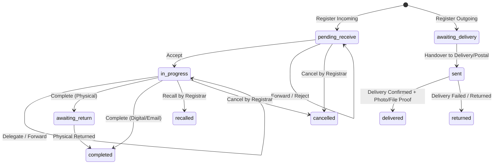

# Construction Design Specification — Correspondence System (.NET 8)

## 1. Functional Design

### 1.1 State Machine Transition Rules

### 1.2 Onward Delegation (BR-2.4-A)
- When a Department Head or Assignee accepts a document task, they can delegate onwards to department subordinates.
- Creates a child `DocumentAssignment` linked to `ParentAssignmentId`.
- Progress is aggregated from leaf assignments to the root assignment.

### 1.3 OTP Authentication Gate for Top Secret Documents (BR-1.4-A to E)
- Restricted Attachment Visibility: Only users who are in the assignment lineage can request OTP.
- OTP generated as 6-digit numeric string with 5-minute validity, sent to LDAP-verified email.
- Upon successful verification, a temporary JWT Token (15-minute expiry) is issued.
- Every preview/download is logged with timestamp, IP, and dynamic watermark metadata.

### 1.4 EDR Outgoing Number Request & Parity Sync
- REST API `/api/v1/edr/request-number` generates official numbers using Thai / English masks (`พ001สอ/2569` / `S001CC/2026`).
- Webhook `/api/v1/edr/webhook/sync` receives callbacks and uses idempotent upsert by tracking `EdrTransactionId`.

---

## 2. NFR Requirements & Design

### 2.1 Security Baseline Compliance (SECURITY-01 to SECURITY-09)
- **Encryption at Rest**: SQL Server Transparent Data Encryption (TDE) / encrypted database connection strings (`Encrypt=True;TrustServerCertificate=True`).
- **Encryption in Transit**: TLS 1.2+ for all HTTP traffic.
- **Authentication**: JWT Bearer Tokens with `HS256` / `RS256` and role claims.
- **Security Headers**: Configured via ASP.NET Core Middleware (`Content-Security-Policy`, `X-Content-Type-Options`, `X-Frame-Options: SAMEORIGIN`, `Referrer-Policy`, `Strict-Transport-Security`).
- **Input Validation**: FluentValidation validators on all input DTOs.
- **Sanitization & Anti-Injection**: EF Core parameterized queries for 100% of database access.

### 2.2 Resiliency Baseline Compliance
- **Polly Policies**: Transient error retries on SQL operations and external HTTP requests with exponential backoff.
- **Health Checks**: Standard `/health` endpoint returning detailed system health (database, storage, external service readiness).

---

## 3. Infrastructure & Deployment Design
- **Runtime**: ASP.NET Core 8 Web API.
- **Database Engine**: Microsoft SQL Server (with EF Core Migrations and Seed initial data).
- **Static Frontend Serving**: ASP.NET Core `UseDefaultFiles()` and `UseStaticFiles()` pointing to the built React Vite SPA (`wwwroot`), with fallback routing to `index.html`.
