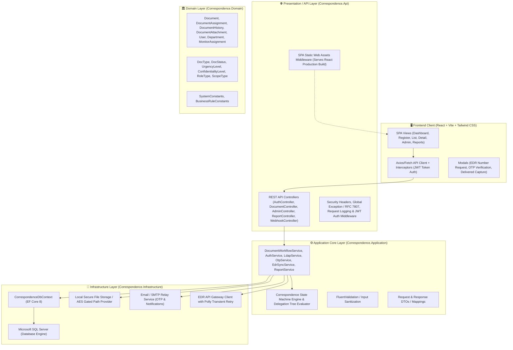
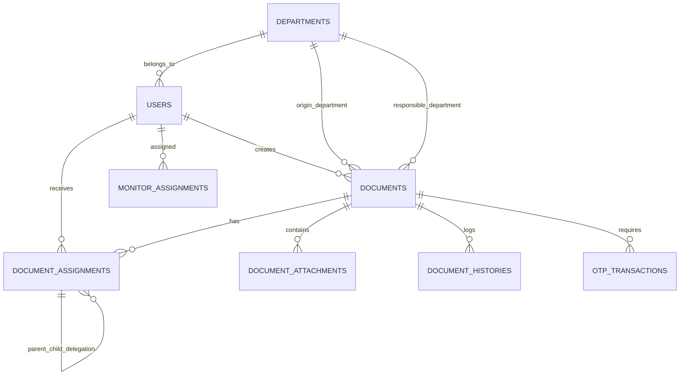

# Application Design — Correspondence Monitoring System (.NET 8)

## 1. System Architecture Overview

The system is designed as a Clean / Layered Architecture running on .NET 8 (C#) with an integrated React SPA frontend:

---

## 2. API Contract Specification

### 2.1 Authentication & User Management
- `POST /api/v1/auth/login`: Authenticate with LDAP/AD credentials, returns JWT Bearer token & user profile.
- `GET /api/v1/auth/me`: Current logged-in user context and permissions.
- `GET /api/v1/admin/users`: List system users with roles and departments.
- `POST /api/v1/admin/users/provision`: Search and provision user from LDAP.
- `PUT /api/v1/admin/users/{id}`: Update user role and department.

### 2.2 Master Data Management
- `GET /api/v1/master/departments`: List active departments and department heads.
- `GET /api/v1/master/workgroups`: List workgroups and members.
- `GET /api/v1/master/delivery-methods`: List delivery methods for outgoing documents.
- `GET /api/v1/master/monitors`: List configured monitor scopes.
- `POST /api/v1/master/monitors`: Create / update monitor assignment.

### 2.3 Document Lifecycle & Workflows
- `GET /api/v1/documents`: Filterable paginated list of incoming and outgoing documents.
- `GET /api/v1/documents/{id}`: Full document details, assignments, attachments, and hierarchical story line.
- `POST /api/v1/documents/incoming`: Register new incoming document with file/camera attachments.
- `POST /api/v1/documents/outgoing`: Register new outgoing document with delivery method.
- `POST /api/v1/documents/{id}/accept`: Accept assigned task (updates Chain of Custody).
- `POST /api/v1/documents/{id}/delegate`: Onward delegation (มอบหมายต่อ) within department.
- `POST /api/v1/documents/{id}/forward`: Forward to another department/user.
- `POST /api/v1/documents/{id}/reject`: Reject task with remarks.
- `POST /api/v1/documents/{id}/complete`: Mark task complete / awaiting physical return.
- `POST /api/v1/documents/{id}/deliver`: Mark outgoing document delivered with proof attachment.
- `POST /api/v1/documents/{id}/recall`: Recall document back to registrar.
- `POST /api/v1/documents/{id}/cancel`: Cancel document with remarks.

### 2.4 Confidential Attachments & OTP Gate
- `POST /api/v1/documents/{id}/otp/request`: Trigger email OTP for Top Secret document.
- `POST /api/v1/documents/{id}/otp/verify`: Verify 6-digit OTP code, returns 15-minute temporary access token.
- `GET /api/v1/documents/{id}/attachments/{attId}/preview`: Gated image/PDF preview with dynamic watermark overlay.
- `GET /api/v1/documents/{id}/attachments/{attId}/download`: Gated file download stream.

### 2.5 EDR System Interoperability & Webhooks
- `GET /api/v1/edr/context`: Pre-flight context check (department abbreviations TH/EN, user verification).
- `POST /api/v1/edr/request-number`: Request outgoing document number (Normal/Special) to EDR.
- `POST /api/v1/edr/webhook/sync`: Reverse webhook receiver for EDR document creations/approvals (Idempotent).

### 2.6 Dashboard & Reports
- `GET /api/v1/dashboard/metrics`: KPI metrics (Incoming, Outgoing, Due soon, Overdue, Completed, In-progress).
- `GET /api/v1/reports/{reportType}`: Reports RPT-01 to RPT-06 with multi-department counting rules.
- `GET /api/v1/reports/{reportType}/export`: Export report to Excel / CSV.

---

## 3. Database Schema & Relational Model

