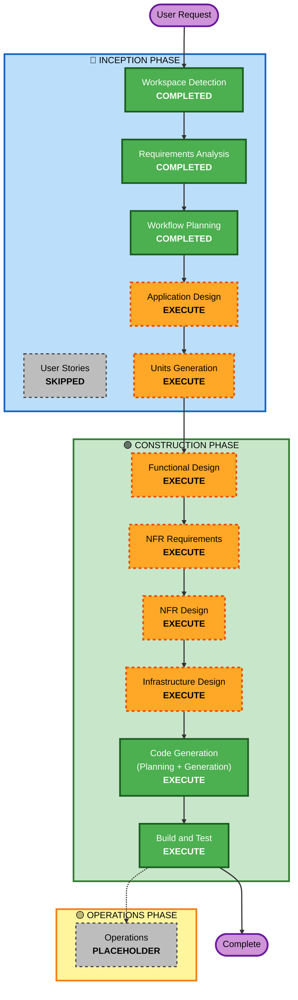

# Execution Plan — Correspondence Monitoring System (.NET 8)

## Detailed Analysis Summary

### Transformation Scope & Greenfield Build
- **Project Type**: Greenfield .NET 8 Full-Stack System with React/Vite UI Mockup Integration.
- **Primary Deliverables**:
  - ASP.NET Core 8 Web API backend following Clean / Layered Architecture.
  - Entity Framework Core 8 with SQL Server support, automated migrations, and domain seed data.
  - Authentication service with JWT Bearer tokens + Dual-mode LDAP (Mock/Seed for development + Production Active Directory configuration).
  - Document Lifecycle & State Machine Engine (Incoming and Outgoing documents, Onward Delegation Tree, Chain of Custody, Recall/Cancel).
  - Secure Attachment Storage with OTP-Gated Access (6-digit email OTP, 15-minute temporary token) & Dynamic Watermarking.
  - EDR Outgoing Number Request Gateway & Bi-directional Parity Webhooks with Idempotency.
  - Dashboard KPI metrics and Multi-Department Reports Aggregator (RPT-01 to RPT-06).
  - Full integration with the React + Vite + Tailwind CSS frontend in `mockup/` preserving 100% of UI/UX styling and features.

### Change Impact Assessment
- **User-facing changes**: Real-time connected UI preserving all Deves theme styling, forms, modals, camera capture, and notifications.
- **Structural changes**: Production-ready .NET 8 Web API backend + Entity Framework Core data layer + integrated SPA hosting.
- **Data model changes**: Robust SQL relational schema matching the ER diagram in SRS `P2026-XXX_Analysis.md`.
- **API changes**: Complete RESTful API surface + Swagger/OpenAPI documentation.
- **NFR impact**: Enforcing Security Baseline, Resiliency Baseline (Polly retries, health checks), and Property-Based Testing.

### Risk Assessment
- **Risk Level**: Medium-High (Comprehensive domain logic and state transitions).
- **Rollback Complexity**: Easy (Git versioned, isolated clean architecture).
- **Testing Complexity**: High (Extensive state transitions, multi-department calculations, OTP security gates).

---

## Workflow Visualization



### Text Alternative
```
Phase 1: INCEPTION
- Stage 1: Workspace Detection (COMPLETED)
- Stage 2: Requirements Analysis (COMPLETED)
- Stage 3: User Stories (SKIPPED - detailed in SRS Analysis)
- Stage 4: Workflow Planning (COMPLETED)
- Stage 5: Application Design (EXECUTE)
- Stage 6: Units Generation (EXECUTE)

Phase 2: CONSTRUCTION (Iterated per unit or integrated units sequence)
- Stage 7: Functional Design (EXECUTE)
- Stage 8: NFR Requirements (EXECUTE)
- Stage 9: NFR Design (EXECUTE)
- Stage 10: Infrastructure Design (EXECUTE)
- Stage 11: Code Generation (EXECUTE)
- Stage 12: Build and Test (EXECUTE)

Phase 3: OPERATIONS
- Stage 13: Operations (PLACEHOLDER)
```

---

## Phases to Execute

### 🔵 INCEPTION PHASE
- [x] Workspace Detection (COMPLETED)
- [x] Requirements Analysis (COMPLETED)
- [x] Execution Plan & Workflow Planning (COMPLETED)
- [x] Application Design (EXECUTE)
  - **Rationale**: Design the backend Clean Architecture, API contracts, entity schemas, and frontend API client services.
- [x] Units Generation (EXECUTE)
  - **Rationale**: Decompose the implementation into structured units for modular development and verification.

### 🟢 CONSTRUCTION PHASE
- [x] Functional Design (EXECUTE)
  - **Rationale**: Define state machine transitions, delegation hierarchy logic, OTP lifecycle, and multi-department aggregation algorithms.
- [x] NFR Requirements & Design (EXECUTE)
  - **Rationale**: Apply Security Baseline (JWT, RBAC, input sanitization, secure headers) and Resiliency Baseline (Polly, health checks).
- [x] Infrastructure Design (EXECUTE)
  - **Rationale**: Configure ASP.NET Core 8 Kestrel, SQL Server connection, static SPA middleware, and attachment file storage.
- [x] Code Generation (EXECUTE - ALWAYS)
  - **Rationale**: Generate all backend code, EF Core migrations, services, controllers, DTOs, tests, and frontend API integration layer.
- [x] Build and Test (EXECUTE - ALWAYS)
  - **Rationale**: Build project, run xUnit and Property-Based tests, verify full-stack operation.
