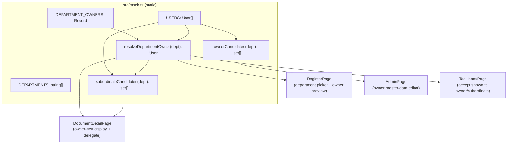

# Design Document

## Overview

This feature adds department-level assignment with owner-first routing and onward delegation to the DVS Correspondence System mockup (React + TypeScript + Tailwind, Vite, Deves theme, static mock data, no backend, no test framework).

Three connected capabilities are introduced:

1. **Department-as-assignee** on the incoming register screen — a registrar can pick whole departments (`assigneeType = 'department'`) alongside individual people.
2. **Department owner master data** — each department carries a reference to an owner user, resolvable through a helper and editable in the Admin master-data area.
3. **Owner-first routing and delegation** — a department assignment routes first to the department owner; after the owner accepts, they may delegate onward to a subordinate, creating a new person-type sub-assignment.

The guiding constraint is *minimal breakage*. Existing code iterates `DEPARTMENTS` as a `string[]` in several places (`DocumentListPage`, `ReportsPage`, `RegisterPage`, `AdminPage` filters, `MONITOR_ASSIGNMENTS` scope options). We therefore keep `DEPARTMENTS: string[]` unchanged and add an owner map plus a resolver helper beside it, rather than converting `DEPARTMENTS` into an array of objects.

Because the mockup uses static mock data, all owner edits and delegations are simulated in component state (`useState`) within the page that performs them. No mock module is mutated at runtime and no persistence layer is involved.

### In-scope files

| File | Change |
|---|---|
| `src/mock.ts` | Add `DEPARTMENT_OWNERS` record + `DEFAULT_OWNER_FALLBACK`; add `resolveDepartmentOwner` and candidate-filter helpers |
| `src/types.ts` | No structural change required (reuse `SubAssignment.assigneeType`); optionally add a local delegation helper type |
| `src/pages/RegisterPage.tsx` | Extend the assignee picker to select departments; show owner per selected department; build typed selections |
| `src/pages/AdminPage.tsx` | Add a "Master Data ฝ่าย/หัวหน้า" tab to view and edit each department's owner |
| `src/pages/DocumentDetailPage.tsx` | Show owner as responsible person for department sub-assignments; add delegate action after owner accepts |
| `src/pages/TaskInboxPage.tsx` | Reflect owner-first (accept presented to owner) and delegated (accept presented to subordinate) routing |
| `P2026-040_Analysis.md` | Documentation-only update: owner-first-then-delegate routing + change-log entry |

## Architecture

The feature is a thin domain layer (pure helpers in `mock.ts`) consumed by four page components. No new routing, transport, or state-management infrastructure is added.



The domain helpers are pure functions of the static mock data. Pages own the *interactive* state (selected assignees, edited owners, delegations) locally so nothing global is mutated — matching the mockup's existing pattern (e.g. `AdminPage` keeps `useState<User[]>(USERS)`).

## Data Models

### Owner mapping (mock.ts)

`DEPARTMENTS` stays a `string[]` for backward compatibility. A parallel record maps department name to owner username, and a resolver turns that into a `User`.

```typescript
// Department → owner username. Values MUST be usernames present in USERS.
export const DEPARTMENT_OWNERS: Record<string, string> = {
  'ฝ่ายการเงิน':          'wichai.c',      // REQ 2.4 — manager of ฝ่ายการเงิน
  'ฝ่ายทรัพยากรบุคคล':    'preeya.w',      // REQ 2.5 — manager of ฝ่ายทรัพยากรบุคคล
  'ฝ่ายกฎหมาย':          'veera.c',       // senior legal officer (no manager in dept)
  'ฝ่ายวิศวกรรม':         'prasit.m',      // project engineer (no manager in dept)
  'ฝ่ายพัสดุและจัดซื้อ':   'pimchanok.t',   // procurement officer (no manager in dept)
  'ฝ่ายสารสนเทศ':         'kittipong.s',   // IT admin (no manager in dept)
  'ฝ่ายบริหาร':           'wilai.p',       // director (executive)
  'ฝ่ายการตลาด':          'somchai.j',     // active fallback — only marketing user is inactive
  'งานสารบรรณ':          'rattana.s',     // head of records (manager)
}

// Fallback owner used only if a department key is missing or its username
// cannot be resolved. Guaranteed to be an active, existing user.
export const DEFAULT_OWNER_FALLBACK: User =
  USERS.find(u => u.username === 'rattana.s' && u.active) ?? USERS[0]
```

Owner selection rationale (satisfies REQ 2.2 / 2.3):

- Departments that have an **active manager-role** user use that manager: `ฝ่ายการเงิน` → `wichai.c`, `ฝ่ายทรัพยากรบุคคล` → `preeya.w`, `งานสารบรรณ` → `rattana.s`.
- Departments with **no manager** use a sensible active user of that department: `ฝ่ายกฎหมาย` → `veera.c`, `ฝ่ายวิศวกรรม` → `prasit.m`, `ฝ่ายพัสดุและจัดซื้อ` → `pimchanok.t`, `ฝ่ายสารสนเทศ` → `kittipong.s`, `ฝ่ายบริหาร` → `wilai.p` (executive).
- `ฝ่ายการตลาด`'s only user (`thanakorn.s`) is inactive, so it falls back to an active user (`somchai.j`) per REQ 2.3.

### Resolver + candidate helpers (mock.ts)

```typescript
/** REQ 2.6 — always returns a User that exists in USERS. */
export function resolveDepartmentOwner(department: string): User {
  const username = DEPARTMENT_OWNERS[department]
  const owner = username ? USERS.find(u => u.username === username) : undefined
  return owner ?? DEFAULT_OWNER_FALLBACK
}

/** REQ 3.2 — active users belonging to the department (candidate owners). */
export function ownerCandidates(department: string): User[] {
  return USERS.filter(u => u.active && u.department === department)
}

/**
 * REQ 5.2 — subordinates = active same-department users who are NOT the owner.
 * (A Subordinate per the glossary: department matches, and is not the owner.)
 */
export function subordinateCandidates(department: string): User[] {
  const owner = resolveDepartmentOwner(department)
  return USERS.filter(
    u => u.active && u.department === department && u.username !== owner.username,
  )
}
```

### Assignee selection shape (RegisterPage)

Today `RegisterPage` tracks `selectedRecipients: string[]` of user *names*. To carry the discriminator without a large refactor, we track typed entries:

```typescript
interface AssigneeSelection {
  key: string                          // unique: username or department name
  label: string                        // display name (user name or department name)
  assigneeType: 'person' | 'department'
  department: string                   // person's dept, or the department itself
  ownerName?: string                   // for departments: resolveDepartmentOwner(dept).name
}
```

State becomes `useState<AssigneeSelection[]>([])`. Persons produce `assigneeType: 'person'`; departments produce `assigneeType: 'department'` with `ownerName` filled from the resolver. This maps directly onto `SubAssignment.assigneeType` when a document is later created.

### Delegation shape (DocumentDetailPage)

Reuses `SubAssignment` (from `types.ts`) — no type change needed. A delegation is a new person-type entry appended to local component state:

```typescript
function buildDelegation(
  parent: SubAssignment,          // the accepted department sub-assignment
  subordinate: User,
): SubAssignment {
  return {
    id: `sa-del-${Date.now()}`,
    docId: parent.docId,
    assigneeName: subordinate.name,
    assigneeType: 'person',       // REQ 5.3
    department: parent.department, // REQ 5.3 — same department
    status: 'pending',            // REQ 5.4
    note: `มอบหมายต่อโดยหัวหน้าฝ่าย (${resolveDepartmentOwner(parent.department).name})`,
  }
}
```

## Components and Interfaces

### RegisterPage — department-as-assignee (REQ 1)

The existing "มอบหมายผู้รับงาน (Assign)" card and its picker modal are extended:

- The picker modal gains a two-segment toggle: **บุคคล (Person)** and **ฝ่าย (Department)**. The person list is the current `USERS` filter; the department list renders `DEPARTMENTS` with each row showing the department name and, as a subtitle, `หัวหน้า/เจ้าของฝ่าย: {resolveDepartmentOwner(dept).name}` (REQ 1.4).
- Selecting a department calls a `toggleDepartment(dept)` that adds/removes an `AssigneeSelection` with `assigneeType: 'department'` and `ownerName`. Selecting a person keeps working via a `togglePerson(user)` producing `assigneeType: 'person'` (REQ 1.2, 1.3, 1.6).
- The selected-list panel renders both kinds: departments use the `Building2` icon and show the owner line; persons keep the avatar/department line. Removing either calls the matching toggle (REQ 1.5).
- The `responsibleDepartment` summary continues to derive from the last selected entry (department entries contribute their own department name).

No new modal component is created; the existing `Modal` from `components/ui` is reused with an added mode toggle.

### AdminPage — owner master data (REQ 3)

A third tab is added to the existing tab bar (`users` | `monitor` → add `master-data`), labelled "Master Data ฝ่าย/หัวหน้า" (aligns with ROLE-05 "จัดการ Master Data ฝ่าย/หัวหน้า").

- **List view:** a table of `DEPARTMENTS`, each row showing the department name and the current owner name from local state `useState<Record<string,string>>(DEPARTMENT_OWNERS)` resolved through `USERS` (REQ 3.1).
- **Editor modal:** opened per department. A `<select>` is populated by `ownerCandidates(department)` — active users of that department (REQ 3.2). The confirm button is disabled while no user is selected (REQ 3.5).
- **Confirm:** updates the local owner map for that department and calls `showToast` with a message naming the department and the new owner (REQ 3.3, 3.4), e.g. `กำหนดหัวหน้า/เจ้าของฝ่าย {dept} เป็น {ownerName} เรียบร้อย`.

Owner edits live in `AdminPage` component state only (simulated master data), mirroring how the Users and Monitor tabs already keep local copies.

### DocumentDetailPage — owner-first display + delegation (REQ 4, 5)

Sub-assignments are already merged into the Story Line timeline via `subs.map(...)`. Two changes:

**Owner-first display (REQ 4.1, 4.2).** For any entry where `assigneeType === 'department'`, the card shows the responsible person as `resolveDepartmentOwner(s.department).name` with a label like `ผู้รับผิดชอบ (หัวหน้า/เจ้าของฝ่าย)`. This is presentation-only and derived, so existing mock rows (e.g. `doc-001` department subs) render owner-first without data changes.

**Accept as owner (REQ 4.4).** Accepting a department sub-assignment sets its status to `accepted` in local `useState<SubAssignment[]>` seeded from `SUB_ASSIGNMENTS[doc.id]` and records the accepting user as the owner (stored via `acceptedAt` + a derived `acceptedBy = owner.name` shown in the card). The page-level action panel's existing accept flow is reused; department context resolves the owner.

**Delegate action (REQ 5).** When a department sub-assignment is in `accepted` status and the acting user is its owner, a **"มอบหมายต่อ (Delegate)"** button appears on that sub-assignment card (REQ 5.1). It opens a `Modal` whose `<select>` is populated by `subordinateCandidates(s.department)` (REQ 5.2); confirm is disabled while nothing is selected (REQ 5.6). Confirming calls `buildDelegation(...)`, appends the new `pending` person-type sub-assignment to local state (REQ 5.3, 5.4), and shows a toast naming the delegated subordinate (REQ 5.7). Because state is local, the new sub-assignment appears immediately in the timeline.

Since the mockup has a static `CURRENT_USER`, "the acting user is the owner" is simulated: the delegate control is shown for accepted department sub-assignments (optionally gated by comparing `CURRENT_USER.username` to the owner when it matches), and the demo flow lets the reviewer accept-then-delegate on screen.

### TaskInboxPage — routing reflection (REQ 4.3, 5.5)

`TaskInboxPage` reads from static `TASKS`. To reflect owner-first and delegated routing without a backend:

- Pending department sub-assignments surface an accept task addressed to the owner (`senderName`/assignee context shows the owner), so the accept action in the `waiting-accept` tab is presented to the department owner (REQ 4.3).
- After a delegation is created, the accept task is addressed to the selected subordinate (REQ 5.5).

Because tasks are static mock data, this is represented by ensuring the accept action's recipient labelling derives from the owner (for department items) or the delegated subordinate (for delegation items). The existing accept confirmation flow is unchanged; only the recipient attribution reflects routing.

## Error Handling

- **Missing/invalid owner mapping:** `resolveDepartmentOwner` never throws — an unknown department or an unresolvable username falls back to `DEFAULT_OWNER_FALLBACK`, guaranteeing a valid `User` (REQ 2.6). This keeps every render path total.
- **Empty owner selection (Admin):** confirm disabled (REQ 3.5); no state change possible.
- **Empty subordinate selection (Delegate):** confirm disabled (REQ 5.6); `buildDelegation` is never called without a subordinate.
- **Department with no subordinates:** `subordinateCandidates` returns `[]`; the delegate modal shows an empty-state message and confirm stays disabled.
- **Duplicate selection:** toggles are set-like (add if absent, remove if present), so selecting the same department/person twice cannot create duplicates.

## Testing Strategy

No test framework is installed. Verification is **Build_Verification** (REQ 7): TypeScript type-check and Vite production build must both pass with no errors.

```
pnpm exec tsc --noEmit      # or: pnpm run build (vite build runs tsc first)
pnpm run build              # vite production build
```

Manual/visual verification covers the EXAMPLE- and EDGE_CASE-classified criteria (picker presence, owner rows, toasts, disabled-confirm guards). The correctness properties below describe the pure helpers (`resolveDepartmentOwner`, `ownerCandidates`, `subordinateCandidates`, selection tagging, `buildDelegation`). They are written to be executable should a property-based test runner (e.g. `fast-check`) be added later; each would run a minimum of 100 iterations and be tagged with its feature/property reference. Until then they serve as the specification the helpers must satisfy and are checked by reasoning + the type/build gate.

## Correctness Properties

*A property is a characteristic or behavior that should hold true across all valid executions of a system — essentially, a formal statement about what the system should do. Properties serve as the bridge between human-readable specifications and machine-verifiable correctness guarantees.*

### Property 1: Owner resolution integrity

*For any* department name `d` in `DEPARTMENTS`, `resolveDepartmentOwner(d)` returns exactly one `User` that exists in `USERS`.

**Validates: Requirements 2.1, 2.3, 2.6**

### Property 2: Manager-first owner rule

*For any* department in `DEPARTMENTS` that has at least one active manager-role user, `resolveDepartmentOwner(department)` returns a user whose `role` is `manager` and whose `department` equals that department.

**Validates: Requirements 2.2**

### Property 3: Selection type tagging

*For any* mixed selection built in RegisterPage, every entry created from a department has `assigneeType === 'department'` with its `department` equal to the selected department name, and every entry created from a person has `assigneeType === 'person'` with its `department` equal to that user's department.

**Validates: Requirements 1.2, 1.3, 1.6**

### Property 4: Owner-candidate filter validity

*For any* department, every user returned by `ownerCandidates(department)` is active and has `department` equal to that department.

**Validates: Requirements 3.2**

### Property 5: Owner-first routing derivation

*For any* department sub-assignment (an entry with `assigneeType === 'department'`), the responsible first acceptor displayed equals `resolveDepartmentOwner(entry.department)`.

**Validates: Requirements 4.1, 4.2**

### Property 6: Subordinate-candidate filter validity

*For any* department, every user returned by `subordinateCandidates(department)` is active, has `department` equal to that department, and is not the department's owner.

**Validates: Requirements 5.2**

### Property 7: Delegation construction invariants

*For any* accepted department sub-assignment and any subordinate returned by `subordinateCandidates(parent.department)`, `buildDelegation(parent, subordinate)` produces a sub-assignment whose `assigneeType` is `'person'`, whose `assigneeName` is the selected subordinate's name, whose `department` equals the parent's department, and whose initial `status` is `'pending'`.

**Validates: Requirements 5.3, 5.4**
